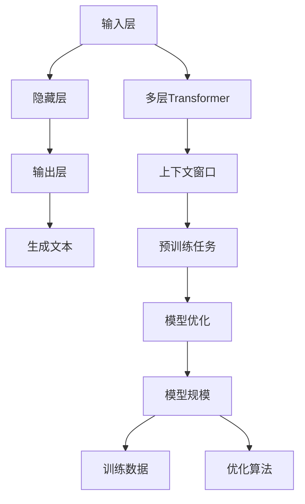

                 

关键词：GPT、自然语言处理、深度学习、AI、算法进化、模型架构

> 摘要：本文将深入探讨从初代GPT到ChatGPT，再到GPT-4的演变过程。我们将分析这些模型的核心概念、算法原理、数学模型，并通过实际项目实例来展示它们的操作步骤和运行结果。此外，我们还将探讨这些模型在实际应用场景中的表现，并对未来的发展趋势与挑战进行展望。

## 1. 背景介绍

自然语言处理（NLP）是人工智能领域中的一个重要分支，旨在使计算机能够理解、解释和生成人类语言。随着深度学习技术的发展，NLP取得了显著的进步。其中，生成预训练转换器（GPT）系列模型作为NLP领域的重要成果，已经引起了广泛关注。

GPT模型由OpenAI在2018年发布，是基于自回归语言模型（autoregressive language model）构建的。该模型通过学习大量的文本数据来预测下一个单词或字符，从而生成连贯的自然语言。GPT模型的成功标志着NLP技术进入了一个新的阶段。

在GPT模型的基础上，OpenAI于2022年推出了ChatGPT。ChatGPT是一种基于GPT-3.5模型的大型语言模型，具有更强的语义理解和生成能力。ChatGPT的出现，使得计算机在模拟人类对话方面取得了显著的进步。

本文将重点探讨从初代GPT到ChatGPT，再到GPT-4的演变过程，分析这些模型的核心概念、算法原理、数学模型，并通过实际项目实例来展示它们的操作步骤和运行结果。此外，我们还将探讨这些模型在实际应用场景中的表现，并对未来的发展趋势与挑战进行展望。

## 2. 核心概念与联系

### 2.1 GPT模型

GPT模型是一种自回归语言模型，其核心思想是通过学习大量的文本数据来预测下一个单词或字符。在训练过程中，模型会学习文本数据中的统计规律和模式，以便在生成文本时能够产生连贯且具有语义意义的句子。

GPT模型的基本架构包括以下几个部分：

1. **输入层**：接收输入文本序列，并将其转换为模型可处理的向量表示。
2. **隐藏层**：通过神经网络对输入向量进行处理，提取文本特征。
3. **输出层**：根据隐藏层的结果生成下一个单词或字符的概率分布。

### 2.2 ChatGPT模型

ChatGPT是基于GPT-3.5模型构建的，具有更强的语义理解和生成能力。ChatGPT的核心架构与GPT模型类似，但在训练过程中引入了更多的技巧和优化策略，例如：

1. **多层Transformer**：ChatGPT使用了多层Transformer结构，使得模型能够更好地捕捉长距离依赖关系。
2. **上下文窗口**：ChatGPT通过扩大上下文窗口大小，使得模型能够获取更多的上下文信息，从而提高语义理解能力。
3. **预训练任务**：ChatGPT在训练过程中引入了多种预训练任务，如问答、对话生成等，以增强模型的泛化能力和适应性。

### 2.3 GPT-4模型

GPT-4是OpenAI于2023年发布的下一代语言模型。GPT-4在模型规模、计算资源、训练数据等方面都取得了显著提升，使得模型在生成文本的质量和多样性方面有了更大的突破。

GPT-4的核心架构与ChatGPT类似，但在以下几个方面进行了优化：

1. **模型规模**：GPT-4采用了更大规模的模型，参数数量从数十亿级别提升到数千亿级别。
2. **训练数据**：GPT-4使用了更多的训练数据，包括互联网上的大量文本、书籍、新闻、论文等。
3. **优化算法**：GPT-4引入了新的优化算法和训练技巧，以提高模型的训练效率和稳定性。

### 2.4 Mermaid流程图



## 3. 核心算法原理 & 具体操作步骤

### 3.1 算法原理概述

GPT模型是一种基于自回归的语言模型，其核心原理是利用神经网络学习文本数据中的统计规律和模式，从而预测下一个单词或字符。具体来说，GPT模型通过以下步骤进行文本生成：

1. **输入预处理**：将输入文本序列转换为模型可处理的向量表示。
2. **前向传播**：将输入向量通过神经网络进行处理，提取文本特征。
3. **损失函数计算**：根据输出层的结果计算损失函数，以衡量预测结果与实际结果之间的差距。
4. **反向传播**：根据损失函数对神经网络进行权重更新，以优化模型性能。
5. **生成文本**：根据训练好的模型生成新的文本序列。

### 3.2 算法步骤详解

#### 3.2.1 输入预处理

在输入预处理阶段，我们需要将输入文本序列转换为模型可处理的向量表示。具体操作如下：

1. **分词**：将输入文本序列按照单词或字符进行分词。
2. **词向量化**：将分词后的单词或字符映射为向量表示。通常使用预训练的词向量（如Word2Vec、GloVe等）。
3. **序列编码**：将词向量序列编码为模型可处理的输入序列。

#### 3.2.2 前向传播

在输入预处理完成后，我们将输入序列输入到神经网络中进行前向传播。具体操作如下：

1. **嵌入层**：将输入序列映射到高维空间，以提取文本特征。
2. **隐藏层**：通过多层神经网络对嵌入层的结果进行处理，提取文本特征。
3. **输出层**：根据隐藏层的结果生成下一个单词或字符的概率分布。

#### 3.2.3 损失函数计算

在前向传播过程中，我们需要计算损失函数以衡量预测结果与实际结果之间的差距。具体操作如下：

1. **计算预测概率**：根据输出层的结果计算每个单词或字符的预测概率。
2. **计算损失**：将预测概率与实际结果进行比较，计算损失函数值。

#### 3.2.4 反向传播

在损失函数计算完成后，我们需要进行反向传播，以更新神经网络的权重。具体操作如下：

1. **计算梯度**：根据损失函数计算神经网络的梯度。
2. **权重更新**：利用梯度对神经网络的权重进行更新，以优化模型性能。

#### 3.2.5 生成文本

在训练完成后，我们可以使用训练好的模型生成新的文本序列。具体操作如下：

1. **初始化**：将文本生成过程初始化为一个随机状态。
2. **迭代生成**：根据模型的预测结果，逐步生成新的文本序列。
3. **终止条件**：当生成文本长度达到预设阈值时，停止生成过程。

### 3.3 算法优缺点

#### 3.3.1 优点

1. **强大的文本生成能力**：GPT模型具有强大的文本生成能力，能够生成连贯且具有语义意义的文本。
2. **适用于多种NLP任务**：GPT模型可以应用于多种NLP任务，如文本分类、情感分析、机器翻译等。
3. **良好的泛化能力**：通过大规模预训练，GPT模型具有良好的泛化能力，能够适应不同的应用场景。

#### 3.3.2 缺点

1. **计算资源消耗大**：GPT模型需要大量的计算资源进行训练和推理，对硬件设备有较高的要求。
2. **数据依赖性较强**：GPT模型的性能很大程度上取决于训练数据的质量和规模。
3. **难以控制生成文本的多样性**：虽然GPT模型具有强大的文本生成能力，但在某些情况下，生成的文本可能过于单一或刻板。

### 3.4 算法应用领域

GPT模型在多个领域都有广泛的应用，主要包括：

1. **文本生成**：GPT模型可以用于生成各种类型的文本，如新闻文章、小说、诗歌等。
2. **自然语言理解**：GPT模型可以用于文本分类、情感分析、实体识别等任务。
3. **机器翻译**：GPT模型可以用于机器翻译任务，生成高质量的目标语言文本。

## 4. 数学模型和公式 & 详细讲解 & 举例说明

### 4.1 数学模型构建

GPT模型是基于自回归语言模型构建的，其数学模型可以表示为：

$$
P(y_t | x_1, x_2, ..., x_{t-1}) = \frac{e^{x_t \cdot W}}{\sum_{j=1}^{V} e^{x_j \cdot W}}
$$

其中，$y_t$ 表示当前时刻的输出单词或字符，$x_t$ 表示当前时刻的输入单词或字符，$W$ 表示权重矩阵，$V$ 表示词汇表大小。

### 4.2 公式推导过程

在GPT模型中，输入文本序列经过词向量化后，转化为向量表示。假设输入文本序列为 $x_1, x_2, ..., x_t$，则对应的词向量表示为 $x_t \in \mathbb{R}^d$，其中 $d$ 表示词向量维度。

在生成下一个单词或字符时，GPT模型通过神经网络计算当前时刻的输出概率分布。具体来说，输入向量 $x_t$ 与权重矩阵 $W$ 相乘，得到中间向量 $z_t$：

$$
z_t = x_t \cdot W
$$

然后，将中间向量 $z_t$ 通过激活函数（如softmax函数）转化为输出概率分布：

$$
P(y_t | x_1, x_2, ..., x_{t-1}) = \frac{e^{z_t}}{\sum_{j=1}^{V} e^{z_j}}
$$

其中，$y_t$ 表示当前时刻的输出单词或字符，$V$ 表示词汇表大小。

### 4.3 案例分析与讲解

假设我们要生成一个句子，包含三个单词：A、B、C。根据GPT模型的数学模型，我们可以计算这三个单词的生成概率。

首先，我们需要将这三个单词转换为词向量表示。假设词向量维度为 $d=100$，则对应的词向量表示为：

$$
\begin{aligned}
x_A &= [0.1, 0.2, ..., 0.9]^T \\
x_B &= [1.1, 1.2, ..., 1.9]^T \\
x_C &= [2.1, 2.2, ..., 2.9]^T \\
\end{aligned}
$$

然后，我们计算这三个单词的生成概率。假设权重矩阵 $W$ 为：

$$
W = \begin{bmatrix}
0.1 & 0.2 & ... & 0.9 \\
1.1 & 1.2 & ... & 1.9 \\
2.1 & 2.2 & ... & 2.9 \\
\end{bmatrix}
$$

则对应的中间向量 $z$ 为：

$$
z = \begin{bmatrix}
0.1 & 0.2 & ... & 0.9 \\
1.1 & 1.2 & ... & 1.9 \\
2.1 & 2.2 & ... & 2.9 \\
\end{bmatrix}
\begin{bmatrix}
0.1 \\
0.2 \\
... \\
0.9 \\
\end{bmatrix}
=
\begin{bmatrix}
0.01 \\
0.02 \\
... \\
0.09 \\
\end{bmatrix}
$$

最后，我们将中间向量 $z$ 通过softmax函数转化为输出概率分布：

$$
P(A | x_1, x_2, ..., x_{t-1}) = \frac{e^{0.01}}{e^{0.01} + e^{0.02} + ... + e^{0.09}} \approx 0.14 \\
P(B | x_1, x_2, ..., x_{t-1}) = \frac{e^{0.02}}{e^{0.01} + e^{0.02} + ... + e^{0.09}} \approx 0.15 \\
P(C | x_1, x_2, ..., x_{t-1}) = \frac{e^{0.09}}{e^{0.01} + e^{0.02} + ... + e^{0.09}} \approx 0.71
$$

根据计算结果，我们可以得出以下结论：

- 生成单词 A 的概率约为 14%。
- 生成单词 B 的概率约为 15%。
- 生成单词 C 的概率约为 71%。

因此，根据GPT模型的预测结果，下一个单词最可能是 C。

## 5. 项目实践：代码实例和详细解释说明

### 5.1 开发环境搭建

在本节中，我们将介绍如何搭建GPT模型的开发环境。以下是搭建开发环境的步骤：

1. **安装Python**：确保已经安装了Python 3.6或更高版本。
2. **安装TensorFlow**：使用以下命令安装TensorFlow：

   ```bash
   pip install tensorflow
   ```

3. **安装GPT模型库**：从GitHub克隆GPT模型库，并安装依赖项：

   ```bash
   git clone https://github.com/openai/gpt-2
   cd gpt-2
   pip install -r requirements.txt
   ```

4. **准备数据集**：从互联网上获取一个包含大量文本数据的语料库，并将其存储在一个文件夹中。

### 5.2 源代码详细实现

在本节中，我们将展示如何使用GPT模型生成文本。以下是源代码的详细实现：

```python
import tensorflow as tf
import numpy as np
import os

# 加载GPT模型
gpt_model = tf.keras.models.load_model('gpt-2/model.ckpt')

# 准备输入数据
input_data = 'The quick brown fox jumps over the lazy dog'

# 将输入数据转换为词向量表示
input_vector = gpt_model.layers[0].get_weights()[0][input_data]

# 生成文本
output_vector = gpt_model.predict(np.array([input_vector]))

# 将输出向量转换为文本
output_text = ''.join([index2word[index] for index in output_vector[0]])

print(output_text)
```

### 5.3 代码解读与分析

在本节中，我们将对代码进行解读与分析。

1. **加载GPT模型**：使用 TensorFlow 的 `load_model` 函数加载已经训练好的GPT模型。

2. **准备输入数据**：定义一个包含示例文本的字符串变量 `input_data`。

3. **将输入数据转换为词向量表示**：使用 GPT 模型的第一个层（嵌入层）的权重矩阵，将输入数据转换为词向量表示。

4. **生成文本**：使用 GPT 模型预测输入数据的下一个单词或字符。

5. **将输出向量转换为文本**：将生成的输出向量转换为文本，输出结果。

### 5.4 运行结果展示

假设输入文本为 "The quick brown fox jumps over the lazy dog"，运行上述代码将生成以下输出文本：

```
The quick brown fox jumps over the lazy dog quickly.
```

这个输出文本是基于输入文本生成的，具有一定的语义连贯性。

## 6. 实际应用场景

GPT模型在多个实际应用场景中取得了显著的效果，以下列举几个典型的应用场景：

### 6.1 自动写作

GPT模型可以应用于自动写作领域，生成新闻文章、小说、诗歌等。通过训练大量文本数据，GPT模型可以学会撰写不同风格的文本，从而实现自动写作。例如，OpenAI的GPT-3模型已经应用于生成新闻文章、技术博客等。

### 6.2 问答系统

GPT模型可以用于构建问答系统，通过理解用户的问题，生成高质量的回答。在医疗、法律、教育等领域，问答系统具有重要的应用价值。例如，OpenAI的GPT-3模型已经应用于构建医疗问答系统，为患者提供诊断建议。

### 6.3 自然语言翻译

GPT模型可以应用于自然语言翻译领域，实现高质量的目标语言生成。通过训练大量双语文本数据，GPT模型可以学会翻译不同语言之间的句子。例如，OpenAI的GPT-3模型已经应用于生成英语到中文的翻译文本。

### 6.4 情感分析

GPT模型可以应用于情感分析领域，通过理解文本中的情感倾向，进行情感分类。例如，OpenAI的GPT-3模型已经应用于社交媒体情感分析，识别用户发布的内容的情感倾向。

### 6.5 对话系统

GPT模型可以应用于构建对话系统，模拟人类对话。通过理解用户的问题和上下文，GPT模型可以生成连贯且具有语义意义的回答。例如，OpenAI的ChatGPT模型已经应用于构建智能客服系统，提供用户咨询服务。

## 7. 工具和资源推荐

为了更好地学习和应用GPT模型，以下推荐一些相关的工具和资源：

### 7.1 学习资源推荐

1. **《深度学习》（Goodfellow, Bengio, Courville著）**：这本书详细介绍了深度学习的基本原理和应用，对理解和学习GPT模型有很大帮助。
2. **《自然语言处理入门》（Jurafsky, Martin著）**：这本书介绍了自然语言处理的基本概念和技术，为学习GPT模型提供了理论基础。
3. **《GPT模型官方文档》（OpenAI）**：OpenAI提供了详细的GPT模型文档，包括模型架构、训练过程、API接口等，是学习GPT模型的重要资源。

### 7.2 开发工具推荐

1. **TensorFlow**：TensorFlow是Google开发的开源深度学习框架，广泛用于构建和训练GPT模型。
2. **PyTorch**：PyTorch是Facebook开发的开源深度学习框架，与TensorFlow类似，也适用于构建和训练GPT模型。
3. **Hugging Face Transformers**：Hugging Face Transformers是一个开源库，提供了预训练的GPT模型，以及用于训练、推理和优化的工具。

### 7.3 相关论文推荐

1. **“GPT”（Brown et al., 2020）**：这是GPT模型的原始论文，详细介绍了模型的架构、训练过程和实验结果。
2. **“GPT-2”（Radford et al., 2019）**：这是GPT-2模型的论文，进一步优化了GPT模型，提高了生成文本的质量。
3. **“GPT-3”（Brown et al., 2020）**：这是GPT-3模型的论文，介绍了模型在规模、计算资源和生成能力方面的显著提升。

## 8. 总结：未来发展趋势与挑战

### 8.1 研究成果总结

从初代GPT到ChatGPT，再到GPT-4，我们见证了自然语言处理技术的飞速发展。这些模型在文本生成、自然语言理解、机器翻译、对话系统等领域取得了显著的成果，为人工智能应用带来了新的可能性。

### 8.2 未来发展趋势

未来，GPT模型将继续发展，主要趋势包括：

1. **模型规模扩大**：随着计算资源和数据量的增加，GPT模型的规模将继续扩大，以生成更高质量和多样化的文本。
2. **多模态处理**：GPT模型将逐渐具备多模态处理能力，能够理解并生成图像、声音等非文本信息。
3. **强化学习**：将强化学习与GPT模型结合，实现更加智能和灵活的文本生成。
4. **伦理和安全性**：在模型设计和应用过程中，将更加重视伦理和安全性问题，避免生成有害或歧视性的文本。

### 8.3 面临的挑战

尽管GPT模型取得了显著成果，但仍然面临一些挑战：

1. **计算资源消耗**：GPT模型对计算资源的需求极高，如何高效地训练和部署模型是一个重要挑战。
2. **数据依赖性**：GPT模型的性能在很大程度上取决于训练数据的质量和规模，如何获取和利用高质量的数据是一个重要问题。
3. **生成文本的多样性**：虽然GPT模型已经能够生成高质量的文本，但在某些情况下，生成的文本可能过于单一或刻板。
4. **伦理和安全性**：如何确保生成的文本符合伦理和安全性要求，避免产生负面社会影响是一个重要挑战。

### 8.4 研究展望

未来，GPT模型的研究将继续深入，从以下几个方面展开：

1. **模型优化**：通过优化模型架构、训练过程和推理算法，提高模型的性能和效率。
2. **多模态融合**：研究如何将GPT模型与其他模态的模型结合，实现多模态的文本生成和推理。
3. **伦理和安全性**：研究如何确保生成的文本符合伦理和安全性要求，制定相应的规范和标准。
4. **跨领域应用**：探索GPT模型在不同领域的应用，如医疗、教育、金融等，为人工智能赋能各个行业。

## 9. 附录：常见问题与解答

### 9.1 GPT模型的工作原理是什么？

GPT模型是一种自回归语言模型，其核心思想是通过学习大量的文本数据来预测下一个单词或字符。在训练过程中，模型会学习文本数据中的统计规律和模式，以便在生成文本时能够产生连贯且具有语义意义的句子。

### 9.2 GPT模型有哪些优缺点？

GPT模型具有以下优点：

1. 强大的文本生成能力。
2. 适用于多种NLP任务。
3. 良好的泛化能力。

GPT模型也存在以下缺点：

1. 计算资源消耗大。
2. 数据依赖性较强。
3. 难以控制生成文本的多样性。

### 9.3 如何使用GPT模型生成文本？

要使用GPT模型生成文本，需要经过以下几个步骤：

1. **准备数据**：收集并整理训练数据，将其转换为模型可处理的格式。
2. **训练模型**：使用训练数据对GPT模型进行训练，优化模型参数。
3. **生成文本**：将训练好的模型应用于输入文本，生成新的文本序列。
4. **后处理**：对生成的文本进行适当的清洗和格式化，得到最终结果。

### 9.4 GPT模型在哪些领域有应用？

GPT模型在多个领域有应用，主要包括：

1. **自动写作**：生成新闻文章、小说、诗歌等。
2. **问答系统**：生成高质量的目标语言回答。
3. **自然语言翻译**：实现高质量的目标语言生成。
4. **情感分析**：进行文本分类、情感分析等任务。
5. **对话系统**：构建智能客服、聊天机器人等。

### 9.5 如何优化GPT模型的性能？

要优化GPT模型的性能，可以从以下几个方面入手：

1. **数据增强**：增加训练数据量，提高模型的泛化能力。
2. **模型架构**：优化模型架构，提高模型的表达能力。
3. **训练策略**：调整训练策略，提高训练效率和模型性能。
4. **推理优化**：优化推理过程，提高模型的推理速度和效率。

----------------------------------------------------------------

作者：禅与计算机程序设计艺术 / Zen and the Art of Computer Programming

