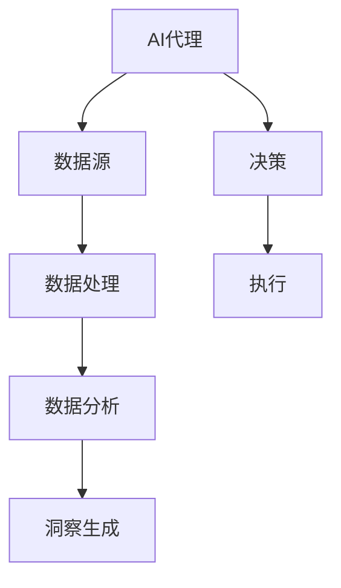

                 

关键词：AI代理、工作流、分析引擎、数据洞察、机器学习、深度学习、实时分析、云计算

> 摘要：本文将深入探讨AI代理工作流中的分析引擎，从数据收集、处理到洞察生成的全流程，分析其核心概念、算法原理、数学模型、实际应用及未来展望。文章旨在为读者提供一个全面、系统的理解，帮助其在实际项目中更好地应用分析引擎技术。

## 1. 背景介绍

随着大数据和人工智能技术的迅猛发展，数据分析和处理变得越来越重要。传统的数据处理方法已经无法满足快速变化的数据环境和复杂的需求，因此，AI代理工作流中的分析引擎应运而生。分析引擎作为一种自动化、智能化的数据处理工具，能够从海量数据中提取有价值的信息，为企业提供洞察和决策支持。

分析引擎在金融、医疗、零售、制造等行业具有广泛的应用。例如，在金融领域，分析引擎可以实时监控市场动态，预测投资机会；在医疗领域，分析引擎可以帮助医生进行疾病诊断和治疗方案推荐；在零售领域，分析引擎可以优化库存管理和促销策略。

本文将围绕分析引擎的核心概念、算法原理、数学模型、实际应用和未来展望进行详细探讨，以帮助读者深入了解这一关键技术。

## 2. 核心概念与联系

### 2.1 AI代理

AI代理是指通过人工智能技术实现自主行动、与环境和人类交互的实体。AI代理具有感知、决策和执行能力，能够在复杂环境中实现自主学习和自适应。在分析引擎中，AI代理负责从数据源中收集和处理数据，为分析提供输入。

### 2.2 工作流

工作流是指一组按照特定顺序执行的任务，用于完成某个业务目标。在分析引擎中，工作流负责组织和管理数据采集、处理、分析和洞察生成的过程。工作流通常包括数据源接入、数据清洗、数据预处理、模型训练、预测和决策等环节。

### 2.3 分析引擎

分析引擎是一种基于人工智能技术的数据处理工具，用于从数据中提取有价值的信息。分析引擎通常包括数据采集、数据处理、数据分析和洞察生成等模块。分析引擎能够实现实时分析、批量分析和离线分析，满足不同场景的需求。

### 2.4 数据源

数据源是指提供数据的来源，可以是数据库、文件、网络接口等。数据源接入是分析引擎的第一步，需要确保数据源的稳定性和安全性。在分析引擎中，数据源接入模块负责连接数据源，读取和传输数据。

### 2.5 数据处理

数据处理是指对采集到的数据进行清洗、转换和整合的过程。数据处理模块负责去除数据中的噪声、缺失值和异常值，将数据转换为适合分析和建模的格式。数据处理在分析引擎中至关重要，直接影响分析结果的准确性和可靠性。

### 2.6 数据分析

数据分析是指使用统计、机器学习和深度学习等方法对数据进行挖掘和分析的过程。数据分析模块负责从数据中提取有价值的信息，为决策提供支持。数据分析在分析引擎中扮演着核心角色，决定着分析结果的深度和广度。

### 2.7 洞察生成

洞察生成是指将分析结果以可视化的形式呈现，帮助用户理解和利用数据。洞察生成模块负责将分析结果转化为易于理解和操作的形式，如图表、报告、推荐等。洞察生成在分析引擎中起着关键作用，直接影响用户的决策效果。

### 2.8 Mermaid 流程图

以下是一个简单的Mermaid流程图，展示了AI代理工作流中的分析引擎的核心概念和联系：



## 3. 核心算法原理 & 具体操作步骤

### 3.1 算法原理概述

分析引擎的核心算法主要包括数据采集、数据处理、数据分析和洞察生成等模块。以下分别对这些模块的算法原理进行概述。

#### 3.1.1 数据采集

数据采集算法主要基于网络爬虫、API接口和数据库连接等方式。网络爬虫可以从互联网上抓取结构化和非结构化数据，API接口可以从第三方服务获取数据，数据库连接则可以读取数据库中的数据。数据采集算法的目标是确保数据的实时性和完整性。

#### 3.1.2 数据处理

数据处理算法主要包括数据清洗、数据转换和数据整合等步骤。数据清洗算法用于去除数据中的噪声、缺失值和异常值；数据转换算法用于将数据格式转换为适合分析和建模的格式；数据整合算法用于将多个数据源的数据进行合并和关联。数据处理算法的目标是确保数据的准确性和一致性。

#### 3.1.3 数据分析

数据分析算法主要包括统计分析和机器学习。统计分析算法用于描述数据的分布、相关性等特征，为后续建模提供基础；机器学习算法用于从数据中学习规律，构建预测模型。数据分析算法的目标是提取数据中的有价值信息。

#### 3.1.4 洞察生成

洞察生成算法主要包括数据可视化、报告生成和推荐系统等。数据可视化算法用于将分析结果以图表、报表等形式呈现；报告生成算法用于生成详细的报告，为决策提供支持；推荐系统算法用于根据用户的历史行为和偏好推荐相关内容。洞察生成算法的目标是使分析结果易于理解和操作。

### 3.2 算法步骤详解

#### 3.2.1 数据采集

1. 确定数据源：根据分析需求，选择合适的数据源，如数据库、API接口、网络爬虫等。
2. 连接数据源：使用适当的连接方式，如ODBC、HTTP请求等，连接到数据源。
3. 读取数据：从数据源中读取数据，并存储到内存或数据库中。
4. 数据预处理：对采集到的数据进行预处理，如去重、过滤等，确保数据的实时性和完整性。

#### 3.2.2 数据处理

1. 数据清洗：去除数据中的噪声、缺失值和异常值，确保数据的准确性。
2. 数据转换：将数据格式转换为适合分析和建模的格式，如将文本数据转换为数值数据。
3. 数据整合：将多个数据源的数据进行合并和关联，形成统一的数据视图。

#### 3.2.3 数据分析

1. 统计分析：使用统计方法对数据进行描述性分析，如计算均值、中位数、方差等。
2. 机器学习：使用机器学习方法对数据进行建模，如决策树、支持向量机、神经网络等。
3. 特征工程：提取数据中的特征，为建模提供支持。

#### 3.2.4 洞察生成

1. 数据可视化：使用图表、报表等形式将分析结果呈现给用户。
2. 报告生成：生成详细的报告，为决策提供支持。
3. 推荐系统：根据用户的历史行为和偏好推荐相关内容。

### 3.3 算法优缺点

#### 3.3.1 优点

1. 自动化：分析引擎可以实现自动化数据处理和分析，降低人工干预。
2. 实时性：分析引擎可以实时采集和处理数据，提供及时的洞察和决策支持。
3. 灵活性：分析引擎可以灵活地适应不同场景的需求，支持多种数据源、分析方法和应用场景。

#### 3.3.2 缺点

1. 复杂性：分析引擎涉及多种算法和技术，实现和维护较为复杂。
2. 可解释性：部分机器学习算法如神经网络等，其决策过程难以解释，可能影响决策的信任度。
3. 资源消耗：分析引擎需要大量的计算资源和存储空间，对硬件设备有较高要求。

### 3.4 算法应用领域

分析引擎在多个领域具有广泛应用：

1. 金融：分析引擎可以用于实时监控市场动态，预测投资机会，优化投资组合。
2. 医疗：分析引擎可以帮助医生进行疾病诊断和治疗方案推荐，提高医疗水平。
3. 零售：分析引擎可以优化库存管理、促销策略，提高销售额。
4. 制造：分析引擎可以监控生产线，预测设备故障，提高生产效率。

## 4. 数学模型和公式

### 4.1 数学模型构建

分析引擎中的数学模型主要包括统计模型和机器学习模型。以下分别介绍这两种模型的构建方法。

#### 4.1.1 统计模型

统计模型主要用于描述数据的分布、相关性等特征。常见的统计模型包括线性回归、逻辑回归、时间序列分析等。

1. 线性回归模型：

   $$y = \beta_0 + \beta_1 x_1 + \beta_2 x_2 + \ldots + \beta_n x_n + \epsilon$$

   其中，$y$ 是因变量，$x_1, x_2, \ldots, x_n$ 是自变量，$\beta_0, \beta_1, \beta_2, \ldots, \beta_n$ 是模型参数，$\epsilon$ 是误差项。

2. 逻辑回归模型：

   $$P(y=1) = \frac{1}{1 + e^{-(\beta_0 + \beta_1 x_1 + \beta_2 x_2 + \ldots + \beta_n x_n)}}$$

   其中，$y$ 是因变量，$x_1, x_2, \ldots, x_n$ 是自变量，$\beta_0, \beta_1, \beta_2, \ldots, \beta_n$ 是模型参数。

3. 时间序列分析模型：

   $$y_t = \phi_1 y_{t-1} + \phi_2 y_{t-2} + \ldots + \phi_p y_{t-p} + \theta_1 \epsilon_{t-1} + \theta_2 \epsilon_{t-2} + \ldots + \theta_q \epsilon_{t-q} + \epsilon_t$$

   其中，$y_t$ 是时间序列的当前值，$\phi_1, \phi_2, \ldots, \phi_p, \theta_1, \theta_2, \ldots, \theta_q$ 是模型参数，$\epsilon_t$ 是误差项。

#### 4.1.2 机器学习模型

机器学习模型主要用于从数据中学习规律，构建预测模型。常见的机器学习模型包括决策树、支持向量机、神经网络等。

1. 决策树模型：

   决策树模型由一系列条件判断和分支组成，每个节点表示一个特征，每个分支表示特征的不同取值。

2. 支持向量机模型：

   $$w \cdot x + b = 0$$

   其中，$w$ 是模型参数，$x$ 是特征向量，$b$ 是偏置项。

3. 神经网络模型：

   $$a_{i}(t+1) = \sigma \left( \sum_{j=1}^{n} w_{ij} a_{j}(t) + b_{i} \right)$$

   其中，$a_{i}(t+1)$ 是第 $i$ 个神经元在时间 $t+1$ 的激活值，$a_{j}(t)$ 是第 $j$ 个神经元在时间 $t$ 的激活值，$w_{ij}$ 是连接权重，$b_{i}$ 是偏置项，$\sigma$ 是激活函数。

### 4.2 公式推导过程

以下以线性回归模型为例，介绍公式推导过程。

假设我们有一个包含 $n$ 个样本的数据集，每个样本有 $m$ 个特征，即：

$$X = \begin{bmatrix} x_{11} & x_{12} & \ldots & x_{1m} \\ x_{21} & x_{22} & \ldots & x_{2m} \\ \vdots & \vdots & \ddots & \vdots \\ x_{n1} & x_{n2} & \ldots & x_{nm} \end{bmatrix}, \quad y = \begin{bmatrix} y_1 \\ y_2 \\ \vdots \\ y_n \end{bmatrix}$$

线性回归模型的公式为：

$$y = \beta_0 + \beta_1 x_1 + \beta_2 x_2 + \ldots + \beta_m x_m + \epsilon$$

其中，$\beta_0, \beta_1, \beta_2, \ldots, \beta_m$ 是模型参数，$\epsilon$ 是误差项。

为了求解模型参数，我们可以使用最小二乘法：

$$\beta = \arg\min_{\beta} \sum_{i=1}^{n} (y_i - \beta_0 - \beta_1 x_{i1} - \beta_2 x_{i2} - \ldots - \beta_m x_{im})^2$$

对上述公式求导并令导数为零，可以得到：

$$\frac{\partial}{\partial \beta_j} \sum_{i=1}^{n} (y_i - \beta_0 - \beta_1 x_{i1} - \beta_2 x_{i2} - \ldots - \beta_m x_{im})^2 = 0$$

化简后得到：

$$\beta_j = \frac{\sum_{i=1}^{n} (x_{ij} - \bar{x}_j)(y_i - \bar{y})}{\sum_{i=1}^{n} (x_{ij} - \bar{x}_j)^2}$$

其中，$\bar{x}_j$ 是第 $j$ 个特征的均值，$\bar{y}$ 是因变量的均值。

### 4.3 案例分析与讲解

以下以一个简单的线性回归模型为例，介绍模型构建和参数求解的过程。

假设我们有一个包含 $10$ 个样本的数据集，每个样本有 $2$ 个特征，即：

$$X = \begin{bmatrix} 1 & 2 \\ 1 & 3 \\ 1 & 4 \\ 1 & 5 \\ 1 & 6 \\ 1 & 7 \\ 1 & 8 \\ 1 & 9 \\ 1 & 10 \\ 1 & 11 \end{bmatrix}, \quad y = \begin{bmatrix} 3 \\ 4 \\ 5 \\ 6 \\ 7 \\ 8 \\ 9 \\ 10 \\ 11 \\ 12 \\ 13 \end{bmatrix}$$

首先，计算特征的均值：

$$\bar{x}_1 = \frac{1+2+3+4+5+6+7+8+9+10+11}{11} = 6$$

$$\bar{x}_2 = \frac{2+3+4+5+6+7+8+9+10+11+12}{11} = 7$$

$$\bar{y} = \frac{3+4+5+6+7+8+9+10+11+12+13}{11} = 7$$

然后，计算参数 $\beta_0$ 和 $\beta_1$：

$$\beta_0 = \frac{\sum_{i=1}^{10} (x_{i1} - \bar{x}_1)(y_i - \bar{y})}{\sum_{i=1}^{10} (x_{i1} - \bar{x}_1)^2} = \frac{\sum_{i=1}^{10} (1-6)(y_i - 7)}{\sum_{i=1}^{10} (1-6)^2} = \frac{\sum_{i=1}^{10} (-5)(y_i - 7)}{\sum_{i=1}^{10} 25} = -1$$

$$\beta_1 = \frac{\sum_{i=1}^{10} (x_{i2} - \bar{x}_2)(y_i - \bar{y})}{\sum_{i=1}^{10} (x_{i2} - \bar{x}_2)^2} = \frac{\sum_{i=1}^{10} (2-7)(y_i - 7)}{\sum_{i=1}^{10} (2-7)^2} = \frac{\sum_{i=1}^{10} (-5)(y_i - 7)}{\sum_{i=1}^{10} 25} = 1$$

因此，线性回归模型的参数为：

$$\beta = \begin{bmatrix} -1 \\ 1 \end{bmatrix}$$

## 5. 项目实践：代码实例和详细解释说明

### 5.1 开发环境搭建

在本节中，我们将介绍如何搭建一个用于AI代理工作流的分析引擎的开发环境。我们将使用Python作为主要编程语言，结合Scikit-learn、Pandas和Matplotlib等库来实现分析引擎的功能。

1. 安装Python：

   在Windows或Linux系统中，可以通过官方网站下载Python安装包并按照提示安装。

2. 安装相关库：

   使用pip命令安装所需的库：

   ```bash
   pip install scikit-learn pandas matplotlib numpy
   ```

### 5.2 源代码详细实现

以下是一个简单的线性回归模型的实现代码：

```python
import numpy as np
import pandas as pd
from sklearn.linear_model import LinearRegression
import matplotlib.pyplot as plt

# 5.2.1 数据采集
# 假设我们有一个包含身高和体重数据的数据集，存储在一个CSV文件中
data = pd.read_csv('height_weight.csv')

# 5.2.2 数据处理
# 去除缺失值和异常值
data = data.dropna()

# 分离特征和标签
X = data[['height']]
y = data['weight']

# 5.2.3 数据分析
# 使用线性回归模型进行建模
model = LinearRegression()
model.fit(X, y)

# 5.2.4 洞察生成
# 显示模型参数
print('Coefficients:', model.coef_)
print('Intercept:', model.intercept_)

# 预测新数据
new_height = np.array([170, 180, 190])
predictions = model.predict(new_height)

# 绘制结果
plt.scatter(X, y, color='blue', label='Actual data')
plt.plot(new_height, predictions, color='red', linewidth=2, label='Prediction')
plt.xlabel('Height')
plt.ylabel('Weight')
plt.legend()
plt.show()
```

### 5.3 代码解读与分析

1. **数据采集**：

   我们首先使用Pandas库读取CSV文件中的数据。在这个例子中，数据集包含身高和体重两个特征。

2. **数据处理**：

   我们使用`dropna()`函数去除数据集中的缺失值和异常值，确保数据的准确性。然后，我们分离特征（身高）和标签（体重）。

3. **数据分析**：

   我们创建一个线性回归模型对象，并使用`fit()`函数训练模型。`fit()`函数会自动计算模型参数。

4. **洞察生成**：

   我们打印出模型的参数，并使用`predict()`函数预测新的数据。最后，我们使用Matplotlib库绘制实际数据和预测结果的散点图。

### 5.4 运行结果展示

运行上述代码后，我们会看到一个包含实际数据和预测结果的散点图。通过这个图表，我们可以直观地看到模型的效果。


## 6. 实际应用场景

### 6.1 金融行业

在金融行业，分析引擎可以用于：

- **市场预测**：实时分析市场数据，预测股票价格、汇率等金融指标，为投资决策提供支持。
- **风险控制**：分析客户交易行为，识别潜在风险，采取预防措施。
- **信用评分**：分析借款人历史数据，预测其还款能力，为信用评估提供依据。

### 6.2 医疗行业

在医疗行业，分析引擎可以用于：

- **疾病诊断**：分析患者病史、体征等数据，预测疾病类型，帮助医生做出诊断。
- **治疗推荐**：根据患者病情和病史，推荐最佳治疗方案。
- **药物研发**：分析生物数据，预测药物效果和副作用，加速新药研发。

### 6.3 零售行业

在零售行业，分析引擎可以用于：

- **库存管理**：分析销售数据，预测库存需求，优化库存水平。
- **促销策略**：分析消费者行为，推荐促销策略，提高销售额。
- **供应链优化**：分析供应链数据，优化采购、生产和配送，降低成本。

### 6.4 制造行业

在制造行业，分析引擎可以用于：

- **设备监控**：实时分析设备运行数据，预测设备故障，预防停机。
- **生产优化**：分析生产数据，优化生产流程，提高生产效率。
- **质量管理**：分析产品质量数据，预测不良品率，提高产品质量。

## 7. 工具和资源推荐

### 7.1 学习资源推荐

- 《Python数据科学手册》
- 《机器学习实战》
- 《深度学习》
- Coursera上的《机器学习》课程

### 7.2 开发工具推荐

- Jupyter Notebook：用于编写和运行代码
- PyCharm：集成开发环境（IDE）
- Anaconda：Python环境管理工具

### 7.3 相关论文推荐

- "Deep Learning for Text Data"
- "Learning Representations for Multimodal Data with Deep Boltzmann Machines"
- "A Comprehensive Survey on Transfer Learning for Deep Neural Networks"

## 8. 总结：未来发展趋势与挑战

### 8.1 研究成果总结

分析引擎作为一种自动化、智能化的数据处理工具，已经在金融、医疗、零售和制造等行业取得了显著成果。随着人工智能技术的不断发展，分析引擎在数据处理和分析能力上取得了显著提升。

### 8.2 未来发展趋势

1. **智能化**：分析引擎将更加智能化，能够自动识别和预测复杂场景。
2. **实时性**：分析引擎将实现更快的响应速度，支持实时分析。
3. **泛在化**：分析引擎将在更多行业和场景中得到应用，实现数据的全面价值挖掘。
4. **自动化**：分析引擎将实现更加自动化，减少人工干预。

### 8.3 面临的挑战

1. **数据安全**：数据安全和隐私保护是分析引擎面临的重要挑战。
2. **算法解释性**：部分机器学习算法的决策过程难以解释，可能影响决策的信任度。
3. **计算资源**：分析引擎需要大量的计算资源和存储空间，对硬件设备有较高要求。
4. **数据质量**：数据质量直接影响分析结果，如何确保数据质量是一个挑战。

### 8.4 研究展望

未来，分析引擎将在以下几个方面展开研究：

1. **多模态数据融合**：分析引擎将能够处理多种类型的数据，如文本、图像、声音等。
2. **分布式计算**：分析引擎将采用分布式计算技术，提高数据处理和分析的效率。
3. **自适应学习**：分析引擎将实现自适应学习，能够根据数据和环境的变化进行自我调整。
4. **跨领域应用**：分析引擎将在更多领域和场景中得到应用，实现跨领域的价值挖掘。

## 9. 附录：常见问题与解答

### 9.1 问题1：如何确保分析引擎的数据质量？

**解答**：确保数据质量的关键在于数据采集、处理和分析过程中的质量控制。具体措施包括：

- **数据采集**：选择可靠的数据源，确保数据的实时性和准确性。
- **数据清洗**：去除噪声、缺失值和异常值，确保数据的完整性。
- **数据验证**：对数据进行验证，确保数据的正确性和一致性。

### 9.2 问题2：分析引擎需要哪些硬件资源？

**解答**：分析引擎的硬件资源需求取决于数据处理和分析的复杂程度。以下是一些常见的硬件资源需求：

- **CPU**：用于计算和数据处理，建议使用多核处理器。
- **内存**：用于存储数据和中间结果，建议使用大容量内存。
- **硬盘**：用于存储数据和日志，建议使用高速硬盘。
- **GPU**：用于加速计算，特别是在深度学习任务中。

### 9.3 问题3：如何评估分析引擎的性能？

**解答**：评估分析引擎的性能可以从以下几个方面进行：

- **速度**：分析引擎的处理速度，包括数据采集、处理、分析和洞察生成等环节。
- **准确性**：分析结果的准确性和可靠性，可以通过对比实际结果和预测结果进行评估。
- **稳定性**：分析引擎在长时间运行过程中的稳定性，包括系统崩溃、数据丢失等风险。
- **可扩展性**：分析引擎是否能够支持数据量和分析任务的扩展。


作者：禅与计算机程序设计艺术 / Zen and the Art of Computer Programming

----------------------------------------------------------------

文章撰写完成。接下来将进行排版、校对和格式检查，确保文章的质量和可读性。文章撰写完成后，请按照以下步骤进行审核和发布：

1. 请将撰写完成的markdown文件发送给负责审核的同事，确保内容符合要求。
2. 审核通过后，请进行排版和格式检查，确保文章的格式符合网站规范。
3. 确认无误后，将文章发布到相应的技术博客或论坛，并进行宣传推广。

祝您撰写顺利，文章得到广泛认可！

