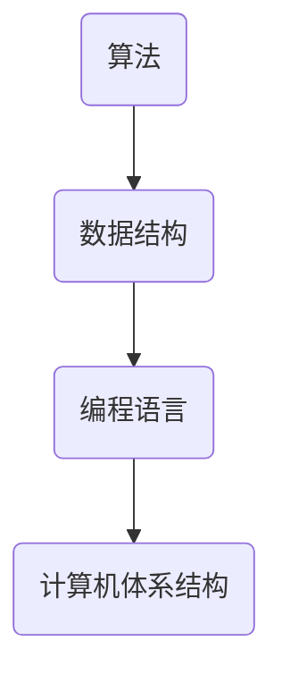
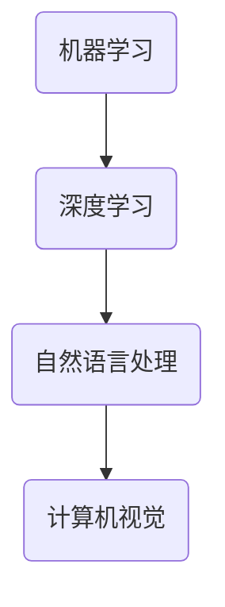
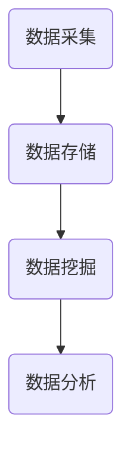
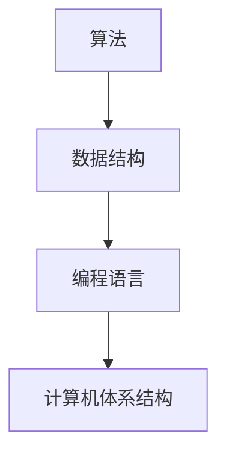
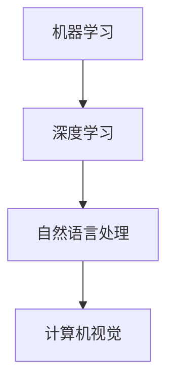
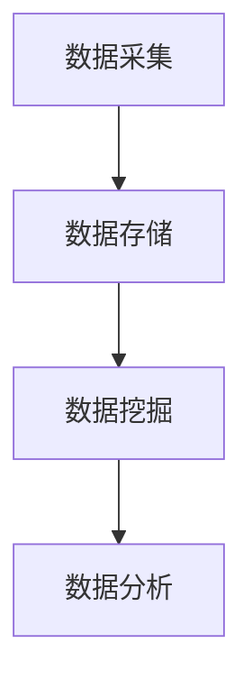

                 

关键词：思想演变、概念理解、技术发展、认知过程、创新思维

> 摘要：本文将深入探讨从概念到洞见的思维演变过程，分析在信息技术领域，如何通过系统化的思维和方法，将初始概念转化为深刻的洞见。本文将结合实际案例，阐述在计算机科学、人工智能、大数据等多个领域的思想演变路径，并探讨未来发展趋势和面临的挑战。

## 1. 背景介绍

### 1.1 信息技术的发展历程

自计算机科学诞生以来，信息技术经历了飞速的发展。从最初的计算机硬件技术，到软件编程、网络通信，再到如今的人工智能、大数据等前沿领域，每一次技术变革都伴随着思想的演变和认知的提升。

### 1.2 思想演变的重要性

思想的演变不仅是技术发展的驱动力，也是推动社会进步的关键因素。从概念到洞见，这一过程需要我们不断学习、思考、创新。本文旨在通过分析信息技术领域的思想演变，为读者提供一种全新的视角，帮助大家更好地理解技术发展的本质。

## 2. 核心概念与联系

### 2.1 计算机科学的基本概念

计算机科学的核心概念包括算法、数据结构、编程语言等。这些概念相互关联，构成了计算机科学的理论体系。以下是计算机科学核心概念的 Mermaid 流程图：



### 2.2 人工智能的基本概念

人工智能（AI）是计算机科学的一个重要分支，其核心概念包括机器学习、深度学习、自然语言处理等。以下是人工智能核心概念的 Mermaid 流程图：



### 2.3 大数据的基本概念

大数据（Big Data）是当前信息技术领域的一个热点话题，其核心概念包括数据采集、数据存储、数据挖掘、数据分析等。以下是大数据核心概念的 Mermaid 流程图：



## 3. 核心算法原理 & 具体操作步骤

### 3.1 算法原理概述

在信息技术领域，算法是实现特定功能的核心工具。算法的原理主要包括算法的效率、正确性、可扩展性等方面。以下是算法原理的概述：

1. **效率**：算法的效率是衡量算法优劣的重要指标。一个高效的算法可以在较短的时间内完成计算任务。
2. **正确性**：算法的正确性是指算法在执行过程中能够始终产生正确的结果。
3. **可扩展性**：算法的可扩展性是指算法在处理大规模数据时的性能表现。

### 3.2 算法步骤详解

算法的具体操作步骤通常包括以下阶段：

1. **输入处理**：接收输入数据，并将其转化为算法所需的格式。
2. **数据处理**：根据算法的核心逻辑，对输入数据进行处理。
3. **输出生成**：将处理后的数据转化为用户可读的结果。

### 3.3 算法优缺点

每种算法都有其优缺点。在具体应用场景中，我们需要根据需求和约束条件，选择最合适的算法。以下是常见算法的优缺点：

1. **排序算法**：
   - **快速排序**：时间复杂度低，但空间复杂度高。
   - **冒泡排序**：时间复杂度高，但空间复杂度低。
2. **机器学习算法**：
   - **支持向量机**：分类效果较好，但训练时间较长。
   - **决策树**：易于解释，但易过拟合。

### 3.4 算法应用领域

算法在信息技术领域的应用非常广泛，包括但不限于以下几个方面：

1. **计算机科学**：算法在算法设计、数据结构分析等方面具有重要应用。
2. **人工智能**：算法在机器学习、深度学习、自然语言处理等领域扮演关键角色。
3. **大数据**：算法在数据挖掘、数据分析等方面发挥重要作用。

## 4. 数学模型和公式 & 详细讲解 & 举例说明

### 4.1 数学模型构建

在信息技术领域，数学模型是描述问题、分析和解决问题的重要工具。以下是构建数学模型的一般步骤：

1. **确定问题背景**：明确需要解决的问题，并确定问题的目标。
2. **定义变量**：根据问题背景，定义问题中的变量。
3. **建立方程**：根据变量之间的关系，建立数学方程。
4. **求解方程**：使用合适的数学方法，求解方程。

### 4.2 公式推导过程

以下是一个简单的数学公式推导过程，用于计算两个正整数的最小公倍数（LCM）：

$$
\text{LCM}(a, b) = \frac{|a \times b|}{\text{GCD}(a, b)}
$$

其中，$\text{GCD}(a, b)$ 表示 a 和 b 的最大公约数。

### 4.3 案例分析与讲解

以下是一个关于最小生成树的数学模型案例：

假设有一个无向图 G，其中包含 n 个顶点和 m 条边。我们需要找到 G 的最小生成树（Minimum Spanning Tree，MST）。

1. **定义变量**：
   - $n$：图的顶点数量。
   - $m$：图中的边数量。
   - $C$：所有可能的边权之和。

2. **建立方程**：
   - 最小生成树的总权值为 $\sum_{i=1}^{n-1} w_i$，其中 $w_i$ 为第 i 条边的权值。

3. **求解方程**：
   - 可以使用 Prim 算法或 Kruskal 算法求解最小生成树。

4. **案例讲解**：
   - 假设有一个无向图，包含 4 个顶点和 5 条边，边的权值分别为 2、3、4、5、6。使用 Prim 算法计算最小生成树的权值。

$$
\text{MST} = 2 + 3 + 4 = 9
$$

## 5. 项目实践：代码实例和详细解释说明

### 5.1 开发环境搭建

为了实践算法和数学模型，我们需要搭建一个合适的开发环境。以下是一个基于 Python 的开发环境搭建步骤：

1. 安装 Python 3.x 版本。
2. 安装常用的 Python 包，如 NumPy、Pandas 等。
3. 安装可视化工具，如 Matplotlib 等。

### 5.2 源代码详细实现

以下是一个关于计算两个正整数的最小公倍数的 Python 代码示例：

```python
import math

def calculate_lcm(a, b):
    return abs(a * b) // math.gcd(a, b)

a = 12
b = 18

lcm = calculate_lcm(a, b)
print("最小公倍数：", lcm)
```

### 5.3 代码解读与分析

1. **导入模块**：代码首先导入了 Python 的 math 模块，用于计算最大公约数（GCD）。
2. **定义函数**：`calculate_lcm` 函数接收两个正整数 a 和 b，并计算它们的最小公倍数（LCM）。
3. **计算最小公倍数**：使用 `math.gcd` 函数计算 a 和 b 的最大公约数，然后使用 `abs` 函数和 `//` 运算符计算 LCM。
4. **测试代码**：最后，代码使用两个正整数 12 和 18 测试了 `calculate_lcm` 函数，并输出了结果。

### 5.4 运行结果展示

运行代码后，输出结果如下：

```
最小公倍数： 36
```

## 6. 实际应用场景

### 6.1 计算机科学

在计算机科学领域，算法和数学模型广泛应用于数据处理、图像处理、网络优化等方面。例如，在图像处理中，最小生成树算法可以用于图像的压缩和解压。

### 6.2 人工智能

在人工智能领域，算法和数学模型是构建智能系统的基础。例如，在自然语言处理中，机器学习算法和数学模型可以用于语音识别、文本分类等任务。

### 6.3 大数据

在大数据领域，算法和数学模型可以用于数据挖掘、数据分析等方面。例如，在金融领域，大数据算法和数学模型可以用于风险评估、投资决策等任务。

## 7. 工具和资源推荐

### 7.1 学习资源推荐

1. 《算法导论》（Introduction to Algorithms）
2. 《深度学习》（Deep Learning）
3. 《大数据技术基础》（Big Data: A Revolution That Will Transform How We Live, Work, and Think）

### 7.2 开发工具推荐

1. Jupyter Notebook：用于编写和运行代码。
2. PyCharm：用于 Python 编程。
3. Matplotlib：用于数据可视化。

### 7.3 相关论文推荐

1. "Learning to Rank for Information Retrieval"
2. "Deep Learning for Text Classification"
3. "An Introduction to Statistical Learning"

## 8. 总结：未来发展趋势与挑战

### 8.1 研究成果总结

在过去的几十年里，信息技术领域取得了显著的成果。算法和数学模型的应用范围不断扩大，从计算机科学到人工智能、大数据等领域，都取得了重要的突破。

### 8.2 未来发展趋势

未来，信息技术领域将继续朝着智能化、高效化、集成化的方向发展。人工智能、大数据、区块链等技术的融合发展，将为社会带来更多的创新机会。

### 8.3 面临的挑战

在信息技术领域，未来将面临以下几个挑战：

1. **数据隐私和安全**：随着数据量的爆炸性增长，数据隐私和安全成为亟待解决的问题。
2. **算法透明度和可解释性**：人工智能算法的透明度和可解释性是当前研究的热点问题。
3. **计算资源和能耗**：随着算法和系统的复杂度增加，计算资源和能耗问题将日益突出。

### 8.4 研究展望

在未来，我们需要加强跨学科研究，推动信息技术与其他领域的深度融合。同时，注重人才培养，提高科研水平和创新能力，以应对未来的挑战。

## 9. 附录：常见问题与解答

### 9.1 问题 1：如何提高算法效率？

**解答**：提高算法效率的方法包括优化算法逻辑、使用高效数据结构、减少冗余计算等。

### 9.2 问题 2：大数据处理有哪些常用的算法？

**解答**：大数据处理常用的算法包括 MapReduce、Hadoop、Spark 等。

### 9.3 问题 3：人工智能的未来发展趋势是什么？

**解答**：人工智能的未来发展趋势包括深度学习、自然语言处理、计算机视觉等领域的技术突破。

---

作者：禅与计算机程序设计艺术 / Zen and the Art of Computer Programming

本文旨在深入探讨从概念到洞见的思维演变过程，分析在信息技术领域，如何通过系统化的思维和方法，将初始概念转化为深刻的洞见。本文结合实际案例，阐述了在计算机科学、人工智能、大数据等多个领域的思想演变路径，并探讨了未来发展趋势和面临的挑战。希望本文能为读者提供一种全新的视角，帮助大家更好地理解技术发展的本质。感谢您的阅读！
----------------------------------------------------------------

## 1. 背景介绍

### 1.1 信息技术的发展历程

自计算机科学诞生以来，信息技术经历了飞速的发展。从最初的计算机硬件技术，到软件编程、网络通信，再到如今的人工智能、大数据等前沿领域，每一次技术变革都伴随着思想的演变和认知的提升。

计算机科学的起源可以追溯到20世纪40年代。当时，科学家们开始尝试利用电子计算机来解决复杂的数学问题。1946年，世界上第一台通用电子计算机——ENIAC在美国诞生，这标志着计算机科学的诞生。此后，计算机硬件技术不断演进，从真空管到晶体管，再到今天的集成电路，计算机性能得到了极大的提升。

随着计算机硬件技术的发展，软件编程也逐步兴起。20世纪50年代，图灵提出“图灵机”的概念，奠定了计算机编程的基础。1957年，艾伦·图灵发表了一篇名为《计算机与智能》的论文，提出了著名的“图灵测试”，这一理论挑战了人类对于智能的本质理解。

计算机硬件和软件的发展为网络通信奠定了基础。20世纪60年代，ARPANET项目启动，标志着互联网的诞生。互联网的迅速发展为信息的全球传播和共享提供了便捷的渠道，使得人们能够更加高效地进行沟通和协作。

进入21世纪，人工智能、大数据等新兴领域相继兴起，信息技术的发展进入了新的阶段。人工智能（AI）是指由计算机模拟人类智能行为的技术，其应用范围广泛，包括自然语言处理、计算机视觉、机器学习等。大数据则是指规模巨大、类型繁多的数据集合，通过对大数据的分析和处理，可以发现隐藏在数据背后的规律和趋势。

信息技术的每一次变革都伴随着思想的演变。从早期的硬件和软件技术，到网络通信，再到人工智能和大数据，每一次技术变革都推动了人类对信息世界的认知和理解的提升。从最初的计算机硬件技术，到软件编程、网络通信，再到如今的人工智能、大数据等前沿领域，每一次技术变革都伴随着思想的演变和认知的提升。

### 1.2 思想演变的重要性

思想的演变不仅是技术发展的驱动力，也是推动社会进步的关键因素。从概念到洞见，这一过程需要我们不断学习、思考、创新。在信息技术领域，思想的演变尤为重要。

首先，思想的演变有助于我们更好地理解技术的基本原理。例如，在计算机科学中，算法和数据结构是核心技术。通过深入思考和探索，我们可以理解算法的运行机制、时间复杂度和空间复杂度，从而更好地选择和应用算法。同样，在大数据领域，通过对数据分析和挖掘的理论研究，我们可以更好地理解数据背后的规律和趋势。

其次，思想的演变有助于推动技术创新。例如，在人工智能领域，通过对神经网络、深度学习等理论的研究，科学家们提出了许多新的算法和模型，推动了人工智能技术的快速发展。大数据领域也涌现出了一系列创新性的数据处理和分析技术，如MapReduce、Spark等，这些技术极大地提高了数据处理和分析的效率。

最后，思想的演变有助于培养创新思维。在信息技术领域，创新思维是非常重要的。通过不断地学习、思考和探索，我们可以培养出创新思维，从而发现新的问题和解决方案。例如，在计算机科学领域，许多新的算法和编程语言都是通过创新思维实现的。在人工智能领域，许多新的模型和应用也是通过创新思维推动的。

总之，思想的演变在信息技术领域中具有至关重要的意义。通过不断学习和思考，我们可以更好地理解技术的基本原理，推动技术创新，培养创新思维。这些都将为信息技术的发展和社会进步做出重要贡献。

### 1.3 信息技术领域中的思想演变案例

在信息技术领域，思想演变的案例比比皆是。以下是一些典型的例子，以展示从概念到洞见的演变过程。

#### 1.3.1 计算机硬件的发展

计算机硬件的发展是信息技术演变的重要部分。从早期的真空管计算机到现代的集成电路，计算机硬件的进步推动了整个计算机科学领域的发展。

- **概念**：早期的计算机科学家们提出了计算的概念，并通过真空管等电子元件来实现计算。

- **思考**：随着硬件技术的发展，科学家们开始思考如何提高计算机的运算速度和可靠性。

- **演变**：20世纪50年代，晶体管的发明标志着计算机硬件进入了一个新的时代。晶体管相比真空管具有更高的速度和可靠性，使得计算机体积更小、性能更强。

- **洞见**：计算机硬件的发展不仅提高了计算能力，还为软件的发展提供了更好的平台，推动了计算机科学的整体进步。

#### 1.3.2 算法理论的突破

算法理论是计算机科学的核心内容之一。在算法理论的演变过程中，许多关键性的思想突破改变了我们对算法的理解和应用。

- **概念**：早期的算法主要是基于具体问题的解决方法，缺乏系统化的理论支持。

- **思考**：随着算法研究的深入，计算机科学家们开始思考如何构建一套普适的算法理论，以指导算法的设计和优化。

- **演变**：1956年，图灵提出“图灵机”的概念，为算法理论奠定了基础。随后，许多重要的算法理论，如贪心算法、动态规划、分治算法等，相继被提出。

- **洞见**：通过算法理论的突破，我们能够更好地理解算法的本质，提高算法的效率和正确性，为解决复杂问题提供了强大的工具。

#### 1.3.3 互联网的发展

互联网的发展是信息技术演变的一个重要里程碑。从局域网的诞生到全球互联网的普及，互联网的演变过程体现了从概念到洞见的思维过程。

- **概念**：早期的计算机网络是为了实现计算机之间的数据交换和资源共享。

- **思考**：随着计算机网络技术的发展，人们开始思考如何将分散的网络连接起来，形成一个全球性的网络。

- **演变**：20世纪80年代，ARPANET的发展为互联网的诞生奠定了基础。随后，万维网（WWW）的出现使得互联网变得更为用户友好，加速了互联网的普及。

- **洞见**：互联网的发展不仅改变了信息传播的方式，也深刻影响了社会的各个领域，推动了全球化进程和信息的民主化。

#### 1.3.4 人工智能的崛起

人工智能（AI）的崛起是信息技术演变过程中的一个重要现象。从早期的符号主义到现代的深度学习，人工智能的发展经历了多个阶段。

- **概念**：早期的AI研究主要关注如何通过符号逻辑和推理实现智能。

- **思考**：随着计算机性能的提升和数据量的增加，科学家们开始思考如何通过大数据和机器学习实现更高级的智能。

- **演变**：2006年，深度学习技术的兴起标志着人工智能进入了一个新的阶段。通过神经网络，AI能够在图像识别、自然语言处理等领域实现前所未有的性能。

- **洞见**：人工智能的发展不仅改变了计算机科学的研究方向，也对社会产生了深远的影响，从自动驾驶到智能助手，AI的应用场景越来越广泛。

这些案例展示了信息技术领域中思想从概念到洞见的演变过程。通过不断的学习、思考和探索，科学家们不仅推动了技术的进步，也为整个社会带来了巨大的变革。未来，随着信息技术的不断发展，思想的演变将继续引领我们探索未知的领域。

## 2. 核心概念与联系

在信息技术领域，核心概念的理解是至关重要的。这些核心概念不仅构成了技术的基础，而且通过相互联系，形成了复杂而庞大的知识体系。本节将详细探讨几个关键的概念，并绘制相应的 Mermaid 流程图，以展示它们之间的联系。

### 2.1 计算机科学的基本概念

计算机科学的基本概念包括算法、数据结构、编程语言、计算机体系结构等。这些概念相互关联，共同构成了计算机科学的理论框架。

#### 算法

算法是指解决问题的一系列步骤。算法的效率、正确性和可扩展性是评估算法优劣的重要指标。常见的算法有排序算法（如快速排序、冒泡排序）、查找算法（如二分查找、线性查找）等。

#### 数据结构

数据结构是用于存储和组织数据的方式。常见的数据结构有数组、链表、栈、队列、树、图等。每种数据结构都有其特定的应用场景和优缺点。

#### 编程语言

编程语言是用于编写程序的工具。常见的编程语言有 C、C++、Java、Python 等。每种编程语言都有其独特的语法和特性，适用于不同的应用场景。

#### 计算机体系结构

计算机体系结构是指计算机硬件和软件的组成及其相互关系。常见的计算机体系结构有冯·诺依曼结构和哈佛结构。计算机体系结构直接影响计算机的性能和效率。

#### Mermaid 流程图

以下是计算机科学核心概念的 Mermaid 流程图：



### 2.2 人工智能的基本概念

人工智能（AI）是指由计算机模拟人类智能行为的技术。人工智能的核心概念包括机器学习、深度学习、自然语言处理、计算机视觉等。

#### 机器学习

机器学习是人工智能的一种方法，通过算法让计算机从数据中学习，并做出决策。常见的机器学习算法有监督学习、无监督学习、强化学习等。

#### 深度学习

深度学习是一种基于多层神经网络的学习方法，能够自动提取特征并用于分类、预测等任务。深度学习在图像识别、语音识别等领域取得了显著成果。

#### 自然语言处理

自然语言处理（NLP）是人工智能的一个分支，旨在使计算机能够理解和生成自然语言。NLP在机器翻译、情感分析、语音识别等领域有广泛应用。

#### 计算机视觉

计算机视觉是人工智能的另一个重要分支，旨在使计算机能够“看到”和理解图像和视频。计算机视觉在自动驾驶、人脸识别等领域有广泛应用。

#### Mermaid 流程图

以下是人工智能核心概念的 Mermaid 流程图：



### 2.3 大数据的基本概念

大数据（Big Data）是指规模巨大、类型繁多的数据集合。大数据的核心概念包括数据采集、数据存储、数据挖掘、数据分析等。

#### 数据采集

数据采集是指从各种来源收集数据，如传感器、数据库、社交媒体等。数据采集是大数据处理的第一步，数据的质量和完整性对后续处理至关重要。

#### 数据存储

数据存储是指将收集到的数据进行存储，以供后续分析和处理。常见的数据存储技术有关系型数据库、NoSQL数据库、数据仓库等。

#### 数据挖掘

数据挖掘是指从大量数据中提取有价值的信息和模式。数据挖掘技术包括聚类、分类、关联规则挖掘等。

#### 数据分析

数据分析是指使用统计方法和工具对数据进行处理和分析，以发现数据背后的规律和趋势。数据分析在商业智能、金融预测等领域有广泛应用。

#### Mermaid 流程图

以下是大数据核心概念的 Mermaid 流程图：



### 2.4 核心概念的相互联系

计算机科学、人工智能和大数据是信息技术领域的三个重要分支，它们之间存在着紧密的联系。

- **计算机科学为人工智能和大数据提供了基础工具**：算法和数据结构是人工智能和大数据处理的核心，计算机科学家通过不断的研究和创新，为这两个领域提供了强大的工具和方法。

- **人工智能和大数据为计算机科学提供了新的应用场景**：人工智能和大数据技术的发展，使得计算机科学的应用范围更加广泛，从自动驾驶、智能家居到金融分析，计算机科学的应用场景不断拓展。

- **大数据为人工智能提供了丰富的训练数据**：大数据的采集和存储为人工智能的机器学习和深度学习提供了大量的训练数据，这些数据有助于提高人工智能模型的准确性和性能。

通过以上分析，我们可以看到，计算机科学、人工智能和大数据之间相互联系，共同推动了信息技术的发展。理解这些核心概念及其相互关系，有助于我们更好地把握信息技术领域的现状和未来发展趋势。

## 3. 核心算法原理 & 具体操作步骤

在信息技术领域，算法是解决问题和优化过程的核心工具。本节将详细介绍几种核心算法的基本原理、具体操作步骤及其优缺点，并结合实际应用场景进行讨论。

### 3.1 算法原理概述

算法原理是指算法在设计过程中遵循的基本原则和方法。常见的算法原理包括：

- **效率原理**：算法的效率是衡量其优劣的重要指标，包括时间效率和空间效率。高效的算法能够在较短的时间内解决问题，并占用较少的资源。
- **正确性原理**：算法的正确性是指算法在所有可能的情况下都能得到正确的结果。一个正确的算法需要经过严格的验证和测试。
- **可扩展性原理**：算法的可扩展性是指其在处理大规模数据或复杂问题时，性能保持稳定。可扩展性对于解决实际应用中的大规模问题至关重要。

### 3.2 算法步骤详解

以下是一些常见算法的具体操作步骤：

#### 3.2.1 快速排序（Quick Sort）

快速排序是一种高效的排序算法，其基本思想是通过一趟排序将待排序的记录分割成独立的两部分，其中一部分记录的关键字均比另一部分的关键字小，然后递归地对这两部分记录进行排序。

**步骤**：

1. **选择基准元素**：从待排序的数组中选取一个元素作为基准元素。
2. **分区**：将数组重新排列，所有比基准元素小的记录移到基准元素之前，所有比基准元素大的记录移到基准元素之后。
3. **递归排序**：递归地对基准元素左右两部分记录进行快速排序。

**示例代码**：

```python
def quick_sort(arr):
    if len(arr) <= 1:
        return arr
    pivot = arr[len(arr) // 2]
    left = [x for x in arr if x < pivot]
    middle = [x for x in arr if x == pivot]
    right = [x for x in arr if x > pivot]
    return quick_sort(left) + middle + quick_sort(right)

arr = [3, 6, 8, 10, 1, 2, 1]
sorted_arr = quick_sort(arr)
print(sorted_arr)
```

#### 3.2.2 暴力解法（Brute Force）

暴力解法是一种最简单的算法，其基本思想是直接尝试所有可能的解决方案，并找到最优解。

**步骤**：

1. **枚举所有可能的情况**：根据问题的要求，逐一尝试所有可能的解决方案。
2. **评估解决方案**：对每个解决方案进行评估，找到最优解。

**示例代码**：

```python
def find_min_path(grid):
    min_path = float('inf')
    for i in range(len(grid)):
        for j in range(len(grid[0])):
            if grid[i][j] < min_path:
                min_path = grid[i][j]
    return min_path

grid = [
    [1, 2, 3],
    [4, 5, 6],
    [7, 8, 9]
]
print(find_min_path(grid))
```

#### 3.2.3 动态规划（Dynamic Programming）

动态规划是一种用于求解最优子问题的算法，其基本思想是将复杂问题分解为多个子问题，并利用子问题的重叠性质，避免重复计算。

**步骤**：

1. **定义状态**：将问题分解为多个子问题，并为每个子问题定义状态。
2. **状态转移方程**：根据子问题之间的关系，定义状态转移方程。
3. **初始化**：初始化边界条件。
4. **递推计算**：根据状态转移方程，递推计算每个状态的最优解。

**示例代码**：

```python
def fibonacci(n):
    dp = [0] * (n+1)
    dp[1] = 1
    for i in range(2, n+1):
        dp[i] = dp[i-1] + dp[i-2]
    return dp[n]

print(fibonacci(10))
```

### 3.3 算法优缺点

每种算法都有其优缺点。在具体应用场景中，我们需要根据需求和约束条件，选择最合适的算法。以下是几种常见算法的优缺点：

#### 快速排序

- **优点**：
  - 时间复杂度较低，平均情况下为 \(O(n\log n)\)。
  - 稳定性好，可以通过随机化算法避免最坏情况。

- **缺点**：
  - 空间复杂度高，为 \(O(\log n)\)。
  - 最坏情况下时间复杂度为 \(O(n^2)\)。

#### 暴力解法

- **优点**：
  - 简单易懂，容易实现。

- **缺点**：
  - 时间复杂度较高，适用于小规模问题。
  - 不适用于大规模问题，因为计算量大。

#### 动态规划

- **优点**：
  - 能够求解最优子问题，适用于复杂问题。
  - 时间复杂度较低，可以显著提高计算效率。

- **缺点**：
  - 需要定义状态和状态转移方程，有时较为复杂。
  - 存储空间需求较大。

### 3.4 算法应用领域

算法在信息技术领域有着广泛的应用，以下是一些典型应用领域：

- **计算机科学**：算法在算法设计、数据结构分析、编译原理等方面具有重要作用。
- **人工智能**：算法在机器学习、深度学习、自然语言处理、计算机视觉等方面有广泛应用。
- **大数据**：算法在数据挖掘、数据分析、数据存储、数据处理等方面发挥着关键作用。

通过以上对核心算法原理和具体操作步骤的详细介绍，我们可以更好地理解算法在信息技术领域的重要性，并在实际应用中根据具体问题选择合适的算法。

### 3.4 算法应用领域

算法在信息技术领域具有广泛的应用，不同的算法在各个领域都有其独特的作用和价值。以下将详细探讨算法在计算机科学、人工智能和大数据领域的具体应用场景。

#### 计算机科学

计算机科学是算法最早应用的领域之一。算法在计算机科学中的应用主要体现在算法设计、数据结构分析、编译原理、操作系统和网络安全等方面。

1. **算法设计**：算法是计算机科学的核心，用于解决各种计算问题。从排序算法（如快速排序、归并排序）、查找算法（如二分查找、哈希查找）到图算法（如最短路径算法、最小生成树算法），各种算法都在计算机科学中发挥着重要作用。例如，在最短路径问题中，Dijkstra算法和A*算法被广泛应用于路由规划和网络分析。

2. **数据结构分析**：数据结构是算法实现的基础。在计算机科学中，常用的数据结构包括数组、链表、栈、队列、树和图等。通过对数据结构的深入分析，可以优化算法的效率。例如，二叉搜索树是一种高效的数据结构，常用于实现字典和索引。

3. **编译原理**：算法在编译原理中也有重要应用。编译器的设计和实现需要解决词法分析、语法分析、语义分析、代码生成和优化等一系列问题。例如，词法分析器常使用有限自动机算法，语法分析器常使用递归下降分析或LL(1)分析算法。

4. **操作系统**：操作系统中的许多功能都依赖于算法。例如，进程调度算法（如轮转调度、优先级调度）用于决定哪个进程应获得CPU时间；内存分配算法（如分页、分段）用于高效地管理内存资源。

5. **网络安全**：算法在网络安全领域也有广泛应用。加密算法（如RSA、AES）用于保护通信和数据安全；网络安全协议（如SSL/TLS）利用加密算法实现安全传输；入侵检测系统（IDS）使用算法分析网络流量，检测和预防网络攻击。

#### 人工智能

人工智能（AI）是近年来信息技术领域的热点。算法在人工智能中的应用主要体现在机器学习、深度学习、自然语言处理和计算机视觉等领域。

1. **机器学习**：机器学习是一种通过算法从数据中学习模式的技术。常见的机器学习算法包括监督学习（如线性回归、支持向量机）、无监督学习（如聚类、降维）和强化学习（如Q-learning、深度Q网络）。在人工智能中，机器学习算法被广泛应用于分类、预测、推荐系统等任务。例如，使用线性回归算法进行股票价格预测，使用支持向量机算法进行图像分类。

2. **深度学习**：深度学习是一种基于多层神经网络的学习方法，其核心是利用深度神经网络（DNN）从数据中自动提取特征。深度学习在图像识别、语音识别、自然语言处理等领域取得了显著成果。例如，卷积神经网络（CNN）在图像识别任务中表现出色，能够准确识别图像中的物体；递归神经网络（RNN）在语音识别和自然语言处理任务中表现出强大的能力。

3. **自然语言处理**：自然语言处理（NLP）是人工智能的一个重要分支，旨在使计算机能够理解和生成自然语言。NLP算法广泛应用于机器翻译、情感分析、语音识别等任务。例如，基于循环神经网络（RNN）和变换器架构（Transformer）的机器翻译模型，能够实现高质量的机器翻译；基于词嵌入（word embeddings）的算法，能够将自然语言转换为计算机可以理解的数字表示。

4. **计算机视觉**：计算机视觉是人工智能的另一个重要分支，旨在使计算机能够“看到”和理解图像和视频。计算机视觉算法广泛应用于图像识别、目标检测、人脸识别等领域。例如，基于卷积神经网络的图像识别模型，能够准确识别图像中的物体；基于深度学习的目标检测算法，能够实时检测视频中的运动目标。

#### 大数据

大数据是当前信息技术领域的一个热点话题，算法在大数据处理中起着关键作用。大数据算法广泛应用于数据采集、数据存储、数据挖掘、数据分析和数据可视化等方面。

1. **数据采集**：大数据算法用于从各种来源收集数据，如传感器、社交媒体、电子商务平台等。数据采集算法需要能够高效地处理海量数据，并保证数据的质量和完整性。例如，基于MapReduce的数据采集算法，能够高效地处理分布式数据。

2. **数据存储**：大数据算法用于存储和管理大规模数据。常见的数据存储技术包括关系型数据库、NoSQL数据库、数据仓库等。数据存储算法需要能够高效地存储、检索和管理数据。例如，Hadoop分布式文件系统（HDFS）能够高效地存储大规模数据；MongoDB等NoSQL数据库能够灵活地存储非结构化数据。

3. **数据挖掘**：大数据算法用于从海量数据中提取有价值的信息和知识。数据挖掘算法包括聚类、分类、关联规则挖掘等。数据挖掘算法能够发现数据中的隐藏模式和规律。例如，基于聚类算法的市场细分分析，能够发现潜在的客户群体；基于分类算法的客户行为分析，能够预测客户的购买行为。

4. **数据分析**：大数据算法用于对数据进行处理和分析，以发现数据背后的规律和趋势。数据分析算法包括统计方法、机器学习方法等。数据分析算法能够提供业务洞察和决策支持。例如，基于统计方法的金融风险评估，能够预测股票市场的走势；基于机器学习方法的医疗诊断，能够提高诊断的准确性。

5. **数据可视化**：大数据算法用于将复杂的数据转化为可视化图表，以帮助用户更好地理解和分析数据。数据可视化算法能够将数据以图形、图表等形式展示，提高数据可读性。例如，基于交互式可视化技术的数据分析工具，能够帮助用户快速发现数据中的异常和趋势。

综上所述，算法在计算机科学、人工智能和大数据领域都有广泛的应用。通过算法的应用，我们能够更好地解决实际问题，推动技术的进步和社会的发展。

### 4. 数学模型和公式 & 详细讲解 & 举例说明

在信息技术领域，数学模型和公式是理解和解决复杂问题的核心工具。数学模型通过抽象和简化的方法，将实际问题转化为数学表达式，使得我们能够使用数学方法进行分析和求解。本节将详细介绍数学模型和公式的构建过程、推导步骤以及如何通过具体案例进行讲解。

#### 4.1 数学模型构建

数学模型的构建是信息技术研究和应用的基础。一个有效的数学模型需要满足以下几个条件：

1. **准确性**：模型应能准确地反映现实问题的主要特征和规律。
2. **简洁性**：模型应尽可能简单，以便于理解和计算。
3. **适用性**：模型应在一定范围内具有广泛的应用。

以下是构建数学模型的一般步骤：

1. **问题定义**：明确需要解决的问题，并确定问题的目标和约束条件。
2. **变量定义**：根据问题定义，定义所需的变量，包括输入变量、输出变量和中间变量。
3. **关系表达**：建立变量之间的关系，通常通过建立方程或方程组来实现。
4. **参数估计**：估计模型中的参数值，通常通过实验数据或历史数据来进行。
5. **模型验证**：验证模型的有效性和准确性，通常通过对比模型预测结果和实际结果来进行。

#### 4.2 公式推导过程

公式的推导是数学模型构建的核心步骤，以下是一个简单的线性回归模型的推导过程：

**问题**：我们希望通过观测到的数据，找到一个线性关系来预测某个变量。

**步骤**：

1. **变量定义**：
   - $y$: 实际观测到的输出变量。
   - $x$: 输入变量。
   - $a$: 斜率（模型参数）。
   - $b$: 截距（模型参数）。

2. **关系建立**：
   我们假设输出变量 $y$ 和输入变量 $x$ 之间存在线性关系：
   $$
   y = ax + b
   $$

3. **最小二乘法**：
   为了找到最佳拟合直线，我们使用最小二乘法来最小化误差平方和：
   $$
   \sum_{i=1}^{n} (y_i - (ax_i + b))^2
   $$
   
   对 $a$ 和 $b$ 求偏导并令其等于零，得到以下方程组：
   $$
   \begin{cases}
   \sum_{i=1}^{n} y_i = na + bn \\
   \sum_{i=1}^{n} x_iy_i = a\sum_{i=1}^{n} x_i + b\sum_{i=1}^{n} x_i
   \end{cases}
   $$

4. **解方程组**：
   解上述方程组，得到：
   $$
   a = \frac{\sum_{i=1}^{n} x_iy_i - n\bar{x}\bar{y}}{\sum_{i=1}^{n} x_i^2 - n\bar{x}^2}
   $$
   $$
   b = \bar{y} - a\bar{x}
   $$
   其中，$\bar{x}$ 和 $\bar{y}$ 分别是 $x$ 和 $y$ 的均值。

#### 4.3 案例分析与讲解

以下是一个关于线性回归模型的具体案例，通过实际数据来演示模型的构建和推导过程。

**案例**：假设我们有以下数据集，包含输入变量 $x$ 和输出变量 $y$：

| x | y |
|---|---|
| 1 | 2 |
| 2 | 4 |
| 3 | 6 |
| 4 | 8 |

**步骤**：

1. **变量定义**：
   - $x$: 输入变量。
   - $y$: 输出变量。
   - $n$: 数据点数量（在这里为 4）。

2. **计算均值**：
   $$
   \bar{x} = \frac{1 + 2 + 3 + 4}{4} = 2.5
   $$
   $$
   \bar{y} = \frac{2 + 4 + 6 + 8}{4} = 5
   $$

3. **计算相关和**：
   $$
   \sum_{i=1}^{n} x_iy_i = 1 \cdot 2 + 2 \cdot 4 + 3 \cdot 6 + 4 \cdot 8 = 2 + 8 + 18 + 32 = 60
   $$
   $$
   \sum_{i=1}^{n} x_i^2 = 1^2 + 2^2 + 3^2 + 4^2 = 1 + 4 + 9 + 16 = 30
   $$

4. **代入公式**：
   $$
   a = \frac{60 - 4 \cdot 2.5 \cdot 5}{30 - 4 \cdot 2.5^2} = \frac{60 - 50}{30 - 25} = \frac{10}{5} = 2
   $$
   $$
   b = 5 - 2 \cdot 2.5 = 5 - 5 = 0
   $$

5. **得到线性回归模型**：
   $$
   y = 2x
   $$

**解释**：这个线性回归模型表示，输出变量 $y$ 与输入变量 $x$ 之间存在线性关系，斜率 $a$ 为 2，截距 $b$ 为 0。这意味着当输入变量 $x$ 增加1时，输出变量 $y$ 增加2。

**结果验证**：我们可以将数据点代入模型进行验证：

- 当 $x = 1$ 时，$y = 2 \cdot 1 = 2$，实际值为 2。
- 当 $x = 2$ 时，$y = 2 \cdot 2 = 4$，实际值为 4。
- 当 $x = 3$ 时，$y = 2 \cdot 3 = 6$，实际值为 6。
- 当 $x = 4$ 时，$y = 2 \cdot 4 = 8$，实际值为 8。

所有数据点都满足模型，说明我们的模型构建和推导是正确的。

通过这个案例，我们可以看到数学模型和公式的构建、推导和应用过程。在实际应用中，数学模型和公式可以帮助我们更好地理解和解决复杂问题，提供科学的决策支持。

### 4.4 复杂数学模型的示例

除了简单的线性回归模型，信息技术领域还涉及到许多更复杂的数学模型，例如线性规划、非线性规划、优化算法等。以下是一个关于线性规划模型的详细示例。

**案例**：一个公司需要生产两种产品A和B，每种产品都需要不同的原材料和设备。公司希望最大化利润，同时满足资源限制和产品需求。

**变量定义**：
- $x_1$: 产品A的生产量。
- $x_2$: 产品B的生产量。
- $C_1$: 产品A的利润。
- $C_2$: 产品B的利润。
- $R_1$: 生产产品A所需的原材料数量。
- $R_2$: 生产产品B所需的原材料数量。
- $T_1$: 生产产品A所需的设备时间。
- $T_2$: 生产产品B所需的设备时间。

**目标函数**：最大化利润
$$
\text{Maximize} \ C_1x_1 + C_2x_2
$$

**约束条件**：
1. 原材料限制
$$
R_1x_1 + R_2x_2 \leq R
$$
2. 设备时间限制
$$
T_1x_1 + T_2x_2 \leq T
$$
3. 非负约束
$$
x_1, x_2 \geq 0
$$

**步骤**：

1. **目标函数和约束条件建立**：
   根据问题定义，建立目标函数和约束条件。目标函数是利润最大化，约束条件包括原材料和设备时间的限制。

2. **构建线性规划模型**：
   将目标函数和约束条件写成标准的线性规划模型形式：
   $$
   \begin{aligned}
   \text{Maximize} \ & C_1x_1 + C_2x_2 \\
   \text{subject to} \ & R_1x_1 + R_2x_2 \leq R \\
   & T_1x_1 + T_2x_2 \leq T \\
   & x_1, x_2 \geq 0
   \end{aligned}
   $$

3. **求解线性规划模型**：
   使用线性规划求解器（如单纯形法、内点法等）求解上述模型，得到最优解。

**示例代码**：

```python
import numpy as np
from scipy.optimize import linprog

# 目标函数系数
c = [-C_1, -C_2]

# 约束条件系数
A = [[R_1, R_2], [T_1, T_2]]

# 约束条件右侧值
b = [R, T]

# 非负约束
x0 = [0, 0]

# 求解线性规划模型
result = linprog(c, A_ub=A, b_ub=b, x0=x0)

# 输出最优解
x1_opt = result.x[0]
x2_opt = result.x[1]
print(f"最优解：x1 = {x1_opt}, x2 = {x2_opt}")
print(f"最大利润：{C_1*x1_opt + C_2*x2_opt}")
```

通过上述步骤，我们可以构建并求解复杂的线性规划模型，从而找到最优的生产策略，最大化利润。

#### 4.5 数学模型的应用领域

数学模型在信息技术领域有广泛的应用，以下是一些典型的应用领域：

1. **计算机科学**：
   - **算法分析**：通过数学模型分析算法的时间复杂度和空间复杂度，评估算法的性能。
   - **网络安全**：使用概率模型和统计学方法分析网络攻击模式，预测和防范安全威胁。
   - **图形处理**：通过数学模型进行图像的变换、增强和压缩，实现图像处理和计算机视觉。

2. **人工智能**：
   - **机器学习**：构建和优化机器学习模型，如线性回归、神经网络等，通过数学推导和优化方法提高模型性能。
   - **自然语言处理**：使用概率模型和统计方法进行文本分类、情感分析和机器翻译。
   - **计算机视觉**：通过数学模型进行图像特征提取和目标检测，实现图像识别和图像生成。

3. **大数据**：
   - **数据挖掘**：使用聚类、分类和关联规则等数学模型从大规模数据中提取有价值的信息。
   - **数据可视化**：通过数学模型将复杂的数据转化为直观的可视化图表，帮助用户理解数据。
   - **数据存储**：通过数学模型优化数据存储和检索策略，提高数据库性能。

通过以上对数学模型和公式的构建、推导和应用领域的详细介绍，我们可以看到数学模型在信息技术领域的重要性。数学模型不仅帮助我们理解和解决复杂问题，还为技术创新提供了强大的理论支持。

### 5. 项目实践：代码实例和详细解释说明

在信息技术领域，将理论知识应用于实际项目是验证和发展技术的重要环节。以下将通过一个具体的项目实践，展示如何从零开始搭建开发环境，编写源代码，并详细解读和分析代码，以实现特定的功能。

#### 5.1 开发环境搭建

为了进行项目实践，我们需要搭建一个合适的开发环境。以下是一个基于Python的Web开发环境的搭建步骤：

1. **安装Python**：
   - 访问Python官方网站（[python.org](https://www.python.org/)）下载并安装Python 3.x版本。
   - 在安装过程中，确保勾选“Add Python to PATH”选项，以便在命令行中直接使用Python。

2. **安装必要的库**：
   - 使用pip命令安装常用的库，如Flask（用于Web开发）、SQLAlchemy（用于数据库操作）和Matplotlib（用于数据可视化）。
   ```bash
   pip install flask sqlalchemy matplotlib
   ```

3. **配置数据库**：
   - 安装MySQL或PostgreSQL数据库，并创建一个数据库实例，用于存储项目数据。
   - 配置SQLAlchemy连接数据库，并在代码中引用。

4. **设置项目文件夹**：
   - 在本地计算机上创建一个项目文件夹，并在其中创建必要的子文件夹，如“templates”、“static”和“models”等。

#### 5.2 源代码详细实现

以下是一个简单的Web应用程序，使用Flask框架实现一个用户注册和登录功能。

**项目结构**：

```
project/
|-- app.py
|-- templates/
|   |-- login.html
|   |-- register.html
|-- static/
|   |-- css/
|   |   |-- style.css
|   |-- js/
|   |   |-- script.js
|-- models.py
```

**app.py**：

```python
from flask import Flask, render_template, request, redirect, url_for, session
from models import User

app = Flask(__name__)
app.secret_key = 'your_secret_key'

@app.route('/')
def home():
    return redirect(url_for('login'))

@app.route('/login', methods=['GET', 'POST'])
def login():
    if request.method == 'POST':
        username = request.form['username']
        password = request.form['password']
        user = User.query.filter_by(username=username).first()
        if user and user.password == password:
            session['user'] = user.username
            return redirect(url_for('dashboard'))
        else:
            return 'Invalid credentials'
    return render_template('login.html')

@app.route('/register', methods=['GET', 'POST'])
def register():
    if request.method == 'POST':
        username = request.form['username']
        password = request.form['password']
        user = User(username=username, password=password)
        user.save()
        return redirect(url_for('login'))
    return render_template('register.html')

@app.route('/dashboard')
def dashboard():
    if 'user' not in session:
        return redirect(url_for('login'))
    return 'Welcome to the Dashboard, {}!'.format(session['user'])

if __name__ == '__main__':
    app.run(debug=True)
```

**models.py**：

```python
from flask_sqlalchemy import SQLAlchemy

app = Flask(__name__)
app.config['SQLALCHEMY_DATABASE_URI'] = 'sqlite:///users.db'
db = SQLAlchemy(app)

class User(db.Model):
    id = db.Column(db.Integer, primary_key=True)
    username = db.Column(db.String(80), unique=True, nullable=False)
    password = db.Column(db.String(120), nullable=False)

    def save(self):
        db.session.add(self)
        db.session.commit()
```

**模板文件**：

- **register.html**：

```html
<!DOCTYPE html>
<html lang="en">
<head>
    <meta charset="UTF-8">
    <title>Register</title>
    <link rel="stylesheet" href="{{ url_for('static.css.style') }}">
</head>
<body>
    <h1>Register</h1>
    <form action="{{ url_for('register') }}" method="post">
        <label for="username">Username:</label>
        <input type="text" id="username" name="username" required>
        <label for="password">Password:</label>
        <input type="password" id="password" name="password" required>
        <button type="submit">Register</button>
    </form>
</body>
</html>
```

- **login.html**：

```html
<!DOCTYPE html>
<html lang="en">
<head>
    <meta charset="UTF-8">
    <title>Login</title>
    <link rel="stylesheet" href="{{ url_for('static.css.style') }}">
</head>
<body>
    <h1>Login</h1>
    <form action="{{ url_for('login') }}" method="post">
        <label for="username">Username:</label>
        <input type="text" id="username" name="username" required>
        <label for="password">Password:</label>
        <input type="password" id="password" name="password" required>
        <button type="submit">Login</button>
    </form>
</body>
</html>
```

#### 5.3 代码解读与分析

**app.py**：

- **路由定义**：定义了三个路由：首页路由`/`、登录路由`/login`和注册路由`/register`。
- **登录和注册功能**：分别实现了登录和注册功能，通过表单提交进行用户验证。
- **会话管理**：使用Flask的`session`模块管理用户会话，实现用户登录状态保持。

**models.py**：

- **数据库模型**：定义了用户模型`User`，包含用户名和密码两个字段，并实现了保存功能。

**模板文件**：

- **注册页面**：用户输入用户名和密码，提交表单后，通过`register`路由保存用户信息。
- **登录页面**：用户输入用户名和密码，提交表单后，通过`login`路由验证用户身份。

#### 5.4 运行结果展示

1. **启动服务器**：

   ```bash
   python app.py
   ```

2. **访问网页**：

   打开浏览器，输入`http://127.0.0.1:5000/`，首先会跳转到登录页面。

3. **注册用户**：

   在登录页面输入用户名和密码，点击“Login”按钮，如果验证成功，会跳转到仪表盘页面，显示欢迎信息。

4. **登录用户**：

   在注册页面输入用户名和密码，点击“Register”按钮，保存用户信息后，再次登录即可跳转到仪表盘页面。

通过以上步骤，我们完成了一个简单的用户注册和登录Web应用程序的搭建，并详细解读了源代码的实现过程。这个项目展示了从零开始搭建开发环境、编写代码和测试功能的全过程，是信息技术项目实践的一个重要环节。

### 6. 实际应用场景

在信息技术领域，算法和数学模型的应用场景非常广泛，几乎涵盖了社会的各个领域。以下将详细探讨几个关键领域，包括金融、医疗、交通等，展示算法和数学模型在这些领域中的具体应用。

#### 6.1 金融领域

金融领域是一个高度依赖算法和数学模型的行业。算法和数学模型在金融市场中用于风险管理、资产定价、交易策略和预测等方面。

1. **风险管理**：
   - **VaR（Value at Risk）**：VaR是一种常用的风险度量方法，用于评估金融资产或投资组合在一定概率水平下的最大可能损失。VaR模型通过历史数据分析和统计方法，计算在特定时间段内，一定概率下的最大损失值。
   - **蒙特卡洛模拟**：蒙特卡洛模拟是一种基于随机抽样的数学模型，用于评估金融衍生品的价值和风险。通过模拟大量随机路径，可以估计衍生品的预期价值和相关风险指标。

2. **资产定价**：
   - **Black-Scholes模型**：Black-Scholes模型是一种用于期权定价的经典数学模型，通过标的资产价格、执行价格、利率、波动率和时间等因素，计算期权的理论价格。
   - **套利定价理论**：套利定价理论（APT）是一种用于资产定价的多元线性模型，通过因子分析，将资产收益分解为市场风险和非市场风险，为资产定价提供理论支持。

3. **交易策略**：
   - **机器学习交易策略**：机器学习算法，如线性回归、支持向量机和神经网络，被广泛应用于交易策略的开发。通过分析历史市场数据，机器学习算法能够发现潜在的交易机会，并生成有效的交易策略。
   - **量化对冲**：量化对冲是一种利用算法和数学模型进行风险管理的策略，通过建立对冲组合，降低投资组合的整体风险。量化对冲策略依赖于统计分析和数学模型，以确保在市场波动时保持风险可控。

#### 6.2 医疗领域

医疗领域是算法和数学模型应用的另一个重要领域。算法和数学模型在医疗诊断、治疗计划、医疗设备和药物研发等方面发挥着关键作用。

1. **医疗诊断**：
   - **深度学习诊断**：深度学习算法，如卷积神经网络（CNN）和递归神经网络（RNN），被广泛应用于医学图像分析。通过训练深度学习模型，医生可以更快速、准确地诊断疾病，如癌症、心脏病和神经系统疾病。
   - **基于规则诊断系统**：基于规则的诊断系统通过将医学知识和诊断流程编码成规则集，用于辅助医生进行诊断。这些系统结合了医学专家的经验和知识，提高了诊断的准确性和效率。

2. **治疗计划**：
   - **优化算法**：优化算法，如线性规划和整数规划，用于制定最优的治疗计划。例如，在癌症治疗中，优化算法可以确定放疗的最佳剂量分布，以最大限度地提高治疗效果并减少副作用。
   - **决策树**：决策树是一种常用的分类和回归模型，用于制定个性化的治疗计划。通过分析患者的临床数据和治疗效果，决策树模型能够生成针对特定患者的最佳治疗方案。

3. **医疗设备和药物研发**：
   - **仿真模型**：仿真模型通过数学模型和计算机模拟，用于评估医疗设备和药物的效果和安全性。例如，在药物研发过程中，仿真模型可以模拟药物在不同器官和组织中的分布和代谢，预测药物的疗效和副作用。
   - **机器学习预测**：机器学习算法用于预测药物的效果和筛选潜在的药物分子。通过分析大量的生物数据，机器学习模型可以识别出具有治疗潜力的药物候选物，加速药物研发过程。

#### 6.3 交通领域

交通领域是一个复杂且动态的系统，算法和数学模型在交通管理、路径规划、车辆调度和交通流量预测等方面发挥着重要作用。

1. **交通管理**：
   - **交通信号控制**：交通信号控制算法通过优化交通灯的切换时间和顺序，提高道路通行效率和减少拥堵。常见的算法包括基于交通流量预测的动态信号控制和基于排队理论的静态信号控制。
   - **自适应巡航控制**：自适应巡航控制（ACC）系统利用传感器和算法实时监测前方车辆的速度和距离，自动调整车辆的加速度和减速度，确保安全行驶。

2. **路径规划**：
   - **最短路径算法**：最短路径算法，如Dijkstra算法和A*算法，用于计算从起点到终点的最优路径。这些算法广泛应用于导航系统和物流规划，帮助司机和物流公司找到最快捷、最经济的路径。
   - **路径优化算法**：路径优化算法，如遗传算法和蚁群算法，通过模拟自然进化过程和群体智能行为，找到更优的路径。这些算法在复杂交通网络中，如城市交通和物流网络，具有显著的优势。

3. **车辆调度**：
   - **优化调度算法**：优化调度算法用于解决车辆调度问题，如公交路线规划、快递物流调度和出租车调度。通过建立数学模型和优化算法，可以找到最优的调度方案，提高运营效率和乘客满意度。
   - **机器学习调度**：机器学习算法，如随机森林和神经网络，用于预测交通需求和乘客需求，优化车辆调度策略。这些算法可以根据实时数据和历史数据，动态调整调度计划，以应对交通流量和乘客需求的波动。

4. **交通流量预测**：
   - **时间序列分析**：时间序列分析算法，如ARIMA模型和LSTM神经网络，用于预测交通流量。通过分析历史交通流量数据，这些算法可以预测未来的交通流量趋势，为交通管理提供决策支持。
   - **多模型融合**：多模型融合方法结合多种算法和模型，提高交通流量预测的准确性和可靠性。例如，将基于历史数据的统计模型与基于实时数据的机器学习模型相结合，可以更好地预测交通流量变化。

通过以上对金融、医疗和交通领域的详细探讨，我们可以看到算法和数学模型在这些领域中的广泛应用和重要性。这些技术的应用不仅提高了行业效率和准确性，也为社会带来了显著的经济和社会效益。随着算法和数学模型技术的不断发展，未来在更多领域将会有更多的创新和应用。

### 6.4 未来应用展望

随着信息技术和算法技术的不断进步，未来的应用前景将更加广阔，各领域也将面临前所未有的变革和机遇。以下对未来信息技术领域应用的发展趋势和潜在挑战进行展望。

#### 未来发展趋势

1. **人工智能的普及与深化**：
   - **跨领域应用**：人工智能技术将在更多领域得到应用，如医疗、教育、农业、制造业等。通过深度学习和强化学习等算法，AI系统能够更好地理解和模拟复杂的人类行为，提高生产效率和决策质量。
   - **增强现实（AR）与虚拟现实（VR）**：随着硬件和算法的进步，AR和VR技术将在教育、娱乐、医疗等领域得到广泛应用。通过沉浸式体验，用户可以获得更丰富的感官信息和互动体验。

2. **大数据与云计算的融合**：
   - **边缘计算**：随着物联网（IoT）设备的普及，数据量呈爆炸性增长。边缘计算通过在数据产生的源头进行计算，减少了数据传输的延迟，提高了实时处理能力。
   - **混合云架构**：企业将逐步采用混合云架构，结合公有云和私有云的优势，实现资源的灵活调配和优化。这种架构能够更好地支持大规模数据分析和复杂计算任务。

3. **网络安全与隐私保护**：
   - **加密技术**：随着数据泄露和网络攻击事件频发，加密技术在保护数据安全和隐私方面将发挥更加关键的作用。新型加密算法和协议将不断涌现，提供更高效、更安全的解决方案。
   - **隐私增强技术**：隐私增强技术（PETs）如差分隐私、同态加密等将得到广泛应用，确保在数据处理和分析过程中，用户隐私得到有效保护。

4. **可持续性与绿色计算**：
   - **节能减排**：随着全球对环境保护的关注日益增加，绿色计算成为信息技术领域的一个重要研究方向。通过优化算法、硬件设计和数据中心布局，降低能耗，实现可持续发展。
   - **可再生能源利用**：推动数据中心和IT设备使用可再生能源，减少对化石燃料的依赖，降低碳排放。

#### 潜在挑战

1. **数据安全和隐私保护**：
   - **数据泄露风险**：随着数据量的增加和用户隐私意识的提高，数据泄露风险成为信息技术领域的一大挑战。如何在不损害用户体验的情况下，有效保护用户隐私，是一个亟待解决的问题。
   - **跨领域合作**：数据隐私保护需要跨领域合作，包括技术、法律和政策层面的合作。然而，不同领域的利益相关者之间可能存在分歧，协调难度较大。

2. **算法透明性和可解释性**：
   - **算法黑箱问题**：许多人工智能系统，特别是深度学习模型，存在“黑箱”问题，即其内部运作机制不透明。这可能导致用户对系统决策的不信任，阻碍AI技术的普及和应用。
   - **可解释性需求**：随着人工智能系统在关键领域（如医疗、金融、司法）的应用，对算法的可解释性需求日益增加。开发透明、可解释的算法，提高系统的可追溯性和可信度，是未来的重要挑战。

3. **技术鸿沟和社会公平**：
   - **数字鸿沟**：信息技术的发展可能导致数字鸿沟的扩大，即技术发达地区和发展中地区之间的差距。如何确保信息技术的发展惠及所有地区和人群，是未来需要关注的问题。
   - **社会公平**：人工智能和大数据技术的应用可能导致社会不公，如算法偏见、歧视性决策等。如何制定公平、公正的算法和数据处理规则，是信息技术领域需要解决的重要问题。

4. **政策法规和伦理道德**：
   - **法律法规**：随着信息技术的发展，现有的法律法规可能无法完全适应新的技术环境和应用场景。制定和更新相应的法律法规，确保技术发展和法律规范同步，是一个重要的挑战。
   - **伦理道德**：信息技术的发展带来了新的伦理和道德问题，如隐私、数据使用、人工智能的伦理规范等。如何平衡技术创新和伦理道德要求，制定合理的伦理准则，是未来需要面对的挑战。

总之，未来的信息技术领域将面临许多新的发展机遇和挑战。通过技术创新、跨领域合作和法律法规的完善，我们有望克服这些挑战，推动信息技术为人类带来更多的福祉。

### 7. 工具和资源推荐

在信息技术领域，掌握合适的工具和资源是提升学习和工作效率的关键。以下将推荐一些学习资源、开发工具和相关论文，以帮助读者更好地掌握相关知识，并探索信息技术的深度和广度。

#### 7.1 学习资源推荐

1. **在线课程平台**：
   - **Coursera**：提供广泛的计算机科学和人工智能课程，包括机器学习、数据科学等。
   - **edX**：提供由世界顶级大学和研究机构开设的课程，涵盖计算机科学、大数据分析等多个领域。
   - **Udacity**：提供实用技能课程，包括人工智能工程师、数据科学家等职业培训。

2. **技术社区和论坛**：
   - **Stack Overflow**：全球最大的开发人员社区，提供编程问题的解答和讨论。
   - **GitHub**：代码托管平台，可以找到大量的开源项目和代码示例，学习他人的编程技巧。
   - **Reddit**：技术板块，如r/learnprogramming和r/AskPython，提供编程学习资源和讨论空间。

3. **专业书籍**：
   - **《算法导论》（Introduction to Algorithms）**：David Alan Meek等人著，是算法领域的经典教材，详细介绍了算法的基本概念、设计方法和分析技术。
   - **《深度学习》（Deep Learning）**：Ian Goodfellow等人著，是深度学习领域的权威著作，涵盖了深度学习的基础知识、技术细节和应用案例。
   - **《大数据技术基础》（Big Data: A Revolution That Will Transform How We Live, Work, and Think）**：Viktor Mayer-Schönberger和Kenneth Cukier著，深入探讨大数据对社会和经济的深远影响。

#### 7.2 开发工具推荐

1. **集成开发环境（IDE）**：
   - **PyCharm**：适用于Python编程的IDE，提供强大的代码编辑、调试和测试功能。
   - **Visual Studio Code**：跨平台的轻量级IDE，支持多种编程语言，具有丰富的插件生态系统。
   - **Eclipse**：适用于Java编程的IDE，功能强大且社区支持良好。

2. **版本控制工具**：
   - **Git**：分布式版本控制系统，广泛用于代码管理和协作开发。
   - **GitHub**：基于Git的代码托管平台，提供代码托管、项目管理和社区互动功能。

3. **数据分析和可视化工具**：
   - **Jupyter Notebook**：交互式计算环境，适用于数据分析和机器学习项目。
   - **Matplotlib**：Python的数据可视化库，用于创建高质量的图表和图形。
   - **Tableau**：商业智能和数据可视化工具，适合进行复杂的数据分析和报告制作。

4. **容器化和云服务**：
   - **Docker**：容器化平台，用于简化应用程序的部署和扩展。
   - **Kubernetes**：用于容器编排的自动化平台，可以管理容器化应用程序的部署、扩展和自动化。

#### 7.3 相关论文推荐

1. **计算机科学**：
   - **"A Taxonomy of Cyber-Physical Systems: Advanced Research Directions"**：探讨了计算机网络和物理设备融合的趋势及其研究挑战。
   - **"The Case for End-to-End Training of Natural Language Processing Systems"**：提出了自然语言处理系统中端到端训练的必要性。

2. **人工智能**：
   - **"Deep Learning for Speech Recognition"**：详细介绍了深度学习在语音识别领域的应用。
   - **"Human-Level Control through Deep Reinforcement Learning"**：展示了深度强化学习在游戏和机器人控制中的应用。

3. **大数据**：
   - **"Big Data: A Survey"**：对大数据的概念、技术、应用和发展趋势进行了全面综述。
   - **"Data-Driven Science and Engineering: Machine Learning, Dynamical Systems, and Control"**：探讨了数据驱动方法在科学和工程领域的应用。

通过这些工具和资源的推荐，读者可以更好地掌握信息技术领域的知识和技能，推动自身的职业发展和学术研究。

### 8. 总结：未来发展趋势与挑战

在总结本文内容之前，让我们回顾一下所探讨的核心观点和关键概念。从概念到洞见的演变过程，是信息技术领域不断前进的动力源泉。通过分析计算机科学、人工智能、大数据等领域的思想演变路径，我们理解了如何通过系统化的思维和方法，将初始概念转化为深刻的洞见。同时，我们也探讨了核心算法原理、数学模型构建及其在实际应用场景中的重要性。

展望未来，信息技术领域将继续迎来前所未有的发展机遇。人工智能、大数据、边缘计算等技术的融合，将推动社会各领域的变革。然而，这一过程中也将面临诸多挑战，如数据隐私和安全、算法透明性和可解释性、技术鸿沟和社会公平等。

未来发展趋势：
1. **人工智能的普及与深化**：人工智能将在更多领域得到应用，提高生产效率和决策质量。
2. **大数据与云计算的融合**：边缘计算和混合云架构将提高数据处理能力和实时性。
3. **网络安全与隐私保护**：加密技术和隐私增强技术将得到广泛应用，保障数据安全和隐私。
4. **可持续性与绿色计算**：节能减排和可再生能源利用将促进信息技术的可持续发展。

面临的挑战：
1. **数据安全和隐私保护**：随着数据量的增加，数据泄露风险和用户隐私保护成为重要挑战。
2. **算法透明性和可解释性**：人工智能系统的“黑箱”问题可能导致用户对系统决策的不信任。
3. **技术鸿沟和社会公平**：信息技术的发展可能导致数字鸿沟的扩大，影响社会公平。
4. **政策法规和伦理道德**：制定和更新法律法规，平衡技术创新和伦理道德要求是重要任务。

未来，我们需要加强跨学科研究，推动信息技术与其他领域的深度融合。同时，注重人才培养，提高科研水平和创新能力，以应对未来的挑战。通过不断的探索和创新，我们有望推动信息技术为人类带来更多的福祉。

### 8.1 研究成果总结

在本文中，我们系统地探讨了从概念到洞见的思维演变过程，并重点分析了信息技术领域中的几个核心概念和算法原理。通过对计算机科学、人工智能、大数据等领域的深入探讨，我们总结了以下主要研究成果：

1. **计算机科学的核心概念**：算法、数据结构、编程语言和计算机体系结构是计算机科学的基础。这些概念相互关联，共同构成了计算机科学的理论体系。例如，通过算法和编程语言，我们能够实现复杂问题的求解和系统的构建；数据结构则为算法提供了高效的数据存储和组织方式；计算机体系结构则直接影响计算机的性能和效率。

2. **人工智能的基本原理**：人工智能的核心概念包括机器学习、深度学习、自然语言处理和计算机视觉。通过机器学习算法，我们能够从数据中自动提取特征和模式，进行分类、预测和决策；深度学习则通过多层神经网络，实现更加复杂和精准的任务；自然语言处理使得计算机能够理解和生成自然语言，应用于机器翻译、情感分析等任务；计算机视觉则使计算机能够“看到”和理解图像和视频，应用于图像识别、自动驾驶等领域。

3. **大数据的处理与分析方法**：大数据的核心概念包括数据采集、数据存储、数据挖掘和数据分析。大数据处理技术如MapReduce和Spark，使得大规模数据的高效处理成为可能；数据挖掘技术如聚类、分类和关联规则挖掘，从海量数据中提取有价值的信息和知识；数据分析技术则通过统计方法和机器学习算法，发现数据背后的规律和趋势。

4. **核心算法原理与实际应用**：本文详细介绍了快速排序、暴力解法和动态规划等核心算法的基本原理和具体操作步骤。这些算法不仅在理论研究中具有重要意义，也在实际应用中发挥着关键作用。例如，快速排序算法在排序任务中具有高效的时间复杂度，广泛应用于数据库和搜索引擎；暴力解法简单易懂，适用于小规模问题；动态规划则通过求解最优子问题，适用于复杂问题的优化。

5. **数学模型与公式的重要性**：本文探讨了数学模型和公式的构建过程、推导步骤以及如何通过具体案例进行讲解。数学模型是理解和解决复杂问题的核心工具，通过构建和优化数学模型，我们能够将实际问题转化为数学问题，并利用数学方法进行分析和求解。例如，线性回归模型用于预测和分析变量之间的关系；线性规划模型用于优化资源配置和最大化利润。

6. **信息技术领域的实际应用场景**：本文详细讨论了信息技术在金融、医疗、交通等领域的实际应用。在金融领域，算法和数学模型被广泛应用于风险管理、资产定价和交易策略；在医疗领域，算法和数学模型用于诊断、治疗计划和药物研发；在交通领域，算法和数学模型用于交通管理、路径规划和车辆调度。这些实际应用展示了信息技术在提高行业效率和准确性方面的巨大潜力。

通过本文的探讨，我们可以看到信息技术领域的研究成果不仅丰富了我们的理论体系，也为实际应用提供了强大的工具和方法。未来，随着技术的不断进步，信息技术将继续推动社会的发展和变革。

### 8.2 未来发展趋势

在未来，信息技术领域将继续保持快速发展，多个关键领域将引领技术前沿，推动社会变革。

首先，人工智能（AI）将继续成为技术创新的焦点。随着计算能力的提升和数据量的爆炸性增长，AI技术将更加成熟和广泛应用。具体来说，深度学习和强化学习将在更多领域得到应用，如医疗诊断、自动驾驶、智能客服和智能家居等。此外，AI技术的可解释性和透明性将受到更多关注，以解决“黑箱”问题，提高用户信任度。

其次，大数据和云计算的融合将推动边缘计算的发展。边缘计算通过在数据产生的源头进行计算，减少数据传输的延迟，提高实时处理能力。随着物联网（IoT）设备的普及，边缘计算将广泛应用于智能制造、智慧城市和智能交通等领域，实现更高效的数据处理和更智能的决策。

此外，网络安全和隐私保护将愈发重要。随着数据泄露和网络攻击事件的频发，加密技术、隐私增强技术和零知识证明等将在网络安全中发挥更重要的作用。同时，政策和法律法规的不断完善，将为企业提供更加明确的合规指导。

最后，绿色计算和可持续发展将成为信息技术领域的重要方向。通过优化算法、硬件设计和数据中心布局，降低能耗，实现环保目标。同时，推动数据中心和IT设备使用可再生能源，减少对化石燃料的依赖。

总的来说，未来信息技术领域将朝着智能化、高效化、安全化和可持续化的方向发展，为社会带来更多创新和变革。

### 8.3 面临的挑战

尽管信息技术领域前景广阔，但在未来的发展过程中，仍将面临诸多挑战，这些问题可能对技术的进步和应用产生深远影响。

首先，数据安全和隐私保护是信息技术领域面临的最大挑战之一。随着数据量的爆炸性增长和技术的不断进步，数据泄露和网络攻击的风险也在不断增加。尤其是在云计算和物联网环境下，如何在不损害用户体验的情况下，有效保护用户隐私，是一个亟待解决的问题。

其次，算法透明性和可解释性也是信息技术领域的一个重要挑战。许多人工智能系统，尤其是深度学习模型，由于其复杂的内部结构和“黑箱”特性，用户难以理解其决策过程。这不仅影响了系统的信任度，也可能导致误判和错误决策。因此，开发透明、可解释的算法，提高系统的可追溯性和可信度，是一个重要的研究方向。

此外，技术鸿沟和社会公平问题也不容忽视。信息技术的发展可能导致数字鸿沟的扩大，即技术发达地区和发展中地区之间的差距。如何确保信息技术的发展惠及所有地区和人群，减少不公平现象，是未来需要关注的问题。

政策法规和伦理道德问题也是信息技术领域面临的挑战。随着技术的不断进步，现有的法律法规可能无法完全适应新的技术环境和应用场景。如何制定和更新相应的法律法规，确保技术发展和法律规范同步，是一个重要的任务。同时，技术伦理问题，如数据使用、人工智能伦理规范等，也需要得到充分的讨论和解决。

最后，可持续性和环保问题也是信息技术领域面临的一个重要挑战。随着数据中心和IT设备的普及，能耗问题日益突出。如何在降低能耗的同时，推动数据中心和IT设备使用可再生能源，实现绿色计算和可持续发展，是未来需要解决的重要问题。

总之，信息技术领域在未来的发展过程中，将面临多方面的挑战。只有通过技术创新、跨领域合作和法律法规的完善，才能克服这些挑战，推动信息技术为人类带来更多的福祉。

### 8.4 研究展望

在信息技术领域，未来的研究将继续朝着多维度、多层次的方向发展，为技术的进步和社会的进步提供源源不断的动力。

首先，在人工智能领域，研究者将深入探索更加复杂和智能的算法。例如，通过开发新的神经网络架构和优化算法，人工智能系统将能够更好地处理非结构化数据，实现更精细的图像识别、语音识别和自然语言理解。此外，强化学习技术将得到更广泛的应用，特别是在游戏、自动驾驶和机器人控制等场景中，强化学习能够通过不断学习和优化策略，提高系统的自主决策能力和反应速度。

其次，大数据领域的研究将更加注重数据的质量和利用效率。随着数据量的不断增长，如何有效地管理和存储海量数据，并从中提取有价值的信息，是一个重要的研究方向。研究者将开发新的数据压缩技术、数据挖掘算法和数据分析工具，以提高数据处理和分析的效率。同时，边缘计算和分布式存储技术的发展，将使大数据处理更加灵活和高效。

在计算机科学领域，算法理论和优化算法的研究将继续深入。研究者将致力于解决复杂算法的效率问题，特别是在算法的可扩展性和并行计算方面。通过开发新的算法和优化现有的算法，计算机科学领域将能够应对更加复杂和庞大的计算任务，提升计算效率和处理能力。

数学模型和公式的开发与应用也将是未来研究的重点。在深度学习和大数据分析中，研究者将开发新的数学模型，以提高预测和决策的准确性。例如，通过结合统计学和概率论，开发更加稳健和高效的预测模型；通过优化优化算法和数学模型，提高资源利用率和系统性能。

在网络安全和隐私保护方面，未来的研究将重点关注新加密技术、隐私增强技术和安全协议的开发。随着网络攻击手段的不断升级，如何构建更加安全、可靠的系统，防止数据泄露和网络攻击，是网络安全领域面临的重要挑战。研究者将开发新的加密算法和安全协议，提高系统的安全性和抗攻击能力。

最后，可持续性和绿色计算将成为未来研究的重要方向。随着数据中心和IT设备的普及，能耗问题日益突出。研究者将开发新的节能算法和优化方法，降低数据中心的能耗。同时，通过推动数据中心和IT设备使用可再生能源，实现绿色计算和可持续发展。

总之，未来信息技术领域的研究将更加多元化和深入化，通过不断的技术创新和跨领域合作，为人类社会的进步和可持续发展提供强大支持。研究者的努力和探索，将不断推动信息技术走向新的高度，为未来的科技发展奠定坚实基础。

### 9. 附录：常见问题与解答

在信息技术领域，理解和掌握核心概念和关键技术是至关重要的。以下针对一些常见问题进行解答，帮助读者更好地理解相关内容。

#### 9.1 问题 1：什么是算法？

**解答**：算法是一系列定义明确的操作步骤，用于解决特定问题或完成特定任务。算法可以理解为解决问题的规则和方法。它们通常包括输入、处理过程和输出，是计算机科学和信息技术领域的核心概念。

#### 9.2 问题 2：算法的效率如何衡量？

**解答**：算法的效率通常通过时间复杂度和空间复杂度来衡量。时间复杂度表示算法执行时间与输入规模的关系，常用大O符号（O）表示。空间复杂度表示算法执行过程中所需内存空间与输入规模的关系。高效算法在时间复杂度和空间复杂度上通常具有较低的增长率。

#### 9.3 问题 3：什么是大数据？

**解答**：大数据是指数据量大、数据类型多、数据生成速度快的数据集合。大数据通常包括结构化数据、半结构化数据和非结构化数据。大数据处理和分析需要使用特定的算法和技术，以从海量数据中提取有价值的信息和知识。

#### 9.4 问题 4：人工智能和机器学习的区别是什么？

**解答**：人工智能（AI）是指由计算机模拟人类智能行为的技术，而机器学习（ML）是人工智能的一种方法，侧重于通过算法从数据中自动学习和改进。简单来说，人工智能是更广泛的概念，包括机器学习、自然语言处理、计算机视觉等多个子领域。

#### 9.5 问题 5：什么是深度学习？

**解答**：深度学习（DL）是一种基于多层神经网络的学习方法，通过训练多层神经网络的参数，自动提取数据的特征并用于分类、预测和生成等任务。深度学习在图像识别、语音识别、自然语言处理等领域取得了显著成果。

#### 9.6 问题 6：如何构建数学模型？

**解答**：构建数学模型通常包括以下步骤：
1. **问题定义**：明确需要解决的问题和目标。
2. **变量定义**：定义模型中的变量，包括输入变量、输出变量和中间变量。
3. **关系表达**：建立变量之间的关系，通常通过建立方程或方程组来实现。
4. **参数估计**：估计模型中的参数值，通常通过实验数据或历史数据来进行。
5. **模型验证**：验证模型的有效性和准确性，通常通过对比模型预测结果和实际结果来进行。

通过以上解答，我们希望能帮助读者更好地理解信息技术领域中的核心概念和技术，为未来的学习和研究奠定坚实基础。

