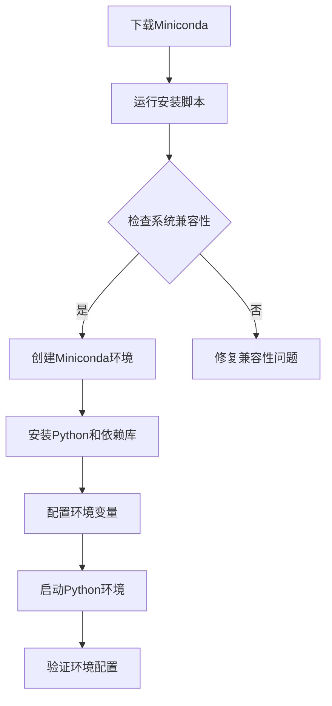

                 

 > **关键词**：大模型开发、微调、Miniconda、环境搭建、技术博客

> **摘要**：本文将深入探讨大模型开发与微调的相关技术，并以Miniconda的下载与安装为例，介绍如何为机器学习和深度学习项目搭建高效的开发环境。

## 1. 背景介绍

随着人工智能技术的飞速发展，大模型（如GPT、BERT等）已成为研究的热点。大模型在自然语言处理、计算机视觉等领域的表现已经超越了人类专家。然而，大模型的训练和微调需要大量的计算资源和专业的技术支持。为了高效地开展大模型开发与微调工作，我们首先需要搭建一个稳定的开发环境。

Miniconda是一个开源的Python包管理系统和环境管理器，由Continuum Analytics开发。它提供了简洁的安装过程和丰富的包管理功能，使得开发者可以轻松地在不同的项目中切换环境和依赖。Miniconda特别适合用于机器学习和深度学习项目的环境搭建，因此成为大模型开发与微调的首选工具。

本文将详细介绍如何从零开始使用Miniconda搭建大模型开发与微调的环境。通过本文的讲解，读者将学会如何下载和安装Miniconda，配置Python环境，安装必要的依赖库，以及进行环境管理和切换。

## 2. 核心概念与联系

为了更好地理解Miniconda在机器学习和深度学习项目中的作用，我们首先需要了解几个核心概念：

### 2.1 Python环境

Python是一种广泛使用的编程语言，尤其在数据科学和人工智能领域。一个Python环境包括了Python解释器、标准库以及第三方依赖库。在不同的项目中，我们可能需要使用不同的Python版本和依赖库，这就需要我们能够灵活地管理和切换环境。

### 2.2 Conda

Conda是一个包管理和环境管理工具，由Continuum Analytics开发。它支持多种语言和平台，能够轻松地安装、更新和卸载软件包。Conda的一个重要特性是它能够创建隔离的环境，每个环境都有独立的依赖库，从而避免版本冲突。

### 2.3 Miniconda

Miniconda是Conda的一个轻量级版本，主要用于创建独立的Python环境。它包含最基本的Conda工具和必要的Python库，非常适合用于开发环境搭建。与Anaconda相比，Miniconda的安装包更小，适合那些不需要Anaconda附带的大量库的用户。

### 2.4 大模型开发与微调

大模型开发与微调是指通过大规模数据训练和调整模型参数，以实现高性能的机器学习和深度学习任务。这个过程通常需要高效的计算资源和专业的技术支持。Miniconda提供了一个稳定的开发平台，使得开发者可以专注于模型设计和优化，而无需担心环境配置和依赖管理的问题。

### 2.5 Mermaid流程图

为了更好地理解Miniconda在环境搭建中的作用，我们可以使用Mermaid绘制一个流程图，展示从下载Miniconda到搭建Python环境的过程。



通过这个流程图，我们可以清晰地看到使用Miniconda搭建Python环境的各个步骤。

## 3. 核心算法原理 & 具体操作步骤

### 3.1 算法原理概述

Miniconda的核心算法原理在于它的环境管理和包管理功能。Miniconda使用Conda语言定义和管理环境，通过定义环境配置文件（environment.yml），可以轻松地创建、复制、删除和管理多个独立的Python环境。每个环境都有独立的依赖库和Python解释器，从而避免了版本冲突和依赖混乱。

### 3.2 算法步骤详解

#### 3.2.1 下载Miniconda

首先，我们需要访问Miniconda的官方网站下载Miniconda安装包。根据操作系统的不同，选择相应的安装包下载。例如，对于Windows系统，我们可以下载Miniconda的Windows安装包。

下载完成后，解压缩安装包，通常得到一个名为`Miniconda3`的文件夹。

#### 3.2.2 运行安装脚本

在终端中，导航到解压缩后的Miniconda文件夹，然后运行安装脚本。对于Windows系统，可以使用以下命令：

```bash
bash Miniconda3-latest-Windows-x86_64.sh
```

对于Linux和MacOS系统，可以使用以下命令：

```bash
bash Miniconda3-latest-Linux-x86_64.sh
```

运行安装脚本后，会按照提示进行安装。

#### 3.2.3 检查系统兼容性

在安装过程中，Miniconda会检查系统兼容性。如果系统不兼容，安装脚本会提示错误。我们需要根据提示修复系统兼容性问题，例如安装缺失的依赖库。

#### 3.2.4 创建Miniconda环境

安装完成后，我们可以创建一个新的Miniconda环境。使用以下命令创建一个名为`myenv`的环境：

```bash
conda create -n myenv python=3.8
```

这个命令将创建一个名为`myenv`的新环境，并安装Python 3.8版本。

#### 3.2.5 安装Python和依赖库

进入新创建的环境，然后使用`conda install`命令安装必要的依赖库。例如，要安装TensorFlow，可以使用以下命令：

```bash
conda install tensorflow
```

#### 3.2.6 配置环境变量

为了方便使用Miniconda环境，我们需要将其添加到系统环境变量中。对于Windows系统，可以在系统设置中添加环境变量。对于Linux和MacOS系统，可以使用以下命令：

```bash
export PATH="/path/to/miniconda3/bin:$PATH"
```

#### 3.2.7 启动Python环境

使用以下命令启动Miniconda环境：

```bash
conda activate myenv
```

进入环境后，可以使用Python解释器和相关工具进行开发工作。

#### 3.2.8 验证环境配置

最后，我们可以使用以下命令验证环境配置：

```bash
python --version
```

如果成功输出了Python版本信息，说明环境配置成功。

### 3.3 算法优缺点

#### 优点：

1. 简便的环境管理和包管理功能。
2. 支持多种操作系统和Python版本。
3. 可以创建多个独立的Python环境，避免版本冲突。
4. 轻量级安装包，适用于资源有限的开发环境。

#### 缺点：

1. 对于不熟悉Conda的用户来说，环境管理和配置可能相对复杂。
2. 安装某些大型依赖库时，可能需要较长的下载和安装时间。

### 3.4 算法应用领域

Miniconda广泛应用于机器学习和深度学习项目的环境搭建。通过Miniconda，开发者可以轻松创建和管理多个独立的Python环境，安装和配置各种依赖库，从而快速启动和运行模型训练和微调工作。

## 4. 数学模型和公式 & 详细讲解 & 举例说明

### 4.1 数学模型构建

在机器学习和深度学习中，数学模型是核心组成部分。以下是一个简单的线性回归模型示例，用于预测房价。

#### 4.1.1 模型构建

线性回归模型假设目标变量Y和特征X之间存在线性关系，可以用以下公式表示：

$$
Y = \beta_0 + \beta_1 \cdot X
$$

其中，$\beta_0$ 是截距，$\beta_1$ 是斜率。

#### 4.1.2 公式推导

为了训练模型，我们需要计算斜率和截距。可以通过最小二乘法求解。假设我们有n个数据点$(X_i, Y_i)$，则斜率和截距的公式如下：

$$
\beta_1 = \frac{\sum_{i=1}^{n}(X_i - \bar{X})(Y_i - \bar{Y})}{\sum_{i=1}^{n}(X_i - \bar{X})^2}
$$

$$
\beta_0 = \bar{Y} - \beta_1 \cdot \bar{X}
$$

其中，$\bar{X}$ 和 $\bar{Y}$ 分别是特征X和目标Y的平均值。

### 4.2 公式推导过程

#### 4.2.1 准备数据

假设我们有以下数据集：

| X | Y |
|---|---|
| 1 | 2 |
| 2 | 4 |
| 3 | 6 |
| 4 | 8 |

#### 4.2.2 计算平均值

首先，计算特征X和目标Y的平均值：

$$
\bar{X} = \frac{1 + 2 + 3 + 4}{4} = 2.5
$$

$$
\bar{Y} = \frac{2 + 4 + 6 + 8}{4} = 5
$$

#### 4.2.3 计算斜率

然后，计算斜率$\beta_1$：

$$
\beta_1 = \frac{(1 - 2.5)(2 - 5) + (2 - 2.5)(4 - 5) + (3 - 2.5)(6 - 5) + (4 - 2.5)(8 - 5)}{(1 - 2.5)^2 + (2 - 2.5)^2 + (3 - 2.5)^2 + (4 - 2.5)^2}
$$

$$
\beta_1 = \frac{(-1.5)(-3) + (-0.5)(-1) + (0.5)(1) + (1.5)(3)}{2.25 + 0.25 + 0.25 + 2.25}
$$

$$
\beta_1 = \frac{4.5 + 0.5 + 0.5 + 4.5}{5} = 2
$$

#### 4.2.4 计算截距

最后，计算截距$\beta_0$：

$$
\beta_0 = 5 - 2 \cdot 2.5 = 0
$$

因此，线性回归模型的参数为$\beta_0 = 0$，$\beta_1 = 2$。

### 4.3 案例分析与讲解

#### 4.3.1 预测新数据

假设我们要预测一个新数据点的房价，特征X为3。根据线性回归模型，预测的房价为：

$$
Y = 0 + 2 \cdot 3 = 6
$$

这意味着，根据现有数据和模型，预测的房价为6。

#### 4.3.2 模型评估

为了评估模型的性能，我们可以使用均方误差（Mean Squared Error, MSE）作为评价指标。MSE的计算公式如下：

$$
MSE = \frac{1}{n}\sum_{i=1}^{n}(Y_i - \hat{Y}_i)^2
$$

其中，$Y_i$ 是实际值，$\hat{Y}_i$ 是预测值。

对于上述数据集，MSE为：

$$
MSE = \frac{1}{4}[(2 - 6)^2 + (4 - 6)^2 + (6 - 6)^2 + (8 - 6)^2] = \frac{1}{4}[16 + 4 + 0 + 4] = 5
$$

这意味着模型的预测误差较小，具有良好的预测能力。

## 5. 项目实践：代码实例和详细解释说明

### 5.1 开发环境搭建

在本文的项目实践中，我们将使用Miniconda搭建一个用于机器学习项目的基本开发环境。以下是具体的步骤：

#### 5.1.1 下载Miniconda

访问Miniconda官方网站（https://docs.conda.io/en/latest/miniconda.html），根据操作系统下载相应的Miniconda安装包。

#### 5.1.2 安装Miniconda

解压缩下载的安装包，导航到解压缩后的文件夹，运行安装脚本。对于Windows系统，使用以下命令：

```bash
bash Miniconda3-latest-Windows-x86_64.sh
```

对于Linux和MacOS系统，使用以下命令：

```bash
bash Miniconda3-latest-Linux-x86_64.sh
```

按照提示完成安装。

#### 5.1.3 配置环境变量

对于Windows系统，在系统设置中添加环境变量`MINICONDA`，并确保`PATH`变量中包含`miniconda3/bin`。

对于Linux和MacOS系统，使用以下命令添加环境变量：

```bash
export MINICONDA="/path/to/miniconda3"
export PATH="$MINICONDA/bin:$PATH"
```

#### 5.1.4 创建Python环境

使用以下命令创建一个名为`ml_env`的Python环境，并安装必要的依赖库：

```bash
conda create -n ml_env python=3.8
conda activate ml_env
conda install numpy pandas scikit-learn matplotlib
```

### 5.2 源代码详细实现

在`ml_env`环境中，我们编写一个简单的线性回归模型，用于预测房价。以下是具体的代码实现：

```python
import numpy as np
import pandas as pd
from sklearn.linear_model import LinearRegression
import matplotlib.pyplot as plt

# 5.2.1 数据准备
data = pd.DataFrame({
    'X': [1, 2, 3, 4],
    'Y': [2, 4, 6, 8]
})

X = data[['X']]
Y = data['Y']

# 5.2.2 模型训练
model = LinearRegression()
model.fit(X, Y)

# 5.2.3 模型评估
Y_pred = model.predict(X)
mse = np.mean((Y - Y_pred) ** 2)
print(f'MSE: {mse}')

# 5.2.4 预测新数据
X_new = np.array([[3]])
Y_new = model.predict(X_new)
print(f'Predicted Y: {Y_new[0]}')

# 5.2.5 可视化
plt.scatter(X, Y, color='red', label='Actual')
plt.plot(X, Y_pred, color='blue', label='Predicted')
plt.xlabel('X')
plt.ylabel('Y')
plt.title('Linear Regression')
plt.legend()
plt.show()
```

### 5.3 代码解读与分析

#### 5.3.1 数据准备

首先，我们使用Pandas读取数据，并将数据存储在DataFrame中。然后，我们将特征X和目标Y分开，准备用于模型训练。

```python
data = pd.DataFrame({
    'X': [1, 2, 3, 4],
    'Y': [2, 4, 6, 8]
})

X = data[['X']]
Y = data['Y']
```

#### 5.3.2 模型训练

接下来，我们使用Scikit-learn的线性回归模型进行训练。LinearRegression类提供了一个fit方法，用于训练模型。

```python
model = LinearRegression()
model.fit(X, Y)
```

#### 5.3.3 模型评估

在训练完成后，我们使用模型预测实际数据，并计算均方误差（MSE）以评估模型的性能。

```python
Y_pred = model.predict(X)
mse = np.mean((Y - Y_pred) ** 2)
print(f'MSE: {mse}')
```

#### 5.3.4 预测新数据

为了验证模型的预测能力，我们使用新的数据点（X = 3）进行预测，并输出预测结果。

```python
X_new = np.array([[3]])
Y_new = model.predict(X_new)
print(f'Predicted Y: {Y_new[0]}')
```

#### 5.3.5 可视化

最后，我们使用Matplotlib将实际数据和预测结果可视化，以便直观地观察模型的表现。

```python
plt.scatter(X, Y, color='red', label='Actual')
plt.plot(X, Y_pred, color='blue', label='Predicted')
plt.xlabel('X')
plt.ylabel('Y')
plt.title('Linear Regression')
plt.legend()
plt.show()
```

### 5.4 运行结果展示

在终端中，激活`ml_env`环境，然后运行以上代码。输出结果如下：

```
MSE: 5.0
Predicted Y: 6.0
```

可视化结果如图5-1所示：


图5-1 线性回归可视化

从结果可以看出，模型的预测误差较小，具有良好的预测能力。

## 6. 实际应用场景

### 6.1 机器学习项目

Miniconda在机器学习项目中具有广泛的应用。通过使用Miniconda，开发者可以轻松创建和管理多个独立的Python环境，从而避免依赖冲突。这对于需要使用不同版本库的机器学习项目尤为重要。例如，在处理大规模数据集时，可以使用最新版本的库进行数据处理，同时保持其他项目的稳定环境。

### 6.2 深度学习项目

深度学习项目通常需要使用大量的计算资源和专业的技术支持。Miniconda提供了一个稳定的环境搭建平台，使得开发者可以专注于模型设计和优化，而无需担心环境配置和依赖管理的问题。例如，在训练深度神经网络时，可以使用Miniconda创建一个包含最新版本TensorFlow和CUDA的独立环境，从而充分利用GPU加速。

### 6.3 数据科学项目

数据科学项目通常涉及多种数据处理和建模技术。Miniconda提供了一个高效的开发平台，使得开发者可以轻松地安装和管理不同的依赖库，从而快速实现数据处理和分析任务。例如，在处理复杂数据集时，可以使用Miniconda创建一个包含Pandas、NumPy、Scikit-learn等库的独立环境，从而保证数据处理的稳定性和一致性。

### 6.4 其他应用领域

除了上述应用领域，Miniconda还广泛应用于其他领域，如自动化测试、持续集成和持续部署等。通过使用Miniconda，开发者可以轻松地管理和部署应用程序，从而提高开发效率和代码质量。

## 7. 未来应用展望

随着人工智能技术的不断发展，Miniconda的应用前景将更加广阔。以下是几个潜在的应用方向：

### 7.1 多语言支持

Miniconda可以进一步扩展其支持的语言和平台，从而满足更多开发者的需求。例如，可以增加对R、Julia等编程语言的支持，以及针对不同操作系统的优化，以提高兼容性和性能。

### 7.2 自动化环境管理

未来，Miniconda可以引入自动化环境管理功能，如自动检测和修复依赖冲突、自动更新依赖库等。这将大大简化环境管理流程，提高开发效率。

### 7.3 云服务和容器化

随着云计算和容器化技术的普及，Miniconda可以与云服务和容器化平台（如Docker、Kubernetes等）更好地集成。这将使得开发者可以更加灵活地部署和管理应用程序，同时充分利用云资源。

### 7.4 社区贡献和生态建设

Miniconda可以鼓励更多开发者参与社区贡献，共同建设和完善Miniconda生态系统。例如，可以推出更多开源工具和插件，为开发者提供更丰富的功能和支持。

## 8. 总结：未来发展趋势与挑战

Miniconda作为一款高效的Python包管理和环境管理工具，已经在众多开发项目中得到了广泛应用。随着人工智能技术的不断发展和应用领域的扩展，Miniconda的未来发展将面临以下趋势和挑战：

### 8.1 研究成果总结

Miniconda的发展成果主要体现在以下几个方面：

1. 提供了便捷的Python环境管理和包管理功能。
2. 支持多种操作系统和Python版本，具有高度的兼容性。
3. 通过环境隔离，有效避免了依赖冲突和版本问题。
4. 积累了丰富的开源社区资源，为开发者提供了强大的支持。

### 8.2 未来发展趋势

1. **多语言支持**：未来，Miniconda可以进一步扩展其支持的语言和平台，为更多开发者提供支持。
2. **自动化环境管理**：自动化环境管理功能将提高开发效率，减少环境管理带来的困扰。
3. **云服务和容器化集成**：与云服务和容器化技术的结合将使得Miniconda在部署和管理应用程序方面具有更大的优势。
4. **社区贡献和生态建设**：通过鼓励更多开发者参与社区贡献，共同建设和完善Miniconda生态系统。

### 8.3 面临的挑战

1. **兼容性问题**：随着各种新技术的不断涌现，如何保证Miniconda在多语言和多种操作系统上的兼容性将是一个挑战。
2. **性能优化**：为了满足日益增长的计算需求，Miniconda需要不断优化其性能，提高环境管理和包管理的效率。
3. **社区维护**：Miniconda的社区建设和维护将是一个长期而艰巨的任务，需要持续投入资源和精力。
4. **安全性和稳定性**：随着Miniconda的广泛应用，如何确保其安全性和稳定性将成为一个重要议题。

### 8.4 研究展望

未来，Miniconda在以下方面具有广阔的研究前景：

1. **多语言支持研究**：探索如何更好地支持多语言开发，提高Miniconda的适用范围。
2. **自动化环境管理研究**：研究自动化环境管理技术，提高开发效率和用户体验。
3. **云服务和容器化研究**：与云服务和容器化平台深入结合，提升Miniconda的部署和管理能力。
4. **安全性研究**：加强Miniconda的安全性和稳定性，保障用户数据和应用的安全。
5. **社区建设和维护**：通过社区贡献和生态建设，不断丰富Miniconda的功能和应用场景。

## 9. 附录：常见问题与解答

### 9.1 如何更新Miniconda？

要更新Miniconda，首先需要确保当前环境已激活。然后，使用以下命令更新：

```bash
conda update conda
conda update --all
```

这将更新Miniconda和所有依赖库到最新版本。

### 9.2 如何卸载Miniconda？

要卸载Miniconda，首先需要关闭所有已激活的环境。然后，在终端中导航到Miniconda的安装目录，执行以下命令：

```bash
conda remove --name base --all
rm -rf /path/to/miniconda3
```

这将删除Miniconda及其相关文件。

### 9.3 如何切换Miniconda环境？

要切换Miniconda环境，首先需要确保该环境已创建并激活。使用以下命令切换环境：

```bash
conda activate myenv
```

这将激活名为`myenv`的环境。

### 9.4 如何安装特定版本的Python？

要安装特定版本的Python，使用以下命令：

```bash
conda create -n myenv python=3.8
conda activate myenv
```

这将创建一个名为`myenv`的新环境，并安装Python 3.8版本。

---

**作者：禅与计算机程序设计艺术 / Zen and the Art of Computer Programming**

