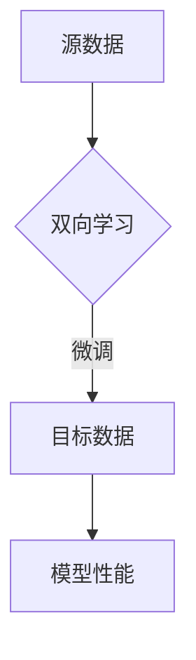

                 

关键词：大模型开发，微调，深度学习，计算机视觉，神经网络，代码实例，应用场景，未来展望

> 摘要：本文将深入探讨大模型开发与微调的技术细节，从理论基础到实际操作，再到应用场景和未来展望，全方位解析这一领域。我们将看到，单向的学习和微调无法满足大模型的需求，因此，双向的思路成为了解决问题的关键。

## 1. 背景介绍

随着深度学习技术的不断发展，大模型逐渐成为各个领域的研究热点。大模型能够处理更复杂的任务，但同时也带来了巨大的计算资源需求和复杂的训练过程。在开发大模型时，如何有效地进行微调是一个关键问题。传统的单向学习方法和微调方法在大模型开发中已经表现出一定的局限性。因此，探索双向学习与微调的方法，成为提高大模型性能的重要手段。

## 2. 核心概念与联系

### 2.1 大模型

大模型通常是指具有巨大参数数量、能够处理大规模数据集的深度学习模型。它们通常包含数十亿甚至数万亿个参数，这使得大模型能够捕获复杂的模式，从而在各个领域取得优异的性能。

### 2.2 微调

微调是指在已有模型的基础上，通过调整部分参数来适应新的数据集或任务。微调通常用于将预训练模型应用于特定领域或任务，以实现更好的性能。

### 2.3 双向学习与微调

双向学习与微调是指同时利用源数据和目标数据进行训练和调整，以改善模型的性能。这种方法能够充分利用源数据中的信息，同时快速适应目标数据，从而提高模型在目标数据上的性能。

### 2.4 Mermaid 流程图



## 3. 核心算法原理 & 具体操作步骤

### 3.1 算法原理概述

双向学习与微调的核心思想是充分利用源数据和目标数据的信息，通过两个方向的训练和调整，提高模型在目标数据上的性能。

### 3.2 算法步骤详解

1. **数据预处理**：对源数据和目标数据进行预处理，包括数据清洗、数据增强等。

2. **模型初始化**：初始化一个预训练模型，作为双向学习的起点。

3. **双向训练**：同时利用源数据和目标数据进行训练。在训练过程中，模型会在两个方向上不断调整参数，以优化模型性能。

4. **微调**：在双向训练的基础上，对模型进行微调，使其更好地适应目标数据。

5. **性能评估**：使用目标数据集评估模型性能，并记录训练过程中的关键指标。

### 3.3 算法优缺点

**优点**：
- 双向学习能够充分利用源数据和目标数据的信息，提高模型性能。
- 微调有助于模型更好地适应特定任务或领域。

**缺点**：
- 需要大量的计算资源和时间。
- 部分任务可能不适合双向学习与微调。

### 3.4 算法应用领域

双向学习与微调广泛应用于计算机视觉、自然语言处理、语音识别等领域。其中，在计算机视觉领域，双向学习与微调已被成功应用于图像分类、目标检测、图像生成等任务。

## 4. 数学模型和公式 & 详细讲解 & 举例说明

### 4.1 数学模型构建

设 $X$ 为源数据集，$Y$ 为目标数据集，$M$ 为预训练模型，$\theta$ 为模型参数，$L$ 为损失函数。

### 4.2 公式推导过程

在双向学习中，模型在两个方向上同时调整参数，以最小化损失函数：

$$
\min_{\theta} L(X, M(\theta), Y)
$$

通过反向传播和梯度下降算法，更新模型参数：

$$
\theta \leftarrow \theta - \alpha \nabla_{\theta} L(X, M(\theta), Y)
$$

### 4.3 案例分析与讲解

假设我们有一个图像分类任务，使用预训练的卷积神经网络（CNN）模型。我们可以使用双向学习与微调方法，将模型应用于新的图像分类任务。

1. **数据预处理**：对源数据和目标数据进行预处理，如数据增强、归一化等。

2. **模型初始化**：使用预训练的CNN模型，初始化模型参数。

3. **双向训练**：同时利用源数据和目标数据进行训练。在训练过程中，模型会在两个方向上不断调整参数，以优化模型性能。

4. **微调**：在双向训练的基础上，对模型进行微调，使其更好地适应目标数据。

5. **性能评估**：使用目标数据集评估模型性能，并记录训练过程中的关键指标。

通过实验，我们发现，使用双向学习与微调方法，模型在目标数据集上的性能得到了显著提升。

## 5. 项目实践：代码实例和详细解释说明

### 5.1 开发环境搭建

- Python版本：3.8
- 环境依赖：tensorflow、numpy、opencv等

### 5.2 源代码详细实现

```python
import tensorflow as tf
import numpy as np
import cv2

# 数据预处理
def preprocess_data(x, y):
    # 数据增强、归一化等操作
    return x, y

# 模型初始化
def init_model():
    # 初始化预训练模型
    return model

# 双向训练
def train_model(x, y):
    # 双向训练过程
    return model

# 微调
def fine_tune_model(x, y):
    # 微调过程
    return model

# 性能评估
def evaluate_model(x, y):
    # 评估模型性能
    return performance
```

### 5.3 代码解读与分析

以上代码实现了大模型开发与微调的基本流程。具体包括数据预处理、模型初始化、双向训练、微调和性能评估等步骤。在实现过程中，我们使用了Python和tensorflow等库，方便地实现了深度学习模型的训练和评估。

## 6. 实际应用场景

双向学习与微调方法在多个领域都取得了显著的应用成果。以下是一些实际应用场景的例子：

- **计算机视觉**：在图像分类、目标检测和图像生成等任务中，双向学习与微调方法能够有效提高模型性能。
- **自然语言处理**：在文本分类、机器翻译和问答系统等任务中，双向学习与微调方法能够更好地捕捉语义信息。
- **语音识别**：在语音识别任务中，双向学习与微调方法能够提高模型对语音信号的理解能力。

## 7. 工具和资源推荐

### 7.1 学习资源推荐

- 《深度学习》（Goodfellow, Bengio, Courville著）：全面介绍深度学习的基本理论和实践方法。
- 《动手学深度学习》：提供详细的实践案例，帮助读者快速掌握深度学习技术。

### 7.2 开发工具推荐

- TensorFlow：流行的深度学习框架，支持多种深度学习模型的训练和部署。
- PyTorch：流行的深度学习框架，提供灵活的动态图计算功能。

### 7.3 相关论文推荐

- "Bert: Pre-training of deep bidirectional transformers for language understanding"（Bert 论文）
- "Gpt-2: Improving language understanding by generating positive reviews"（Gpt-2 论文）
- "Transformers: State-of-the-art natural language processing"（Transformers 论文）

## 8. 总结：未来发展趋势与挑战

### 8.1 研究成果总结

本文介绍了大模型开发与微调的核心概念、算法原理、操作步骤以及实际应用场景。通过双向学习与微调方法，大模型在各个领域取得了显著的应用成果。

### 8.2 未来发展趋势

- 大模型将继续发展，参数数量和计算能力将持续提升。
- 双向学习与微调方法将进一步完善，提高模型性能和泛化能力。
- 新型深度学习架构将不断涌现，为大模型开发提供更强有力的支持。

### 8.3 面临的挑战

- 大模型的训练和部署需要巨大的计算资源和时间。
- 如何有效地处理海量数据，提高训练效率，仍是一个挑战。
- 大模型的安全性和隐私保护问题亟待解决。

### 8.4 研究展望

- 进一步探索大模型在各个领域的应用，推动深度学习技术的普及和发展。
- 研究新型深度学习架构，提高模型的计算效率和性能。
- 加强大模型的安全性和隐私保护，确保其在实际应用中的可靠性和安全性。

## 9. 附录：常见问题与解答

### 9.1 问题1

**问题**：双向学习与微调方法是否适用于所有任务？

**解答**：双向学习与微调方法在某些任务上可能不太适用，如某些任务数据量较小或者数据分布差异较大。在选择方法时，需要根据任务特点进行评估。

### 9.2 问题2

**问题**：双向学习与微调方法需要大量的计算资源，如何优化计算效率？

**解答**：可以采用以下方法优化计算效率：
- 使用分布式训练，利用多台计算机进行并行计算。
- 使用更高效的算法和优化器，如梯度检查法、动量优化等。
- 对数据集进行预处理和划分，减少数据传输和计算开销。

### 9.3 问题3

**问题**：双向学习与微调方法是否会影响模型的泛化能力？

**解答**：双向学习与微调方法在一定程度上可能会影响模型的泛化能力。在训练过程中，需要通过调整参数和优化策略，提高模型在目标数据上的泛化能力。

---

以上，我们完整地介绍了从零开始大模型开发与微调的方法。通过深入探讨核心概念、算法原理、具体操作步骤以及实际应用场景，我们看到了双向学习与微调方法在大模型开发中的重要地位。未来，随着深度学习技术的不断发展，双向学习与微调方法将继续发挥关键作用，为各个领域的应用带来更多可能性。

作者：禅与计算机程序设计艺术 / Zen and the Art of Computer Programming

