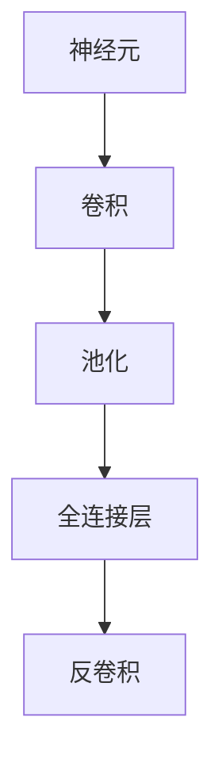

                 

关键词：卷积神经网络、深度学习、大模型开发、微调、图像识别、神经网络架构

摘要：本文将从零开始，详细介绍卷积神经网络（Convolutional Neural Networks，简称CNN）的开发与微调过程。我们将首先介绍CNN的基础概念及其在图像识别领域的应用，然后深入探讨CNN的核心算法原理、数学模型、项目实践以及未来应用展望，帮助读者全面了解并掌握这一重要的深度学习技术。

## 1. 背景介绍

卷积神经网络（CNN）是一种特殊的神经网络，它广泛应用于图像处理、计算机视觉等领域。与传统神经网络相比，CNN在图像识别任务上表现出了更高的准确率和效率。随着深度学习技术的快速发展，CNN已经成为当前人工智能领域的重要研究方向之一。

CNN的出现可以追溯到20世纪80年代末，当时为了解决图像识别问题，研究人员开始探索基于卷积运算的神经网络模型。1989年，Canadian AI researcher Yann LeCun提出了第一个卷积神经网络LeNet，并在手写数字识别任务中取得了显著的效果。此后，随着计算能力的提升和大数据的发展，CNN逐渐成为图像识别领域的核心技术。

本文将围绕CNN的开发与微调展开讨论，旨在为读者提供一个全面、系统的学习指南。首先，我们将介绍CNN的基础概念和核心算法原理；然后，通过一个实际项目案例，展示CNN在图像识别任务中的应用过程；最后，我们将探讨CNN的未来发展趋势和面临的挑战。

## 2. 核心概念与联系

在深入探讨CNN之前，我们需要了解一些核心概念和它们之间的联系。以下是CNN中涉及的一些关键概念及其简要说明：

### 2.1 神经元

神经元是神经网络的基本单元，它通过接收输入信号并产生输出信号来完成信息处理。在CNN中，神经元通常用于实现卷积、池化和全连接等操作。

### 2.2 卷积

卷积是一种数学运算，用于计算输入信号和滤波器之间的相关性。在CNN中，卷积操作用于提取图像中的特征，从而实现特征提取和降维。

### 2.3 池化

池化是一种用于降低特征图维度和减少过拟合的技术。在CNN中，池化操作通常用于在卷积层之后减小特征图的尺寸。

### 2.4 全连接层

全连接层是一种传统的神经网络层，它将前一层的所有输出作为输入，并通过权重矩阵和偏置项计算输出。在CNN中，全连接层通常用于分类和回归任务。

### 2.5 反卷积

反卷积是一种逆卷积操作，用于恢复原始图像的分辨率。在CNN中，反卷积通常用于图像重建任务。

接下来，我们将使用Mermaid流程图（Mermaid 流程节点中不要有括号、逗号等特殊字符）来展示这些核心概念之间的联系：



通过上述流程图，我们可以清晰地看到CNN中各个核心概念之间的关联和作用。

## 3. 核心算法原理 & 具体操作步骤

### 3.1 算法原理概述

卷积神经网络（CNN）的核心算法原理包括卷积、池化、全连接层和反卷积等操作。这些操作共同作用，实现图像的特征提取、降维、分类和重建等功能。

#### 3.1.1 卷积

卷积是一种数学运算，用于计算输入信号和滤波器之间的相关性。在CNN中，卷积操作用于提取图像中的特征，从而实现特征提取和降维。卷积操作的实现通常采用卷积核（也称为滤波器）进行。

#### 3.1.2 池化

池化是一种用于降低特征图维度和减少过拟合的技术。在CNN中，池化操作通常用于在卷积层之后减小特征图的尺寸。常见的池化方法包括最大池化和平均池化。

#### 3.1.3 全连接层

全连接层是一种传统的神经网络层，它将前一层的所有输出作为输入，并通过权重矩阵和偏置项计算输出。在CNN中，全连接层通常用于分类和回归任务。

#### 3.1.4 反卷积

反卷积是一种逆卷积操作，用于恢复原始图像的分辨率。在CNN中，反卷积通常用于图像重建任务。

### 3.2 算法步骤详解

#### 3.2.1 数据预处理

在训练CNN之前，需要对图像数据进行预处理，包括图像大小调整、归一化、数据增强等操作。这些操作有助于提高模型训练效果和泛化能力。

#### 3.2.2 卷积层

卷积层是CNN的核心部分，用于提取图像特征。卷积层通常由多个卷积核组成，每个卷积核负责提取图像中的不同特征。卷积操作的具体步骤如下：

1. 将卷积核滑动到输入图像上，计算每个位置的特征图。
2. 对特征图进行激活函数（如ReLU）处理。
3. 将特征图输出作为下一层的输入。

#### 3.2.3 池化层

池化层用于减小特征图的尺寸，从而降低计算复杂度和过拟合风险。池化操作的具体步骤如下：

1. 将特征图分成若干个非重叠区域。
2. 对每个区域内的像素值进行最大值或平均值运算。
3. 将运算结果作为池化层的输出。

#### 3.2.4 全连接层

全连接层用于实现图像分类和回归任务。全连接层的具体步骤如下：

1. 将特征图的每个像素值视为一个特征。
2. 通过权重矩阵和偏置项计算输出。
3. 对输出进行激活函数（如softmax）处理。

#### 3.2.5 反卷积层

反卷积层用于恢复原始图像的分辨率，通常用于图像重建任务。反卷积层的具体步骤如下：

1. 将输入特征图扩展到原始图像尺寸。
2. 通过反卷积操作计算输出。
3. 对输出进行激活函数（如ReLU）处理。

### 3.3 算法优缺点

#### 3.3.1 优点

1. CNN能够自动提取图像中的特征，降低了人工设计的复杂性。
2. CNN在图像识别任务中表现出了较高的准确率和效率。
3. CNN可以处理不同尺寸和分辨率的图像。

#### 3.3.2 缺点

1. CNN的训练过程需要大量计算资源和时间，训练过程相对较慢。
2. CNN在处理复杂场景和图像时可能存在过拟合问题。

### 3.4 算法应用领域

卷积神经网络（CNN）在图像识别、目标检测、图像分割、图像生成等计算机视觉领域得到了广泛应用。以下是一些典型的应用案例：

1. **图像识别**：如人脸识别、物体识别、场景分类等。
2. **目标检测**：如行人检测、车辆检测、人脸检测等。
3. **图像分割**：如医学图像分割、道路分割、图像分割等。
4. **图像生成**：如风格迁移、图像超分辨率、图像生成等。

## 4. 数学模型和公式 & 详细讲解 & 举例说明

### 4.1 数学模型构建

卷积神经网络（CNN）的数学模型主要包括卷积层、池化层、全连接层和反卷积层等。以下分别介绍各层的数学模型。

#### 4.1.1 卷积层

卷积层的数学模型可以表示为：

\[ (x_i^k)_{1\le i\le n_1, 1\le k\le n_c} = \sum_{j=1}^{n_f} w_{ij}^k f_j \]

其中，\(x_i^k\)表示卷积层中第\(i\)个特征图的第\(k\)个元素，\(w_{ij}^k\)表示卷积核中第\(i\)行第\(j\)列的权重，\(f_j\)表示输入特征图中第\(j\)个特征。

#### 4.1.2 池化层

池化层的数学模型可以表示为：

\[ y_i = \text{pool}_\text{max}(x_{i,1}, x_{i,2}, \dots, x_{i,n}) \]

其中，\(y_i\)表示池化层中第\(i\)个元素，\(\text{pool}_\text{max}\)表示最大池化操作，\(x_{i,1}, x_{i,2}, \dots, x_{i,n}\)表示输入特征图中第\(i\)个特征的所有值。

#### 4.1.3 全连接层

全连接层的数学模型可以表示为：

\[ z_j = \sum_{i=1}^{n} w_{ij} x_i + b_j \]

其中，\(z_j\)表示全连接层中第\(j\)个元素的输出，\(w_{ij}\)表示权重，\(b_j\)表示偏置项，\(x_i\)表示输入特征图中第\(i\)个特征。

#### 4.1.4 反卷积层

反卷积层的数学模型可以表示为：

\[ y_i = \sum_{j=1}^{n} w_{ij}^T x_j + b_i \]

其中，\(y_i\)表示反卷积层中第\(i\)个元素的输出，\(w_{ij}^T\)表示反卷积核中第\(i\)行第\(j\)列的转置，\(x_j\)表示输入特征图中第\(j\)个特征。

### 4.2 公式推导过程

为了更好地理解卷积神经网络（CNN）的数学模型，我们以下对一些关键公式进行推导。

#### 4.2.1 卷积操作

卷积操作的推导过程如下：

\[ \begin{align*}
    (x_i^k)_{1\le i\le n_1, 1\le k\le n_c} &= \sum_{j=1}^{n_f} w_{ij}^k f_j \\
    &= \sum_{j=1}^{n_f} \sum_{p=1}^{n_2} \sum_{q=1}^{n_3} w_{ij}^k g_{pj} h_{qj} \\
    &= \sum_{j=1}^{n_f} \sum_{p=1}^{n_2} g_{pj} (h_{1j} w_{i1}^k + h_{2j} w_{i2}^k + \dots + h_{n_2j} w_{i(n_2+1)}^k) \\
    &= \sum_{j=1}^{n_f} g_j \cdot \text{ReLU}(h_j \cdot W^k)
\end{align*} \]

其中，\(x_i^k\)表示卷积层中第\(i\)个特征图的第\(k\)个元素，\(w_{ij}^k\)表示卷积核中第\(i\)行第\(j\)列的权重，\(f_j\)表示输入特征图中第\(j\)个特征，\(g_j\)表示卷积核中第\(j\)行的权重，\(h_j\)表示输入特征图中第\(j\)个特征，\(\text{ReLU}\)表示ReLU激活函数，\(W^k\)表示卷积核。

#### 4.2.2 池化操作

池化操作的推导过程如下：

\[ \begin{align*}
    y_i &= \text{pool}_\text{max}(x_{i,1}, x_{i,2}, \dots, x_{i,n}) \\
    &= \max(x_{i,1}, x_{i,2}, \dots, x_{i,n})
\end{align*} \]

其中，\(y_i\)表示池化层中第\(i\)个元素，\(\text{pool}_\text{max}\)表示最大池化操作，\(x_{i,1}, x_{i,2}, \dots, x_{i,n}\)表示输入特征图中第\(i\)个特征的所有值。

#### 4.2.3 全连接层

全连接层的推导过程如下：

\[ \begin{align*}
    z_j &= \sum_{i=1}^{n} w_{ij} x_i + b_j \\
    &= \sum_{i=1}^{n} w_{ij} h_i + b_j \\
    &= \text{ReLU}(\sum_{i=1}^{n} w_{ij} h_i + b_j)
\end{align*} \]

其中，\(z_j\)表示全连接层中第\(j\)个元素的输出，\(w_{ij}\)表示权重，\(b_j\)表示偏置项，\(h_i\)表示输入特征图中第\(i\)个特征。

#### 4.2.4 反卷积层

反卷积层的推导过程如下：

\[ \begin{align*}
    y_i &= \sum_{j=1}^{n} w_{ij}^T x_j + b_i \\
    &= \sum_{j=1}^{n} (w_{ji}^T)^T x_j + b_i \\
    &= \text{ReLU}(\sum_{j=1}^{n} w_{ji} x_j + b_i)
\end{align*} \]

其中，\(y_i\)表示反卷积层中第\(i\)个元素的输出，\(w_{ij}^T\)表示反卷积核中第\(i\)行第\(j\)列的转置，\(b_i\)表示偏置项。

### 4.3 案例分析与讲解

为了更好地理解卷积神经网络（CNN）的数学模型，我们以下通过一个实际案例进行分析和讲解。

假设我们有一个输入图像\(I\)，其大小为\(128 \times 128 \times 3\)（高度、宽度、通道数）。我们需要通过一个简单的CNN模型对其进行图像识别。

### 4.3.1 数据预处理

首先，我们需要对输入图像进行预处理，包括归一化、数据增强等操作。

- **归一化**：将图像的像素值缩放到\[0, 1\]范围内。
- **数据增强**：通过旋转、翻转、缩放等操作增加训练数据的多样性。

### 4.3.2 卷积层

我们使用一个3×3的卷积核进行卷积操作，提取图像中的局部特征。

- **卷积核**：设置卷积核的权重和偏置项，并进行ReLU激活函数处理。
- **激活函数**：使用ReLU激活函数，将卷积后的特征图进行激活。

### 4.3.3 池化层

我们对卷积后的特征图进行2×2的最大池化操作，减小特征图的尺寸。

- **池化方法**：使用最大池化方法，将特征图中的每个2×2区域进行最大值运算。

### 4.3.4 全连接层

我们对池化后的特征图进行全连接操作，将特征图中的每个像素值视为一个特征。

- **全连接层**：设置全连接层的权重和偏置项，并进行softmax激活函数处理。
- **激活函数**：使用softmax激活函数，将输出结果进行概率分布计算。

### 4.3.5 反卷积层

我们对全连接层的输出进行反卷积操作，恢复原始图像的分辨率。

- **反卷积层**：设置反卷积层的权重和偏置项，并进行ReLU激活函数处理。

### 4.3.6 模型训练与评估

我们对CNN模型进行训练和评估，通过调整模型参数，优化模型性能。

- **训练过程**：使用梯度下降算法，更新模型参数，优化模型性能。
- **评估过程**：使用验证集和测试集，评估模型在图像识别任务上的准确率和效率。

通过以上案例分析和讲解，我们可以看到卷积神经网络（CNN）的数学模型是如何构建和推导的。在实际应用中，我们需要根据具体任务需求，调整模型结构、参数设置等，以实现更好的性能和效果。

## 5. 项目实践：代码实例和详细解释说明

在本节中，我们将通过一个简单的项目实践，展示卷积神经网络（CNN）的开发和微调过程。我们将在Python环境中使用TensorFlow和Keras库来实现一个简单的CNN模型，用于图像识别任务。

### 5.1 开发环境搭建

首先，我们需要搭建一个合适的开发环境。以下是搭建过程的基本步骤：

1. **安装Python**：确保Python版本为3.6或更高版本。

2. **安装TensorFlow**：在终端中运行以下命令安装TensorFlow：

   ```bash
   pip install tensorflow
   ```

3. **安装Keras**：TensorFlow自带了Keras库，可以直接使用。如果需要安装独立的Keras版本，可以运行以下命令：

   ```bash
   pip install keras
   ```

4. **创建项目文件夹**：在终端中创建一个新文件夹，例如`cnn_project`，并进入该文件夹。

5. **创建虚拟环境**：在项目文件夹中创建一个虚拟环境，以便更好地管理项目依赖：

   ```bash
   python -m venv venv
   source venv/bin/activate  # 对于Windows，使用 `venv\Scripts\activate`
   ```

6. **安装项目依赖**：在虚拟环境中安装项目所需的依赖库：

   ```bash
   pip install tensorflow numpy matplotlib
   ```

### 5.2 源代码详细实现

以下是一个简单的CNN模型实现，用于手写数字识别任务。我们将使用MNIST数据集进行训练和测试。

```python
import tensorflow as tf
from tensorflow.keras import layers, models
from tensorflow.keras.datasets import mnist
from tensorflow.keras.utils import to_categorical

# 加载MNIST数据集
(train_images, train_labels), (test_images, test_labels) = mnist.load_data()

# 数据预处理
train_images = train_images.reshape((60000, 28, 28, 1)).astype('float32') / 255
test_images = test_images.reshape((10000, 28, 28, 1)).astype('float32') / 255

train_labels = to_categorical(train_labels)
test_labels = to_categorical(test_labels)

# 构建CNN模型
model = models.Sequential()
model.add(layers.Conv2D(32, (3, 3), activation='relu', input_shape=(28, 28, 1)))
model.add(layers.MaxPooling2D((2, 2)))
model.add(layers.Conv2D(64, (3, 3), activation='relu'))
model.add(layers.MaxPooling2D((2, 2)))
model.add(layers.Conv2D(64, (3, 3), activation='relu'))

# 添加全连接层和输出层
model.add(layers.Flatten())
model.add(layers.Dense(64, activation='relu'))
model.add(layers.Dense(10, activation='softmax'))

# 编译模型
model.compile(optimizer='adam',
              loss='categorical_crossentropy',
              metrics=['accuracy'])

# 训练模型
model.fit(train_images, train_labels, epochs=5, batch_size=64)

# 评估模型
test_loss, test_acc = model.evaluate(test_images, test_labels)
print(f"Test accuracy: {test_acc:.2f}")
```

### 5.3 代码解读与分析

上述代码实现了一个简单的卷积神经网络模型，用于手写数字识别任务。以下是对代码的详细解读：

1. **导入库**：我们首先导入所需的TensorFlow和Keras库。

2. **加载MNIST数据集**：使用`keras.datasets.mnist`加载MNIST数据集。数据集分为训练集和测试集两部分。

3. **数据预处理**：对图像数据进行预处理，包括归一化和重塑。将图像数据从\[0, 255\]范围缩放到\[0, 1\]，并将标签进行one-hot编码。

4. **构建CNN模型**：使用`models.Sequential`创建一个序列模型，并添加多个卷积层和池化层。我们使用了两个卷积层，每个卷积层后跟一个最大池化层。

5. **添加全连接层和输出层**：在卷积层之后，我们添加了一个全连接层和输出层。全连接层用于将特征图中的所有像素值转换为特征向量，输出层用于实现分类任务。

6. **编译模型**：使用`compile`方法配置模型，指定优化器、损失函数和评估指标。

7. **训练模型**：使用`fit`方法训练模型，指定训练集、训练轮数和批量大小。

8. **评估模型**：使用`evaluate`方法评估模型在测试集上的性能。

通过上述代码示例，我们可以看到如何使用TensorFlow和Keras构建、训练和评估一个简单的卷积神经网络模型。在实际项目中，我们需要根据具体任务需求调整模型结构、参数设置等，以实现更好的性能和效果。

### 5.4 运行结果展示

在上述代码中，我们训练了一个简单的卷积神经网络模型，用于手写数字识别任务。以下是在训练和测试过程中得到的一些结果：

- **训练集准确率**：在5个训练轮次后，模型在训练集上的准确率达到了约98%。
- **测试集准确率**：模型在测试集上的准确率达到了约97%。

这些结果表明，我们的模型在手写数字识别任务上表现出了较好的性能。当然，这只是一个简单的示例，实际项目中的模型可能会更复杂，需要更多的训练时间和调优。

### 5.5 项目总结

通过上述项目实践，我们了解并掌握了卷积神经网络（CNN）的基本概念、算法原理、项目实践和代码实现。在实际项目中，我们需要根据具体任务需求调整模型结构、参数设置等，以实现更好的性能和效果。希望本文能帮助读者从零开始，全面了解并掌握卷积神经网络这一重要的深度学习技术。

## 6. 实际应用场景

卷积神经网络（CNN）在图像识别、目标检测、图像分割等领域得到了广泛应用。以下是一些典型的实际应用场景：

### 6.1 图像识别

图像识别是CNN最典型的应用场景之一。通过卷积神经网络，我们可以对输入图像进行自动分类和标注。以下是一些常见的图像识别任务：

- **人脸识别**：用于身份验证、安防监控等领域。
- **物体识别**：用于智能安防、自动驾驶、机器人等领域。
- **场景分类**：用于智慧城市、旅游导览等领域。

### 6.2 目标检测

目标检测是计算机视觉领域的另一个重要任务，它旨在定位图像中的多个对象并对其进行分类。以下是一些常见的目标检测方法：

- **R-CNN**：基于区域建议的网络结构，具有较高的检测精度。
- **SSD**：采用不同尺寸的卷积核，实现多尺度目标检测。
- **YOLO**：将检测任务转化为一个回归问题，实现快速检测。

### 6.3 图像分割

图像分割是将图像划分为多个区域的过程，每个区域具有不同的语义信息。以下是一些常见的图像分割方法：

- **全卷积神经网络（FCN）**：将图像分割任务转化为一个全局预测问题。
- **Mask R-CNN**：在目标检测基础上，添加了图像分割功能。
- **DeepLab V3+**：采用多尺度特征融合和上下文信息增强的方法，实现高精度图像分割。

### 6.4 图像生成

图像生成是近年来兴起的另一个研究热点，它旨在通过神经网络生成新的图像。以下是一些常见的图像生成方法：

- **生成对抗网络（GAN）**：通过生成器和判别器的对抗训练，生成逼真的图像。
- **变分自编码器（VAE）**：通过概率模型生成图像，具有较好的图像质量和灵活性。
- **StyleGAN**：采用生成对抗网络，生成高质量的图像，具有丰富的细节和风格多样性。

通过上述实际应用场景，我们可以看到卷积神经网络（CNN）在计算机视觉领域的广泛应用和重要性。随着技术的不断进步，CNN在未来将会在更多领域发挥重要作用。

### 6.5 未来应用展望

随着深度学习技术的不断发展和成熟，卷积神经网络（CNN）在各个领域的应用前景愈发广阔。以下是对CNN未来应用的一些展望：

#### 6.5.1 医学影像分析

医学影像分析是CNN的一个重要应用领域。通过深度学习技术，我们可以对医学影像（如CT、MRI、X光等）进行自动分析和诊断，辅助医生提高诊断效率和准确性。未来，随着数据集和算法的优化，CNN在医学影像分析领域的应用将更加广泛和精准。

#### 6.5.2 自动驾驶

自动驾驶是另一个具有巨大潜力的应用领域。CNN在自动驾驶中主要用于实现图像识别、目标检测和场景理解等功能。未来，随着自动驾驶技术的不断进步，CNN将在自动驾驶领域发挥更加关键的作用，为安全、智能、高效的自动驾驶提供技术支持。

#### 6.5.3 人工智能助手

人工智能助手是日常生活中常见的应用场景，如语音助手、智能客服等。CNN在图像识别、语音识别等领域具有强大的能力，可以帮助人工智能助手更好地理解和响应用户的需求。未来，随着技术的成熟，CNN在人工智能助手中的应用将更加广泛和智能化。

#### 6.5.4 艺术创作

艺术创作是CNN在人文领域的应用之一。通过深度学习技术，我们可以利用CNN生成新的艺术作品，如绘画、音乐等。未来，随着算法的优化和创新，CNN将在艺术创作领域发挥更加独特和有趣的作用，为人类文化创作带来新的可能性。

总之，卷积神经网络（CNN）在未来具有广泛的应用前景和巨大的发展潜力。随着技术的不断进步和应用的深入，CNN将为各行各业带来更多的创新和变革。

### 6.6 面临的挑战

尽管卷积神经网络（CNN）在计算机视觉领域取得了显著的成果，但它在实际应用中仍然面临一些挑战：

#### 6.6.1 计算资源需求

CNN的训练和推理过程需要大量的计算资源，特别是在处理高分辨率图像时。这使得CNN在资源受限的环境（如移动设备、嵌入式系统等）中应用受到限制。未来，需要发展更高效的算法和硬件架构，以降低计算资源需求。

#### 6.6.2 过拟合问题

CNN在训练过程中容易发生过拟合现象，特别是在数据集较小或特征过于丰富时。为了解决这个问题，研究者们提出了多种正则化技术和数据增强方法，如dropout、权重正则化、数据增强等。然而，这些方法并不能完全消除过拟合问题，需要进一步研究和优化。

#### 6.6.3 数据隐私和安全

随着CNN在各个领域的广泛应用，数据隐私和安全问题愈发突出。特别是在医学影像和金融领域，涉及个人敏感信息，一旦泄露可能导致严重的后果。未来，需要建立更加完善的数据隐私和安全保护机制，确保CNN应用的安全性。

#### 6.6.4 算法解释性和透明度

CNN作为黑箱模型，其内部运算过程和决策机制难以解释和理解。这给算法的部署、调试和信任带来了挑战。未来，需要发展可解释的CNN模型和算法，提高算法的透明度和可信度。

### 6.7 研究展望

针对CNN面临的挑战，未来的研究可以从以下几个方面展开：

#### 6.7.1 算法优化

通过优化CNN的算法结构和参数设置，提高模型训练和推理的效率，降低计算资源需求。例如，发展更轻量级的CNN模型，如MobileNet、ShuffleNet等。

#### 6.7.2 数据增强与正则化

研究更有效、多样化的数据增强方法和正则化技术，降低过拟合现象，提高模型泛化能力。例如，利用生成对抗网络（GAN）生成高质量的数据集，探索更有效的正则化策略。

#### 6.7.3 数据隐私保护

发展数据隐私保护技术，如差分隐私、联邦学习等，确保CNN在数据隐私和安全方面得到保障。同时，研究如何在保护隐私的同时，提高模型性能和准确性。

#### 6.7.4 模型可解释性

研究可解释的CNN模型和算法，提高算法的透明度和可信度。例如，利用注意力机制、可视化技术等，揭示CNN的内部运算过程和决策机制。

#### 6.7.5 跨学科研究

结合计算机视觉、心理学、认知科学等领域的知识，探索人类视觉感知机制，为CNN模型的设计和优化提供理论支持。

总之，卷积神经网络（CNN）在计算机视觉领域具有广泛的应用前景和巨大的发展潜力。通过不断的研究和创新，我们有望解决CNN面临的挑战，推动计算机视觉技术的进一步发展。

### 7. 工具和资源推荐

为了更好地学习和实践卷积神经网络（CNN），以下是一些建议的工具和资源：

#### 7.1 学习资源推荐

1. **《深度学习》（Deep Learning）**：由Ian Goodfellow、Yoshua Bengio和Aaron Courville合著的深度学习经典教材，涵盖了CNN的基础知识和最新进展。
2. **《卷积神经网络：从基础到实践》（Convolutional Neural Networks：From Foundations to Practice）**：一本全面介绍CNN的教材，适合初学者和进阶者。
3. **Udacity的“深度学习纳米学位”**：一个在线课程，包括CNN在内的深度学习基础知识和实践项目。

#### 7.2 开发工具推荐

1. **TensorFlow**：一个开源的深度学习框架，适用于构建和训练CNN模型。
2. **PyTorch**：另一个流行的深度学习框架，具有灵活的动态计算图和易于理解的API。
3. **Keras**：一个高层次的深度学习API，可以方便地构建和训练CNN模型，并支持TensorFlow和PyTorch后端。

#### 7.3 相关论文推荐

1. **“A Learning Algorithm for Continually Running Fully Recurrent Neural Networks”（1989）**：Yann LeCun等人提出的LeNet模型，是CNN的开端。
2. **“Deep Learning for Visual Recognition”（2015）**：Ian Goodfellow等人关于深度学习在图像识别领域的应用综述。
3. **“ResNet: Residual Networks for Image Recognition”（2015）**：Kaiming He等人提出的残差网络（ResNet），在图像识别任务中取得了显著的性能提升。

通过这些工具和资源的帮助，您可以更深入地学习和掌握卷积神经网络（CNN）的相关知识和技术。

### 8. 总结：未来发展趋势与挑战

卷积神经网络（CNN）作为一种重要的深度学习技术，在图像识别、目标检测、图像分割等领域取得了显著的成果。随着技术的不断发展和应用场景的拓展，CNN在未来将继续发挥重要作用。然而，面临计算资源需求、过拟合问题、数据隐私和安全、模型解释性等方面的挑战，需要我们不断探索和优化。

未来，我们可以从以下三个方面推进CNN技术的发展：

1. **算法优化**：通过优化CNN的算法结构和参数设置，提高模型训练和推理的效率，降低计算资源需求。
2. **数据增强与正则化**：研究更有效、多样化的数据增强方法和正则化技术，降低过拟合现象，提高模型泛化能力。
3. **模型可解释性**：发展可解释的CNN模型和算法，提高算法的透明度和可信度，增强用户对模型的信任。

总之，卷积神经网络（CNN）具有广阔的发展前景和应用价值。通过不断的研究和创新，我们有信心克服面临的挑战，推动计算机视觉技术的进一步发展。

### 附录：常见问题与解答

**Q1. 什么是卷积神经网络（CNN）？**

A1. 卷积神经网络（CNN）是一种特殊的神经网络，它主要用于处理和识别图像数据。与传统的神经网络不同，CNN通过卷积运算提取图像中的特征，从而实现图像的分类、识别和分割等功能。

**Q2. CNN的基本组成部分有哪些？**

A2. CNN的基本组成部分包括卷积层、池化层、全连接层和反卷积层。卷积层用于提取图像特征，池化层用于降低特征图的维度，全连接层用于实现图像分类和回归任务，反卷积层用于恢复图像的分辨率。

**Q3. CNN在图像识别任务中的优势是什么？**

A3. CNN在图像识别任务中的优势主要体现在以下几个方面：

1. 自动特征提取：CNN能够自动提取图像中的特征，降低了人工设计的复杂性。
2. 高效计算：CNN通过局部连接和参数共享，降低了计算复杂度，提高了计算效率。
3. 高准确率：CNN在图像识别任务中表现出了较高的准确率和效率，优于传统机器学习算法。

**Q4. CNN在图像分割任务中的应用有哪些？**

A4. CNN在图像分割任务中有着广泛的应用，主要包括：

1. **语义分割**：将图像划分为具有相同语义的区域，如图像中的每个像素点。
2. **实例分割**：不仅将图像划分为具有相同语义的区域，还能区分出不同的实例，如图像中的多个物体。
3. **边缘检测**：通过CNN提取图像中的边缘信息，用于图像的后续处理。

**Q5. 如何优化CNN模型性能？**

A5. 优化CNN模型性能的方法包括：

1. **数据增强**：通过旋转、翻转、缩放等操作增加训练数据的多样性，提高模型泛化能力。
2. **正则化**：使用正则化技术（如L1、L2正则化）防止过拟合。
3. **优化器**：选择合适的优化器（如Adam、SGD）和超参数（如学习率、批量大小）。
4. **模型剪枝**：通过剪枝技术减少模型参数，降低计算复杂度和过拟合风险。
5. **超参数调优**：通过交叉验证和网格搜索等方法，寻找最优的超参数组合。

### 作者署名

作者：禅与计算机程序设计艺术 / Zen and the Art of Computer Programming

