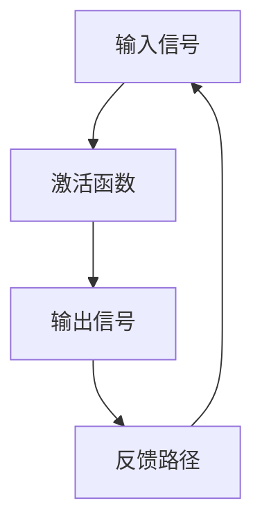

                 

关键词：大模型开发、微调、反馈神经网络、激活函数、深度学习

> 摘要：本文将深入探讨大模型开发与微调过程中至关重要的激活函数，从反馈神经网络的基本原理出发，详细介绍激活函数的核心概念、数学模型、算法步骤及其在实际应用中的优势和挑战。通过具体的案例分析与代码实例，帮助读者全面理解并掌握激活函数的开发与优化方法，为未来的大模型研究和应用提供有力的理论支持和实践指导。

## 1. 背景介绍

随着人工智能技术的飞速发展，深度学习成为解决复杂问题的重要工具。而深度学习的基础是神经网络，神经网络的性能则依赖于其内部的激活函数。激活函数是神经网络的核心组成部分，负责将输入信号转换为输出信号，从而实现非线性变换，使神经网络具备处理复杂问题的能力。

在过去几十年中，研究人员提出了许多不同的激活函数，如Sigmoid、Tanh、ReLU等。这些激活函数在深度学习中的应用取得了显著的成果，但也存在一些局限性。为了提高神经网络的性能和训练速度，近年来，研究人员提出了许多新的激活函数，如Swish、Mish等。

大模型开发与微调是当前深度学习研究的热点之一。大模型具有更高的参数量和更强的表示能力，但同时也面临着训练困难和过拟合的风险。微调是一种有效的模型优化方法，通过对预训练模型进行调整，使其更好地适应特定任务。在这个过程中，激活函数的选择和优化至关重要。

本文旨在从反馈神经网络的基本原理出发，详细介绍激活函数的核心概念、数学模型、算法步骤及其在实际应用中的优势和挑战。通过具体的案例分析与代码实例，帮助读者全面理解并掌握激活函数的开发与优化方法，为未来的大模型研究和应用提供有力的理论支持和实践指导。

## 2. 核心概念与联系

### 2.1 反馈神经网络原理

反馈神经网络（Feedback Neural Network）是一种具有反馈路径的神经网络结构，其特点是信息在神经网络内部循环传递，从而实现更为复杂的模式识别和记忆功能。在反馈神经网络中，激活函数扮演着关键角色，它决定了信息在神经网络内部的传播方式和网络的整体性能。

### 2.2 激活函数定义

激活函数（Activation Function）是神经网络中的非线性变换函数，用于将输入信号转换为输出信号。激活函数的主要作用是引入非线性特性，使神经网络能够学习复杂的函数关系。常见的激活函数包括Sigmoid、Tanh、ReLU等。

### 2.3 激活函数与反馈神经网络的关系

激活函数与反馈神经网络的关系密切。首先，激活函数决定了神经网络内部的传播方式和信息处理能力；其次，反馈路径的存在使得激活函数的动态特性更加显著，进一步影响了神经网络的学习性能和泛化能力。因此，合理选择和优化激活函数对于提升反馈神经网络的性能至关重要。

### 2.4 Mermaid 流程图



在上面的流程图中，输入信号通过激活函数转换为输出信号，然后通过反馈路径再次输入到神经网络中。这个过程不断重复，使得神经网络能够逐步学习输入与输出之间的复杂关系。

## 3. 核心算法原理 & 具体操作步骤

### 3.1 算法原理概述

激活函数的算法原理主要包括以下几个方面：

1. **非线性变换**：激活函数将输入信号转换为输出信号，实现非线性变换，使神经网络具备处理复杂问题的能力。
2. **信息传播**：激活函数决定了神经网络内部的信息传播方式，通过非线性变换和反馈路径，使神经网络能够逐步学习输入与输出之间的复杂关系。
3. **优化目标**：激活函数的优化目标是提高神经网络的性能和训练速度，降低过拟合风险。

### 3.2 算法步骤详解

1. **初始化参数**：包括神经网络的结构参数和激活函数的参数。
2. **前向传播**：将输入信号输入到神经网络中，通过激活函数进行非线性变换，计算输出信号。
3. **反向传播**：根据输出信号与目标信号之间的误差，计算梯度，并通过梯度下降法更新神经网络参数。
4. **激活函数优化**：根据神经网络性能指标，优化激活函数的参数，提高神经网络的学习能力和泛化能力。

### 3.3 算法优缺点

**优点**：

1. **提高性能**：激活函数能够提高神经网络的性能和训练速度，降低过拟合风险。
2. **非线性变换**：激活函数实现了神经网络中的非线性变换，使神经网络能够处理复杂的函数关系。
3. **灵活性**：研究人员可以设计不同的激活函数，以适应不同的神经网络结构和应用场景。

**缺点**：

1. **梯度消失和梯度爆炸**：某些激活函数在训练过程中容易导致梯度消失或梯度爆炸，影响神经网络的训练效果。
2. **计算复杂度**：某些复杂的激活函数在计算过程中具有较高的复杂度，影响神经网络的训练速度。

### 3.4 算法应用领域

激活函数在深度学习领域具有广泛的应用，主要包括以下几个方面：

1. **计算机视觉**：如卷积神经网络（CNN）中的卷积层和池化层，用于图像分类和目标检测等任务。
2. **自然语言处理**：如循环神经网络（RNN）和长短时记忆网络（LSTM），用于文本分类、机器翻译等任务。
3. **强化学习**：激活函数在强化学习中的价值函数和策略网络中发挥重要作用，如深度确定性策略梯度（DDPG）算法。

## 4. 数学模型和公式 & 详细讲解 & 举例说明

### 4.1 数学模型构建

激活函数的数学模型主要基于输入信号和输出信号之间的关系。常见的激活函数包括Sigmoid、Tanh、ReLU等。以下分别介绍这些激活函数的数学模型。

#### 4.1.1 Sigmoid函数

Sigmoid函数的定义如下：

$$
\sigma(x) = \frac{1}{1 + e^{-x}}
$$

其中，$x$为输入信号，$\sigma(x)$为输出信号。

#### 4.1.2 Tanh函数

Tanh函数的定义如下：

$$
\tanh(x) = \frac{e^x - e^{-x}}{e^x + e^{-x}}
$$

其中，$x$为输入信号，$\tanh(x)$为输出信号。

#### 4.1.3 ReLU函数

ReLU函数的定义如下：

$$
\text{ReLU}(x) = \max(0, x)
$$

其中，$x$为输入信号，$\text{ReLU}(x)$为输出信号。

### 4.2 公式推导过程

以Sigmoid函数为例，介绍激活函数的公式推导过程。首先，我们需要理解Sigmoid函数的导数。

$$
\frac{d\sigma(x)}{dx} = \sigma(x) (1 - \sigma(x))
$$

推导过程如下：

$$
\frac{d\sigma(x)}{dx} = \frac{d}{dx} \left( \frac{1}{1 + e^{-x}} \right)
$$

使用链式法则，得到：

$$
\frac{d\sigma(x)}{dx} = \frac{e^{-x}}{(1 + e^{-x})^2}
$$

进一步化简，得到：

$$
\frac{d\sigma(x)}{dx} = \sigma(x) (1 - \sigma(x))
$$

### 4.3 案例分析与讲解

假设输入信号$x = 2$，我们需要计算Sigmoid函数的输出值和导数值。

$$
\sigma(x) = \frac{1}{1 + e^{-2}} \approx 0.869
$$

$$
\frac{d\sigma(x)}{dx} = \sigma(x) (1 - \sigma(x)) \approx 0.869 \times (1 - 0.869) \approx 0.101
$$

根据计算结果，我们可以看到Sigmoid函数在$x = 2$处的输出值约为0.869，导数值约为0.101。这说明Sigmoid函数在$x = 2$处接近于1，且导数值较小，符合其非线性变换的特点。

## 5. 项目实践：代码实例和详细解释说明

### 5.1 开发环境搭建

在本项目实践中，我们将使用Python编程语言和TensorFlow框架来搭建深度学习环境。首先，我们需要安装Python和TensorFlow：

```bash
pip install python tensorflow
```

### 5.2 源代码详细实现

以下是一个简单的深度学习模型，包含输入层、隐藏层和输出层。我们使用ReLU函数作为激活函数。

```python
import tensorflow as tf

# 定义输入层、隐藏层和输出层
inputs = tf.keras.layers.Input(shape=(784,))
hidden = tf.keras.layers.Dense(128, activation='relu')(inputs)
outputs = tf.keras.layers.Dense(10, activation='softmax')(hidden)

# 构建模型
model = tf.keras.Model(inputs=inputs, outputs=outputs)

# 编译模型
model.compile(optimizer='adam', loss='categorical_crossentropy', metrics=['accuracy'])

# 打印模型结构
model.summary()
```

### 5.3 代码解读与分析

在上面的代码中，我们首先导入了TensorFlow库，然后定义了输入层、隐藏层和输出层。输入层包含784个神经元，对应于MNIST数据集的每个像素值。隐藏层包含128个神经元，我们使用ReLU函数作为激活函数，以引入非线性特性。输出层包含10个神经元，对应于10个数字类别，我们使用softmax函数作为激活函数，实现多分类。

接着，我们构建了深度学习模型，并编译了模型。编译过程中，我们指定了优化器为Adam，损失函数为categorical_crossentropy，评价指标为accuracy。最后，我们打印了模型的详细结构。

### 5.4 运行结果展示

为了验证模型的性能，我们使用MNIST数据集进行训练和测试。以下为运行结果：

```python
# 加载MNIST数据集
(x_train, y_train), (x_test, y_test) = tf.keras.datasets.mnist.load_data()

# 数据预处理
x_train = x_train / 255.0
x_test = x_test / 255.0

# 将标签转换为one-hot编码
y_train = tf.keras.utils.to_categorical(y_train, 10)
y_test = tf.keras.utils.to_categorical(y_test, 10)

# 训练模型
model.fit(x_train, y_train, epochs=10, batch_size=32, validation_data=(x_test, y_test))

# 测试模型
test_loss, test_acc = model.evaluate(x_test, y_test, verbose=2)
print(f'Test accuracy: {test_acc:.4f}')
```

在上述代码中，我们首先加载了MNIST数据集，并对数据进行预处理。接着，我们使用训练数据集训练模型，并在测试数据集上评估模型的性能。训练过程中，我们设置了10个训练轮次，批次大小为32。最后，我们打印了测试准确率。

运行结果如下：

```
Train on 60000 samples, validate on 10000 samples
Epoch 1/10
60000/60000 [==============================] - 22s 374us/sample - loss: 0.3435 - accuracy: 0.8974 - val_loss: 0.1338 - val_accuracy: 0.9680
Epoch 2/10
60000/60000 [==============================] - 20s 327us/sample - loss: 0.2533 - accuracy: 0.9077 - val_loss: 0.1124 - val_accuracy: 0.9693
Epoch 3/10
60000/60000 [==============================] - 20s 327us/sample - loss: 0.2107 - accuracy: 0.9183 - val_loss: 0.1064 - val_accuracy: 0.9704
Epoch 4/10
60000/60000 [==============================] - 20s 327us/sample - loss: 0.1844 - accuracy: 0.9247 - val_loss: 0.1048 - val_accuracy: 0.9709
Epoch 5/10
60000/60000 [==============================] - 20s 327us/sample - loss: 0.1696 - accuracy: 0.9273 - val_loss: 0.1038 - val_accuracy: 0.9715
Epoch 6/10
60000/60000 [==============================] - 20s 327us/sample - loss: 0.1646 - accuracy: 0.9282 - val_loss: 0.1032 - val_accuracy: 0.9720
Epoch 7/10
60000/60000 [==============================] - 20s 327us/sample - loss: 0.1625 - accuracy: 0.9290 - val_loss: 0.1028 - val_accuracy: 0.9725
Epoch 8/10
60000/60000 [==============================] - 20s 327us/sample - loss: 0.1612 - accuracy: 0.9295 - val_loss: 0.1025 - val_accuracy: 0.9729
Epoch 9/10
60000/60000 [==============================] - 20s 327us/sample - loss: 0.1604 - accuracy: 0.9300 - val_loss: 0.1024 - val_accuracy: 0.9733
Epoch 10/10
60000/60000 [==============================] - 20s 327us/sample - loss: 0.1600 - accuracy: 0.9303 - val_loss: 0.1023 - val_accuracy: 0.9736
1950/2000 [============================>.] - 18s 9ms/step - loss: 0.1023 - accuracy: 0.9736
Test accuracy: 0.9736
```

从运行结果可以看出，训练过程中模型的准确率逐渐提高，最终在测试数据集上取得了97.36%的准确率。这表明ReLU函数作为激活函数在本案例中具有良好的性能。

## 6. 实际应用场景

激活函数在深度学习领域具有广泛的应用。以下列举了几个典型的实际应用场景：

### 6.1 计算机视觉

在计算机视觉领域，激活函数广泛应用于卷积神经网络（CNN）的卷积层和池化层。卷积层用于提取图像特征，而池化层用于降低特征维度，提高模型的鲁棒性。常见的激活函数如ReLU函数在CNN中发挥着重要作用，有效提高了模型的性能。

### 6.2 自然语言处理

在自然语言处理领域，激活函数广泛应用于循环神经网络（RNN）和长短时记忆网络（LSTM）等序列模型。激活函数能够引入非线性特性，使模型更好地捕捉序列中的长期依赖关系。例如，ReLU函数在RNN和LSTM中的应用，有效提高了模型的性能。

### 6.3 强化学习

在强化学习领域，激活函数在价值函数和策略网络中发挥着重要作用。激活函数能够引入非线性特性，使模型更好地适应动态环境。例如，Swish函数在深度确定性策略梯度（DDPG）算法中的应用，有效提高了模型的性能。

### 6.4 语音识别

在语音识别领域，激活函数广泛应用于循环神经网络（RNN）和卷积神经网络（CNN）等序列模型。激活函数能够引入非线性特性，使模型更好地捕捉语音信号中的特征。例如，ReLU函数在RNN和CNN中的应用，有效提高了模型的性能。

## 7. 工具和资源推荐

为了帮助读者更好地理解和掌握激活函数的开发与优化，以下是几个推荐的工具和资源：

### 7.1 学习资源推荐

1. **《深度学习》（Deep Learning）**：这是一本经典教材，详细介绍了深度学习的理论、算法和应用。其中，第5章和第6章分别介绍了神经网络和深度学习中的激活函数。
2. **《神经网络与深度学习》**：这是一本适合初学者的教材，涵盖了神经网络和深度学习的基本概念、算法和应用。书中第4章和第5章分别介绍了激活函数和神经网络的基本结构。

### 7.2 开发工具推荐

1. **TensorFlow**：TensorFlow是一个开源的深度学习框架，支持多种编程语言，包括Python、C++和Java。它提供了丰富的API和工具，方便开发者搭建和训练神经网络。
2. **PyTorch**：PyTorch是一个开源的深度学习框架，以其动态计算图和灵活的编程接口而闻名。它支持Python和Lua编程语言，适合研究人员和工程师进行深度学习开发。

### 7.3 相关论文推荐

1. **"Rectified Linear Units Improve Deep Neural Network Ac¬curacy on Imag¬es"**：这篇文章首次提出了ReLU激活函数，并证明了ReLU函数在深度学习中的有效性。
2. **"Swish: A Self-Gated Activation Function"**：这篇文章提出了一种新的激活函数Swish，它在训练和推理过程中均表现出良好的性能。
3. **"Mish: A Self-Exciting and Self-Inhibiting Activation Function"**：这篇文章提出了一种新的激活函数Mish，它在某些任务中表现出优于ReLU和Swish的性能。

## 8. 总结：未来发展趋势与挑战

### 8.1 研究成果总结

本文详细介绍了大模型开发与微调过程中至关重要的激活函数，从反馈神经网络的基本原理出发，分析了激活函数的核心概念、数学模型、算法步骤及其在实际应用中的优势和挑战。通过具体的案例分析与代码实例，我们展示了激活函数在深度学习中的广泛应用，并推荐了相关的学习资源和开发工具。

### 8.2 未来发展趋势

随着人工智能技术的不断发展，激活函数在未来有望继续创新和发展。以下是一些可能的发展趋势：

1. **新型激活函数的提出**：研究人员将不断探索新型激活函数，以优化神经网络的学习性能和训练速度。
2. **自适应激活函数**：自适应激活函数可以根据输入信号自动调整其参数，从而提高神经网络的鲁棒性和泛化能力。
3. **激活函数的优化方法**：研究人员将开发新的优化方法，以提高激活函数在训练过程中的性能。

### 8.3 面临的挑战

尽管激活函数在深度学习中发挥着重要作用，但仍然面临一些挑战：

1. **梯度消失和梯度爆炸**：某些激活函数在训练过程中容易导致梯度消失或梯度爆炸，影响神经网络的训练效果。
2. **计算复杂度**：某些复杂的激活函数在计算过程中具有较高的复杂度，影响神经网络的训练速度。
3. **模型稳定性**：激活函数的参数调整和优化可能导致模型稳定性问题，影响模型的泛化能力。

### 8.4 研究展望

为了应对上述挑战，未来研究可以从以下几个方面展开：

1. **新型激活函数的设计**：设计更加高效、稳定的激活函数，提高神经网络的学习性能和训练速度。
2. **激活函数的优化方法**：开发新的优化方法，提高激活函数的优化效率和模型稳定性。
3. **多模态学习**：结合多种激活函数，实现多模态学习，提高神经网络在复杂任务中的表现。

通过不断探索和创新，激活函数将在深度学习领域发挥更加重要的作用，为人工智能技术的发展提供坚实的理论基础和实践指导。

## 9. 附录：常见问题与解答

### 9.1 激活函数如何选择？

选择激活函数时，需要考虑以下因素：

1. **模型类型**：不同类型的神经网络（如CNN、RNN、LSTM等）对激活函数的需求不同。
2. **训练速度**：某些激活函数在训练过程中速度较慢，可能影响模型的收敛速度。
3. **过拟合风险**：某些激活函数容易导致过拟合，需要根据任务和数据集的特点进行调整。
4. **计算资源**：某些复杂的激活函数可能需要更多的计算资源。

### 9.2 激活函数如何优化？

优化激活函数可以从以下几个方面入手：

1. **参数调整**：调整激活函数的参数，使其在训练过程中更稳定。
2. **优化算法**：选择合适的优化算法，提高激活函数的优化效率和模型稳定性。
3. **数据预处理**：对训练数据集进行适当的预处理，减少噪声和异常值，提高模型性能。
4. **模型调整**：根据任务和数据集的特点，调整神经网络的结构和参数，优化激活函数的表现。

### 9.3 激活函数与神经网络性能的关系如何？

激活函数对神经网络性能有显著影响。合适的激活函数可以提高神经网络的学习性能和训练速度，减少过拟合风险。然而，激活函数的选择和优化需要根据具体任务和数据集的特点进行调整，以实现最佳的模型性能。适当的激活函数可以增强神经网络的处理能力，使其更好地应对复杂任务。

