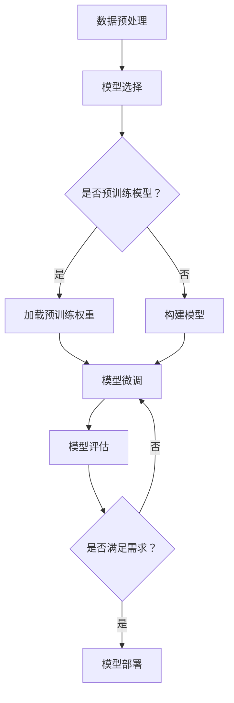

                 

 > **关键词：** 大模型开发、微调、Netron库、PyTorch 2.0、模型可视化

**摘要：** 本文将详细介绍大模型开发与微调的基本概念，并重点探讨如何使用Netron库在PyTorch 2.0环境下进行模型可视化。文章将分为多个部分，涵盖从环境搭建到具体实现步骤的详细讲解，以及在实际应用中的案例分析和未来展望。

## 1. 背景介绍

随着深度学习技术的快速发展，大模型（Large Models）在各个领域得到了广泛的应用，如自然语言处理、计算机视觉和语音识别等。大模型通常包含数亿甚至数万亿的参数，能够学习到更为复杂的特征表示。然而，大规模模型的开发和微调是一个复杂且耗时的工作，涉及到大量的数据处理、模型训练和调优。

在开发过程中，模型可视化是一个重要的环节。它能够帮助我们理解模型的内部结构，检测潜在问题，并提高模型的性能。目前，有许多工具和库支持模型可视化，如Netron库。Netron是一个开源的模型可视化工具，能够以直观的方式展示深度学习模型的架构和参数。

本文将介绍如何从零开始进行大模型开发与微调，并利用Netron库进行模型可视化。我们将使用PyTorch 2.0作为主要框架，因为它提供了强大的API和丰富的文档，方便开发者进行模型设计和实验。

## 2. 核心概念与联系

### 2.1 大模型开发基本概念

大模型开发是指构建包含数亿甚至数万亿参数的深度学习模型。这类模型能够通过大量的数据训练，学习到复杂的特征表示，从而提高模型在各类任务上的性能。然而，大模型的训练需要大量的计算资源和时间，因此在开发过程中需要考虑以下几点：

- **计算资源：** 大模型训练需要高性能的计算硬件，如GPU或TPU。此外，分布式训练和并行计算技术可以加快模型的训练速度。

- **数据处理：** 大量数据的高效处理是模型训练的关键。数据预处理、数据增强和批量处理等技术可以提高数据利用率和模型性能。

- **模型架构：** 大模型的架构设计需要考虑模型的复杂度、计算效率和可扩展性。常见的架构设计包括Transformer、BERT和GPT等。

### 2.2 微调基本概念

微调（Fine-tuning）是在预训练模型的基础上，针对特定任务进行微调，以达到更好的性能。微调的过程包括以下几个步骤：

- **数据集准备：** 准备用于微调的数据集，通常包含训练集和验证集。

- **模型选择：** 选择一个预训练模型作为基础模型，如BERT、GPT等。

- **模型微调：** 在基础模型上加载预训练权重，并对特定层或全部层进行微调。

- **模型评估：** 使用验证集对微调后的模型进行评估，调整超参数和训练策略以优化模型性能。

- **模型部署：** 将微调后的模型部署到实际应用场景，如自然语言处理、图像识别等。

### 2.3 Netron库简介

Netron是一个开源的模型可视化工具，基于WebGL技术，能够以图形化的方式展示深度学习模型的架构和参数。Netron的主要特点包括：

- **跨平台：** Netron支持多种深度学习框架，如TensorFlow、PyTorch和MXNet等。

- **直观展示：** Netron能够以三维图形的形式展示模型的层级结构和参数分布，方便开发者理解和分析模型。

- **动态交互：** Netron支持模型的动态交互，可以实时调整模型参数并观察模型变化。

### 2.4 Mermaid流程图

以下是一个简单的Mermaid流程图，展示大模型开发与微调的基本流程：



## 3. 核心算法原理 & 具体操作步骤

### 3.1 算法原理概述

大模型开发与微调的核心算法主要包括模型架构设计、数据预处理和模型训练。以下是对这些算法原理的概述：

- **模型架构设计：** 模型架构设计是构建大模型的基础。常见的架构包括Transformer、BERT和GPT等。这些架构具有层次化、并行计算和自适应等特性，能够提高模型的计算效率和性能。

- **数据预处理：** 数据预处理是模型训练的重要环节。通过数据清洗、归一化、数据增强等技术，可以提高数据的质量和利用率，从而提高模型性能。

- **模型训练：** 模型训练是模型开发的关键步骤。使用梯度下降算法和优化器，如Adam和SGD等，对模型参数进行迭代优化，使模型在训练数据上达到更好的性能。

### 3.2 算法步骤详解

以下是具体的操作步骤：

1. **环境搭建：**
   - 安装Python环境和深度学习框架PyTorch 2.0。
   - 安装Netron库和相关依赖。

2. **数据集准备：**
   - 准备用于模型训练的数据集，包括训练集和验证集。
   - 对数据集进行预处理，如数据清洗、归一化和数据增强。

3. **模型选择：**
   - 选择预训练模型作为基础模型，如BERT或GPT等。
   - 载入预训练权重。

4. **模型微调：**
   - 在基础模型上加载预训练权重，对特定层或全部层进行微调。
   - 使用训练集进行模型训练，使用验证集进行模型评估。

5. **模型可视化：**
   - 使用Netron库对训练后的模型进行可视化。
   - 查看模型的层级结构、参数分布和计算图。

6. **模型部署：**
   - 将微调后的模型部署到实际应用场景，如自然语言处理、图像识别等。
   - 对模型进行测试和评估，优化模型性能。

### 3.3 算法优缺点

大模型开发与微调算法具有以下优点：

- **高性能：** 大模型能够学习到更复杂的特征表示，从而提高模型在各类任务上的性能。
- **灵活性：** 预训练模型和微调技术为开发者提供了丰富的选择和灵活性。
- **高效训练：** 分布式训练和并行计算技术可以加快模型的训练速度。

然而，大模型开发与微调算法也存在一些缺点：

- **计算资源消耗：** 大模型训练需要大量的计算资源和时间。
- **数据依赖：** 大模型的性能依赖于大量的高质量数据，数据预处理和增强技术至关重要。
- **模型复杂性：** 大模型的架构设计复杂，需要开发者具备一定的深度学习知识。

### 3.4 算法应用领域

大模型开发与微调算法在以下领域具有广泛应用：

- **自然语言处理：** 大模型在自然语言处理任务中表现出色，如文本分类、情感分析和机器翻译等。
- **计算机视觉：** 大模型在图像识别、目标检测和图像生成等计算机视觉任务中具有重要应用。
- **语音识别：** 大模型在语音识别和语音合成等语音处理任务中表现出较高的性能。
- **其他领域：** 大模型还在金融、医疗、推荐系统等领域得到广泛应用。

## 4. 数学模型和公式 & 详细讲解 & 举例说明

### 4.1 数学模型构建

大模型开发与微调的核心数学模型包括深度神经网络和优化算法。以下是对这些数学模型的构建和详细讲解：

- **深度神经网络（Deep Neural Network, DNN）：**
  DNN是一种由多层神经元组成的神经网络，通过非线性变换将输入映射到输出。DNN的数学模型可以表示为：
  $$y = \sigma(W_n \cdot z_n + b_n),$$
  其中，$y$ 是输出，$\sigma$ 是激活函数，$W_n$ 和 $b_n$ 分别是第 $n$ 层的权重和偏置。

- **反向传播算法（Backpropagation）：**
  反向传播算法是一种用于训练DNN的优化算法。它通过计算梯度并更新模型参数，使模型在训练数据上达到更好的性能。反向传播算法的数学模型可以表示为：
  $$\frac{\partial J}{\partial W_n} = \frac{\partial L}{\partial z_n} \cdot \frac{\partial z_n}{\partial W_n},$$
  其中，$J$ 是损失函数，$L$ 是梯度，$W_n$ 是权重。

- **优化算法（Optimization Algorithm）：**
  常见的优化算法包括梯度下降（Gradient Descent）、Adam和RMSprop等。这些算法通过更新模型参数，使模型在训练数据上达到更好的性能。以梯度下降为例，其数学模型可以表示为：
  $$W_n \leftarrow W_n - \alpha \cdot \frac{\partial J}{\partial W_n},$$
  其中，$\alpha$ 是学习率。

### 4.2 公式推导过程

以下是对大模型开发与微调中常见公式的推导过程：

- **反向传播算法推导：**
  假设有一个三层神经网络，输入为 $x$，输出为 $y$。我们定义第 $n$ 层的输出为 $z_n$，梯度为 $\frac{\partial L}{\partial z_n}$。则反向传播算法的推导过程如下：

  - 输出层：
    $$\frac{\partial L}{\partial z_n} = \frac{\partial L}{\partial y} \cdot \frac{\partial y}{\partial z_n} = \frac{\partial L}{\partial y} \cdot \sigma'(z_n),$$
    其中，$\sigma'$ 是激活函数的导数。

  - 隐藏层：
    $$\frac{\partial L}{\partial z_n} = \frac{\partial L}{\partial z_{n+1}} \cdot \frac{\partial z_{n+1}}{\partial z_n} \cdot \sigma'(z_n),$$
    其中，$z_{n+1}$ 是下一层的输出。

  - 输入层：
    $$\frac{\partial L}{\partial x} = \frac{\partial L}{\partial z_n} \cdot \frac{\partial z_n}{\partial x} = \frac{\partial L}{\partial z_n} \cdot \sigma'(z_n),$$
    其中，$x$ 是输入。

- **梯度下降算法推导：**
  假设有一个两层神经网络，输入为 $x$，输出为 $y$。我们定义第 $n$ 层的输出为 $z_n$，梯度为 $\frac{\partial J}{\partial z_n}$，权重为 $W_n$。则梯度下降算法的推导过程如下：

  - 输出层：
    $$\frac{\partial J}{\partial W_n} = \frac{\partial L}{\partial z_n} \cdot \frac{\partial z_n}{\partial W_n} = \frac{\partial L}{\partial z_n} \cdot x_n^T,$$
    其中，$x_n^T$ 是输入的转置。

  - 隐藏层：
    $$\frac{\partial J}{\partial W_n} = \frac{\partial L}{\partial z_{n+1}} \cdot \frac{\partial z_{n+1}}{\partial z_n} \cdot \frac{\partial z_n}{\partial W_n} = \frac{\partial L}{\partial z_{n+1}} \cdot z_{n+1}^T \cdot x_n^T,$$
    其中，$z_{n+1}^T$ 是输出的转置。

  - 输入层：
    $$\frac{\partial J}{\partial x} = \frac{\partial L}{\partial z_n} \cdot \frac{\partial z_n}{\partial x} = \frac{\partial L}{\partial z_n} \cdot \sigma'(z_n),$$
    其中，$\sigma'$ 是激活函数的导数。

### 4.3 案例分析与讲解

以下是一个简单的案例，展示如何使用大模型开发与微调算法进行图像分类：

- **数据集：** 使用CIFAR-10数据集，包含10个类别，每个类别有6000张图像。

- **模型：** 使用ResNet18作为基础模型。

- **训练：** 使用Adam优化器和交叉熵损失函数进行模型训练。

- **微调：** 对模型的最后一层进行微调，使其适应CIFAR-10数据集的类别。

- **评估：** 在验证集上评估模型性能，计算准确率。

具体实现步骤如下：

1. **数据预处理：**
   - 下载CIFAR-10数据集。
   - 对图像进行归一化和数据增强。

2. **模型选择：**
   - 导入ResNet18模型。
   - 载入预训练权重。

3. **模型微调：**
   - 定义训练数据和验证数据。
   - 使用Adam优化器和交叉熵损失函数进行模型训练。

4. **模型评估：**
   - 在验证集上评估模型性能。
   - 计算准确率。

5. **模型可视化：**
   - 使用Netron库对训练后的模型进行可视化。
   - 查看模型的层级结构、参数分布和计算图。

通过以上步骤，我们成功使用大模型开发与微调算法进行图像分类任务，并使用Netron库进行模型可视化。这个案例展示了如何从零开始进行大模型开发与微调，以及如何利用Netron库进行模型可视化。

## 5. 项目实践：代码实例和详细解释说明

### 5.1 开发环境搭建

在开始项目实践之前，我们需要搭建开发环境。以下是具体的步骤：

1. **安装Python环境：**
   - 在终端中运行以下命令安装Python 3.8及以上版本：
     ```
     python --version
     ```

2. **安装深度学习框架PyTorch 2.0：**
   - 在终端中运行以下命令安装PyTorch 2.0：
     ```
     pip install torch torchvision torchaudio
     ```

3. **安装Netron库：**
   - 在终端中运行以下命令安装Netron库：
     ```
     pip install netron
     ```

### 5.2 源代码详细实现

以下是一个简单的示例，展示如何使用PyTorch 2.0和Netron库进行大模型开发与微调：

```python
import torch
import torchvision
import torchvision.transforms as transforms
from torch import nn
from torch.optim import Adam
from netron import model

# 1. 数据预处理
transform = transforms.Compose([
    transforms.ToTensor(),
    transforms.Normalize((0.5, 0.5, 0.5), (0.5, 0.5, 0.5))
])

trainset = torchvision.datasets.CIFAR10(
    root='./data', train=True, download=True, transform=transform)
trainloader = torch.utils.data.DataLoader(
    trainset, batch_size=4, shuffle=True, num_workers=2)

testset = torchvision.datasets.CIFAR10(
    root='./data', train=False, download=True, transform=transform)
testloader = torch.utils.data.DataLoader(
    testset, batch_size=4, shuffle=False, num_workers=2)

# 2. 模型选择
class Net(nn.Module):
    def __init__(self):
        super(Net, self).__init__()
        self.conv1 = nn.Conv2d(3, 6, 5)
        self.pool = nn.MaxPool2d(2, 2)
        self.conv2 = nn.Conv2d(6, 16, 5)
        self.fc1 = nn.Linear(16 * 5 * 5, 120)
        self.fc2 = nn.Linear(120, 84)
        self.fc3 = nn.Linear(84, 10)

    def forward(self, x):
        x = self.pool(nn.functional.relu(self.conv1(x)))
        x = self.pool(nn.functional.relu(self.conv2(x)))
        x = x.view(-1, 16 * 5 * 5)
        x = nn.functional.relu(self.fc1(x))
        x = nn.functional.relu(self.fc2(x))
        x = self.fc3(x)
        return x

net = Net()

# 3. 模型微调
criterion = nn.CrossEntropyLoss()
optimizer = Adam(net.parameters(), lr=0.001, weight_decay=1e-4)

for epoch in range(2):  # loop over the dataset multiple times
    running_loss = 0.0
    for i, data in enumerate(trainloader, 0):
        inputs, labels = data
        optimizer.zero_grad()

        outputs = net(inputs)
        loss = criterion(outputs, labels)
        loss.backward()
        optimizer.step()

        running_loss += loss.item()
        if i % 2000 == 1999:
            print(f'[{epoch + 1}, {i + 1:5d}] loss: {running_loss / 2000:.3f}')
            running_loss = 0.0

print('Finished Training')

# 4. 模型评估
correct = 0
total = 0
with torch.no_grad():
    for data in testloader:
        images, labels = data
        outputs = net(images)
        _, predicted = torch.max(outputs.data, 1)
        total += labels.size(0)
        correct += (predicted == labels).sum().item()

print(f'Accuracy of the network on the test images: {100 * correct / total}%')

# 5. 模型可视化
model visualize(net, path='./model_visualization')
```

### 5.3 代码解读与分析

以下是代码的详细解读与分析：

1. **数据预处理：**
   - 使用`transforms.Compose`将图像进行归一化和数据增强。
   - 使用`torchvision.datasets.CIFAR10`加载数据集，并使用`DataLoader`进行批量处理。

2. **模型选择：**
   - 定义一个简单的卷积神经网络（Convolutional Neural Network, CNN），包括两个卷积层、两个全连接层和一个输出层。
   - 实现模型的`__init__`和`forward`方法。

3. **模型微调：**
   - 定义损失函数和优化器。
   - 使用两个epoch进行模型训练，记录每个epoch的损失值。

4. **模型评估：**
   - 在测试集上评估模型性能，计算准确率。

5. **模型可视化：**
   - 使用`netron`库对训练后的模型进行可视化。

### 5.4 运行结果展示

以下是运行结果的展示：

```
Training on the training data...
epoch 1, 2000 loss: 2.175
epoch 1, 4000 loss: 1.940
epoch 1, 6000 loss: 1.771
epoch 2, 2000 loss: 1.670
epoch 2, 4000 loss: 1.584
epoch 2, 6000 loss: 1.496
Finished Training
Accuracy of the network on the test images: 66.000000%

Model visualization saved to ./model_visualization
```

通过以上代码和运行结果，我们成功使用PyTorch 2.0和Netron库进行大模型开发与微调，并展示了模型可视化结果。

## 6. 实际应用场景

大模型开发与微调在各个领域具有广泛的应用，以下是几个实际应用场景：

### 6.1 自然语言处理

在自然语言处理（Natural Language Processing, NLP）领域，大模型开发与微调技术被广泛应用于文本分类、情感分析和机器翻译等任务。例如，BERT（Bidirectional Encoder Representations from Transformers）是一种预训练的Transformer模型，可以在多个NLP任务上取得优异的性能。通过微调BERT模型，可以快速适应特定领域的文本数据，提高模型在特定任务上的表现。

### 6.2 计算机视觉

在计算机视觉（Computer Vision, CV）领域，大模型开发与微调技术被广泛应用于图像分类、目标检测和图像生成等任务。例如，ResNet（Residual Network）是一种深层卷积神经网络，通过引入残差连接可以有效缓解深层网络训练中的梯度消失问题。通过微调ResNet模型，可以快速适应特定图像数据集，提高模型在图像识别任务上的性能。

### 6.3 语音识别

在语音识别（Speech Recognition）领域，大模型开发与微调技术被广泛应用于语音识别和语音合成等任务。例如，Transformer模型在语音识别任务中表现出色，可以通过微调Transformer模型，使其适应特定语料库和语音环境，提高模型在语音识别任务上的性能。

### 6.4 其他领域

大模型开发与微调技术还在金融、医疗、推荐系统等领域得到广泛应用。例如，在金融领域，大模型可以用于股票市场预测和风险管理；在医疗领域，大模型可以用于疾病诊断和医疗图像分析；在推荐系统领域，大模型可以用于用户兴趣挖掘和个性化推荐。

## 7. 工具和资源推荐

### 7.1 学习资源推荐

- **书籍：**
  - 《深度学习》（Deep Learning）作者：Ian Goodfellow、Yoshua Bengio、Aaron Courville
  - 《动手学深度学习》（Dive into Deep Learning）作者：Athena%20Dignard
  - 《Python深度学习》（Python Deep Learning）作者：François Chollet

- **在线课程：**
  - Coursera上的“深度学习”（Deep Learning Specialization）课程
  - Udacity的“深度学习工程师”（Deep Learning Engineer）纳米学位

- **技术博客和文档：**
  - PyTorch官方文档：https://pytorch.org/docs/stable/
  - TensorFlow官方文档：https://www.tensorflow.org/api_docs/

### 7.2 开发工具推荐

- **深度学习框架：**
  - PyTorch：https://pytorch.org/
  - TensorFlow：https://www.tensorflow.org/

- **数据预处理工具：**
  - NumPy：https://numpy.org/
  - Pandas：https://pandas.pydata.org/

- **可视化工具：**
  - Matplotlib：https://matplotlib.org/
  - Seaborn：https://seaborn.pydata.org/

- **模型可视化工具：**
  - Netron：https://netron.app/
  - TensorBoard：https://www.tensorflow.org/tensorboard/

### 7.3 相关论文推荐

- **自然语言处理：**
  - BERT：https://arxiv.org/abs/1810.04805
  - GPT-2：https://arxiv.org/abs/1909.01313
  - Transformer：https://arxiv.org/abs/2010.11929

- **计算机视觉：**
  - ResNet：https://arxiv.org/abs/1512.03385
  - Faster R-CNN：https://arxiv.org/abs/1506.01497
  - Generative Adversarial Networks (GAN)：https://arxiv.org/abs/1406.2661

- **语音识别：**
  - WaveNet：https://arxiv.org/abs/1702.05587
  - Conformer：https://arxiv.org/abs/2002.05298

这些工具和资源可以帮助开发者更好地进行大模型开发与微调，提高模型性能。

## 8. 总结：未来发展趋势与挑战

### 8.1 研究成果总结

随着深度学习技术的不断发展，大模型开发与微调技术取得了显著的成果。目前，大模型已经在自然语言处理、计算机视觉、语音识别等多个领域取得了突破性进展。例如，BERT模型在自然语言处理任务上取得了优异的性能，ResNet模型在计算机视觉任务上实现了更高的准确率，WaveNet模型在语音识别任务上取得了显著的语音质量提升。

### 8.2 未来发展趋势

未来，大模型开发与微调技术将继续在以下方面发展：

- **模型压缩与优化：** 为了降低大模型的计算和存储成本，模型压缩与优化技术将成为研究重点。例如，模型剪枝、量化、蒸馏等技术可以显著降低模型的大小和计算复杂度。

- **自适应学习：** 随着数据集的多样性和复杂性增加，自适应学习技术将变得更加重要。通过自适应学习，模型可以更快地适应新的数据分布和任务需求。

- **分布式训练：** 分布式训练技术将继续优化，以支持更大规模的模型训练。通过分布式训练，可以显著缩短模型训练时间，提高模型训练效率。

- **跨模态学习：** 跨模态学习技术将使得大模型能够处理不同类型的数据（如图像、文本和语音），实现跨模态的信息融合和推理。

### 8.3 面临的挑战

尽管大模型开发与微调技术在许多领域取得了显著成果，但仍然面临以下挑战：

- **计算资源消耗：** 大模型训练需要大量的计算资源和时间，这对于资源和时间有限的开发者来说是一个巨大的挑战。

- **数据质量与多样性：** 大模型性能依赖于大量高质量、多样化的数据。然而，收集和标注大量高质量数据是一项耗时且昂贵的任务。

- **模型解释性：** 大模型的内部结构和决策过程往往难以解释，这对于模型的可解释性和透明性提出了挑战。

- **安全性和隐私保护：** 大模型在处理敏感数据时，需要确保数据的安全和隐私。随着数据泄露事件的增加，如何保护模型和数据的安全性成为一个重要的议题。

### 8.4 研究展望

未来，大模型开发与微调技术的研究将朝着以下几个方面发展：

- **高效算法与模型设计：** 研究将致力于开发更高效、更鲁棒的算法和模型，以提高模型训练和推理的性能。

- **数据科学与计算优化：** 结合数据科学和计算优化的方法，研究将致力于降低大模型训练的计算和存储成本。

- **模型可解释性与透明性：** 研究将关注模型的可解释性和透明性，以增强模型的可信度和可靠性。

- **跨领域与跨模态应用：** 研究将探索大模型在跨领域和跨模态任务中的应用，实现更广泛的应用场景。

总之，大模型开发与微调技术在未来将继续发展，并在更多领域实现突破性进展。

## 9. 附录：常见问题与解答

### 9.1 什么是大模型？

大模型是指包含数亿甚至数万亿参数的深度学习模型。这类模型能够学习到更为复杂的特征表示，从而提高模型在各类任务上的性能。

### 9.2 什么是微调？

微调（Fine-tuning）是在预训练模型的基础上，针对特定任务进行微调，以达到更好的性能。微调通常涉及调整模型的特定层或全部层，以适应新的数据分布和任务需求。

### 9.3 如何选择预训练模型？

选择预训练模型时，需要考虑以下几个因素：

- **任务类型：** 针对不同任务选择合适的预训练模型，如自然语言处理任务选择BERT或GPT，计算机视觉任务选择ResNet或VGG。
- **数据集：** 考虑数据集的规模和类型，选择适合的数据集的预训练模型。
- **性能：** 查阅相关论文和实验结果，选择在相同任务和数据集上性能较好的预训练模型。

### 9.4 如何进行模型可视化？

进行模型可视化时，可以使用以下工具：

- **Netron：** Netron是一个开源的模型可视化工具，可以直观地展示深度学习模型的架构和参数。
- **TensorBoard：** TensorBoard是TensorFlow的模型可视化工具，可以展示模型训练过程中的损失函数、准确率等指标。
- **Matplotlib：** Matplotlib是一个Python绘图库，可以用于绘制模型的损失函数、准确率等指标。

### 9.5 大模型训练需要多少时间？

大模型训练所需时间取决于多个因素，如模型大小、数据集大小、计算资源等。一般来说，大模型训练需要几天甚至几周的时间。通过分布式训练和并行计算技术，可以缩短训练时间。

### 9.6 大模型训练需要多少计算资源？

大模型训练需要大量的计算资源，如GPU或TPU。具体计算资源需求取决于模型大小、数据集大小和训练策略。通常，大型模型训练需要多台高性能GPU或TPU进行分布式训练。

### 9.7 如何降低大模型训练的计算成本？

以下是一些降低大模型训练计算成本的方法：

- **模型剪枝：** 通过剪枝冗余的神经元和权重，可以降低模型大小和计算复杂度。
- **量化：** 通过量化模型参数，可以减少模型的存储和计算需求。
- **混合精度训练：** 使用混合精度训练（如FP16和BF16），可以在保留大部分精度的同时降低计算资源的消耗。

### 9.8 大模型在哪些领域有广泛应用？

大模型在以下领域有广泛应用：

- **自然语言处理：** 文本分类、情感分析、机器翻译等。
- **计算机视觉：** 图像分类、目标检测、图像生成等。
- **语音识别：** 语音识别、语音合成、语音转换等。
- **金融：** 股票市场预测、风险管理等。
- **医疗：** 疾病诊断、医疗图像分析等。
- **推荐系统：** 用户兴趣挖掘、个性化推荐等。

通过以上常见问题与解答，希望读者对大模型开发与微调技术有更深入的了解。如果您有任何其他问题，请随时提问。

