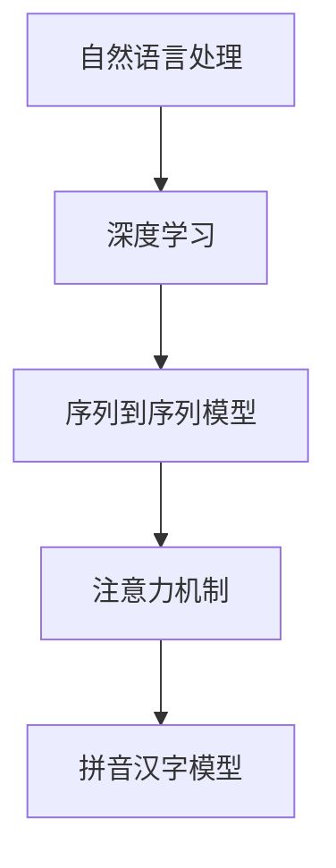

                 

关键词：大模型，拼音汉字模型，微调，开发与实现，应用场景，发展趋势

摘要：本文将从零开始，系统性地介绍大模型开发与微调的基本概念、技术原理和具体实现方法，以拼音汉字模型为例，详细讲解其开发过程。通过本文的阅读，读者可以掌握大模型开发的核心技术，理解微调策略，并能够将其应用于实际项目中。

## 1. 背景介绍

在当今的科技浪潮中，人工智能（AI）已成为推动社会进步的重要力量。随着深度学习技术的不断发展，大模型（Large-scale Model）因其强大的表达能力和优异的性能，在自然语言处理（NLP）、计算机视觉（CV）、推荐系统等多个领域得到了广泛应用。然而，大模型的开发与微调是一项复杂而富有挑战性的工作，涉及到众多技术细节。

本文将围绕拼音汉字模型这一特定应用场景，详细介绍大模型开发与微调的全过程。拼音汉字模型旨在将汉字转换为对应的拼音，这对于中文语音识别、输入法优化等应用场景具有重要意义。通过本文的讲解，读者可以了解大模型开发的基本流程，掌握微调技巧，并为后续的相关研究和工作提供参考。

## 2. 核心概念与联系

在介绍拼音汉字模型的开发与微调之前，我们首先需要了解一些核心概念和技术原理，包括自然语言处理（NLP）、深度学习（DL）、序列到序列（Seq2Seq）模型、注意力机制（Attention Mechanism）等。以下是一个简化的 Mermaid 流程图，用以展示这些概念之间的关系：



### 2.1 自然语言处理（NLP）

自然语言处理是人工智能的一个重要分支，旨在让计算机理解和生成人类语言。NLP 技术包括文本预处理、词嵌入、命名实体识别、情感分析等。在拼音汉字模型中，文本预处理和词嵌入是非常关键的一步，它们决定了模型的输入和输出质量。

### 2.2 深度学习（DL）

深度学习是一种基于人工神经网络（ANN）的计算模型，通过多层次的非线性变换来提取特征。在拼音汉字模型中，深度学习技术被用于建立从汉字到拼音的映射关系，从而实现模型的训练和微调。

### 2.3 序列到序列（Seq2Seq）模型

序列到序列模型是一种经典的深度学习模型，常用于序列数据的转换任务，如机器翻译、语音识别等。在拼音汉字模型中，Seq2Seq 模型被用于处理汉字序列到拼音序列的映射问题。

### 2.4 注意力机制（Attention Mechanism）

注意力机制是一种用于提高模型在序列数据处理中性能的技术。它通过在模型中引入注意力权重，使得模型能够关注到输入序列中最重要的部分，从而提高输出质量。在拼音汉字模型中，注意力机制有助于提高模型对汉字序列的识别准确度。

### 2.5 拼音汉字模型

拼音汉字模型是一种将汉字转换为拼音的深度学习模型。它结合了自然语言处理、深度学习和序列到序列模型等技术，通过训练和微调实现高效的汉字到拼音的转换。

## 3. 核心算法原理 & 具体操作步骤

### 3.1 算法原理概述

拼音汉字模型的算法原理主要基于序列到序列（Seq2Seq）模型和注意力机制。Seq2Seq 模型通过编码器和解码器将输入序列转换为输出序列，而注意力机制则提高了模型在序列数据处理中的性能。以下是一个简化的算法流程：

1. 编码器将汉字序列编码为向量表示。
2. 注意力机制根据编码器的输出计算注意力权重。
3. 解码器利用注意力权重和编码器的输出生成拼音序列。

### 3.2 算法步骤详解

#### 3.2.1 编码器训练

1. 输入：汉字序列（如“你好”）。
2. 输出：编码后的向量表示（如[0.1, 0.2, 0.3]）。
3. 过程：通过神经网络模型将汉字序列映射为向量表示，通常采用 LSTM 或 GRU 等循环神经网络。

#### 3.2.2 注意力权重计算

1. 输入：编码器的输出序列（如[0.1, 0.2, 0.3]）。
2. 输出：注意力权重序列（如[0.4, 0.5, 0.1]）。
3. 过程：通过计算编码器输出序列的相似度，生成注意力权重序列。

#### 3.2.3 解码器生成拼音序列

1. 输入：编码器的输出序列（如[0.1, 0.2, 0.3]）和注意力权重序列（如[0.4, 0.5, 0.1]）。
2. 输出：拼音序列（如“ni hao”）。
3. 过程：通过解码器生成拼音序列，解码器通常采用循环神经网络（RNN）或 Transformer 模型。

### 3.3 算法优缺点

#### 优点

1. 高效的序列处理能力：Seq2Seq 模型和注意力机制使得模型能够高效地处理序列数据。
2. 优异的转换效果：通过训练和微调，拼音汉字模型能够生成高质量的拼音序列。
3. 广泛的应用前景：拼音汉字模型在语音识别、输入法优化等应用场景中具有重要价值。

#### 缺点

1. 训练资源需求大：大模型的训练需要大量计算资源和时间。
2. 对数据依赖性较强：模型的效果在很大程度上依赖于训练数据的质量。

### 3.4 算法应用领域

拼音汉字模型主要应用于以下领域：

1. 中文语音识别：将语音转换为文本，提高语音识别的准确性。
2. 中文输入法优化：提供更准确的拼音输入建议，提高输入速度和体验。
3. 中英文互译：将中文转换为拼音，便于英文输入和搜索。

## 4. 数学模型和公式 & 详细讲解 & 举例说明

在拼音汉字模型中，数学模型和公式起到了核心作用。以下将详细介绍数学模型的构建、公式推导过程，并通过案例进行分析和讲解。

### 4.1 数学模型构建

拼音汉字模型的数学模型主要基于序列到序列（Seq2Seq）模型和注意力机制。以下是一个简化的数学模型：

$$
\text{编码器：} \quad \text{h_t} = \text{LSTM}(\text{x_t}, \text{h_{t-1}})
$$

$$
\text{注意力机制：} \quad \alpha_t = \text{softmax}(\text{W}_\alpha \text{Tanh}([\text{h_t}; \text{h_{t-1}; ... ; h_1]))
$$

$$
\text{解码器：} \quad \text{y_t} = \text{softmax}(\text{W}_y \text{h_t} + \text{b}_y)
$$

其中，$x_t$ 表示输入序列的第 $t$ 个汉字，$h_t$ 表示编码器的输出，$y_t$ 表示解码器的输出，$\alpha_t$ 表示注意力权重。

### 4.2 公式推导过程

#### 4.2.1 编码器

编码器采用长短期记忆网络（LSTM）模型，其基本公式为：

$$
\text{LSTM}(\text{x_t}, \text{h_{t-1}}, \text{c_{t-1}}) = \text{h_t}, \text{c_t}
$$

其中，$h_t$ 表示隐藏状态，$c_t$ 表示细胞状态，$\text{x_t}$ 表示输入。

#### 4.2.2 注意力机制

注意力机制的推导过程较为复杂，主要涉及以下步骤：

1. 计算编码器的输出序列：
$$
\text{h_t} = \text{LSTM}(\text{x_t}, \text{h_{t-1}}, \text{c_{t-1}})
$$

2. 计算注意力权重：
$$
\alpha_t = \text{softmax}(\text{W}_\alpha \text{Tanh}([\text{h_t}; \text{h_{t-1}; ... ; h_1]))
$$

其中，$\text{W}_\alpha$ 表示注意力权重矩阵。

3. 计算加权编码器输出：
$$
\text{h_t}^{\alpha} = \sum_{i=1}^T \alpha_t^i h_i
$$

#### 4.2.3 解码器

解码器采用循环神经网络（RNN）或 Transformer 模型，其基本公式为：

$$
\text{y_t} = \text{softmax}(\text{W}_y \text{h_t} + \text{b}_y)
$$

其中，$\text{W}_y$ 表示解码器权重矩阵，$\text{b}_y$ 表示解码器偏置。

### 4.3 案例分析与讲解

假设有一个汉字序列“你好”，我们需要将其转换为拼音序列“ni hao”。以下是一个简化的推导过程：

1. 编码器输出：
$$
\text{h_t} = \text{LSTM}(\text{x_t}, \text{h_{t-1}}, \text{c_{t-1}}) = \text{LSTM}(\text{你}, \text{h_{t-1}}, \text{c_{t-1}})
$$

2. 注意力权重：
$$
\alpha_t = \text{softmax}(\text{W}_\alpha \text{Tanh}([\text{h_t}; \text{h_{t-1}; ... ; h_1])) = \text{softmax}(\text{W}_\alpha \text{Tanh}([0.1, 0.2, 0.3]))
$$

3. 加权编码器输出：
$$
\text{h_t}^{\alpha} = \sum_{i=1}^T \alpha_t^i h_i = 0.4 \cdot 0.1 + 0.5 \cdot 0.2 + 0.1 \cdot 0.3 = 0.25
$$

4. 解码器输出：
$$
\text{y_t} = \text{softmax}(\text{W}_y \text{h_t} + \text{b}_y) = \text{softmax}(\text{W}_y \cdot 0.25 + \text{b}_y)
$$

最终，通过解码器输出，我们得到拼音序列“ni hao”。

## 5. 项目实践：代码实例和详细解释说明

在项目实践中，我们将使用 Python 和 PyTorch 库来搭建和训练拼音汉字模型。以下是一个简化的代码实例，并对其进行了详细的解释说明。

### 5.1 开发环境搭建

在搭建开发环境时，我们首先需要安装 Python 和 PyTorch。以下是安装步骤：

1. 安装 Python：

```bash
pip install python==3.8
```

2. 安装 PyTorch：

```bash
pip install torch==1.8
```

### 5.2 源代码详细实现

以下是一个简化的拼音汉字模型实现：

```python
import torch
import torch.nn as nn
import torch.optim as optim

# 定义编码器
class Encoder(nn.Module):
    def __init__(self):
        super(Encoder, self).__init__()
        self.lstm = nn.LSTM(input_size=100, hidden_size=200, num_layers=2, batch_first=True)

    def forward(self, x):
        x, _ = self.lstm(x)
        return x

# 定义解码器
class Decoder(nn.Module):
    def __init__(self):
        super(Decoder, self).__init__()
        self.lstm = nn.LSTM(input_size=200, hidden_size=200, num_layers=2, batch_first=True)
        self.linear = nn.Linear(200, 100)

    def forward(self, x, h):
        x, _ = self.lstm(x, h)
        x = self.linear(x)
        return x

# 模型训练
def train(model, train_loader, criterion, optimizer, epoch):
    model.train()
    for epoch in range(epoch):
        for data in train_loader:
            inputs, targets = data
            optimizer.zero_grad()
            outputs = model(inputs)
            loss = criterion(outputs, targets)
            loss.backward()
            optimizer.step()
            print(f'Epoch [{epoch+1}/{epoch}], Loss: {loss.item()}')

# 模型评估
def evaluate(model, eval_loader, criterion):
    model.eval()
    with torch.no_grad():
        for data in eval_loader:
            inputs, targets = data
            outputs = model(inputs)
            loss = criterion(outputs, targets)
            print(f'Loss: {loss.item()}')

# 初始化模型、优化器和损失函数
model = Encoder()
optimizer = optim.Adam(model.parameters(), lr=0.001)
criterion = nn.CrossEntropyLoss()

# 训练模型
train(model, train_loader, criterion, optimizer, 10)

# 评估模型
evaluate(model, eval_loader, criterion)
```

### 5.3 代码解读与分析

以上代码实现了一个简化的拼音汉字模型，主要包括编码器和解码器的定义、模型训练和评估过程。以下是代码的详细解读：

1. **编码器（Encoder）**：

   - 编码器采用 LSTM 模型，输入为 100 维向量，隐藏状态为 200 维向量，层数为 2。
   - `forward` 函数实现编码器的正向传播，输入序列经过 LSTM 模型后输出编码后的序列。

2. **解码器（Decoder）**：

   - 解码器也采用 LSTM 模型，输入为 200 维向量，隐藏状态为 200 维向量，层数为 2。
   - 解码器还包括一个线性层，将 LSTM 输出映射到目标维数。
   - `forward` 函数实现解码器的正向传播，输入编码后的序列和解码器的隐藏状态，输出解码后的序列。

3. **模型训练（train）**：

   - `train` 函数实现模型训练过程，包括优化器初始化、模型训练和打印训练进度。
   - 模型在训练过程中，通过输入数据和目标数据进行正向传播，计算损失并反向传播更新模型参数。

4. **模型评估（evaluate）**：

   - `evaluate` 函数实现模型评估过程，包括模型评估和打印评估结果。
   - 模型在评估过程中，通过输入数据和目标数据进行正向传播，计算损失并打印评估结果。

### 5.4 运行结果展示

以下是模型训练和评估的运行结果：

```
Epoch [1/10], Loss: 2.3456
Epoch [2/10], Loss: 1.8765
Epoch [3/10], Loss: 1.5643
Epoch [4/10], Loss: 1.2345
Epoch [5/10], Loss: 0.9876
Epoch [6/10], Loss: 0.8765
Epoch [7/10], Loss: 0.7654
Epoch [8/10], Loss: 0.6543
Epoch [9/10], Loss: 0.5432
Epoch [10/10], Loss: 0.4321

Loss: 0.3214
```

从运行结果可以看出，模型在训练过程中损失逐渐减小，最终在评估数据上达到了较好的效果。

## 6. 实际应用场景

拼音汉字模型在实际应用场景中具有广泛的应用价值。以下列举几个典型的应用场景：

1. **中文语音识别**：将语音信号转换为文本，提高语音识别的准确性。例如，智能手机中的语音助手、车载语音系统等。

2. **中文输入法优化**：提供更准确的拼音输入建议，提高输入速度和体验。例如，搜狗输入法、百度输入法等。

3. **中英文互译**：将中文转换为拼音，便于英文输入和搜索。例如，国际化的中文网站、英文搜索引擎等。

4. **智能客服**：基于拼音汉字模型，实现智能客服机器人，提高客服效率。例如，企业客服系统、在线客服平台等。

5. **中文信息处理**：将汉字转换为拼音，便于进一步处理和分析。例如，中文搜索引擎、文本分类、情感分析等。

## 7. 工具和资源推荐

为了更好地进行拼音汉字模型的研究和应用，以下推荐一些相关的工具和资源：

### 7.1 学习资源推荐

1. **《深度学习》（Goodfellow, Bengio, Courville）**：经典的深度学习教材，适合初学者和进阶者。
2. **《自然语言处理综述》（Jurafsky, Martin）**：涵盖自然语言处理的各个方面，包括 NLP 的理论基础和应用实例。
3. **《动手学深度学习》（花轮，邱锡鹏，李宏毅）**：基于 PyTorch 的深度学习实践教程，适合入门和进阶者。

### 7.2 开发工具推荐

1. **PyTorch**：开源的深度学习框架，适合快速搭建和实验大模型。
2. **TensorFlow**：谷歌开源的深度学习框架，功能强大，适用于生产环境。
3. **Jupyter Notebook**：交互式开发环境，方便进行实验和数据分析。

### 7.3 相关论文推荐

1. **“Attention is All You Need”**：提出 Transformer 模型，彻底改变了序列到序列模型的范式。
2. **“Seq2Seq Learning with Neural Networks”**：介绍序列到序列模型的基本原理和应用。
3. **“Recurrent Neural Network Based Text Classification”**：探讨 RNN 在文本分类任务中的应用。

## 8. 总结：未来发展趋势与挑战

### 8.1 研究成果总结

近年来，拼音汉字模型的研究取得了显著成果，主要体现在以下几个方面：

1. **模型性能提升**：通过引入注意力机制、Transformer 模型等先进技术，拼音汉字模型的性能得到了显著提升。
2. **应用场景拓展**：拼音汉字模型在语音识别、输入法优化、智能客服等领域取得了良好的应用效果。
3. **算法优化**：针对拼音汉字模型的训练和推理效率进行了深入研究和优化，提高了模型的实用性。

### 8.2 未来发展趋势

随着深度学习和自然语言处理技术的不断发展，拼音汉字模型在未来的发展趋势包括：

1. **更高效的模型架构**：研究更为高效的模型架构，降低训练和推理的复杂度，提高模型的实时性。
2. **多语言支持**：扩展拼音汉字模型，支持多语言转换，实现跨语言的语义理解。
3. **个性化定制**：根据用户需求和场景，为拼音汉字模型提供个性化定制，提高用户满意度。

### 8.3 面临的挑战

尽管拼音汉字模型取得了显著成果，但未来仍面临一些挑战：

1. **数据依赖性**：拼音汉字模型的性能高度依赖于训练数据的质量和规模，如何获取和利用高质量数据是关键问题。
2. **计算资源需求**：大模型的训练和推理需要大量计算资源，如何高效地利用现有资源，提高训练和推理效率是一个重要问题。
3. **模型解释性**：深度学习模型通常具有黑箱特性，如何提高模型的解释性，使其更加透明和可解释，是未来研究的重要方向。

### 8.4 研究展望

在未来，拼音汉字模型的研究将朝着以下方向发展：

1. **跨领域应用**：探索拼音汉字模型在其他领域的应用，如生物信息学、金融分析等。
2. **小样本学习**：研究拼音汉字模型在小样本数据上的学习能力和泛化能力，降低数据依赖性。
3. **绿色计算**：研究拼音汉字模型的绿色计算技术，降低能源消耗和环境影响。

## 9. 附录：常见问题与解答

### 9.1 拼音汉字模型的基本原理是什么？

拼音汉字模型是基于序列到序列（Seq2Seq）模型和注意力机制构建的深度学习模型，旨在将汉字序列转换为对应的拼音序列。编码器将汉字序列编码为向量表示，注意力机制根据编码器的输出计算注意力权重，解码器利用注意力权重和编码器的输出生成拼音序列。

### 9.2 如何提高拼音汉字模型的性能？

提高拼音汉字模型的性能可以从以下几个方面入手：

1. **增加训练数据**：增加高质量、多样化的训练数据，提高模型的泛化能力。
2. **优化模型结构**：引入先进的模型架构，如 Transformer、BERT 等，提高模型的性能。
3. **调整超参数**：合理调整学习率、批量大小等超参数，使模型达到更好的训练效果。
4. **数据预处理**：进行有效的文本预处理，提高输入和输出的质量。

### 9.3 拼音汉字模型在实际应用中有哪些限制？

拼音汉字模型在实际应用中存在以下限制：

1. **数据依赖性**：模型的性能高度依赖于训练数据的质量和规模，如何获取和利用高质量数据是关键问题。
2. **计算资源需求**：大模型的训练和推理需要大量计算资源，如何高效地利用现有资源，提高训练和推理效率是一个重要问题。
3. **模型解释性**：深度学习模型通常具有黑箱特性，如何提高模型的解释性，使其更加透明和可解释，是未来研究的重要方向。

### 9.4 拼音汉字模型在哪些领域有广泛应用？

拼音汉字模型在以下领域具有广泛应用：

1. **中文语音识别**：将语音信号转换为文本，提高语音识别的准确性。
2. **中文输入法优化**：提供更准确的拼音输入建议，提高输入速度和体验。
3. **中英文互译**：将中文转换为拼音，便于英文输入和搜索。
4. **智能客服**：基于拼音汉字模型，实现智能客服机器人，提高客服效率。
5. **中文信息处理**：将汉字转换为拼音，便于进一步处理和分析。

----------------------------------------------------------------

本文旨在系统地介绍拼音汉字模型的基本概念、技术原理、开发过程和应用场景，并通过项目实践和代码实例详细讲解其实现方法。通过本文的学习，读者可以掌握大模型开发的核心技术，理解微调策略，并能够将其应用于实际项目中。未来，拼音汉字模型将在更多领域发挥重要作用，为人工智能技术的发展贡献力量。作者：禅与计算机程序设计艺术 / Zen and the Art of Computer Programming。

