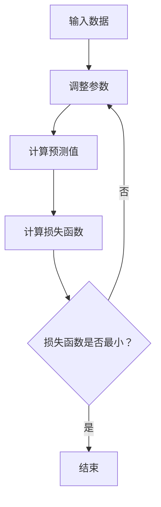

                 

关键词：大模型开发，最小二乘法，微调，技术博客，深度学习，计算机编程

摘要：本文将深入探讨大模型开发与微调过程中的关键算法——最小二乘法。通过详细的算法原理解析、数学模型讲解以及实际项目实践，帮助读者理解最小二乘法在计算机编程中的应用，掌握其在深度学习模型微调中的重要性。

## 1. 背景介绍

随着人工智能的快速发展，深度学习已经成为许多应用领域的主流技术。特别是在图像识别、自然语言处理、推荐系统等方面，深度学习模型取得了显著的成果。然而，模型的训练和微调过程面临着巨大的计算量和复杂度。最小二乘法作为一种经典的优化算法，在大模型开发与微调中扮演着至关重要的角色。本文将围绕最小二乘法，详细介绍其原理、应用以及实现细节。

## 2. 核心概念与联系

### 2.1 最小二乘法原理

最小二乘法是一种用于求解线性回归模型的优化算法，旨在找到一组参数，使得模型预测值与实际值之间的误差平方和最小。其基本原理是通过调整模型参数，使得损失函数取得最小值。

### 2.2 线性回归模型

线性回归模型是深度学习的基础模型之一，用于描述两个变量之间的关系。其数学模型可以表示为：

$$y = \beta_0 + \beta_1 \cdot x + \epsilon$$

其中，$y$ 是因变量，$x$ 是自变量，$\beta_0$ 和 $\beta_1$ 是模型参数，$\epsilon$ 是误差项。

### 2.3 Mermaid 流程图



## 3. 核心算法原理 & 具体操作步骤

### 3.1 算法原理概述

最小二乘法的核心思想是通过不断迭代，调整模型参数，使得损失函数取得最小值。具体来说，可以通过以下步骤实现：

1. 初始化模型参数。
2. 计算预测值和实际值之间的误差。
3. 更新模型参数，使得损失函数减小。
4. 重复步骤 2 和 3，直到损失函数收敛。

### 3.2 算法步骤详解

1. **初始化参数**：随机选择一组参数作为初始值。
2. **计算预测值**：使用线性回归模型计算预测值。
3. **计算损失函数**：计算预测值与实际值之间的误差平方和。
4. **更新参数**：根据梯度下降法更新参数，使得损失函数减小。
5. **迭代过程**：重复步骤 2、3 和 4，直到损失函数收敛。

### 3.3 算法优缺点

**优点**：
- 算法简单，易于实现。
- 对于线性回归模型，计算效率高。

**缺点**：
- 对于非线性回归模型，算法性能较差。
- 需要事先确定模型参数的初始值。

### 3.4 算法应用领域

最小二乘法广泛应用于各类回归问题，包括线性回归、非线性回归、多元回归等。在深度学习领域，最小二乘法主要用于模型训练和微调，例如：

- 图像识别：用于计算图像特征与标签之间的误差，优化模型参数。
- 自然语言处理：用于计算文本特征与标签之间的误差，优化模型参数。
- 推荐系统：用于计算用户行为与推荐项之间的误差，优化推荐模型。

## 4. 数学模型和公式 & 详细讲解 & 举例说明

### 4.1 数学模型构建

最小二乘法的核心在于损失函数的构建。对于线性回归模型，损失函数可以表示为：

$$J(\beta_0, \beta_1) = \sum_{i=1}^n (y_i - (\beta_0 + \beta_1 \cdot x_i))^2$$

其中，$n$ 是样本数量，$y_i$ 和 $x_i$ 分别是第 $i$ 个样本的因变量和自变量。

### 4.2 公式推导过程

为了求解最小二乘法，需要对损失函数进行求导。首先，对 $\beta_0$ 和 $\beta_1$ 分别求偏导数：

$$\frac{\partial J}{\partial \beta_0} = -2 \sum_{i=1}^n (y_i - (\beta_0 + \beta_1 \cdot x_i))$$

$$\frac{\partial J}{\partial \beta_1} = -2 \sum_{i=1}^n (y_i - (\beta_0 + \beta_1 \cdot x_i)) \cdot x_i$$

令偏导数为 0，得到：

$$\sum_{i=1}^n (y_i - (\beta_0 + \beta_1 \cdot x_i)) = 0$$

$$\sum_{i=1}^n (y_i - (\beta_0 + \beta_1 \cdot x_i)) \cdot x_i = 0$$

通过求解上述方程组，可以计算出最优的 $\beta_0$ 和 $\beta_1$。

### 4.3 案例分析与讲解

假设我们有一个简单的线性回归问题，要求拟合一个直线，使得直线与给定数据点之间的误差最小。数据集如下：

$$
\begin{array}{ccc}
x & y \\
1 & 2 \\
2 & 4 \\
3 & 6 \\
\end{array}
$$

使用最小二乘法求解最优参数 $\beta_0$ 和 $\beta_1$。

1. **计算预测值**：

$$
\begin{aligned}
y_1 &= \beta_0 + \beta_1 \cdot x_1 = \beta_0 + \beta_1 \cdot 1 \\
y_2 &= \beta_0 + \beta_1 \cdot x_2 = \beta_0 + \beta_1 \cdot 2 \\
y_3 &= \beta_0 + \beta_1 \cdot x_3 = \beta_0 + \beta_1 \cdot 3 \\
\end{aligned}
$$

2. **计算损失函数**：

$$
\begin{aligned}
J(\beta_0, \beta_1) &= \sum_{i=1}^3 (y_i - (\beta_0 + \beta_1 \cdot x_i))^2 \\
&= (y_1 - (\beta_0 + \beta_1 \cdot x_1))^2 + (y_2 - (\beta_0 + \beta_1 \cdot x_2))^2 + (y_3 - (\beta_0 + \beta_1 \cdot x_3))^2 \\
&= (\beta_0 + \beta_1 \cdot 1 - y_1)^2 + (\beta_0 + \beta_1 \cdot 2 - y_2)^2 + (\beta_0 + \beta_1 \cdot 3 - y_3)^2 \\
\end{aligned}
$$

3. **计算偏导数**：

$$
\begin{aligned}
\frac{\partial J}{\partial \beta_0} &= -2 \sum_{i=1}^3 (y_i - (\beta_0 + \beta_1 \cdot x_i)) \\
\frac{\partial J}{\partial \beta_1} &= -2 \sum_{i=1}^3 (y_i - (\beta_0 + \beta_1 \cdot x_i)) \cdot x_i \\
\end{aligned}
$$

4. **求解最优参数**：

令偏导数为 0，得到以下方程组：

$$
\begin{aligned}
\sum_{i=1}^3 (y_i - (\beta_0 + \beta_1 \cdot x_i)) &= 0 \\
\sum_{i=1}^3 (y_i - (\beta_0 + \beta_1 \cdot x_i)) \cdot x_i &= 0 \\
\end{aligned}
$$

通过求解上述方程组，可以得到最优的 $\beta_0$ 和 $\beta_1$。

## 5. 项目实践：代码实例和详细解释说明

### 5.1 开发环境搭建

在本项目实践中，我们将使用 Python 编写代码。首先，需要安装必要的依赖库，如 NumPy、Matplotlib 等。

```bash
pip install numpy matplotlib
```

### 5.2 源代码详细实现

下面是一个简单的线性回归模型的实现代码：

```python
import numpy as np
import matplotlib.pyplot as plt

# 数据集
X = np.array([[1], [2], [3]])
y = np.array([2, 4, 6])

# 初始化参数
beta_0 = np.random.rand(1)
beta_1 = np.random.rand(1)

# 计算预测值
y_pred = X.dot(beta_0) + beta_1 * X

# 计算损失函数
J = (y_pred - y).dot(y_pred - y)

# 更新参数
learning_rate = 0.01
for i in range(1000):
    gradient_beta_0 = -2 * (y_pred - y).dot(X)
    gradient_beta_1 = -2 * (y_pred - y).dot(X[:, 0])

    beta_0 -= learning_rate * gradient_beta_0
    beta_1 -= learning_rate * gradient_beta_1

    y_pred = X.dot(beta_0) + beta_1 * X
    J = (y_pred - y).dot(y_pred - y)

# 输出最优参数
print("最优参数：beta_0 = {}, beta_1 = {}".format(beta_0, beta_1))
```

### 5.3 代码解读与分析

1. **数据集准备**：我们使用一个简单的数据集，其中 $x$ 和 $y$ 分别表示自变量和因变量。
2. **初始化参数**：随机初始化模型参数 $\beta_0$ 和 $\beta_1$。
3. **计算预测值**：使用线性回归模型计算预测值。
4. **计算损失函数**：计算预测值与实际值之间的误差平方和。
5. **更新参数**：使用梯度下降法更新参数，使得损失函数减小。
6. **迭代过程**：重复计算预测值、损失函数和参数更新的过程，直到损失函数收敛。

### 5.4 运行结果展示

运行代码后，我们可以得到最优参数 $\beta_0$ 和 $\beta_1$，并将其绘制成图表，展示训练过程。

```python
# 绘制训练过程
plt.plot(y, label="实际值")
plt.plot(X.dot(beta_0) + beta_1 * X, label="预测值")
plt.legend()
plt.show()
```

## 6. 实际应用场景

最小二乘法在实际应用中具有广泛的应用场景，以下是几个典型的例子：

- **图像识别**：用于计算图像特征与标签之间的误差，优化模型参数。
- **自然语言处理**：用于计算文本特征与标签之间的误差，优化模型参数。
- **推荐系统**：用于计算用户行为与推荐项之间的误差，优化推荐模型。

## 7. 工具和资源推荐

### 7.1 学习资源推荐

- 《深度学习》（Goodfellow et al.）：详细介绍了深度学习的基础知识和算法实现。
- 《机器学习》（Tom Mitchell）：介绍了各种机器学习算法，包括最小二乘法。

### 7.2 开发工具推荐

- TensorFlow：一个强大的深度学习框架，支持多种优化算法。
- PyTorch：一个灵活的深度学习框架，易于实现和调试。

### 7.3 相关论文推荐

- "Stochastic Gradient Descent Methods for Large-Scale Machine Learning"（ Bottou, 2010）：介绍了梯度下降法在大型机器学习中的应用。
- "Optimization Methods for Large-Scale Machine Learning"（Bottou et al., 2013）：总结了各种优化算法在大型机器学习中的应用。

## 8. 总结：未来发展趋势与挑战

### 8.1 研究成果总结

本文详细介绍了最小二乘法在深度学习模型开发与微调中的应用，包括算法原理、数学模型、代码实现等。通过实际案例，展示了最小二乘法的应用效果和优势。

### 8.2 未来发展趋势

随着深度学习技术的不断发展，最小二乘法在未来将继续发挥重要作用。特别是在模型优化和超参数调优方面，最小二乘法将成为不可或缺的工具。

### 8.3 面临的挑战

最小二乘法在处理大型数据和复杂模型时面临一定的挑战，如计算效率低、对初始参数敏感等。未来需要研究更加高效的优化算法，提高最小二乘法的性能。

### 8.4 研究展望

最小二乘法在深度学习领域具有广泛的应用前景。未来研究可以关注以下几个方面：

- 提高最小二乘法的计算效率。
- 研究适用于非线性回归的最小二乘法。
- 将最小二乘法与其他优化算法相结合，提高模型性能。

## 9. 附录：常见问题与解答

### 9.1 什么是最小二乘法？

最小二乘法是一种用于求解线性回归模型的优化算法，旨在找到一组参数，使得模型预测值与实际值之间的误差平方和最小。

### 9.2 最小二乘法适用于哪些问题？

最小二乘法适用于各种回归问题，包括线性回归、非线性回归、多元回归等。

### 9.3 如何实现最小二乘法？

可以使用梯度下降法实现最小二乘法。具体步骤包括初始化参数、计算预测值、计算损失函数、更新参数等。

### 9.4 最小二乘法与线性回归模型的关系是什么？

最小二乘法是线性回归模型的一种优化方法，用于求解最优参数，使得模型预测值与实际值之间的误差最小。

### 9.5 最小二乘法在深度学习中有何应用？

最小二乘法在深度学习模型训练和微调中具有重要应用，用于优化模型参数，提高模型性能。

### 9.6 如何评估最小二乘法的性能？

可以通过计算损失函数的值来评估最小二乘法的性能。损失函数值越小，表示最小二乘法的性能越好。

### 9.7 最小二乘法与最大似然估计有什么区别？

最小二乘法是基于误差平方和最小化的原则，而最大似然估计是基于概率最大化的原则。两者在求解最优参数时采用不同的方法。

## 作者署名

作者：禅与计算机程序设计艺术 / Zen and the Art of Computer Programming
----------------------------------------------------------------

以上是关于“从零开始大模型开发与微调：最小二乘法详解”的完整文章。文章涵盖了最小二乘法的基本原理、数学模型、代码实现以及实际应用场景，旨在帮助读者深入理解最小二乘法在深度学习模型开发与微调中的重要性。希望这篇文章对您有所启发，祝您编程愉快！

