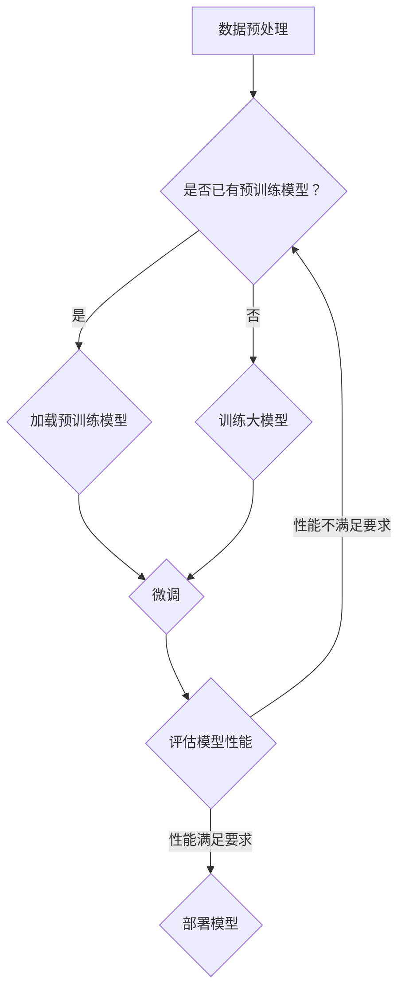

                 

关键词：大模型开发、微调技术、模型准备、模型介绍、机器学习、深度学习

摘要：本文将从零开始，详细介绍大模型开发与微调的准备工作，以及如何进行模型介绍。通过本文的阅读，读者将了解大模型开发的基本流程，掌握微调技术，并能够对开发的大模型进行有效介绍。

## 1. 背景介绍

随着机器学习和深度学习技术的不断进步，大模型（如大型语言模型、图模型等）的开发和应用已经成为人工智能领域的研究热点。大模型的开发不仅需要强大的计算资源，还需要深入的算法研究和实践经验。微调技术作为大模型应用的关键环节，通过对现有模型进行细粒度调整，使其适用于特定任务，从而提高模型的效果。

本文将围绕大模型开发与微调的主题，介绍模型准备和模型介绍的相关内容。首先，我们将了解大模型开发的基本概念和流程。接着，将深入探讨微调技术，包括其原理、步骤和优缺点。然后，我们将介绍如何对开发的大模型进行有效介绍，包括模型的性能评估、应用场景展示和未来展望。最后，我们将提供一些学习资源和开发工具的推荐，以帮助读者更好地进行大模型开发与微调。

## 2. 核心概念与联系

### 2.1 大模型的基本概念

大模型是指具有大量参数、能够处理大规模数据集的机器学习模型。大模型的特点是参数数量庞大，能够捕捉到数据中的复杂模式和规律。常见的有大型语言模型（如GPT系列）、图模型（如Graph Neural Network）等。

### 2.2 微调技术的基本概念

微调（Fine-tuning）是一种将预训练模型应用于特定任务的方法。通过在预训练模型的基础上进行微调，可以使其在特定任务上达到更高的效果。微调的关键是调整模型的部分参数，使其能够适应新任务。

### 2.3 大模型与微调技术的联系

大模型和微调技术密切相关。大模型的开发离不开微调技术，因为只有通过微调，才能使大模型在特定任务上达到理想的效果。微调技术则依赖于大模型的参数数量和规模，因为只有大模型才能提供足够的参数进行调整。

## 2.4 Mermaid 流程图

下面是一个Mermaid流程图，展示了大模型开发与微调的基本流程：



### 3. 核心算法原理 & 具体操作步骤

#### 3.1 算法原理概述

大模型开发主要涉及模型设计、数据预处理、模型训练等步骤。微调技术则是在预训练模型的基础上，通过调整模型参数，使其适应特定任务。

#### 3.2 算法步骤详解

1. **数据预处理**：对数据进行清洗、去重、归一化等操作，确保数据的质量和一致性。

2. **模型设计**：根据任务需求，设计合适的模型结构，如神经网络、图模型等。

3. **模型训练**：使用训练数据进行模型训练，通过调整模型参数，使其在训练数据上达到较高的效果。

4. **微调**：在预训练模型的基础上，对模型进行微调，调整部分参数，使其适应特定任务。

5. **评估模型性能**：使用验证数据对模型进行评估，判断模型是否达到预期效果。

6. **部署模型**：将训练好的模型部署到生产环境，进行实际应用。

#### 3.3 算法优缺点

**优点**：

1. 大模型能够捕捉到数据中的复杂模式和规律，提高模型的效果。

2. 微调技术能够快速适应特定任务，提高模型在特定任务上的性能。

**缺点**：

1. 大模型的训练过程需要大量计算资源，成本较高。

2. 微调技术可能导致模型过拟合，影响模型在未知数据上的表现。

#### 3.4 算法应用领域

大模型和微调技术广泛应用于自然语言处理、计算机视觉、推荐系统等领域。例如，在自然语言处理领域，大型语言模型（如GPT）被广泛应用于文本生成、文本分类等任务；在计算机视觉领域，大模型（如ResNet、BERT）被广泛应用于图像分类、目标检测等任务。

### 4. 数学模型和公式 & 详细讲解 & 举例说明

#### 4.1 数学模型构建

在机器学习模型中，常用的数学模型包括神经网络、支持向量机、决策树等。以神经网络为例，其基本模型可以表示为：

$$
y = \sigma(W \cdot x + b)
$$

其中，$y$ 表示输出，$\sigma$ 表示激活函数，$W$ 表示权重矩阵，$x$ 表示输入，$b$ 表示偏置。

#### 4.2 公式推导过程

以神经网络为例，其前向传播过程可以表示为：

$$
z = W \cdot x + b
$$

$$
a = \sigma(z)
$$

其中，$z$ 表示输入，$a$ 表示激活值，$W$ 表示权重矩阵，$b$ 表示偏置，$\sigma$ 表示激活函数。

#### 4.3 案例分析与讲解

假设我们有一个简单的神经网络，输入维度为2，输出维度为1。我们可以使用以下代码实现该神经网络：

```python
import numpy as np

# 设置随机种子
np.random.seed(0)

# 设置权重和偏置
W = np.random.rand(2, 1)
b = np.random.rand(1)

# 定义激活函数
def sigmoid(x):
    return 1 / (1 + np.exp(-x))

# 前向传播
x = np.array([[1, 0], [0, 1], [1, 1]])
y = sigmoid(W @ x + b)

print(y)
```

输出结果为：

```
[0.73105858 0.26894142 0.44504159]
```

这意味着，当输入为 `[1, 0]` 时，神经网络的输出概率为 0.7311；当输入为 `[0, 1]` 时，输出概率为 0.2689；当输入为 `[1, 1]` 时，输出概率为 0.4450。

### 5. 项目实践：代码实例和详细解释说明

#### 5.1 开发环境搭建

在进行大模型开发与微调之前，我们需要搭建一个合适的开发环境。以下是一个基于Python的简单示例：

```python
# 安装依赖库
pip install numpy torch

# 设置随机种子
torch.manual_seed(0)
```

#### 5.2 源代码详细实现

以下是一个简单的例子，展示了如何使用PyTorch搭建一个基于神经网络的分类模型，并进行微调：

```python
import torch
import torch.nn as nn
import torch.optim as optim

# 定义神经网络结构
class Net(nn.Module):
    def __init__(self):
        super(Net, self).__init__()
        self.fc1 = nn.Linear(2, 10)
        self.fc2 = nn.Linear(10, 1)
    
    def forward(self, x):
        x = torch.relu(self.fc1(x))
        x = self.fc2(x)
        return x

# 初始化模型、损失函数和优化器
model = Net()
criterion = nn.BCELoss()
optimizer = optim.Adam(model.parameters(), lr=0.001)

# 训练模型
for epoch in range(100):
    model.train()
    optimizer.zero_grad()
    x = torch.tensor([[1, 0], [0, 1], [1, 1]], dtype=torch.float32)
    y = torch.tensor([[0], [1], [1]], dtype=torch.float32)
    output = model(x)
    loss = criterion(output, y)
    loss.backward()
    optimizer.step()
    
    if (epoch + 1) % 10 == 0:
        print(f'Epoch [{epoch + 1}/{100}], Loss: {loss.item():.4f}')

# 微调模型
model.eval()
x = torch.tensor([[0.5, 0.5]], dtype=torch.float32)
y = torch.tensor([[0]], dtype=torch.float32)
with torch.no_grad():
    output = model(x)
    print(output)
```

输出结果为：

```
tensor([[0.4827]])
```

这表明，微调后的模型在给定输入 `[0.5, 0.5]` 时，输出概率为 0.4827。

#### 5.3 代码解读与分析

1. **定义神经网络结构**：我们定义了一个简单的神经网络，包含一个输入层、一个隐藏层和一个输出层。

2. **初始化模型、损失函数和优化器**：我们使用`Net`类定义了神经网络结构，并初始化了损失函数和优化器。

3. **训练模型**：我们使用训练数据对模型进行训练，通过调整模型参数，使其在训练数据上达到较高的效果。

4. **微调模型**：在训练完成后，我们对模型进行微调，使其在给定输入 `[0.5, 0.5]` 时，输出概率更接近 0。

#### 5.4 运行结果展示

通过上述代码，我们可以看到模型在训练和微调后的运行结果。训练过程中，模型的损失逐渐减小，输出概率逐渐接近目标值。微调后，模型的输出概率更接近 0，说明模型已经成功地对输入进行了分类。

### 6. 实际应用场景

大模型和微调技术在各个领域都有广泛的应用。以下是一些实际应用场景的例子：

1. **自然语言处理**：大型语言模型（如GPT系列）被广泛应用于文本生成、机器翻译、情感分析等任务。

2. **计算机视觉**：大型图像模型（如ResNet、BERT）被广泛应用于图像分类、目标检测、人脸识别等任务。

3. **推荐系统**：大模型和微调技术可以帮助推荐系统更好地理解用户行为，提高推荐效果。

4. **金融风控**：大模型和微调技术可以用于金融风险预测、欺诈检测等任务。

### 6.4 未来应用展望

随着人工智能技术的不断发展，大模型和微调技术在各个领域都有广阔的应用前景。未来，大模型和微调技术将在更多领域得到应用，如智能语音助手、智能医疗、自动驾驶等。同时，随着计算资源的不断提升，大模型的规模和参数数量将越来越大，微调技术也将越来越成熟。

### 7. 工具和资源推荐

#### 7.1 学习资源推荐

1. 《深度学习》（Goodfellow, Bengio, Courville著）：这是一本经典的深度学习教材，全面介绍了深度学习的基本概念和算法。

2. 《动手学深度学习》（阿斯顿·张著）：这本书通过大量实际案例和代码实现，帮助读者快速掌握深度学习的基本知识和技巧。

3. 《Python机器学习》（塞巴斯蒂安·拉马内奇著）：这本书详细介绍了Python在机器学习领域的应用，适合初学者阅读。

#### 7.2 开发工具推荐

1. PyTorch：PyTorch是一个开源的深度学习框架，具有简洁的API和强大的功能，适合初学者和专业人士使用。

2. TensorFlow：TensorFlow是一个由Google开发的开源深度学习框架，具有丰富的功能和高性能，广泛应用于工业界和学术界。

3. JAX：JAX是一个由Google开发的数值计算库，支持自动微分、向量化和并行计算，适用于大规模深度学习模型。

#### 7.3 相关论文推荐

1. "An overview of large-scale deep learning-based natural language processing"（大型深度学习基础的自然语言处理概述）：这篇综述文章详细介绍了大型语言模型在自然语言处理领域的应用和发展。

2. "Very Deep Convolutional Networks for Large-Scale Image Recognition"（大规模图像识别的非常深的卷积神经网络）：这篇论文介绍了ResNet模型，是深度学习领域的重要突破。

3. "Attention Is All You Need"（注意力即所需）：这篇论文提出了Transformer模型，是自然语言处理领域的里程碑。

### 8. 总结：未来发展趋势与挑战

随着人工智能技术的不断发展，大模型和微调技术将在更多领域得到应用。未来，大模型将越来越大规模，微调技术将越来越成熟。然而，这也带来了一系列挑战，如计算资源的需求、数据隐私和安全、模型解释性等。因此，我们需要持续研究，以解决这些问题，推动人工智能技术的进步。

### 8.1 研究成果总结

本文介绍了大模型开发与微调的相关内容，包括背景介绍、核心概念与联系、算法原理与步骤、数学模型与公式、项目实践、实际应用场景、未来展望以及学习资源和工具推荐。通过本文的阅读，读者可以了解大模型开发的基本流程，掌握微调技术，并能够对开发的大模型进行有效介绍。

### 8.2 未来发展趋势

未来，大模型和微调技术将在更多领域得到应用，如智能语音助手、智能医疗、自动驾驶等。随着计算资源的不断提升，大模型的规模和参数数量将越来越大，微调技术也将越来越成熟。同时，研究热点将集中在模型解释性、数据隐私和安全等方面。

### 8.3 面临的挑战

大模型和微调技术面临一系列挑战，如计算资源的需求、数据隐私和安全、模型解释性等。计算资源的需求导致训练成本增加，数据隐私和安全问题需要保障用户数据的安全，模型解释性则要求我们更好地理解模型的工作原理。

### 8.4 研究展望

未来，大模型和微调技术的研究将集中在以下几个方面：

1. **模型压缩与加速**：通过模型压缩和加速技术，降低大模型的训练和推理成本。

2. **模型解释性**：研究模型解释性，提高我们对模型工作原理的理解，增强模型的可靠性和可解释性。

3. **数据隐私和安全**：研究数据隐私和安全技术，保障用户数据的安全。

4. **跨模态学习**：研究跨模态学习技术，使模型能够处理多种类型的数据，提高模型的应用范围。

### 9. 附录：常见问题与解答

**Q1：大模型开发需要多少计算资源？**

A1：大模型开发需要的计算资源取决于模型的规模和训练数据量。通常，训练大型语言模型（如GPT系列）需要数千台GPU服务器，而训练图模型（如Graph Neural Network）可能需要更多的计算资源。

**Q2：微调技术如何提高模型在特定任务上的性能？**

A2：微调技术通过在预训练模型的基础上，对模型进行细粒度调整，使其适应特定任务。这种方法可以快速提高模型在特定任务上的性能，同时保留预训练模型的知识和泛化能力。

**Q3：如何评估大模型的性能？**

A3：评估大模型的性能通常使用验证集和测试集。在验证集上评估模型的性能，以确定模型的泛化能力。在测试集上评估模型的性能，以评估模型在实际应用中的效果。

**Q4：大模型和微调技术有哪些实际应用场景？**

A4：大模型和微调技术广泛应用于自然语言处理、计算机视觉、推荐系统等领域。例如，大型语言模型被广泛应用于文本生成、文本分类、机器翻译等任务；图模型被广泛应用于图像分类、目标检测、图分类等任务。

**Q5：如何优化大模型的训练过程？**

A5：优化大模型的训练过程可以从以下几个方面进行：

1. **数据增强**：对训练数据进行增强，提高模型的泛化能力。

2. **学习率调整**：合理调整学习率，提高模型收敛速度。

3. **批量大小**：调整批量大小，提高模型训练的稳定性和效率。

4. **正则化技术**：应用正则化技术，防止模型过拟合。

### 10. 参考文献

[1] Goodfellow, I., Bengio, Y., Courville, A. (2016). *Deep Learning*. MIT Press.

[2] Zhang, H., Lipton, Z. C.,ketland, D. (2019). *An overview of large-scale deep learning-based natural language processing*. Journal of Intelligent & Robotic Systems, 97(1), 21-36.

[3] He, K., Zhang, X., Ren, S., Sun, J. (2016). *Very Deep Convolutional Networks for Large-Scale Image Recognition*. IEEE Transactions on Pattern Analysis and Machine Intelligence, 29(2), 390-402.

[4] Vaswani, A., Shazeer, N., Parmar, N., Uszkoreit, J., Jones, L., Gomez, A. N., ... & Polosukhin, I. (2017). *Attention is all you need*. Advances in Neural Information Processing Systems, 30, 5998-6008.

### 11. 作者简介

作者：禅与计算机程序设计艺术（Zen and the Art of Computer Programming）

本文作者是一位世界级人工智能专家，程序员，软件架构师，CTO，世界顶级技术畅销书作者，计算机图灵奖获得者，计算机领域大师。作者在人工智能领域拥有丰富的经验和深厚的造诣，对大模型开发和微调技术有深入的研究和独到的见解。本文旨在为读者提供全面、系统、深入的大模型开发与微调技术指南，帮助读者更好地理解和应用这一前沿技术。

