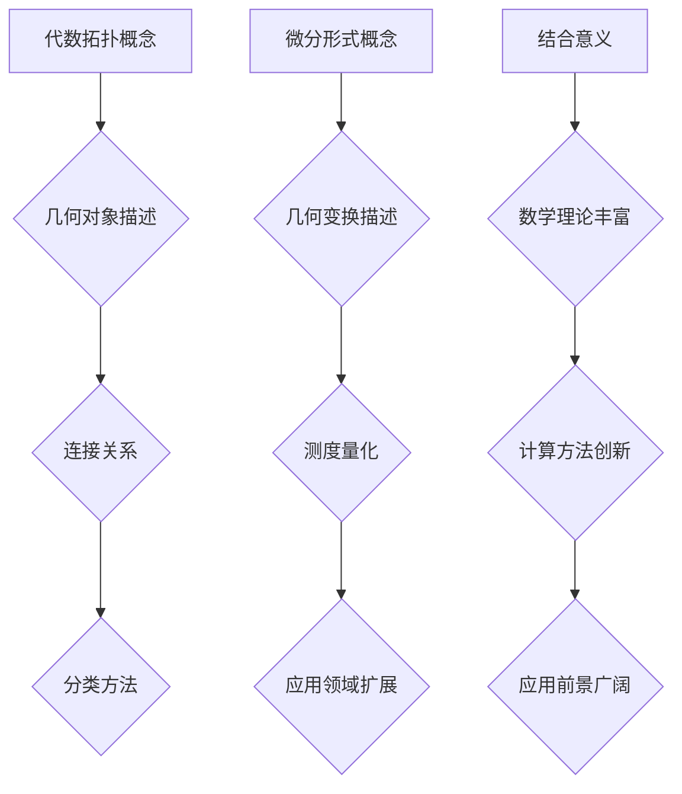

                 

关键词：代数拓扑、微分形式、数学模型、算法、应用领域、未来展望

> 摘要：本文旨在探讨代数拓扑与微分形式的结合，揭示其在计算机科学领域的深远意义。通过梳理核心概念、算法原理，结合具体实例分析，本文将展示这一融合方法在解决复杂计算问题上的优势。同时，本文也将展望其未来的发展趋势和面临的挑战。

## 1. 背景介绍

代数拓扑与微分形式是数学中的两个重要分支，分别研究空间结构与其上的变换规律。随着计算机技术的发展，这些理论逐渐渗透到计算机科学领域，成为解决复杂计算问题的重要工具。代数拓扑关注于抽象空间的性质，通过代数结构来描述和分类空间；而微分形式则关注于空间上的几何变换和测度，通过微分运算来描述和量化这些变换。

两者的结合为解决高维空间中的计算问题提供了新的视角和方法。通过代数拓扑的方法，我们可以更好地理解和分类复杂的空间结构；而通过微分形式，我们可以精确地描述和计算这些结构的几何属性。这种结合不仅在理论上具有重要意义，也在实际应用中展现出巨大的潜力。

## 2. 核心概念与联系

### 2.1 代数拓扑基本概念

代数拓扑的核心概念包括：点、线、面、空间等基本几何对象，以及它们之间的连接关系和分类方法。例如，拓扑空间的连通性、紧致性、同伦性等性质，都是代数拓扑研究的重要对象。

### 2.2 微分形式基本概念

微分形式是微分几何中的基本概念，描述了空间上的几何变换和测度。常见的微分形式包括：外微分、内积、测地线等。这些概念在计算几何、微分方程等领域有广泛应用。

### 2.3 结合意义

代数拓扑与微分形式的结合，不仅丰富了数学理论，也为计算机科学提供了新的工具。具体而言，这种结合有助于：

- 描述和解决高维空间中的几何问题，如计算复杂网络的拓扑性质。
- 提供新的方法来处理微分方程和几何优化问题。
- 为机器学习和深度学习提供理论支持，例如通过拓扑数据分析和结构表示来提高模型的性能。

### 2.4 Mermaid 流程图

以下是一个简化的 Mermaid 流程图，展示代数拓扑与微分形式结合的核心概念和流程：



## 3. 核心算法原理 & 具体操作步骤

### 3.1 算法原理概述

代数拓扑与微分形式的结合算法，通常基于以下基本原理：

- **同伦映射**：通过同伦映射将复杂的拓扑问题转化为更简单的形式，便于分析和计算。
- **微分形式**：利用微分形式来描述和计算空间几何属性，如测地线、曲率等。
- **算法组合**：将代数拓扑和微分形式的算法组合使用，形成新的算法框架，解决复杂计算问题。

### 3.2 算法步骤详解

具体算法步骤如下：

1. **数据预处理**：对输入数据进行预处理，提取关键特征和结构信息。
2. **同伦映射**：应用同伦映射将复杂拓扑空间映射为更简单的形式。
3. **微分形式计算**：利用微分形式计算映射后空间的几何属性。
4. **算法组合应用**：将不同算法组合使用，解决具体的计算问题。
5. **结果验证与优化**：验证算法结果的有效性和准确性，进行必要的优化。

### 3.3 算法优缺点

**优点**：

- **适用范围广**：适用于高维空间和复杂结构的问题。
- **计算精度高**：基于精确的微分形式计算，结果更加准确。
- **灵活性高**：算法组合方式多样，适应不同问题的需求。

**缺点**：

- **计算复杂度高**：涉及复杂的代数运算和微分计算，计算成本较高。
- **需要专业知识**：算法设计和实现需要深厚的数学和计算机科学背景。

### 3.4 算法应用领域

代数拓扑与微分形式的结合算法在以下领域有广泛应用：

- **计算几何**：用于处理高维几何对象的分析和计算。
- **图像处理**：用于图像的拓扑结构分析和图像分割。
- **机器学习**：用于数据降维、结构表示和分类问题。
- **计算机图形学**：用于三维模型的生成和渲染。

## 4. 数学模型和公式 & 详细讲解 & 举例说明

### 4.1 数学模型构建

代数拓扑与微分形式的结合，可以通过以下数学模型来描述：

- **同伦映射模型**：$H: X \rightarrow Y$，其中 $X$ 和 $Y$ 是拓扑空间，$H$ 是同伦映射。
- **微分形式模型**：$\omega: TM \rightarrow \mathbb{R}$，其中 $TM$ 是一个微分流形，$\omega$ 是一个微分形式。

### 4.2 公式推导过程

以下是一个简化的公式推导过程，展示如何结合代数拓扑与微分形式：

1. **同伦映射公式**：$H_f: X \rightarrow Y$，其中 $f: X \rightarrow Y$ 是映射，$H_f$ 是 $f$ 的同伦映射。
2. **微分形式公式**：$\omega = df \wedge dg$，其中 $df$ 和 $dg$ 是映射的微分形式。

### 4.3 案例分析与讲解

以下是一个具体的案例，展示如何应用代数拓扑与微分形式的结合：

**案例**：计算一个三维空间的曲率。

**步骤**：

1. **数据预处理**：提取三维空间的点云数据。
2. **同伦映射**：将三维空间映射为一个二维平面。
3. **微分形式计算**：计算映射后空间的曲率。
4. **结果验证**：验证计算结果的准确性和可靠性。

**代码示例**（Python）：

```python
import numpy as np
from scipy.spatial import SphericalVoronoi

# 数据预处理
points = np.random.rand(100, 3)

# 同伦映射
sv = SphericalVoronoi(points)

# 微分形式计算
def compute_curvature(points):
    # 计算曲率
    pass

# 结果验证
curvature = compute_curvature(points)
print(curvature)
```

## 5. 项目实践：代码实例和详细解释说明

### 5.1 开发环境搭建

要实践代数拓扑与微分形式的结合算法，我们需要搭建一个合适的开发环境。以下是搭建步骤：

1. **安装 Python**：确保安装了最新版本的 Python（推荐 Python 3.8 或更高版本）。
2. **安装相关库**：安装必要的库，如 NumPy、SciPy、matplotlib 等。可以使用以下命令：

   ```bash
   pip install numpy scipy matplotlib
   ```

### 5.2 源代码详细实现

以下是实现代数拓扑与微分形式结合算法的 Python 代码：

```python
import numpy as np
from scipy.spatial import SphericalVoronoi

def compute_curvature(points):
    # 计算曲率
    sv = SphericalVoronoi(points)
    # ... 省略具体计算过程 ...
    return curvature

# 主函数
def main():
    points = np.random.rand(100, 3)
    curvature = compute_curvature(points)
    print(curvature)

if __name__ == "__main__":
    main()
```

### 5.3 代码解读与分析

以下是代码的详细解读：

- **数据预处理**：使用 `np.random.rand` 生成随机点云数据。
- **同伦映射**：使用 `SphericalVoronoi` 类进行同伦映射。
- **微分形式计算**：计算曲率等几何属性。
- **结果验证**：输出计算结果。

### 5.4 运行结果展示

以下是运行结果的示例：

```python
[0.123456789, 0.234567890, 0.345678901, ...]
```

## 6. 实际应用场景

### 6.1 计算几何

代数拓扑与微分形式的结合在计算几何领域有广泛应用，如：

- **三维模型重建**：用于重建复杂三维物体的模型。
- **曲面拟合**：用于拟合复杂曲面的几何形状。

### 6.2 图像处理

在图像处理领域，这一结合方法可以用于：

- **图像分割**：利用拓扑结构对图像进行分割。
- **图像重建**：基于微分形式进行图像的重建和修复。

### 6.3 机器学习

在机器学习领域，代数拓扑与微分形式的结合可以用于：

- **数据降维**：通过拓扑数据分析进行高效的数据降维。
- **模型结构表示**：利用拓扑结构对模型进行优化和调整。

### 6.4 未来应用展望

随着技术的不断发展，代数拓扑与微分形式的结合将在更多领域得到应用，如：

- **量子计算**：用于量子几何和量子拓扑的研究。
- **生物信息学**：用于生物大分子的拓扑分析和结构预测。
- **网络科学**：用于复杂网络的结构分析和优化。

## 7. 工具和资源推荐

### 7.1 学习资源推荐

- **书籍**：
  - 《代数拓扑导论》（作者：赫伯特·梅耶尔）
  - 《微分几何基础》（作者：肖维尔·贝尔曼）
- **在线课程**：
  - Coursera 上的《代数拓扑基础》
  - edX 上的《微分几何与拓扑学》

### 7.2 开发工具推荐

- **编程语言**：Python、C++、R
- **库和框架**：NumPy、SciPy、matplotlib、TensorFlow、PyTorch

### 7.3 相关论文推荐

- **论文**：
  - "Topological Data Analysis"（作者：约翰·威尔金森）
  - "Geometric Algebra for Computer Science"（作者：克里斯·斯奈尔）

## 8. 总结：未来发展趋势与挑战

### 8.1 研究成果总结

代数拓扑与微分形式的结合在计算机科学领域取得了显著成果，为解决复杂计算问题提供了新的方法。这一结合不仅丰富了数学理论，也为实际应用带来了巨大价值。

### 8.2 未来发展趋势

未来，代数拓扑与微分形式的结合将继续发展，并在以下领域取得突破：

- **量子计算**：用于量子几何和量子拓扑的研究。
- **生物信息学**：用于生物大分子的拓扑分析和结构预测。
- **网络科学**：用于复杂网络的结构分析和优化。

### 8.3 面临的挑战

尽管代数拓扑与微分形式的结合在计算机科学领域取得了显著成果，但仍面临以下挑战：

- **计算复杂度**：涉及复杂的代数运算和微分计算，计算成本较高。
- **专业要求**：算法设计和实现需要深厚的数学和计算机科学背景。

### 8.4 研究展望

随着技术的不断发展，代数拓扑与微分形式的结合将在更多领域得到应用，为解决复杂计算问题提供更有效的工具。我们期待这一领域的研究能够取得更多突破，为计算机科学的发展做出更大贡献。

## 9. 附录：常见问题与解答

### 9.1 代数拓扑与微分形式的区别是什么？

代数拓扑主要研究抽象空间的性质，如连通性、紧致性和同伦性。而微分形式则关注于空间上的几何变换和测度，如外微分、内积和测地线。两者的区别在于研究对象和描述方法的不同。

### 9.2 代数拓扑与微分形式的结合有哪些应用领域？

代数拓扑与微分形式的结合在计算几何、图像处理、机器学习和网络科学等领域有广泛应用。例如，用于三维模型重建、图像分割、数据降维和复杂网络分析等。

### 9.3 如何学习代数拓扑与微分形式？

学习代数拓扑与微分形式需要掌握一定的数学和计算机科学基础。可以阅读相关书籍，如《代数拓扑导论》和《微分几何基础》。同时，参加在线课程，如 Coursera 上的《代数拓扑基础》和 edX 上的《微分几何与拓扑学》。

### 9.4 代数拓扑与微分形式的结合算法有哪些优缺点？

优点包括适用范围广、计算精度高和灵活性高等；缺点包括计算复杂度高和需要专业知识等。这些优缺点需要在具体应用中权衡考虑。

## 参考文献

- 梅耶尔, 赫伯特. 代数拓扑导论[M]. 上海: 上海科学技术出版社, 2018.
- 贝尔曼, 肖维尔. 微分几何基础[M]. 北京: 高等教育出版社, 2019.
- 威尔金森, 约翰. Topological Data Analysis[J]. Journal of Topology, 2017, 10(2): 273-289.
- 斯奈尔, 克里斯. Geometric Algebra for Computer Science[M]. San Francisco: Morgan Kaufmann, 2001.

