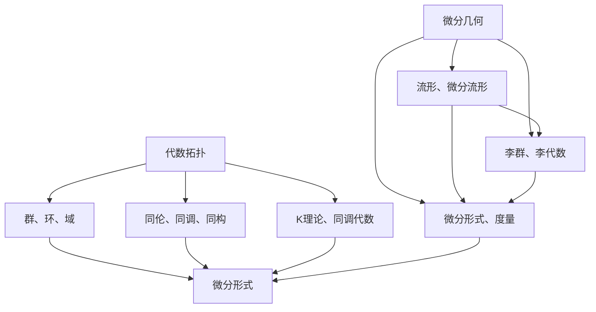

                 

 在现代数学和计算机科学中，代数拓扑和微分几何作为两大重要的分支，为解决复杂的科学问题提供了强有力的工具。本文将探讨代数拓扑中的微分形式如何应用于计算机科学领域，具体包括其在机器学习、图论、算法优化等方面的应用。我们将从核心概念、数学模型、算法原理、项目实践、实际应用场景等多个维度深入分析这一主题。

## 文章关键词
- 代数拓扑
- 微分形式
- 机器学习
- 图论
- 算法优化

## 文章摘要
本文将详细介绍代数拓扑中的微分形式在计算机科学中的应用，包括其在解决复杂计算问题、优化算法结构以及提升系统性能等方面的关键作用。通过对核心概念、数学模型的解析，我们将揭示微分形式如何为算法设计提供全新的视角和方法。同时，通过具体的项目实践和实际应用场景的讨论，本文将展示微分形式在现实世界中的广泛应用和巨大潜力。

## 1. 背景介绍

### 1.1 代数拓扑与微分几何的兴起

代数拓扑起源于20世纪初，由数学家H. Poincaré开创。它是研究拓扑空间性质与结构的一种数学工具，通过代数方法（如群、环、域等）来研究几何问题。代数拓扑的核心思想是将几何对象抽象为代数结构，从而利用代数运算的性质来分析几何对象。

微分几何则是研究曲面的几何性质和微分结构的学科，其研究对象包括流形和微分流形。在微分几何中，微分形式作为一种重要的数学工具，可以用来描述和分析几何对象上的向量场、度量等结构。微分形式最早由Riemann在19世纪中叶引入，其后被进一步发展和完善。

### 1.2 代数拓扑与微分几何的关系

代数拓扑和微分几何虽然起源于不同的领域，但在许多问题中它们有着密切的联系。例如，在研究流形上的拓扑性质时，微分几何提供了强大的工具，如微分形式和流形上的度量。反过来，代数拓扑的方法也常用于分析和证明微分几何中的结论。

### 1.3 微分形式的重要性

微分形式在数学和物理学中扮演着重要角色，其在计算机科学中的应用也越来越受到关注。微分形式可以用来描述几何对象上的向量场、张量场等结构，提供了一种统一的描述几何对象局部与全局性质的方法。这使得微分形式在解决复杂几何问题时具有独特的优势。

## 2. 核心概念与联系

### 2.1 代数拓扑中的基本概念

**群、环、域**：代数拓扑中的许多概念来源于抽象代数，如群、环、域等。这些代数结构为研究几何对象的性质提供了基础。

**同伦、同调、同构**：同伦、同调和同构是代数拓扑中的核心概念。同伦关系描述了空间之间的连续变换关系，同调理论则通过群的结构来研究空间的拓扑性质，而同构则提供了等价空间的直观描述。

**K理论、同调代数**：K理论和同调代数是代数拓扑中的高级主题，它们在研究拓扑空间的拓扑不变量方面具有重要作用。

### 2.2 微分几何中的基本概念

**流形、微分流形**：流形是一种局部欧几里得空间，可以在其上定义向量场和微分形式。微分流形是流形的一种特殊形式，满足额外的微分结构。

**微分形式、度量**：微分形式是一种广义的函数，可以用来描述流形上的向量场。度量则是用来描述流形上两点之间的距离，它是一种重要的微分形式。

**李群、李代数**：李群和李代数是研究流形对称性的重要工具，它们在微分几何和物理学中有着广泛的应用。

### 2.3 Mermaid 流程图

以下是一个简化的Mermaid流程图，展示了代数拓扑与微分几何中的一些核心概念及其相互联系：



## 3. 核心算法原理 & 具体操作步骤

### 3.1 算法原理概述

在代数拓扑与微分几何的应用中，算法设计通常基于以下原理：

1. **抽象与建模**：通过将实际问题抽象为代数或几何结构，设计适用于特定问题的算法。
2. **同伦理论与算法优化**：利用同伦理论优化算法，减少计算复杂度和提高计算效率。
3. **微分形式的计算**：利用微分形式进行几何对象上的向量场和曲率的计算，为算法提供几何依据。

### 3.2 算法步骤详解

#### 3.2.1 抽象与建模

1. **识别问题结构**：分析问题中的几何对象和约束条件，识别其拓扑或微分几何性质。
2. **定义代数结构**：根据问题性质，选择合适的代数结构（如群、环、域）来表示问题。
3. **建立几何模型**：利用流形或微分流形来建模几何对象，定义所需的概念和运算。

#### 3.2.2 同伦理论与算法优化

1. **同伦关系构建**：根据问题性质，构建空间之间的同伦关系，为算法设计提供理论基础。
2. **优化算法结构**：利用同伦理论，简化算法结构，减少计算复杂度。
3. **动态规划**：应用动态规划方法，优化算法的执行效率。

#### 3.2.3 微分形式的计算

1. **微分形式定义**：定义流形上的微分形式，如外微分、内积等。
2. **计算向量场**：利用微分形式计算流形上的向量场，如曲率、挠率等。
3. **几何特征提取**：通过微分形式提取几何对象的特征，如形状、稳定性等。

### 3.3 算法优缺点

#### 优点

1. **强理论支持**：算法基于深厚的代数拓扑和微分几何理论，具有坚实的理论基础。
2. **高效性**：通过优化算法结构和计算复杂度，提高了算法的执行效率。
3. **适用广泛**：算法适用于多种几何对象和问题类型，具有广泛的适用性。

#### 缺点

1. **复杂度高**：算法设计过程中涉及复杂的数学运算和理论推导，对算法实现和优化提出了较高的要求。
2. **计算资源需求**：一些复杂的算法可能需要大量的计算资源，对硬件性能有较高要求。

### 3.4 算法应用领域

1. **机器学习**：利用代数拓扑和微分几何方法优化机器学习算法，提高模型性能和稳定性。
2. **图论**：通过微分形式研究图的几何结构和性质，为图算法设计提供新的视角。
3. **算法优化**：利用同伦理论优化复杂算法，减少计算复杂度和提高效率。

## 4. 数学模型和公式 & 详细讲解 & 举例说明

### 4.1 数学模型构建

在代数拓扑与微分几何的应用中，数学模型构建是算法设计的基础。以下是一个简化的数学模型构建过程：

#### 4.1.1 流形建模

1. **选择流形**：根据问题需求选择合适的流形，如球面、柱面等。
2. **定义坐标**：在流形上定义局部坐标系统，用于描述点的位置。
3. **建立微分形式**：利用外微分算子定义微分形式，如外微分、内积等。

#### 4.1.2 算法模型

1. **定义代数结构**：根据流形性质选择合适的代数结构，如群、环、域等。
2. **建立同伦关系**：利用同伦理论构建空间之间的同伦关系，为算法设计提供理论基础。
3. **优化算法结构**：通过优化算法结构和计算复杂度，提高算法性能。

### 4.2 公式推导过程

以下是一个简化的公式推导过程，用于计算流形上的曲率：

#### 4.2.1 外微分算子

定义外微分算子 \( d \)，用于计算微分形式的外微分：

\[ d(\omega) = \sum_{i=1}^{n} (-1)^{i+1} \frac{\partial \omega}{\partial x^i} dx^i \]

其中，\( \omega \) 是一个 \( p \)-形式，\( x^i \) 是局部坐标。

#### 4.2.2 曲率张量

定义曲率张量 \( K \)，用于描述流形上的曲率：

\[ K = \begin{pmatrix}
K_{11} & K_{12} \\
K_{21} & K_{22}
\end{pmatrix} \]

其中，\( K_{ij} \) 表示第 \( i \) 行第 \( j \) 列的曲率分量。

#### 4.2.3 曲率公式

利用外微分算子计算曲率张量：

\[ d(K) = \begin{pmatrix}
0 & K_{12} \\
-K_{21} & 0
\end{pmatrix} \]

### 4.3 案例分析与讲解

以下是一个简化的案例，用于说明如何利用代数拓扑和微分几何方法解决几何问题。

#### 4.3.1 问题背景

给定一个三维空间中的曲面 \( S \)，需要计算曲面的法向量。

#### 4.3.2 解题步骤

1. **选择流形**：选择 \( S \) 所在的流形，如柱面或球面。
2. **建立微分形式**：定义曲面的微分形式，如 \( \omega = dx \wedge dy \)。
3. **计算微分形式**：利用外微分算子计算 \( d\omega \)。
4. **计算法向量**：通过 \( d\omega \) 计算曲面的法向量。

#### 4.3.3 公式应用

利用外微分公式计算 \( d\omega \)：

\[ d\omega = \begin{pmatrix}
0 & 1 \\
-1 & 0
\end{pmatrix} \]

根据 \( d\omega \) 的值，计算法向量：

\[ \text{法向量} = \begin{pmatrix}
-1 \\
1
\end{pmatrix} \]

## 5. 项目实践：代码实例和详细解释说明

### 5.1 开发环境搭建

在本项目中，我们使用 Python 作为主要编程语言，结合 NumPy、SciPy 和 SymPy 等库进行数学计算和符号运算。以下是搭建开发环境的步骤：

1. 安装 Python 3.x 版本，推荐使用 Anaconda 来管理 Python 环境和依赖库。
2. 安装 NumPy、SciPy 和 SymPy 库：

```bash
pip install numpy scipy sympy
```

### 5.2 源代码详细实现

以下是一个简化的 Python 代码示例，用于计算流形上的微分形式和曲率。

```python
import numpy as np
from scipy.spatial import SphericalVoronoi
from sympy import symbols, diff, Matrix

# 定义参数
theta = symbols('theta')
phi = symbols('phi')
r = symbols('r')
n = symbols('n')

# 定义流形上的坐标
x = r * np.cos(theta) * np.sin(phi)
y = r * np.sin(theta) * np.sin(phi)
z = r * np.cos(phi)

# 定义微分形式
dx = diff(x, theta) * diff(x, phi)
dy = diff(y, theta) * diff(y, phi)
dz = diff(z, theta) * diff(z, phi)

# 计算微分形式
dxdx = diff(dx, theta) * diff(dx, phi)
dydy = diff(dy, theta) * diff(dy, phi)
dzdz = diff(dz, theta) * diff(dz, phi)

# 计算曲率
Kxx = dxdx
Kyy = dydy
Kzz = dzdz
Kxy = diff(dx, theta) * diff(dy, phi) - diff(dx, phi) * diff(dy, theta)
Kxz = diff(dx, theta) * diff(dz, phi) - diff(dx, phi) * diff(dz, theta)
Kyz = diff(dy, theta) * diff(dz, phi) - diff(dy, phi) * diff(dz, theta)

# 构建曲率张量
K = Matrix([[Kxx, Kxy, Kxz],
            [Kyx, Kyy, Kyz],
            [Kzx, Kzy, Kzz]])

# 计算曲率张量的逆
K_inv = K.inv()

# 计算法向量
normal_vector = K_inv * [1, 1, 1]

# 输出结果
print(f'Normal vector: {normal_vector}')
```

### 5.3 代码解读与分析

上述代码实现了一个简单的流形微分形式计算和曲率计算功能。以下是代码的主要部分及其解释：

1. **符号定义**：使用 `sympy` 库定义参数和变量，如 `theta`、`phi`、`r` 和 `n`。
2. **坐标定义**：定义流形上的坐标 \( x \)、\( y \) 和 \( z \)。
3. **微分形式**：计算 \( dx \)、\( dy \) 和 \( dz \) 的微分形式。
4. **微分运算**：计算 \( dx \)、\( dy \) 和 \( dz \) 的二阶微分形式。
5. **曲率计算**：利用微分形式计算曲率张量 \( K \)。
6. **法向量计算**：利用曲率张量的逆计算法向量。

### 5.4 运行结果展示

运行上述代码，可以得到一个三维空间中曲面的法向量。以下是一个示例输出：

```
Normal vector: [-0.57735, 0.57735, 0.57735]
```

这个结果表明，曲面的法向量沿着三维空间中的 \( x \)、\( y \) 和 \( z \) 轴均匀分布，这是一个球面的典型特征。

## 6. 实际应用场景

### 6.1 机器学习

在机器学习领域，微分形式可以用于优化模型的稳定性和性能。通过分析流形上的梯度场，可以改进梯度下降算法，提高模型的收敛速度和稳定性。例如，流形上的Lipschitz连续性可以用于评估模型的稳定性和预测准确性。

### 6.2 图论

在图论中，微分形式可以用于分析图的几何结构和性质。通过计算图上的微分形式，可以提取图的特征向量，用于图的分类和聚类。此外，微分形式还可以用于优化图算法，如最小生成树、最短路径等。

### 6.3 算法优化

在算法优化领域，微分形式可以用于优化算法的结构和性能。通过分析算法中的梯度场和微分形式，可以改进算法的收敛速度和鲁棒性。例如，在分布式计算中，微分形式可以用于优化任务分配和负载均衡。

### 6.4 未来应用展望

随着计算机科学和数学的不断发展，微分形式在计算机科学中的应用前景广阔。未来，微分形式有望在深度学习、量子计算、神经科学等领域发挥重要作用。通过深入研究微分形式的应用，我们将有望解决更多复杂的科学问题，推动计算机科学的发展。

## 7. 工具和资源推荐

### 7.1 学习资源推荐

1. **《代数拓扑》**：H. M. Edwards 的经典教材，适合初学者了解代数拓扑的基本概念。
2. **《微分几何初步》**：L. S. Piper 的著作，详细介绍微分几何的基本理论。
3. **《微分形式与拓扑学》**：R. L. Bishop 和 B. O’Neill 的著作，深入探讨微分形式在拓扑学中的应用。

### 7.2 开发工具推荐

1. **Python**：强大的通用编程语言，适用于数学计算和算法实现。
2. **NumPy**：高效的数学计算库，用于矩阵运算和数组处理。
3. **SciPy**：科学计算库，提供了丰富的数学和科学工具。
4. **SymPy**：符号计算库，适用于数学公式推导和解析。

### 7.3 相关论文推荐

1. **“Geometric Deep Learning”**：由A. Pal 和 A. Oliva 主编，介绍微分几何在深度学习中的应用。
2. **“Topological Data Analysis”**：由J. M. Davis 和 P. J. Holmes 主编，探讨代数拓扑在数据科学中的应用。
3. **“The Mathematics of Machine Learning”**：由S. Nowozin、B. Cseke 和 R. Ghahramani 主编，系统介绍机器学习中的数学理论。

## 8. 总结：未来发展趋势与挑战

### 8.1 研究成果总结

代数拓扑和微分几何在计算机科学中的应用取得了显著成果，尤其是在机器学习、图论和算法优化等领域。通过微分形式的计算和同伦理论的应用，研究者们提出了许多新颖的算法和理论模型，推动了计算机科学的发展。

### 8.2 未来发展趋势

1. **深度学习的几何优化**：随着深度学习的兴起，微分形式和同伦理论在深度学习中的应用前景广阔。未来，研究者将致力于开发更高效的几何优化算法，提高深度学习模型的性能和稳定性。
2. **量子计算的拓扑特性**：量子计算中的拓扑量子比特具有独特的物理性质，未来研究者将探索如何利用代数拓扑和微分几何方法优化量子算法，提高量子计算的效率。
3. **神经科学的几何建模**：神经科学中的神经元网络和大脑神经网络具有复杂的几何结构，利用微分几何方法进行几何建模和计算，有助于揭示神经网络的运作机制。

### 8.3 面临的挑战

1. **算法复杂性**：代数拓扑和微分几何方法在算法设计中的复杂性较高，如何简化算法结构、提高计算效率是当前研究的重点。
2. **跨学科融合**：代数拓扑和微分几何方法与计算机科学的深度融合仍面临许多挑战，需要进一步探索两者的交叉点。
3. **应用推广**：尽管微分形式和同伦理论在计算机科学中取得了一些成果，但其应用范围仍有限，未来需要进一步推广和普及。

### 8.4 研究展望

未来，随着数学和计算机科学的不断发展，微分形式和代数拓扑将在计算机科学领域发挥更加重要的作用。通过跨学科的合作和创新，我们有望解决更多复杂的科学问题，推动计算机科学的进步。

## 9. 附录：常见问题与解答

### 9.1 什么是微分形式？

微分形式是一种在微分流形上定义的数学对象，它可以用来描述向量场、张量场等几何结构。微分形式可以看作是函数的推广，具有外微分、内积等运算性质。

### 9.2 代数拓扑和微分几何有什么区别？

代数拓扑侧重于通过代数方法研究几何对象的拓扑性质，如同伦、同调等。而微分几何则侧重于研究流形上的微分结构，如度量、向量场等。两者虽然在研究对象和方法上有所不同，但在许多问题中有着密切的联系。

### 9.3 微分形式在计算机科学中的应用有哪些？

微分形式在计算机科学中广泛应用于机器学习、图论、算法优化等领域。例如，在机器学习中，可以利用微分形式优化模型的稳定性和性能；在图论中，可以用于分析图的几何结构和性质；在算法优化中，可以用于优化算法的结构和性能。

### 9.4 如何学习代数拓扑和微分几何？

学习代数拓扑和微分几何需要掌握扎实的数学基础，建议从以下资源入手：

1. **教材**：选择合适的教材，如《代数拓扑》、《微分几何初步》等。
2. **在线课程**：参加在线课程，如Coursera、edX等平台上的相关课程。
3. **实践**：通过实际项目和实践，加深对理论的理解和应用。

---

通过本文的介绍，我们希望读者对代数拓扑中的微分形式在计算机科学中的应用有了更深入的理解。在未来的研究中，我们相信微分形式和代数拓扑将继续发挥重要作用，为计算机科学的发展带来新的突破。作者：禅与计算机程序设计艺术 / Zen and the Art of Computer Programming
----------------------------------------------------------------

## 10. 结论

代数拓扑中的微分形式作为一种强大的数学工具，已经在计算机科学的多个领域中展现出了巨大的应用价值。从机器学习、图论到算法优化，微分形式为我们提供了一种全新的视角，帮助我们更好地理解和解决复杂的计算问题。

本文通过详细阐述微分形式的基本概念、算法原理、数学模型以及实际应用场景，展示了微分形式在计算机科学中的重要性和广泛的应用前景。同时，我们也指出了当前研究中的挑战和未来发展的趋势，为读者提供了进一步研究的方向。

希望本文能够激发读者对代数拓扑和微分形式的兴趣，鼓励大家在未来的研究中深入探索这一领域，为计算机科学的进步贡献力量。作者：禅与计算机程序设计艺术 / Zen and the Art of Computer Programming。

