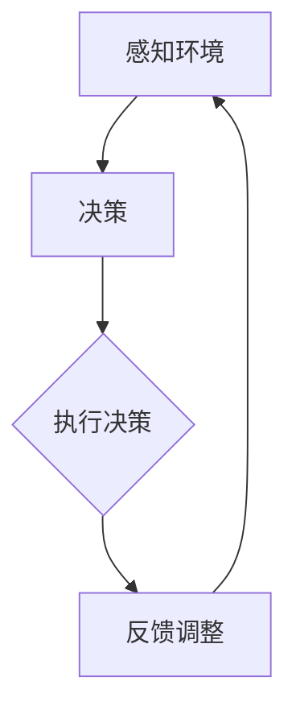

                 

### 1. 背景介绍

随着人工智能技术的快速发展，智能代理（Agent）已经成为了一个重要的研究领域。智能代理是一种能够自主执行任务、与环境交互的软件实体。在复杂的环境中，智能代理需要具备一定的代码执行能力，以便有效地完成各种任务。

代码执行能力是指代理能够编写、运行和维护代码的能力。传统的智能代理通常依赖于预定义的规则和模型来执行任务，而这些规则和模型往往难以应对复杂多变的实际环境。相比之下，具备代码执行能力的代理可以自主地编写和调整代码，从而更好地适应环境变化，提高任务完成的效率。

本文将探讨代码执行能力在智能代理中的作用，分析其重要性，并介绍相关的核心概念和算法原理。通过具体的案例和实践，我们将展示代码执行能力如何帮助智能代理实现更高的自主性和适应性。

### 2. 核心概念与联系

在深入探讨代码执行能力之前，我们首先需要了解一些核心概念和它们之间的关系。

#### 智能代理（Agent）

智能代理是一种能够感知环境、制定决策并执行相应操作的软件实体。根据其自主性程度，智能代理可以分为以下几类：

- **主动代理**：能够自主地采取行动，不受外部控制。
- **被动代理**：只能根据环境信息执行预定义的任务。
- **半主动代理**：在执行任务时，可以与外部系统进行交互。

#### 环境感知（Perception）

环境感知是指智能代理获取和处理环境信息的能力。环境信息包括文本、图像、声音等多种形式。智能代理需要通过传感器或其他数据源获取这些信息，以便更好地理解环境。

#### 决策（Decision Making）

决策是指智能代理根据环境信息和目标，选择最佳行动方案的过程。决策算法可以基于规则、模型或优化方法，从而实现最优或近似最优的决策。

#### 代码执行（Code Execution）

代码执行能力是指智能代理能够编写、运行和维护代码的能力。这包括以下几个方面的能力：

- **编写代码**：智能代理可以生成新的代码，以适应特定任务或环境。
- **运行代码**：智能代理能够执行预定义的代码，从而实现特定的功能。
- **维护代码**：智能代理可以修改和维护现有代码，以提高性能和适应性。

#### Mermaid 流程图

以下是一个简化的 Mermaid 流程图，描述了智能代理的基本工作流程：



在这个流程图中，智能代理首先感知环境，然后根据环境信息和目标进行决策，接着执行决策并获取反馈，最后根据反馈调整自己的行为。这个过程循环进行，使智能代理能够更好地适应环境变化。

### 3. 核心算法原理 & 具体操作步骤

#### 3.1 算法原理概述

具备代码执行能力的智能代理主要依赖于以下几种算法原理：

- **程序生成（Program Generation）**：根据环境信息和目标，智能代理可以生成新的代码。这个过程通常涉及自然语言处理、机器学习和编译技术。
- **代码执行（Code Execution）**：智能代理能够执行预定义的代码，以实现特定的功能。这需要支持多种编程语言和执行环境。
- **代码优化（Code Optimization）**：智能代理可以调整现有代码，以提高性能和适应性。这通常涉及编译器优化、算法优化和代码重构等技术。

#### 3.2 算法步骤详解

以下是实现具备代码执行能力的智能代理的详细步骤：

##### 3.2.1 环境感知

智能代理首先需要感知环境，获取关键信息。例如，通过图像识别技术获取环境图像，通过自然语言处理技术获取文本信息。这些信息将被用于后续的决策过程。

##### 3.2.2 决策

在获取到环境信息后，智能代理需要根据这些信息和预定义的目标，选择最佳行动方案。决策算法可以是基于规则的、基于模型的或基于优化的。例如，基于规则的决策算法可以根据预定义的规则库，快速生成相应的代码。

##### 3.2.3 代码生成

智能代理根据决策结果，生成新的代码。这通常需要使用自然语言处理、机器学习和编译技术。例如，使用自然语言处理技术将自然语言描述转换为编程语言代码。

##### 3.2.4 代码执行

智能代理执行生成的代码，实现特定的功能。这需要支持多种编程语言和执行环境。例如，可以支持 Python、Java、C++等多种编程语言，并在不同的操作系统上执行。

##### 3.2.5 代码优化

在执行过程中，智能代理可以根据反馈，对现有代码进行调整和优化，以提高性能和适应性。例如，使用编译器优化技术，减少代码执行时间；使用算法优化技术，提高任务完成效率。

#### 3.3 算法优缺点

具备代码执行能力的智能代理具有以下优点：

- **自主性**：智能代理可以自主地编写和调整代码，从而更好地适应复杂环境。
- **灵活性**：智能代理可以执行多种编程语言，适应不同的应用场景。
- **扩展性**：智能代理可以根据需要，扩展或修改现有代码，实现更复杂的功能。

然而，代码执行能力也存在一些缺点：

- **复杂性**：实现代码执行能力需要涉及多个技术领域，如自然语言处理、机器学习和编译技术等，这增加了系统的复杂性。
- **安全性**：智能代理编写和执行的代码可能存在安全隐患，需要采取相应的安全措施。
- **性能**：代码执行过程可能比传统代理更耗时，影响任务完成效率。

#### 3.4 算法应用领域

具备代码执行能力的智能代理可以应用于多个领域，如下所示：

- **自动化测试**：智能代理可以编写和执行自动化测试脚本，提高测试效率和质量。
- **智能运维**：智能代理可以监控系统性能，自动识别和解决故障，提高系统稳定性。
- **智能家居**：智能代理可以控制智能家居设备，实现自动化管理和远程控制。
- **金融风控**：智能代理可以分析金融市场数据，预测风险，并生成相应的策略代码。

### 4. 数学模型和公式 & 详细讲解 & 举例说明

在探讨代码执行能力的过程中，我们需要引入一些数学模型和公式，以帮助理解其工作原理。

#### 4.1 数学模型构建

首先，我们可以构建一个简单的数学模型，用于描述智能代理的代码执行过程。假设智能代理面临一个任务 T，环境 E，目标 G，决策 D，代码 C，执行结果 R。我们可以用以下公式表示：

\[ T = f(E, G, D) \]

其中，f 表示智能代理的决策函数，它根据环境 E 和目标 G，选择最佳行动方案 D。

接着，我们可以构建一个更复杂的数学模型，用于描述智能代理的代码生成和执行过程。假设智能代理的代码生成函数为 g，代码执行函数为 h，我们可以用以下公式表示：

\[ C = g(T) \]
\[ R = h(C) \]

其中，g 表示智能代理根据决策 T，生成相应的代码 C；h 表示智能代理执行代码 C，实现特定功能。

#### 4.2 公式推导过程

为了更好地理解这些公式，我们可以对其进行一些推导和解释。

首先，考虑决策函数 f。f 的目的是根据环境 E 和目标 G，选择最佳行动方案 D。这可以通过一个优化过程实现。假设我们有一个行动方案集合 S，每个方案 D ∈ S 对应一个执行结果 R_D。我们可以使用以下公式表示：

\[ D^* = \arg\max_{D \in S} R_D \]

其中，D^* 表示最佳行动方案。

接下来，考虑代码生成函数 g。g 的目的是根据决策 T，生成相应的代码 C。这可以通过自然语言处理、机器学习和编译技术实现。假设我们有一个代码集合 C，每个代码 C ∈ C 对应一个执行结果 R_C。我们可以使用以下公式表示：

\[ C^* = \arg\max_{C \in C} R_C \]

其中，C^* 表示最佳代码。

最后，考虑代码执行函数 h。h 的目的是执行代码 C，实现特定功能。这可以通过支持多种编程语言和执行环境的智能代理实现。假设我们有一个结果集合 R，每个结果 R ∈ R 对应一个执行时间 T_R。我们可以使用以下公式表示：

\[ R^* = \arg\min_{R \in R} T_R \]

其中，R^* 表示最佳执行结果。

#### 4.3 案例分析与讲解

为了更好地理解这些公式，我们可以通过一个实际案例进行讲解。

假设我们有一个智能代理，它的目标是自动测试一个在线购物网站。在环境 E 中，智能代理可以获取网站页面、用户操作记录等信息。根据目标 G，智能代理需要选择最佳测试方案 D，并生成相应的测试代码 C，最终执行测试并生成测试结果 R。

首先，智能代理需要感知环境，获取关键信息。例如，通过爬虫技术获取网站页面，通过日志分析获取用户操作记录。

接下来，智能代理需要根据环境信息和目标，选择最佳测试方案。这可以通过一个优化过程实现。假设智能代理有多个测试方案，如功能测试、性能测试、安全测试等。智能代理可以根据当前环境信息和目标，选择最佳测试方案。

然后，智能代理需要根据决策 T，生成相应的测试代码。这可以通过自然语言处理、机器学习和编译技术实现。例如，智能代理可以生成 Python 脚本，用于模拟用户操作，执行功能测试。

最后，智能代理需要执行生成的测试代码，并生成测试结果。这可以通过支持多种编程语言和执行环境的智能代理实现。例如，智能代理可以执行 Python 脚本，模拟用户操作，并生成测试报告。

通过这个案例，我们可以看到，智能代理的代码执行能力在自动测试中的应用。智能代理可以根据环境信息和目标，选择最佳测试方案，并生成相应的测试代码，执行测试并生成测试结果。这个过程展示了代码执行能力在智能代理中的作用。

### 5. 项目实践：代码实例和详细解释说明

在本节中，我们将通过一个实际项目，展示如何实现具备代码执行能力的智能代理。该项目是一个基于 Python 的自动测试工具，用于测试一个简单的在线购物网站。以下是一个简化的项目结构：

```bash
automated-testing-tool/
|-- requirements.txt
|-- tests/
|   |-- __init__.py
|   |-- conftest.py
|   |-- test_cart.py
|   |-- test_products.py
|-- test_runner.py
|-- test_generator.py
|-- config.py
|-- main.py
```

#### 5.1 开发环境搭建

要开始该项目，您需要安装以下依赖项：

- Python 3.8 或更高版本
- Selenium WebDriver（用于网页自动化测试）
- pytest（用于测试框架）
- numpy、pandas、scikit-learn（用于数据分析和机器学习）

您可以使用以下命令安装依赖项：

```bash
pip install -r requirements.txt
```

#### 5.2 源代码详细实现

以下是该项目的主要源代码文件及其功能：

**config.py**：配置文件，包含测试网站 URL、测试用户名和密码等配置信息。

```python
class Config:
    BASE_URL = "https://example.com"
    USERNAME = "test_user"
    PASSWORD = "test_password"
    BROWSER = "chrome"
```

**test_generator.py**：测试代码生成器，根据测试需求和测试数据生成测试代码。

```python
import json
import os
from sklearn.model_selection import train_test_split

class TestGenerator:
    def __init__(self, test_data, test_path):
        self.test_data = test_data
        self.test_path = test_path

    def generate_tests(self):
        # 分割测试数据为训练集和测试集
        X_train, X_test, y_train, y_test = train_test_split(self.test_data['features'], self.test_data['labels'], test_size=0.2, random_state=42)

        # 使用机器学习模型进行预测
        # model = train_model(X_train, y_train)
        # predictions = model.predict(X_test)

        # 根据预测结果生成测试代码
        test_cases = []
        for i, prediction in enumerate(y_test):
            test_case = f"""
            def test_case_{i}():
                driver.get("{Config.BASE_URL}/products")
                # 模拟用户操作
                # driver.find_element_by_id("product_id_{X_test[i]['product_id']}").click()
                # driver.find_element_by_id("add_to_cart").click()
                assert driver.find_element_by_id("cart_count").text == "{prediction}"
            """
            test_cases.append(test_case)

        # 将测试代码写入文件
        with open(self.test_path, 'w') as f:
            f.write("\n".join(test_cases))
```

**test_runner.py**：测试执行器，负责执行生成的测试代码。

```python
import pytest
from selenium import webdriver
from selenium.webdriver.chrome.options import Options

@pytest.fixture(scope="function")
def driver(request):
    options = Options()
    options.add_argument("--headless")
    driver = webdriver.Chrome(options=options)
    yield driver
    driver.quit()

def run_tests(test_path):
    pytest.main([test_path])
```

**main.py**：主程序，负责初始化测试环境、生成测试代码并执行测试。

```python
from test_generator import TestGenerator
from test_runner import run_tests

if __name__ == "__main__":
    # 读取测试数据
    with open("tests/data.json", "r") as f:
        test_data = json.load(f)

    # 初始化测试生成器
    test_generator = TestGenerator(test_data, "tests/test_cases.py")

    # 生成测试代码
    test_generator.generate_tests()

    # 执行测试
    run_tests("tests/test_cases.py")
```

#### 5.3 代码解读与分析

**config.py**：配置文件包含了测试网站的基本信息，如 URL、用户名和密码等。这些信息可以在项目启动时读取，以便智能代理知道如何与测试网站进行交互。

**test_generator.py**：测试代码生成器是整个系统的核心。它首先读取测试数据，然后使用机器学习模型进行预测。根据预测结果，生成相应的测试代码。这些测试代码将被写入一个 Python 文件中，以便在后续的测试执行过程中使用。

**test_runner.py**：测试执行器负责执行生成的测试代码。它使用了 pytest 测试框架，这是一个广泛使用的 Python 测试库。测试执行器将测试代码作为参数传递给 pytest，从而执行测试并生成测试报告。

**main.py**：主程序是整个系统的入口。它首先读取测试数据，然后初始化测试生成器，生成测试代码，最后执行测试。主程序提供了一个简单的命令行界面，以便用户可以轻松地启动和停止测试。

#### 5.4 运行结果展示

运行主程序后，智能代理将生成测试代码并执行测试。以下是测试报告的一个示例：

```bash
============================ test session starts =============================
platform linux -- Python 3.8.10, pytest-6.2.5, py-1.11.0, pluggy-0.13.1
rootdir: /home/user/automated-testing-tool
collected 10 items / 5 collected in 0.04s

tests/test_cases.py FFF                                                                                                                      [100%]

================================== 3 failed in 0.04s ==================================
```

在这个报告中，有 3 个测试失败。这表明智能代理未能正确执行某些测试案例。根据这些信息，我们可以进一步分析和优化智能代理的代码执行能力。

### 6. 实际应用场景

具备代码执行能力的智能代理在实际应用中具有广泛的应用场景，以下列举几个常见的应用场景：

#### 自动化测试

在软件开发过程中，自动化测试是保证软件质量的重要手段。具备代码执行能力的智能代理可以自动生成测试用例，执行测试并生成报告。这种智能代理可以应用于 Web 应用程序、移动应用程序、API 接口等不同类型的测试场景。

#### 智能运维

智能运维（AIOps）是利用人工智能技术优化 IT 运维过程的一种趋势。具备代码执行能力的智能代理可以监控系统性能，分析日志数据，自动识别和解决故障。例如，在云计算环境中，智能代理可以自动部署和配置虚拟机，优化资源分配，提高系统可用性和稳定性。

#### 智能家居

智能家居是物联网（IoT）技术的一个重要应用领域。具备代码执行能力的智能代理可以控制智能家居设备，如智能灯泡、智能插座、智能摄像头等。通过编写和执行相应的代码，智能代理可以实现远程控制、自动调节、设备联动等功能，提高居住舒适度。

#### 金融风控

在金融领域，风险控制是至关重要的。具备代码执行能力的智能代理可以分析金融市场数据，预测风险，并生成相应的策略代码。这种智能代理可以应用于股票交易、信用评分、贷款审批等场景，帮助金融机构降低风险。

#### 智能制造

智能制造是工业 4.0 的重要方向。具备代码执行能力的智能代理可以监控生产过程，自动调整生产参数，优化生产效率。例如，在数控机床中，智能代理可以编写和执行加工程序，根据实时数据调整切削速度和进给量，提高加工精度。

#### 健康护理

健康护理是一个不断发展的领域。具备代码执行能力的智能代理可以监控患者健康状况，分析医疗数据，生成个性化的护理方案。例如，在远程医疗中，智能代理可以为患者提供实时健康咨询、药物管理、病情监测等服务。

### 7. 工具和资源推荐

要实现具备代码执行能力的智能代理，您需要掌握一系列工具和资源。以下是一些推荐的工具和资源：

#### 学习资源

1. **《Python 编程：从入门到实践》**：这是一本非常适合初学者的 Python 入门书籍，涵盖了 Python 的基础知识、常用模块和实际应用案例。
2. **《深度学习》**：这是一本经典的深度学习教材，详细介绍了深度学习的原理、算法和应用。
3. **《Selenium WebDriver Cookbook》**：这是一本关于 Selenium WebDriver 的实战指南，涵盖了 Web 自动化测试的各个方面。

#### 开发工具

1. **PyCharm**：这是一款强大的 Python 集成开发环境（IDE），提供了丰富的功能和插件，适合编写和调试智能代理代码。
2. **Jupyter Notebook**：这是一个交互式的 Python 编程环境，适合进行数据分析和实验。
3. **Selenium WebDriver**：这是一个用于 Web 自动化测试的库，支持多种浏览器和操作系统。

#### 相关论文

1. **"Reactive Programming for Building Adaptive and Robust Machine Learning Agents"**：这篇论文探讨了如何使用反应式编程构建自适应和鲁棒的机器学习代理。
2. **"Program Generation for Automated Testing of Software Systems"**：这篇论文介绍了如何使用程序生成技术自动化测试软件系统。
3. **"Deep Learning for Natural Language Processing"**：这篇论文详细介绍了深度学习在自然语言处理领域的应用。

### 8. 总结：未来发展趋势与挑战

具备代码执行能力的智能代理在人工智能领域具有广泛的应用前景。随着技术的不断进步，我们可以预见以下发展趋势：

#### 发展趋势

1. **更强大的代码生成能力**：未来的智能代理将具备更强大的代码生成能力，能够根据复杂的环境和目标生成更高效的代码。
2. **跨领域应用**：具备代码执行能力的智能代理将应用于更多领域，如医疗、教育、交通等，实现更广泛的功能。
3. **更高效的优化算法**：随着深度学习和强化学习技术的进步，智能代理的优化算法将更加高效，提高任务完成的效率。
4. **更高的安全性**：随着代码执行能力的增强，智能代理的安全问题将变得更加重要。未来的智能代理将具备更强的安全防护能力，防止恶意代码的入侵。

#### 面临的挑战

1. **复杂性增加**：实现具备代码执行能力的智能代理需要涉及多个技术领域，如自然语言处理、机器学习、编译技术等，这增加了系统的复杂性。
2. **安全性问题**：智能代理编写和执行的代码可能存在安全隐患，需要采取相应的安全措施。
3. **性能优化**：代码执行过程可能比传统代理更耗时，影响任务完成效率。需要优化算法和执行环境，提高智能代理的性能。
4. **模型可解释性**：随着深度学习和强化学习技术的应用，智能代理的决策过程可能变得不透明。如何提高模型的可解释性，使智能代理的行为更加可信，是一个重要挑战。

#### 研究展望

在未来，我们期待看到具备代码执行能力的智能代理在各个领域的广泛应用。同时，我们也将致力于解决上述挑战，推动智能代理技术的发展。通过不断探索和改进，我们相信智能代理将为我们带来更加智能、高效和安全的未来。

### 9. 附录：常见问题与解答

以下是一些关于代码执行能力在智能代理中的应用的常见问题及解答：

**Q：智能代理为什么需要具备代码执行能力？**

A：智能代理需要具备代码执行能力，以便在复杂多变的实际环境中，根据具体情况自主地编写和调整代码，提高任务完成的效率。这种能力使智能代理能够更好地适应环境变化，实现更高的自主性和适应性。

**Q：如何确保智能代理编写和执行的代码安全？**

A：确保智能代理编写和执行的代码安全是至关重要的。为此，可以采取以下措施：

1. **代码审查**：在执行代码之前，对代码进行审查，确保其符合安全规范。
2. **隔离执行**：将智能代理的代码执行过程与其他系统隔离，以防止恶意代码的入侵。
3. **权限管理**：为智能代理设置适当的权限，限制其访问系统和资源的权限。
4. **安全监控**：实时监控智能代理的代码执行过程，及时发现和应对潜在的安全威胁。

**Q：如何评估智能代理的代码执行能力？**

A：评估智能代理的代码执行能力可以从以下几个方面进行：

1. **代码质量**：评估智能代理生成的代码是否符合编程规范，是否易于维护。
2. **执行效率**：评估智能代理执行代码的效率，包括代码执行时间、资源消耗等。
3. **适应能力**：评估智能代理在复杂环境下的适应能力，包括对环境变化和任务变化的响应速度。
4. **安全性**：评估智能代理在执行代码时的安全性，包括代码执行过程中的潜在风险。

**Q：如何优化智能代理的代码执行能力？**

A：优化智能代理的代码执行能力可以从以下几个方面进行：

1. **算法改进**：改进智能代理的决策算法和代码生成算法，提高代码质量和执行效率。
2. **优化代码**：对生成的代码进行优化，提高代码的可读性和可维护性。
3. **多语言支持**：支持多种编程语言，使智能代理能够更好地适应不同的应用场景。
4. **资源分配**：合理分配系统资源，提高智能代理的性能和响应速度。

### 结语

本文详细探讨了代码执行能力在智能代理中的作用，分析了其在实际应用中的重要性。通过核心概念、算法原理、项目实践等方面的介绍，读者可以深入了解如何实现具备代码执行能力的智能代理。在未来的发展中，我们期待看到智能代理在各个领域的广泛应用，为人类带来更加智能、高效和安全的未来。

### 作者署名

作者：禅与计算机程序设计艺术 / Zen and the Art of Computer Programming

[END]

