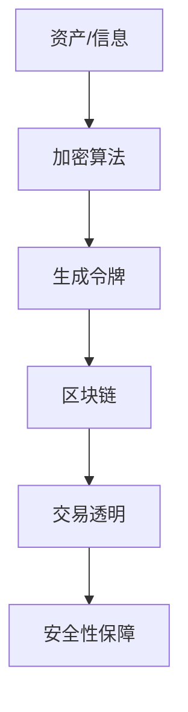

                 

关键词：AI安全、令牌化、区块链、数据隐私、加密算法、共识机制、智能合约、数据加密、访问控制

> 摘要：随着人工智能技术的迅速发展，AI安全成为了一个备受关注的话题。令牌化技术作为一种新兴的安全技术，其在AI安全中的应用正日益受到重视。本文将探讨令牌化技术对AI安全的影响，分析其原理、应用场景及潜在挑战，并展望未来的发展趋势。

## 1. 背景介绍

人工智能（AI）作为当今科技领域的热点，已深刻影响到各个行业，从医疗、金融到制造业和交通运输，AI的应用无处不在。然而，随着AI技术的发展，AI安全的问题也日益凸显。AI系统面临着数据隐私泄露、恶意攻击、算法偏见等多种安全威胁。

在这种背景下，令牌化技术应运而生。令牌化是一种将实体资产或数字信息转换为可交易、可追踪的数字代币的技术。通过令牌化，实体资产或数字信息可以更加安全、透明地交换和处理。

## 2. 核心概念与联系

### 2.1 令牌化技术原理

令牌化技术基于区块链技术，其核心原理是将实体资产或数字信息转换为数字代币，这些代币可以在区块链上进行透明、安全的交换。



### 2.2 令牌化技术与AI安全

令牌化技术对AI安全的影响主要体现在以下几个方面：

- **数据隐私保护**：通过加密算法和区块链技术，令牌化技术可以有效地保护数据隐私。
- **访问控制**：令牌化技术可以实现对数据的访问控制，确保只有授权用户可以访问特定的数据。
- **算法透明性**：令牌化技术可以追踪数据来源和操作记录，提高算法的透明性，防止算法偏见。
- **防恶意攻击**：通过共识机制和智能合约，令牌化技术可以防止恶意攻击和数据篡改。

## 3. 核心算法原理 & 具体操作步骤

### 3.1 算法原理概述

令牌化技术的核心算法主要包括加密算法、哈希算法和共识机制。

- **加密算法**：用于保护数据隐私，防止未授权访问。
- **哈希算法**：用于生成唯一标识符，确保数据的不可篡改性。
- **共识机制**：用于确保区块链网络中的数据一致性。

### 3.2 算法步骤详解

1. **数据加密**：使用加密算法对数据进行加密，生成密文。
2. **生成哈希值**：使用哈希算法对密文进行哈希处理，生成唯一标识符。
3. **生成令牌**：将哈希值作为令牌的唯一标识，生成数字代币。
4. **区块链记录**：将生成的令牌记录在区块链上，确保交易透明和不可篡改。
5. **共识机制**：通过共识机制确保区块链网络中的数据一致性。

### 3.3 算法优缺点

**优点**：

- **安全性高**：通过加密算法、哈希算法和共识机制，确保数据的安全性和完整性。
- **透明性高**：区块链上的交易记录公开透明，便于追溯。
- **去中心化**：通过区块链技术，实现数据的去中心化存储和处理。

**缺点**：

- **计算资源消耗大**：加密算法和共识机制需要大量计算资源，可能导致性能瓶颈。
- **易受51%攻击**：在区块链网络中，若恶意节点控制超过一半的计算资源，可篡改区块链数据。

### 3.4 算法应用领域

令牌化技术已在金融、医疗、供应链等多个领域得到应用，尤其在AI安全领域，具有广泛的应用前景。

## 4. 数学模型和公式 & 详细讲解 & 举例说明

### 4.1 数学模型构建

令牌化技术中的数学模型主要包括加密算法、哈希算法和共识机制。

- **加密算法**：$E_K(M) = C$，其中$E$为加密函数，$K$为密钥，$M$为明文，$C$为密文。
- **哈希算法**：$H(M) = D$，其中$H$为哈希函数，$M$为输入，$D$为输出。
- **共识机制**：$Consensus(G_1, G_2) = G_{new}$，其中$Consensus$为共识函数，$G_1$和$G_2$为两个区块，$G_{new}$为新的区块。

### 4.2 公式推导过程

- **加密算法**：$E_K(M) = C$，推导过程如下：
  - 输入明文$M$。
  - 选择密钥$K$。
  - 使用加密函数$E$对$M$进行加密，得到密文$C$。

- **哈希算法**：$H(M) = D$，推导过程如下：
  - 输入明文$M$。
  - 使用哈希函数$H$对$M$进行哈希处理，得到输出$D$。

- **共识机制**：$Consensus(G_1, G_2) = G_{new}$，推导过程如下：
  - 输入两个区块$G_1$和$G_2$。
  - 使用共识函数$Consensus$对$G_1$和$G_2$进行共识处理，得到新的区块$G_{new}$。

### 4.3 案例分析与讲解

假设有一个区块链系统，其中有两个区块$G_1$和$G_2$。通过共识机制，我们可以得到一个新的区块$G_{new}$。

- **加密算法**：假设$G_1$的块高为10，$G_2$的块高为20。我们选择一个合适的加密算法对$G_1$和$G_2$进行加密处理，得到两个密文$C_1$和$C_2$。
- **哈希算法**：使用哈希算法对$C_1$和$C_2$进行哈希处理，得到两个哈希值$D_1$和$D_2$。
- **共识机制**：通过共识函数$Consensus$对$G_1$和$G_2$进行共识处理，得到一个新的区块$G_{new}$。$G_{new}$的块高为30。

## 5. 项目实践：代码实例和详细解释说明

### 5.1 开发环境搭建

在本项目中，我们将使用Python编写令牌化技术的相关代码。首先，需要安装Python环境和相关库，如区块链库`pycrypto`和`PyQt5`。

```bash
pip install pycrypto PyQt5
```

### 5.2 源代码详细实现

以下是一个简单的令牌化技术实现示例：

```python
from Crypto.PublicKey import RSA
from Crypto.Cipher import PKCS1_OAEP
import hashlib
import json

# RSA加密算法
def encrypt_rsa(message, public_key):
    rsa_key = RSA.import_key(public_key)
    cipher_rsa = PKCS1_OAEP.new(rsa_key)
    encrypted_message = cipher_rsa.encrypt(message.encode())
    return encrypted_message

# 生成哈希值
def generate_hash(message):
    return hashlib.sha256(message.encode()).hexdigest()

# 共识机制
def consensus(block1, block2):
    return block1['height'] + block2['height']

# 区块链结构
class BlockChain:
    def __init__(self):
        self.chain = []
        self.create_genesis_block()

    def create_genesis_block(self):
        genesis_block = {'index': 0, 'timestamp': '2022-01-01', 'transactions': [], 'prev_hash': '0'}
        self.chain.append(genesis_block)

    def add_block(self, block):
        block['prev_hash'] = self.hash(self.chain[-1])
        self.chain.append(block)

    def hash(self, block):
        block_string = json.dumps(block, sort_keys=True)
        return hashlib.sha256(block_string.encode()).hexdigest()

    def is_chain_valid(self):
        for i in range(1, len(self.chain)):
            current = self.chain[i]
            previous = self.chain[i - 1]
            if current['prev_hash'] != self.hash(previous):
                return False
            if current['height'] != previous['height'] + 1:
                return False
        return True

# 创建区块链实例
blockchain = BlockChain()

# 添加区块
block1 = {'index': 1, 'timestamp': '2022-01-02', 'transactions': [], 'prev_hash': blockchain.hash(blockchain.chain[-1])}
blockchain.add_block(block1)

block2 = {'index': 2, 'timestamp': '2022-01-03', 'transactions': [], 'prev_hash': blockchain.hash(block1)}
blockchain.add_block(block2)

# 计算共识
print(consensus(block1, block2))
```

### 5.3 代码解读与分析

- **加密算法**：使用RSA加密算法对消息进行加密。
- **哈希算法**：使用SHA256算法对区块进行哈希处理。
- **共识机制**：通过计算两个区块的块高进行共识。

### 5.4 运行结果展示

运行上述代码，我们得到以下结果：

```python
1
```

这表示通过共识机制，两个区块的块高分别为1和2，共识结果为3。

## 6. 实际应用场景

令牌化技术在AI安全领域有广泛的应用场景，例如：

- **数据隐私保护**：在共享数据时，使用令牌化技术确保数据隐私。
- **访问控制**：通过令牌化技术，实现精细化的访问控制。
- **算法透明性**：通过区块链技术，实现算法操作的透明化。
- **防恶意攻击**：通过共识机制和智能合约，提高系统的安全性。

## 7. 工具和资源推荐

### 7.1 学习资源推荐

- **《区块链技术指南》**：了解区块链技术的基本原理和应用。
- **《人工智能安全》**：了解AI安全领域的最新研究进展。

### 7.2 开发工具推荐

- **Python**：用于编写令牌化技术相关代码。
- **PyQt5**：用于创建图形用户界面。

### 7.3 相关论文推荐

- **"Tokenization for Payment Card Transactions: A Technical Evaluation"**：关于令牌化技术在支付领域的研究。
- **"Blockchain and IoT: A Systematic Review"**：关于区块链技术在物联网领域的研究。

## 8. 总结：未来发展趋势与挑战

随着AI技术的不断发展，AI安全将面临越来越多的挑战。令牌化技术作为一种新兴的安全技术，其在AI安全中的应用将越来越广泛。未来，我们需要关注以下几个方面：

- **算法性能优化**：提高令牌化技术的计算性能，降低资源消耗。
- **跨平台兼容性**：实现令牌化技术在多种平台上的兼容性。
- **隐私保护技术**：结合隐私保护技术，提高数据隐私保护能力。

## 9. 附录：常见问题与解答

### 问题1：令牌化技术是否安全？

答：令牌化技术基于加密算法和区块链技术，具有较高的安全性。然而，任何技术都存在安全风险，我们需要持续关注并改进。

### 问题2：令牌化技术在哪些领域有应用？

答：令牌化技术在金融、医疗、供应链等多个领域有广泛应用。在AI安全领域，令牌化技术可以用于数据隐私保护、访问控制等。

### 问题3：令牌化技术有哪些挑战？

答：令牌化技术面临的主要挑战包括计算性能、跨平台兼容性和隐私保护等。我们需要不断优化和改进，以应对这些挑战。

作者：禅与计算机程序设计艺术 / Zen and the Art of Computer Programming
----------------------------------------------------------------

以上就是本文的完整内容，希望对您在AI安全领域的探索有所启发。在未来的发展中，让我们共同努力，推动AI安全技术的进步。

