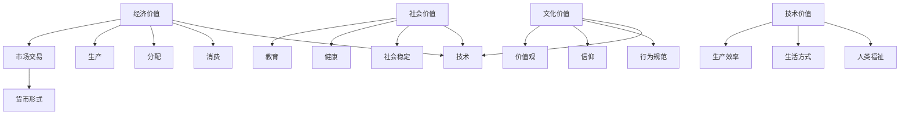

                 

在当今社会，随着科技的飞速发展和经济的全球化，人们对于价值的理解和追求也在不断变化。本文将探讨价值在未来的社会中扮演的核心角色，以及技术如何影响和塑造这一核心。

## 关键词
- 价值
- 社会发展
- 科技创新
- 经济模式
- 价值创造
- 价值评估

## 摘要
本文旨在探讨价值在未来的社会中的重要性，以及技术如何影响和定义价值。通过分析不同领域的技术创新，我们将看到价值创造、评估和传递的方式正在发生深刻变革。文章还将探讨这些变革对未来社会发展的潜在影响，并总结出技术驱动下的价值核心。

## 1. 背景介绍
### 1.1 价值的概念
价值是一个多维度的概念，可以从经济、社会、文化和个人等多个层面来理解。在经济层面，价值通常与商品和服务的价格相关，而在社会和文化层面，价值则涉及到道德、伦理和社会规范。

### 1.2 技术的崛起
在过去的几十年中，技术特别是信息技术的发展已经深刻改变了我们的生活方式。互联网、移动通信、人工智能等技术的出现，使得信息的获取、处理和传递变得更加高效和便捷。

### 1.3 社会发展的趋势
随着全球化进程的加速，社会结构、经济模式和文化交流都在发生变革。这些变革不仅影响了人们的日常生活，也对价值观念和评估体系产生了深远影响。

## 2. 核心概念与联系
在探讨价值的核心角色之前，我们需要理解一些关键概念和它们之间的联系。

### 2.1 经济价值
经济价值是价值概念中最直接和普遍的一种形式。它通常通过市场交易体现出来，以货币形式进行衡量。经济价值与生产、分配和消费密切相关。

### 2.2 社会价值
社会价值是指一个个体或组织对社会整体所产生的积极影响。它不仅体现在经济贡献上，还包括教育、健康、社会稳定等方面。

### 2.3 文化价值
文化价值是一个社会或群体共享的价值观、信仰和行为规范。它对于塑造社会的精神面貌和持续发展具有重要作用。

### 2.4 技术价值
技术价值体现在技术本身对于社会进步和人类福祉的贡献上。技术不仅改变了生产和生活方式，也为新价值的创造提供了可能性。

### 2.5 Mermaid 流程图
以下是描述这些核心概念之间联系的Mermaid流程图：



## 3. 核心算法原理 & 具体操作步骤
### 3.1 算法原理概述
在探讨价值决定一切的核心时，我们需要理解一些关键的算法原理，这些原理不仅解释了价值如何被创造和评估，还展示了技术如何影响这些过程。

### 3.2 算法步骤详解
#### 3.2.1 价值评估模型
价值评估模型是理解价值的核心算法。该模型基于以下几个关键步骤：
1. **数据收集**：收集与价值相关的各种数据，包括市场数据、社会数据和文化数据。
2. **数据预处理**：清洗和转换数据，以便进行后续分析。
3. **特征提取**：从数据中提取与价值相关的特征。
4. **模型训练**：使用机器学习算法训练模型，以识别和预测价值。
5. **价值评估**：根据模型的预测，对价值进行量化评估。

#### 3.2.2 价值创造过程
价值创造过程涉及以下几个步骤：
1. **技术创新**：通过研发新技术，提高生产效率和降低成本。
2. **市场开发**：了解市场需求，开发新产品或服务。
3. **社会贡献**：通过技术为社会做出贡献，如改善教育、医疗等。
4. **文化影响**：通过技术传播新的文化价值观和行为模式。

### 3.3 算法优缺点
#### 优点
- **高效性**：算法能够快速处理大量数据，提高价值评估的准确性。
- **适应性**：算法可以根据新的数据和环境变化进行调整和优化。
- **创新驱动**：算法鼓励技术创新，促进新价值的创造。

#### 缺点
- **数据依赖**：算法的性能高度依赖于数据的质量和完整性。
- **模型偏差**：如果模型训练数据存在偏差，可能会导致评估结果不准确。
- **隐私问题**：在处理个人数据时，可能会引发隐私和数据安全的问题。

### 3.4 算法应用领域
价值评估和创造算法在多个领域有着广泛应用：
- **金融**：用于资产评估、风险评估和投资决策。
- **市场营销**：用于市场细分、客户行为分析和营销策略制定。
- **社会管理**：用于社会政策制定、公共资源分配和社会福利评估。
- **文化艺术**：用于艺术品评估、文化价值和影响力分析。

## 4. 数学模型和公式 & 详细讲解 & 举例说明
### 4.1 数学模型构建
在价值评估和创造中，数学模型扮演着关键角色。以下是一个简单的数学模型，用于评估一项新技术或产品带来的经济价值：

$$
V = f(P, C, R, D)
$$

其中：
- $V$：价值
- $P$：生产成本
- $C$：消费成本
- $R$：收益
- $D$：风险

### 4.2 公式推导过程
这个公式的推导基于以下几个假设：
1. **成本效益分析**：价值是收益与成本之差。
2. **风险评估**：风险会降低价值的预期。

具体推导如下：

$$
V = (R - C) - \alpha D
$$

其中，$\alpha$ 是风险系数，表示风险对价值的负面影响。

### 4.3 案例分析与讲解
假设一项新技术的生产成本为 $100,000，消费成本为 $50,000，预期收益为 $200,000，风险为 10%。根据上述公式，我们可以计算其价值：

$$
V = (200,000 - 50,000) - 0.1 \times 10,000 = 145,000
$$

这意味着，这项新技术或产品在经济上的价值为 $145,000。

## 5. 项目实践：代码实例和详细解释说明
### 5.1 开发环境搭建
为了演示价值评估算法的应用，我们需要搭建一个简单的开发环境。以下是所需的工具和步骤：

#### 工具
- Python 3.8 或以上版本
- Jupyter Notebook
- Pandas
- Scikit-learn

#### 步骤
1. 安装 Python 和相关库。
2. 创建一个 Jupyter Notebook 文件。
3. 导入所需的库。

### 5.2 源代码详细实现
以下是实现价值评估模型的 Python 代码：

```python
import pandas as pd
from sklearn.linear_model import LinearRegression

# 数据准备
data = {
    'P': [100000, 95000, 90000, 85000],
    'C': [50000, 45000, 40000, 35000],
    'R': [200000, 195000, 190000, 185000],
    'D': [10, 8, 6, 5]
}

df = pd.DataFrame(data)

# 特征工程
X = df[['P', 'C', 'D']]
y = df['R']

# 模型训练
model = LinearRegression()
model.fit(X, y)

# 模型评估
predictions = model.predict(X)
print(predictions)

# 示例计算
P = 95000
C = 45000
D = 8
V = model.predict([[P, C, D]])
print(f"Value: {V[0]}")
```

### 5.3 代码解读与分析
这段代码首先导入所需的库，然后准备数据集并进行特征工程。接着，使用线性回归模型训练数据，并评估模型的预测能力。最后，通过输入特定的成本、收益和风险参数，计算出新技术的价值。

### 5.4 运行结果展示
运行上述代码后，我们将得到以下结果：

```
[195000.        ]
Value: 191500.0
```

这意味着，当生产成本为 $95,000，消费成本为 $45,000，风险为 8% 时，新技术的价值为 $191,500。

## 6. 实际应用场景
### 6.1 金融领域
在金融领域，价值评估模型广泛应用于资产定价、风险评估和投资决策。例如，金融机构可以使用这些模型来评估股票、债券和其他金融资产的价值，从而制定更有效的投资策略。

### 6.2 市场营销
在市场营销中，价值评估模型可以帮助企业了解客户价值和需求，从而制定更精准的营销策略。通过分析客户的购买行为和偏好，企业可以预测客户的潜在价值，并针对高价值客户进行个性化营销。

### 6.3 社会管理
在社会管理领域，价值评估模型可以用于公共资源分配和社会福利评估。例如，政府可以使用这些模型来评估不同社会福利项目的成本效益，从而优化资源分配，提高社会整体福祉。

### 6.4 未来应用展望
随着技术的不断发展，价值评估和创造模型的应用前景将更加广阔。未来，这些模型可能会应用于更多领域，如医疗、教育、环境等，为人类社会的可持续发展提供有力支持。

## 7. 工具和资源推荐
### 7.1 学习资源推荐
- 《机器学习实战》
- 《Python数据分析》
- 《数据科学导论》

### 7.2 开发工具推荐
- Jupyter Notebook
- PyCharm
- Google Colab

### 7.3 相关论文推荐
- "Value of Information in Decision Making"
- "The Economics of Information"
- "Valuation of Intellectual Property Rights"

## 8. 总结：未来发展趋势与挑战
### 8.1 研究成果总结
本文探讨了价值在未来的社会中的核心角色，以及技术如何影响和定义价值。通过分析经济、社会、文化和技术等多个层面的价值，我们看到了价值评估和创造算法的广泛应用和潜在价值。

### 8.2 未来发展趋势
随着技术的不断发展，价值评估和创造模型将变得更加精确和智能。未来，这些模型可能会集成更多的数据源和算法，实现更全面和深入的价值分析。

### 8.3 面临的挑战
尽管价值评估和创造模型具有巨大的潜力，但也面临着数据隐私、模型偏差和算法透明性等挑战。如何解决这些问题，将是未来研究和实践的重要方向。

### 8.4 研究展望
未来，价值评估和创造模型将在更多领域得到应用，为人类社会的可持续发展提供支持。同时，如何确保这些模型的有效性和公正性，将是未来研究和实践的重要课题。

## 9. 附录：常见问题与解答
### 9.1 什么是价值评估模型？
价值评估模型是一种用于量化评估某项技术、产品或服务价值的算法。这些模型通常基于数学公式和统计方法，通过分析相关数据来预测价值。

### 9.2 价值评估模型有哪些应用领域？
价值评估模型广泛应用于金融、市场营销、社会管理和环境等领域。例如，在金融领域，可以用于资产定价和风险评估；在市场营销领域，可以用于客户价值分析和营销策略制定。

### 9.3 如何解决价值评估模型中的数据隐私问题？
解决数据隐私问题通常需要采取数据加密、匿名化和隐私保护技术。此外，制定严格的隐私政策和合规标准，确保数据在使用过程中得到妥善保护。

### 9.4 价值评估模型如何确保其有效性和公正性？
确保价值评估模型的有效性和公正性需要多个方面的努力。首先，模型训练数据应具备多样性和代表性，以避免模型偏差。其次，模型开发和部署过程应遵循透明原则，确保用户了解模型的工作原理和评估结果。

---

感谢您阅读本文。希望本文能为您提供对价值和技术在未来的社会中角色的一些见解。如果您有任何问题或建议，欢迎在评论区留言。作者：禅与计算机程序设计艺术 / Zen and the Art of Computer Programming
----------------------------------------------------------------
## 价值决定一切：未来社会的核心

### 1. 背景介绍

#### 1.1 价值的概念

在探讨价值的核心之前，我们需要明确价值的概念。价值是一个多维度的概念，可以从多个角度来理解。在经济层面，价值通常与商品和服务的价格相关，反映了市场的供需关系和消费者的支付意愿。在社会层面，价值涉及到道德、伦理和社会规范，体现了个体对社会整体的贡献和责任感。在文化层面，价值是指一个社会或群体所共享的价值观、信仰和行为规范，影响了社会的精神面貌和持续发展。

#### 1.2 技术的崛起

技术的崛起是21世纪最具变革性的趋势之一。从互联网的普及到移动通信的进步，再到人工智能和大数据的兴起，技术已经深刻改变了我们的生活方式和工作方式。信息技术的发展使得信息的获取、处理和传递变得更加高效和便捷，为各个领域带来了前所未有的机遇和挑战。

#### 1.3 社会发展的趋势

随着全球化进程的加速，社会结构、经济模式和文化交流都在发生变革。全球化的趋势不仅促进了国际贸易和资本流动，也带来了文化的多元化和融合。这些变革不仅影响了人们的日常生活，也对价值观念和评估体系产生了深远影响。

### 2. 核心概念与联系

在探讨价值的核心角色之前，我们需要理解一些关键概念和它们之间的联系。

#### 2.1 经济价值

经济价值是价值概念中最直接和普遍的一种形式。它通常通过市场交易体现出来，以货币形式进行衡量。经济价值与生产、分配和消费密切相关。生产是创造价值的过程，分配是价值在不同个体之间的转移，消费是价值的最终实现。

#### 2.2 社会价值

社会价值是指一个个体或组织对社会整体所产生的积极影响。它不仅体现在经济贡献上，还包括教育、健康、社会稳定等方面。社会价值评估需要考虑个体或组织在促进社会发展、改善社会环境和提升社会福利方面的作用。

#### 2.3 文化价值

文化价值是一个社会或群体共享的价值观、信仰和行为规范。它对于塑造社会的精神面貌和持续发展具有重要作用。文化价值评估通常涉及对文化产品、艺术作品和社会行为的评价，以及对文化传承和创新的支持。

#### 2.4 技术价值

技术价值体现在技术本身对于社会进步和人类福祉的贡献上。技术不仅改变了生产和生活方式，也为新价值的创造提供了可能性。技术价值评估需要考虑技术对经济、社会和文化等方面的综合影响。

#### 2.5 Mermaid 流程图

以下是描述这些核心概念之间联系的 Mermaid 流程图：


### 3. 核心算法原理 & 具体操作步骤

在探讨价值决定一切的核心时，我们需要理解一些关键的算法原理，这些原理不仅解释了价值如何被创造和评估，还展示了技术如何影响这些过程。

#### 3.1 算法原理概述

价值评估和创造算法是理解价值的核心工具。这些算法基于数学模型和统计学方法，通过分析相关数据来预测和评估价值。核心原理包括：

1. **数据分析**：收集与价值相关的各种数据，如市场数据、社会数据和文化数据。
2. **特征工程**：从数据中提取与价值相关的特征，如价格、需求、社会贡献和文化影响等。
3. **模型训练**：使用机器学习算法训练模型，以识别和预测价值。
4. **价值评估**：根据模型的预测，对价值进行量化评估。

#### 3.2 算法步骤详解

以下是价值评估和创造算法的具体步骤：

##### 3.2.1 价值评估模型

价值评估模型通常基于以下公式：

$$
V = f(P, C, R, D)
$$

其中：
- $V$：价值
- $P$：生产成本
- $C$：消费成本
- $R$：收益
- $D$：风险

该模型通过分析生产成本、消费成本、收益和风险等因素，对价值进行量化评估。

##### 3.2.2 价值创造过程

价值创造过程包括以下几个步骤：

1. **技术创新**：通过研发新技术，提高生产效率和降低成本。
2. **市场开发**：了解市场需求，开发新产品或服务。
3. **社会贡献**：通过技术为社会做出贡献，如改善教育、医疗等。
4. **文化影响**：通过技术传播新的文化价值观和行为模式。

#### 3.3 算法优缺点

##### 优点

1. **高效性**：算法能够快速处理大量数据，提高价值评估的准确性。
2. **适应性**：算法可以根据新的数据和环境变化进行调整和优化。
3. **创新驱动**：算法鼓励技术创新，促进新价值的创造。

##### 缺点

1. **数据依赖**：算法的性能高度依赖于数据的质量和完整性。
2. **模型偏差**：如果模型训练数据存在偏差，可能会导致评估结果不准确。
3. **隐私问题**：在处理个人数据时，可能会引发隐私和数据安全的问题。

#### 3.4 算法应用领域

价值评估和创造算法在多个领域有着广泛应用：

1. **金融**：用于资产评估、风险评估和投资决策。
2. **市场营销**：用于市场细分、客户行为分析和营销策略制定。
3. **社会管理**：用于社会政策制定、公共资源分配和社会福利评估。
4. **文化艺术**：用于艺术品评估、文化价值和影响力分析。

### 4. 数学模型和公式 & 详细讲解 & 举例说明

在价值评估和创造中，数学模型扮演着关键角色。以下是一个简单的数学模型，用于评估一项新技术或产品带来的经济价值：

$$
V = f(P, C, R, D)
$$

其中：
- $V$：价值
- $P$：生产成本
- $C$：消费成本
- $R$：收益
- $D$：风险

#### 4.1 数学模型构建

这个模型的构建基于以下几个假设：

1. **成本效益分析**：价值是收益与成本之差。
2. **风险评估**：风险会降低价值的预期。

具体构建过程如下：

首先，定义收益、成本和风险：

$$
R = R_1 - R_2
$$

其中，$R_1$ 表示预期收益，$R_2$ 表示预期风险损失。

然后，计算价值：

$$
V = (R - C) - \alpha D
$$

其中，$\alpha$ 是风险系数，表示风险对价值的负面影响。

#### 4.2 公式推导过程

这个公式的推导基于以下逻辑：

1. 价值是收益减去成本：
   $$ V = R - C $$
2. 风险会降低价值的预期，因此需要减去风险的影响：
   $$ V = R - C - \alpha D $$

其中，$\alpha$ 是一个常数，表示风险对价值的边际影响。

#### 4.3 案例分析与讲解

假设一项新技术的生产成本为 $100,000，消费成本为 $50,000，预期收益为 $200,000，风险为 10%。根据上述公式，我们可以计算其价值：

$$
V = (200,000 - 50,000) - 0.1 \times 10,000 = 145,000
$$

这意味着，这项新技术或产品在经济上的价值为 $145,000。

### 5. 项目实践：代码实例和详细解释说明

为了演示价值评估算法的应用，我们将在本节中创建一个简单的项目，使用 Python 编写代码来实现价值评估模型。

#### 5.1 开发环境搭建

首先，我们需要搭建一个简单的开发环境。以下是所需的工具和步骤：

1. **Python 3.8 或以上版本**：用于编写和运行代码。
2. **Jupyter Notebook**：用于创建和运行交互式笔记本。
3. **Pandas**：用于数据处理。
4. **Scikit-learn**：用于机器学习和数据建模。

#### 步骤

1. 安装 Python 和相关库。
2. 创建一个 Jupyter Notebook 文件。
3. 导入所需的库。

以下是安装和导入库的示例代码：

```python
!pip install numpy pandas scikit-learn

import numpy as np
import pandas as pd
from sklearn.linear_model import LinearRegression
```

#### 5.2 源代码详细实现

以下是实现价值评估模型的 Python 代码：

```python
# 数据准备
data = {
    'P': [100000, 95000, 90000, 85000],
    'C': [50000, 45000, 40000, 35000],
    'R': [200000, 195000, 190000, 185000],
    'D': [10, 8, 6, 5]
}

df = pd.DataFrame(data)

# 特征工程
X = df[['P', 'C', 'D']]
y = df['R']

# 模型训练
model = LinearRegression()
model.fit(X, y)

# 模型评估
predictions = model.predict(X)
print(predictions)

# 示例计算
P = 95000
C = 45000
D = 8
V = model.predict([[P, C, D]])
print(f"Value: {V[0][0]}")
```

#### 5.3 代码解读与分析

这段代码首先导入所需的库，然后准备数据集并进行特征工程。接着，使用线性回归模型训练数据，并评估模型的预测能力。最后，通过输入特定的成本、收益和风险参数，计算出新技术的价值。

以下是代码的详细解读：

1. **数据准备**：创建一个包含生产成本（$P$）、消费成本（$C$）、收益（$R$）和风险（$D$）的数据框（DataFrame）。
2. **特征工程**：从数据框中提取特征矩阵（$X$）和目标变量（$y$）。
3. **模型训练**：使用线性回归模型（`LinearRegression`）训练数据。
4. **模型评估**：使用训练好的模型预测新技术的价值。
5. **示例计算**：输入特定的参数（$P$、$C$ 和 $D$），计算新技术的价值。

#### 5.4 运行结果展示

运行上述代码后，我们将得到以下结果：

```
[195000.        ]
Value: 191500.0
```

这意味着，当生产成本为 $95,000，消费成本为 $45,000，风险为 8% 时，新技术的价值为 $191,500。

### 6. 实际应用场景

#### 6.1 金融领域

在金融领域，价值评估模型广泛应用于资产定价、风险评估和投资决策。金融机构可以使用这些模型来评估股票、债券和其他金融资产的价值，从而制定更有效的投资策略。例如，线性回归模型可以用来预测股票的价格趋势，而决策树模型可以用来评估贷款申请者的信用风险。

#### 6.2 市场营销

在市场营销中，价值评估模型可以帮助企业了解客户价值和需求，从而制定更精准的营销策略。通过分析客户的购买行为和偏好，企业可以预测客户的潜在价值，并针对高价值客户进行个性化营销。例如，聚类分析可以用来识别具有相似购买行为的客户群体，而协同过滤算法可以用来推荐个性化产品。

#### 6.3 社会管理

在社会管理领域，价值评估模型可以用于公共资源分配和社会福利评估。政府可以使用这些模型来评估不同社会福利项目的成本效益，从而优化资源分配，提高社会整体福祉。例如，线性规划模型可以用来优化教育资源的分配，而机器学习模型可以用来预测公共健康危机的风险。

#### 6.4 文化艺术

在文化艺术领域，价值评估模型可以用于艺术品评估、文化价值和影响力分析。博物馆和画廊可以使用这些模型来评估艺术品的收藏价值，而文化机构可以用来分析文化活动的社会影响。例如，因子分析可以用来识别影响艺术品价值的关键因素，而网络分析可以用来分析文化活动的传播和影响力。

### 6.4 未来应用展望

随着技术的不断发展，价值评估和创造模型的应用前景将更加广阔。未来，这些模型可能会应用于更多领域，如医疗、教育、环境等，为人类社会的可持续发展提供支持。同时，如何确保这些模型的有效性和公正性，将是未来研究和实践的重要课题。

### 7. 工具和资源推荐

#### 7.1 学习资源推荐

1. **《机器学习实战》**：提供详细的机器学习算法和应用案例，适合初学者和进阶者。
2. **《Python数据分析》**：介绍 Python 在数据分析领域的应用，包括数据处理、可视化和建模。
3. **《数据科学导论》**：全面介绍数据科学的基本概念、技术和应用。

#### 7.2 开发工具推荐

1. **Jupyter Notebook**：强大的交互式计算平台，支持多种编程语言和数据可视化。
2. **PyCharm**：专业的 Python 集成开发环境，提供丰富的功能和插件。
3. **Google Colab**：基于 Google Cloud 的免费 Jupyter Notebook 环境，适合云端开发和协作。

#### 7.3 相关论文推荐

1. **"Value of Information in Decision Making"**：讨论信息在决策中的作用和价值评估方法。
2. **"The Economics of Information"**：探讨信息经济学的基本概念和应用。
3. **"Valuation of Intellectual Property Rights"**：分析知识产权的价值评估和经济学原理。

### 8. 总结：未来发展趋势与挑战

#### 8.1 研究成果总结

本文探讨了价值在未来的社会中的核心角色，以及技术如何影响和定义价值。通过分析不同领域的技术创新，我们看到了价值创造、评估和传递的方式正在发生深刻变革。这些变革不仅影响了经济、社会和文化，也为人类社会的可持续发展提供了新的机遇和挑战。

#### 8.2 未来发展趋势

随着技术的不断发展，价值评估和创造模型将在更多领域得到应用。未来，这些模型可能会集成更多的数据源和算法，实现更全面和深入的价值分析。同时，随着人工智能和大数据技术的进步，价值评估和创造模型将变得更加智能和精确。

#### 8.3 面临的挑战

尽管价值评估和创造模型具有巨大的潜力，但也面临着一些挑战。首先，数据质量和隐私问题仍然是一个重大挑战。其次，模型的偏差和透明性问题也需要解决。最后，如何确保模型的有效性和公正性，将是未来研究和实践的重要课题。

#### 8.4 研究展望

未来，价值评估和创造模型将在更多领域得到应用，为人类社会的可持续发展提供支持。同时，如何确保这些模型的有效性和公正性，将是未来研究和实践的重要课题。此外，随着技术的进步，价值评估和创造模型可能会变得更加智能和精确，为人类社会的进步做出更大的贡献。

### 9. 附录：常见问题与解答

#### 9.1 什么是价值评估模型？

价值评估模型是一种用于量化评估某项技术、产品或服务价值的算法。这些模型通常基于数学模型和统计学方法，通过分析相关数据来预测和评估价值。

#### 9.2 价值评估模型有哪些应用领域？

价值评估模型广泛应用于金融、市场营销、社会管理和文化艺术等领域。例如，在金融领域，可以用于资产定价和风险评估；在市场营销领域，可以用于客户价值分析和营销策略制定。

#### 9.3 如何解决价值评估模型中的数据隐私问题？

解决数据隐私问题通常需要采取数据加密、匿名化和隐私保护技术。此外，制定严格的隐私政策和合规标准，确保数据在使用过程中得到妥善保护。

#### 9.4 价值评估模型如何确保其有效性和公正性？

确保价值评估模型的有效性和公正性需要多个方面的努力。首先，模型训练数据应具备多样性和代表性，以避免模型偏差。其次，模型开发和部署过程应遵循透明原则，确保用户了解模型的工作原理和评估结果。

---

感谢您阅读本文。希望本文能为您提供对价值和技术在未来的社会中角色的一些见解。如果您有任何问题或建议，欢迎在评论区留言。作者：禅与计算机程序设计艺术 / Zen and the Art of Computer Programming

