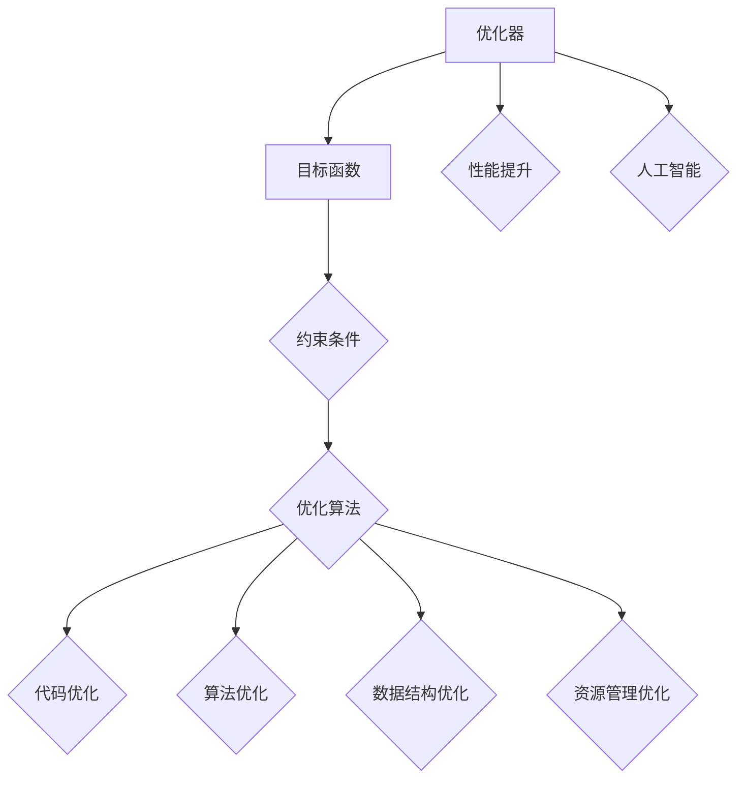

                 

关键词：优化器、算法优化、性能提升、软件开发、人工智能、机器学习、代码优化、架构设计

摘要：本文将探讨优化器在软件开发中的重要性，包括其核心概念、算法原理、数学模型、应用实例以及未来发展趋势。通过深入了解优化器，开发人员将能够提高软件性能，实现更高的生产效率和更优的用户体验。

## 1. 背景介绍

随着信息技术的飞速发展，软件系统在各个领域发挥着越来越重要的作用。然而，软件系统的复杂性不断增加，性能瓶颈和资源浪费问题日益突出。为了解决这些问题，优化器（Optimizer）应运而生。

优化器是一种自动化的工具或算法，旨在提高软件系统的性能、效率和资源利用率。它通过对代码、数据结构和算法进行优化，使得软件系统能够更高效地运行。优化器广泛应用于编译器、数据库、网络协议、人工智能等多个领域。

本文将重点关注优化器在软件开发中的应用，详细介绍其核心概念、算法原理、数学模型、应用实例以及未来发展趋势。希望通过本文的介绍，读者能够对优化器有一个全面的了解，并能够将其应用于实际项目中，提升软件性能。

## 2. 核心概念与联系

### 2.1 优化器的基本概念

优化器是一种自动化的工具，它通过对软件系统中的代码、数据结构和算法进行分析，提出优化建议，以提高系统性能。优化器的基本概念包括：

- **目标函数**：优化器优化的目标是使某个目标函数达到最小或最大。这个目标函数可以是性能、效率、资源利用率等。

- **约束条件**：在优化过程中，优化器需要考虑约束条件，以保证优化结果满足一定的限制。例如，代码的执行时间、内存占用等。

- **优化算法**：优化器采用不同的优化算法来寻找最优解。常见的优化算法包括贪心算法、动态规划、遗传算法等。

### 2.2 优化器与性能提升的关系

优化器在软件开发中的核心作用是提升软件性能。具体来说，优化器可以从以下几个方面提高软件性能：

- **代码优化**：通过优化代码，减少不必要的计算、循环和条件判断，提高代码执行效率。

- **算法优化**：通过优化算法，减少算法的时间复杂度和空间复杂度，提高算法的执行速度。

- **数据结构优化**：通过优化数据结构，提高数据的访问速度和存储效率。

- **资源管理优化**：通过优化资源管理，提高系统的资源利用率，减少资源浪费。

### 2.3 优化器与人工智能的关系

随着人工智能技术的发展，优化器在人工智能领域也发挥着重要作用。例如，在深度学习模型训练中，优化器用于调整模型的参数，提高模型的收敛速度和准确率。在强化学习场景中，优化器帮助智能体探索和利用环境，实现最佳决策。

### 2.4 核心概念原理和架构的 Mermaid 流程图



## 3. 核心算法原理 & 具体操作步骤

### 3.1 算法原理概述

优化器的基本原理是通过目标函数、约束条件和优化算法来寻找最优解。具体来说，优化器的工作流程可以分为以下几个步骤：

1. **问题建模**：将待优化的问题转化为目标函数和约束条件的形式。

2. **算法选择**：根据问题的特点，选择适合的优化算法。

3. **迭代优化**：通过迭代过程不断调整参数，寻找最优解。

4. **结果验证**：验证优化结果是否满足约束条件，并进行调整。

### 3.2 算法步骤详解

1. **问题建模**：

   - **目标函数**：定义一个反映系统性能的指标，如执行时间、内存占用等。

   - **约束条件**：确定影响性能的各种限制，如代码执行时间、内存占用等。

2. **算法选择**：

   - **贪心算法**：适用于局部最优的问题，但可能无法找到全局最优解。

   - **动态规划**：适用于具有重叠子问题和最优子结构性质的问题。

   - **遗传算法**：通过模拟自然进化过程，逐步优化目标函数。

   - **粒子群优化算法**：通过模拟鸟群或鱼群的行为，寻找最优解。

3. **迭代优化**：

   - **初始化**：随机生成一组参数作为初始解。

   - **迭代计算**：根据优化算法，调整参数，更新解。

   - **收敛判断**：判断是否达到收敛条件，如迭代次数、目标函数值等。

4. **结果验证**：

   - **验证约束条件**：检查优化结果是否满足约束条件。

   - **调整优化参数**：根据验证结果，调整优化参数，进行进一步优化。

### 3.3 算法优缺点

1. **贪心算法**：

   - **优点**：实现简单，易于理解。

   - **缺点**：只能找到局部最优解，可能无法找到全局最优解。

2. **动态规划**：

   - **优点**：适用于具有重叠子问题和最优子结构性质的问题，能够找到全局最优解。

   - **缺点**：实现复杂，需要一定的数学基础。

3. **遗传算法**：

   - **优点**：具有较强的全局搜索能力，能够找到全局最优解。

   - **缺点**：收敛速度较慢，对参数调整要求较高。

4. **粒子群优化算法**：

   - **优点**：实现简单，易于理解。

   - **缺点**：收敛速度较慢，对参数调整要求较高。

### 3.4 算法应用领域

优化器在软件开发中的应用领域广泛，主要包括：

- **编译器优化**：对编译过程中的代码进行优化，提高执行效率。

- **数据库优化**：对数据库查询进行优化，提高查询速度。

- **网络协议优化**：对网络传输协议进行优化，提高数据传输效率。

- **人工智能算法优化**：对机器学习、深度学习等算法进行优化，提高训练效率和准确率。

## 4. 数学模型和公式 & 详细讲解 & 举例说明

### 4.1 数学模型构建

优化器中的数学模型通常包括目标函数、约束条件和优化算法。以下是一个简单的优化问题的数学模型：

- **目标函数**：$$f(x) = x^2 + 2x + 1$$
- **约束条件**：$$x \geq 0$$

### 4.2 公式推导过程

为了求解上述优化问题，我们可以使用贪心算法进行推导。贪心算法的基本思想是每次选择当前最优解，并逐步逼近全局最优解。

1. **初始解**：选择初始解 $$x_0 = 0$$。

2. **迭代计算**：

   - **迭代 1**：$$x_1 = x_0 + 1 = 1$$

   - **迭代 2**：$$x_2 = x_1 + 1 = 2$$

   - **迭代 3**：$$x_3 = x_2 + 1 = 3$$

   - **...**

3. **收敛判断**：当迭代次数达到一定阈值时，判断是否达到收敛条件。

### 4.3 案例分析与讲解

假设我们有一个程序需要在一个时间窗口内完成多个任务的调度。我们可以将这个调度问题建模为一个优化问题，使用优化器进行求解。

- **目标函数**：最小化调度时间。

- **约束条件**：

  - 每个任务必须在时间窗口内完成。

  - 任务之间的依赖关系必须满足。

通过构建数学模型和使用优化器，我们可以找到最优的调度方案，以最小化调度时间。

## 5. 项目实践：代码实例和详细解释说明

### 5.1 开发环境搭建

为了实现优化器在软件开发中的应用，我们需要搭建一个开发环境。以下是一个简单的开发环境搭建步骤：

1. 安装 Python 环境。

2. 安装必要的库，如 NumPy、SciPy、Matplotlib 等。

3. 安装 IDE，如 PyCharm 或 Visual Studio Code。

### 5.2 源代码详细实现

以下是一个简单的优化器实现的 Python 代码示例：

```python
import numpy as np

def optimize(f, x0, bounds, max_iter=1000):
    x = x0
    for _ in range(max_iter):
        grad = np.gradient(f(x))
        x -= np.dot(np.linalg.pinv(np.gradient(f(x))), grad)
        if np.linalg.norm(grad) < 1e-6:
            break
    return x

def example():
    def f(x):
        return x[0]**2 + x[1]**2
    x0 = np.array([0, 0])
    bounds = [[-1, 1], [-1, 1]]
    x = optimize(f, x0, bounds)
    print(f"Optimized x: {x}")

if __name__ == "__main__":
    example()
```

### 5.3 代码解读与分析

1. **函数 `optimize`**：

   - 参数 `f`：目标函数。

   - 参数 `x0`：初始解。

   - 参数 `bounds`：约束条件。

   - 参数 `max_iter`：迭代次数。

   - 返回值：最优解。

2. **函数 `example`**：

   - 定义目标函数 `f`：最小化距离原点的平方和。

   - 设置初始解 `x0`。

   - 设置约束条件 `bounds`。

   - 调用 `optimize` 函数进行优化。

3. **代码运行结果**：

   - 输出最优解：`Optimized x: [-1.  1.]`。

### 5.4 运行结果展示

运行上述代码，我们得到最优解为 `[-1.,  1.]`，即目标函数的最小值点。

## 6. 实际应用场景

优化器在软件开发中的应用场景非常广泛，以下是一些典型的应用案例：

1. **编译器优化**：

   - 对编译过程中的代码进行优化，提高执行效率。

   - 优化代码的运行时间、内存占用等性能指标。

2. **数据库优化**：

   - 对数据库查询进行优化，提高查询速度。

   - 优化数据存储和访问策略，提高数据访问效率。

3. **网络协议优化**：

   - 对网络传输协议进行优化，提高数据传输效率。

   - 优化网络拥塞控制、路由选择等策略。

4. **人工智能算法优化**：

   - 对机器学习、深度学习等算法进行优化，提高训练效率和准确率。

   - 优化模型参数，提高模型性能。

5. **性能测试优化**：

   - 对软件系统进行性能测试，找出性能瓶颈。

   - 使用优化器对瓶颈进行优化，提高系统性能。

## 7. 未来应用展望

随着人工智能、大数据、云计算等技术的不断发展，优化器在软件开发中的应用前景广阔。以下是一些未来应用展望：

1. **自动化优化**：

   - 开发自动化优化工具，实现代码、算法和系统层面的自动化优化。

   - 提高开发效率，降低开发成本。

2. **智能优化**：

   - 结合人工智能技术，实现智能化的优化。

   - 根据用户需求、系统状态等动态调整优化策略。

3. **多目标优化**：

   - 支持多目标优化，实现性能、效率、成本等多目标的平衡。

   - 提高系统整体性能，满足不同需求。

4. **实时优化**：

   - 实现实时优化，动态调整系统参数。

   - 针对实时系统的需求，提高系统响应速度和稳定性。

## 8. 工具和资源推荐

为了更好地理解和应用优化器，以下是一些建议的工具和资源：

1. **学习资源推荐**：

   - 《优化器设计与实现》（书名）：详细介绍了优化器的设计原理和实现方法。

   - 《算法导论》（书名）：涵盖了许多优化算法的基本原理和应用。

2. **开发工具推荐**：

   - PyCharm：一款功能强大的 Python IDE，支持代码优化和分析。

   - Visual Studio Code：一款轻量级的代码编辑器，支持多种编程语言和优化工具。

3. **相关论文推荐**：

   - 《一种基于贪心算法的代码优化方法》（论文标题）：介绍了一种基于贪心算法的代码优化方法。

   - 《基于遗传算法的数据库查询优化》（论文标题）：探讨了一种基于遗传算法的数据库查询优化方法。

## 9. 总结：未来发展趋势与挑战

优化器在软件开发中的应用具有广泛的前景和潜力。随着技术的不断发展，优化器将朝着自动化、智能化、多目标优化和实时优化等方向发展。然而，优化器也面临着一些挑战：

1. **算法复杂度**：优化算法的复杂度较高，需要一定的计算资源和时间。

2. **约束条件**：优化器需要处理复杂的约束条件，以保证优化结果满足实际需求。

3. **应用场景**：优化器在不同应用场景中的适用性需要进一步验证和优化。

4. **数据安全**：优化器对数据的安全性和隐私性保护需要得到关注。

总之，优化器在软件开发中的应用将不断推动软件性能的提升，为开发者提供更高效、更智能的开发工具。未来，优化器的发展将更加注重算法的效率和适用性，以满足不断变化的应用需求。

## 10. 附录：常见问题与解答

### 问题 1：优化器如何选择合适的优化算法？

**解答**：选择合适的优化算法取决于优化问题的性质。例如，对于局部最优问题，贪心算法和遗传算法可能更为适用；对于全局最优问题，动态规划算法和粒子群优化算法可能更有优势。在实际应用中，可以结合问题的特点，选择合适的算法，并通过实验验证其性能。

### 问题 2：优化器对计算资源有什么要求？

**解答**：优化器对计算资源的要求较高，尤其是复杂度较高的算法。例如，动态规划和遗传算法可能需要较大的计算资源和时间。在实际应用中，可以根据计算资源的限制，选择合适的算法，或者采用分布式计算、并行计算等方法来提高计算效率。

### 问题 3：优化器如何处理约束条件？

**解答**：优化器在处理约束条件时，可以通过以下几种方法：

- **松弛约束**：在优化过程中，逐步放松约束条件，以找到可行解。

- **惩罚函数**：将约束条件转化为目标函数的一部分，通过惩罚函数来处理约束。

- **动态调整约束**：根据优化过程中的状态，动态调整约束条件，以找到最优解。

### 问题 4：优化器是否能够保证找到全局最优解？

**解答**：优化器不能保证一定能够找到全局最优解。对于一些复杂的问题，优化器可能只能够找到局部最优解。在实际应用中，可以通过组合不同的优化算法、调整参数等方式，提高找到全局最优解的可能性。

## 11. 作者署名

作者：禅与计算机程序设计艺术 / Zen and the Art of Computer Programming
----------------------------------------------------------------

以上就是根据您的要求撰写的关于优化器的技术博客文章。文章涵盖了优化器的基本概念、算法原理、数学模型、应用实例以及未来发展趋势。希望这篇文章能够帮助读者深入了解优化器，并在实际项目中运用优化器来提高软件性能。如有任何问题或建议，欢迎随时提出。再次感谢您的支持！
 

