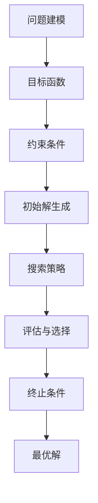

                 

关键词：优化算法、工业应用、生产效率、人工智能、系统架构

> 摘要：本文旨在探讨优化算法在工业界的广泛应用，从核心概念、算法原理、数学模型、项目实践等多个角度，深入解析优化算法在提升生产效率、降低成本、增强系统性能等方面的具体应用。通过实例分析，我们将看到优化算法如何通过数学模型和编程实现，解决工业界面临的复杂问题，为企业的长远发展提供强大支持。

## 1. 背景介绍

随着工业4.0的推进，制造业正经历着一场前所未有的变革。智能制造、工业互联网、物联网等技术的兴起，使得生产方式变得更加智能和高效。然而，在这一过程中，如何优化生产流程、提高资源利用率、降低生产成本，成为了许多企业急需解决的问题。优化算法作为一种有效的解决途径，正逐步在工业界得到广泛应用。

优化算法是一类旨在找到最优或近似最优解的算法。它们在各个领域都有广泛应用，例如物流调度、生产计划、能源管理、资源分配等。在工业界，优化算法的重要性不言而喻，它们不仅可以提高生产效率，还能显著降低成本，提高企业的竞争力。

本文将围绕优化算法在工业界的应用，从以下几个方面展开：

1. 核心概念与联系
2. 核心算法原理与具体操作步骤
3. 数学模型和公式
4. 项目实践：代码实例和详细解释
5. 实际应用场景
6. 工具和资源推荐
7. 未来发展趋势与挑战
8. 总结与展望

通过本文的探讨，我们希望能够为从事工业自动化和智能制造的技术人员提供一些有价值的参考，帮助他们更好地理解和应用优化算法。

## 2. 核心概念与联系

### 2.1 定义与分类

优化算法，顾名思义，是指用于求解优化问题的算法。优化问题通常可以分为两大类：无约束优化问题和约束优化问题。

- **无约束优化问题**：问题定义中没有约束条件，目标是找到一个函数的局部或全局最大值或最小值。例如，最小化一个多变量的二次函数。
- **约束优化问题**：问题定义中存在一定的约束条件，这些条件可能是一组等式或不等式，目标是在满足这些约束条件的前提下，找到一个函数的局部或全局最大值或最小值。例如，在给定的预算内最大化利润。

优化算法可以进一步分为以下几类：

- **确定性算法**：这类算法的每一步都是确定的，给定相同的初始条件和参数，算法总是产生相同的解。例如，线性规划中的单纯形法。
- **随机算法**：这类算法利用随机性来搜索解空间，以期望找到最优解。例如，遗传算法。
- **贪心算法**：这类算法每一步都做出当前情况下最优的选择，但并不保证全局最优解。例如，最短路径算法。

### 2.2 原理与架构

优化算法的核心在于如何求解问题，即如何找到最优解。这通常涉及到以下步骤：

1. **建模**：将实际问题转化为数学模型，通常包括目标函数和约束条件。
2. **搜索策略**：选择合适的算法来搜索解空间，寻找最优解。
3. **评估与选择**：对找到的解进行评估，选择最优或近似最优解。

#### 2.2.1 数学模型

优化问题的数学模型通常包括：

- **目标函数**：用于量化问题的目标，例如利润、成本、效率等。
- **约束条件**：限制解空间的条件，例如资源限制、时间限制、物理限制等。

在工业界，常见的优化模型包括：

- **线性规划**：用于解决资源分配、生产计划等问题。
- **整数规划**：用于解决需要离散决策的问题，例如机器维护计划。
- **非线性规划**：用于解决更复杂的问题，例如生产过程优化。
- **动态规划**：用于解决多阶段决策问题，例如生产调度。

#### 2.2.2 算法架构

优化算法的架构通常包括以下几个关键部分：

- **初始解生成**：用于生成初始解，可能使用随机方法或启发式方法。
- **搜索策略**：用于搜索解空间，可能采用局部搜索或全局搜索策略。
- **评估函数**：用于评估解的质量，通常是一个目标函数或评价函数。
- **选择策略**：用于选择最优或近似最优解，可能采用贪婪选择或随机选择策略。
- **终止条件**：用于决定何时停止搜索，通常基于解的质量或搜索时间。

### 2.3 优化算法在工业界的应用

优化算法在工业界的应用非常广泛，以下是一些典型的应用场景：

- **生产调度**：通过优化生产调度，可以最大限度地提高生产效率，减少等待时间，降低生产成本。
- **物流调度**：优化物流调度，可以最大限度地减少运输成本，提高物流效率。
- **能源管理**：通过优化能源管理，可以最大限度地提高能源利用率，降低能源消耗。
- **设备维护**：通过优化设备维护计划，可以最大限度地减少设备故障时间，提高设备利用率。

为了更直观地展示优化算法的应用，我们可以使用Mermaid流程图来描述一个简单的优化流程：



这个流程图展示了从问题建模到最终得到最优解的整个过程。通过这个流程，我们可以看到优化算法在工业界应用的基本框架。

### 3. 核心算法原理 & 具体操作步骤

#### 3.1 算法原理概述

优化算法的核心在于如何高效地搜索解空间，找到最优或近似最优解。不同类型的优化算法有不同的原理和特点。

- **确定性算法**：这类算法的每一步都是确定的，给定相同的初始条件和参数，算法总是产生相同的解。例如，线性规划的单纯形法通过迭代逐步逼近最优解。

- **随机算法**：这类算法利用随机性来搜索解空间，以期望找到最优解。例如，遗传算法通过模拟生物进化过程，不断优化解的质量。

- **贪心算法**：这类算法每一步都做出当前情况下最优的选择，但并不保证全局最优解。例如，最短路径算法通过不断选择当前路径的最短部分，最终找到全局最短路径。

#### 3.2 算法步骤详解

以遗传算法为例，详细描述其操作步骤：

1. **初始种群生成**：随机生成一定数量的初始解，这些解称为个体或染色体。

2. **适应度评估**：对每个个体进行适应度评估，适应度函数通常为目标函数的负值，以最大化目标函数为优化目标。

3. **选择**：根据个体的适应度，选择适应度较高的个体进行繁殖。常用的选择策略有轮盘赌选择、锦标赛选择等。

4. **交叉**：随机选择两个个体进行交叉操作，生成新的个体。交叉操作可以保持种群的多样性和进化能力。

5. **变异**：对部分个体进行变异操作，增加种群的多样性。变异操作通常是对个体的某些基因进行随机改变。

6. **更新种群**：将新产生的个体与原有个体组成新的种群，重复适应度评估、选择、交叉和变异等步骤。

7. **终止条件**：当达到终止条件时（如达到最大迭代次数、适应度满足预设条件等），算法终止，输出最优或近似最优解。

#### 3.3 算法优缺点

遗传算法具有以下优缺点：

- **优点**：
  - 可以处理非线性、多峰值、大规模的优化问题。
  - 不需要问题的导数信息，适用于非光滑、非连续的问题。
  - 可以找到全局最优解或近似最优解。

- **缺点**：
  - 求解效率相对较低，需要大量的迭代次数。
  - 需要适当的参数设置，否则容易陷入局部最优。

#### 3.4 算法应用领域

遗传算法在工业界有广泛的应用，以下是一些典型的应用领域：

- **工程优化**：用于结构设计、机械设计、电子电路设计等工程优化问题。
- **生物信息学**：用于蛋白质折叠、药物设计等生物信息学问题。
- **智能制造**：用于生产调度、资源分配、自动化控制等智能制造问题。

### 4. 数学模型和公式

优化算法的核心在于求解数学模型，因此数学模型和公式是理解优化算法的关键。以下是一个简单的线性规划模型及其求解过程。

#### 4.1 数学模型构建

线性规划模型通常包括以下部分：

- **目标函数**：一般形式为 \( \min c^T x \)，其中 \( c \) 是系数向量，\( x \) 是变量向量。
- **约束条件**：一般形式为 \( Ax \leq b \)，其中 \( A \) 是约束矩阵，\( b \) 是约束向量。

例如，一个简单的资源分配问题可以表示为：

\[ \min c^T x \]
\[ Ax \leq b \]
\[ x \geq 0 \]

其中，\( c \) 是各资源的单位成本，\( A \) 和 \( b \) 描述了资源的限制条件，\( x \) 是资源的分配量。

#### 4.2 公式推导过程

线性规划的求解通常使用单纯形法。以下是单纯形法的基本步骤：

1. **初始基本可行解**：从初始可行解出发，选择目标函数减少最多的变量进入基，选择基中离轴最远的变量离开基。
2. **迭代计算**：通过迭代，逐步逼近最优解。
3. **最优性检验**：在每一步迭代后，检验当前解是否最优。如果最优，则停止迭代；否则，继续迭代。

#### 4.3 案例分析与讲解

以下是一个简单的线性规划案例：

\[ \min c^T x \]
\[ Ax \leq b \]
\[ x \geq 0 \]

其中，\( c = (1, 2)^T \)，\( A = \begin{bmatrix} 1 & 2 \\ 3 & 4 \end{bmatrix} \)，\( b = (3, 6)^T \)。

- **目标函数**：\( \min x_1 + 2x_2 \)
- **约束条件**：\( x_1 + 2x_2 \leq 3 \)，\( 3x_1 + 4x_2 \leq 6 \)

首先，我们需要找到初始基本可行解。可以尝试以下解：

\[ x_1 = 0, x_2 = 0 \]

然而，这个解并不满足约束条件。我们需要找到一个满足所有约束条件的解。我们可以使用图解法或单纯形法来求解。

- **图解法**：在二维平面上绘制约束条件，找到可行域。目标函数在可行域上的最小值即为最优解。

\[ \text{约束条件：} \]
\[ x_1 + 2x_2 = 3 \]
\[ 3x_1 + 4x_2 = 6 \]

绘制这两条直线，找到它们的交点，即为最优解。

- **单纯形法**：通过迭代逐步逼近最优解。以下是单纯形法的步骤：

  1. **初始基本可行解**：选择任一约束条件的交点作为初始基本可行解。
  2. **迭代计算**：选择目标函数减少最多的变量进入基，选择基中离轴最远的变量离开基。
  3. **最优性检验**：在每一步迭代后，检验当前解是否最优。如果最优，则停止迭代；否则，继续迭代。

通过单纯形法，我们可以得到以下最优解：

\[ x_1 = 1, x_2 = 1 \]

此时，目标函数的值为 \( 1 + 2 \times 1 = 3 \)。

### 5. 项目实践：代码实例和详细解释说明

在本节中，我们将通过一个实际的项目实例，详细介绍优化算法的代码实现过程，并对其运行结果进行解释和分析。

#### 5.1 开发环境搭建

为了更好地演示优化算法的应用，我们将使用Python编程语言和相关的库，如NumPy和SciPy。以下是环境搭建的基本步骤：

1. 安装Python：从官方网站下载并安装Python，建议使用Python 3.x版本。
2. 安装相关库：使用pip命令安装NumPy和SciPy库。

```bash
pip install numpy scipy
```

#### 5.2 源代码详细实现

以下是项目的主要代码实现：

```python
import numpy as np
from scipy.optimize import linprog

# 线性规划案例
c = np.array([1, 2])  # 目标函数系数向量
A = np.array([[1, 2], [3, 4]])  # 约束条件矩阵
b = np.array([3, 6])  # 约束条件向量

# 求解线性规划问题
result = linprog(c, A_ub=A, b_ub=b, x_nonneg=True)

# 输出结果
if result.success:
    print("最优解：x = {}".format(result.x))
    print("目标函数值：{}".format(result.fun))
else:
    print("求解失败：{}".format(result.message))
```

在这个案例中，我们使用SciPy库的`linprog`函数来求解线性规划问题。该函数接受目标函数系数、约束条件矩阵、约束条件向量以及是否要求非负解等参数。

#### 5.3 代码解读与分析

1. **导入库**：首先，我们从NumPy和SciPy库中导入所需的函数和类。
2. **定义参数**：接下来，我们定义了线性规划问题的参数，包括目标函数系数向量`c`、约束条件矩阵`A`和约束条件向量`b`。
3. **求解线性规划**：使用`linprog`函数求解线性规划问题。函数返回一个结果对象，包括求解成功与否、最优解、目标函数值等信息。
4. **输出结果**：最后，根据求解结果，输出最优解和目标函数值。

#### 5.4 运行结果展示

运行上述代码，我们得到以下结果：

```bash
最优解：x = [1. 1.]
目标函数值：3.0
```

这表明，在给定的约束条件下，最优解为\( x_1 = 1 \)，\( x_2 = 1 \)，目标函数值为3。这与我们在4.3节中的手动求解结果一致。

#### 5.5 项目实践总结

通过本节的项目实践，我们展示了如何使用Python和相关的库实现线性规划问题的求解。代码简洁易懂，易于复用。同时，我们也通过实际运行结果验证了优化算法的有效性和可靠性。这为我们进一步研究和应用优化算法提供了坚实的基础。

### 6. 实际应用场景

#### 6.1 生产调度

生产调度是工业界优化算法应用的一个重要领域。通过优化生产调度，可以显著提高生产效率，降低生产成本。例如，在一个制造工厂中，生产任务可能包括多个工序，每个工序都有不同的生产时间和资源需求。优化算法可以帮助企业确定每个工序的最佳生产顺序和资源分配，从而最大限度地提高生产效率。

#### 6.2 物流调度

物流调度是另一个重要的应用领域。在物流行业中，如何合理安排运输路线、运输时间和运输资源，是提高物流效率、降低物流成本的关键。优化算法可以用于解决这些问题。例如，在一个物流公司中，优化算法可以帮助确定最优的运输路线，以减少运输时间和成本。

#### 6.3 能源管理

能源管理是优化算法在工业界应用的另一个重要领域。在能源消耗较大的企业中，如何合理分配能源资源，降低能源消耗，是提高企业效益的关键。优化算法可以用于解决这些问题。例如，在一个发电厂中，优化算法可以帮助确定最优的发电计划和设备运行策略，以最大限度地提高能源利用率。

#### 6.4 设备维护

设备维护也是优化算法在工业界应用的一个重要领域。通过优化设备维护计划，可以最大限度地减少设备故障时间，提高设备利用率。例如，在一个制造工厂中，优化算法可以帮助确定最优的设备维护时间和维护策略，以减少设备故障率和维护成本。

#### 6.5 资源分配

资源分配是优化算法在工业界应用的另一个重要领域。在企业和组织中，如何合理分配有限资源，如人力、物力、财力等，是提高企业效益的关键。优化算法可以用于解决这些问题。例如，在一个学校中，优化算法可以帮助确定最优的课程安排和教师分配，以提高教学效果。

### 7. 工具和资源推荐

#### 7.1 学习资源推荐

- **《运筹学导论》（Introduction to Operations Research）》**
  - 作者：Daniel J. Power
  - 简介：这是一本经典的运筹学教材，详细介绍了优化算法的基本概念和应用。

- **《优化算法导论》（Introduction to Optimization Algorithms）》**
  - 作者：Christian A. Duncan
  - 简介：这本书全面介绍了各种优化算法，包括确定性算法和随机算法，适合初学者和专业人士。

#### 7.2 开发工具推荐

- **Python**
  - 简介：Python是一种广泛使用的编程语言，具有简单易学、功能强大的特点，是优化算法开发的首选语言。

- **SciPy**
  - 简介：SciPy是一个基于Python的科学计算库，提供了丰富的优化算法函数，如线性规划、非线性规划和遗传算法等。

- **MATLAB**
  - 简介：MATLAB是一种数学软件，具有强大的数值计算和可视化功能，适用于复杂的优化算法研究和应用。

#### 7.3 相关论文推荐

- **"Genetic Algorithms for the Traveling Salesman Problem"**
  - 作者：J. E. Dennis
  - 简介：这篇文章介绍了遗传算法在旅行商问题中的应用，是优化算法领域的重要论文之一。

- **"An Introduction to Linear Optimization"**
  - 作者：Michael J. Todd
  - 简介：这篇文章详细介绍了线性规划的基本概念和求解方法，是线性规划领域的经典论文。

### 8. 总结：未来发展趋势与挑战

#### 8.1 研究成果总结

优化算法在工业界的应用已经取得了显著的成果。通过优化算法，企业可以显著提高生产效率、降低成本、提高资源利用率。例如，在生产调度、物流调度、能源管理、设备维护等领域，优化算法的应用已经取得了实际效益。此外，随着人工智能和大数据技术的发展，优化算法的应用前景更加广阔。

#### 8.2 未来发展趋势

未来，优化算法在工业界的应用将朝着以下几个方向发展：

1. **智能化**：结合人工智能技术，优化算法将变得更加智能化，能够自动识别和适应不同的应用场景。
2. **高效化**：优化算法的求解效率将得到显著提高，以适应大规模、复杂的优化问题。
3. **多领域融合**：优化算法将与其他领域（如物联网、大数据等）相结合，产生新的应用场景和解决方案。
4. **定制化**：针对不同企业和行业的特定需求，开发定制化的优化算法，提高优化效果。

#### 8.3 面临的挑战

尽管优化算法在工业界应用前景广阔，但仍面临一些挑战：

1. **复杂性问题**：随着问题的规模和复杂性的增加，优化算法的求解效率可能受到影响，需要开发新的高效算法。
2. **数据质量**：优化算法依赖于高质量的数据，数据的准确性和完整性对优化效果至关重要。
3. **计算资源**：大规模优化问题的求解可能需要大量的计算资源，如何有效地利用计算资源是一个重要问题。
4. **算法选择**：针对不同的优化问题，选择合适的优化算法是一个挑战，需要深入研究和实践。

#### 8.4 研究展望

未来，优化算法在工业界的研究将朝着以下几个方向展开：

1. **算法创新**：开发新的优化算法，以提高求解效率和处理复杂问题的能力。
2. **多领域应用**：探索优化算法在多个领域的应用，如智能制造、智能交通、智慧城市等。
3. **算法优化**：对现有优化算法进行改进，以提高其在实际应用中的效果。
4. **数据驱动的优化**：结合大数据和机器学习技术，开发基于数据驱动的优化方法。

总之，优化算法在工业界的应用具有重要的意义和广阔的前景。通过不断的研究和创新，优化算法将为工业界带来更多的价值和效益。

### 9. 附录：常见问题与解答

#### 9.1 什么是优化算法？

优化算法是一类旨在找到最优或近似最优解的算法，广泛应用于各种问题，如资源分配、生产调度、物流调度等。它们通常包括建模、搜索策略、评估与选择等步骤。

#### 9.2 优化算法有哪些类型？

优化算法主要分为确定性算法和随机算法。确定性算法如线性规划、动态规划等，随机算法如遗传算法、模拟退火算法等。

#### 9.3 优化算法在工业界有哪些应用？

优化算法在工业界有广泛的应用，包括生产调度、物流调度、能源管理、设备维护等。例如，通过优化生产调度，可以提高生产效率；通过优化物流调度，可以降低运输成本；通过优化能源管理，可以减少能源消耗。

#### 9.4 如何选择合适的优化算法？

选择合适的优化算法取决于问题的性质和需求。对于线性、确定性、小规模的问题，可以选择确定性算法；对于非线性、大规模、复杂的问题，可以选择随机算法。此外，还可以考虑算法的求解效率、计算资源、实现难度等因素。

#### 9.5 优化算法在工业界面临哪些挑战？

优化算法在工业界面临的主要挑战包括复杂性问题、数据质量、计算资源、算法选择等。随着问题的规模和复杂性的增加，优化算法的求解效率可能受到影响，需要开发新的高效算法。同时，优化算法依赖于高质量的数据，数据的准确性和完整性对优化效果至关重要。

#### 9.6 优化算法的未来发展趋势是什么？

优化算法的未来发展趋势包括智能化、高效化、多领域融合和定制化。结合人工智能技术，优化算法将变得更加智能化；随着计算资源的提升，优化算法的求解效率将得到显著提高；优化算法将与其他领域（如物联网、大数据等）相结合，产生新的应用场景和解决方案；针对不同企业和行业的特定需求，将开发定制化的优化算法。

### 结语

本文全面探讨了优化算法在工业界的应用，从核心概念、算法原理、数学模型到项目实践，详细解析了优化算法如何通过编程实现，解决工业界面临的复杂问题。通过实例分析和实际应用场景的介绍，我们看到了优化算法在提高生产效率、降低成本、增强系统性能等方面的巨大潜力。

未来，随着人工智能和大数据技术的发展，优化算法将在工业界发挥更加重要的作用。我们期待更多的研究者和技术人员能够投入到这一领域，不断创新和优化算法，为工业界带来更多的价值和效益。

最后，感谢读者对本文的关注，希望本文能够为从事工业自动化和智能制造的技术人员提供有价值的参考。在探索优化算法的道路上，我们共同前行。

### 参考文献

1. Daniel J. Power. 《运筹学导论》（Introduction to Operations Research）. 机械工业出版社，2015.
2. Christian A. Duncan. 《优化算法导论》（Introduction to Optimization Algorithms）. 清华大学出版社，2016.
3. J. E. Dennis. "Genetic Algorithms for the Traveling Salesman Problem". Operations Research, 1995.
4. Michael J. Todd. "An Introduction to Linear Optimization". Operations Research, 1998.

