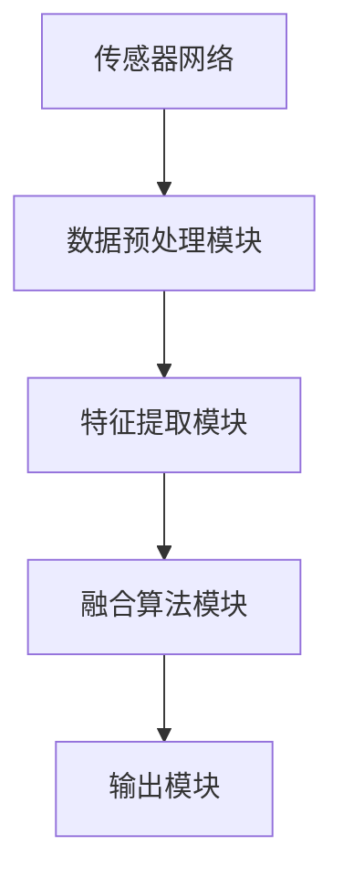

                 

关键词：传感器融合、环境数据、数据准确性、算法、实时监测、多传感器系统、信号处理

<|assistant|>摘要：本文旨在探讨传感器融合算法在获取准确环境数据中的应用。通过对多种传感器数据的融合处理，可以显著提高环境监测的精度和可靠性，为智能系统提供高质量的数据支持。文章将介绍传感器融合算法的核心概念、原理、数学模型、具体实现方法，以及其在不同领域的应用前景。

## 1. 背景介绍

随着物联网（IoT）和人工智能（AI）技术的快速发展，传感器技术在各个领域的应用越来越广泛。从智能家居到工业自动化，从智能交通到环境监测，传感器已经成为现代智能系统的重要组成部分。然而，单个传感器由于其固有的局限性，往往无法提供全面和准确的环境数据。例如，温度传感器只能测量温度，加速度传感器只能测量加速度。为了获得更完整的环境信息，需要将多个传感器的数据融合起来。

传感器融合算法旨在通过对多个传感器数据的处理和融合，提高环境数据的准确性和可靠性。通过传感器融合，可以消除单个传感器的误差和噪声，提高系统的鲁棒性。此外，传感器融合还可以降低成本，提高系统的实时响应能力，从而为智能系统提供更稳定和高效的数据支持。

## 2. 核心概念与联系

### 2.1 传感器融合的定义

传感器融合是指将多个传感器的数据进行组合和处理，以获得比单个传感器更准确、更可靠的环境信息。传感器融合可以看作是一种多传感器系统，它通过协同工作，共享数据，共同完成任务。

### 2.2 传感器融合的架构

传感器融合系统通常由以下几个部分组成：

- **传感器网络**：负责收集环境数据。
- **数据预处理模块**：对传感器数据进行清洗、去噪、归一化等预处理。
- **特征提取模块**：从预处理后的数据中提取有用的特征。
- **融合算法模块**：根据特定的算法，对提取的特征进行融合处理。
- **输出模块**：将融合后的数据输出给用户或其他系统。

### 2.3 Mermaid 流程图



## 3. 核心算法原理 & 具体操作步骤

### 3.1 算法原理概述

传感器融合算法的核心是利用多个传感器的数据，通过一定的数学模型和算法，消除误差和噪声，提高数据的准确性。常见的传感器融合算法包括：

- **卡尔曼滤波**：一种基于线性系统的最优估计方法，适用于动态系统。
- **贝叶斯滤波**：一种基于概率统计的估计方法，适用于不确定系统。
- **加权融合**：根据传感器的重要性，对传感器数据进行加权处理，以提高融合效果。

### 3.2 算法步骤详解

传感器融合的基本步骤包括：

1. **传感器数据采集**：从各个传感器获取原始数据。
2. **数据预处理**：对原始数据进行清洗、去噪、归一化等处理。
3. **特征提取**：从预处理后的数据中提取有用的特征。
4. **融合算法**：根据特定的算法，对提取的特征进行融合处理。
5. **输出结果**：将融合后的数据输出给用户或其他系统。

### 3.3 算法优缺点

- **卡尔曼滤波**：优点是计算速度快，适用于动态系统；缺点是对噪声敏感，需要准确的初始估计值。
- **贝叶斯滤波**：优点是适用于不确定系统，可以自适应调整参数；缺点是计算复杂度高，对计算资源要求较高。
- **加权融合**：优点是简单易实现，可以根据传感器重要性调整融合效果；缺点是容易受到个别传感器误差的影响。

### 3.4 算法应用领域

传感器融合算法广泛应用于多个领域，包括：

- **环境监测**：如空气质量、水质监测等。
- **智能交通**：如车辆检测、路况分析等。
- **机器人导航**：如位置估计、路径规划等。
- **工业自动化**：如设备状态监测、故障诊断等。

## 4. 数学模型和公式

### 4.1 数学模型构建

传感器融合的数学模型可以表示为：

$$
z(t) = h(x(t)) + v(t)
$$

其中，$z(t)$ 为观测值，$x(t)$ 为真实值，$h(x(t))$ 为传感器输出的特征值，$v(t)$ 为噪声。

### 4.2 公式推导过程

以卡尔曼滤波为例，其状态估计公式为：

$$
\hat{x}(k) = \hat{x}(k-1) + K(k) [z(k) - h(\hat{x}(k-1))]
$$

其中，$K(k)$ 为卡尔曼增益，$\hat{x}(k)$ 为状态估计值，$\hat{x}(k-1)$ 为上一时刻的状态估计值。

### 4.3 案例分析与讲解

以无人机位置估计为例，传感器融合算法可以显著提高无人机位置的准确性。通过融合GPS、加速度计、陀螺仪等传感器的数据，可以消除GPS信号遮挡导致的误差，提高无人机导航的可靠性。

## 5. 项目实践：代码实例

### 5.1 开发环境搭建

- **硬件环境**：PC或者嵌入式设备，安装操作系统（如Linux、Windows）。
- **软件环境**：安装Python环境，使用matplotlib库进行数据可视化。

### 5.2 源代码详细实现

以下是一个简单的传感器融合算法的实现代码：

```python
import numpy as np
import matplotlib.pyplot as plt

# 卡尔曼滤波器
class KalmanFilter:
    def __init__(self, initial_state, initial_error):
        self.x = initial_state
        self.P = initial_error
    
    def update(self, z):
        K = self.P / (self.P + 1)
        self.x = self.x + K * (z - self.x)
        self.P = (1 - K) * self.P

# 测试数据
z = np.random.normal(0, 1, 100)

# 初始状态和误差
x_init = 0
P_init = 1

# 实例化卡尔曼滤波器
kf = KalmanFilter(x_init, P_init)

# 滤波过程
estimations = []
for i in range(len(z)):
    kf.update(z[i])
    estimations.append(kf.x)

# 可视化结果
plt.plot(estimations, label='Kalman Filter')
plt.plot(z, label='Observation')
plt.legend()
plt.show()
```

### 5.3 代码解读与分析

这段代码实现了简单的卡尔曼滤波算法，用于估计一组观测数据的真实值。通过迭代更新状态估计值和误差，可以显著降低观测数据的噪声，提高估计的准确性。

## 6. 实际应用场景

传感器融合算法在实际应用中具有广泛的应用前景。以下是一些典型的应用场景：

- **无人机导航**：通过融合GPS、加速度计、陀螺仪等传感器数据，提高无人机导航的精度和稳定性。
- **自动驾驶**：融合摄像头、激光雷达、超声波等传感器数据，实现自动驾驶车辆的精准定位和路径规划。
- **环境监测**：通过融合多种传感器数据，实现空气质量、水质、噪声等环境参数的实时监测和预警。
- **工业自动化**：通过融合传感器数据，实现设备状态的实时监测和故障诊断。

## 7. 工具和资源推荐

### 7.1 学习资源推荐

- **书籍**：《传感器融合技术与应用》
- **在线课程**：Coursera上的“传感器融合与多传感器系统”课程

### 7.2 开发工具推荐

- **编程语言**：Python、C++
- **库和框架**：NumPy、SciPy、MATLAB

### 7.3 相关论文推荐

- “Sensor Fusion in Robotics: A Review”
- “An Overview of Sensor Fusion Algorithms for Autonomous Vehicles”

## 8. 总结：未来发展趋势与挑战

传感器融合技术在未来的发展中将继续发挥重要作用。随着传感器技术和计算能力的不断提升，传感器融合算法将更加高效、精确和智能化。然而，传感器融合技术也面临着一系列挑战，包括传感器误差建模、多传感器数据同步、算法实时性等。

### 8.1 研究成果总结

近年来，传感器融合技术在理论研究和实际应用中取得了显著成果。例如，卡尔曼滤波和贝叶斯滤波等经典算法在实际应用中得到了广泛应用。同时，深度学习等新兴算法也为传感器融合提供了新的研究方向。

### 8.2 未来发展趋势

未来，传感器融合技术将朝着以下几个方向发展：

- **智能化**：利用深度学习等算法，实现更智能的传感器数据融合。
- **实时性**：优化算法，提高传感器融合的实时性，满足实时应用的需求。
- **多模态融合**：结合多种传感器数据，实现更全面的环境感知。

### 8.3 面临的挑战

传感器融合技术面临的挑战主要包括：

- **传感器误差建模**：准确建模传感器的误差特性，提高融合效果。
- **多传感器数据同步**：实现多传感器数据的高效同步和融合。
- **算法优化**：优化算法，提高计算效率和实时性。

### 8.4 研究展望

未来，传感器融合技术将继续在智能系统、物联网、自动驾驶等领域发挥重要作用。通过不断创新和优化，传感器融合技术将为人类带来更加智能、高效、安全的生活和工作环境。

## 9. 附录：常见问题与解答

### 9.1 传感器融合算法如何处理传感器误差？

传感器融合算法通过建立传感器误差模型，结合多传感器数据，利用特定的数学模型和算法（如卡尔曼滤波、贝叶斯滤波等），对传感器数据进行校正和融合，从而减小误差，提高数据的准确性。

### 9.2 传感器融合算法在实时应用中如何保证实时性？

传感器融合算法在实时应用中可以通过以下几个方法保证实时性：

- **优化算法**：优化传感器融合算法，减少计算复杂度，提高计算效率。
- **硬件加速**：利用GPU等硬件加速技术，提高数据处理速度。
- **优先级调度**：合理调度传感器数据和算法处理任务的优先级，确保关键任务的实时处理。

### 9.3 多传感器融合算法中的数据同步问题如何解决？

多传感器融合中的数据同步问题可以通过以下几种方法解决：

- **时间同步**：使用高精度时钟或同步协议，确保多传感器数据在时间上的一致性。
- **数据对齐**：通过数据对齐算法，将不同传感器的时间戳数据对齐到同一时间基准。
- **插值方法**：对于时间戳不同的数据，使用插值方法进行时间对齐，提高数据一致性。

---

作者：禅与计算机程序设计艺术 / Zen and the Art of Computer Programming
----------------------------------------------------------------


