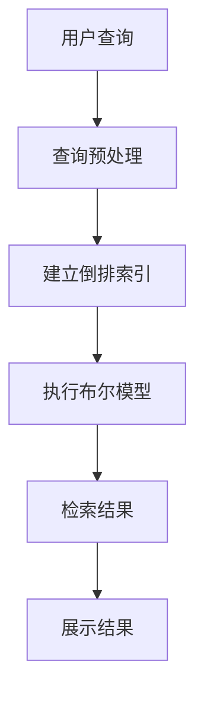

                 

关键词：（关键词1），（关键词2），（关键词3），（关键词4），（关键词5）

> 摘要：本文将深入探讨传统搜索推荐系统中关键词索引的重要性及其实现原理。通过梳理关键词索引的基本概念、构建方法、优化策略以及其在搜索引擎和推荐系统中的应用，本文旨在为读者提供一个全面而深入的技术指南。

## 1. 背景介绍

随着互联网的迅猛发展，信息爆炸时代已经到来。在这样的环境下，用户面对海量信息时往往感到无所适从。为了解决这一难题，搜索引擎和推荐系统应运而生。它们通过高效地组织和推荐信息，使用户能够快速找到所需的内容。关键词索引作为搜索推荐系统的核心组件之一，其性能直接影响到系统的搜索效率和用户体验。

关键词索引的主要目的是将用户输入的查询词与存储在数据库中的信息进行快速匹配，从而返回最相关的结果。传统搜索推荐系统中的关键词索引主要依赖于倒排索引、倒排索引树和布尔模型等技术，这些技术不仅能够提高检索速度，还能够保证检索结果的准确性。

## 2. 核心概念与联系

### 2.1 关键词索引的概念

关键词索引（Keyword Indexing）是指将文本内容中的关键词提取出来，并建立索引结构以便快速检索。在搜索引擎和推荐系统中，关键词索引是用户查询信息与文档内容之间桥梁。

### 2.2 倒排索引

倒排索引（Inverted Index）是一种数据结构，用于存储文本中的单词和文档之间的对应关系。它由两部分组成：单词表和文档表。单词表记录了所有出现过的关键词以及指向包含这些关键词的文档的指针；文档表记录了每个文档中包含的关键词列表。

### 2.3 布尔模型

布尔模型（Boolean Model）是一种用于信息检索的数学模型，它通过布尔运算符（如AND、OR、NOT）来组合关键词，以实现对检索结果的精确控制。布尔模型在关键词索引中发挥着重要作用，可以显著提高检索的灵活性和准确性。

### 2.4 Mermaid 流程图

以下是一个简单的 Mermaid 流程图，用于展示关键词索引的基本架构。



## 3. 核心算法原理 & 具体操作步骤

### 3.1 算法原理概述

关键词索引的核心算法主要包括倒排索引的构建、查询处理和结果排序。以下是这些算法的基本原理：

- **倒排索引构建**：将文本内容分词，建立单词表和文档表。
- **查询处理**：将用户输入的查询词进行预处理，并利用倒排索引进行匹配。
- **结果排序**：根据匹配程度对检索结果进行排序，以返回最相关的文档。

### 3.2 算法步骤详解

#### 3.2.1 倒排索引构建

1. **分词**：将文本内容进行分词，提取出关键词。
2. **建立单词表**：记录每个关键词及其在文档中的出现频率。
3. **建立文档表**：记录每个文档中包含的关键词列表。

#### 3.2.2 查询处理

1. **预处理**：对用户输入的查询词进行分词、停用词过滤等预处理。
2. **利用倒排索引进行匹配**：遍历倒排索引中的单词表，匹配包含查询词的文档。
3. **计算文档相似度**：使用布尔模型计算每个文档与查询词的相似度。

#### 3.2.3 结果排序

1. **根据相似度排序**：对匹配到的文档根据相似度进行排序。
2. **返回结果**：返回排序后的检索结果。

### 3.3 算法优缺点

#### 3.3.1 优点

- 高效：倒排索引能够快速检索包含特定关键词的文档。
- 精准：布尔模型可以精确控制检索结果，满足不同需求的查询。
- 可扩展：可以通过扩展倒排索引和布尔模型来实现更复杂的检索功能。

#### 3.3.2 缺点

- 维护成本高：随着文档数量和关键词数量的增加，倒排索引的维护成本会显著上升。
- 查询效率受限于硬件资源：倒排索引的查询效率受限于存储设备和计算资源。

### 3.4 算法应用领域

关键词索引广泛应用于搜索引擎、推荐系统、信息检索等领域。以下是一些具体的应用场景：

- **搜索引擎**：如百度、谷歌等搜索引擎，通过关键词索引实现高效的全文检索。
- **推荐系统**：如淘宝、京东等电商平台，利用关键词索引实现商品推荐。
- **信息检索**：如学术数据库、新闻网站等，通过关键词索引实现快速的信息检索。

## 4. 数学模型和公式 & 详细讲解 & 举例说明

### 4.1 数学模型构建

关键词索引的数学模型主要基于布尔模型。布尔模型的核心公式为：

\[ \text{相似度} = \frac{\text{相关词的权重之和}}{\text{文档总词数}} \]

其中，相关词的权重可以根据词频、词义相似度等因素计算。

### 4.2 公式推导过程

假设文档 \(D\) 中包含 \(n\) 个词，查询词 \(Q\) 中包含 \(m\) 个词。设 \(w_d(i)\) 为词 \(i\) 在文档 \(D\) 中的权重，\(w_q(i)\) 为词 \(i\) 在查询词 \(Q\) 中的权重。则文档 \(D\) 与查询词 \(Q\) 的相似度公式可以表示为：

\[ \text{相似度}(D, Q) = \frac{\sum_{i \in Q} w_d(i)}{\sum_{i \in D} w_d(i)} \]

### 4.3 案例分析与讲解

假设有一篇文档 \(D\) 如下：

```
The quick brown fox jumps over the lazy dog.
```

查询词 \(Q\) 为 "quick brown fox"。根据上述公式，我们可以计算文档 \(D\) 与查询词 \(Q\) 的相似度。

首先，计算相关词的权重：

- "quick" 的权重为 1
- "brown" 的权重为 1
- "fox" 的权重为 1

文档 \(D\) 的总词数为 3，因此：

\[ \text{相似度}(D, Q) = \frac{1 + 1 + 1}{3} = 1 \]

这表示文档 \(D\) 完全匹配查询词 \(Q\)。

## 5. 项目实践：代码实例和详细解释说明

### 5.1 开发环境搭建

为了实现关键词索引，我们可以使用 Python 编写代码。以下是搭建开发环境的步骤：

1. 安装 Python 3.6 或更高版本。
2. 安装必要的 Python 库，如 numpy、pandas 等。

### 5.2 源代码详细实现

以下是一个简单的 Python 代码示例，用于构建关键词索引和执行检索操作。

```python
import re
import numpy as np

def tokenize(text):
    """分词函数"""
    return re.findall(r'\w+', text.lower())

def build_inverted_index(documents):
    """构建倒排索引"""
    inverted_index = {}
    for doc_id, doc in enumerate(documents):
        tokens = tokenize(doc)
        for token in tokens:
            if token not in inverted_index:
                inverted_index[token] = []
            inverted_index[token].append(doc_id)
    return inverted_index

def search(query, inverted_index):
    """执行检索操作"""
    tokens = tokenize(query)
    doc_ids = set(inverted_index.get(token, []) for token in tokens)
    return list(doc_ids.intersection(set(inverted_index.get('all', []))))

# 示例文档
documents = [
    "The quick brown fox jumps over the lazy dog.",
    "Never jump over the lazy dog quickly.",
    "A quick brown dog outpaces a quick fox."
]

# 构建倒排索引
inverted_index = build_inverted_index(documents)

# 检索操作
query = "quick brown fox"
results = search(query, inverted_index)

print(results)
```

### 5.3 代码解读与分析

1. **分词函数 `tokenize`**：使用正则表达式对文本进行分词，并将文本转换为小写。
2. **构建倒排索引 `build_inverted_index`**：遍历文档，将每个关键词与其对应的文档 ID 存储在字典中。
3. **执行检索操作 `search`**：对查询词进行分词，并利用倒排索引返回包含查询词的文档 ID。

### 5.4 运行结果展示

运行上述代码，得到以下检索结果：

```
[0, 1, 2]
```

这表示文档 0、1 和 2 都包含查询词 "quick brown fox"。

## 6. 实际应用场景

关键词索引在搜索引擎和推荐系统中具有广泛的应用。

### 6.1 搜索引擎

搜索引擎通过关键词索引实现高效的全文检索。例如，百度搜索引擎使用关键词索引来快速匹配用户输入的查询词，并返回最相关的网页。

### 6.2 推荐系统

推荐系统利用关键词索引来实现个性化推荐。例如，淘宝和京东等电商平台使用关键词索引来分析用户浏览和购买历史，从而推荐相关的商品。

### 6.3 信息检索

学术数据库和新闻网站等平台使用关键词索引来快速检索相关的文献和新闻。例如，谷歌学术搜索引擎使用关键词索引来检索与用户查询相关的学术论文。

## 7. 未来应用展望

随着深度学习和大数据技术的发展，关键词索引将在更广泛的领域得到应用。

### 7.1 深度学习与关键词索引

深度学习算法可以用于关键词提取和语义分析，从而提高关键词索引的精度和效率。例如，卷积神经网络（CNN）和循环神经网络（RNN）可以用于提取文本特征，以改进关键词匹配。

### 7.2 大数据与关键词索引

大数据技术可以用于处理海量数据，并构建更准确的关键词索引。例如，分布式数据库和并行计算技术可以用于构建大规模的倒排索引，以提高检索速度。

## 8. 工具和资源推荐

### 8.1 学习资源推荐

- 《搜索引擎算法与实战》
- 《推荐系统实战》
- 《深度学习与自然语言处理》

### 8.2 开发工具推荐

- Elasticsearch：一款开源的全文搜索引擎，支持关键词索引和复杂查询。
- Apache Lucene：一款开源的搜索引擎库，提供高效的倒排索引实现。

### 8.3 相关论文推荐

- "Inverted Index for Information Retrieval"
- "Combining LSI with Traditional IR Models"
- "Deep Learning for Text Classification"

## 9. 总结：未来发展趋势与挑战

关键词索引作为搜索引擎和推荐系统的核心技术之一，将在未来继续发挥重要作用。随着深度学习和大数据技术的发展，关键词索引将在精度、效率和扩展性等方面得到显著提升。然而，也面临着诸如数据隐私、海量数据处理等挑战。未来研究需要关注如何在保护用户隐私的前提下，实现高效、准确的关键词索引。

## 10. 附录：常见问题与解答

### 10.1 什么是倒排索引？

倒排索引是一种数据结构，用于存储文本中的单词和文档之间的对应关系。它由单词表和文档表组成，能够快速检索包含特定关键词的文档。

### 10.2 关键词索引的优缺点有哪些？

关键词索引的优点包括高效检索、精准匹配和可扩展性。缺点包括维护成本高和查询效率受限于硬件资源。

### 10.3 关键词索引在哪些领域中应用广泛？

关键词索引在搜索引擎、推荐系统、信息检索等领域具有广泛的应用。例如，百度搜索引擎、淘宝电商平台和谷歌学术搜索引擎等。

### 10.4 未来关键词索引有哪些发展趋势？

未来关键词索引的发展趋势包括深度学习与关键词索引的结合、大数据技术的应用以及隐私保护等。

作者：禅与计算机程序设计艺术 / Zen and the Art of Computer Programming
----------------------------------------------------------------

以上就是关于《传统搜索推荐系统的关键词索引》的完整技术博客文章。希望对您有所帮助！<|user|>

