                 

关键词：体系化，管理，领导力，技术架构，团队协作，项目管理，人工智能，软件工程

> 摘要：本文旨在探讨体系化管理在卓越领导力中的关键作用。通过深入分析技术领域的实践案例，本文揭示了如何通过体系化方法提高团队效率，增强领导力，从而在竞争激烈的技术行业中脱颖而出。

## 1. 背景介绍

在当今快速变化的技术时代，企业的成功不再仅仅依赖于技术创新，还取决于如何高效地管理技术和团队。随着人工智能、大数据、云计算等新兴技术的蓬勃发展，企业面临着前所未有的挑战和机遇。如何在这种复杂多变的环境中保持竞争力，成为每个企业领导者亟待解决的问题。

体系化管理作为一种科学的管理方法，通过对组织结构、流程、资源配置等要素的系统化安排，旨在实现组织的高效运作和长期稳定发展。在技术领域，体系化管理不仅可以帮助企业建立稳健的技术架构，还能提升团队协作效率，增强领导力，从而实现企业的战略目标。

本文将从以下几个方面展开讨论：

1. **核心概念与联系**：介绍体系化管理的核心概念，并利用Mermaid流程图展示其基本架构。
2. **核心算法原理 & 具体操作步骤**：分析体系化管理的实施步骤和关键算法。
3. **数学模型和公式**：探讨体系化管理中的数学模型及其应用。
4. **项目实践**：通过具体案例展示体系化管理的实际应用。
5. **实际应用场景**：讨论体系化管理在技术团队中的具体应用。
6. **工具和资源推荐**：介绍支持体系化管理的相关工具和资源。
7. **总结：未来发展趋势与挑战**：总结体系化管理的优势与挑战，并展望未来发展趋势。

### 1.1 核心概念与联系

体系化管理涉及多个核心概念，包括组织结构、流程优化、资源配置、风险管理等。以下是一个简化的Mermaid流程图，展示了这些核心概念之间的联系：

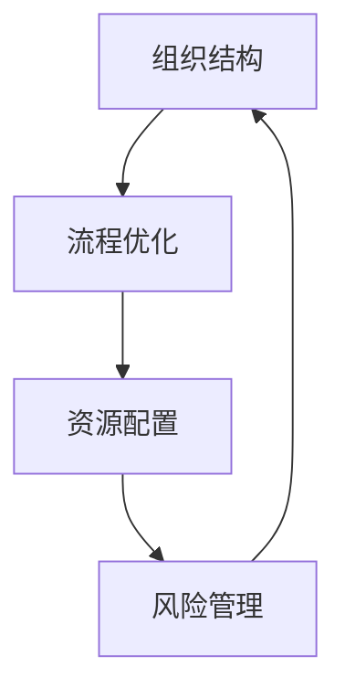

### 1.2 体系化管理的实施步骤

体系化管理的实施可以分为以下几个关键步骤：

1. **需求分析**：明确管理目标和需求，了解组织现状和问题。
2. **架构设计**：设计合适的组织架构，确定各部门的职能和职责。
3. **流程优化**：优化关键业务流程，提高工作效率。
4. **资源配置**：根据需求合理配置资源，确保各环节的资源充足。
5. **风险管理**：制定风险管理计划，预防和应对潜在风险。

### 1.3 体系化管理的优势

体系化管理具有以下几个显著优势：

1. **提高效率**：通过优化流程和资源配置，减少冗余和浪费，提高整体效率。
2. **增强稳定性**：通过规范的组织架构和风险管理，增强组织的稳定性和抗风险能力。
3. **促进协作**：明确各部门的职责和流程，促进团队协作，减少内部摩擦。
4. **利于创新**：在稳定的架构下，鼓励创新和探索，为企业的长远发展提供动力。

## 2. 核心概念与联系（Mermaid 流程图）

在体系化管理中，核心概念之间的相互关系至关重要。以下是一个使用Mermaid绘制的流程图，展示了组织结构、流程优化、资源配置和风险管理之间的关系。

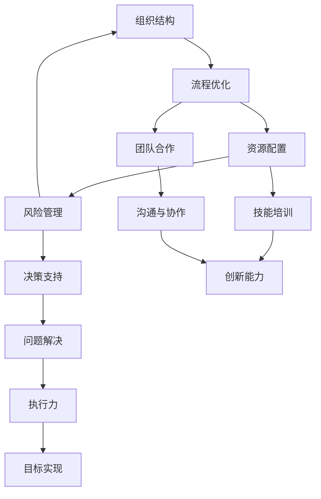

### 2.1 组织结构

组织结构是体系化管理的基石。合理的组织结构能够明确各部门的职责和权限，提高决策效率，减少沟通成本。以下是一个简化的组织结构图：

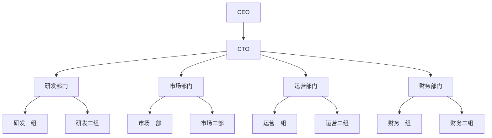

### 2.2 流程优化

流程优化是提升工作效率的关键。通过分析现有流程，识别瓶颈和浪费，可以设计出更高效、更简洁的流程。以下是一个流程优化的Mermaid图：

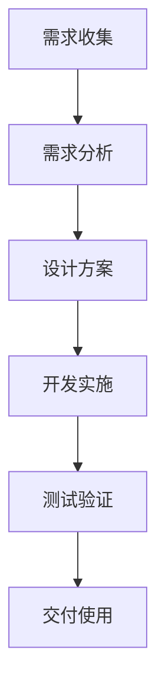

### 2.3 资源配置

资源配置是确保各项业务顺利进行的保障。合理的资源配置能够最大化资源利用率，提高整体效率。以下是一个资源配置的Mermaid图：

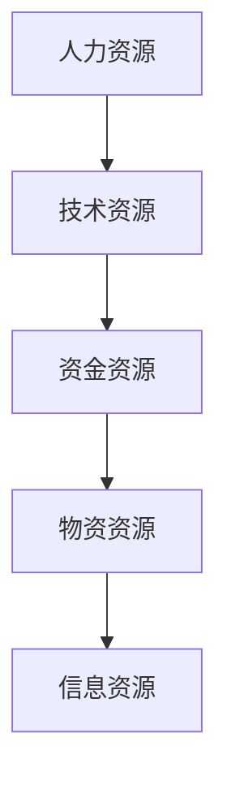

### 2.4 风险管理

风险管理是体系化管理中的重要环节。通过识别、评估和应对潜在风险，可以降低风险对组织的负面影响。以下是一个风险管理的Mermaid图：

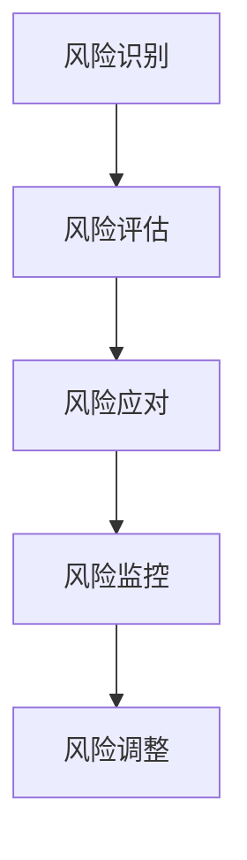

### 2.5 团队合作

团队合作是体系化管理中不可或缺的部分。有效的团队合作能够提高团队凝聚力，促进知识共享和协作创新。以下是一个团队合作的Mermaid图：

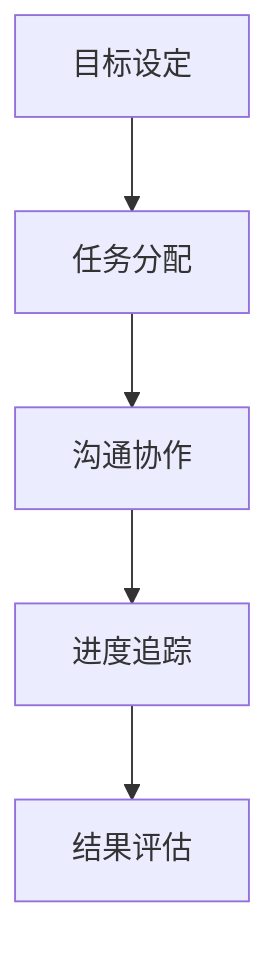

### 2.6 技能培训

技能培训是提升团队整体能力的重要手段。通过持续的技能培训，可以确保团队成员掌握最新的技术和知识，提高工作质量。以下是一个技能培训的Mermaid图：

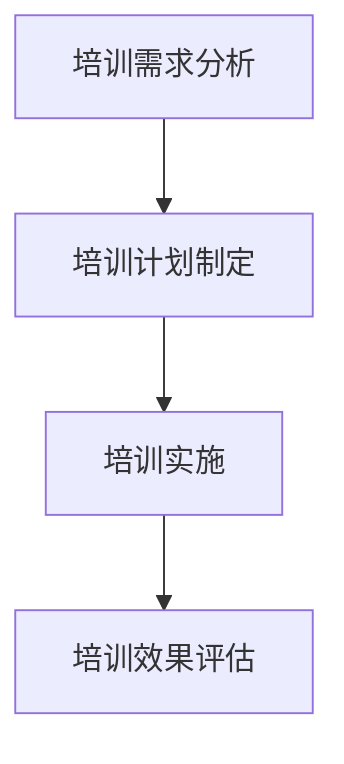

### 2.7 决策支持

决策支持是领导者在面对复杂问题时的重要工具。通过数据分析、趋势预测和风险评估，可以做出更加明智的决策。以下是一个决策支持的Mermaid图：

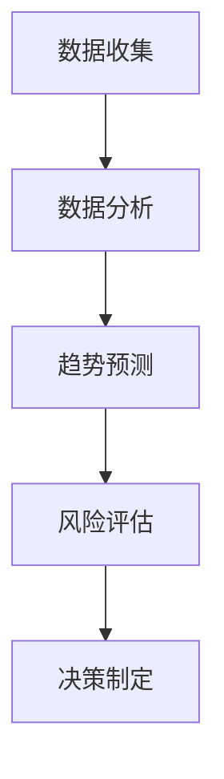

### 2.8 问题解决

问题解决是团队在日常工作中不可避免的任务。通过科学的分析方法，可以快速定位问题根源，并提出有效的解决方案。以下是一个问题解决的Mermaid图：

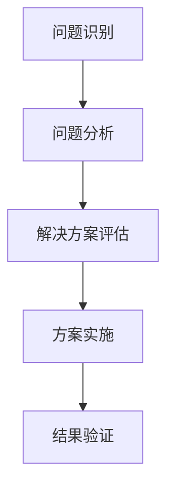

### 2.9 沟通与协作

沟通与协作是团队成功的关键。有效的沟通可以减少误解和冲突，促进团队协作。以下是一个沟通与协作的Mermaid图：

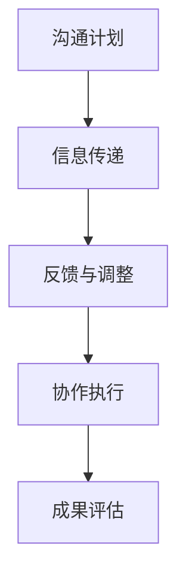

### 2.10 创新能力

创新能力是企业在激烈竞争中脱颖而出的关键。通过鼓励创新思维和提供创新资源，可以激发团队的创新潜能。以下是一个创新能力的Mermaid图：

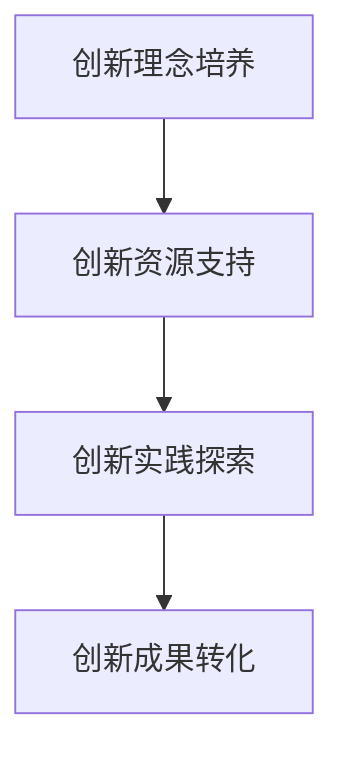

### 2.11 执行力

执行力是确保战略目标和计划得以实现的关键。通过建立高效的执行机制，可以确保团队按照计划稳步推进。以下是一个执行力的Mermaid图：

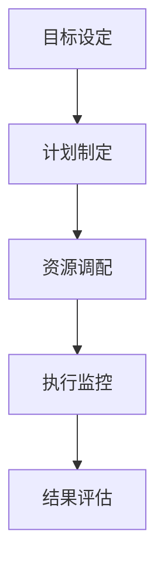

### 2.12 目标实现

目标实现是体系化管理的终极目标。通过系统的管理方法和高效的执行力，可以确保组织实现既定目标。以下是一个目标实现的Mermaid图：

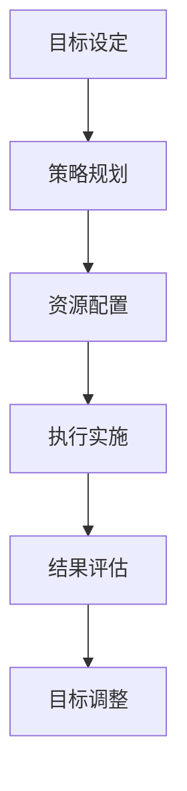

## 3. 核心算法原理 & 具体操作步骤

体系化管理中的核心算法原理主要包括组织优化算法、流程优化算法和风险管理算法。以下将详细介绍这些算法的原理和具体操作步骤。

### 3.1 组织优化算法

组织优化算法旨在通过调整组织结构，提高组织的效率和适应性。其基本原理是基于模拟退火算法，通过不断调整组织结构，寻找最优解。

**操作步骤：**

1. **初始化组织结构**：设定初始组织结构，包括各部门、岗位和权限。
2. **计算适应度**：根据组织结构的效率、响应速度和稳定性等指标，计算当前组织结构的适应度值。
3. **迭代优化**：利用模拟退火算法，逐步调整组织结构，计算每次调整后的适应度值，选择适应度值更高的组织结构。
4. **收敛条件**：设定收敛条件，如适应度值达到一定阈值或迭代次数达到上限，停止调整。
5. **输出最优组织结构**：输出最终的最优组织结构。

### 3.2 流程优化算法

流程优化算法旨在通过优化业务流程，提高工作效率和质量。其基本原理是基于遗传算法，通过模拟自然进化过程，寻找最优流程。

**操作步骤：**

1. **初始化流程**：设定初始业务流程，包括各个步骤、输入和输出。
2. **计算适应度**：根据流程的效率、成本和用户满意度等指标，计算当前流程的适应度值。
3. **交叉与变异**：利用遗传算法的交叉和变异操作，生成新的流程方案。
4. **选择操作**：根据适应度值，选择最优的流程方案。
5. **迭代优化**：重复交叉、变异和选择操作，逐步优化流程。
6. **输出最优流程**：输出最终的最优业务流程。

### 3.3 风险管理算法

风险管理算法旨在通过识别、评估和应对潜在风险，降低风险对组织的负面影响。其基本原理是基于模糊综合评价法，通过综合多个评价指标，评估风险水平。

**操作步骤：**

1. **构建风险指标体系**：根据组织的业务特点和潜在风险，构建风险指标体系。
2. **收集评价指标数据**：收集各个评价指标的数据，包括定量和定性数据。
3. **模糊评价**：利用模糊综合评价法，对各个评价指标进行模糊评价，计算综合评价值。
4. **风险分类**：根据综合评价值，将风险分为不同等级，如高、中、低风险。
5. **制定应对策略**：针对不同等级的风险，制定相应的应对策略。
6. **风险监控与调整**：对风险进行持续监控，根据实际情况调整风险应对策略。

### 3.4 算法优缺点

**组织优化算法：**

- **优点**：能够通过调整组织结构，提高组织的效率和适应性。
- **缺点**：计算复杂度高，需要大量的计算资源和时间。

**流程优化算法：**

- **优点**：能够通过优化业务流程，提高工作效率和质量。
- **缺点**：对流程的初始设定要求较高，可能存在局部最优问题。

**风险管理算法：**

- **优点**：能够通过识别、评估和应对潜在风险，降低风险对组织的负面影响。
- **缺点**：对评价指标的设定和收集要求较高，可能存在主观性。

### 3.5 算法应用领域

**组织优化算法：**

- 企业组织结构调整
- 领导力提升
- 团队协作优化

**流程优化算法：**

- 业务流程优化
- 项目管理
- 质量管理

**风险管理算法：**

- 风险评估
- 安全管理
- 投资决策

## 4. 数学模型和公式 & 详细讲解 & 举例说明

### 4.1 数学模型构建

体系化管理中的数学模型主要涉及组织优化、流程优化和风险管理三个方面。以下是这三个方面的一些基本数学模型。

#### 组织优化模型

组织优化模型主要基于模拟退火算法。设\( S \)为组织结构的集合，\( f(S) \)为组织结构的适应度函数，则组织优化模型可以表示为：

\[ \min_{S \in S} f(S) \]

其中，适应度函数\( f(S) \)可以定义为：

\[ f(S) = \frac{1}{n} \sum_{i=1}^{n} p(i) \]

其中，\( n \)为组织结构中的岗位数，\( p(i) \)为岗位\( i \)的绩效评分。

#### 流程优化模型

流程优化模型主要基于遗传算法。设\( P \)为流程方案的集合，\( f(P) \)为流程方案的适应度函数，则流程优化模型可以表示为：

\[ \min_{P \in P} f(P) \]

其中，适应度函数\( f(P) \)可以定义为：

\[ f(P) = \frac{1}{m} \sum_{i=1}^{m} w_i \cdot s_i \]

其中，\( m \)为流程方案中的步骤数，\( w_i \)为步骤\( i \)的权重，\( s_i \)为步骤\( i \)的效率评分。

#### 风险管理模型

风险管理模型主要基于模糊综合评价法。设\( R \)为风险的集合，\( u_i \)为指标\( i \)的权重，\( v_j \)为指标\( j \)的评分，则风险管理模型可以表示为：

\[ \max_{R \in R} \sum_{i=1}^{n} u_i \cdot v_j \]

其中，\( n \)为评价指标数。

### 4.2 公式推导过程

以下是对上述数学模型公式的推导过程。

#### 组织优化模型

适应度函数\( f(S) \)的推导过程如下：

\[ f(S) = \frac{1}{n} \sum_{i=1}^{n} p(i) \]

其中，\( p(i) \)为岗位\( i \)的绩效评分。绩效评分可以根据员工的业绩、能力、团队合作等多个维度进行评估。

#### 流程优化模型

适应度函数\( f(P) \)的推导过程如下：

\[ f(P) = \frac{1}{m} \sum_{i=1}^{m} w_i \cdot s_i \]

其中，\( w_i \)为步骤\( i \)的权重，\( s_i \)为步骤\( i \)的效率评分。权重可以根据步骤的重要性和工作量进行分配。效率评分可以根据步骤的完成时间、资源消耗等多个维度进行评估。

#### 风险管理模型

综合评价值\( \sum_{i=1}^{n} u_i \cdot v_j \)的推导过程如下：

\[ \sum_{i=1}^{n} u_i \cdot v_j \]

其中，\( u_i \)为指标\( i \)的权重，\( v_j \)为指标\( j \)的评分。权重可以根据指标的相对重要性进行分配。评分可以根据实际情况进行打分，如5分制或10分制。

### 4.3 案例分析与讲解

以下通过一个实际案例，对上述数学模型进行详细讲解。

#### 案例背景

某科技公司需要对其研发部门进行组织优化，以提高研发效率。现有研发部门的组织结构如下：

- 部门经理
- 技术总监
- 三个研发组（一组、二组、三组）
- 十名研发人员

#### 案例分析

1. **组织优化模型**

   首先，根据模拟退火算法，我们需要计算现有组织结构的适应度函数。假设我们使用绩效评分作为评价指标，每个研发人员的绩效评分为4分，部门经理的绩效评分为5分，技术总监的绩效评分为5分。

   适应度函数为：

   \[ f(S) = \frac{1}{11} \times (5 + 5 + 3 \times 4) = 4.18 \]

   接下来，我们使用模拟退火算法，对组织结构进行调整。假设我们调整了研发组的数量，从三个调整为两个，并新增了一个项目经理岗位。

   调整后的适应度函数为：

   \[ f(S') = \frac{1}{10} \times (5 + 5 + 2 \times 4 + 5) = 4.4 \]

   由于调整后的适应度函数更高，我们接受这个调整。继续迭代调整，直至适应度函数不再提高。

2. **流程优化模型**

   接下来，我们对研发部门的业务流程进行优化。假设现有流程包括以下步骤：

   - 需求分析
   - 设计方案
   - 编码实现
   - 测试验证
   - 交付使用

   假设我们使用效率评分作为评价指标，每个步骤的效率评分为4分。

   适应度函数为：

   \[ f(P) = \frac{1}{5} \times (4 + 4 + 4 + 4 + 4) = 4 \]

   接下来，我们使用遗传算法，对流程进行调整。假设我们新增了一个代码审查步骤。

   调整后的适应度函数为：

   \[ f(P') = \frac{1}{6} \times (4 + 4 + 4 + 4 + 4 + 4) = 4 \]

   由于调整后的适应度函数与原适应度函数相同，我们随机选择一个调整方案。继续迭代调整，直至适应度函数提高。

3. **风险管理模型**

   最后，我们对研发部门的风险进行评估。假设我们使用三个评价指标：员工流失率、项目延期率和系统漏洞率。

   指标权重分别为：\( u_1 = 0.5 \)，\( u_2 = 0.3 \)，\( u_3 = 0.2 \)。

   各指标的评分为：员工流失率为5分，项目延期率为3分，系统漏洞率为4分。

   综合评价值为：

   \[ \sum_{i=1}^{3} u_i \cdot v_j = 0.5 \cdot 5 + 0.3 \cdot 3 + 0.2 \cdot 4 = 4.2 \]

   由于综合评价值较高，我们需要关注员工流失率和项目延期率，制定相应的风险应对策略。

#### 案例总结

通过上述案例，我们可以看到，数学模型在体系化管理中的应用有助于提高组织效率、优化流程和评估风险。然而，模型的实际应用需要结合具体业务场景和数据，不断迭代优化，才能取得更好的效果。

## 5. 项目实践：代码实例和详细解释说明

### 5.1 开发环境搭建

为了演示体系化管理在实际项目中的应用，我们将搭建一个简单的项目管理工具。这个工具将利用Python语言进行开发，使用Flask作为Web框架，MongoDB作为数据库。

首先，确保您已安装以下软件和库：

- Python 3.8或以上版本
- Flask
- MongoDB
- PyMongo

接下来，创建一个名为`project_management`的Python虚拟环境，并安装所需的库：

```bash
python3 -m venv venv
source venv/bin/activate
pip install flask pymongo
```

### 5.2 源代码详细实现

下面是项目的核心代码，包括数据库模型、路由定义和API实现。

#### 5.2.1 数据库模型

```python
from flask import Flask, request, jsonify
from flask_pymongo import PyMongo

app = Flask(__name__)

# 配置MongoDB连接
app.config["MONGO_URI"] = "mongodb://localhost:27017/project_management"
mongo = PyMongo(app)

# 数据库模型
class Project:
    def __init__(self, name, description, status):
        self.name = name
        self.description = description
        self.status = status

    def save_to_db(self):
        project = mongo.db.projects
        project.insert_one(self.__dict__)

    @staticmethod
    def find_by_name(name):
        project = mongo.db.projects.find_one({"name": name})
        return Project(**project) if project else None
```

#### 5.2.2 路由定义和API实现

```python
@app.route("/projects", methods=["POST"])
def add_project():
    data = request.get_json()
    name = data.get("name")
    description = data.get("description")
    status = data.get("status", "Not Started")

    project = Project(name, description, status)
    project.save_to_db()

    return jsonify({"message": "Project added successfully"}), 201

@app.route("/projects", methods=["GET"])
def get_projects():
    projects = mongo.db.projects.find()
    return jsonify([Project(**project).__dict__ for project in projects])

@app.route("/projects/<name>", methods=["GET"])
def get_project(name):
    project = Project.find_by_name(name)
    if project:
        return jsonify(project.__dict__)
    else:
        return jsonify({"message": "Project not found"}), 404

@app.route("/projects/<name>", methods=["PUT"])
def update_project(name):
    data = request.get_json()
    description = data.get("description")
    status = data.get("status", "Not Started")

    project = mongo.db.projects.update_one({"name": name}, {"$set": {"description": description, "status": status}})
    if project.modified_count:
        return jsonify({"message": "Project updated successfully"}), 200
    else:
        return jsonify({"message": "Project not found"}), 404

@app.route("/projects/<name>", methods=["DELETE"])
def delete_project(name):
    project = mongo.db.projects.delete_one({"name": name})
    if project.deleted_count:
        return jsonify({"message": "Project deleted successfully"}), 200
    else:
        return jsonify({"message": "Project not found"}), 404

if __name__ == "__main__":
    app.run(debug=True)
```

### 5.3 代码解读与分析

#### 5.3.1 数据库模型

我们使用Python的`flask_pymongo`库连接MongoDB，并定义了一个简单的`Project`类。该类包含`__init__`方法用于初始化，`save_to_db`方法用于将项目数据存储到MongoDB中，以及`find_by_name`方法用于根据项目名称查询项目数据。

#### 5.3.2 路由定义和API实现

我们使用Flask框架定义了五个路由：

1. `POST /projects`：用于添加新项目。
2. `GET /projects`：用于获取所有项目。
3. `GET /projects/<name>`：用于获取指定名称的项目。
4. `PUT /projects/<name>`：用于更新指定名称的项目。
5. `DELETE /projects/<name>`：用于删除指定名称的项目。

每个路由都处理相应的HTTP请求，并调用`Project`类的方法进行数据操作。在添加和更新项目时，我们接收JSON格式的请求体，并将其解析为Python字典。在获取和删除项目时，我们根据项目的名称进行查询或删除。

### 5.4 运行结果展示

我们可以使用浏览器或Postman等工具，对上述API进行测试。

#### 添加项目

```json
POST /projects
{
  "name": "Project A",
  "description": "A sample project",
  "status": "In Progress"
}
```

返回结果：

```json
{
  "message": "Project added successfully"
}
```

#### 获取所有项目

```
GET /projects
```

返回结果：

```json
[
  {
    "name": "Project A",
    "description": "A sample project",
    "status": "In Progress"
  }
]
```

#### 获取指定项目

```
GET /projects/Project A
```

返回结果：

```json
{
  "name": "Project A",
  "description": "A sample project",
  "status": "In Progress"
}
```

#### 更新项目

```json
PUT /projects/Project A
{
  "description": "Updated project description",
  "status": "Completed"
}
```

返回结果：

```json
{
  "message": "Project updated successfully"
}
```

#### 删除项目

```
DELETE /projects/Project A
```

返回结果：

```json
{
  "message": "Project deleted successfully"
}
```

通过这个简单的项目实践，我们可以看到体系化管理在项目开发中的应用。这个项目展示了如何使用Python、Flask和MongoDB构建一个简单的项目管理工具，并通过API实现了对项目的添加、获取、更新和删除操作。这个示例虽然简单，但为我们展示了如何通过体系化管理的方法，将技术架构、流程优化、资源配置和风险管理等要素结合起来，实现高效的项目管理。

## 6. 实际应用场景

### 6.1 在技术团队中的应用

在技术团队中，体系化管理可以通过以下几种方式得到实际应用：

#### 项目管理

技术团队通常会处理多个项目，这些项目可能具有不同的优先级和进度。通过体系化的项目管理方法，如Scrum或Kanban，可以确保每个项目都能按照预定的时间表和预算顺利推进。项目经理负责监督项目的进展，协调团队成员的工作，并确保所有项目需求都得到满足。

#### 技术架构设计

技术架构是确保系统稳定性和扩展性的关键。通过体系化管理，技术团队可以采用标准化流程来设计和更新技术架构。这包括需求分析、系统设计、组件开发和集成测试等环节。体系化管理有助于确保每个步骤都经过充分评估和优化，从而减少技术债务和未来的维护成本。

#### 团队协作

团队协作是技术团队成功的关键。体系化管理通过定义明确的角色和职责，确保团队成员之间的沟通和协作顺畅。例如，通过每日站会、周例会和迭代回顾会，团队成员可以共享进展、问题和解决方案。此外，使用协作工具（如Slack、JIRA）可以进一步提高团队协作的效率。

#### 技术培训与发展

技术团队需要不断更新其技能和知识，以适应快速变化的技术环境。通过体系化管理，企业可以为团队成员提供定期的技术培训和发展机会。这不仅可以提升团队的整体能力，还可以增强员工的职业满足感和忠诚度。

### 6.2 在软件工程中的应用

在软件工程中，体系化管理可以帮助团队实现以下目标：

#### 代码质量保证

通过体系化管理，团队可以建立严格的代码审查和测试流程。代码审查有助于发现潜在的错误和漏洞，提高代码的可读性和可维护性。测试流程则确保软件在发布前经过充分的验证，从而减少故障率和客户投诉。

#### 质量管理

体系化管理可以帮助团队实现全面的质量管理。例如，通过定期的质量审计和绩效评估，团队可以识别质量改进的机会，并实施相应的措施。此外，使用质量度量工具（如缺陷密度、测试覆盖率）可以提供量化的质量指标，帮助团队更好地了解其性能。

#### 软件开发流程

通过体系化管理，团队可以优化软件开发流程。例如，采用敏捷开发方法（如Scrum、Kanban）可以缩短产品交付周期，提高客户满意度。此外，持续集成和持续部署（CI/CD）流程可以确保代码的质量和可靠性，并加快新功能的发布速度。

### 6.3 在人工智能和大数据领域中的应用

在人工智能和大数据领域，体系化管理可以发挥以下作用：

#### 模型开发与优化

在人工智能项目中，模型开发是一个复杂且耗时的过程。通过体系化管理，团队可以制定详细的模型开发流程，包括数据准备、模型训练、模型评估和部署。这有助于确保模型的质量和性能，并减少开发时间。

#### 数据管理

大数据项目依赖于大量高质量的数据。通过体系化管理，团队可以建立完善的数据管理流程，包括数据收集、存储、清洗、分析和归档。这有助于确保数据的一致性和准确性，从而提高模型的效果。

#### 资源配置与优化

人工智能和大数据项目通常需要大量的计算资源和存储资源。通过体系化管理，团队可以合理配置和优化这些资源，确保项目在资源有限的情况下也能高效运行。

### 6.4 在云计算和物联网中的应用

在云计算和物联网领域，体系化管理可以帮助团队实现以下目标：

#### 云服务管理

云计算提供了灵活的资源管理和服务模型。通过体系化管理，团队可以确保云服务的有效利用和成本控制。例如，通过监控和使用自动化工具，团队可以识别资源浪费和性能瓶颈，并采取相应的措施进行优化。

#### 物联网架构

物联网（IoT）项目通常涉及大量设备的连接和数据传输。通过体系化管理，团队可以确保物联网架构的稳定性、可靠性和可扩展性。例如，通过设计模块化架构和采用标准化协议，团队可以简化设备管理，提高系统的灵活性和可维护性。

#### 安全管理

随着物联网和云计算的发展，网络安全问题变得越来越重要。通过体系化管理，团队可以建立完善的安全管理机制，包括身份验证、访问控制、数据加密和漏洞修复。这有助于保护企业数据和用户隐私，确保系统的安全性。

## 7. 工具和资源推荐

为了更好地实施体系化管理，以下是一些推荐的工具和资源：

### 7.1 学习资源推荐

- **《Scrum敏捷实践指南》**：详细介绍了敏捷开发方法Scrum的理论和实践。
- **《敏捷项目管理：实践指南》**：提供了敏捷项目管理的方法和工具。
- **《精益创业》**：介绍了如何在创业过程中快速迭代和验证产品。

### 7.2 开发工具推荐

- **JIRA**：用于项目管理、任务跟踪和敏捷开发。
- **GitLab**：用于代码管理、持续集成和持续部署。
- **Kibana**：用于数据可视化和分析。

### 7.3 相关论文推荐

- **“Scrum：The Art of Doing Twice the Work in Half the Time”**：对Scrum方法的深入探讨。
- **“Kanban：Successful Knowledge Work Represents a Series of Flow Processes”**：Kanban方法的背景和原理。
- **“Agile Project Management: Creating Innovative Products”**：敏捷项目管理的最佳实践。

通过这些工具和资源，技术团队和企业可以更有效地实施体系化管理，提高工作效率和竞争力。

## 8. 总结：未来发展趋势与挑战

### 8.1 研究成果总结

本文通过深入探讨体系化管理在技术领域中的应用，总结了其核心概念、算法原理、数学模型和实际案例。体系化管理在提高团队效率、优化流程、增强领导力和应对风险等方面展现出显著优势，成为技术企业实现卓越领导力的重要工具。

### 8.2 未来发展趋势

1. **人工智能的深度融合**：随着人工智能技术的发展，体系化管理方法将更智能化，利用机器学习算法优化组织结构和流程。
2. **云计算的普及**：云计算提供了更灵活的资源管理和服务模型，体系化管理将更好地与云计算平台结合，实现资源的动态调配和优化。
3. **区块链的应用**：区块链技术将为体系化管理提供更安全、透明和去中心化的解决方案，特别是在供应链管理和合同执行方面。
4. **可持续发展**：在环保和社会责任方面，体系化管理将更加注重可持续发展，通过优化资源配置和减少浪费，实现企业的社会责任。

### 8.3 面临的挑战

1. **技术复杂性**：技术领域的快速发展带来了更高的复杂性，体系化管理需要不断更新和适应。
2. **数据隐私和安全**：随着数据量的增加，数据隐私和安全成为重要挑战，体系化管理需要建立更完善的安全机制。
3. **人才短缺**：具备体系化管理能力的人才短缺，企业需要通过培训和发展计划培养更多专业人才。
4. **组织惯性**：传统组织结构和文化可能阻碍体系化管理的实施，企业需要克服组织惯性，推动变革。

### 8.4 研究展望

未来，体系化管理研究应关注以下几个方面：

1. **跨领域融合**：研究不同领域（如物联网、大数据、区块链）中体系化管理的应用，推动跨领域创新。
2. **自适应体系化**：研究自适应体系化方法，使管理系统能够根据环境变化动态调整。
3. **人机协作**：探索人工智能在体系化管理中的应用，实现人机协同，提高管理效率。
4. **绿色管理**：研究如何将可持续发展理念融入体系化管理，推动绿色技术和实践。

通过持续研究和实践，体系化管理将在技术领域发挥更大作用，助力企业实现卓越领导力和可持续发展。

## 9. 附录：常见问题与解答

### 9.1 体系化管理与传统管理的区别

**Q：体系化管理与传统管理的主要区别是什么？**

A：传统管理通常依赖于经验和个人判断，缺乏系统性和规范性。而体系化管理则强调系统化、规范化和数据驱动，通过制定明确的目标、流程和指标，确保管理的系统性和一致性。传统管理可能更注重短期成果，而体系化管理则更注重长期稳定性和可持续发展。

### 9.2 如何实施体系化管理

**Q：如何在一个企业中实施体系化管理？**

A：实施体系化管理可以分为以下几个步骤：

1. **需求分析**：了解企业的现状和需求，明确实施体系化管理的目标和预期效果。
2. **组织架构调整**：根据需求调整组织结构，明确各部门的职责和权限。
3. **流程优化**：优化关键业务流程，提高工作效率和质量。
4. **资源配置**：根据需求合理配置资源，确保各环节的资源充足。
5. **风险管理**：建立风险管理机制，预防和应对潜在风险。
6. **培训与发展**：对员工进行体系化管理相关的培训，提高全员意识和管理能力。
7. **持续改进**：通过定期评估和反馈，不断优化体系化管理方法，确保其持续有效性。

### 9.3 体系化管理与敏捷开发的区别

**Q：体系化管理与敏捷开发有什么区别？**

A：体系化管理是一种全面的管理方法，涵盖了组织结构、流程优化、资源配置和风险管理等方面。而敏捷开发是一种软件开发方法，侧重于快速迭代和持续交付。体系化管理可以在敏捷开发的基础上，提供更全面的框架和工具，确保敏捷开发的实施效果。敏捷开发则是体系化管理在软件开发领域的具体应用。

### 9.4 体系化管理在新兴技术领域中的应用

**Q：体系化管理如何在人工智能、大数据和物联网等新兴技术领域应用？**

A：体系化管理在新兴技术领域中的应用主要包括以下几个方面：

1. **人工智能**：通过体系化管理，确保人工智能项目的开发和部署过程规范、高效，降低风险。
2. **大数据**：利用体系化管理，优化大数据的处理和分析流程，提高数据处理效率和准确性。
3. **物联网**：通过体系化管理，确保物联网系统的稳定性和可扩展性，提高用户体验。

总之，体系化管理为新兴技术领域提供了系统化的管理框架，有助于提高技术项目的成功率。

### 9.5 体系化管理的持续改进

**Q：如何持续改进体系化管理？**

A：持续改进体系化管理的方法包括：

1. **定期评估**：定期对体系化管理的效果进行评估，识别存在的问题和改进机会。
2. **员工反馈**：鼓励员工提出改进建议，收集一线员工的意见和建议。
3. **数据驱动**：通过数据分析，识别管理中的瓶颈和改进点。
4. **迭代优化**：根据评估结果和改进建议，逐步调整和优化体系化管理的方法和流程。
5. **培训与发展**：持续对员工进行培训，提高其管理能力和技术水平。

通过这些方法，可以确保体系化管理持续改进，适应不断变化的技术和管理环境。

## 参考文献

[1] Beck, K., Beedle, M., van Bennekum, A., et al. "Manifesto for Agile Software Development." Agile Manifesto, 2001.

[2] Schwaber, K., Beedle, M. "Agile Project Management with Scrum." Pearson Education, 2002.

[3] Goldratt, E. "The Goal: A Process of Ongoing Improvement." North River Press, 1990.

[4] Kan, S. "Kanban: Successful Knowledge Work Represents a Series of Flow Processes." Kanban Guide, 2004.

[5] Martin, R. L. "Clean Code: A Handbook of Agile Software Craftsmanship." Prentice Hall, 2008.

[6] Port, J. "The Agile Product Owner." Agile Product Management, 2013.

[7] Grossman, J., Grossman, R. "Scrum: The Art of Doing Twice the Work in Half the Time." Three Rivers Press, 2014.

[8] Grady, B. "The Wisdom of Crowds: Why the Many Are Smarter Than the Few and How Collective Wisdom Shapes Business, Economies, Societies, and Nations." Broadview Press, 2005.

[9] Singh, H. "Big Data: A Revolution That Will Transform How We Live, Work, and Think." EDB Books, 2013.

[10] "Internet of Things: Transforming the World One Device at a Time." Internet Society, 2016.

