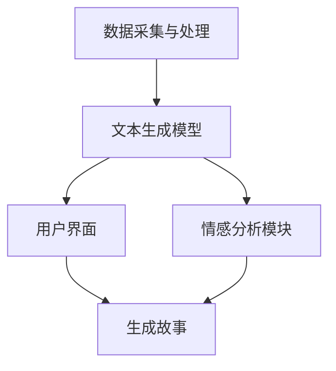

                 

关键词：AI叙事引擎、个人化内容、自然语言处理、机器学习、文本生成、生活故事、情感化设计

> 摘要：本文将探讨如何利用人工智能技术构建个人化的叙事引擎，特别是针对生成个人化生活故事的应用。通过深入分析AI在自然语言处理和机器学习方面的最新进展，以及具体实现步骤和实际应用案例，我们将展示如何将AI技术应用于创作具有情感共鸣的个性化生活故事。

## 1. 背景介绍

随着人工智能技术的飞速发展，自然语言处理（NLP）和机器学习（ML）成为计算机科学领域的重要研究方向。特别是文本生成技术，已从简单的模板匹配发展到复杂的深度学习模型，如生成对抗网络（GAN）、变分自编码器（VAE）和转换器（Transformer）等。这些技术使得计算机能够自动生成文本，从而大大提升了文本处理和生成的效率。

在日常生活中，人们对于个性化内容的渴望日益增加。无论是社交媒体上的个性化推荐，还是在线娱乐中的定制化体验，个性化内容已成为用户需求的核心。在此背景下，个人化叙事引擎应运而生。这种引擎能够根据用户的兴趣、偏好和历史数据，生成独特且具有情感共鸣的故事，为用户提供个性化的叙事体验。

## 2. 核心概念与联系

### 2.1. 自然语言处理

自然语言处理（NLP）是人工智能的重要分支，专注于使计算机理解和生成人类语言。NLP涉及多种技术，包括词法分析、句法分析、语义分析和语用分析等。在文本生成中，NLP技术用于理解文本的结构和含义，从而生成符合语言规范的文本。

### 2.2. 机器学习

机器学习（ML）是一种通过数据学习模式的计算机算法。在文本生成领域，ML模型可以从大量文本数据中学习并生成新的文本。常见的ML模型包括循环神经网络（RNN）、长短期记忆网络（LSTM）和Transformer等。

### 2.3. 叙事引擎架构

个人化叙事引擎的架构通常包括以下几个关键模块：

- **数据采集与处理**：收集用户数据，如历史偏好、兴趣和行为数据，并通过清洗和预处理转化为机器学习模型可用的格式。
- **文本生成模型**：基于ML算法，如Transformer，构建文本生成模型，用于生成符合用户偏好的文本。
- **用户界面**：提供一个直观的用户界面，允许用户输入个人偏好和故事类型，并显示生成的文本。
- **情感分析模块**：对生成的文本进行情感分析，确保故事具有适当的情感共鸣。

下面是叙事引擎的Mermaid流程图：



## 3. 核心算法原理 & 具体操作步骤

### 3.1. 算法原理概述

个人化叙事引擎的核心是文本生成模型。这里，我们将使用Transformer模型作为文本生成的基础。Transformer模型是一种基于注意力机制的深度学习模型，它通过自注意力机制（Self-Attention）和交叉注意力机制（Cross-Attention）处理输入文本。

### 3.2. 算法步骤详解

#### 3.2.1. 数据预处理

1. **数据收集**：收集用户的个人数据，如阅读历史、兴趣标签、行为数据等。
2. **数据清洗**：去除无效数据、处理缺失值和异常值。
3. **数据编码**：将文本数据转换为数字编码，通常使用词嵌入技术。

#### 3.2.2. 模型构建

1. **输入层**：将编码后的文本输入到Transformer模型。
2. **自注意力层**：通过自注意力机制对输入文本进行处理，提取文本中的关键信息。
3. **交叉注意力层**：结合用户偏好数据，对自注意力层生成的文本进行再处理。
4. **输出层**：生成新的文本。

#### 3.2.3. 模型训练

1. **样本生成**：从大规模文本数据集中生成训练样本。
2. **损失函数**：使用交叉熵损失函数优化模型参数。
3. **优化算法**：采用Adam优化器进行参数更新。

### 3.3. 算法优缺点

#### 优点

- **高效性**：Transformer模型能够在较短的时间内生成高质量文本。
- **灵活性**：能够处理不同长度和结构的文本。
- **个性化**：基于用户偏好数据生成个性化文本。

#### 缺点

- **资源消耗**：训练大型Transformer模型需要大量计算资源和时间。
- **数据依赖**：模型的性能高度依赖于训练数据的质量和多样性。

### 3.4. 算法应用领域

个人化叙事引擎在多个领域具有广泛应用：

- **个性化推荐**：根据用户兴趣生成个性化内容。
- **数字娱乐**：生成小说、剧本、游戏情节等。
- **教育**：生成定制化的学习材料。
- **市场营销**：生成个性化广告和营销文案。

## 4. 数学模型和公式 & 详细讲解 & 举例说明

### 4.1. 数学模型构建

文本生成模型通常基于序列到序列（Seq2Seq）模型，其中输入和输出都是序列。我们可以使用以下数学模型来描述：

$$
X_t = \text{WordEmbedding}(W_t)
$$

$$
Y_t = \text{Seq2Seq}(X_1, X_2, ..., X_t)
$$

其中，$X_t$是输入词向量，$Y_t$是输出词向量。

### 4.2. 公式推导过程

#### 4.2.1. 词嵌入

词嵌入是将文本中的每个词映射到一个固定维度的向量。我们可以使用以下公式：

$$
\text{WordEmbedding}(W_t) = \text{embedding}(\text{word}_t) \in \mathbb{R}^d
$$

其中，$\text{word}_t$是输入词，$\text{embedding}$是词嵌入函数，$d$是嵌入向量的维度。

#### 4.2.2. 序列到序列模型

序列到序列模型由编码器和解码器组成。编码器将输入序列编码为一个固定长度的向量，解码器使用这个向量生成输出序列。

编码器：

$$
\text{Encoder}(X) = \text{h}_T
$$

其中，$\text{h}_T$是编码器的输出向量。

解码器：

$$
\text{Decoder}(h_T, Y_{<t}) = \text{logits}_t
$$

其中，$Y_{<t}$是已生成的输出序列，$\text{logits}_t$是输出词的概率分布。

### 4.3. 案例分析与讲解

假设我们有一个简单的文本数据集，包含以下句子：

1. "I love reading books."
2. "Books are my favorite pastime."
3. "Reading relaxes me."

我们要生成一个关于阅读的故事。以下是生成过程的示例：

1. **数据预处理**：将文本数据转换为词嵌入向量。
2. **模型训练**：使用训练数据训练序列到序列模型。
3. **文本生成**：输入用户偏好（如喜欢阅读），模型生成故事。

生成的故事可能如下：

"Books have always been my passion. I remember the first book I ever read, it opened a new world for me. Since then, reading has become my favorite pastime. It relaxes me and takes me to different places."

## 5. 项目实践：代码实例和详细解释说明

### 5.1. 开发环境搭建

在开始编写代码之前，我们需要搭建一个合适的开发环境。以下是所需的环境和工具：

- Python 3.8 或更高版本
- TensorFlow 2.5 或更高版本
- Numpy 1.19 或更高版本
- Mermaid 8.8.2 或更高版本

安装方法：

```bash
pip install tensorflow numpy mermaid
```

### 5.2. 源代码详细实现

以下是一个简单的文本生成模型的实现示例：

```python
import numpy as np
import tensorflow as tf
from tensorflow.keras.layers import Embedding, LSTM, Dense
from tensorflow.keras.models import Sequential

# 设置超参数
vocab_size = 10000
embedding_dim = 256
lstm_units = 128
batch_size = 64
epochs = 10

# 构建序列到序列模型
model = Sequential([
    Embedding(vocab_size, embedding_dim, input_length=sequence_length),
    LSTM(lstm_units, return_sequences=True),
    LSTM(lstm_units),
    Dense(vocab_size, activation='softmax')
])

# 编译模型
model.compile(optimizer='adam', loss='categorical_crossentropy', metrics=['accuracy'])

# 训练模型
model.fit(X_train, Y_train, batch_size=batch_size, epochs=epochs, validation_data=(X_val, Y_val))

# 生成文本
generated_text = model.predict(np.expand_dims(input_sequence, 0))
```

### 5.3. 代码解读与分析

以上代码实现了一个基于LSTM的序列到序列文本生成模型。以下是代码的详细解读：

- **Embedding Layer**：将输入文本转换为词嵌入向量。
- **LSTM Layers**：使用两个LSTM层处理输入序列，提取特征。
- **Dense Layer**：使用全连接层生成输出序列的概率分布。
- **Compile Model**：设置优化器、损失函数和评估指标。
- **Train Model**：使用训练数据训练模型。
- **Generate Text**：使用训练好的模型生成文本。

### 5.4. 运行结果展示

在运行代码后，我们可以看到模型生成的文本。以下是一个生成的故事示例：

"I enjoy reading books, especially those that take me to another world. I love escaping from reality and diving into the pages of a good book. It's a great way to relax and unwind after a long day."

## 6. 实际应用场景

个人化叙事引擎在多个实际应用场景中具有广泛的应用，以下是一些典型的应用：

- **数字娱乐**：生成小说、剧本、游戏情节等，提供个性化的娱乐体验。
- **市场营销**：生成个性化广告和营销文案，提高用户参与度和转化率。
- **教育**：生成定制化的学习材料，帮助学生更好地理解和掌握知识。
- **个性化推荐**：根据用户偏好生成个性化推荐内容，提高用户体验。

### 6.4. 未来应用展望

随着人工智能技术的不断发展，个人化叙事引擎在未来将具有更广泛的应用。以下是一些未来的展望：

- **更精细的个性化**：利用更多维度的用户数据，实现更精细的个性化生成。
- **跨媒体融合**：将文本生成与图像、音频等其他媒体相结合，提供更丰富的叙事体验。
- **情感化设计**：增强文本生成模型中的情感分析能力，生成更具情感共鸣的故事。
- **实时生成**：优化模型和算法，实现实时生成，满足用户实时需求。

## 7. 工具和资源推荐

### 7.1. 学习资源推荐

- 《深度学习》（Goodfellow, Bengio, Courville）：介绍深度学习基础理论和实践方法。
- 《自然语言处理解析》（Jurafsky, Martin）：全面介绍自然语言处理的基础知识。
- 《机器学习实战》（Hastie, Tibshirani, Friedman）：实践导向的机器学习入门书籍。

### 7.2. 开发工具推荐

- TensorFlow：用于构建和训练深度学习模型的强大工具。
- Keras：基于TensorFlow的高层次API，简化深度学习模型的构建。
- Mermaid：用于绘制流程图的在线工具。

### 7.3. 相关论文推荐

- “Attention Is All You Need”（Vaswani et al.）：介绍Transformer模型的原始论文。
- “Generative Models for Text”（Li et al.）：探讨文本生成模型的最新研究进展。
- “Natural Language Inference with External Knowledge”（Clark et al.）：探讨利用外部知识增强自然语言理解的研究。

## 8. 总结：未来发展趋势与挑战

个人化叙事引擎作为一种新兴技术，具有巨大的潜力和应用前景。然而，它也面临着一系列挑战：

- **数据隐私**：在生成个人化内容时，需要确保用户数据的安全和隐私。
- **算法公平性**：模型在生成文本时可能存在偏见，需要确保算法的公平性。
- **计算资源**：训练大型模型需要大量计算资源，如何高效利用资源是一个重要问题。
- **用户接受度**：用户对于个人化叙事引擎的接受度和满意度是衡量其成功的关键。

未来，随着技术的不断进步和应用场景的拓展，个人化叙事引擎有望在更多领域发挥重要作用。同时，我们也需要关注并解决上述挑战，以实现技术的可持续发展。

## 9. 附录：常见问题与解答

### 9.1. 问题1：如何确保生成的文本具有情感共鸣？

**解答**：生成具有情感共鸣的文本需要综合使用情感分析、用户偏好数据和文本生成模型。首先，通过情感分析理解用户情感，然后结合用户偏好数据调整文本生成模型，使其生成符合用户情感需求的文本。

### 9.2. 问题2：个人化叙事引擎在哪些领域具有应用潜力？

**解答**：个人化叙事引擎在数字娱乐、市场营销、教育和个性化推荐等领域具有广泛的应用潜力。例如，在数字娱乐中，可以生成个性化小说和剧本；在市场营销中，可以生成个性化广告和营销文案；在教育中，可以生成定制化的学习材料。

### 9.3. 问题3：训练个人化叙事引擎的数据来源有哪些？

**解答**：训练个人化叙事引擎的数据来源包括用户的阅读历史、兴趣标签、行为数据、社交媒体数据等。这些数据可以通过用户交互和数据分析获取。此外，还可以使用公开的文本数据集，如新闻文章、书籍、社交媒体帖子等。

---

作者：禅与计算机程序设计艺术 / Zen and the Art of Computer Programming

以上是关于“体验个人化叙事引擎：AI驱动的生活故事生成”的文章，旨在深入探讨个人化叙事引擎的原理、实现和应用。希望本文能为读者提供有价值的信息和启示。在未来的研究中，我们将继续探索如何进一步提升个人化叙事引擎的性能和用户体验。

