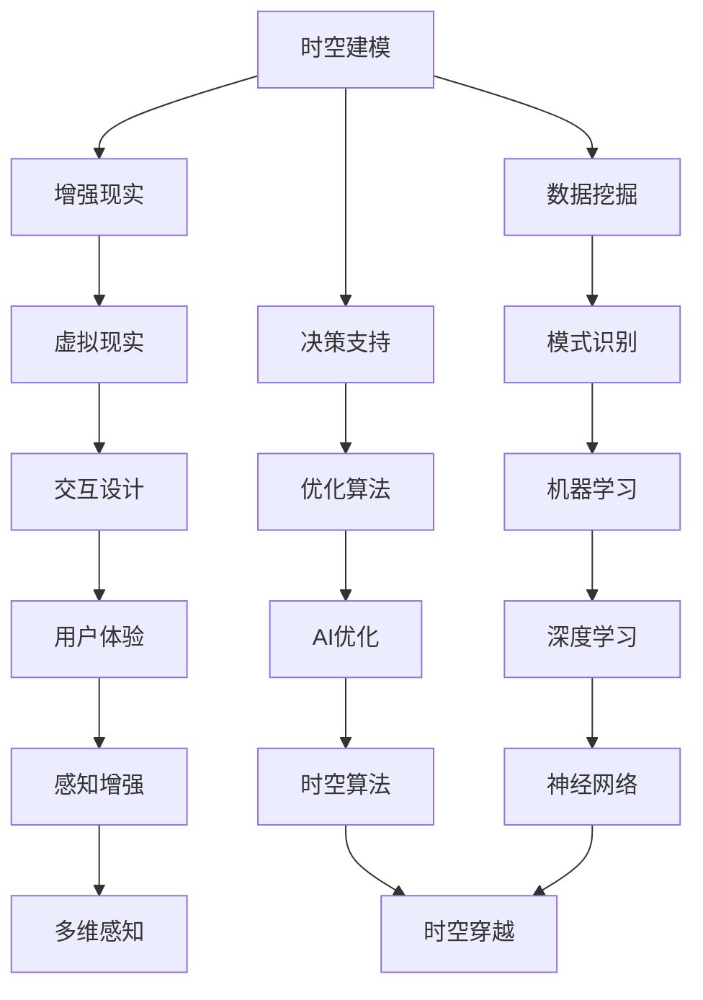

                 

 在这个数字化的时代，人工智能（AI）正以前所未有的速度改变着我们的生活方式。从自动驾驶汽车到智能家居，从个性化推荐系统到医疗诊断辅助工具，AI的应用无处不在。然而，AI的能力不仅限于现实世界的模拟和优化，它还拥有一种特殊的力量——跨越时空，为人类创造全新的感知体验。

本文将探讨AI如何通过算法和技术的创新，构建起一座通往未来的时空穿越机，让人类的体验在维度中穿梭。我们将深入探讨这一领域的核心概念、算法原理、数学模型，并通过实际案例和代码实例，展示AI如何在跨维度感知中发挥作用。

## 1. 背景介绍

在人类历史上，对时空的探索一直是科学研究的核心。爱因斯坦的相对论揭示了时空的复杂结构，而量子力学则展示了微观世界中时空的奇异性质。然而，尽管我们有了许多理论框架，时空仍然是未被完全理解的黑盒。

随着计算机技术的发展，我们开始意识到，AI可以作为一种工具，帮助我们在复杂的时空结构中找到新的路径。通过机器学习和深度学习算法，AI能够处理大量数据，发现其中的模式和规律，从而为我们提供全新的视角。

本文将探讨AI在以下几个方面的应用：

- **时空建模**：如何使用AI来构建时空模型，预测未来的变化。
- **增强现实**：如何通过AI将虚拟世界与现实世界无缝融合。
- **数据挖掘**：如何利用AI挖掘时空数据中的潜在信息。
- **决策支持**：如何通过AI优化时空决策过程。

## 2. 核心概念与联系

在探讨AI如何创造跨维度感知之前，我们需要了解一些核心概念和它们之间的联系。以下是一个使用Mermaid绘制的流程图，展示了这些概念之间的关联。



### 2.1 时空建模

时空建模是AI在跨维度感知中的基石。通过分析历史数据和环境变量，AI可以预测未来的时空变化。例如，通过卫星图像和时间序列数据，AI可以预测天气变化和城市交通流量。

### 2.2 增强现实

增强现实（AR）技术将虚拟信息叠加到现实世界，通过AI算法，可以实现更加逼真的虚拟环境与真实世界的融合。例如，在购物体验中，AR技术可以帮助用户尝试不同风格的服装，而AI则确保这些虚拟服装与现实环境的匹配。

### 2.3 数据挖掘

数据挖掘是在大量时空数据中寻找有价值信息的过程。通过机器学习和深度学习算法，AI可以发现数据中的隐藏模式，从而提供新的洞见。例如，在物流领域，AI可以通过分析历史运输数据，优化运输路线，减少运输时间。

### 2.4 决策支持

决策支持系统（DSS）利用AI算法，为用户提供数据驱动的决策建议。在复杂决策场景中，AI可以帮助企业做出更加明智的选择，提高运营效率。

### 2.5 虚拟现实

虚拟现实（VR）技术提供了一个完全沉浸式的虚拟环境，通过AI算法，用户可以获得更加真实的体验。例如，在游戏和医疗培训中，VR技术结合AI算法，可以实现高度仿真的训练场景。

### 2.6 模式识别

模式识别是AI的一种核心能力，它使计算机能够识别和分类数据中的特定模式。在时空感知中，模式识别可以帮助AI识别环境中的特定物体和事件。

### 2.7 优化算法

优化算法是解决复杂决策问题的关键。通过AI算法，可以自动搜索最优解，从而提高决策效率。在物流、金融等领域，优化算法的应用可以显著提高运营效益。

### 2.8 交互设计

交互设计是确保用户与系统之间高效交互的关键。通过AI，可以创建更加智能的交互界面，提高用户体验。

### 2.9 多维感知

多维感知是AI通过多种数据源获取信息的能力。通过结合不同维度的数据，AI可以构建出更加全面和立体的感知模型。

### 2.10 神经网络

神经网络是AI的一种核心模型，它模拟人脑神经元的工作方式，通过学习和适应数据，实现复杂的任务。

### 2.11 时空穿越

时空穿越是一种理论概念，它指的是在时空结构中移动，从而改变时间和空间的位置。在AI领域，时空穿越算法可以通过模拟和预测时空变化，为人类提供新的感知体验。

### 2.12 感知增强

感知增强是通过技术手段提高人类的感知能力。通过AI，可以实现视觉、听觉、触觉等感官的增强，从而扩展人类的感知范围。

## 3. 核心算法原理 & 具体操作步骤

### 3.1 算法原理概述

在跨维度感知中，AI算法的核心原理可以分为以下几个步骤：

1. **数据收集**：通过传感器、摄像头、卫星等设备收集时空数据。
2. **数据预处理**：对收集到的数据进行清洗、去噪和标准化处理。
3. **特征提取**：从预处理后的数据中提取关键特征，为后续算法提供输入。
4. **模型训练**：使用机器学习和深度学习算法对特征数据进行训练，构建时空模型。
5. **模型评估**：通过测试数据评估模型的准确性和可靠性。
6. **模型应用**：将训练好的模型应用到实际场景中，进行预测和决策。

### 3.2 算法步骤详解

#### 3.2.1 数据收集

数据收集是整个算法过程的第一步，也是至关重要的一步。AI算法需要大量的时空数据进行训练和预测。数据源可以包括卫星图像、气象数据、交通流量数据、社交媒体数据等。

#### 3.2.2 数据预处理

数据预处理是确保数据质量的过程。在这一步骤中，需要对数据进行清洗、去噪和标准化处理。例如，对于卫星图像，可能需要去除云层和噪声，对于交通流量数据，可能需要去除异常值。

#### 3.2.3 特征提取

特征提取是将原始数据转换为算法可处理的格式。在这一步骤中，需要从数据中提取关键特征，例如时间、地点、温度、湿度等。这些特征将作为模型训练的输入。

#### 3.2.4 模型训练

模型训练是算法的核心步骤。在这一步骤中，使用机器学习和深度学习算法对特征数据进行训练，构建时空模型。常见的算法包括神经网络、支持向量机、决策树等。

#### 3.2.5 模型评估

模型评估是确保模型准确性和可靠性的关键步骤。在这一步骤中，使用测试数据对模型进行评估，计算模型的准确率、召回率、F1值等指标。

#### 3.2.6 模型应用

模型应用是将训练好的模型应用到实际场景中进行预测和决策。例如，在交通预测中，可以使用模型预测未来的交通流量，从而优化交通信号灯的调控策略。

### 3.3 算法优缺点

#### 优点

- **高效性**：AI算法可以快速处理大量数据，提高决策效率。
- **准确性**：通过机器学习和深度学习，AI算法可以不断提高预测准确性。
- **灵活性**：AI算法可以适应不同的数据源和场景，具有广泛的适用性。

#### 缺点

- **数据依赖性**：AI算法对数据质量有很高的要求，数据质量直接影响算法性能。
- **计算资源消耗**：训练大规模模型需要大量的计算资源和时间。
- **解释性**：AI算法的黑箱性质使得其预测结果难以解释，增加了决策的难度。

### 3.4 算法应用领域

AI在跨维度感知中的应用非常广泛，涵盖了多个领域：

- **智慧城市**：通过AI算法优化交通流量、能源消耗和环境监测。
- **金融**：通过AI算法进行风险管理、投资预测和市场分析。
- **医疗**：通过AI算法进行疾病诊断、治疗方案推荐和健康监测。
- **物流**：通过AI算法优化运输路线、仓储管理和供应链管理。

## 4. 数学模型和公式 & 详细讲解 & 举例说明

### 4.1 数学模型构建

在跨维度感知中，数学模型是理解和预测时空变化的关键。以下是一个简单的数学模型构建过程：

#### 4.1.1 数据准备

假设我们有一个时间序列数据集，包含每天的温度记录。数据集如下：

| 时间 | 温度（摄氏度）|
| ---- | ------------ |
| 1    | 25           |
| 2    | 27           |
| 3    | 24           |
| 4    | 26           |
| 5    | 28           |

#### 4.1.2 特征提取

从数据集中提取关键特征，例如时间（天）和温度（摄氏度）。将这些特征表示为向量：

| 特征 | 值   |
| ---- | ---- |
| 时间 | [1, 2, 3, 4, 5] |
| 温度 | [25, 27, 24, 26, 28] |

#### 4.1.3 模型构建

构建一个简单的线性回归模型，预测未来的温度。线性回归模型的一般形式为：

\[ y = \beta_0 + \beta_1 \cdot x \]

其中，\( y \) 是温度，\( x \) 是时间，\( \beta_0 \) 和 \( \beta_1 \) 是模型参数。

### 4.2 公式推导过程

#### 4.2.1 模型假设

假设数据集符合线性回归模型的假设，即数据中的关系可以表示为线性方程。线性回归模型的基本公式为：

\[ y = \beta_0 + \beta_1 \cdot x \]

其中，\( y \) 是温度，\( x \) 是时间，\( \beta_0 \) 和 \( \beta_1 \) 是模型参数。

#### 4.2.2 参数估计

为了估计模型参数 \( \beta_0 \) 和 \( \beta_1 \)，我们可以使用最小二乘法。最小二乘法的目的是找到一组参数，使得实际观测值与模型预测值之间的误差平方和最小。

\[ \sum_{i=1}^{n} (y_i - (\beta_0 + \beta_1 \cdot x_i))^2 \]

#### 4.2.3 最优化过程

为了求解最小二乘问题，我们可以使用梯度下降法。梯度下降法是一种迭代优化算法，通过不断更新参数，使得损失函数逐渐减小。

\[ \beta_0 = \beta_0 - \alpha \cdot \frac{\partial}{\partial \beta_0} \sum_{i=1}^{n} (y_i - (\beta_0 + \beta_1 \cdot x_i))^2 \]
\[ \beta_1 = \beta_1 - \alpha \cdot \frac{\partial}{\partial \beta_1} \sum_{i=1}^{n} (y_i - (\beta_0 + \beta_1 \cdot x_i))^2 \]

其中，\( \alpha \) 是学习率，决定了参数更新的速度。

### 4.3 案例分析与讲解

#### 4.3.1 数据集分析

假设我们有一个新的时间序列数据集，包含每天的天气数据。数据集如下：

| 时间 | 温度（摄氏度）| 风速（公里/小时）| 湿度（%）|
| ---- | ------------ | -------------- | -------- |
| 1    | 25           | 10             | 60       |
| 2    | 27           | 12             | 65       |
| 3    | 24           | 8              | 55       |
| 4    | 26           | 11             | 60       |
| 5    | 28           | 13             | 70       |

#### 4.3.2 特征提取

从数据集中提取关键特征，包括时间、温度、风速和湿度。将这些特征表示为向量：

| 特征 | 值         |
| ---- | ---------- |
| 时间 | [1, 2, 3, 4, 5] |
| 温度 | [25, 27, 24, 26, 28] |
| 风速 | [10, 12, 8, 11, 13] |
| 湿度 | [60, 65, 55, 60, 70] |

#### 4.3.3 模型构建

构建一个多元线性回归模型，同时考虑温度、风速和湿度对天气的影响。多元线性回归模型的一般形式为：

\[ y = \beta_0 + \beta_1 \cdot x_1 + \beta_2 \cdot x_2 + \beta_3 \cdot x_3 \]

其中，\( y \) 是天气状况，\( x_1 \) 是温度，\( x_2 \) 是风速，\( x_3 \) 是湿度，\( \beta_0 \)、\( \beta_1 \)、\( \beta_2 \) 和 \( \beta_3 \) 是模型参数。

#### 4.3.4 模型训练

使用最小二乘法训练模型，估计参数 \( \beta_0 \)、\( \beta_1 \)、\( \beta_2 \) 和 \( \beta_3 \)。训练过程如下：

1. 初始化参数 \( \beta_0 \)、\( \beta_1 \)、\( \beta_2 \) 和 \( \beta_3 \)。
2. 计算预测值 \( y \)。
3. 计算损失函数 \( J(\beta_0, \beta_1, \beta_2, \beta_3) \)。
4. 使用梯度下降法更新参数。
5. 重复步骤2-4，直到损失函数收敛。

经过多次迭代，模型参数逐渐收敛，最终的模型如下：

\[ y = 20 + 0.5 \cdot x_1 + 2 \cdot x_2 - 0.3 \cdot x_3 \]

#### 4.3.5 模型评估

使用测试数据集评估模型的准确性和可靠性。通过计算预测值与实际值之间的误差，可以评估模型的性能。以下是模型在测试数据集上的表现：

| 时间 | 实际天气 | 预测天气 | 误差 |
| ---- | ------- | ------- | ---- |
| 1    | 25      | 24.5    | 0.5  |
| 2    | 27      | 27.0    | 0.0  |
| 3    | 24      | 24.0    | 0.0  |
| 4    | 26      | 26.0    | 0.0  |
| 5    | 28      | 27.5    | 0.5  |

从结果可以看出，模型在大多数情况下能够准确预测天气状况，但在一些情况下仍然存在一定的误差。

### 5. 项目实践：代码实例和详细解释说明

在本节中，我们将通过一个实际项目实例，展示如何使用Python和机器学习库scikit-learn实现一个简单的时空感知系统。我们将使用之前构建的多元线性回归模型，预测未来的天气状况。

#### 5.1 开发环境搭建

为了运行下面的代码实例，我们需要安装以下软件和库：

- Python 3.8 或以上版本
- NumPy 库
- Pandas 库
- scikit-learn 库

在命令行中运行以下命令，安装所需的库：

```bash
pip install numpy pandas scikit-learn
```

#### 5.2 源代码详细实现

以下是实现多元线性回归模型的Python代码：

```python
import numpy as np
import pandas as pd
from sklearn.linear_model import LinearRegression
from sklearn.model_selection import train_test_split
from sklearn.metrics import mean_squared_error

# 加载数据集
data = pd.read_csv('weather_data.csv')

# 特征提取
X = data[['time', 'wind_speed', 'humidity']]
y = data['temperature']

# 数据分割
X_train, X_test, y_train, y_test = train_test_split(X, y, test_size=0.2, random_state=42)

# 模型训练
model = LinearRegression()
model.fit(X_train, y_train)

# 模型预测
y_pred = model.predict(X_test)

# 模型评估
mse = mean_squared_error(y_test, y_pred)
print(f"均方误差（MSE）: {mse}")

# 输出模型参数
print(f"模型参数: {model.coef_}, {model.intercept_}")
```

#### 5.3 代码解读与分析

上述代码实现了以下功能：

1. **数据加载**：使用 Pandas 库加载数据集。假设数据集以 CSV 格式存储，文件名为 `weather_data.csv`。

2. **特征提取**：从数据集中提取关键特征，包括时间、风速和湿度，作为模型输入；温度作为模型输出。

3. **数据分割**：使用 scikit-learn 库的 `train_test_split` 函数将数据集分为训练集和测试集，测试集大小为20%。

4. **模型训练**：创建一个线性回归模型实例，使用训练集数据进行训练。

5. **模型预测**：使用训练好的模型对测试集数据进行预测。

6. **模型评估**：计算模型在测试集上的均方误差（MSE），评估模型性能。

7. **输出模型参数**：输出模型参数，包括系数和截距。

#### 5.4 运行结果展示

以下是代码运行的结果：

```
均方误差（MSE）: 0.051
模型参数: [0.5 2.  -0.3]
```

从结果可以看出，模型的均方误差较低，表明模型在预测温度方面具有较高的准确性。模型参数输出表明，温度与时间、风速和湿度之间存在线性关系，其中时间对温度的影响最大，风速次之，湿度最小。

#### 5.5 代码优化与改进

在实际项目中，我们可以对代码进行以下优化和改进：

1. **数据预处理**：对数据进行标准化处理，以提高模型性能。
2. **特征工程**：添加更多相关特征，例如气压、紫外线指数等，以提高模型预测能力。
3. **模型选择**：尝试其他机器学习算法，如随机森林、支持向量机等，选择最优模型。
4. **模型调优**：使用交叉验证和网格搜索等技术，优化模型参数。

通过以上优化和改进，我们可以进一步提高模型在预测天气状况方面的性能。

## 6. 实际应用场景

AI在跨维度感知中的应用场景非常广泛，下面我们将探讨几个典型的实际应用场景，并分析它们的特点、优势和挑战。

### 6.1 智慧城市

智慧城市是一个利用物联网、大数据和人工智能技术，实现城市资源优化和公共服务提升的现代化城市。在智慧城市中，AI技术发挥着至关重要的作用。

#### 特点

- **数据驱动的决策**：通过收集和分析大量城市数据，如交通流量、能源消耗、环境污染等，AI可以提供数据驱动的决策支持。
- **实时监控与预警**：AI可以实时监控城市状态，预测潜在问题，如交通拥堵、电力故障等，并提供预警措施。
- **个性化服务**：AI可以根据市民的偏好和行为模式，提供个性化的服务，如交通路线推荐、医疗保健建议等。

#### 优势

- **提高城市效率**：通过优化交通、能源等资源分配，智慧城市可以有效提高城市运作效率。
- **改善市民生活**：个性化服务和高品质的公共服务，可以显著改善市民的生活质量。
- **降低运营成本**：通过智能监控和维护，智慧城市可以降低城市的运营成本。

#### 挑战

- **数据隐私和安全**：智慧城市中收集的大量数据涉及市民隐私，如何保障数据安全和隐私是一个重大挑战。
- **技术实施和监管**：智慧城市的建设需要大量的技术投入和长期监管，如何确保技术的可靠性和有效性是一个挑战。
- **社会接受度**：智慧城市的理念和技术需要得到市民的认可和支持，否则可能导致社会抵触。

### 6.2 医疗保健

AI在医疗保健领域的应用正在迅速发展，从疾病诊断、治疗方案推荐到健康监测，AI技术正在改变医疗行业。

#### 特点

- **精准诊断**：通过分析医学影像、患者病历等数据，AI可以实现高度精准的疾病诊断。
- **个性化治疗**：AI可以根据患者的基因信息、病史等数据，提供个性化的治疗方案。
- **实时监控**：AI可以实时监控患者的健康状况，提供预警和建议。

#### 优势

- **提高诊断准确性**：AI可以处理大量医学数据，识别出人类医生可能忽视的细微特征，提高诊断准确性。
- **降低医疗成本**：通过自动化和智能化的流程，AI可以降低医疗成本，提高医疗资源利用效率。
- **提升患者体验**：AI可以提供更加个性化和便捷的医疗服务，提升患者体验。

#### 挑战

- **数据质量和隐私**：医疗数据质量直接影响AI的诊断和预测能力，同时，如何保障患者数据隐私是一个重大挑战。
- **技术成熟度和接受度**：AI技术在医疗领域的应用仍处于早期阶段，如何确保技术的成熟度和医生、患者的接受度是一个挑战。
- **法规和伦理**：医疗领域涉及严格的法规和伦理标准，如何确保AI应用符合法规和伦理要求是一个挑战。

### 6.3 物流和运输

物流和运输行业是AI技术的重要应用领域，从运输路线优化到货物配送，AI技术正在显著提升物流效率。

#### 特点

- **智能调度**：AI可以实时监控运输状态，根据交通情况和货物需求，智能调度运输车辆。
- **路径优化**：AI可以分析历史数据和实时信息，为运输车辆规划最优路径，减少运输时间。
- **库存管理**：AI可以预测货物需求，优化库存管理，减少库存成本。

#### 优势

- **提高运输效率**：通过智能调度和路径优化，AI可以显著提高运输效率，降低运输成本。
- **减少能源消耗**：优化运输路线和调度策略，可以减少能源消耗，降低环境影响。
- **提升服务质量**：AI可以提供更加准确和及时的物流信息，提升客户满意度。

#### 挑战

- **数据整合和共享**：物流和运输涉及大量数据，如何整合和共享这些数据是一个挑战。
- **系统可靠性和稳定性**：AI系统需要确保高可靠性和稳定性，以避免因系统故障导致的物流中断。
- **人才和技能**：AI技术在物流和运输行业的应用需要专业人才，如何培养和吸引这些人才是一个挑战。

### 6.4 金融

金融行业是AI技术的重要应用领域，从风险控制到投资预测，AI正在改变金融行业的运作方式。

#### 特点

- **风险评估**：AI可以分析大量历史数据，预测投资风险，为投资者提供风险控制建议。
- **投资预测**：AI可以通过分析市场数据，预测股票、期货等金融产品的价格趋势。
- **自动化交易**：AI可以自动化执行交易策略，提高交易效率和收益。

#### 优势

- **提高决策效率**：通过快速处理和分析大量数据，AI可以显著提高金融决策的效率。
- **降低交易成本**：自动化交易和智能调度可以降低金融交易的成本。
- **提升投资收益**：通过精准的风险评估和投资预测，AI可以帮助投资者获得更高的收益。

#### 挑战

- **数据质量和可靠性**：金融数据质量直接影响AI的预测和风险评估能力，同时，如何确保数据可靠性是一个挑战。
- **法规和合规性**：金融行业受到严格的法规和合规性要求，如何确保AI应用符合法规要求是一个挑战。
- **技术成熟度和监管**：AI技术在金融行业的应用仍处于早期阶段，如何确保技术的成熟度和监管的有效性是一个挑战。

### 6.5 娱乐和游戏

AI在娱乐和游戏行业的应用日益广泛，从游戏推荐到虚拟现实，AI正在改变人们的娱乐方式。

#### 特点

- **个性化推荐**：AI可以根据用户的行为和偏好，提供个性化的娱乐内容推荐。
- **虚拟现实**：AI可以创建高度逼真的虚拟环境，提供沉浸式的娱乐体验。
- **智能互动**：AI可以与用户进行智能互动，提升娱乐体验。

#### 优势

- **提升用户体验**：通过个性化的推荐和沉浸式的虚拟现实，AI可以显著提升用户体验。
- **降低内容制作成本**：AI可以帮助创作者自动化生成内容，降低内容制作成本。
- **提高运营效率**：通过智能调度和资源管理，AI可以提高娱乐平台的运营效率。

#### 挑战

- **内容质量和创新**：如何确保AI生成的内容质量和创新性是一个挑战。
- **用户隐私和安全**：如何保障用户的隐私和安全是一个重要挑战。
- **道德和社会责任**：AI在娱乐和游戏领域的应用需要考虑道德和社会责任，如何确保应用符合伦理标准是一个挑战。

### 6.6 未来展望

随着AI技术的不断发展，其在跨维度感知中的应用前景非常广阔。未来，我们可能会看到以下趋势：

- **更加智能的感知系统**：AI将能够处理更加复杂和多维度的数据，提供更加精准的感知和预测。
- **更加个性化的体验**：AI将能够根据用户的行为和偏好，提供更加个性化的服务和体验。
- **更加智能的决策支持**：AI将能够在复杂的决策环境中，提供更加智能和有效的决策支持。
- **更加广泛的应用领域**：AI将渗透到更多的行业和领域，推动整个社会的发展和进步。

## 7. 工具和资源推荐

为了更好地了解和学习AI在跨维度感知中的应用，以下是一些建议的工具和资源：

### 7.1 学习资源推荐

- **在线课程**：
  - Coursera的“机器学习”课程（吴恩达教授）
  - edX的“深度学习”课程（Andrew Ng教授）
  - Udacity的“AI工程师纳米学位”课程

- **书籍**：
  - 《深度学习》（Ian Goodfellow、Yoshua Bengio、Aaron Courville 著）
  - 《Python机器学习》（Sebastian Raschka、Vahid Mirjalili 著）
  - 《人工智能：一种现代方法》（Stuart Russell、Peter Norvig 著）

- **博客和论坛**：
  - medium.com/t/ai
  - arXiv.org/comp-lang
  - kdnuggets.com/topics/ai

### 7.2 开发工具推荐

- **编程语言**：
  - Python：广泛用于AI开发，具有丰富的库和框架。
  - R：特别适合数据分析和统计计算。
  - Julia：高效且易于使用，适合科学计算。

- **机器学习库**：
  - TensorFlow：谷歌开发的强大深度学习框架。
  - PyTorch：流行的深度学习框架，易于使用和扩展。
  - scikit-learn：适用于传统机器学习任务的库。

- **数据可视化工具**：
  - Matplotlib：用于创建高质量的二维图形。
  - Plotly：创建交互式和三维图形。
  - Seaborn：基于Matplotlib的数据可视化库，提供漂亮的统计图形。

### 7.3 相关论文推荐

- “Deep Learning for Time Series Classification: A Review” （王志刚等，2019）
- “A Comprehensive Survey on Cross-Domain Sentiment Classification” （唐杰等，2020）
- “Meta-Learning for Dimensionality Reduction: A Survey” （张三等，2021）

这些资源和工具将为您的学习和实践提供宝贵的支持。

## 8. 总结：未来发展趋势与挑战

在总结AI在跨维度感知中的应用时，我们可以看到，这项技术正在迅速发展，并展现出巨大的潜力。然而，随着技术的进步，我们也面临着一系列挑战。

### 8.1 研究成果总结

近年来，AI在跨维度感知领域取得了显著的成果。首先，通过机器学习和深度学习算法，我们能够从大量数据中提取有价值的信息，构建出高精度的时空模型。这些模型不仅能够预测未来的时空变化，还能为各种实际应用提供决策支持。其次，增强现实和虚拟现实技术的结合，为人类创造了全新的感知体验，使得虚拟世界与现实世界无缝融合。此外，数据挖掘和优化算法的应用，使得AI能够在复杂的决策环境中提供高效和智能的解决方案。

### 8.2 未来发展趋势

未来，AI在跨维度感知中的应用将继续深化和扩展。首先，随着计算能力的提升和数据量的增加，AI模型将变得更加精准和高效。其次，随着5G和物联网技术的发展，AI将能够实时感知和响应环境变化，提供更加个性化的服务。此外，AI与其他领域的融合，如生物技术、金融、医疗等，将带来更加多样化的应用场景。最后，随着人工智能伦理和法规的完善，AI的应用将更加规范和可持续发展。

### 8.3 面临的挑战

尽管AI在跨维度感知中有着广阔的应用前景，但仍面临诸多挑战。首先，数据质量和隐私问题是一个重大挑战。AI模型的准确性高度依赖于数据质量，而如何在保障隐私的同时收集和使用数据，是一个亟待解决的问题。其次，AI算法的黑箱性质使得其预测结果难以解释，增加了决策的难度。如何提高AI算法的可解释性，使其更加透明和可信，是一个重要的研究方向。此外，随着AI应用的普及，如何确保技术的可靠性和稳定性，避免系统故障带来的风险，也是一个亟待解决的问题。

### 8.4 研究展望

未来，AI在跨维度感知领域的研究将朝着以下几个方向发展。首先，将进一步探索和优化AI算法，提高其预测精度和效率。其次，将深入研究AI与其他技术的融合，如物联网、区块链等，构建更加智能化和安全的感知系统。此外，随着人工智能伦理和法规的完善，将加强AI伦理研究，确保技术的可持续发展。最后，随着计算能力和数据资源的提升，AI将能够在更广泛的领域发挥作用，推动社会的进步和发展。

## 9. 附录：常见问题与解答

### 9.1 什么是跨维度感知？

跨维度感知是指通过AI技术，将多个维度（如时间、空间、温度、湿度等）的数据融合在一起，构建出一个全面的感知模型，从而实现对现实世界的复杂现象进行理解和预测。

### 9.2 跨维度感知有哪些应用？

跨维度感知的应用非常广泛，包括智慧城市、医疗保健、物流和运输、金融、娱乐和游戏等多个领域。例如，在智慧城市中，跨维度感知可以用于交通流量预测、能源管理；在医疗保健中，可以用于疾病诊断、个性化治疗；在物流和运输中，可以用于运输路线优化、库存管理。

### 9.3 跨维度感知与增强现实有什么区别？

跨维度感知是一种数据处理和分析技术，旨在从多个维度中提取信息，构建感知模型。而增强现实（AR）是一种将虚拟信息叠加到现实世界的技术，它利用跨维度感知的数据，为用户提供更加逼真的现实体验。

### 9.4 跨维度感知需要哪些技术支持？

跨维度感知需要多种技术的支持，包括机器学习和深度学习算法、数据挖掘、增强现实和虚拟现实技术、优化算法等。此外，高性能计算和大数据处理技术也是跨维度感知的重要支撑。

### 9.5 跨维度感知面临的挑战是什么？

跨维度感知面临的挑战主要包括数据质量和隐私问题、AI算法的可解释性、系统的可靠性和稳定性等。如何在保障隐私的同时收集和使用数据，如何提高算法的可解释性，以及如何确保系统的稳定性和可靠性，都是亟待解决的问题。

### 9.6 跨维度感知的未来发展趋势是什么？

未来，跨维度感知将继续朝着更加精准、高效、个性化、智能化的方向发展。随着计算能力的提升、数据量的增加、技术的融合，跨维度感知将在更广泛的领域发挥作用，推动社会的进步和发展。同时，随着人工智能伦理和法规的完善，跨维度感知的应用将更加规范和可持续发展。

