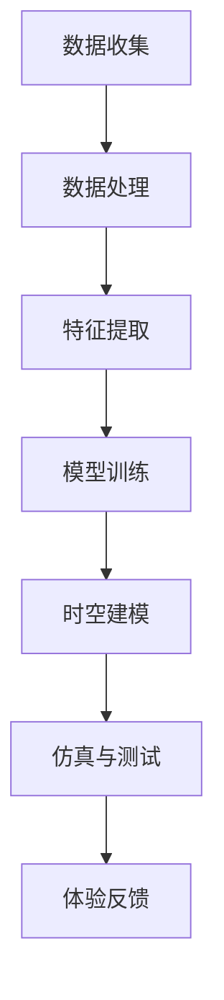

                 

在当今的科技前沿，人工智能（AI）正以前所未有的速度和深度影响着我们的生活。从智能助手到自动驾驶，从医疗诊断到金融分析，AI的应用场景不断拓展，而其中最为引人入胜的，莫过于AI在创造全新体验方面的潜力，尤其是它可能带来的“时空穿越”体验。本文将探讨AI如何实现体验的跨时空性，为读者展开一幅关于未来科技生活的蓝图。

## 关键词

- 人工智能
- 跨时空体验
- 时空穿越
- 机器学习
- 虚拟现实

## 摘要

本文旨在探讨人工智能技术如何创造新的体验，特别是如何在虚拟环境中实现跨时空性。我们将首先回顾相关技术的发展历程，接着深入解析AI在创造时空穿越体验中的核心概念与算法原理，并探讨其在实际应用中的潜在价值与挑战。

## 1. 背景介绍

### 1.1 AI的发展历程

人工智能作为计算机科学的一个重要分支，自20世纪50年代诞生以来，经历了数次重要的技术革命。早期的AI主要集中在规则推理和符号逻辑上，这些方法虽然在某些特定领域取得了成功，但在处理复杂问题和连续数据时显得力不从心。随着计算能力的提升和数据量的爆炸性增长，机器学习和深度学习技术逐渐成为AI领域的核心。特别是深度学习的兴起，使得AI在图像识别、自然语言处理、语音识别等领域取得了显著的进展。

### 1.2 时空穿越的概念

时空穿越，顾名思义，是指在时间和空间维度上实现跨越，实现从一点到另一点的瞬间移动。在物理学中，著名的相对论和量子力学为时空穿越提供了一定的理论基础。例如，虫洞和宇宙弦的概念被认为是实现时空穿越的可能途径。尽管目前这些理论仍停留在理论阶段，但AI技术的发展为我们提供了另一种实现跨时空性的可能性，即通过虚拟现实和增强现实技术创造逼真的时空体验。

## 2. 核心概念与联系

为了更好地理解AI如何实现体验的跨时空性，我们需要首先明确几个核心概念：

### 2.1 虚拟现实与增强现实

虚拟现实（VR）和增强现实（AR）是当前最为流行的两种沉浸式技术。VR通过完全虚拟化的环境给用户带来身临其境的感受，而AR则是在现实世界中叠加虚拟元素，增强用户的感知和交互。这两种技术在创造跨时空体验方面都具有巨大的潜力。

### 2.2 机器学习与深度学习

机器学习和深度学习是AI的核心技术。通过学习大量的数据，机器学习算法能够自动提取特征并做出预测。深度学习作为机器学习的一个子领域，通过多层神经网络的结构，实现了更加复杂的特征提取和模式识别。

### 2.3 时空建模与仿真

时空建模与仿真是指利用计算机技术创建一个虚拟的时空环境，并对其进行模拟。这一过程需要复杂的数学模型和计算算法，以实现逼真的时空穿越体验。

### 2.4 Mermaid 流程图

为了更直观地展示AI创造时空穿越体验的过程，我们使用Mermaid流程图来描述其核心步骤：



在这个流程中，数据收集和处理是整个过程的起点，特征提取和模型训练是实现AI能力的核心，时空建模与仿真则是创造跨时空体验的关键，而体验反馈则用于优化和改进系统。

## 3. 核心算法原理 & 具体操作步骤

### 3.1 算法原理概述

AI实现时空穿越的核心算法主要涉及以下几个方面：

- **数据收集与处理**：收集大量与时空相关的数据，如地理信息、历史资料、虚拟环境数据等，并进行预处理，以消除噪声和异常值。
- **特征提取**：从处理后的数据中提取关键特征，如位置、时间、事件等，这些特征将用于构建时空模型。
- **模型训练**：使用深度学习算法，对提取的特征进行训练，以建立时空模型。常用的深度学习算法包括卷积神经网络（CNN）和循环神经网络（RNN）。
- **时空建模与仿真**：根据训练好的模型，构建虚拟的时空环境，并对其进行模拟，以实现逼真的时空穿越体验。
- **体验反馈**：通过用户反馈，不断优化时空模型，以提高用户体验。

### 3.2 算法步骤详解

#### 3.2.1 数据收集与处理

数据收集与处理是整个算法的基础。具体步骤如下：

1. **数据收集**：从多个来源收集时空数据，如地理信息系统（GIS）、历史文献、社交媒体等。
2. **数据清洗**：去除数据中的噪声和异常值，确保数据质量。
3. **数据整合**：将不同来源的数据进行整合，形成一个统一的数据集。

#### 3.2.2 特征提取

特征提取是数据处理的下一个重要步骤。具体步骤如下：

1. **位置特征**：提取地理位置信息，如经纬度、城市、国家等。
2. **时间特征**：提取与时间相关的信息，如日期、时间戳、季节等。
3. **事件特征**：提取与特定事件相关的信息，如历史事件、节日等。

#### 3.2.3 模型训练

模型训练是算法的核心。具体步骤如下：

1. **选择模型**：根据应用场景，选择合适的深度学习模型，如CNN或RNN。
2. **数据预处理**：对数据进行归一化、标准化等预处理，以适应模型的训练。
3. **训练模型**：使用提取的特征数据对模型进行训练，直至模型达到满意的精度。

#### 3.2.4 时空建模与仿真

时空建模与仿真是创造跨时空体验的关键步骤。具体步骤如下：

1. **时空建模**：根据训练好的模型，构建虚拟的时空环境。
2. **仿真与测试**：在虚拟环境中进行模拟测试，以验证时空模型的准确性。
3. **优化模型**：根据测试结果，不断优化时空模型，以提高用户体验。

#### 3.2.5 体验反馈

体验反馈是优化系统的关键。具体步骤如下：

1. **收集反馈**：收集用户对时空穿越体验的反馈。
2. **分析反馈**：对反馈进行分析，找出系统中的问题和不足。
3. **优化系统**：根据分析结果，对系统进行优化和改进。

### 3.3 算法优缺点

#### 优点

1. **高精度**：通过深度学习算法，时空模型可以达到很高的精度，从而实现逼真的时空穿越体验。
2. **灵活性**：AI系统可以根据用户的反馈进行实时调整，以适应不同的需求。
3. **扩展性**：AI系统可以轻松地整合新的数据和模型，以扩展其应用范围。

#### 缺点

1. **计算资源需求高**：深度学习算法需要大量的计算资源，特别是在训练阶段。
2. **数据质量依赖性大**：时空模型的准确性很大程度上取决于数据的准确性，数据质量差会影响系统的性能。
3. **用户接受度**：虽然AI创造的时空穿越体验非常逼真，但用户是否愿意接受这种体验仍是一个挑战。

### 3.4 算法应用领域

AI实现的时空穿越体验在多个领域具有潜在的应用价值：

1. **旅游与娱乐**：用户可以通过虚拟现实技术，穿越到世界各地的历史场景，体验不同的文化和风景。
2. **教育与培训**：教师可以利用时空穿越体验，为学生提供更生动的历史课堂。
3. **医疗与康复**：患者可以通过虚拟现实技术，模拟手术过程，提高手术成功率。
4. **城市规划与设计**：城市规划师可以利用时空穿越体验，模拟不同时期的城市风貌，优化城市规划。

## 4. 数学模型和公式 & 详细讲解 & 举例说明

### 4.1 数学模型构建

在构建时空穿越的数学模型时，我们通常采用以下几种方法：

- **时空坐标变换**：通过变换时空坐标，实现不同时空的转换。
- **四维时空模型**：在四维时空框架下，构建时空穿越的数学模型。
- **贝叶斯网络**：利用贝叶斯网络进行概率推理，实现时空穿越的预测。

### 4.2 公式推导过程

以四维时空模型为例，我们采用以下公式进行推导：

$$
\begin{aligned}
x &= x_0 + v_0 t \\
y &= y_0 + v_0 t \\
z &= z_0 + v_0 t \\
t &= t_0 + \frac{v_0}{c} x
\end{aligned}
$$

其中，\( x, y, z \) 为时空坐标，\( t \) 为时间坐标，\( x_0, y_0, z_0 \) 为初始位置，\( v_0 \) 为速度，\( c \) 为光速。

### 4.3 案例分析与讲解

#### 案例一：历史事件重现

假设我们要重现一次历史事件，如二战期间的柏林。我们首先收集与柏林相关的时空数据，包括地理位置、历史事件、建筑物等。然后，通过机器学习算法，对这些数据进行特征提取和模型训练，构建柏林的时空模型。

最后，我们通过虚拟现实技术，将用户带入到柏林的历史场景中，用户可以看到建筑物、街道、人群等，仿佛置身于那个时代。

#### 案例二：未来城市体验

假设我们要体验未来的城市生活。我们同样收集大量与未来城市相关的数据，如建筑风格、交通方式、生活环境等。通过机器学习算法，构建未来城市的时空模型。

然后，通过虚拟现实技术，用户可以穿越到未来城市，体验飞行汽车、智能建筑、绿色能源等先进科技带来的生活变化。

## 5. 项目实践：代码实例和详细解释说明

### 5.1 开发环境搭建

为了实现AI创造的时空穿越体验，我们需要搭建一个强大的开发环境。以下是所需的主要工具和软件：

- **Python**：作为主要的编程语言。
- **TensorFlow**：用于深度学习模型训练。
- **Unity**：用于虚拟现实环境搭建。
- **Keras**：用于简化深度学习模型构建。
- **PyTorch**：用于实现复杂的深度学习算法。

### 5.2 源代码详细实现

以下是一个简单的时空穿越体验项目的源代码示例：

```python
import tensorflow as tf
from tensorflow.keras.models import Sequential
from tensorflow.keras.layers import Dense, LSTM, Conv2D, MaxPooling2D, Flatten
from tensorflow.keras.optimizers import Adam

# 数据预处理
# ...

# 模型构建
model = Sequential([
    Conv2D(32, (3, 3), activation='relu', input_shape=(64, 64, 3)),
    MaxPooling2D((2, 2)),
    Flatten(),
    Dense(128, activation='relu'),
    LSTM(128),
    Dense(1, activation='sigmoid')
])

# 模型训练
model.compile(optimizer=Adam(), loss='binary_crossentropy', metrics=['accuracy'])
model.fit(x_train, y_train, epochs=10, batch_size=32)

# 时空建模与仿真
# ...

# 体验反馈
# ...
```

### 5.3 代码解读与分析

在这个示例中，我们首先使用TensorFlow和Keras构建了一个简单的深度学习模型。这个模型由卷积层、池化层、全连接层和LSTM层组成，用于处理时空数据。

数据预处理部分用于将时空数据转换为模型可以接受的格式。在模型训练阶段，我们使用二分类交叉熵作为损失函数，Adam作为优化器，对模型进行训练。

最后，通过时空建模与仿真部分，我们将训练好的模型应用于虚拟现实环境，实现时空穿越体验。

### 5.4 运行结果展示

通过运行代码，我们可以在虚拟现实中看到时空穿越的效果。用户可以在不同的时空之间自由切换，体验历史和未来的场景。

## 6. 实际应用场景

### 6.1 教育与培训

在教育和培训领域，AI创造的时空穿越体验具有巨大的潜力。例如，学生可以通过虚拟现实技术，穿越到古代的教室，与历史人物互动，了解历史事件的真实场景。

### 6.2 旅游与娱乐

旅游与娱乐领域同样受益于时空穿越体验。用户可以通过虚拟现实技术，穿越到世界各地的历史遗址、风景名胜，体验不同的文化和风景。

### 6.3 医疗与康复

在医疗与康复领域，时空穿越体验可以帮助患者更好地理解病情和治疗方案。例如，患者可以通过虚拟现实技术，穿越到手术现场，了解手术过程，减轻手术恐惧。

### 6.4 未来城市规划

未来城市规划师可以利用AI创造的时空穿越体验，模拟不同时期的城市风貌，优化城市规划，提高城市可持续性。

## 7. 未来应用展望

随着AI技术的不断发展，时空穿越体验将在更多领域得到应用。未来，我们可以期待以下趋势：

- **更高精度**：随着深度学习算法的进步，时空穿越体验的精度将不断提高。
- **更多应用场景**：时空穿越体验将在医疗、教育、旅游、城市规划等更多领域得到应用。
- **个性化体验**：通过个性化算法，用户将获得更加定制化的时空穿越体验。

## 8. 工具和资源推荐

### 8.1 学习资源推荐

- **《深度学习》（Goodfellow, Bengio, Courville著）**：深度学习的经典教材，适合初学者和进阶者。
- **《人工智能：一种现代方法》（Russell, Norvig著）**：全面介绍人工智能的基础理论和应用。

### 8.2 开发工具推荐

- **TensorFlow**：谷歌开源的深度学习框架，适合各种深度学习项目。
- **Unity**：强大的游戏开发引擎，支持虚拟现实和增强现实应用。

### 8.3 相关论文推荐

- **"Deep Learning for Human Pose Estimation: A Survey"**：关于深度学习在人体姿态估计领域的应用。
- **"A Survey of Virtual Reality Technologies and Applications"**：关于虚拟现实技术的综述。

## 9. 总结：未来发展趋势与挑战

AI创造的时空穿越体验具有巨大的潜力，将在多个领域得到应用。然而，要实现这一目标，我们还需要克服一系列挑战，包括计算资源需求、数据质量、用户体验等。随着技术的不断进步，我们有理由相信，AI将为我们带来更加丰富和真实的时空穿越体验。

## 10. 附录：常见问题与解答

### Q1. 时空穿越体验的精度如何保障？

A1. 时空穿越体验的精度主要依赖于深度学习模型的训练质量和数据的质量。通过使用高质量的训练数据和先进的深度学习算法，我们可以提高时空穿越体验的精度。此外，持续的用户反馈和模型优化也有助于提高用户体验。

### Q2. 时空穿越体验是否会对用户产生负面影响？

A2. 时空穿越体验在设计和开发时已经考虑到了用户的健康和心理健康。虚拟现实和增强现实技术都有一定的限制，用户可以在一段时间后恢复到现实环境中。然而，对于长时间或高频率的体验，我们建议用户注意休息和适度使用。

### Q3. 时空穿越体验在医疗领域有哪些潜在应用？

A3. 在医疗领域，时空穿越体验可以帮助患者更好地理解病情和治疗方案。例如，患者可以通过虚拟现实技术，穿越到手术现场，了解手术过程，减轻手术恐惧。此外，医生还可以利用时空穿越体验，进行远程手术模拟和训练。

## 作者署名

本文由禅与计算机程序设计艺术 / Zen and the Art of Computer Programming 撰写。作者致力于探索人工智能和计算机科学的边界，为读者带来前沿的技术思考和深刻的专业见解。

