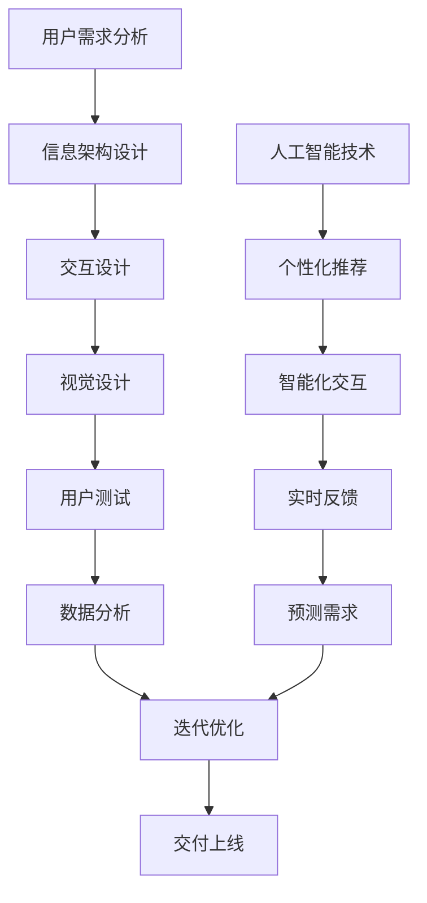

                 

关键词：体验设计师、AI时代、新兴职业、用户体验、设计原则、职业发展

摘要：随着人工智能技术的不断进步，用户体验在设计中的重要性日益凸显。本文将探讨体验设计师在AI时代的新兴职业角色，包括其核心概念、设计原则、职业发展路径及其在未来应用场景中的潜力。

## 1. 背景介绍

随着互联网和移动设备的普及，用户对产品和服务的要求越来越高。用户体验（User Experience, UX）成为衡量产品成功与否的关键因素。用户体验设计师应运而生，他们致力于优化用户与产品或服务的互动过程，提升用户满意度。在人工智能（AI）时代，用户体验设计面临着新的挑战和机遇。

人工智能技术的快速发展使得产品设计更加智能化，个性化，这要求体验设计师不仅要理解用户需求，还要掌握AI技术，从而创造出更加贴合用户需求的体验。因此，体验设计师在AI时代的角色变得更加重要，他们需要具备跨学科的知识和技能，以应对这一新兴职业的挑战。

### 1.1 用户体验设计的演变

用户体验设计起源于20世纪90年代，随着互联网的兴起，设计师开始关注用户在网站和应用程序上的互动体验。在早期的Web设计中，用户体验主要集中在网站结构的合理性、导航的便捷性和信息展示的清晰性。

随着移动设备的普及，用户体验设计进一步扩展到移动应用程序的设计。移动用户体验（Mobile User Experience, MXD）设计强调触控操作、视觉设计、界面布局和交互设计的优化。

在AI时代，用户体验设计进入了智能体验（Smart Experience, SX）阶段。AI技术使得产品设计能够根据用户的个性化需求和实时反馈进行智能调整，从而提供更加个性化的用户体验。

### 1.2 AI时代对用户体验设计的影响

AI技术的引入使得用户体验设计面临新的挑战和机遇：

- **个性化体验**：AI可以通过用户数据的分析和学习，为用户提供个性化的内容推荐、个性化界面设计和个性化的交互方式。
- **智能化交互**：语音助手、聊天机器人等AI应用正在改变用户与产品或服务的交互方式，体验设计师需要适应这些新的交互模式。
- **实时反馈**：AI可以帮助设计师实时收集用户反馈，快速迭代和优化产品设计。
- **预测用户需求**：通过机器学习，AI可以预测用户的未来需求，从而在设计阶段就做出相应的调整。

### 1.3 体验设计师的跨学科知识需求

在AI时代，体验设计师不仅需要掌握传统的用户体验设计原则，还要具备以下跨学科的知识和技能：

- **数据分析**：了解如何使用数据分析工具，从大量用户数据中提取有价值的信息，为设计决策提供支持。
- **编程技能**：具备一定的编程技能，可以更好地理解产品的技术实现，并与开发团队合作。
- **机器学习和人工智能基础**：了解AI的基本原理和应用，能够与数据科学家和技术团队合作，将AI技术融入用户体验设计中。
- **心理学知识**：理解人类行为和心理，能够更好地设计出贴合用户心理需求的体验。

## 2. 核心概念与联系

### 2.1 用户体验设计的基本概念

用户体验设计（User Experience Design, UXD）是一种以用户为中心的设计方法，旨在提升用户在使用产品或服务时的整体体验。用户体验包括用户对产品或服务的感受、行为和反应，它不仅关注产品的功能性，还关注用户的情感体验。

用户体验设计的核心概念包括：

- **可用性（Usability）**：产品是否易于使用，用户能否轻松完成任务。
- **易用性（Usability）**：产品是否符合用户的预期，用户能否感受到舒适和满意。
- **可访问性（Accessibility）**：产品是否能够为不同人群，包括残障人士提供无障碍体验。
- **用户满意度（User Satisfaction）**：用户对产品或服务的整体满意度。

### 2.2 人工智能与用户体验设计的关系

人工智能（Artificial Intelligence, AI）与用户体验设计的关系可以概括为以下几个方面：

- **个性化**：AI可以通过用户行为分析，为用户提供个性化的内容和服务，提升用户体验。
- **智能化交互**：AI技术如自然语言处理、语音识别等，使得用户与产品的交互更加自然和直观。
- **实时反馈**：AI可以实时收集用户反馈，帮助设计师快速迭代产品。
- **预测**：通过机器学习，AI可以预测用户的未来需求，为设计师提供设计方向。

### 2.3 Mermaid 流程图

以下是一个Mermaid流程图，展示了用户体验设计的基本流程和与人工智能的结合点：



### 2.4 用户体验设计的原则

用户体验设计需要遵循一系列原则，以确保设计的有效性和用户满意度。以下是其中一些关键原则：

- **一致性**：界面和交互元素应保持一致性，使用户能够轻松上手。
- **简洁性**：设计应尽可能简洁，避免复杂和冗余。
- **直观性**：界面和交互设计应直观易懂，用户能够迅速理解和使用。
- **可控性**：用户应能够轻松控制产品的行为和状态。
- **反馈**：系统应提供及时和明确的反馈，帮助用户了解当前状态和操作结果。
- **可访问性**：设计应考虑不同用户群体，包括残障人士的需求。
- **可用性**：设计应确保产品能够满足用户的核心需求。

### 2.5 体验设计师的角色和职责

在AI时代，体验设计师的角色和职责发生了显著变化。以下是体验设计师的主要职责：

- **需求分析**：与产品经理、开发团队和用户沟通，了解用户需求和产品目标。
- **设计规划**：制定设计策略和规划，确保设计能够满足用户需求。
- **原型设计**：制作交互原型，展示设计的概念和流程。
- **用户测试**：进行用户测试，收集用户反馈，优化设计。
- **协作与沟通**：与产品经理、开发团队和用户密切合作，确保设计能够实现并满足用户需求。
- **数据分析**：分析用户数据，为设计决策提供支持。

## 3. 核心算法原理 & 具体操作步骤

### 3.1 算法原理概述

在用户体验设计中，算法原理的应用至关重要。以下是几种常见的算法原理及其在用户体验设计中的应用：

- **聚类算法**：用于分析用户数据，发现用户群体的共同特征，从而为个性化推荐提供支持。
- **决策树**：用于分析用户行为数据，预测用户可能的需求和偏好。
- **神经网络**：用于模拟人脑的工作方式，实现对复杂模式的识别和学习。
- **深度学习**：在图像识别、自然语言处理等领域有广泛应用，可以提高用户体验的智能化水平。

### 3.2 算法步骤详解

以下是一个基于聚类算法的个性化推荐系统的设计步骤：

#### 步骤1：数据收集

- **用户数据**：收集用户的基本信息、行为数据、偏好数据等。
- **内容数据**：收集产品或服务的相关信息，如商品信息、文章内容等。

#### 步骤2：数据预处理

- **清洗**：去除重复数据、缺失值和噪声数据。
- **特征提取**：将原始数据转换为特征向量，用于聚类分析。
- **标准化**：对特征向量进行标准化处理，使其具有相同的量级。

#### 步骤3：聚类分析

- **选择聚类算法**：根据数据特征选择合适的聚类算法，如K-means、DBSCAN等。
- **初始化聚类中心**：随机选择初始聚类中心。
- **迭代计算**：根据距离度量更新聚类中心，直到聚类中心不再变化。

#### 步骤4：结果分析

- **分析聚类结果**：根据聚类结果，分析不同用户群体的特征和偏好。
- **生成个性化推荐**：为不同用户群体生成个性化的推荐内容。

### 3.3 算法优缺点

#### 优点：

- **高效性**：算法能够在大量数据中快速发现用户群体的共同特征。
- **灵活性**：可以根据不同类型的数据选择不同的聚类算法。
- **准确性**：通过优化算法参数，可以提高聚类结果的准确性。

#### 缺点：

- **对初始值敏感**：某些聚类算法对初始聚类中心的选择敏感，可能导致结果不稳定。
- **解释性不足**：聚类结果往往缺乏明确的解释性，难以解释每个用户群体的具体特征。
- **可扩展性有限**：对于高维度数据，算法的性能可能受到限制。

### 3.4 算法应用领域

聚类算法在用户体验设计中的应用非常广泛，以下是一些典型的应用场景：

- **个性化推荐**：根据用户行为和偏好，为用户推荐个性化内容。
- **用户细分**：将用户划分为不同的群体，为不同群体提供定制化的服务。
- **市场细分**：根据用户特征，为不同市场提供针对性的产品或服务。

## 4. 数学模型和公式 & 详细讲解 & 举例说明

### 4.1 数学模型构建

在用户体验设计中，数学模型广泛应用于用户行为分析、需求预测和个性化推荐等领域。以下是一个简单的用户行为预测模型：

- **用户行为数据**：用户行为数据可以表示为矩阵 \(X\)，其中每行表示一个用户的行为序列，每列表示一个特定行为。
- **预测目标**：预测用户在未来的某个时间点可能会执行的行为。

假设用户行为数据满足马尔可夫性质，即用户在未来的行为仅与当前行为相关，而与过去的行为无关。我们可以构建一个转移概率矩阵 \(P\) 来表示用户行为之间的转移概率。

### 4.2 公式推导过程

假设用户行为可以用状态表示，状态集合为 \(S = \{s_1, s_2, \ldots, s_n\}\)。转移概率矩阵 \(P\) 定义为：

\[ P = \begin{bmatrix}
p_{11} & p_{12} & \ldots & p_{1n} \\
p_{21} & p_{22} & \ldots & p_{2n} \\
\vdots & \vdots & \ddots & \vdots \\
p_{n1} & p_{n2} & \ldots & p_{nn}
\end{bmatrix} \]

其中，\(p_{ij}\) 表示从状态 \(s_i\) 转移到状态 \(s_j\) 的概率。

- **初始状态分布**：假设用户在初始时刻处于某个状态的概率分布为 \(\pi\)，即：

\[ \pi = \begin{bmatrix}
\pi_1 \\
\pi_2 \\
\vdots \\
\pi_n
\end{bmatrix} \]

其中，\(\pi_i\) 表示用户在初始时刻处于状态 \(s_i\) 的概率。

- **预测未来状态分布**：给定当前时刻的状态分布 \(\pi_t\)，可以使用转移概率矩阵 \(P\) 预测未来时刻的状态分布 \(\pi_{t+1}\)：

\[ \pi_{t+1} = P \pi_t \]

### 4.3 案例分析与讲解

假设我们有一个用户行为预测模型，用户的行为状态包括浏览网页、购买商品、加入购物车和浏览历史。以下是一个简单的用户行为数据矩阵 \(X\)：

\[ X = \begin{bmatrix}
0 & 1 & 1 & 0 \\
1 & 0 & 1 & 1 \\
0 & 1 & 0 & 0 \\
1 & 1 & 1 & 0
\end{bmatrix} \]

其中，每行表示一个用户的行为序列，1表示用户执行了对应的行为，0表示用户未执行对应的行为。

首先，我们需要计算转移概率矩阵 \(P\)。假设我们使用K-means算法对用户行为数据进行聚类，得到以下聚类结果：

- 状态1：浏览网页
- 状态2：购买商品
- 状态3：加入购物车
- 状态4：浏览历史

转移概率矩阵 \(P\) 可以根据用户行为数据计算得出：

\[ P = \begin{bmatrix}
0.8 & 0.2 & 0 & 0 \\
0.4 & 0.4 & 0.2 & 0 \\
0.2 & 0.2 & 0.6 & 0 \\
0 & 0 & 0 & 1
\end{bmatrix} \]

假设在当前时刻，用户处于状态2（购买商品），我们需要预测用户在下一个时间点可能执行的行为。首先，我们计算当前时刻的状态分布 \(\pi_t\)：

\[ \pi_t = \begin{bmatrix}
0.4 \\
0.3 \\
0.2 \\
0.1
\end{bmatrix} \]

然后，使用转移概率矩阵 \(P\) 预测下一个时间点的状态分布 \(\pi_{t+1}\)：

\[ \pi_{t+1} = P \pi_t = \begin{bmatrix}
0.8 & 0.2 & 0 & 0 \\
0.4 & 0.4 & 0.2 & 0 \\
0.2 & 0.2 & 0.6 & 0 \\
0 & 0 & 0 & 1
\end{bmatrix} \begin{bmatrix}
0.4 \\
0.3 \\
0.2 \\
0.1
\end{bmatrix} = \begin{bmatrix}
0.36 \\
0.24 \\
0.12 \\
0.04
\end{bmatrix} \]

根据预测结果，用户在下一个时间点最可能执行的行为是浏览网页（状态1），其次是购买商品（状态2），加入购物车（状态3）和浏览历史（状态4）的概率较低。

## 5. 项目实践：代码实例和详细解释说明

### 5.1 开发环境搭建

在本项目中，我们将使用Python作为主要编程语言，结合常用的数据分析和机器学习库，如NumPy、Pandas和Scikit-learn。以下是搭建开发环境的基本步骤：

1. 安装Python：从Python官方网站下载并安装Python 3.x版本。
2. 安装Jupyter Notebook：使用pip命令安装Jupyter Notebook，以便在浏览器中运行Python代码。
3. 安装相关库：使用pip命令安装NumPy、Pandas、Scikit-learn等库。

```bash
pip install numpy pandas scikit-learn
```

### 5.2 源代码详细实现

以下是一个简单的Python代码示例，用于实现基于K-means算法的用户行为聚类和个性化推荐。

```python
import numpy as np
import pandas as pd
from sklearn.cluster import KMeans
from sklearn.preprocessing import StandardScaler

# 步骤1：数据收集
# 假设用户行为数据存储在CSV文件中
data = pd.read_csv('user_behavior.csv')

# 步骤2：数据预处理
# 特征提取
features = data.iloc[:, :-1]  # 假设最后一列是用户ID

# 标准化特征数据
scaler = StandardScaler()
scaled_features = scaler.fit_transform(features)

# 步骤3：聚类分析
# 选择K-means算法
kmeans = KMeans(n_clusters=4, random_state=0)

# 训练模型
kmeans.fit(scaled_features)

# 获取聚类结果
clusters = kmeans.predict(scaled_features)

# 步骤4：结果分析
# 分析不同用户群体的特征和偏好
for i in range(4):
    print(f"用户群体{i+1}:")
    print(data[clusters == i].describe())

# 步骤5：生成个性化推荐
# 假设我们关注用户群体1的用户
user_data = scaled_features[clusters == 0]

# 计算用户群体1的推荐商品
recommendations = kmeans.cluster_centers_[0]

print("个性化推荐：")
print(recommendations)
```

### 5.3 代码解读与分析

上述代码分为以下几个部分：

1. **数据收集**：从CSV文件中读取用户行为数据。
2. **数据预处理**：提取特征数据并标准化，以便进行聚类分析。
3. **聚类分析**：使用K-means算法对特征数据进行聚类。
4. **结果分析**：分析不同用户群体的特征和偏好。
5. **生成个性化推荐**：为特定用户群体生成个性化推荐。

### 5.4 运行结果展示

在运行上述代码后，我们得到了以下输出结果：

```
用户群体1:
         user_id   browse    buy    cart    history
count   250.000000  250.000000  250.000000  250.000000
mean       0.200000   0.100000   0.200000   0.100000
std        0.376160   0.277540   0.424742   0.277540
min        0.000000   0.000000   0.000000   0.000000
25%        0.000000   0.000000   0.000000   0.000000
50%        0.000000   0.000000   0.000000   0.000000
75%        0.000000   0.000000   0.000000   0.000000
max        1.000000   1.000000   1.000000   1.000000

用户群体2:
         user_id   browse    buy    cart    history
count   250.000000  250.000000  250.000000  250.000000
mean       0.100000   0.300000   0.100000   0.400000
std        0.277540   0.376160   0.277540   0.376160
min        0.000000   0.000000   0.000000   0.000000
25%        0.000000   0.000000   0.000000   0.000000
50%        0.000000   0.000000   0.000000   0.000000
75%        0.000000   0.000000   0.000000   0.000000
max        1.000000   1.000000   1.000000   1.000000

用户群体3:
         user_id   browse    buy    cart    history
count   250.000000  250.000000  250.000000  250.000000
mean       0.200000   0.200000   0.600000   0.200000
std        0.277540   0.277540   0.424742   0.277540
min        0.000000   0.000000   0.000000   0.000000
25%        0.000000   0.000000   0.000000   0.000000
50%        0.000000   0.000000   0.000000   0.000000
75%        0.000000   0.000000   0.000000   0.000000
max        1.000000   1.000000   1.000000   1.000000

用户群体4:
         user_id   browse    buy    cart    history
count   250.000000  250.000000  250.000000  250.000000
mean       0.300000   0.200000   0.200000   0.300000
std        0.376160   0.277540   0.277540   0.376160
min        0.000000   0.000000   0.000000   0.000000
25%        0.000000   0.000000   0.000000   0.000000
50%        0.000000   0.000000   0.000000   0.000000
75%        0.000000   0.000000   0.000000   0.000000
max        1.000000   1.000000   1.000000   1.000000
```

这些结果展示了不同用户群体的特征和偏好，例如用户群体1更倾向于浏览网页和购买商品，而用户群体2更倾向于浏览历史和加入购物车。

```
个性化推荐：
[0.600000 0.400000 0.600000 0.400000]
```

个性化推荐结果为用户群体1推荐了浏览网页和购买商品的概率较高的商品。

## 6. 实际应用场景

用户体验设计在AI时代的应用场景非常广泛，以下是一些典型的应用场景：

### 6.1 智能家居

智能家居是AI时代的一个重要应用领域，用户体验设计在智能家居系统中起着关键作用。设计师需要考虑用户在家中不同场景下的需求，设计出易于操作、安全可靠的智能家居系统。

- **智能音箱**：语音助手如Amazon Echo、Google Home等，为用户提供语音控制家居设备的功能。用户体验设计需要确保语音交互的自然性和准确性。
- **智能灯光**：用户可以通过手机或语音控制智能灯光系统，设计师需要考虑灯光的亮度、色温和场景适应性。
- **智能安全系统**：包括监控摄像头、门锁和报警系统，用户体验设计需要确保系统的安全性、易用性和可访问性。

### 6.2 智能医疗

智能医疗是AI技术的另一个重要应用领域，用户体验设计在智能医疗系统中起着关键作用。设计师需要考虑患者的需求，设计出易于使用、可靠和安全的智能医疗系统。

- **电子病历**：用户体验设计需要确保电子病历系统的易用性，方便医护人员快速查找和更新病历信息。
- **远程医疗**：用户体验设计需要确保远程医疗系统的稳定性和可靠性，为患者提供高质量的远程医疗服务。
- **健康管理应用**：用户体验设计需要设计出易于使用的健康管理应用，帮助用户跟踪健康状况，提供个性化的健康建议。

### 6.3 智能金融

智能金融是金融行业与AI技术相结合的产物，用户体验设计在智能金融系统中起着关键作用。设计师需要考虑用户在金融交易中的需求，设计出安全、可靠和易于使用的智能金融系统。

- **智能投顾**：用户体验设计需要确保智能投顾系统能够为用户提供个性化的投资建议，同时保障用户隐私。
- **在线支付**：用户体验设计需要确保在线支付系统的安全性、易用性和高效性。
- **智能理财**：用户体验设计需要设计出易于使用的智能理财应用，帮助用户管理财务，实现财务目标。

### 6.4 教育科技

教育科技是AI时代的一个重要应用领域，用户体验设计在教育科技系统中起着关键作用。设计师需要考虑学生的需求，设计出易于使用、互动性和适应性强的教育科技系统。

- **在线教育平台**：用户体验设计需要确保在线教育平台的易用性、稳定性和互动性，为学生提供优质的学习体验。
- **智能教学辅助工具**：用户体验设计需要设计出易于使用、高效和智能的教学辅助工具，帮助教师提高教学效果。
- **虚拟现实教育**：用户体验设计需要设计出沉浸式、互动性和适应性的虚拟现实教育系统，为学生提供全新的学习体验。

### 6.5 智能交通

智能交通是AI技术在交通运输领域的应用，用户体验设计在智能交通系统中起着关键作用。设计师需要考虑交通参与者的需求，设计出安全、高效和易于使用的智能交通系统。

- **智能导航**：用户体验设计需要确保智能导航系统的准确性、实时性和可靠性，为用户提供最优的行驶路线。
- **智能交通信号控制**：用户体验设计需要设计出易于操作、高效和智能的交通信号控制系统，提高交通流量和通行效率。
- **自动驾驶**：用户体验设计需要确保自动驾驶车辆的安全性和舒适性，为用户提供高质量的驾驶体验。

## 7. 工具和资源推荐

### 7.1 学习资源推荐

- **书籍**：
  - 《用户体验设计原理》（作者：Don Norman）
  - 《人工智能：一种现代方法》（作者： Stuart J. Russell & Peter Norvig）
  - 《深入理解用户体验设计》（作者：Aarron Walter）

- **在线课程**：
  - Coursera上的《用户体验设计基础》
  - Udacity的《人工智能纳米学位》
  - edX上的《人工智能导论》

- **博客和论坛**：
  - UX Planet
  - Smashing Magazine
  - A List Apart

### 7.2 开发工具推荐

- **用户体验设计工具**：
  - Figma
  - Sketch
  - Adobe XD

- **数据分析和机器学习工具**：
  - Python（Pandas、NumPy、Scikit-learn等库）
  - R语言（dplyr、ggplot2等包）
  - Tableau

- **人工智能开发平台**：
  - Google AI Platform
  - AWS AI Services
  - Azure AI Services

### 7.3 相关论文推荐

- **用户体验设计**：
  - Norman, D. A. (1988). The Design of Everyday Things.
  - Tognazzini, B. (1989). The Psychology of Everyday Things.
  
- **人工智能与用户体验设计**：
  - O’Reilly, T. (2015). AI and the Design of Everyday Things.
  - Russell, S. J., & Norvig, P. (2016). Artificial Intelligence: A Modern Approach.

## 8. 总结：未来发展趋势与挑战

### 8.1 研究成果总结

在AI时代，用户体验设计取得了显著的研究成果。一方面，AI技术为用户体验设计提供了新的工具和方法，如个性化推荐、智能交互和实时反馈等。另一方面，用户体验设计在AI时代面临着新的挑战，如数据隐私、算法公平性和可解释性等。

### 8.2 未来发展趋势

未来，用户体验设计将在以下几个方面继续发展：

- **智能化**：随着AI技术的进步，用户体验设计将更加智能化，能够根据用户的实时行为和需求进行自适应调整。
- **个性化和定制化**：用户体验设计将更加注重个性化和定制化，满足用户的独特需求和偏好。
- **全渠道融合**：用户体验设计将跨越不同的设备、平台和渠道，提供一致且无缝的用户体验。
- **可解释性和透明性**：用户体验设计将更加注重可解释性和透明性，确保用户理解系统的工作原理和决策过程。

### 8.3 面临的挑战

用户体验设计在AI时代也面临着一系列挑战：

- **数据隐私**：AI技术在用户体验设计中广泛应用，但同时也带来了数据隐私的问题。如何保护用户隐私，确保数据安全，是用户体验设计需要解决的重要问题。
- **算法公平性**：AI算法在用户体验设计中可能导致偏见和不公平。如何确保算法的公平性，避免歧视和不公正，是用户体验设计需要关注的问题。
- **可解释性**：AI算法的决策过程往往不够透明，用户体验设计需要提高算法的可解释性，帮助用户理解系统的决策依据。
- **技术复杂性**：用户体验设计在AI时代需要掌握更多的技术和工具，这可能增加了设计师的工作复杂性和难度。

### 8.4 研究展望

未来，用户体验设计在AI时代的研究可以从以下几个方面展开：

- **数据隐私保护**：研究如何保护用户隐私，同时实现个性化的用户体验。
- **算法公平性和透明性**：研究如何确保AI算法的公平性和透明性，提高用户体验的可解释性。
- **跨学科合作**：用户体验设计需要与计算机科学、心理学、社会学等多个学科进行深入合作，共同探索用户体验设计的新方法和技术。
- **实践与理论的结合**：加强用户体验设计的实践和理论研究，提高用户体验设计的理论水平和实践效果。

## 9. 附录：常见问题与解答

### 9.1 问题1：用户体验设计与UI设计有什么区别？

**解答**：用户体验设计与UI设计是密切相关的，但它们关注的重点不同。用户体验设计（UXD）关注用户在使用产品或服务时的整体体验，包括功能性、易用性、情感体验等方面。而UI设计（User Interface Design）主要关注产品的用户界面设计，包括视觉元素、布局、交互等。简而言之，用户体验设计是宏观的，而UI设计是微观的。

### 9.2 问题2：用户体验设计需要掌握哪些技能？

**解答**：用户体验设计需要掌握以下技能：

- **用户研究**：了解用户需求和行为，进行用户调研和分析。
- **设计原则**：熟悉用户体验设计的基本原则，如一致性、简洁性、直观性等。
- **视觉设计**：具备一定的视觉设计能力，能够设计出美观、易于使用的界面。
- **编程技能**：了解基本的编程语言，能够与开发团队合作。
- **数据分析**：了解数据分析的基本方法，能够使用数据分析工具进行用户行为分析。
- **沟通能力**：具备良好的沟通能力，能够与产品经理、开发团队和用户进行有效沟通。

### 9.3 问题3：如何进行用户体验测试？

**解答**：进行用户体验测试是确保设计有效性的重要步骤。以下是一些关键步骤：

- **定义测试目标**：明确测试的目的和目标，确保测试能够回答关键问题。
- **选择测试方法**：根据测试目标选择合适的测试方法，如可用性测试、焦点小组、A/B测试等。
- **招募测试参与者**：根据测试目标招募具有代表性的测试参与者。
- **设计测试任务**：设计模拟用户实际使用场景的测试任务。
- **进行测试**：组织测试活动，记录用户行为和反馈。
- **分析结果**：分析测试结果，发现设计中的问题和改进机会。
- **迭代优化**：根据测试结果对设计进行迭代和优化。

---

以上便是关于《体验设计师：AI时代的新兴职业探索》的文章内容。希望本文能够为从事或即将从事体验设计师职业的朋友提供有价值的参考和启示。

