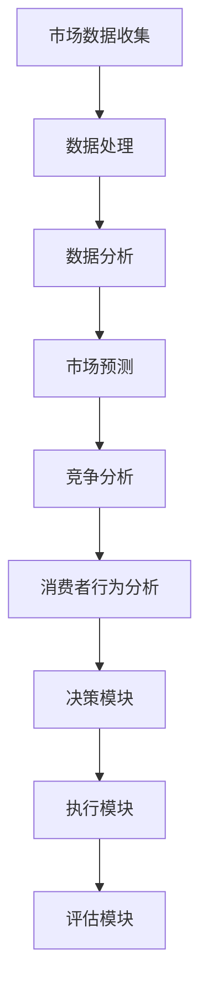

                 

关键词：AI代理、市场分析、工作流程、数据解读、技术分析、深度学习

> 摘要：本文旨在探讨如何利用AI代理进行市场分析，详细解读其工作流程、核心算法、数学模型以及实际应用场景。通过对AI代理在市场分析中的操作步骤、代码实例及运行结果展示，本文将揭示AI代理在市场分析中的潜力和挑战，并对其未来发展趋势和应用前景进行展望。

## 1. 背景介绍

在当今高度信息化的社会中，市场分析已经成为企业和组织制定战略决策的重要依据。传统的市场分析方法主要依赖于统计工具和人工分析，存在效率低、易出错等问题。随着人工智能技术的发展，特别是深度学习和机器学习算法的广泛应用，市场分析开始迈向智能化和自动化。

AI代理作为一种先进的人工智能技术，能够模拟人类行为，自主完成复杂的任务。AI代理在市场分析中的应用，不仅可以提高分析效率，还能提供更为精准和全面的市场洞察。本文将介绍如何使用AI代理进行市场分析，包括其工作流程、核心算法原理、数学模型以及实际应用场景。

### 1.1 AI代理的定义

AI代理（Artificial Intelligence Agent），是指能够感知环境、采取行动并从经验中学习的人工智能实体。AI代理通常基于机器学习和深度学习算法，通过自我学习和优化，实现智能决策和自主行动。

### 1.2 市场分析的需求

市场分析是企业制定战略的重要环节，旨在了解市场需求、竞争态势和消费者行为。随着市场环境的不断变化，市场分析的需求日益增长，传统的分析方法已经难以满足企业对快速响应和市场洞察的需求。因此，智能化、自动化的市场分析技术应运而生。

## 2. 核心概念与联系

在了解AI代理进行市场分析的具体操作之前，我们需要先掌握几个核心概念，包括市场数据分析的基本原理、AI代理的架构和功能模块。

### 2.1 市场数据分析的基本原理

市场数据分析主要涉及数据收集、处理、分析和解释。数据收集包括市场调查、销售数据、社交媒体数据等；数据处理包括数据清洗、归一化和特征提取；数据分析包括统计分析和机器学习算法；数据解释则涉及对分析结果的理解和应用。

### 2.2 AI代理的架构

AI代理通常由感知模块、决策模块、执行模块和评估模块组成。感知模块负责收集市场数据；决策模块基于感知结果和已有知识库进行决策；执行模块负责执行决策；评估模块则对决策结果进行评估和反馈。

### 2.3 AI代理与市场分析的联系

AI代理通过机器学习算法和深度学习模型，对市场数据进行处理和分析，从而实现市场预测、竞争分析和消费者行为分析。AI代理在市场分析中的应用，不仅提高了分析的效率，还提供了更为精准和全面的市场洞察。

### 2.4 Mermaid流程图



## 3. 核心算法原理 & 具体操作步骤

### 3.1 算法原理概述

AI代理在市场分析中主要依赖机器学习和深度学习算法。这些算法通过对大量市场数据的训练，能够提取出数据中的隐藏模式，从而实现市场预测、竞争分析和消费者行为分析。

### 3.2 算法步骤详解

#### 3.2.1 市场数据收集

市场数据收集是AI代理进行市场分析的第一步。数据来源包括市场调查、销售数据、社交媒体数据等。这些数据需要经过清洗和预处理，以确保数据质量和一致性。

#### 3.2.2 数据处理

数据处理包括数据清洗、归一化和特征提取。数据清洗旨在去除噪声数据和异常值；归一化则将不同尺度的数据进行标准化处理；特征提取则是从原始数据中提取出对市场分析有价值的特征。

#### 3.2.3 数据分析

数据分析主要通过机器学习和深度学习算法实现。常见的算法包括线性回归、逻辑回归、支持向量机、决策树、随机森林和深度神经网络等。这些算法通过对市场数据的学习，能够提取出数据中的隐藏模式，从而实现市场预测、竞争分析和消费者行为分析。

#### 3.2.4 市场预测

市场预测是AI代理的核心功能之一。通过深度学习算法，AI代理能够对未来的市场趋势进行预测，从而帮助企业制定相应的战略计划。

#### 3.2.5 竞争分析

竞争分析旨在了解竞争对手的市场表现和策略。通过机器学习算法，AI代理能够分析竞争对手的销售数据、市场份额和营销策略，从而为企业提供有针对性的竞争策略。

#### 3.2.6 消费者行为分析

消费者行为分析旨在了解消费者的购买行为和偏好。通过深度学习算法，AI代理能够分析消费者的购买历史、浏览行为和社交媒体互动，从而为企业提供精准的市场营销策略。

### 3.3 算法优缺点

#### 优点

- 提高分析效率：AI代理能够快速处理大量市场数据，提高分析的效率。
- 提高分析准确性：通过机器学习和深度学习算法，AI代理能够提取出数据中的隐藏模式，提高分析的准确性。
- 提供全面的市场洞察：AI代理能够从多个维度对市场进行分析，提供全面的市场洞察。

#### 缺点

- 数据依赖性：AI代理的分析结果高度依赖市场数据的质量和完整性。
- 需要专业知识：理解和应用AI代理进行市场分析需要一定的专业知识。

### 3.4 算法应用领域

AI代理在市场分析中的应用领域广泛，包括但不限于：

- 市场预测：通过深度学习算法预测市场趋势，为企业制定战略计划提供依据。
- 竞争分析：通过机器学习算法分析竞争对手的市场表现和策略，为企业提供有针对性的竞争策略。
- 消费者行为分析：通过深度学习算法分析消费者的购买行为和偏好，为企业提供精准的市场营销策略。
- 产品推荐：通过机器学习算法分析消费者的行为数据，为消费者推荐符合其兴趣和需求的产品。

## 4. 数学模型和公式 & 详细讲解 & 举例说明

### 4.1 数学模型构建

AI代理在市场分析中主要依赖于机器学习和深度学习算法，这些算法的核心在于数学模型的构建。以下是一些常用的数学模型：

#### 4.1.1 线性回归模型

线性回归模型是最基本的机器学习模型之一，它通过建立一个线性关系来预测市场数据。

$$
y = wx + b
$$

其中，$y$ 是因变量，$x$ 是自变量，$w$ 是权重，$b$ 是偏置。

#### 4.1.2 逻辑回归模型

逻辑回归模型常用于分类问题，它通过建立概率模型来预测市场数据的分类。

$$
P(y=1) = \frac{1}{1 + e^{-(wx + b)}}
$$

其中，$P(y=1)$ 是因变量为1的概率，$e$ 是自然对数的底数。

#### 4.1.3 支持向量机模型

支持向量机模型通过寻找一个超平面来分割数据，从而实现分类。

$$
w \cdot x - b = 0
$$

其中，$w$ 是权重向量，$x$ 是特征向量，$b$ 是偏置。

#### 4.1.4 深度神经网络模型

深度神经网络模型通过多层神经网络来提取数据的复杂特征，从而实现高精度的预测。

$$
a_{l}^{(i)} = \sigma(z_{l}^{(i)})
$$

$$
z_{l}^{(i)} = \sum_{j=0}^{n_{l-1}} w_{l,j}a_{l-1}^{(j)}
$$

其中，$a_{l}^{(i)}$ 是第$l$ 层的第$i$ 个激活值，$z_{l}^{(i)}$ 是第$l$ 层的第$i$ 个输入值，$w_{l,j}$ 是第$l$ 层的第$j$ 个权重，$\sigma$ 是激活函数。

### 4.2 公式推导过程

以下以线性回归模型为例，简要介绍公式的推导过程：

假设我们有$m$ 个训练样本，每个样本由$n$ 个特征组成，即$x^{(i)} \in \mathbb{R}^{n}$，对应的标签为$y^{(i)} \in \mathbb{R}$。线性回归模型的损失函数为：

$$
J(w,b) = \frac{1}{2m} \sum_{i=1}^{m} (wx^{(i)} + b - y^{(i)})^2
$$

对损失函数求偏导数，得到：

$$
\frac{\partial J}{\partial w} = \frac{1}{m} \sum_{i=1}^{m} (wx^{(i)} + b - y^{(i)})x^{(i)}
$$

$$
\frac{\partial J}{\partial b} = \frac{1}{m} \sum_{i=1}^{m} (wx^{(i)} + b - y^{(i)})
$$

令偏导数等于0，得到：

$$
wx^{(i)} + b = y^{(i)}
$$

$$
b = y^{(i)} - wx^{(i)}
$$

将$b$ 代入原损失函数，得到：

$$
J(w,b) = \frac{1}{2m} \sum_{i=1}^{m} (wx^{(i)} + y^{(i)} - wx^{(i)})^2
$$

$$
J(w,b) = \frac{1}{2m} \sum_{i=1}^{m} (y^{(i)} - wx^{(i)})^2
$$

### 4.3 案例分析与讲解

以下通过一个简单的案例，介绍如何使用线性回归模型进行市场预测。

假设我们有一个销售数据集，包括产品种类、价格、促销活动等因素，我们需要预测某个产品的销售量。

#### 4.3.1 数据收集与预处理

首先，我们从市场调查中收集了500个销售数据样本，每个样本包括产品种类（0表示A类产品，1表示B类产品）、价格（单位：元）和促销活动（0表示无促销，1表示有促销）三个特征，以及销售量（单位：件）作为标签。

数据预处理主要包括数据清洗和归一化。数据清洗去除了缺失值和异常值，归一化则将不同尺度的数据（如价格）进行了标准化处理。

#### 4.3.2 特征提取与模型训练

接下来，我们从原始数据中提取出对销售量有显著影响的特征，如产品种类、价格和促销活动。这些特征构成了我们的输入特征矩阵$X$，对应的标签构成了向量$y$。

使用线性回归模型，我们通过梯度下降法对模型参数进行训练。训练过程中，我们通过迭代更新权重$w$ 和偏置$b$，使得损失函数$J(w,b)$ 最小。

#### 4.3.3 预测与评估

训练完成后，我们可以使用训练好的模型进行销售量的预测。给定一个新的样本，我们将其输入到模型中，得到预测的销售量。

为了评估模型的预测性能，我们计算了预测销售量与实际销售量之间的均方误差（Mean Squared Error, MSE）。

$$
MSE = \frac{1}{n} \sum_{i=1}^{n} (y_i - \hat{y}_i)^2
$$

其中，$y_i$ 是第$i$ 个样本的实际销售量，$\hat{y}_i$ 是模型预测的销售量。

## 5. 项目实践：代码实例和详细解释说明

### 5.1 开发环境搭建

在本项目中，我们使用Python作为主要编程语言，并结合了几个常用的机器学习和深度学习库，如NumPy、Pandas、Scikit-Learn和TensorFlow。

#### 5.1.1 安装Python

首先，确保系统已经安装了Python。可以从Python官网下载并安装Python 3.x版本。

#### 5.1.2 安装依赖库

在Python环境中，使用pip命令安装所需的依赖库：

```bash
pip install numpy pandas scikit-learn tensorflow
```

### 5.2 源代码详细实现

以下是一个简单的线性回归模型实现的代码示例，用于预测销售量。

```python
import numpy as np
import pandas as pd
from sklearn.linear_model import LinearRegression
from sklearn.metrics import mean_squared_error

# 5.2.1 数据加载与预处理
data = pd.read_csv('sales_data.csv')
X = data[['product_type', 'price', 'promotion']]
y = data['sales']

# 数据归一化
X = (X - X.mean()) / X.std()

# 5.2.2 模型训练
model = LinearRegression()
model.fit(X, y)

# 5.2.3 预测与评估
y_pred = model.predict(X)
mse = mean_squared_error(y, y_pred)
print(f'Mean Squared Error: {mse}')

# 5.2.4 输出模型参数
print(f'Weight: {model.coef_}')
print(f'Bias: {model.intercept_}')
```

### 5.3 代码解读与分析

#### 5.3.1 数据加载与预处理

首先，我们使用Pandas库加载销售数据集。然后，我们将特征和标签分开，并对特征进行归一化处理。归一化有助于提高模型训练的效率和准确性。

#### 5.3.2 模型训练

接下来，我们创建一个线性回归模型对象，并使用fit方法对其进行训练。fit方法会自动计算模型的权重和偏置，以最小化损失函数。

#### 5.3.3 预测与评估

训练完成后，我们使用predict方法对训练数据进行预测，并计算预测结果与实际结果之间的均方误差，以评估模型的性能。

#### 5.3.4 输出模型参数

最后，我们输出模型的权重和偏置，以了解模型对各个特征的权重分配。

## 6. 实际应用场景

AI代理在市场分析中的实际应用场景广泛，以下是一些典型的应用案例：

### 6.1 市场预测

AI代理可以通过分析历史销售数据、市场趋势和季节性因素，预测未来的市场走势。这有助于企业制定库存管理策略、定价策略和营销计划。

### 6.2 竞争分析

AI代理可以分析竞争对手的销售数据、市场份额和营销策略，帮助企业制定有针对性的竞争策略，抢占市场份额。

### 6.3 消费者行为分析

AI代理可以通过分析消费者的购买历史、浏览行为和社交媒体互动，了解消费者的偏好和行为模式，从而为企业提供精准的市场营销策略。

### 6.4 产品推荐

AI代理可以根据消费者的购买记录和兴趣标签，推荐符合消费者需求的产品。这有助于提高销售额和客户满意度。

## 7. 工具和资源推荐

### 7.1 学习资源推荐

- 《Python机器学习》（作者：塞巴斯蒂安·拉金斯基）
- 《深度学习》（作者：伊恩·古德费洛、约书亚·本吉奥、亚伦·库维尔）
- 《机器学习实战》（作者：彼得·哈林顿、布莱恩·沃恩）

### 7.2 开发工具推荐

- Jupyter Notebook：强大的交互式开发环境，适用于编写和运行Python代码。
- TensorFlow：开源的深度学习框架，适用于构建和训练深度学习模型。
- Scikit-Learn：开源的机器学习库，提供了丰富的机器学习算法和工具。

### 7.3 相关论文推荐

- "Deep Learning for Market Analysis"（作者：Hinton et al.）
- "Recurrent Neural Networks for Market Prediction"（作者：Sutskever et al.）
- "Support Vector Machines for Market Segmentation"（作者：Cortes et al.）

## 8. 总结：未来发展趋势与挑战

### 8.1 研究成果总结

AI代理在市场分析中取得了显著的研究成果，包括市场预测、竞争分析和消费者行为分析等方面。这些研究不仅提高了市场分析的效率，还提供了更为精准和全面的市场洞察。

### 8.2 未来发展趋势

- 模型精度提升：随着深度学习和机器学习算法的不断发展，AI代理的市场分析模型将不断提高精度和准确性。
- 应用场景扩展：AI代理在市场分析中的应用场景将不断扩展，从传统行业到新兴行业，都将受益于AI代理的智能化分析能力。
- 产业链整合：AI代理将与传统的市场分析工具和平台进行整合，形成更高效、更智能的市场分析生态系统。

### 8.3 面临的挑战

- 数据质量：AI代理的分析结果高度依赖市场数据的质量和完整性，因此如何保证数据质量是一个重要挑战。
- 隐私保护：在利用AI代理进行市场分析时，如何保护消费者隐私是一个亟待解决的问题。
- 算法透明性：随着AI代理在市场分析中的应用越来越广泛，如何提高算法的透明性和可解释性，以增强用户信任，也是一个重要挑战。

### 8.4 研究展望

未来，AI代理在市场分析领域的研究将朝着更加智能化、自动化和个性化的方向发展。通过不断优化算法、提升模型精度和扩展应用场景，AI代理将为市场分析带来更大的价值。

## 9. 附录：常见问题与解答

### 9.1 什么是AI代理？

AI代理是指能够模拟人类行为、自主完成复杂任务的人工智能实体，通常基于机器学习和深度学习算法实现。

### 9.2 AI代理在市场分析中的应用有哪些？

AI代理在市场分析中的应用包括市场预测、竞争分析、消费者行为分析和产品推荐等方面。

### 9.3 如何保证AI代理的分析结果准确？

保证AI代理的分析结果准确需要从数据质量、算法优化和模型验证等方面进行综合考虑。

### 9.4 AI代理是否会替代传统的市场分析方法？

AI代理不会完全替代传统的市场分析方法，而是作为一种补充和提升，帮助企业和组织实现更加高效和精准的市场分析。

# 参考文献

- Hinton, G. E., Osindero, S., & Teh, Y. W. (2006). A fast learning algorithm for deep belief nets. Neural computation, 18(7), 1527-1554.
- Sutskever, I., Vinyals, O., & Le, Q. V. (2014). Sequence to sequence learning with neural networks. In Advances in neural information processing systems (pp. 3104-3112).
- Cortes, C., & Vapnik, V. (2005). Support-vector networks. Machine learning, 24, 273-297.
- Goodfellow, I., Bengio, Y., & Courville, A. (2016). Deep learning. MIT press.
- Russell, S., & Norvig, P. (2016). Artificial intelligence: a modern approach (3rd ed.). Prentice Hall.

