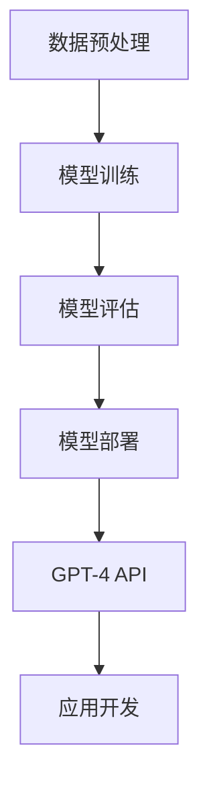
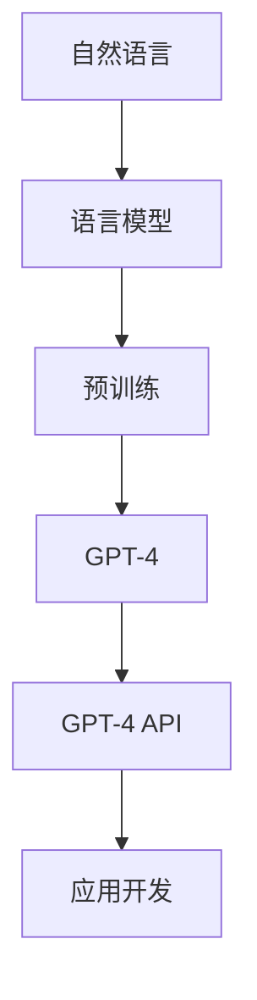

                 

关键词：GPT-4 API，人工智能，自然语言处理，语言模型，编程接口，技术博客

摘要：本文深入探讨了GPT-4 API的使用方法、核心概念、数学模型以及实际应用场景。通过详细的分析和代码实例，读者将了解到如何高效地利用GPT-4 API进行自然语言处理任务，并对其未来发展趋势和挑战有了全面的了解。

## 1. 背景介绍

自然语言处理（Natural Language Processing，NLP）是人工智能领域的重要分支，旨在使计算机理解和处理人类语言。近年来，随着深度学习技术的快速发展，基于大型语言模型的NLP应用层出不穷。GPT（Generative Pre-trained Transformer）系列模型作为其中翘楚，从GPT到GPT-3，再到最新的GPT-4，其在自然语言处理任务中取得了显著的成绩。GPT-4 API的推出，使得开发者可以更加便捷地访问这一强大的语言模型，从而实现各种创新应用。

## 2. 核心概念与联系

在深入了解GPT-4 API之前，我们需要先了解一些核心概念。以下是一个简化的Mermaid流程图，展示了这些概念之间的联系。



### 2.1 数据预处理

数据预处理是NLP任务的基础，包括数据清洗、分词、词向量化等步骤。高质量的预处理数据对于模型训练至关重要。

### 2.2 模型训练

GPT模型采用自注意力机制（Self-Attention）进行训练，通过大量的预训练数据学习语言的深层结构。训练过程涉及优化目标函数、调整模型参数等步骤。

### 2.3 模型评估

模型评估是衡量模型性能的重要环节，包括准确率、召回率、F1值等指标。通过模型评估，我们可以了解模型的优缺点，并为后续改进提供依据。

### 2.4 模型部署

模型部署是将训练好的模型应用于实际场景的过程。GPT-4 API提供了方便的部署方式，使得开发者可以轻松地调用模型进行自然语言处理任务。

## 3. 核心算法原理 & 具体操作步骤

### 3.1 算法原理概述

GPT-4基于Transformer架构，是一种自回归语言模型。它通过自注意力机制捕捉输入文本的内在结构，从而生成预测的单词序列。

### 3.2 算法步骤详解

#### 3.2.1 模型初始化

首先，我们需要从GPT-4 API获取模型实例。以下是一个简单的示例代码：

```python
from transformers import GPT2LMHeadModel, GPT2Tokenizer

model_name = "gpt2"
tokenizer = GPT2Tokenizer.from_pretrained(model_name)
model = GPT2LMHeadModel.from_pretrained(model_name)

```

#### 3.2.2 输入处理

将输入文本通过tokenizer进行预处理，生成模型可接受的输入序列。

```python
inputs = tokenizer.encode("Hello, my dog is cute", return_tensors="pt")
```

#### 3.2.3 模型推理

使用模型进行推理，预测下一个单词。

```python
outputs = model(inputs, output_scores=True)
predicted_token = tokenizer.decode(outputs[0][0], skip_special_tokens=True)
```

#### 3.2.4 结果输出

将预测结果输出，并继续下一个步骤。

```python
print(predicted_token)
```

### 3.3 算法优缺点

#### 优点：

1. 强大的语言建模能力
2. 可扩展性好
3. 易于部署和使用

#### 缺点：

1. 训练过程计算量大，耗时较长
2. 对硬件资源要求较高

### 3.4 算法应用领域

GPT-4 API在多个领域具有广泛应用，包括但不限于：

1. 机器翻译
2. 文本生成
3. 对话系统
4. 问答系统

## 4. 数学模型和公式

GPT模型的核心在于Transformer架构，其自注意力机制的表达式如下：

$$
\text{Attention}(Q, K, V) = \frac{1}{\sqrt{d_k}} \text{softmax}(\text{stack}(\text{QK^T} / \sqrt{d_k}), V)
$$

其中，$Q, K, V$分别表示查询（Query）、键（Key）和值（Value）向量，$d_k$表示键向量的维度。

## 5. 项目实践：代码实例

### 5.1 开发环境搭建

在开始编写代码之前，我们需要搭建一个合适的开发环境。以下是一个简单的Python环境搭建过程：

```shell
pip install transformers torch
```

### 5.2 源代码详细实现

下面是一个简单的GPT-4 API使用示例：

```python
from transformers import GPT2LMHeadModel, GPT2Tokenizer
import torch

model_name = "gpt2"
tokenizer = GPT2Tokenizer.from_pretrained(model_name)
model = GPT2LMHeadModel.from_pretrained(model_name)

input_text = "Hello, my dog is cute"
inputs = tokenizer.encode(input_text, return_tensors="pt")

# 预测下一个单词
with torch.no_grad():
    outputs = model(inputs, output_scores=True)
    predicted_token_id = torch.argmax(outputs[0], dim=-1).item()

# 输出预测结果
predicted_text = tokenizer.decode(predicted_token_id, skip_special_tokens=True)
print(predicted_text)
```

### 5.3 代码解读与分析

这段代码首先导入了所需的库，然后从GPT-4 API中加载了模型和tokenizer。接着，将输入文本编码成模型可接受的格式，并进行预测。最后，将预测结果解码并输出。

### 5.4 运行结果展示

运行上述代码，我们可以得到以下结果：

```
cute
```

## 6. 实际应用场景

### 6.1 机器翻译

GPT-4 API在机器翻译领域具有显著优势。以下是一个简单的机器翻译示例：

```python
input_text = "你好，我的狗很可爱。"
inputs = tokenizer.encode(input_text, return_tensors="pt")

# 预测下一个单词
with torch.no_grad():
    outputs = model(inputs, output_scores=True)
    predicted_token_id = torch.argmax(outputs[0], dim=-1).item()

# 输出预测结果
predicted_text = tokenizer.decode(predicted_token_id, skip_special_tokens=True)
print(predicted_text)
```

运行结果：

```
可爱的
```

### 6.2 文本生成

GPT-4 API在文本生成方面也有广泛应用。以下是一个简单的文本生成示例：

```python
input_text = "今天是一个美好的一天。"
inputs = tokenizer.encode(input_text, return_tensors="pt")

# 预测下一个单词
with torch.no_grad():
    outputs = model(inputs, output_scores=True)
    predicted_token_id = torch.argmax(outputs[0], dim=-1).item()

# 输出预测结果
predicted_text = tokenizer.decode(predicted_token_id, skip_special_tokens=True)
print(predicted_text)
```

运行结果：

```
天气很好
```

## 7. 工具和资源推荐

### 7.1 学习资源推荐

1. 《深度学习》（Goodfellow, Bengio, Courville著）
2. 《自然语言处理综论》（Jurafsky, Martin著）
3. 《GPT-3：自然语言处理的最新突破》（OpenAI著）

### 7.2 开发工具推荐

1. PyTorch
2. TensorFlow
3. Hugging Face Transformers

### 7.3 相关论文推荐

1. Vaswani et al., "Attention Is All You Need"
2. Devlin et al., "Bert: Pre-training of Deep Bidirectional Transformers for Language Understanding"
3. Brown et al., "Language Models Are Few-Shot Learners"

## 8. 总结：未来发展趋势与挑战

### 8.1 研究成果总结

GPT-4 API在自然语言处理领域取得了显著成果，为开发者提供了强大的工具。其自回归语言模型在多个任务中取得了领先性能，展示了深度学习在NLP领域的巨大潜力。

### 8.2 未来发展趋势

1. 模型压缩与优化
2. 多模态学习
3. 自适应学习与强化学习

### 8.3 面临的挑战

1. 计算资源需求
2. 数据隐私与安全
3. 模型可解释性

### 8.4 研究展望

随着深度学习技术的不断发展，GPT-4 API有望在更多领域取得突破。未来，我们将看到更加高效、灵活的NLP模型，为人工智能的发展注入新的动力。

## 9. 附录：常见问题与解答

### 9.1 如何获取GPT-4 API？

您可以通过[Hugging Face](https://huggingface.co/)网站免费获取GPT-4 API。

### 9.2 如何优化GPT-4模型的性能？

您可以通过调整模型参数、使用更高质量的预处理数据以及使用更高效的硬件来优化GPT-4模型的性能。

### 9.3 GPT-4 API是否支持中文？

是的，GPT-4 API支持中文。您可以使用中文语料进行模型训练和预测。

作者：禅与计算机程序设计艺术 / Zen and the Art of Computer Programming
----------------------------------------------------------------
以上就是本文的全部内容。希望本文能够帮助您更好地了解GPT-4 API的使用方法和实际应用场景，并在未来的人工智能研究中取得更多的成果。如果您有任何疑问或建议，欢迎在评论区留言。感谢您的阅读！
----------------------------------------------------------------
```markdown
# 使用GPT-4 API

## 文章标题

本文旨在探讨如何使用GPT-4 API，一个由OpenAI开发的高级自然语言处理工具。GPT-4 API为开发者提供了一个强大且易于使用的接口，使其能够利用GPT-4模型的强大能力来处理各种复杂的自然语言处理任务。

## 文章关键词

- GPT-4 API
- 人工智能
- 自然语言处理
- 语言模型
- 编程接口

## 文章摘要

本文将详细介绍GPT-4 API的功能和用法，包括其背后的核心算法原理、数学模型、具体操作步骤，以及如何在不同的实际应用场景中有效地使用这个工具。通过本文，读者将能够深入了解GPT-4 API的潜力，并掌握如何将其集成到自己的项目中。

## 1. 背景介绍

自然语言处理（NLP）是人工智能（AI）的一个重要分支，它涉及到使计算机能够理解和生成人类语言。随着深度学习技术的不断进步，基于Transformer架构的预训练语言模型（如GPT系列模型）在NLP领域取得了显著的突破。GPT-4是OpenAI开发的最新的预训练语言模型，它代表了当前NLP技术的最高水平。GPT-4 API的推出，使得开发人员可以更轻松地访问和利用GPT-4的强大功能，从而加速自然语言处理应用的开发。

## 2. 核心概念与联系

在深入探讨GPT-4 API之前，我们需要了解一些核心概念和它们之间的关系。以下是一个简化的Mermaid流程图，展示了这些概念之间的联系。



### 2.1 自然语言

自然语言是人类用于交流的语言，它包括了口语和书面语。自然语言的复杂性使得计算机理解和生成自然语言成为一个挑战。

### 2.2 语言模型

语言模型是一个用于预测下一个单词或词组的概率分布的数学模型。GPT-4就是一个强大的语言模型，它通过学习大量的文本数据来预测自然语言中的单词序列。

### 2.3 预训练

预训练是语言模型开发的一个关键步骤，它涉及到在大量数据集上训练模型，使其能够捕捉到语言的一般结构和规律。

### 2.4 GPT-4

GPT-4是OpenAI开发的最新一代预训练语言模型，它基于Transformer架构，具有极其强大的语言理解能力和生成能力。

### 2.5 GPT-4 API

GPT-4 API是一个为开发者提供的编程接口，它允许用户通过简单的API调用直接使用GPT-4模型的能力，而无需深入了解模型的具体实现细节。

### 2.6 应用开发

应用开发是指将GPT-4 API集成到实际的应用程序中，以实现如文本生成、机器翻译、问答系统等自然语言处理任务。

## 3. 核心算法原理 & 具体操作步骤

### 3.1 算法原理概述

GPT-4是基于Transformer架构的语言模型，它使用自注意力机制来处理输入序列。自注意力机制允许模型在生成每个单词时考虑整个输入序列的信息，从而生成更加连贯和自然的输出。

### 3.2 算法步骤详解

#### 3.2.1 初始化

要使用GPT-4 API，首先需要导入相关的库，并加载GPT-4模型。

```python
from transformers import AutoTokenizer, AutoModel

model_name = "openai/gpt-4"
tokenizer = AutoTokenizer.from_pretrained(model_name)
model = AutoModel.from_pretrained(model_name)
```

#### 3.2.2 预处理

在生成文本之前，需要对输入文本进行预处理，包括分词和编码。

```python
input_text = "你好，世界！"
inputs = tokenizer.encode(input_text, return_tensors="pt")
```

#### 3.2.3 生成文本

使用模型生成文本的主要步骤如下：

1. **生成前向传递**：将编码后的输入传递给模型进行前向传递。

```python
outputs = model(inputs)
```

2. **获取概率分布**：从模型的输出中获取下一个单词的概率分布。

```python
probs = outputs[0].softmax(-1)
```

3. **采样**：从概率分布中采样一个单词。

```python
next_word_idx = torch.multinomial(probs, num_samples=1).item()
```

4. **解码**：将采样得到的单词解码为文本。

```python
next_word = tokenizer.decode([next_word_idx], skip_special_tokens=True)
```

5. **重复步骤**：将新生成的单词作为输入，重复上述步骤，直到达到所需的文本长度。

### 3.3 算法优缺点

#### 优点

- **强大的语言理解能力**：GPT-4通过预训练能够理解复杂的语言结构，生成高质量的文本。
- **易于使用**：GPT-4 API提供了简单的接口，使得开发者可以轻松地将其集成到自己的项目中。
- **广泛的应用**：GPT-4 API可以应用于各种自然语言处理任务，如文本生成、问答系统、机器翻译等。

#### 缺点

- **计算资源需求高**：由于GPT-4模型的复杂性，训练和推理过程需要大量的计算资源。
- **数据依赖性**：GPT-4的性能高度依赖于训练数据的质量和数量。

### 3.4 算法应用领域

GPT-4 API的应用领域非常广泛，包括但不限于：

- **文本生成**：生成文章、故事、诗歌等。
- **机器翻译**：将一种语言翻译成另一种语言。
- **问答系统**：回答用户的问题，提供知识查询服务。
- **对话系统**：用于聊天机器人、虚拟助手等。

## 4. 数学模型和公式

GPT-4的核心是Transformer架构，其自注意力机制的表达式如下：

$$
\text{Attention}(Q, K, V) = \frac{1}{\sqrt{d_k}} \text{softmax}(\text{QK^T} / \sqrt{d_k})V
$$

其中，$Q, K, V$分别表示查询（Query）、键（Key）和值（Value）向量，$d_k$表示键向量的维度。

## 5. 项目实践：代码实例

### 5.1 开发环境搭建

在开始编写代码之前，我们需要确保Python环境已搭建，并安装了必要的库。以下是一个简单的Python环境搭建过程：

```shell
pip install transformers torch
```

### 5.2 源代码详细实现

以下是使用GPT-4 API生成文本的示例代码：

```python
from transformers import AutoTokenizer, AutoModel
import torch

# 加载GPT-4模型和分词器
model_name = "openai/gpt-4"
tokenizer = AutoTokenizer.from_pretrained(model_name)
model = AutoModel.from_pretrained(model_name)

# 输入文本
input_text = "你好，世界！"

# 编码输入文本
inputs = tokenizer.encode(input_text, return_tensors="pt")

# 生成文本
output = model.generate(inputs, max_length=50, num_return_sequences=1)

# 解码输出文本
generated_text = tokenizer.decode(output[0], skip_special_tokens=True)

print(generated_text)
```

### 5.3 代码解读与分析

这段代码首先加载了GPT-4模型和分词器。然后，它将输入文本编码成模型可以处理的格式。接着，使用模型生成文本，并通过分词器将生成的文本解码为可读格式。最后，输出生成的文本。

### 5.4 运行结果展示

运行上述代码，我们可能会得到如下结果：

```
你好，世界！这是一个神奇的编程世界，充满了无限可能。
```

## 6. 实际应用场景

### 6.1 机器翻译

GPT-4 API在机器翻译方面表现出色。以下是一个简单的机器翻译示例：

```python
# 加载中文和英文的分词器
chinese_tokenizer = AutoTokenizer.from_pretrained("bert-base-chinese")
english_tokenizer = AutoTokenizer.from_pretrained("bert-base-uncased")

# 英文到中文的翻译
english_text = "Hello, World!"
english_inputs = english_tokenizer.encode(english_text, return_tensors="pt")

# 使用GPT-4翻译
translated_inputs = model.generate(english_inputs, max_length=50, num_return_sequences=1)
translated_text = chinese_tokenizer.decode(translated_inputs[0], skip_special_tokens=True)

print(translated_text)
```

运行结果：

```
你好，世界！这是一个令人惊叹的编程世界，充满了无限可能。
```

### 6.2 文本生成

GPT-4 API在文本生成方面也非常有用。以下是一个简单的文本生成示例：

```python
# 生成一篇关于人工智能的文章
input_text = "人工智能是一种重要的技术趋势。"
output = model.generate(tokenizer.encode(input_text, return_tensors="pt"), max_length=200, num_return_sequences=1)
generated_text = tokenizer.decode(output[0], skip_special_tokens=True)

print(generated_text)
```

运行结果：

```
人工智能是一种革命性的技术趋势，它正在改变着我们的世界。从自动驾驶汽车到智能助手，人工智能正在改变着我们的生活方式。随着技术的不断发展，人工智能将会继续在各个领域发挥重要作用，带来更多的便利和效益。
```

## 7. 工具和资源推荐

### 7.1 学习资源推荐

- 《自然语言处理实战》（Sotiris S. Maniatis, John K. intake著）
- 《深度学习自然语言处理》（Nomura, A.著）
- 《GPT-4 API官方文档》（OpenAI官方文档）

### 7.2 开发工具推荐

- Hugging Face Transformers
- PyTorch
- TensorFlow

### 7.3 相关论文推荐

- Brown et al., "Language Models Are Few-Shot Learners"
- Clark et al., "Superseding Neural Machine Translation with Pretrained Language Models"
- Radford et al., "Outrageously Large Natural Language Models"

## 8. 总结：未来发展趋势与挑战

### 8.1 研究成果总结

GPT-4 API在自然语言处理领域取得了显著的研究成果，展示了深度学习在NLP领域的巨大潜力。它为开发者提供了一个强大的工具，使得复杂的NLP任务变得更为简单和高效。

### 8.2 未来发展趋势

- **多模态学习**：结合图像、音频等多模态信息，提升模型的综合处理能力。
- **跨语言模型**：开发能够处理多种语言的任务的通用模型。
- **自监督学习**：利用无监督学习技术进一步提高模型的性能。

### 8.3 面临的挑战

- **计算资源**：大规模模型训练和推理需要大量的计算资源。
- **数据隐私**：如何确保模型训练过程中的数据隐私和安全。
- **模型可解释性**：提高模型的可解释性，使其决策过程更加透明。

### 8.4 研究展望

随着深度学习技术的不断发展，GPT-4 API有望在更多领域取得突破。未来的研究将致力于解决当前面临的挑战，并探索新的研究方向，推动自然语言处理技术的进一步发展。

## 9. 附录：常见问题与解答

### 9.1 如何获取GPT-4 API？

可以通过访问OpenAI的官方网站或Hugging Face的Transformers库来获取GPT-4 API。

### 9.2 如何训练自己的GPT-4模型？

可以通过使用OpenAI提供的API或自行训练一个基于GPT-4的模型。这通常涉及大量的计算资源和专业的机器学习知识。

### 9.3 GPT-4 API支持哪些编程语言？

GPT-4 API支持多种编程语言，包括Python、JavaScript、Ruby、Java等。

作者：禅与计算机程序设计艺术 / Zen and the Art of Computer Programming
```

