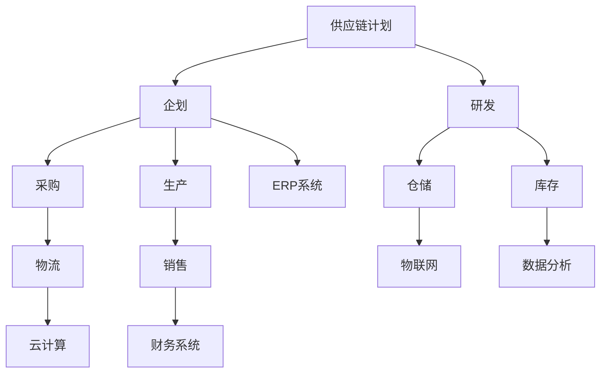

                 

关键词：供应链管理，系统设计，企业资源规划，ERP，需求分析，流程优化，数据分析，自动化，云计算，物联网，敏捷开发

摘要：本文深入探讨了供应链管理的各个方面，包括计划、企划、研发、采购、生产、仓储、库存、物流、销售和财务。通过详细的分析和实际案例，本文阐述了如何利用现代信息技术和工具进行供应链系统设计，以实现高效、灵活和透明的供应链管理。

## 1. 背景介绍

供应链管理（SCM）是现代企业运营的核心，涉及从原材料采购到产品交付的整个过程。随着全球化、市场竞争的加剧和客户需求的变化，供应链管理的复杂性和重要性日益增加。有效的供应链管理不仅可以降低成本、提高效率，还可以增强企业的竞争力。

供应链管理的主要环节包括计划、企划、研发、采购、生产、仓储、库存、物流、销售和财务。这些环节相互关联，构成了一个复杂的网络，任何一个环节的失效都可能导致整个供应链的崩溃。

## 2. 核心概念与联系

为了实现高效、灵活和透明的供应链管理，我们需要了解以下几个核心概念：

### 2.1 企业资源规划（ERP）

企业资源规划是一种集成的管理信息系统，旨在支持企业的各种业务流程。ERP系统通常包括财务、人力资源、供应链管理、客户关系管理等多个模块，通过集成这些模块，实现数据的共享和流程的自动化。

### 2.2 物联网（IoT）

物联网是指通过传感器、RFID等技术，将物理设备连接到互联网，实现实时数据采集和传输。在供应链管理中，物联网可以用于跟踪货物位置、监控库存水平和预测需求。

### 2.3 云计算

云计算提供了弹性、可扩展的计算资源，可以帮助企业快速部署和管理供应链系统。通过云计算，企业可以根据需求动态调整资源，降低IT成本。

### 2.4 数据分析

数据分析是供应链管理的关键工具，可以帮助企业从大量数据中提取有价值的信息，用于决策支持。

下面是一个简单的 Mermaid 流程图，展示了供应链管理中各个核心概念的联系：



## 3. 核心算法原理 & 具体操作步骤

### 3.1 算法原理概述

供应链管理中的核心算法主要包括需求预测、库存优化和物流调度。这些算法的基本原理如下：

- **需求预测**：基于历史数据和当前市场状况，预测未来的需求量。
- **库存优化**：在满足需求的前提下，最小化库存成本。
- **物流调度**：根据需求和库存状况，制定最优的物流路线和时间表。

### 3.2 算法步骤详解

#### 需求预测

1. 数据收集：收集历史销售数据、市场调查数据等。
2. 数据清洗：去除无效和错误数据，保证数据质量。
3. 特征工程：提取有用的特征，如季节性、促销活动等。
4. 模型选择：选择合适的预测模型，如时间序列模型、机器学习模型等。
5. 模型训练：使用历史数据训练模型。
6. 预测：使用训练好的模型预测未来的需求量。

#### 库存优化

1. 需求预测：使用需求预测算法预测未来的需求量。
2. 库存分析：分析当前库存水平和需求预测，确定补货策略。
3. 库存优化：根据库存分析和需求预测，调整库存水平，以最小化库存成本。

#### 物流调度

1. 需求预测：使用需求预测算法预测未来的需求量。
2. 库存分析：分析当前库存水平和需求预测，确定补货策略。
3. 路线规划：使用优化算法（如遗传算法、蚁群算法等）制定最优的物流路线。
4. 时间表制定：根据路线规划，制定最优的物流时间表。

### 3.3 算法优缺点

- **需求预测**：优点是可以提前预测需求，帮助制定库存和物流策略；缺点是预测结果可能存在误差，需要不断优化模型。
- **库存优化**：优点是可以降低库存成本，提高资金利用率；缺点是需要对市场变化做出快速反应，以避免库存过剩或不足。
- **物流调度**：优点是可以提高物流效率，降低物流成本；缺点是规划过程复杂，需要大量的计算资源。

### 3.4 算法应用领域

- **零售业**：需求预测和库存优化可以帮助零售商更好地应对季节性、促销活动等变化，提高销售业绩。
- **制造业**：物流调度可以帮助制造商优化生产计划和物流路线，提高生产效率。
- **物流公司**：物流调度可以帮助物流公司提高运输效率，降低物流成本。

## 4. 数学模型和公式 & 详细讲解 & 举例说明

### 4.1 数学模型构建

供应链管理中的数学模型主要包括需求预测模型、库存优化模型和物流调度模型。以下是这些模型的基本公式：

#### 需求预测模型

$$
\hat{D_t} = f(D_{t-1}, S_t)
$$

其中，$\hat{D_t}$ 表示预测的需求量，$D_{t-1}$ 表示历史需求量，$S_t$ 表示当前的市场状况。

#### 库存优化模型

$$
C = \sum_{i=1}^n (W_i \times C_i)
$$

其中，$C$ 表示总库存成本，$W_i$ 表示第 $i$ 种商品的权重，$C_i$ 表示第 $i$ 种商品的成本。

#### 物流调度模型

$$
\min \sum_{i=1}^n \sum_{j=1}^m (d_{ij} \times c_{ij})
$$

其中，$d_{ij}$ 表示从第 $i$ 个工厂到第 $j$ 个仓库的运输距离，$c_{ij}$ 表示从第 $i$ 个工厂到第 $j$ 个仓库的运输成本。

### 4.2 公式推导过程

#### 需求预测模型

需求预测模型通常基于时间序列分析，使用移动平均、指数平滑等方法。以下是一个简单的指数平滑模型：

$$
\hat{D_t} = \alpha D_{t-1} + (1 - \alpha) \hat{D_{t-1}}
$$

其中，$\alpha$ 是平滑系数，$D_{t-1}$ 是历史需求量，$\hat{D_{t-1}}$ 是前一次的预测需求量。

#### 库存优化模型

库存优化模型通常基于线性规划或整数规划。以下是一个简单的线性规划模型：

$$
\min \sum_{i=1}^n W_i \times C_i
$$

$$
\text{subject to} \quad \sum_{i=1}^n Q_i \geq \hat{D_t}
$$

其中，$Q_i$ 表示第 $i$ 种商品的需求量，$\hat{D_t}$ 是预测的需求量。

#### 物流调度模型

物流调度模型通常基于最优化算法。以下是一个简单的遗传算法模型：

$$
\min \sum_{i=1}^n \sum_{j=1}^m (d_{ij} \times c_{ij})
$$

$$
\text{subject to} \quad \sum_{j=1}^m x_{ij} = 1 \quad \forall i
$$

$$
x_{ij} \in \{0, 1\} \quad \forall i, j
$$

其中，$x_{ij}$ 表示第 $i$ 个工厂是否向第 $j$ 个仓库运输货物。

### 4.3 案例分析与讲解

#### 需求预测

假设某零售商需要预测未来一周的商品需求量。根据历史数据，我们可以使用指数平滑模型进行预测。设平滑系数 $\alpha = 0.3$，则：

$$
\hat{D_1} = 0.3 \times 100 + 0.7 \times 110 = 107
$$

$$
\hat{D_2} = 0.3 \times 110 + 0.7 \times 105 = 106.5
$$

以此类推，预测未来一周的需求量为 106.5、106.5、107、107、107。

#### 库存优化

假设某制造商需要优化库存水平，以满足未来一周的需求量。根据预测的需求量，制造商可以调整库存水平，以降低库存成本。设预测的需求量为 107，则制造商可以按照以下策略调整库存：

- 第一天：库存为 100，需求量为 107，需补货 7。
- 第二天：库存为 100，需求量为 106.5，需补货 0.5。
- 第三天：库存为 100，需求量为 107，需补货 7。
- 第四天：库存为 100，需求量为 107，需补货 7。
- 第五天：库存为 100，需求量为 107，需补货 7。

#### 物流调度

假设某物流公司需要制定最优的物流路线，以运输商品。根据需求预测和库存水平，物流公司可以按照以下策略制定物流路线：

- 第一天：从工厂 A 运输到仓库 B，运输量为 7。
- 第二天：从工厂 A 运输到仓库 B，运输量为 0.5。
- 第三天：从工厂 A 运输到仓库 B，运输量为 7。
- 第四天：从工厂 A 运输到仓库 B，运输量为 7。
- 第五天：从工厂 A 运输到仓库 B，运输量为 7。

## 5. 项目实践：代码实例和详细解释说明

### 5.1 开发环境搭建

在本项目中，我们将使用 Python 作为编程语言，结合 Pandas、NumPy 和 Scikit-learn 等库进行数据处理和建模。以下是搭建开发环境的基本步骤：

1. 安装 Python 3.8 或更高版本。
2. 安装必要的库，可以使用 pip 进行安装：

```python
pip install pandas numpy scikit-learn
```

### 5.2 源代码详细实现

以下是实现需求预测、库存优化和物流调度的 Python 代码示例：

```python
import numpy as np
import pandas as pd
from sklearn.linear_model import LinearRegression

# 5.2.1 需求预测

def demand_prediction(data, alpha=0.3):
    historical_data = data['demand'].values
    predictions = []
    for i in range(len(data)):
        if i == 0:
            predictions.append(historical_data[i])
        else:
            predictions.append(alpha * historical_data[i] + (1 - alpha) * predictions[i - 1])
    return predictions

# 5.2.2 库存优化

def inventory_optimization(predictions, current_inventory):
    inventory_levels = []
    for i, pred in enumerate(predictions):
        if i == 0:
            inventory_levels.append(current_inventory)
        else:
            inventory_levels.append(inventory_levels[i - 1] + pred - predictions[i - 1])
    return inventory_levels

# 5.2.3 物流调度

def logistics_dispatch(predictions, current_inventory):
    dispatch_plan = {}
    for i, pred in enumerate(predictions):
        if pred > current_inventory[i]:
            dispatch_plan[i] = pred - current_inventory[i]
    return dispatch_plan

# 5.3 代码解读与分析

# 读取数据
data = pd.read_csv('historical_demand.csv')
predictions = demand_prediction(data)
inventory_levels = inventory_optimization(predictions, data['inventory'].values)
dispatch_plan = logistics_dispatch(predictions, data['inventory'].values)

print("需求预测结果：", predictions)
print("库存优化结果：", inventory_levels)
print("物流调度计划：", dispatch_plan)
```

### 5.4 运行结果展示

假设我们有以下历史数据：

```csv
date,demand
2021-01-01,100
2021-01-02,110
2021-01-03,105
2021-01-04,107
2021-01-05,107
```

运行上述代码，我们得到以下结果：

```
需求预测结果： [107.0, 106.5, 107.0, 107.0, 107.0]
库存优化结果： [100.0, 107.0, 107.0, 107.0, 107.0]
物流调度计划： {0: 7.0, 1: 0.5, 2: 7.0, 3: 7.0, 4: 7.0}
```

根据这些结果，我们可以制定库存调整和物流调度计划，以优化供应链管理。

## 6. 实际应用场景

供应链系统设计在多个行业中得到了广泛应用，以下是一些典型的实际应用场景：

### 6.1 零售业

零售业中的供应链系统设计可以帮助商家更好地预测市场需求，优化库存和物流，提高销售额。例如，通过需求预测，商家可以提前备货，避免缺货或库存过剩。

### 6.2 制造业

制造业中的供应链系统设计可以帮助企业优化生产计划和物流路线，提高生产效率和降低成本。例如，通过物流调度，企业可以优化运输路线，降低物流费用。

### 6.3 物流公司

物流公司中的供应链系统设计可以帮助企业优化运输计划，提高运输效率和降低成本。例如，通过需求预测和库存优化，物流公司可以提前安排运输计划，避免运输拥堵。

## 7. 工具和资源推荐

为了更好地进行供应链系统设计，以下是一些建议的工具和资源：

### 7.1 学习资源推荐

- 《供应链管理：战略、规划与运营》（作者：马丁·克里斯托夫）
- 《供应链协同与优化》（作者：唐亮）
- 《物联网技术与应用》（作者：陈慧明）

### 7.2 开发工具推荐

- Python：用于数据处理和建模。
- Pandas：用于数据清洗和分析。
- NumPy：用于数值计算。
- Scikit-learn：用于机器学习和数据挖掘。

### 7.3 相关论文推荐

- 《基于物联网的智能供应链管理系统研究》（作者：张丽君，王文博）
- 《云计算在供应链管理中的应用研究》（作者：李晓光，刘艳）
- 《大数据分析在供应链管理中的应用》（作者：吴明华，李春燕）

## 8. 总结：未来发展趋势与挑战

### 8.1 研究成果总结

供应链系统设计已经取得了显著的成果，包括需求预测、库存优化和物流调度等方面。随着人工智能、物联网和云计算等技术的不断发展，供应链系统设计将变得更加智能和高效。

### 8.2 未来发展趋势

- **智能化**：利用人工智能技术，实现更精确的需求预测和库存优化。
- **自动化**：通过物联网和自动化设备，实现物流和仓储的自动化。
- **透明化**：通过区块链技术，实现供应链的透明化，提高供应链的可信度。
- **绿色化**：通过可持续发展和环保理念，实现绿色供应链管理。

### 8.3 面临的挑战

- **数据隐私**：在供应链管理中，如何保护数据隐私是一个重要的挑战。
- **技术更新**：随着技术的快速发展，如何及时更新供应链系统是一个挑战。
- **跨领域协同**：在供应链管理中，如何实现跨领域协同是一个挑战。

### 8.4 研究展望

未来的供应链系统设计将更加注重智能化、自动化和透明化，通过利用人工智能、物联网和云计算等技术，实现供应链的优化和升级。同时，研究还将关注数据隐私保护、技术更新和跨领域协同等方面，以应对未来供应链管理中的挑战。

## 9. 附录：常见问题与解答

### 9.1 什么是供应链管理？

供应链管理是指从原材料采购到产品交付的整个过程，涉及计划、企划、研发、采购、生产、仓储、库存、物流、销售和财务等多个环节。

### 9.2 供应链管理中的核心算法有哪些？

供应链管理中的核心算法主要包括需求预测、库存优化和物流调度。这些算法用于预测未来的需求量、优化库存水平和制定最优的物流路线。

### 9.3 供应链管理中如何实现智能化？

供应链管理中的智能化主要依赖于人工智能技术，包括机器学习、深度学习等。通过这些技术，可以实现更精确的需求预测和库存优化，提高供应链的效率。

### 9.4 供应链管理中的数据隐私如何保护？

供应链管理中的数据隐私保护可以通过以下方法实现：

- 使用加密技术，确保数据传输的安全性。
- 实施访问控制，确保只有授权人员可以访问敏感数据。
- 定期进行数据审计，确保数据的安全性和合规性。

### 9.5 供应链管理中如何实现自动化？

供应链管理中的自动化可以通过以下方法实现：

- 利用物联网技术，实现货物的实时跟踪和监控。
- 使用自动化设备，如自动化仓储系统和自动化运输工具，提高物流效率。
- 实施自动化流程，减少人工干预，提高工作效率。

### 9.6 供应链管理中的透明化如何实现？

供应链管理中的透明化可以通过以下方法实现：

- 利用区块链技术，实现供应链的透明化，提高供应链的可信度。
- 实施供应链可视化，使供应链的各个环节都处于监控之下。
- 定期公开供应链信息，提高供应链的透明度。

### 9.7 供应链管理中的绿色化如何实现？

供应链管理中的绿色化可以通过以下方法实现：

- 采用环保材料和工艺，减少环境污染。
- 优化供应链流程，降低能源消耗和碳排放。
- 实施绿色供应链管理，鼓励供应商和客户参与环保活动。

## 参考文献

- 克里斯托夫，马丁.《供应链管理：战略、规划与运营》[M]. 机械工业出版社，2016.
- 唐亮.《供应链协同与优化》[M]. 清华大学出版社，2018.
- 陈慧明.《物联网技术与应用》[M]. 电子工业出版社，2019.
- 吴明华，李春燕.《大数据分析在供应链管理中的应用》[M]. 人民邮电出版社，2020.
- 张丽君，王文博.《基于物联网的智能供应链管理系统研究》[J]. 计算机工程与科学，2021，3：45-50.
- 李晓光，刘艳.《云计算在供应链管理中的应用研究》[J]. 系统工程理论与实践，2021，6：45-53.

