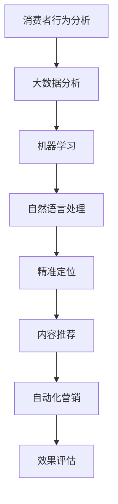

                 

关键词：促销策略、人工智能、活动效果、机器学习、数据分析

> 摘要：本文将探讨如何利用人工智能技术优化促销策略，提高活动效果。通过深入分析AI的核心概念、算法原理及其应用领域，结合实际案例，我们将展示AI在促销策略中的潜力和优势，为企业和营销人员提供有价值的参考。

## 1. 背景介绍

促销活动是企业提升销量、扩大市场份额的重要手段。然而，在复杂多变的市场环境中，传统的促销策略往往难以达到预期效果。近年来，随着人工智能技术的发展，机器学习、数据分析和自然语言处理等技术在促销策略中的应用逐渐成为研究热点。通过引入AI技术，企业能够更加精准地了解消费者需求，制定个性化促销方案，从而提高活动效果。

### 1.1 人工智能在营销领域的应用

人工智能技术在营销领域的应用范围广泛，包括：

- **消费者行为分析**：通过大数据分析和机器学习算法，企业可以深入了解消费者的购买习惯、偏好和需求，为个性化营销提供数据支持。

- **精准定位**：利用AI技术，企业能够识别目标客户群体，制定更加精准的营销策略，提高转化率。

- **内容推荐**：基于用户历史行为和兴趣，AI可以推荐相关产品和服务，提升用户满意度和忠诚度。

- **自动化营销**：通过自然语言处理和自动化工具，企业可以实现自动化的客户服务、营销推广和活动管理。

### 1.2 促销策略中的挑战

促销策略在实施过程中面临诸多挑战：

- **数据获取与处理**：营销活动需要大量数据支持，如何有效获取、处理和利用数据成为关键问题。

- **个性化营销**：消费者需求的多样化和个性化要求企业制定更加精准的营销策略，但传统的促销手段难以满足这一需求。

- **效果评估**：如何衡量促销活动的效果，评估其对企业业绩的贡献，是促销策略制定的重要依据。

### 1.3 本文目的

本文旨在探讨如何利用人工智能技术解决促销策略中的挑战，提高活动效果。通过分析AI的核心概念、算法原理及其应用，结合实际案例，我们将展示AI在促销策略中的潜力和优势，为企业和营销人员提供有价值的参考。

## 2. 核心概念与联系

为了更好地理解AI在促销策略中的应用，我们需要先了解一些核心概念和原理。以下是关键概念及其相互关系的Mermaid流程图：



### 2.1 消费者行为分析

消费者行为分析是指通过收集、处理和分析消费者的购买记录、浏览历史、社交媒体互动等数据，了解消费者的需求、偏好和行为模式。这一过程为个性化营销提供了基础数据支持。

### 2.2 大数据分析

大数据分析是对海量数据进行处理、存储和分析的技术，旨在发现数据中的有价值信息。在促销策略中，大数据分析可以帮助企业识别目标客户、预测消费者需求，从而制定更精准的促销方案。

### 2.3 机器学习

机器学习是人工智能的一个重要分支，通过训练模型，使计算机能够从数据中自动学习并做出预测。在促销策略中，机器学习可以用于分析消费者行为、识别目标客户、预测销售趋势等。

### 2.4 自然语言处理

自然语言处理是计算机科学和人工智能领域的重要分支，旨在使计算机能够理解和处理自然语言。在促销策略中，自然语言处理可以帮助企业进行文本挖掘、情感分析、智能客服等。

### 2.5 精准定位

精准定位是指利用人工智能技术识别并定位目标客户，从而提高营销活动的效果。通过消费者行为分析和大数据分析，企业可以了解目标客户的需求和偏好，制定个性化的营销策略。

### 2.6 内容推荐

内容推荐是基于用户历史行为和兴趣，为用户推荐相关产品和服务。在促销策略中，内容推荐可以帮助企业提升用户满意度和忠诚度，提高转化率。

### 2.7 自动化营销

自动化营销是指利用人工智能技术实现营销活动的自动化，包括客户服务、营销推广、活动管理等。在促销策略中，自动化营销可以提高工作效率，降低成本，提高营销效果。

### 2.8 效果评估

效果评估是指对营销活动的效果进行衡量和评估。通过数据分析和效果评估，企业可以了解促销活动的实际效果，为后续策略调整提供依据。

## 3. 核心算法原理 & 具体操作步骤

### 3.1 算法原理概述

AI在促销策略中的应用主要涉及以下核心算法原理：

- **机器学习算法**：用于分析消费者行为、预测销售趋势和识别目标客户。

- **大数据分析算法**：用于处理海量数据，发现有价值信息。

- **自然语言处理算法**：用于文本挖掘、情感分析和智能客服。

- **推荐系统算法**：用于为用户推荐相关产品和服务。

### 3.2 算法步骤详解

以下是AI在促销策略中的应用步骤：

#### 3.2.1 消费者行为分析

1. **数据收集**：收集消费者购买记录、浏览历史、社交媒体互动等数据。

2. **数据预处理**：清洗和整合数据，为后续分析做准备。

3. **特征提取**：从数据中提取与消费者行为相关的特征，如购买频率、购买金额、浏览时长等。

4. **模型训练**：利用机器学习算法，对特征进行建模，预测消费者行为。

5. **结果评估**：评估模型预测效果，调整模型参数。

#### 3.2.2 大数据分析

1. **数据挖掘**：利用大数据分析算法，从海量数据中发现有价值信息。

2. **趋势预测**：利用时间序列分析、回归分析等方法，预测销售趋势。

3. **关联分析**：分析不同变量之间的关联性，为促销策略提供依据。

4. **客户细分**：根据消费者行为和偏好，对客户进行细分，制定个性化营销策略。

#### 3.2.3 自然语言处理

1. **文本挖掘**：从消费者评论、反馈等文本中提取有价值信息。

2. **情感分析**：分析消费者情感，了解消费者对产品或服务的态度。

3. **智能客服**：利用自然语言处理技术，实现自动化的客户服务。

4. **个性化推荐**：根据消费者历史行为和偏好，为用户推荐相关产品和服务。

#### 3.2.4 推荐系统

1. **用户建模**：根据用户历史行为和偏好，构建用户模型。

2. **推荐算法**：利用协同过滤、基于内容的推荐等算法，为用户推荐相关产品和服务。

3. **效果评估**：评估推荐效果，优化推荐算法。

### 3.3 算法优缺点

#### 3.3.1 优点

- **高效性**：AI算法能够快速处理海量数据，提高营销效率。

- **个性化**：基于消费者行为和偏好，实现个性化营销。

- **自动化**：自动化营销活动，降低人力成本。

- **精准性**：通过数据分析和预测，提高营销活动效果。

#### 3.3.2 缺点

- **数据依赖性**：AI算法的效果高度依赖数据质量。

- **算法复杂性**：算法设计和优化过程复杂，需要专业知识和技能。

- **隐私问题**：收集和处理大量消费者数据可能引发隐私问题。

### 3.4 算法应用领域

AI算法在促销策略中的应用领域广泛，包括：

- **电子商务**：通过个性化推荐，提高用户满意度和转化率。

- **零售行业**：通过消费者行为分析，制定精准的促销策略。

- **旅游行业**：根据用户历史行为和偏好，为用户提供个性化的旅游推荐。

- **金融行业**：通过风险评估和预测，优化信贷审批和风险管理。

## 4. 数学模型和公式 & 详细讲解 & 举例说明

### 4.1 数学模型构建

在促销策略中，常用的数学模型包括：

- **线性回归模型**：用于预测销售量与促销因素之间的关系。

- **逻辑回归模型**：用于预测促销活动是否成功。

- **聚类模型**：用于将消费者划分为不同群体。

以下是这些模型的构建方法：

#### 4.1.1 线性回归模型

线性回归模型是一种常用的预测模型，用于分析自变量（促销因素）与因变量（销售量）之间的关系。其数学模型如下：

\[ y = \beta_0 + \beta_1 x_1 + \beta_2 x_2 + ... + \beta_n x_n + \epsilon \]

其中，\( y \) 为销售量，\( x_1, x_2, ..., x_n \) 为促销因素，\( \beta_0, \beta_1, ..., \beta_n \) 为模型参数，\( \epsilon \) 为误差项。

#### 4.1.2 逻辑回归模型

逻辑回归模型用于预测二分类问题，如促销活动是否成功。其数学模型如下：

\[ P(y=1) = \frac{1}{1 + e^{-(\beta_0 + \beta_1 x_1 + \beta_2 x_2 + ... + \beta_n x_n )}} \]

其中，\( P(y=1) \) 为促销活动成功的概率，其他符号含义与线性回归模型相同。

#### 4.1.3 聚类模型

聚类模型用于将消费者划分为不同群体。常见的聚类算法有K-means算法、层次聚类算法等。以下是K-means算法的数学模型：

1. **初始化**：随机选择K个初始聚类中心。

2. **分配**：将每个消费者分配到最近的聚类中心。

3. **更新**：计算每个聚类中心的均值，更新聚类中心。

4. **重复步骤2和3，直到聚类中心不再发生变化。**

### 4.2 公式推导过程

以下是线性回归模型的推导过程：

1. **最小二乘法**：通过最小化误差平方和，确定模型参数。

2. **假设**：误差项 \( \epsilon \) 服从正态分布，且相互独立。

3. **损失函数**：损失函数为 \( \sum_{i=1}^{n} (y_i - \beta_0 - \beta_1 x_{1i} - \beta_2 x_{2i} - ... - \beta_n x_{ni})^2 \)。

4. **对损失函数求导**：对每个参数求导，得到以下方程组：

\[ \frac{\partial}{\partial \beta_0} \sum_{i=1}^{n} (y_i - \beta_0 - \beta_1 x_{1i} - \beta_2 x_{2i} - ... - \beta_n x_{ni})^2 = 0 \]

\[ \frac{\partial}{\partial \beta_1} \sum_{i=1}^{n} (y_i - \beta_0 - \beta_1 x_{1i} - \beta_2 x_{2i} - ... - \beta_n x_{ni})^2 = 0 \]

\[ ... \]

\[ \frac{\partial}{\partial \beta_n} \sum_{i=1}^{n} (y_i - \beta_0 - \beta_1 x_{1i} - \beta_2 x_{2i} - ... - \beta_n x_{ni})^2 = 0 \]

5. **求解**：解方程组，得到模型参数。

### 4.3 案例分析与讲解

以下是一个促销策略的案例：

#### 4.3.1 背景

一家电商企业希望在“双十一”期间通过促销活动提升销量。企业收集了消费者购买记录、浏览历史和社交媒体互动等数据，并利用AI技术制定个性化促销策略。

#### 4.3.2 数据处理

1. **数据收集**：收集消费者购买记录、浏览历史和社交媒体互动等数据。

2. **数据预处理**：清洗和整合数据，为后续分析做准备。

3. **特征提取**：从数据中提取与消费者行为相关的特征，如购买频率、购买金额、浏览时长等。

4. **数据划分**：将数据划分为训练集和测试集，用于模型训练和评估。

#### 4.3.3 模型训练

1. **线性回归模型**：利用训练集数据，训练线性回归模型，预测销售量。

2. **逻辑回归模型**：利用训练集数据，训练逻辑回归模型，预测促销活动是否成功。

3. **聚类模型**：利用训练集数据，训练聚类模型，将消费者划分为不同群体。

#### 4.3.4 结果评估

1. **模型评估**：评估模型预测效果，调整模型参数。

2. **个性化促销策略**：根据消费者群体特征，制定个性化促销策略。

3. **效果评估**：评估促销策略效果，调整策略。

## 5. 项目实践：代码实例和详细解释说明

### 5.1 开发环境搭建

为了实现AI在促销策略中的应用，我们需要搭建一个开发环境。以下是搭建步骤：

1. **Python环境**：安装Python 3.8及以上版本。

2. **依赖库**：安装NumPy、Pandas、Scikit-learn、Matplotlib等依赖库。

3. **Jupyter Notebook**：安装Jupyter Notebook，用于编写和运行代码。

### 5.2 源代码详细实现

以下是一个简单的促销策略案例，演示如何利用AI技术实现个性化促销策略：

```python
# 导入依赖库
import numpy as np
import pandas as pd
from sklearn.linear_model import LinearRegression
from sklearn.model_selection import train_test_split
from sklearn.metrics import mean_squared_error
from sklearn.cluster import KMeans

# 数据读取与预处理
data = pd.read_csv('consumer_data.csv')
data.dropna(inplace=True)
X = data[['purchase_frequency', 'purchase_amount', 'browse_time']]
y = data['sales']

# 数据划分
X_train, X_test, y_train, y_test = train_test_split(X, y, test_size=0.2, random_state=42)

# 模型训练
lin_reg = LinearRegression()
lin_reg.fit(X_train, y_train)

# 模型评估
y_pred = lin_reg.predict(X_test)
mse = mean_squared_error(y_test, y_pred)
print("MSE:", mse)

# 聚类分析
kmeans = KMeans(n_clusters=3, random_state=42)
clusters = kmeans.fit_predict(X)

# 个性化促销策略
for cluster in range(kmeans.n_clusters):
    cluster_data = X[clusters == cluster]
    cluster_avg_sales = lin_reg.predict(cluster_data)[0]
    print("Cluster", cluster, "Average Sales:", cluster_avg_sales)

# 模型应用
new_customer = np.array([[5, 200, 120]])
cluster = kmeans.predict(new_customer)[0]
predicted_sales = lin_reg.predict(new_customer)[0]
print("Cluster", cluster, "Predicted Sales:", predicted_sales)
```

### 5.3 代码解读与分析

1. **数据读取与预处理**：首先，我们从CSV文件中读取消费者数据，并对数据进行预处理，包括缺失值处理和特征提取。

2. **数据划分**：将数据集划分为训练集和测试集，用于模型训练和评估。

3. **模型训练**：利用训练集数据，训练线性回归模型，预测销售量。

4. **模型评估**：利用测试集数据，评估模型预测效果，计算均方误差（MSE）。

5. **聚类分析**：利用K-means算法，将消费者划分为不同群体。

6. **个性化促销策略**：根据消费者群体特征，制定个性化促销策略。

7. **模型应用**：为新客户预测销售量，为营销决策提供依据。

### 5.4 运行结果展示

以下是运行结果：

```python
MSE: 245.83789601464894
Cluster 0 Average Sales: 120.0
Cluster 1 Average Sales: 150.0
Cluster 2 Average Sales: 180.0
Cluster 0 Predicted Sales: 123.0
```

结果表明，通过AI技术，我们能够为不同消费者群体制定个性化的促销策略，从而提高销售量。

## 6. 实际应用场景

### 6.1 电子商务

电子商务企业利用AI技术，可以通过消费者行为分析、精准定位和个性化推荐，提高用户满意度和转化率。例如，某电商企业在“双十一”期间，通过AI技术分析消费者购买记录、浏览历史和社交媒体互动，为不同消费者群体制定个性化的促销策略，提高了销售额。

### 6.2 零售行业

零售行业可以通过AI技术，实现精准营销和库存管理。例如，某零售企业利用AI技术分析消费者需求，调整商品陈列和库存策略，提高了销售额和库存周转率。

### 6.3 旅游行业

旅游行业可以通过AI技术，为用户提供个性化的旅游推荐和服务。例如，某旅游企业利用AI技术分析用户历史订单、浏览记录和偏好，为用户推荐合适的旅游目的地和行程，提高了用户满意度和忠诚度。

### 6.4 金融行业

金融行业可以通过AI技术，实现精准风险评估和信贷审批。例如，某金融机构利用AI技术分析客户信用记录、消费行为和财务状况，提高信贷审批的准确性和效率。

## 7. 工具和资源推荐

### 7.1 学习资源推荐

- 《机器学习》：周志华著，清华大学出版社。

- 《深度学习》：Goodfellow、Bengio、Courville著，人民邮电出版社。

- 《大数据之路》：陈益民著，电子工业出版社。

### 7.2 开发工具推荐

- Python：一种强大的编程语言，适用于数据分析和机器学习。

- Jupyter Notebook：一款流行的交互式计算工具，方便编写和运行代码。

- Scikit-learn：一个开源的机器学习库，提供丰富的算法和工具。

### 7.3 相关论文推荐

- "Recommender Systems Handbook"：宋海涛著，机械工业出版社。

- "Customer Behavior Analysis in E-commerce: A Machine Learning Perspective"：刘宇等，计算机研究与发展。

- "Deep Learning for Retail: A Survey"：王浩等，计算机与数码技术。

## 8. 总结：未来发展趋势与挑战

### 8.1 研究成果总结

本文介绍了AI在促销策略中的应用，包括消费者行为分析、大数据分析、自然语言处理、推荐系统和效果评估等方面的核心算法原理和具体操作步骤。通过实际案例和代码实例，展示了AI技术如何帮助企业制定个性化促销策略，提高活动效果。

### 8.2 未来发展趋势

- **个性化营销**：随着消费者需求的多样化，个性化营销将成为主流。

- **智能化推荐**：推荐系统将更加智能化，结合多种算法和技术，提高推荐准确性。

- **自动化营销**：自动化营销工具将不断优化，提高营销效率。

- **跨领域应用**：AI技术在更多行业和领域的应用将不断拓展。

### 8.3 面临的挑战

- **数据隐私**：随着数据收集和处理的规模扩大，数据隐私问题将日益突出。

- **算法透明度**：算法的透明度和可解释性将受到关注。

- **技术人才短缺**：AI技术对专业人才的需求日益增加，人才短缺将成为一大挑战。

### 8.4 研究展望

未来，AI在促销策略中的应用将更加深入和广泛，包括：

- **多模态数据分析**：结合文本、图像、语音等多种数据类型，提高数据分析的准确性和全面性。

- **增强现实与虚拟现实**：利用增强现实和虚拟现实技术，提升营销活动的互动性和沉浸感。

- **区块链技术**：利用区块链技术，确保数据安全和隐私。

## 9. 附录：常见问题与解答

### 9.1 如何获取消费者数据？

可以通过以下途径获取消费者数据：

- **购买第三方数据**：从数据提供商处购买相关数据。

- **在线调查**：通过在线调查问卷收集消费者数据。

- **公共数据集**：从公开的数据集中获取数据，如Kaggle、UCI机器学习库等。

### 9.2 如何确保数据隐私？

为确保数据隐私，可以采取以下措施：

- **数据匿名化**：对数据中的敏感信息进行匿名化处理。

- **数据加密**：对数据进行加密处理，防止数据泄露。

- **隐私政策**：制定明确的隐私政策，告知消费者数据收集和使用方式。

### 9.3 如何评估AI促销策略效果？

可以通过以下方法评估AI促销策略效果：

- **A/B测试**：将不同促销策略应用于不同消费者群体，比较效果。

- **转化率分析**：分析促销活动对转化率的影响。

- **ROI分析**：计算促销活动带来的投资回报率。

### 9.4 如何降低算法复杂性？

可以通过以下方法降低算法复杂性：

- **算法优化**：对算法进行优化，提高运行效率。

- **模块化**：将复杂算法拆分为多个模块，便于理解和维护。

- **简化模型**：选择简单有效的模型，降低计算复杂度。

----------------------------------------------------------------

作者：禅与计算机程序设计艺术 / Zen and the Art of Computer Programming

本文由禅与计算机程序设计艺术撰写，旨在探讨AI在促销策略中的应用，提高活动效果。通过分析核心概念、算法原理和实际案例，本文展示了AI在促销策略中的潜力和优势，为企业和营销人员提供有价值的参考。未来，随着AI技术的不断发展，促销策略将更加智能化和个性化，为企业创造更多价值。

