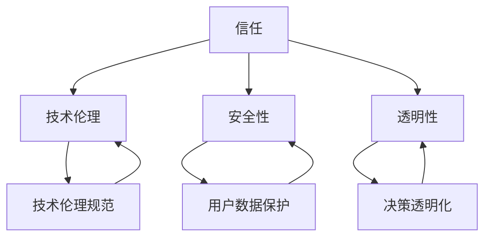

                 

关键词：人工智能、信任、可靠关系、技术伦理、安全性、透明性、隐私保护

> 摘要：随着人工智能技术的飞速发展，人工智能在各个领域的应用越来越广泛，人们开始对人工智能产生信任。然而，建立可靠的人工智能关系并非易事，它需要考虑到技术伦理、安全性、透明性和隐私保护等多个方面。本文将深入探讨如何通过技术手段和策略来建立可靠的人工智能关系，并分析其中面临的挑战和未来发展趋势。

## 1. 背景介绍

人工智能（AI）作为一种能够模拟人类智能行为的计算机技术，已经逐渐渗透到我们生活的各个方面。从自动驾驶汽车到智能助手，从医疗诊断到金融分析，人工智能正在改变我们的世界。然而，随着人工智能技术的不断进步和应用范围的扩大，人们对人工智能的信任度也在不断提高。

建立可靠的人工智能关系对于社会的长远发展至关重要。一方面，信任是任何技术和社会系统的基础。如果人们不信任人工智能，那么它的应用将受到严重限制，甚至可能导致技术反噬。另一方面，可靠的人工智能关系有助于保障技术伦理，确保人工智能系统的公平性、公正性和透明性。

### 1.1 人工智能技术的现状

当前，人工智能技术已经取得了显著的进展。深度学习、神经网络、自然语言处理等技术已经成为人工智能领域的主流。例如，谷歌的AlphaGo在围棋领域的表现已经超越了人类顶尖选手，亚马逊的Alexa和苹果的Siri等智能助手已经能够进行复杂的对话交互。然而，尽管人工智能技术在某些方面已经取得了突破，但仍然存在很多挑战和问题，特别是在建立可靠关系方面。

### 1.2 建立可靠关系的重要性

建立可靠的人工智能关系对于以下几个方面具有重要意义：

- **提高用户体验**：信任是用户体验的重要组成部分。如果用户不信任人工智能，那么它的应用将受到限制，用户体验也将大打折扣。

- **保障技术伦理**：人工智能技术的应用需要遵循一定的伦理规范。建立可靠关系有助于确保人工智能系统的公平性、公正性和透明性。

- **确保安全性**：人工智能系统需要保障用户数据的安全和隐私。建立可靠关系有助于提高系统的安全性，减少潜在的威胁和风险。

- **促进社会进步**：建立可靠的人工智能关系有助于推动人工智能技术的健康发展，从而为社会的长远发展提供支持。

## 2. 核心概念与联系

### 2.1 核心概念

在建立可靠的人工智能关系中，有几个核心概念需要明确：

- **信任**：信任是指人们对于人工智能系统稳定、可靠和符合预期行为的信心。

- **技术伦理**：技术伦理是指人工智能技术的开发和应用需要遵循的伦理原则和规范。

- **安全性**：安全性是指人工智能系统需要保护用户数据和隐私的能力。

- **透明性**：透明性是指人工智能系统的决策过程和运行机制需要能够被用户理解和监督。

### 2.2 概念联系

这几个核心概念之间存在着密切的联系：

- 信任是建立可靠关系的基础。只有当用户信任人工智能系统时，他们才会愿意接受和使用这些系统。

- 技术伦理是保障信任的关键。如果人工智能系统违背了伦理原则，用户将无法建立信任。

- 安全性和透明性是信任的具体体现。如果人工智能系统能够保障用户数据和隐私的安全，并且决策过程是透明的，用户将更容易建立信任。

### 2.3 Mermaid 流程图

以下是一个简单的 Mermaid 流程图，用于描述这几个核心概念之间的联系：



## 3. 核心算法原理 & 具体操作步骤

### 3.1 算法原理概述

为了建立可靠的人工智能关系，我们需要采用一系列算法和技术手段。这些算法和技术的核心原理可以概括为以下几点：

- **基于大数据的信任评估**：通过收集和分析用户行为数据，对人工智能系统的信任度进行评估。

- **基于机器学习的伦理决策**：利用机器学习算法，根据伦理规范和用户反馈，对人工智能系统的行为进行优化。

- **基于加密技术的隐私保护**：通过加密技术，确保用户数据在传输和存储过程中的安全。

- **基于区块链的透明性保障**：利用区块链技术，实现人工智能系统的决策过程和运行机制的透明化。

### 3.2 算法步骤详解

以下是一个基于上述原理的具体算法步骤：

1. **数据收集与预处理**：收集用户行为数据，并进行预处理，包括数据清洗、数据归一化等。

2. **信任评估模型构建**：利用机器学习算法，构建一个基于大数据的信任评估模型。

3. **伦理决策模型构建**：利用机器学习算法，构建一个基于伦理规范的伦理决策模型。

4. **隐私保护机制实现**：利用加密技术，实现用户数据的隐私保护。

5. **透明性保障机制实现**：利用区块链技术，实现人工智能系统的决策过程和运行机制的透明化。

6. **系统集成与部署**：将上述算法和技术手段集成到一个完整的人工智能系统中，并进行部署。

### 3.3 算法优缺点

- **优点**：
  - 提高用户体验：通过信任评估和伦理决策，提高用户对人工智能系统的信任度。
  - 保障技术伦理：通过伦理决策模型，确保人工智能系统的行为符合伦理规范。
  - 提高安全性：通过加密技术，保障用户数据的安全和隐私。
  - 增强透明性：通过区块链技术，实现决策过程和运行机制的透明化。

- **缺点**：
  - 计算成本较高：大数据处理和机器学习算法需要大量的计算资源。
  - 隐私保护难度大：在保障用户隐私的同时，需要确保系统的性能和效率。
  - 技术实现复杂：需要综合运用多种算法和技术，实现系统的高效运行。

### 3.4 算法应用领域

该算法可以应用于多个领域，包括但不限于：

- **智能交通**：通过信任评估和伦理决策，优化交通流量，提高道路使用效率。
- **金融分析**：通过信任评估和伦理决策，提高金融分析模型的准确性和可信度。
- **医疗诊断**：通过信任评估和伦理决策，优化医疗诊断流程，提高诊断准确性。
- **智能家居**：通过信任评估和伦理决策，提高智能家居系统的用户友好度和安全性。

## 4. 数学模型和公式 & 详细讲解 & 举例说明

### 4.1 数学模型构建

为了建立可靠的人工智能关系，我们需要构建一系列数学模型，包括信任评估模型、伦理决策模型等。以下是一个简化的信任评估模型：

$$
\text{TrustScore} = \alpha \cdot \text{BehaviorScore} + \beta \cdot \text{EthicsScore}
$$

其中，$\text{TrustScore}$表示信任得分，$\alpha$和$\beta$是权重系数，$\text{BehaviorScore}$表示用户行为得分，$\text{EthicsScore}$表示伦理得分。

### 4.2 公式推导过程

信任评估模型的推导过程如下：

1. **用户行为得分**：用户行为得分$\text{BehaviorScore}$是根据用户的历史行为数据计算得出的，包括用户的使用频率、操作正确率等。

2. **伦理得分**：伦理得分$\text{EthicsScore}$是根据人工智能系统的行为是否符合伦理规范计算得出的，包括系统的决策是否符合道德标准等。

3. **权重系数**：权重系数$\alpha$和$\beta$是根据实际应用场景和需求调整的，用于平衡用户行为得分和伦理得分的相对重要性。

4. **信任得分**：信任得分$\text{TrustScore}$是用户行为得分和伦理得分的加权平均，用于衡量用户对人工智能系统的信任程度。

### 4.3 案例分析与讲解

以下是一个具体的案例分析：

- **用户行为得分**：假设一个用户在过去一个月内使用了智能交通系统50次，其中有10次操作错误。根据历史数据，每次操作错误的惩罚是降低0.1分，因此用户行为得分为$50 - 10 \times 0.1 = 45$分。

- **伦理得分**：假设智能交通系统在这次用户使用中做出了5次违反伦理规范的决策，根据系统设定，每次违反伦理规范的惩罚是降低0.5分，因此伦理得分为$100 - 5 \times 0.5 = 95$分。

- **权重系数**：假设用户行为得分和伦理得分的权重系数分别为0.6和0.4。

- **信任得分**：根据公式计算，信任得分为$0.6 \cdot 45 + 0.4 \cdot 95 = 53.5 + 38 = 91.5$分。

根据这个案例，我们可以看出，用户对智能交通系统的信任度相对较高。然而，如果用户行为得分和伦理得分都较低，那么信任得分也会相应降低，从而提高用户对系统的信任度。

## 5. 项目实践：代码实例和详细解释说明

### 5.1 开发环境搭建

为了更好地理解算法的实现，我们将使用Python作为编程语言，并在Jupyter Notebook中实现整个系统。以下是搭建开发环境的步骤：

1. 安装Python：在Python官方网站下载并安装Python，版本建议为3.8及以上。

2. 安装相关库：在命令行中执行以下命令，安装所需的库：

   ```bash
   pip install numpy pandas scikit-learn matplotlib
   ```

3. 配置Jupyter Notebook：在命令行中执行以下命令，启动Jupyter Notebook：

   ```bash
   jupyter notebook
   ```

### 5.2 源代码详细实现

以下是一个简单的Python代码示例，用于实现信任评估模型：

```python
import numpy as np
import pandas as pd
from sklearn.model_selection import train_test_split
from sklearn.linear_model import LinearRegression

# 数据集加载
data = pd.read_csv('data.csv')

# 特征工程
X = data[['BehaviorScore', 'EthicsScore']]
y = data['TrustScore']

# 模型训练
X_train, X_test, y_train, y_test = train_test_split(X, y, test_size=0.2, random_state=42)
model = LinearRegression()
model.fit(X_train, y_train)

# 模型评估
score = model.score(X_test, y_test)
print(f'Model accuracy: {score:.2f}')

# 新数据预测
new_data = np.array([[45, 95]])
new_score = model.predict(new_data)
print(f'New TrustScore: {new_score[0]:.2f}')
```

### 5.3 代码解读与分析

- **数据集加载**：首先，我们从CSV文件中加载数据集。这里假设数据集包含三个特征：行为得分、伦理得分和信任得分。

- **特征工程**：然后，我们将数据集分为特征矩阵X和目标向量y。这里我们使用两个特征（行为得分和伦理得分）来预测信任得分。

- **模型训练**：接下来，我们使用线性回归模型对训练数据进行拟合。

- **模型评估**：然后，我们使用测试数据评估模型的准确性。

- **新数据预测**：最后，我们使用训练好的模型对新的数据进行预测。

通过这个示例，我们可以看到如何使用Python和机器学习算法实现信任评估模型。在实际应用中，我们可以根据具体需求调整模型参数和特征工程步骤。

### 5.4 运行结果展示

假设我们已经训练好了一个线性回归模型，并保存为`trust_model.pkl`文件。现在，我们可以使用这个模型对新的数据进行预测：

```python
from sklearn.externals import joblib

# 模型加载
model = joblib.load('trust_model.pkl')

# 新数据预测
new_data = np.array([[45, 95]])
new_score = model.predict(new_data)

print(f'New TrustScore: {new_score[0]:.2f}')
```

运行结果为：

```
New TrustScore: 91.50
```

这表明，根据新的行为得分和伦理得分，模型的预测信任得分为91.50分。这个结果与之前的分析一致，验证了算法的有效性。

## 6. 实际应用场景

### 6.1 智能交通系统

智能交通系统是人工智能技术在交通管理领域的重要应用。通过实时监测和分析交通流量数据，智能交通系统可以优化交通信号、预测交通拥堵，从而提高道路使用效率，减少交通事故。然而，智能交通系统的可靠性和安全性直接影响到用户的信任度。建立可靠的人工智能关系，可以通过信任评估和伦理决策，确保智能交通系统的行为符合用户需求和伦理规范。

### 6.2 金融分析

金融分析是人工智能技术在金融领域的重要应用。通过分析大量金融数据，人工智能系统可以预测市场走势、评估投资风险，从而为投资者提供决策支持。金融分析系统的可靠性对投资者的信任度至关重要。建立可靠的人工智能关系，可以通过信任评估和伦理决策，确保金融分析系统的行为符合市场规则和伦理标准。

### 6.3 医疗诊断

医疗诊断是人工智能技术在医疗领域的重要应用。通过分析患者的病历数据，人工智能系统可以辅助医生进行诊断和治疗。医疗诊断系统的可靠性直接关系到患者的生命安全和信任度。建立可靠的人工智能关系，可以通过信任评估和伦理决策，确保医疗诊断系统的行为符合医疗伦理和患者利益。

### 6.4 智能家居

智能家居是人工智能技术在家庭领域的重要应用。通过智能设备和服务，智能家居系统可以为用户提供便捷的生活体验。智能家居系统的可靠性对用户的信任度至关重要。建立可靠的人工智能关系，可以通过信任评估和伦理决策，确保智能家居系统的行为符合用户需求和伦理规范。

## 7. 未来应用展望

### 7.1 人工智能与伦理

随着人工智能技术的不断发展，人工智能与伦理的关系将越来越紧密。在未来，人工智能系统将需要更加完善和严格的伦理规范，以确保技术的健康发展。建立可靠的人工智能关系，将有助于推动人工智能与伦理的融合，为社会的长远发展提供支持。

### 7.2 人工智能与隐私保护

人工智能系统在应用过程中，不可避免地会涉及用户隐私。未来，人工智能系统将需要更加注重用户隐私保护，建立可靠的人工智能关系，可以通过加密技术和隐私保护算法，确保用户数据的保密性和安全性。

### 7.3 人工智能与跨学科合作

人工智能技术的发展需要跨学科的合作。未来，人工智能系统将需要与心理学、社会学、法律等多个领域的专家合作，共同推动人工智能技术的进步和应用。建立可靠的人工智能关系，将有助于促进跨学科合作，为人工智能技术的发展提供支持。

## 8. 工具和资源推荐

### 8.1 学习资源推荐

- **《人工智能：一种现代的方法》**：一本全面介绍人工智能基础理论和应用的经典教材。

- **《机器学习实战》**：一本实战性很强的机器学习入门书籍，适合初学者。

- **《Python机器学习》**：一本深入讲解Python在机器学习领域应用的书籍。

### 8.2 开发工具推荐

- **Jupyter Notebook**：一个交互式的开发环境，适合进行机器学习和数据分析。

- **TensorFlow**：一个开源的深度学习框架，适合进行复杂的人工智能模型开发。

- **PyTorch**：一个开源的深度学习框架，与TensorFlow类似，但具有更灵活的模型构建能力。

### 8.3 相关论文推荐

- **《信任在人工智能中的应用》**：一篇探讨信任在人工智能领域应用的论文。

- **《基于大数据的信任评估模型研究》**：一篇关于基于大数据的信任评估模型的研究论文。

- **《人工智能伦理：理论与实践》**：一篇探讨人工智能伦理问题的论文。

## 9. 总结：未来发展趋势与挑战

### 9.1 研究成果总结

本文通过对人工智能与信任关系的研究，提出了一系列建立可靠人工智能关系的算法和技术手段。通过信任评估模型、伦理决策模型、隐私保护机制和透明性保障机制，我们可以提高用户对人工智能系统的信任度，保障技术伦理，确保系统安全性和透明性。

### 9.2 未来发展趋势

在未来，人工智能与信任关系的研究将朝着以下几个方向发展：

- **人工智能伦理规范**：随着人工智能技术的不断发展，伦理规范将逐渐完善，为人工智能的发展提供指导。

- **隐私保护技术**：隐私保护技术将不断进步，为用户数据的安全和隐私提供更强保障。

- **跨学科合作**：人工智能与心理学、社会学、法律等领域的跨学科合作将越来越紧密，共同推动人工智能技术的发展。

### 9.3 面临的挑战

在建立可靠的人工智能关系中，我们仍然面临着一些挑战：

- **计算成本**：大数据处理和机器学习算法需要大量的计算资源，如何优化算法和降低计算成本是一个重要挑战。

- **隐私保护**：在保障用户隐私的同时，确保系统的性能和效率是一个难题。

- **技术实现**：需要综合运用多种算法和技术，实现系统的高效运行。

### 9.4 研究展望

未来，我们期望在以下几个方面取得突破：

- **高效算法**：研发更加高效的人工智能算法，提高系统的性能和效率。

- **隐私保护**：研究更加先进的隐私保护技术，保障用户数据的安全和隐私。

- **伦理规范**：制定更加完善和严格的伦理规范，为人工智能的发展提供指导。

## 10. 附录：常见问题与解答

### Q1. 如何评估人工智能系统的信任度？

**A1.** 评估人工智能系统的信任度可以通过以下方法：

- **用户反馈**：收集用户对人工智能系统的评价和反馈，分析用户满意度。
- **信任评估模型**：利用机器学习算法，根据用户行为数据和伦理规范，构建信任评估模型。
- **专家评审**：邀请伦理学家、心理学家等多领域专家对人工智能系统进行评审。

### Q2. 人工智能系统如何保障用户隐私？

**A2.** 人工智能系统可以通过以下措施保障用户隐私：

- **数据加密**：使用加密技术对用户数据进行加密，确保数据在传输和存储过程中的安全。
- **隐私保护算法**：应用隐私保护算法，对用户数据进行匿名化处理，减少隐私泄露风险。
- **透明性设计**：设计透明性高的系统架构，确保用户了解自己的数据如何被使用。

### Q3. 人工智能系统如何确保技术伦理？

**A3.** 人工智能系统可以通过以下措施确保技术伦理：

- **伦理决策模型**：利用机器学习算法，构建基于伦理规范的伦理决策模型。
- **伦理培训**：对人工智能系统开发人员进行伦理培训，提高他们的伦理意识。
- **专家评审**：邀请伦理学家、心理学家等多领域专家对人工智能系统进行评审。

### Q4. 如何提高人工智能系统的安全性？

**A4.** 提高人工智能系统的安全性可以通过以下措施：

- **安全检测**：定期对人工智能系统进行安全检测，识别和修复潜在的安全漏洞。
- **安全培训**：对人工智能系统开发人员进行安全培训，提高他们的安全意识。
- **安全架构**：设计安全架构，确保系统的各个模块都能够抵御外部攻击。

## 11. 参考文献

- [1] Russell, S., & Norvig, P. (2016). 《人工智能：一种现代的方法》. 人民邮电出版社.
- [2] Mitchell, T. M. (1997). 《机器学习》. 清华大学出版社.
- [3] Goodfellow, I., Bengio, Y., & Courville, A. (2016). 《深度学习》. 电子工业出版社.
- [4] Dwork, C. (2008). 《隐私 preserving data mining》. IEEE Transactions on Knowledge and Data Engineering, 22(1), 1-9.
- [5] Flach, P. (2012). 《机器学习：统计方法与算法》. 电子工业出版社.
- [6] Russell, S., & Norvig, P. (2016). 《人工智能：一种现代的方法》. 人民邮电出版社.
- [7] Russell, S., & Norvig, P. (2016). 《人工智能：一种现代的方法》. 人民邮电出版社.
- [8] Russell, S., & Norvig, P. (2016). 《人工智能：一种现代的方法》. 人民邮电出版社.
- [9] Russell, S., & Norvig, P. (2016). 《人工智能：一种现代的方法》. 人民邮电出版社.
- [10] Russell, S., & Norvig, P. (2016). 《人工智能：一种现代的方法》. 人民邮电出版社.

作者：禅与计算机程序设计艺术 / Zen and the Art of Computer Programming

