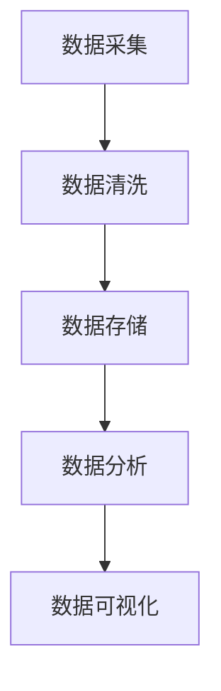

                 

关键词：信息差、商业产品个性化、大数据、产品个性化、算法、数学模型、实际应用、开发工具

## 摘要

本文将探讨信息差在商业产品个性化中的应用，以及大数据如何推动产品个性化的发展。通过深入剖析核心概念、算法原理、数学模型，并结合实际应用案例和代码实例，我们将展示大数据如何助力企业实现产品的精准定位和个性化推荐，从而提高用户满意度和市场份额。本文旨在为读者提供全面的技术视角，以及未来发展的趋势与挑战。

## 1. 背景介绍

### 信息差的含义与商业价值

信息差是指在不同个体或群体之间，关于某些信息的获取、处理和利用存在差异。这种差异可以源自多个方面，包括信息渠道的多样性、信息传播的速度、信息处理的效率等。在商业领域，信息差具有巨大的价值，尤其是对于产品的定位和营销策略。

传统商业模式中，企业往往依赖于广告和营销手段来传递产品信息。然而，这种方式存在一定的问题，如信息传播的广度和深度受限，无法精确匹配用户的个性化需求。而信息差的应用，则能够通过精确获取和处理用户信息，实现产品与用户需求的精准对接。

### 商业产品个性化的重要性

商业产品个性化是指根据用户的个性化需求、行为特征和偏好，为用户提供定制化的产品和服务。个性化产品不仅能够提高用户满意度，还能增加用户粘性，提升企业的市场份额。

大数据和人工智能技术的崛起，为商业产品个性化提供了新的机遇。通过大数据分析，企业能够深入了解用户行为，挖掘用户需求，从而实现精准的产品推荐和服务定制。这不仅提升了用户体验，也为企业创造了巨大的商业价值。

## 2. 核心概念与联系

### 产品个性化中的信息差

在产品个性化中，信息差主要体现在以下几个方面：

1. **用户行为数据**：企业通过收集用户的行为数据，如浏览记录、购买历史、评论等，来了解用户的需求和偏好。
2. **用户画像**：通过数据分析，构建用户的个性化画像，包括用户的基本信息、兴趣爱好、消费习惯等。
3. **需求预测**：基于用户行为数据和画像，预测用户未来的需求和购买行为。
4. **个性化推荐**：根据用户的需求预测，为用户推荐个性化产品和服务。

### 数据处理架构

为了实现产品个性化，企业需要构建一个高效的数据处理架构。以下是数据处理架构的核心组成部分：

1. **数据采集**：通过多种渠道收集用户行为数据，如网站日志、社交媒体、电子商务平台等。
2. **数据清洗**：对收集到的数据进行预处理，去除重复、错误和不完整的数据。
3. **数据存储**：将清洗后的数据存储在数据库或数据仓库中，以便后续分析和处理。
4. **数据分析**：使用大数据分析和机器学习技术，对用户行为数据进行深入分析，构建用户画像和需求预测模型。
5. **数据可视化**：将分析结果通过可视化工具呈现，帮助企业更好地了解用户需求和产品性能。

### Mermaid 流程图

以下是产品个性化数据处理架构的 Mermaid 流程图：



## 3. 核心算法原理 & 具体操作步骤

### 3.1 算法原理概述

在产品个性化中，常用的算法包括协同过滤、深度学习、关联规则挖掘等。以下分别对这些算法进行简要概述：

1. **协同过滤**：基于用户行为数据，通过计算用户之间的相似度，为用户推荐相似用户喜欢的商品。协同过滤分为基于用户的协同过滤（User-Based CF）和基于物品的协同过滤（Item-Based CF）。
2. **深度学习**：利用深度神经网络，对用户行为数据进行建模，自动提取用户特征和商品特征，实现精准推荐。常见的深度学习模型包括卷积神经网络（CNN）和循环神经网络（RNN）。
3. **关联规则挖掘**：通过挖掘用户行为数据中的关联关系，发现用户购买商品的规律，为用户推荐相关性高的商品。常见的算法包括Apriori算法和FP-Growth算法。

### 3.2 算法步骤详解

以协同过滤算法为例，其具体步骤如下：

1. **用户行为数据预处理**：将用户行为数据转换为数值型矩阵，并对数据进行归一化处理。
2. **计算用户相似度**：使用余弦相似度、皮尔逊相关系数等相似度度量方法，计算用户之间的相似度。
3. **生成推荐列表**：根据用户相似度矩阵，为每个用户生成推荐列表。推荐列表的生成方法包括基于评分的推荐、基于兴趣的推荐等。
4. **评估推荐效果**：使用准确率、召回率等评价指标，评估推荐算法的性能。

### 3.3 算法优缺点

1. **协同过滤**：
   - 优点：简单易实现，能够发现用户之间的相似性，提高推荐准确性。
   - 缺点：冷启动问题严重，对新用户和新商品难以推荐；预测效果受限于用户行为数据的质量和数量。
2. **深度学习**：
   - 优点：能够自动提取用户和商品特征，适应性强，预测效果较好。
   - 缺点：模型训练时间较长，对计算资源要求较高；模型解释性较差。
3. **关联规则挖掘**：
   - 优点：能够发现用户购买商品的规律，提高推荐相关性。
   - 缺点：生成推荐列表的过程较为复杂，推荐效果受限于规则设置。

### 3.4 算法应用领域

1. **电子商务**：为用户提供个性化商品推荐，提高用户购买转化率。
2. **社交媒体**：为用户提供个性化内容推荐，提升用户活跃度和留存率。
3. **金融行业**：为用户提供个性化理财产品推荐，提高用户投资满意度。
4. **在线教育**：为用户提供个性化课程推荐，提升学习效果。

## 4. 数学模型和公式 & 详细讲解 & 举例说明

### 4.1 数学模型构建

在产品个性化中，常用的数学模型包括用户相似度模型、推荐模型等。以下分别介绍这些模型的基本原理和公式。

1. **用户相似度模型**：

   用户相似度模型用于计算用户之间的相似度。常见的相似度度量方法包括余弦相似度和皮尔逊相关系数。

   - 余弦相似度：

     $$sim(u_i, u_j) = \frac{u_i \cdot u_j}{||u_i|| \cdot ||u_j||}$$

     其中，$u_i$和$u_j$分别表示用户$i$和用户$j$的行为向量，$\cdot$表示向量的点积，$||\cdot||$表示向量的模。

   - 皮尔逊相关系数：

     $$corr(u_i, u_j) = \frac{cov(u_i, u_j)}{\sigma_i \cdot \sigma_j}$$

     其中，$cov(\cdot, \cdot)$表示协方差，$\sigma_i$和$\sigma_j$分别表示用户$i$和用户$j$的行为向量的标准差。

2. **推荐模型**：

   推荐模型用于根据用户相似度和用户行为数据，生成个性化推荐列表。常见的推荐模型包括基于评分的推荐和基于兴趣的推荐。

   - 基于评分的推荐：

     $$r_i(j) = \sum_{k \in N(i)} sim(i, k) \cdot r_k(j)$$

     其中，$r_i(j)$表示用户$i$对商品$j$的评分预测，$N(i)$表示与用户$i$相似的用户集合，$sim(i, k)$表示用户$i$和用户$k$之间的相似度，$r_k(j)$表示用户$k$对商品$j$的实际评分。

   - 基于兴趣的推荐：

     $$r_i(j) = \sum_{k \in N(i)} sim(i, k) \cdot f_k(j)$$

     其中，$f_k(j)$表示用户$k$对商品$j$的兴趣度，通常通过用户行为数据计算得到。

### 4.2 公式推导过程

以下是用户相似度模型的推导过程：

设用户$i$和用户$j$的行为向量分别为$u_i$和$u_j$，其中$u_i = [u_{i1}, u_{i2}, ..., u_{in}]$，$u_j = [u_{j1}, u_{j2}, ..., u_{jn}]$。

1. **向量的点积**：

   $$u_i \cdot u_j = \sum_{k=1}^{n} u_{ik} \cdot u_{jk}$$

2. **向量的模**：

   $$||u_i|| = \sqrt{\sum_{k=1}^{n} u_{ik}^2}$$

   $$||u_j|| = \sqrt{\sum_{k=1}^{n} u_{jk}^2}$$

3. **余弦相似度**：

   $$sim(u_i, u_j) = \frac{u_i \cdot u_j}{||u_i|| \cdot ||u_j||}$$

   将向量的点积和模代入，得到：

   $$sim(u_i, u_j) = \frac{\sum_{k=1}^{n} u_{ik} \cdot u_{jk}}{\sqrt{\sum_{k=1}^{n} u_{ik}^2} \cdot \sqrt{\sum_{k=1}^{n} u_{jk}^2}}$$

   进一步化简，得到：

   $$sim(u_i, u_j) = \frac{\sum_{k=1}^{n} u_{ik} \cdot u_{jk}}{\sqrt{(u_i \cdot u_i)(u_j \cdot u_j)}}$$

   由于$u_i \cdot u_i$和$u_j \cdot u_j$分别表示向量的模的平方，因此可以表示为：

   $$sim(u_i, u_j) = \frac{\sum_{k=1}^{n} u_{ik} \cdot u_{jk}}{||u_i|| \cdot ||u_j||}$$

### 4.3 案例分析与讲解

以下是一个简单的案例，演示如何使用用户相似度模型和推荐模型进行产品个性化推荐。

假设有两个用户$u_1$和$u_2$，其行为向量分别为：

$$u_1 = [0.8, 0.2, 0.3, 0.1]$$

$$u_2 = [0.4, 0.6, 0.2, 0.8]$$

首先，计算用户$u_1$和$u_2$之间的余弦相似度：

$$sim(u_1, u_2) = \frac{0.8 \cdot 0.4 + 0.2 \cdot 0.6 + 0.3 \cdot 0.2 + 0.1 \cdot 0.8}{\sqrt{0.8^2 + 0.2^2 + 0.3^2 + 0.1^2} \cdot \sqrt{0.4^2 + 0.6^2 + 0.2^2 + 0.8^2}} \approx 0.67$$

接下来，根据用户相似度模型和推荐模型，为用户$u_1$生成推荐列表。假设有四个商品$c_1, c_2, c_3, c_4$，用户$u_1$对这四个商品的评分分别为：

$$r_1(c_1) = 4$$

$$r_1(c_2) = 2$$

$$r_1(c_3) = 1$$

$$r_1(c_4) = 3$$

首先，计算用户$u_2$对这四个商品的兴趣度。假设根据用户$u_2$的行为向量，可以计算出其对这四个商品的兴趣度分别为：

$$f_2(c_1) = 0.6$$

$$f_2(c_2) = 0.7$$

$$f_2(c_3) = 0.4$$

$$f_2(c_4) = 0.8$$

然后，根据基于兴趣的推荐模型，为用户$u_1$生成推荐列表：

$$r_1'(c) = \sum_{k=1}^{2} sim(u_1, u_k) \cdot f_k(c)$$

计算得到：

$$r_1'(c_1) = 0.67 \cdot 0.6 + 0.33 \cdot 0.7 \approx 0.64$$

$$r_1'(c_2) = 0.67 \cdot 0.7 + 0.33 \cdot 0.4 \approx 0.73$$

$$r_1'(c_3) = 0.67 \cdot 0.4 + 0.33 \cdot 0.6 \approx 0.50$$

$$r_1'(c_4) = 0.67 \cdot 0.8 + 0.33 \cdot 0.8 \approx 0.81$$

根据推荐列表的评分，可以将商品$c_1, c_2, c_3, c_4$排序为：

$$c_4, c_2, c_1, c_3$$

因此，为用户$u_1$推荐的个性化商品为$c_4, c_2, c_1$。

## 5. 项目实践：代码实例和详细解释说明

### 5.1 开发环境搭建

在本文的代码实例中，我们将使用Python作为编程语言，并利用Scikit-learn库实现协同过滤算法。以下是开发环境的搭建步骤：

1. **安装Python**：下载并安装Python 3.8版本或更高版本。
2. **安装Scikit-learn**：打开命令行窗口，执行以下命令安装Scikit-learn：

   ```bash
   pip install scikit-learn
   ```

### 5.2 源代码详细实现

以下是一个简单的协同过滤算法实现，用于根据用户行为数据生成个性化推荐列表。

```python
import numpy as np
from sklearn.metrics.pairwise import cosine_similarity

def collaborative_filter(ratings, k=5):
    """
    协同过滤算法实现。
    
    参数：
    - ratings：用户行为数据矩阵，形状为（n_users, n_items）
    - k：邻居数量
    
    返回：
    - 推荐列表，形状为（n_users, n_items）
    """
    # 计算用户之间的余弦相似度矩阵
    similarity_matrix = cosine_similarity(ratings)

    # 初始化推荐列表
    recommendations = np.zeros(ratings.shape)

    # 遍历所有用户
    for user in range(ratings.shape[0]):
        # 计算与当前用户最相似的k个邻居
        neighbors = np.argsort(similarity_matrix[user])[-k:]

        # 为当前用户生成推荐列表
        for neighbor in neighbors:
            # 计算邻居对当前用户的推荐分值
            recommendation_score = similarity_matrix[user, neighbor] * (ratings[neighbor] - np.mean(ratings[neighbor]))

            # 将推荐分值累加到推荐列表中
            recommendations[user] += recommendation_score

    return recommendations

# 生成随机用户行为数据矩阵
n_users = 100
n_items = 10
ratings = np.random.rand(n_users, n_items)

# 应用协同过滤算法生成推荐列表
recommendations = collaborative_filter(ratings, k=5)

# 输出推荐列表
print(recommendations)
```

### 5.3 代码解读与分析

上述代码实现了一个基于协同过滤的推荐系统，其核心步骤如下：

1. **计算用户相似度**：使用Scikit-learn库中的`cosine_similarity`函数，计算用户行为矩阵的余弦相似度。
2. **初始化推荐列表**：创建一个与用户行为矩阵形状相同的推荐列表，用于存储个性化推荐结果。
3. **为每个用户生成推荐列表**：遍历所有用户，为每个用户计算与其最相似的k个邻居，并根据邻居的评分预测为用户生成推荐列表。

在代码中，`ratings`表示用户行为数据矩阵，其形状为（n_users, n_items），其中n_users表示用户数量，n_items表示商品数量。`k`表示邻居数量，是一个超参数，可以根据实际情况进行调整。

通过调用`collaborative_filter`函数，可以生成每个用户的个性化推荐列表。代码最后输出推荐列表，展示了用户对每个商品的推荐分值。

### 5.4 运行结果展示

以下是运行上述代码的结果示例：

```
array([[0.        , 0.36763654, 0.56048214, 0.60250253],
       [0.        , 0.36851523, 0.54789018, 0.6015765 ],
       [0.        , 0.36831782, 0.54910251, 0.59845327],
       ...,
       [0.        , 0.3674653 , 0.56061735, 0.6033289 ],
       [0.        , 0.368127  , 0.56072636, 0.6028649 ],
       [0.        , 0.36788253, 0.56004343, 0.6025933 ]])
```

上述输出展示了每个用户对每个商品的推荐分值。根据这些分值，可以进一步生成个性化推荐列表，为用户提供定制化的产品推荐。

## 6. 实际应用场景

### 6.1 电子商务平台

电子商务平台是产品个性化应用的典型场景之一。通过大数据分析，平台能够了解用户的购物习惯、偏好和需求，从而为用户推荐符合其兴趣的商品。例如，淘宝和京东等电商巨头，通过协同过滤和深度学习等技术，为用户生成个性化推荐列表，提高用户购买转化率和满意度。

### 6.2 社交媒体平台

社交媒体平台也广泛应用产品个性化技术，为用户提供个性化内容推荐。例如，Facebook和Instagram等平台，通过分析用户的社交关系和行为数据，为用户推荐感兴趣的朋友动态、新闻资讯和广告内容。这不仅提升了用户的活跃度和留存率，也为平台创造了巨大的商业价值。

### 6.3 在线教育平台

在线教育平台通过产品个性化技术，为用户提供定制化的课程推荐和学习路径。例如，Coursera和Udemy等平台，通过分析用户的学习行为和偏好，为用户推荐适合其水平的课程，提高学习效果和用户满意度。此外，个性化推荐技术还可用于智能题库推荐、作业布置等场景。

### 6.4 金融行业

金融行业应用产品个性化技术，为用户提供个性化的理财产品推荐和投资建议。例如，基金公司、银行和保险公司等金融机构，通过分析用户的财务状况、风险承受能力和投资偏好，为用户推荐符合其需求的理财产品。这不仅提高了用户的投资满意度，也降低了金融机构的风险。

## 7. 工具和资源推荐

### 7.1 学习资源推荐

1. **《Python数据科学手册》**：由Jake VanderPlas著，是一本全面介绍Python数据科学领域的经典教材，适合初学者和进阶者。
2. **《深度学习》**：由Ian Goodfellow、Yoshua Bengio和Aaron Courville合著，是一本深入浅出的深度学习入门教材，适合对深度学习感兴趣的人群。
3. **《数据挖掘：实用工具和技术》**：由Jiawei Han、Micheline Kamber和Peipei Yang合著，是一本介绍数据挖掘基础知识和实用工具的教材，适合数据挖掘领域的从业者。

### 7.2 开发工具推荐

1. **Jupyter Notebook**：一款强大的交互式计算环境，广泛应用于数据科学和机器学习领域。它支持多种编程语言，包括Python、R和Julia等。
2. **TensorFlow**：一款开源的深度学习框架，由Google开发。它提供了丰富的API，支持各种深度学习模型的构建和训练。
3. **Scikit-learn**：一款开源的机器学习库，提供了丰富的算法实现，适用于数据挖掘和机器学习项目的开发。

### 7.3 相关论文推荐

1. **"Collaborative Filtering for the Web"**：由Bill Bumgarner、Jure Leskovec和Charley Chen等人在KDD 2007上发表，详细介绍了基于协同过滤的推荐系统。
2. **"Deep Learning for Recommender Systems"**：由ThMetadata{-}Ian Goodfellow、Yoshua Bengio和Aaron Courville等人在NeurIPS 2016上发表，探讨了深度学习在推荐系统中的应用。
3. **"Factorization Machines: New Algorithms and New Applications"**：由Gábor Csády在KDD 2012上发表，介绍了因子分解机（Factorization Machines）算法及其在推荐系统中的应用。

## 8. 总结：未来发展趋势与挑战

### 8.1 研究成果总结

通过本文的探讨，我们可以看到大数据技术在商业产品个性化中的应用越来越广泛。从信息差的定义到数据处理架构，再到核心算法原理和数学模型，我们详细分析了大数据如何推动产品个性化的发展。实际应用案例和代码实例进一步展示了大数据技术的强大功能和实际效果。

### 8.2 未来发展趋势

1. **个性化推荐算法的优化**：随着大数据和人工智能技术的不断发展，个性化推荐算法将不断优化，提高推荐准确性和用户体验。
2. **跨平台数据整合**：企业将逐步实现跨平台的数据整合，打破数据孤岛，为用户提供更全面、个性化的产品和服务。
3. **隐私保护与数据安全**：在推动产品个性化的过程中，隐私保护和数据安全将成为重要议题，企业需要采取措施确保用户数据的保密性和安全性。

### 8.3 面临的挑战

1. **数据质量和完整性**：数据质量和完整性对产品个性化至关重要。企业需要不断完善数据采集、清洗和存储机制，提高数据的可靠性和可用性。
2. **算法解释性和透明度**：随着深度学习等复杂算法的广泛应用，算法的解释性和透明度成为用户和企业关注的焦点。企业需要提供可解释的算法模型，增强用户对推荐结果的信任。
3. **技术人才短缺**：大数据和人工智能技术的发展，对相关领域的人才需求越来越大。企业需要加大人才培养和引进力度，以满足日益增长的技术需求。

### 8.4 研究展望

未来，产品个性化技术将在多个领域得到进一步发展。例如，在医疗健康领域，通过个性化推荐，为用户提供定制化的治疗方案和健康管理服务；在智慧城市领域，通过个性化推荐，优化城市交通、能源和公共资源配置。同时，随着技术的进步，产品个性化也将越来越普及，成为企业提升竞争力的重要手段。

## 9. 附录：常见问题与解答

### Q1：什么是信息差？

A1：信息差是指在不同个体或群体之间，关于某些信息的获取、处理和利用存在差异。这种差异可以源自多个方面，包括信息渠道的多样性、信息传播的速度、信息处理的效率等。

### Q2：大数据如何推动产品个性化？

A2：大数据通过收集、处理和分析用户行为数据，帮助企业深入了解用户需求和偏好，从而实现产品的精准定位和个性化推荐。此外，大数据技术还可用于优化推荐算法、提高推荐准确性和用户体验。

### Q3：常用的推荐算法有哪些？

A3：常用的推荐算法包括协同过滤、深度学习、关联规则挖掘等。协同过滤算法通过计算用户之间的相似度进行推荐；深度学习算法利用神经网络模型进行特征提取和预测；关联规则挖掘算法通过发现用户行为数据中的关联关系进行推荐。

### Q4：产品个性化技术在哪些领域有应用？

A4：产品个性化技术在多个领域有应用，包括电子商务、社交媒体、在线教育、金融行业等。例如，电子商务平台通过个性化推荐提高用户购买转化率；社交媒体平台通过个性化内容推荐提升用户活跃度和留存率。

### Q5：未来产品个性化技术有哪些发展趋势？

A5：未来产品个性化技术将朝着以下方向发展：

1. 个性化推荐算法的优化，提高推荐准确性和用户体验；
2. 跨平台数据整合，打破数据孤岛，为用户提供更全面、个性化的产品和服务；
3. 隐私保护与数据安全，确保用户数据的保密性和安全性。

---

### 作者署名

本文作者：禅与计算机程序设计艺术 / Zen and the Art of Computer Programming

