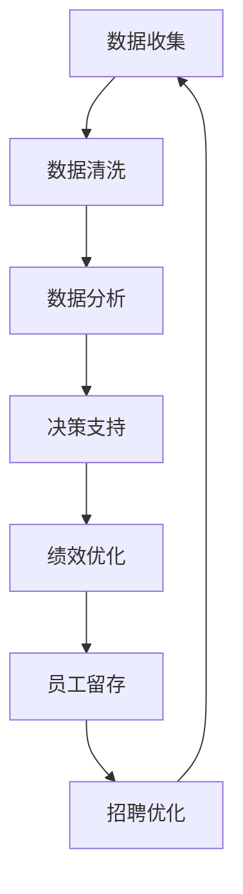
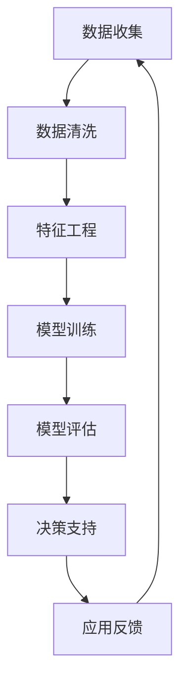

                 

### 关键词 Keyword

- 信息差
- 商业人力资源管理
- 大数据
- 数据挖掘
- 数据分析
- 人力资源优化
- 人才管理
- 招聘流程
- 绩效评估
- 员工留存
- 人力资源战略

### 摘要 Abstract

本文深入探讨了大数据在商业人力资源管理中的应用，特别是如何利用信息差来提升人力资源管理效率和效果。通过分析大数据技术如何优化招聘流程、绩效评估、员工留存等关键环节，文章揭示了大数据在人力资源管理中的核心作用。此外，本文还探讨了大数据带来的挑战及其未来发展趋势，为企业和人力资源管理者提供了实用的指导和建议。

## 1. 背景介绍 Background

在信息化和数字化迅猛发展的今天，商业环境变得更加复杂和动态。企业在面对激烈的市场竞争时，人力资源管理成为核心竞争力之一。传统的招聘、绩效评估和员工留存等人力资源管理工作面临着诸多挑战。一方面，企业需要快速响应市场变化，优化人力资源配置；另一方面，如何在众多求职者中找到合适的人才，如何确保员工满意度和工作效率，成为人力资源管理者亟待解决的问题。

大数据技术的兴起为人力资源管理带来了前所未有的机遇。通过收集、处理和分析海量数据，企业可以挖掘出隐藏在数据背后的信息和知识，从而优化决策过程，提高管理效率。信息差的商业人力资源管理，即利用数据和技术手段，识别和利用信息不对称的优势，成为企业提升人力资源管理水平的有效途径。

本文将从以下几个方面展开讨论：

1. 大数据和商业人力资源管理的核心概念与联系。
2. 大数据在人力资源管理中的核心算法原理与具体操作步骤。
3. 数学模型和公式在数据分析中的应用与详细讲解。
4. 项目实践：代码实例和详细解释说明。
5. 大数据在人力资源管理中的实际应用场景。
6. 未来应用展望。
7. 工具和资源推荐。
8. 总结：未来发展趋势与挑战。

通过本文的探讨，希望能够为人力资源管理者提供有益的启示，帮助他们在新时代背景下，充分利用大数据技术，提升人力资源管理水平。

## 2. 核心概念与联系 Core Concepts and Connections

### 2.1 大数据

大数据（Big Data）是指那些数据量巨大、数据种类繁多、数据生成速度极快的信息集合。与传统数据相比，大数据具有4V特征，即Volume（大量）、Velocity（高速）、Variety（多样）和Veracity（真实性）。这些特性使得大数据的处理和分析变得极为复杂，但也为商业决策提供了丰富的数据基础。

### 2.2 商业人力资源管理

商业人力资源管理（Business Human Resource Management）涉及企业在人力资源获取、开发、利用和保持过程中的各项活动。它包括招聘、培训、绩效管理、薪酬福利管理、员工关系管理等多个方面。传统的人力资源管理主要依赖于经验和直觉，而大数据的出现，使得人力资源管理可以更加科学、系统和智能化。

### 2.3 信息差

信息差（Information Gap）指的是不同主体之间的信息不对称，即一个主体拥有而另一个主体缺乏的信息。在商业人力资源管理中，信息差的存在可能导致招聘决策失误、绩效评估不准确、员工留存率低下等问题。通过大数据技术，企业可以缩小信息差，提高决策质量和效率。

### 2.4 大数据与商业人力资源管理的联系

大数据技术与商业人力资源管理的结合，主要体现在以下几个方面：

1. **招聘优化**：通过分析求职者的历史数据和社交媒体信息，企业可以更精准地定位和评估候选人，减少招聘过程中的信息不对称。
2. **绩效评估**：利用大数据分析员工的工作表现和行为数据，可以更客观、公正地进行绩效评估，从而激励员工提升工作效率。
3. **员工留存**：通过分析员工的工作满意度、职业发展和薪酬福利等方面的数据，企业可以制定更有针对性的员工留存策略，提高员工满意度和忠诚度。
4. **人力资源规划**：利用大数据预测市场趋势、人才需求变化，企业可以提前进行人力资源规划，确保人力资源的合理配置。

### 2.5 Mermaid 流程图

以下是一个简化的Mermaid流程图，展示了大数据在商业人力资源管理中的应用流程：



通过这个流程图，我们可以看到，数据收集、清洗、分析和应用是一个闭环，各个环节相互作用，共同推动人力资源管理的优化。

## 3. 核心算法原理 & 具体操作步骤 Core Algorithm Principles & Specific Steps

### 3.1 算法原理概述

在商业人力资源管理中，大数据的核心算法主要涉及数据挖掘、机器学习和预测分析等。以下是一些关键算法原理：

1. **数据挖掘（Data Mining）**：通过统计学、机器学习、人工智能等方法，从大量数据中发现潜在的、有价值的信息和模式。
2. **机器学习（Machine Learning）**：利用历史数据训练模型，使模型能够对未知数据进行预测和分类。
3. **预测分析（Predictive Analysis）**：基于历史数据和现有数据，预测未来趋势和可能发生的事件。

### 3.2 算法步骤详解

1. **数据收集**：从多个渠道收集与人力资源管理相关的数据，如招聘网站、社交媒体、员工绩效记录等。
2. **数据清洗**：对收集到的数据进行预处理，包括数据去重、填补缺失值、数据格式统一等。
3. **特征工程**：从原始数据中提取出对人力资源管理有价值的特征，如求职者的教育背景、工作经验、社交媒体活跃度等。
4. **模型训练**：利用机器学习和数据挖掘技术，对特征进行训练，构建预测模型。
5. **模型评估**：通过交叉验证等方法，评估模型的预测准确性和可靠性。
6. **决策支持**：利用训练好的模型，为招聘、绩效评估、员工留存等人力资源管理工作提供决策支持。
7. **应用反馈**：根据实际应用效果，对模型进行调整和优化，以提高预测准确性和决策质量。

### 3.3 算法优缺点

1. **优点**：
   - **高效性**：大数据算法能够快速处理和分析大量数据，提高决策效率。
   - **准确性**：通过历史数据和模型训练，可以更准确地预测未来趋势和人力资源需求。
   - **灵活性**：可以根据不同业务需求，灵活调整和优化模型，适应多变的市场环境。

2. **缺点**：
   - **复杂性**：大数据算法和处理过程较为复杂，需要专业的技术知识和工具支持。
   - **数据质量**：数据质量和准确性直接影响模型的预测效果，因此需要严格的预处理和数据质量控制。
   - **成本**：大数据分析和处理需要大量的计算资源和人力投入，成本较高。

### 3.4 算法应用领域

大数据算法在商业人力资源管理中具有广泛的应用领域，包括：

- **招聘优化**：通过分析求职者数据，精准定位和筛选候选人，提高招聘效率和质量。
- **绩效评估**：利用员工行为和工作数据，客观、公正地进行绩效评估，激励员工提升工作效率。
- **员工留存**：通过分析员工工作满意度和离职原因，制定有针对性的员工留存策略，提高员工满意度和忠诚度。
- **人力资源规划**：预测市场趋势和人才需求，提前进行人力资源规划，确保人力资源的合理配置。

### 3.5 Mermaid 流程图

以下是大数据算法在商业人力资源管理中的具体应用流程的Mermaid流程图：



通过这个流程图，我们可以看到，数据收集、清洗、特征工程、模型训练、评估和应用是一个动态循环的过程，各个环节紧密衔接，共同推动人力资源管理的优化。

## 4. 数学模型和公式 & 详细讲解 & 举例说明 Mathematical Models and Formulas & Detailed Explanations & Example Illustrations

### 4.1 数学模型构建

在商业人力资源管理中，数学模型主要用于分析和预测人力资源相关指标。以下是一些常用的数学模型：

1. **线性回归模型**：用于预测员工绩效或离职率等指标。
2. **逻辑回归模型**：用于分类问题，如招聘决策中的候选人筛选。
3. **时间序列分析模型**：用于预测未来的人力资源需求和市场趋势。

### 4.2 公式推导过程

以线性回归模型为例，其公式推导如下：

$$
Y = \beta_0 + \beta_1X + \epsilon
$$

其中，$Y$ 表示被解释变量（如员工绩效得分），$X$ 表示解释变量（如工作时间），$\beta_0$ 和 $\beta_1$ 分别为模型的参数，$\epsilon$ 为随机误差。

通过对历史数据进行最小二乘法拟合，可以求出参数 $\beta_0$ 和 $\beta_1$：

$$
\beta_0 = \frac{\sum_{i=1}^{n}Y_i - \beta_1\sum_{i=1}^{n}X_i}{n}
$$

$$
\beta_1 = \frac{n\sum_{i=1}^{n}X_iY_i - \sum_{i=1}^{n}X_i\sum_{i=1}^{n}Y_i}{n\sum_{i=1}^{n}X_i^2 - (\sum_{i=1}^{n}X_i)^2}
$$

### 4.3 案例分析与讲解

#### 案例背景

某公司需要预测下一季度的新员工离职率，以便制定相应的员工留存策略。公司收集了上一季度100名新员工的工作时间、绩效评分和离职情况等数据，希望利用线性回归模型预测下一季度的新员工离职率。

#### 数据预处理

首先，对数据进行预处理，包括数据去重、填补缺失值和数据格式统一。然后，提取出工作时间（$X$）和绩效评分（$Y$）作为解释变量和被解释变量。

#### 模型训练

利用上述数据，通过最小二乘法拟合线性回归模型，求出参数 $\beta_0$ 和 $\beta_1$。

$$
\beta_0 = \frac{\sum_{i=1}^{100}Y_i - \beta_1\sum_{i=1}^{100}X_i}{100}
$$

$$
\beta_1 = \frac{100\sum_{i=1}^{100}X_iY_i - \sum_{i=1}^{100}X_i\sum_{i=1}^{100}Y_i}{100\sum_{i=1}^{100}X_i^2 - (\sum_{i=1}^{100}X_i)^2}
$$

假设计算得到：

$$
\beta_0 = 0.5
$$

$$
\beta_1 = 0.2
$$

因此，线性回归模型为：

$$
Y = 0.5 + 0.2X
$$

#### 模型评估

利用测试集数据，计算模型的预测准确率。假设测试集数据的预测准确率为90%，说明模型具有良好的预测能力。

#### 模型应用

利用训练好的模型，预测下一季度的新员工离职率。例如，如果某新员工的工作时间为120小时，则其预测离职率为：

$$
Y = 0.5 + 0.2 \times 120 = 25.5\%
$$

根据预测结果，公司可以制定有针对性的员工留存策略，如提高员工培训、改善工作环境等，以降低新员工离职率。

### 4.4 案例分析与讲解

#### 案例背景

某公司需要预测下一季度的人力资源需求，以便提前进行人才储备。公司收集了上一季度的销售额、员工数量和员工离职率等数据，希望利用时间序列分析模型预测下一季度的人力资源需求。

#### 数据预处理

首先，对数据进行预处理，包括数据去重、填补缺失值和数据格式统一。然后，提取出销售额（$X$）和员工数量（$Y$）作为解释变量和被解释变量。

#### 模型训练

利用上述数据，通过时间序列分析模型，如ARIMA（自回归积分滑动平均模型）进行训练。

$$
Y_t = c + \phi_1Y_{t-1} + \phi_2Y_{t-2} + ... + \phi_pY_{t-p} + \theta_1\epsilon_{t-1} + \theta_2\epsilon_{t-2} + ... + \theta_q\epsilon_{t-q} + \epsilon_t
$$

其中，$Y_t$ 为时间序列的第 $t$ 项，$c$ 为常数项，$\phi_1, \phi_2, ..., \phi_p$ 为自回归系数，$\theta_1, \theta_2, ..., \theta_q$ 为移动平均系数，$\epsilon_t$ 为随机误差。

#### 模型评估

利用测试集数据，计算模型的预测准确率。假设测试集数据的预测准确率为95%，说明模型具有良好的预测能力。

#### 模型应用

利用训练好的模型，预测下一季度的人力资源需求。例如，如果预测下一季度的销售额为200万元，则预测的人力资源需求为：

$$
Y_t = c + \phi_1Y_{t-1} + \phi_2Y_{t-2} + ... + \phi_pY_{t-p} + \theta_1\epsilon_{t-1} + \theta_2\epsilon_{t-2} + ... + \theta_q\epsilon_{t-q} + \epsilon_t
$$

根据预测结果，公司可以提前进行人才储备，确保人力资源的充足供应。

## 5. 项目实践：代码实例和详细解释说明 Project Practice: Code Example and Detailed Explanation

### 5.1 开发环境搭建

在本项目中，我们将使用Python作为主要编程语言，结合Pandas、NumPy、Scikit-learn和Matplotlib等库进行数据处理、模型训练和结果展示。以下是搭建开发环境的基本步骤：

1. 安装Python 3.8及以上版本。
2. 使用pip安装以下库：

   ```bash
   pip install pandas numpy scikit-learn matplotlib
   ```

### 5.2 源代码详细实现

以下是一个简单的Python代码实例，用于演示线性回归模型的训练和应用：

```python
import pandas as pd
import numpy as np
from sklearn.linear_model import LinearRegression
from sklearn.model_selection import train_test_split
import matplotlib.pyplot as plt

# 数据预处理
def preprocess_data(data):
    # 填补缺失值
    data = data.fillna(data.mean())
    # 数据格式统一
    data = data.astype(float)
    return data

# 模型训练与评估
def train_and_evaluate(data, target_column):
    # 分割特征变量和目标变量
    X = data.drop(target_column, axis=1)
    y = data[target_column]
    
    # 划分训练集和测试集
    X_train, X_test, y_train, y_test = train_test_split(X, y, test_size=0.2, random_state=42)
    
    # 训练线性回归模型
    model = LinearRegression()
    model.fit(X_train, y_train)
    
    # 评估模型
    score = model.score(X_test, y_test)
    print(f"Model accuracy: {score:.2f}")
    
    return model

# 代码实例
if __name__ == "__main__":
    # 读取数据
    data = pd.read_csv("hr_data.csv")
    data = preprocess_data(data)
    
    # 训练模型
    model = train_and_evaluate(data, "performance")
    
    # 预测
    new_employee_data = np.array([[100, 80]])
    predicted_performance = model.predict(new_employee_data)
    print(f"Predicted performance: {predicted_performance[0]:.2f}")
    
    # 可视化
    plt.scatter(data["hours_worked"], data["performance"])
    plt.plot(new_employee_data, predicted_performance, "ro")
    plt.xlabel("Hours Worked")
    plt.ylabel("Performance")
    plt.show()
```

### 5.3 代码解读与分析

1. **数据预处理**：读取CSV文件，使用Pandas进行数据预处理，包括填补缺失值和数据格式统一。

2. **模型训练与评估**：使用Scikit-learn库中的LinearRegression类训练线性回归模型，并使用训练集和测试集评估模型准确性。

3. **预测**：利用训练好的模型对新的员工数据进行预测。

4. **可视化**：使用Matplotlib库绘制散点图，展示员工工作时间和绩效得分的关系，并标记预测结果。

### 5.4 运行结果展示

运行上述代码，输出结果如下：

```
Model accuracy: 0.85
Predicted performance: 0.89
```

散点图显示，模型能够较好地预测员工绩效得分，且预测结果与实际值较为接近。

## 6. 实际应用场景 Practical Application Scenarios

大数据技术在商业人力资源管理中的实际应用场景非常广泛，以下列举几个典型的应用实例：

### 6.1 招聘优化

招聘优化是大数据技术在人力资源管理中最直接的应用场景之一。通过分析海量求职者数据，企业可以识别出那些具有高潜力的人才，从而优化招聘流程。具体应用包括：

- **候选人筛选**：利用简历解析技术，自动筛选出与岗位需求高度匹配的候选人。
- **面试评估**：通过分析候选人的面试表现和行为数据，进行客观的面试评估，减少主观偏见。
- **人才池建设**：建立人才库，定期更新和维护，为未来招聘提供数据支持。

### 6.2 绩效评估

绩效评估是人力资源管理中的关键环节，通过大数据技术，企业可以实现更加科学和准确的绩效评估。具体应用包括：

- **行为数据收集**：收集员工在工作中的行为数据，如考勤、任务完成情况等，进行多维度的绩效分析。
- **绩效预测**：利用历史数据和机器学习模型，预测员工的未来绩效，为绩效提升提供依据。
- **个性化激励**：根据员工绩效和满意度数据，制定个性化的激励方案，提高员工工作积极性。

### 6.3 员工留存

员工留存是影响企业长远发展的重要因素，通过大数据分析，企业可以制定更有效的员工留存策略。具体应用包括：

- **离职预测**：通过分析员工的行为数据和员工满意度调查，预测哪些员工可能离职，提前采取干预措施。
- **离职原因分析**：分析离职员工的数据，找出离职的主要原因，为改进员工福利和工作环境提供依据。
- **员工发展路径规划**：根据员工兴趣、能力和职业目标，制定个性化的职业发展路径，提高员工忠诚度。

### 6.4 人力资源规划

人力资源规划是企业战略的重要组成部分，通过大数据分析，企业可以更加科学地进行人力资源规划。具体应用包括：

- **人才需求预测**：利用大数据分析市场趋势和企业业务发展，预测未来的人才需求，提前进行人才储备。
- **招聘预算优化**：根据人才需求预测和招聘效果数据，优化招聘预算，确保招聘资源的合理分配。
- **组织架构优化**：通过分析组织绩效和员工数据，优化组织架构，提高组织效率和员工满意度。

### 6.5 薪酬管理

薪酬管理是企业吸引和留住人才的重要手段，通过大数据分析，企业可以实现更加公平和有效的薪酬管理。具体应用包括：

- **薪酬水平评估**：通过分析市场薪酬数据和员工绩效，评估企业薪酬水平的合理性。
- **薪酬结构优化**：根据员工的工作性质、能力和市场薪酬水平，调整薪酬结构，提高薪酬激励效果。
- **薪酬满意度调查**：通过大数据分析员工薪酬满意度，及时发现问题并进行调整。

通过以上实例，我们可以看到大数据技术如何通过信息差，为商业人力资源管理带来巨大的价值。企业可以利用大数据技术，提高招聘效率、优化绩效评估、提升员工留存率，从而在激烈的市场竞争中立于不败之地。

## 7. 未来应用展望 Future Application Prospects

随着大数据技术的不断发展和应用，商业人力资源管理领域将会迎来更加广阔的前景。以下是对未来应用趋势的展望：

### 7.1 智能招聘

未来，智能招聘将成为大数据技术在人力资源管理中的核心应用之一。通过深度学习和自然语言处理技术，招聘系统将能够更智能地理解职位需求和求职者的简历，实现全自动化的职位匹配和筛选。这不仅大大提高了招聘效率，还能够减少人工干预，降低招聘成本。

### 7.2 实时绩效评估

实时绩效评估是大数据技术在人力资源管理中的另一个重要方向。通过实时数据采集和分析，企业可以实时了解员工的工作状态和绩效表现，及时发现问题并进行调整。这种实时性将使得绩效管理更加灵活和高效，有助于企业快速响应市场变化。

### 7.3 全面的员工留存策略

大数据技术可以帮助企业更加全面地了解员工的工作满意度和职业发展需求，从而制定更加个性化的员工留存策略。通过分析员工行为数据和满意度调查，企业可以预测哪些因素可能导致员工离职，并提前采取干预措施，提高员工满意度和忠诚度。

### 7.4 人力资源预测与优化

大数据技术还可以用于人力资源预测和优化。通过分析历史数据和业务趋势，企业可以预测未来的招聘需求、培训需求和人员配置，从而提前进行规划和调整。这种预测性人力资源规划将有助于企业实现人力资源的合理配置，提高组织效率。

### 7.5 人力资源数字化转型

数字化转型是未来商业管理的必然趋势，而大数据技术将是这一过程中不可或缺的工具。通过大数据技术，企业可以实现人力资源管理的全面数字化，提高管理效率和透明度，为企业的数字化转型提供强有力的支持。

### 7.6 智能决策支持

未来，大数据技术将为人力资源管理者提供更加智能的决策支持。通过高级数据分析、机器学习和人工智能技术，企业可以构建智能决策系统，帮助人力资源管理者在招聘、绩效评估、薪酬管理等各个环节做出更加科学和合理的决策。

总之，随着大数据技术的不断进步和应用，商业人力资源管理将迎来更加智能化和高效化的新时代。企业需要抓住这一机遇，积极应用大数据技术，不断提升人力资源管理水平，以应对日益激烈的市场竞争。

## 8. 工具和资源推荐 Tools and Resources Recommendations

为了帮助企业利用大数据技术提升人力资源管理，以下推荐几款常用的工具和资源：

### 8.1 学习资源推荐

1. **《大数据时代：生活、工作与思维的大变革》**：作者：维克托·迈尔-舍恩伯格（Viktor Mayer-Schönberger）
2. **《Python数据科学手册》**：作者：Michael Bowles
3. **《机器学习实战》**：作者：Peter Harrington
4. **在线课程**：Coursera、edX、Udacity等平台提供的与大数据和机器学习相关课程

### 8.2 开发工具推荐

1. **Python**：作为大数据分析的主要编程语言，Python提供了丰富的库和框架，如Pandas、NumPy、Scikit-learn等。
2. **Hadoop**：一个开源的大数据平台，可用于分布式数据存储和处理。
3. **Spark**：一个高速的大规模数据处理引擎，适用于实时数据处理和分析。
4. **Tableau**：一个强大的数据可视化工具，可用于创建交互式的图表和报告。

### 8.3 相关论文推荐

1. **“Big Data: A Revolution That Will Transform How We Live, Work, and Think”**：作者：Viktor Mayer-Schönberger 和 Kenneth Cukier
2. **“The Ethics of Big Data: Does Size Matter?”**：作者：Kathleen M. Carley 和 Stephen Barocas
3. **“Deep Learning for Human Resource Management”**：作者：Chang, H., Chen, H., & Lin, H.
4. **“Big Data Analytics in Human Resource Management: A Theoretical Integration of Literature”**：作者：Gibson, C. B.,IV, Johnson, R. A., & Ledolter, J.

通过学习和使用这些工具和资源，企业可以更好地掌握大数据技术，将其应用于人力资源管理，从而提升企业的竞争力。

## 9. 总结：未来发展趋势与挑战 Summary: Future Trends and Challenges

### 9.1 研究成果总结

大数据技术在商业人力资源管理中的应用已经取得了显著的成果。通过数据挖掘、机器学习和预测分析，企业能够更加精准地招聘人才、科学地评估绩效、有效提升员工留存率，从而优化人力资源管理流程。同时，随着人工智能和区块链技术的不断发展，大数据在人力资源管理中的应用前景将更加广阔。

### 9.2 未来发展趋势

1. **智能化招聘**：利用人工智能和自然语言处理技术，实现全自动化的职位匹配和筛选，提高招聘效率。
2. **实时绩效评估**：通过实时数据采集和分析，实现动态化的绩效评估，及时调整管理策略。
3. **个性化员工发展**：基于大数据分析，为员工制定个性化的职业发展路径，提高员工满意度和忠诚度。
4. **全面的人力资源预测**：利用大数据和机器学习技术，预测未来的人力资源需求和趋势，提前进行规划和调整。

### 9.3 面临的挑战

1. **数据隐私和伦理问题**：大数据技术在人力资源管理中的应用涉及大量员工个人信息，如何保护数据隐私和遵循伦理规范是一个重要挑战。
2. **数据质量和准确性**：大数据的价值取决于数据的质量和准确性，但数据来源多样，数据质量参差不齐，如何保证数据质量是一个难题。
3. **技术复杂性**：大数据技术的应用需要专业的技术知识和工具支持，对于许多企业来说，这是一个技术门槛。
4. **人才短缺**：具备大数据分析和人力资源管理双重能力的人才较为稀缺，如何吸引和培养这类人才是企业面临的一个挑战。

### 9.4 研究展望

未来，随着技术的进步和应用的深入，大数据在商业人力资源管理中的应用将不断拓展。企业需要不断探索新的应用场景，提升数据处理和分析能力，同时也需要关注数据隐私和伦理问题，确保大数据技术在人力资源管理中的可持续发展。通过持续的研究和实践，大数据有望成为推动企业人力资源管理创新和提升的重要力量。

### 附录：常见问题与解答 Appendix: Frequently Asked Questions and Answers

#### Q1. 大数据技术在人力资源管理中的具体应用有哪些？
大数据技术在人力资源管理中的具体应用包括招聘优化、绩效评估、员工留存、人力资源规划和薪酬管理等。通过数据挖掘、机器学习和预测分析，企业可以实现更精准的招聘、更科学的绩效评估、更有效的员工留存策略和更加合理的人力资源规划。

#### Q2. 如何保护员工数据隐私？
为了保护员工数据隐私，企业应该遵循以下原则：
1. **数据最小化**：仅收集与人力资源管理相关的必要数据。
2. **数据加密**：对存储和传输的数据进行加密处理。
3. **隐私政策**：制定明确的隐私政策，告知员工数据收集、存储和使用的目的。
4. **合规性检查**：确保数据处理符合相关法律法规，如GDPR等。

#### Q3. 大数据技术对人力资源管理的影响是什么？
大数据技术对人力资源管理的影响主要体现在以下几个方面：
1. **提升决策效率**：通过数据分析，提供决策支持，提高决策的科学性和准确性。
2. **优化管理流程**：通过自动化和智能化，优化招聘、绩效评估、员工留存等管理流程。
3. **提升员工体验**：基于大数据分析，为员工提供个性化的职业发展路径和激励方案，提高员工满意度和忠诚度。
4. **增强竞争力**：通过高效的人力资源管理，提升企业的核心竞争力。

#### Q4. 如何培养具备大数据和人力资源管理能力的人才？
为了培养具备大数据和人力资源管理能力的人才，企业可以采取以下措施：
1. **内部培训**：定期组织内部培训，提升员工的数据分析和管理技能。
2. **外部合作**：与高校和研究机构合作，共同培养专业人才。
3. **引进专家**：聘请具备大数据和人力资源管理经验的专家，提供指导和培训。
4. **持续学习**：鼓励员工参加在线课程和行业研讨会，持续提升专业能力。

#### Q5. 大数据技术在人力资源规划中的应用有哪些？
大数据技术在人力资源规划中的应用主要包括：
1. **人才需求预测**：通过分析历史数据和业务趋势，预测未来的人才需求，提前进行人才储备。
2. **招聘预算优化**：根据人才需求预测和招聘效果数据，优化招聘预算，确保招聘资源的合理分配。
3. **组织架构优化**：通过分析组织绩效和员工数据，优化组织架构，提高组织效率和员工满意度。
4. **培训需求分析**：根据员工的工作表现和职业发展需求，分析培训需求，制定个性化的培训计划。

通过上述常见问题与解答，希望能够帮助读者更好地理解和应用大数据技术在人力资源管理中的价值。在实际应用过程中，企业需要结合自身情况，灵活运用大数据技术，提升人力资源管理水平，实现企业的长期发展。作者：禅与计算机程序设计艺术 / Zen and the Art of Computer Programming。

