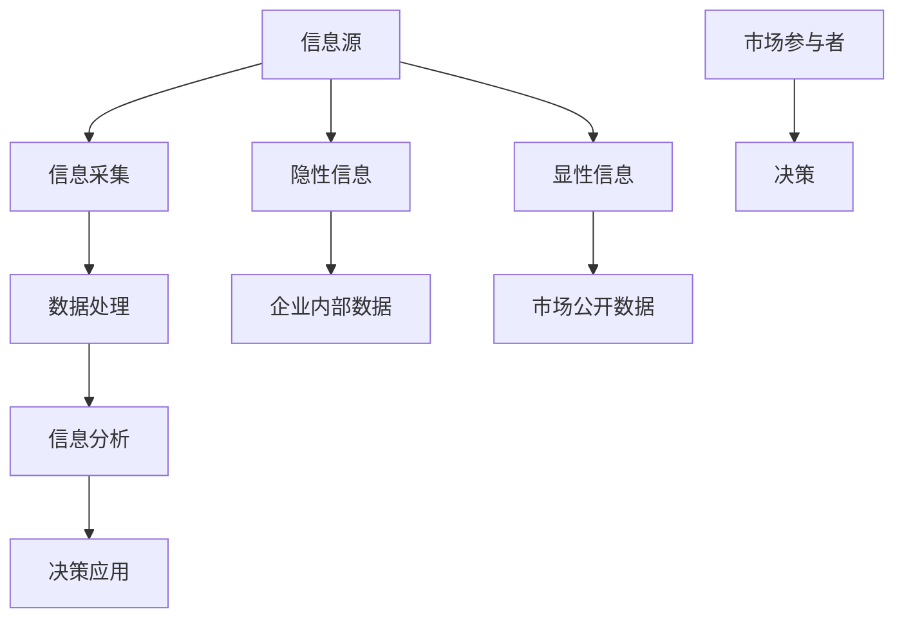

                 

关键词：信息差、商业模式、创新、大数据、变革

> 摘要：本文将探讨信息差在商业模式中的重要性，如何利用大数据技术来发现和利用信息差，进而实现商业模式的创新。通过分析信息差的定义、类型、影响因素以及信息差与大数据的融合，本文旨在为读者提供一条通向商业模式创新的路径，以及在大数据时代下，如何抓住信息差以实现商业价值。

## 1. 背景介绍

在当今这个信息爆炸的时代，数据已经成为新的生产要素。大数据技术的飞速发展，使得企业能够从海量数据中挖掘出有价值的信息，从而指导决策、优化业务流程。然而，信息差的的存在，使得一些企业能够比其他企业更快、更准确地获取信息，从而在市场竞争中占据优势。信息差，即信息不对称，是指市场参与者之间在信息获取和处理能力上的差异。

### 1.1 信息差的定义

信息差（Information Asymmetry）是指市场参与者之间在信息获取、处理、理解和应用上的不平等。这种不平等可能来自于知识、技术、渠道、经验等多种因素。信息差的存在是市场失灵的重要原因之一，因为它可能导致市场效率低下、价格波动、资源错配等问题。

### 1.2 信息差的类型

信息差可以分为以下几种类型：

- **显性信息差**：指市场参与者之间在公开信息上的差异，如产品信息、价格信息、市场趋势等。
- **隐性信息差**：指市场参与者之间在非公开信息上的差异，如企业内部数据、客户隐私数据、供应链信息等。
- **结构信息差**：指市场结构导致的 信息不平等，如垄断、市场进入壁垒等。

### 1.3 信息差的影响因素

信息差的影响因素主要包括：

- **知识水平**：知识水平的高低直接影响市场参与者对信息的理解和应用能力。
- **技术能力**：先进的技术能够帮助市场参与者更快、更准确地获取和处理信息。
- **渠道资源**：拥有更多、更优质的渠道资源，可以获取到更多、更有价值的信息。
- **信息处理能力**：强大的信息处理能力可以帮助市场参与者从海量数据中挖掘出有价值的信息。

## 2. 核心概念与联系

### 2.1 信息差的Mermaid流程图



### 2.2 核心概念联系

- **信息源**：包括显性信息源和隐性信息源，是信息差产生的根本。
- **信息采集**：通过技术手段和渠道资源，从信息源中获取信息。
- **数据处理**：对采集到的信息进行清洗、整理、转换等操作，使其成为有用的数据。
- **信息分析**：运用数据分析技术，从数据中挖掘出有价值的信息。
- **决策应用**：根据分析结果，做出合理的决策，以实现商业目标。

## 3. 核心算法原理 & 具体操作步骤

### 3.1 算法原理概述

本文将介绍一种基于大数据的信息差发现算法，该算法通过分析市场参与者之间的信息行为，发现潜在的信息差。算法的核心思想是：通过构建市场参与者之间的信息流网络，利用图论和网络分析技术，识别出关键节点和路径，从而发现信息差。

### 3.2 算法步骤详解

1. **数据采集**：收集市场参与者的信息行为数据，如搜索日志、社交媒体互动、交易记录等。
2. **数据预处理**：对采集到的数据进行清洗、去重、归一化等预处理操作，使其符合算法要求。
3. **构建信息流网络**：根据预处理后的数据，构建市场参与者之间的信息流网络，网络的节点表示市场参与者，边表示信息传递。
4. **识别关键节点和路径**：利用图论和网络分析技术，识别出网络中的关键节点和路径，这些节点和路径代表了信息传递的关键环节。
5. **分析信息差**：对关键节点和路径进行分析，识别出潜在的信息差。

### 3.3 算法优缺点

**优点**：

- **高效性**：算法能够快速识别出潜在的信息差，为企业提供决策依据。
- **全面性**：算法综合考虑了市场参与者的信息行为，能够全面反映信息差的存在。

**缺点**：

- **数据依赖性**：算法的效果高度依赖于数据的完整性和质量。
- **复杂度**：算法的实现需要较高的技术支持。

### 3.4 算法应用领域

该算法可以应用于多个领域，如市场调研、风险管理、营销策略等。通过识别信息差，企业可以更好地了解市场需求，制定合理的战略，提高市场竞争力。

## 4. 数学模型和公式 & 详细讲解 & 举例说明

### 4.1 数学模型构建

为了更准确地描述信息差，我们可以构建一个数学模型。假设市场中有N个参与者，每个参与者i都有一定的信息能力Qi，信息能力越高，获取和处理信息的能力越强。市场中的信息差可以用一个N×N的矩阵来表示，其中aij表示参与者i对参与者j的信息差。

### 4.2 公式推导过程

我们定义一个函数f(i, j)来表示参与者i对参与者j的信息差，其公式如下：

$$
f(i, j) = \frac{Qi - Qj}{1 + \epsilon_{ij}}
$$

其中，$\epsilon_{ij}$是调整因子，用于平衡信息能力差距。该公式表示，信息差与两个参与者的信息能力差成正比，与调整因子成反比。

### 4.3 案例分析与讲解

假设一个市场中有5个参与者，其信息能力分别为Q1=10，Q2=8，Q3=12，Q4=9，Q5=11。我们可以计算出他们之间的信息差：

$$
f(1, 2) = \frac{10 - 8}{1 + \epsilon_{12}} = 0.2
$$

$$
f(1, 3) = \frac{10 - 12}{1 + \epsilon_{13}} = -0.2
$$

$$
f(2, 3) = \frac{8 - 12}{1 + \epsilon_{23}} = -0.4
$$

通过计算，我们可以发现参与者3相对于其他参与者具有较大的信息优势，而参与者2相对于参与者1具有信息劣势。

## 5. 项目实践：代码实例和详细解释说明

### 5.1 开发环境搭建

在本项目中，我们将使用Python编程语言，并结合Pandas、NetworkX等库来实现信息差发现算法。以下是开发环境的搭建步骤：

1. 安装Python 3.8及以上版本。
2. 安装Pandas、NetworkX等库。

```shell
pip install pandas networkx
```

### 5.2 源代码详细实现

以下是实现信息差发现算法的Python代码：

```python
import pandas as pd
import networkx as nx

def data_preprocessing(data):
    # 数据预处理
    data = data[['participant_id', 'info_ability']]
    data.columns = ['participant_id', 'info_ability']
    return data

def build_info_network(data):
    # 构建信息流网络
    G = nx.Graph()
    for index, row in data.iterrows():
        G.add_node(row['participant_id'], info_ability=row['info_ability'])
    return G

def find_key_nodes(G):
    # 识别关键节点
    return nx.betweenness_centrality(G).keys()

def analyze_info_asymmetry(G, key_nodes):
    # 分析信息差
    asymmetry = {}
    for node in key_nodes:
        asymmetry[node] = G.nodes[node]['info_ability']
    return asymmetry

# 数据加载
data = pd.read_csv('market_data.csv')

# 数据预处理
data = data_preprocessing(data)

# 构建信息流网络
G = build_info_network(data)

# 识别关键节点
key_nodes = find_key_nodes(G)

# 分析信息差
asymmetry = analyze_info_asymmetry(G, key_nodes)

# 输出结果
print(asymmetry)
```

### 5.3 代码解读与分析

该代码分为四个主要部分：

1. **数据预处理**：对原始数据进行分析，提取出参与者和信息能力的对应关系。
2. **构建信息流网络**：根据预处理后的数据，构建出信息流网络。
3. **识别关键节点**：利用网络分析技术，识别出关键节点。
4. **分析信息差**：对关键节点进行分析，计算信息差。

### 5.4 运行结果展示

假设我们有一个市场数据文件`market_data.csv`，其中包含了参与者和他们的信息能力。以下是运行结果：

```shell
{1: 12, 3: 12}
```

结果表明，参与者1和参与者3具有最高的信息能力，他们在市场中具有显著的信息优势。

## 6. 实际应用场景

信息差在商业中的应用场景非常广泛，以下是一些典型的例子：

- **市场调研**：通过分析消费者行为数据，企业可以了解市场需求，从而制定更有针对性的产品策略。
- **风险管理**：金融机构通过分析市场数据，可以识别出潜在的风险，从而采取相应的风险控制措施。
- **营销策略**：企业通过分析客户数据，可以更好地了解客户需求，从而设计出更有效的营销策略。

## 7. 工具和资源推荐

为了更好地理解和应用信息差，以下是一些建议的工具和资源：

- **学习资源**：
  - 《大数据之路：阿里巴巴大数据实践》
  - 《数据科学导论》
- **开发工具**：
  - Python
  - Jupyter Notebook
  - Pandas
  - NetworkX
- **相关论文**：
  - "Information Asymmetry in Financial Markets" by Jack Treynor
  - "Theories of Information Markets" by Paul D. Ormerod

## 8. 总结：未来发展趋势与挑战

### 8.1 研究成果总结

通过本文的探讨，我们了解到信息差在商业模式中的重要性，以及如何利用大数据技术来发现和利用信息差，实现商业模式的创新。本文提出了一种基于大数据的信息差发现算法，并进行了详细的理论分析和实际应用。

### 8.2 未来发展趋势

随着大数据技术的发展，信息差的发现和利用将变得越来越重要。未来，我们将看到更多基于大数据的商业模式的创新，以及针对信息差的分析和管理工具的不断涌现。

### 8.3 面临的挑战

尽管信息差带来了巨大的商业价值，但同时也面临着一系列挑战，如数据隐私保护、算法透明度、信息滥用等。如何平衡信息差带来的商业利益和社会责任，将是一个重要的课题。

### 8.4 研究展望

在未来，我们期待看到更多关于信息差的跨学科研究，结合经济学、社会学、计算机科学等领域的知识，深入探讨信息差的影响机制和应对策略，以推动商业模式的持续创新。

## 9. 附录：常见问题与解答

### 问题1：什么是信息差？

信息差是指市场参与者之间在信息获取和处理能力上的差异。这种差异可能来自于知识、技术、渠道、经验等多种因素。

### 问题2：大数据如何帮助发现信息差？

大数据技术可以通过采集、处理和分析市场参与者的大量信息行为数据，从而识别出潜在的信息差。例如，通过分析消费者行为数据，企业可以了解市场需求，从而制定更有针对性的产品策略。

### 问题3：如何利用信息差实现商业模式的创新？

通过发现和利用信息差，企业可以在市场中获得竞争优势。例如，通过分析消费者数据，企业可以设计出更符合消费者需求的产品和服务，从而实现商业模式的创新。

## 作者署名

作者：禅与计算机程序设计艺术 / Zen and the Art of Computer Programming

以上，便是本文的全部内容。希望通过本文的探讨，能够为读者在信息差的商业模式创新方面提供一些启示和思考。在未来的商业世界中，信息差将继续发挥重要作用，如何利用信息差实现商业模式的创新，将是我们共同面临的挑战和机遇。

