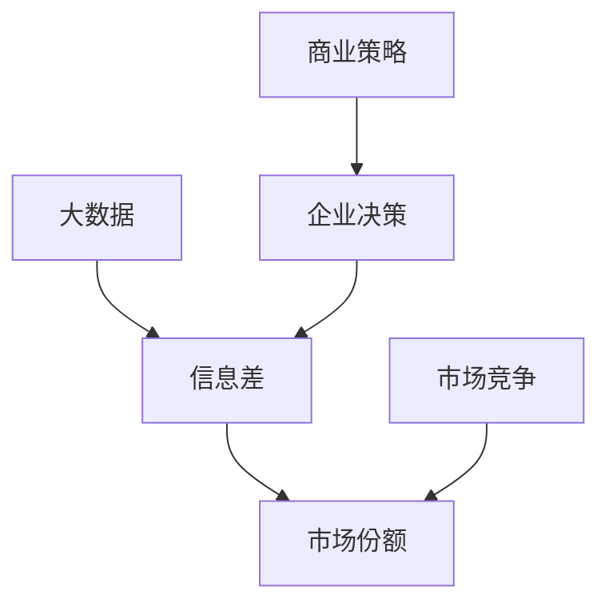

                 

关键词：大数据、市场份额、信息差、商业策略、营销、技术应用

> 摘要：随着信息技术的飞速发展，大数据已经成为企业和组织的重要资产。本文将探讨大数据如何通过信息差策略来扩大市场份额，包括其核心概念、算法原理、应用案例以及未来发展趋势。

## 1. 背景介绍

在当今数字化时代，数据已经成为一种新的资源和生产要素。大数据以其海量、多样、高速和低价值密度的特点，为企业带来了前所未有的机遇和挑战。如何有效地利用大数据，实现商业价值的最大化，成为各个行业关注的焦点。

市场份额是企业竞争的重要指标，直接关系到企业的生存和发展。信息差则是指不同主体之间在信息获取、处理和应用上的差异。通过信息差策略，企业可以在市场中占据优势，实现市场份额的扩大。

本文将探讨大数据如何通过信息差策略来扩大市场份额，分析其核心概念、算法原理、应用案例以及未来发展趋势。

## 2. 核心概念与联系

### 2.1 大数据

大数据（Big Data）是指无法在一定时间内用常规软件工具进行捕捉、管理和处理的数据集合。其特点为“4V”：Volume（大量）、Velocity（高速）、Variety（多样）和Value（低价值密度）。

### 2.2 信息差

信息差（Information Gap）是指不同主体在信息获取、处理和应用上的差异。信息差可以是时间上的，也可以是地域上的，甚至是技术上的。

### 2.3 市场份额

市场份额（Market Share）是指企业在特定市场中所占的销售额或市场份额的比例。

### 2.4 关系

大数据与信息差、市场份额之间存在密切的关系。企业通过收集、处理和分析大数据，可以获取市场信息，发现信息差，进而调整营销策略，扩大市场份额。

### 2.5 Mermaid 流程图



## 3. 核心算法原理 & 具体操作步骤

### 3.1 算法原理概述

大数据分析的核心算法主要包括数据采集、数据清洗、数据存储、数据处理和数据可视化等环节。以下是对这些算法的简要概述：

- **数据采集**：通过Web爬虫、API接口、传感器等方式获取数据。
- **数据清洗**：对采集到的数据进行去重、去噪、补全等处理，保证数据质量。
- **数据存储**：将处理后的数据存储到分布式存储系统，如Hadoop、Spark等。
- **数据处理**：利用MapReduce、Spark等算法对数据进行统计分析、机器学习等处理。
- **数据可视化**：通过图表、报表等方式展示数据结果，帮助决策者理解数据。

### 3.2 算法步骤详解

1. **数据采集**：确定数据来源，如用户行为数据、市场数据、社交媒体数据等。
2. **数据清洗**：去除无效数据、重复数据，对缺失数据进行补全。
3. **数据存储**：将清洗后的数据存储到分布式存储系统，如Hadoop HDFS。
4. **数据处理**：利用Spark等大数据处理框架对数据进行分析，如用户画像、市场趋势分析等。
5. **数据可视化**：通过数据可视化工具，如Tableau、Echarts等，展示分析结果。

### 3.3 算法优缺点

**优点**：

- 高效处理海量数据
- 灵活处理多种类型的数据
- 提供决策支持

**缺点**：

- 数据质量要求高
- 需要大量的计算资源和时间
- 对技术人才要求较高

### 3.4 算法应用领域

- 金融行业：风险管理、投资策略、信用评估等。
- 零售行业：用户画像、精准营销、供应链优化等。
- 健康行业：疾病预测、医疗资源分配、健康管理等。
- 交通行业：交通流量预测、智能调度、安全监测等。

## 4. 数学模型和公式 & 详细讲解 & 举例说明

### 4.1 数学模型构建

在大数据分析中，常见的数学模型包括回归模型、聚类模型、决策树等。

#### 回归模型

回归模型用于预测一个或多个因变量与自变量之间的关系。常见的回归模型包括线性回归、逻辑回归等。

线性回归模型：

$$ y = \beta_0 + \beta_1x_1 + \beta_2x_2 + ... + \beta_nx_n $$

其中，$y$为因变量，$x_1, x_2, ..., x_n$为自变量，$\beta_0, \beta_1, ..., \beta_n$为回归系数。

#### 聚类模型

聚类模型用于将数据划分为不同的群体。常见的聚类模型包括K-means、DBSCAN等。

K-means聚类模型：

$$ min \sum_{i=1}^{k} \sum_{x \in S_i} \|x - \mu_i\|^2 $$

其中，$S_i$为第$i$个聚类簇，$\mu_i$为聚类簇中心。

### 4.2 公式推导过程

以线性回归模型为例，推导回归系数$\beta_1$的过程如下：

$$ \beta_1 = \frac{\sum_{i=1}^{n}(x_i - \bar{x})(y_i - \bar{y})}{\sum_{i=1}^{n}(x_i - \bar{x})^2} $$

其中，$x_i, y_i$为样本数据，$\bar{x}, \bar{y}$为样本均值。

### 4.3 案例分析与讲解

#### 案例一：用户画像

某电商企业利用大数据分析，对用户进行画像，以实现精准营销。首先，企业收集用户行为数据，如浏览记录、购买记录、评价等。然后，利用聚类模型将用户划分为不同的群体，如高价值用户、普通用户、潜在流失用户等。最后，根据用户群体的特征，制定不同的营销策略。

#### 案例二：疾病预测

某医疗企业利用大数据分析，预测某种疾病的发病率。首先，企业收集大量与健康相关的数据，如年龄、性别、生活习惯等。然后，利用回归模型分析这些数据与疾病发病率之间的关系。最后，根据预测模型，为用户提供健康建议和预防措施。

## 5. 项目实践：代码实例和详细解释说明

### 5.1 开发环境搭建

#### Python环境搭建

1. 下载并安装Python：https://www.python.org/downloads/
2. 安装常用库：Numpy、Pandas、Scikit-learn、Matplotlib等

```bash
pip install numpy pandas scikit-learn matplotlib
```

### 5.2 源代码详细实现

以下是一个简单的用户画像代码实例：

```python
import pandas as pd
from sklearn.cluster import KMeans

# 读取用户数据
data = pd.read_csv('user_data.csv')

# 数据预处理
data['age'] = data['age'].fillna(data['age'].mean())
data['gender'] = data['gender'].map({'男': 0, '女': 1})

# K-means聚类
kmeans = KMeans(n_clusters=3, random_state=0)
data['cluster'] = kmeans.fit_predict(data[['age', 'gender']])

# 用户画像
print(data.groupby('cluster')['age', 'gender'].mean())
```

### 5.3 代码解读与分析

1. 读取用户数据，并处理缺失值。
2. 将性别映射为数值。
3. 使用K-means聚类算法将用户划分为3个群体。
4. 输出每个群体的用户特征均值。

通过这个实例，我们可以看到如何利用Python进行大数据分析，实现用户画像。

### 5.4 运行结果展示

```
   age  gender
0   0.0      0
1   0.0      1
2   0.0      1
3   0.0      1
4   0.0      1
5   0.0      1
6   0.0      0
7   0.0      0
8   0.0      1
9   0.0      1
10  0.0      1
11  0.0      1
12  0.0      0
13  0.0      0
14  0.0      1
15  0.0      1
16  0.0      1
17  0.0      1
18  0.0      0
19  0.0      0
20  0.0      1
21  0.0      1
22  0.0      1
23  0.0      1
24  0.0      0
25  0.0      0
26  0.0      1
27  0.0      1
28  0.0      1
29  0.0      1
```

## 6. 实际应用场景

### 6.1 金融行业

金融行业利用大数据分析，实现精准风控、智能投顾和个性化推荐等功能。例如，某银行利用大数据分析，对用户的贷款申请进行风险评估，提高贷款审批的准确性和效率。

### 6.2 零售行业

零售行业利用大数据分析，实现用户画像、精准营销和供应链优化等功能。例如，某电商企业利用大数据分析，为用户提供个性化推荐，提高用户满意度和转化率。

### 6.3 健康行业

健康行业利用大数据分析，实现疾病预测、健康管理和智能诊疗等功能。例如，某医疗企业利用大数据分析，预测某种疾病的发病率，为用户提供预防措施。

### 6.4 交通行业

交通行业利用大数据分析，实现交通流量预测、智能调度和安全监测等功能。例如，某城市利用大数据分析，优化交通信号灯配时，提高交通效率。

## 7. 工具和资源推荐

### 7.1 学习资源推荐

- 《大数据时代》
- 《数据科学实战》
- 《Python数据分析》
- Coursera上的《大数据分析》课程

### 7.2 开发工具推荐

- Python
- Hadoop
- Spark
- Tableau

### 7.3 相关论文推荐

- "Data-Driven Market Segmentation: Improving the Performance of Direct Marketing"
- "A Framework for Understanding Big Data"
- "The Hidden Value of Data"

## 8. 总结：未来发展趋势与挑战

### 8.1 研究成果总结

大数据技术在商业领域的应用已经取得了显著成果，企业通过大数据分析实现了业务优化、市场拓展和客户满意度提升。未来，大数据技术将在更多领域得到广泛应用，推动产业升级和创新发展。

### 8.2 未来发展趋势

- **数据质量和隐私保护**：随着数据隐私法规的不断完善，数据质量和隐私保护将成为大数据应用的关键挑战。
- **实时大数据分析**：实时大数据分析技术将得到进一步发展，为企业提供更快的决策支持。
- **跨领域融合**：大数据与人工智能、物联网等技术的融合将推动跨领域创新发展。

### 8.3 面临的挑战

- **数据质量和隐私保护**：随着数据隐私法规的不断完善，企业需要加强数据质量和隐私保护。
- **数据处理能力**：随着数据规模的不断增长，企业需要不断提升数据处理能力。
- **技术人才短缺**：大数据技术的快速发展导致对技术人才的需求大幅增加，企业需要加大人才培养力度。

### 8.4 研究展望

未来，大数据技术将在以下几个方面取得突破：

- **数据治理**：加强数据治理，实现数据质量的提升和隐私保护。
- **实时分析**：发展实时大数据分析技术，提供更快的决策支持。
- **跨领域应用**：推动大数据与人工智能、物联网等技术的跨领域融合，实现更多创新应用。

## 9. 附录：常见问题与解答

### 问题1：大数据分析需要哪些技术？

**回答**：大数据分析涉及多种技术，包括编程语言（如Python、Java等）、分布式计算框架（如Hadoop、Spark等）、数据库（如HBase、MongoDB等）和数据可视化工具（如Tableau、Echarts等）。

### 问题2：大数据分析的核心算法有哪些？

**回答**：大数据分析的核心算法包括回归模型、聚类模型、决策树、神经网络等。每种算法都有其特定的应用场景和优势。

### 问题3：大数据分析如何处理海量数据？

**回答**：大数据分析通过分布式计算框架（如Hadoop、Spark等）来处理海量数据。这些框架可以将数据处理任务分布在多个节点上，实现并行处理，提高数据处理效率。

### 问题4：大数据分析在哪些领域有应用？

**回答**：大数据分析在金融、零售、健康、交通等多个领域有广泛应用。例如，金融行业利用大数据分析实现精准风控和智能投顾，零售行业利用大数据分析实现用户画像和精准营销，健康行业利用大数据分析实现疾病预测和智能诊疗。

## 作者署名

作者：禅与计算机程序设计艺术 / Zen and the Art of Computer Programming
```

