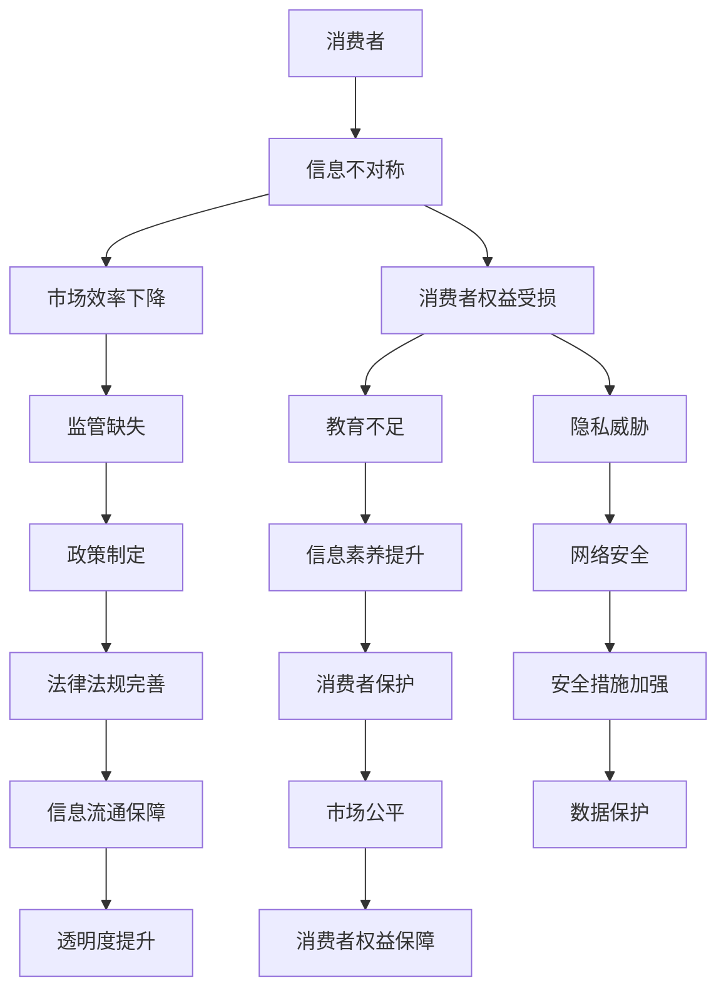

                 

关键词：信息不对称、消费者保护、市场策略、算法、数据隐私、网络安全

> 摘要：本文旨在探讨信息差的概念及其在消费者保护中的应用。信息不对称是指在市场中，不同参与者拥有不同的信息，这种差异可能导致市场失灵和消费者利益受损。本文将从信息不对称的本质出发，分析其在现代信息技术环境下的表现，以及如何通过算法和策略来降低信息不对称，从而保护消费者的权益。

## 1. 背景介绍

信息不对称是一个经济学和计算机科学领域广泛讨论的话题。在传统市场中，信息不对称可能导致市场失灵，例如产品市场上的“柠檬问题”和信息市场中的“囚徒困境”。然而，随着互联网和大数据技术的兴起，信息不对称的现象变得更加复杂和普遍。

在互联网时代，大量的信息在网络上流动，但信息获取和处理的能力在不同个体间存在显著差异。这种差异不仅体现在信息的数量和质量上，还体现在信息的使用效率和目的上。例如，大型科技公司拥有海量的用户数据，而普通用户对这些数据的使用和影响往往有限。这种信息不对称可能导致以下几个问题：

1. **市场失灵**：消费者无法获得足够的信息来做出明智的决策，从而导致市场效率下降。
2. **消费者权益受损**：信息不对称使得消费者更容易受到欺诈和误导，造成经济损失。
3. **社会不公平**：信息资源的分配不均可能导致社会财富的分配不均，加剧社会分化。

本文将重点探讨如何通过算法和策略来降低信息不对称，保护消费者的权益。我们将从以下几个方面展开：

- **信息不对称的概念和原理**：介绍信息不对称的基本概念和经济学原理，以及其在现代信息技术环境下的表现。
- **算法在消费者保护中的应用**：分析算法如何帮助消费者获取和处理信息，降低信息不对称。
- **策略与措施**：探讨政府和企业在降低信息不对称方面的策略和措施。
- **数据隐私和网络安全**：讨论在信息不对称背景下如何保护消费者的数据隐私和网络安全。

## 2. 核心概念与联系

### 2.1. 信息不对称的概念

信息不对称是指市场参与者在交易过程中拥有不同的信息。经典的例子是二手市场中的“柠檬问题”，即卖方知道产品存在缺陷，而买方不知道，从而导致买方支付的价格高于其实际价值。

在计算机科学中，信息不对称通常与数据隐私和网络安全相关。例如，在一个社交网络平台上，用户的数据可能被平台公司用于广告推荐，但用户往往无法知晓自己的数据如何被利用，也无法控制自己的数据。

### 2.2. 信息不对称的经济学原理

经济学中，信息不对称通常与市场效率和道德风险相关。市场效率是指在市场交易中资源的最优配置，而道德风险则是指由于信息不对称，一方可能会采取不利于另一方的行为。

在信息不对称的市场中，消费者往往处于劣势地位，因为他们无法获得足够的信息来评估产品的真实价值。这种劣势可能导致以下几种情况：

- **逆向选择**：消费者选择的产品质量较低，因为高质量的产品可能因为价格过高而被淘汰。
- **道德风险**：消费者可能因为信息不对称而采取不利于商家的行为，如过度消费或恶意退货。

### 2.3. 信息不对称在信息技术环境下的表现

在互联网时代，信息不对称的现象变得更加复杂。以下是一些典型的表现：

- **大数据的利用与滥用**：大型科技公司通过收集用户数据来提供个性化服务，但用户往往无法了解自己的数据如何被使用，也无法控制这些数据的共享。
- **算法歧视**：算法可能在无意中放大社会偏见，导致某些群体受到不公平对待。
- **网络安全威胁**：黑客和恶意软件可以窃取消费者的个人信息，造成严重的经济损失。

### 2.4. 信息不对称与消费者保护

信息不对称不仅影响市场效率，还可能损害消费者的权益。为了保护消费者，需要采取措施来降低信息不对称。以下是一些关键措施：

- **透明度**：提高市场交易的透明度，让消费者能够获取更多的信息。
- **教育**：通过教育提高消费者的信息素养，帮助他们更好地理解市场和产品。
- **监管**：加强对市场的监管，确保信息的公平流通和消费者的权益得到保护。

### 2.5. Mermaid 流程图

下面是一个描述信息不对称与消费者保护之间关系的 Mermaid 流程图：



## 3. 核心算法原理 & 具体操作步骤

### 3.1. 算法原理概述

为了降低信息不对称，我们需要开发一系列算法来帮助消费者获取和处理信息。这些算法可以分为以下几类：

- **信息检索算法**：帮助消费者快速找到所需的信息。
- **数据挖掘算法**：从大量数据中提取有价值的信息。
- **机器学习算法**：通过学习历史数据来预测消费者的需求和偏好。
- **隐私保护算法**：在数据使用过程中保护消费者的隐私。

### 3.2. 算法步骤详解

#### 3.2.1. 信息检索算法

信息检索算法的核心目标是帮助用户从大量数据中快速找到所需信息。以下是一个简化的信息检索算法流程：

1. **数据预处理**：对数据进行清洗、去重和格式化，确保数据的质量和一致性。
2. **索引构建**：构建索引，以便快速检索数据。
3. **查询处理**：接收用户的查询请求，并根据索引快速找到匹配的数据。
4. **结果排序**：根据匹配度对查询结果进行排序，返回给用户。

#### 3.2.2. 数据挖掘算法

数据挖掘算法旨在从大量数据中提取有价值的信息。以下是一个简化的数据挖掘算法流程：

1. **数据预处理**：与信息检索算法相同，对数据进行清洗、去重和格式化。
2. **特征提取**：从数据中提取关键特征，以便进行分析。
3. **模式识别**：使用机器学习算法识别数据中的模式或趋势。
4. **结果输出**：输出数据挖掘的结果，如推荐列表、趋势分析等。

#### 3.2.3. 机器学习算法

机器学习算法通过学习历史数据来预测消费者的需求和偏好。以下是一个简化的机器学习算法流程：

1. **数据收集**：收集消费者的历史数据，如购买记录、搜索历史等。
2. **特征工程**：从数据中提取关键特征，如商品种类、价格等。
3. **模型训练**：使用训练数据训练机器学习模型。
4. **模型评估**：使用测试数据评估模型的效果，调整模型参数。
5. **预测**：使用训练好的模型对新的数据进行预测。

#### 3.2.4. 隐私保护算法

隐私保护算法在数据使用过程中保护消费者的隐私。以下是一个简化的隐私保护算法流程：

1. **数据匿名化**：对敏感数据进行匿名化处理，以保护用户隐私。
2. **加密**：使用加密技术保护数据的完整性和机密性。
3. **访问控制**：设置访问控制策略，确保只有授权用户可以访问敏感数据。
4. **审计**：对数据访问和使用进行审计，确保合规性。

### 3.3. 算法优缺点

每种算法都有其优缺点，我们需要根据具体应用场景选择合适的算法。

- **信息检索算法**：优点是快速、高效，缺点是对数据质量要求较高，可能导致漏检或误检。
- **数据挖掘算法**：优点是能够从大量数据中提取有价值的信息，缺点是计算复杂度较高，可能需要大量的计算资源和时间。
- **机器学习算法**：优点是能够自动学习并适应新的数据，缺点是需要大量的训练数据和计算资源，且可能存在过拟合问题。
- **隐私保护算法**：优点是能够保护用户隐私，缺点是可能降低数据的使用效率，增加计算成本。

### 3.4. 算法应用领域

这些算法广泛应用于电子商务、社交媒体、金融保险、医疗健康等领域。以下是一些具体的应用实例：

- **电子商务**：使用机器学习算法为消费者推荐商品，提高销售转化率。
- **社交媒体**：使用数据挖掘算法分析用户行为，为用户提供个性化的内容推荐。
- **金融保险**：使用信息检索算法帮助消费者快速找到所需金融产品，降低信息不对称。
- **医疗健康**：使用隐私保护算法保护患者的隐私，同时为医生提供有价值的数据支持。

## 4. 数学模型和公式 & 详细讲解 & 举例说明

### 4.1. 数学模型构建

为了更好地理解信息不对称对市场的影响，我们可以构建一个简单的数学模型。假设有一个市场，由消费者和卖家组成。消费者拥有信息对称时支付的最高价格 \( W \)，卖家知道产品的真实价值 \( V \)。

我们可以使用以下数学模型来描述消费者和卖家之间的博弈：

\[ \max_{W} \frac{W - V}{2} \]

其中，\( \frac{W - V}{2} \) 表示消费者支付的价格与产品真实价值之间的差异。

### 4.2. 公式推导过程

在信息不对称的情况下，消费者的支付意愿 \( W \) 可能会高于产品的真实价值 \( V \)。我们可以使用概率分布来描述这种情况。

假设卖家知道产品真实价值 \( V \) 的概率分布 \( P(V) \)，消费者支付价格 \( W \) 的概率分布 \( P(W) \)。

我们可以使用贝叶斯定理来推导消费者支付价格的概率分布：

\[ P(W) = \int_{0}^{1} P(W|V=v)P(V=v)dv \]

其中，\( P(W|V=v) \) 表示在产品真实价值为 \( v \) 时，消费者支付价格 \( W \) 的概率。

为了简化计算，我们可以假设消费者支付价格的概率分布为均匀分布：

\[ P(W) = \frac{1}{1 - P(V < W)} \]

### 4.3. 案例分析与讲解

假设在二手手机市场中，卖家知道手机的真实价值 \( V \)，消费者支付的最高价格 \( W \) 为 500 美元。根据市场调研，卖家知道手机真实价值 \( V \) 的概率分布如下：

\[ P(V=200) = 0.2, P(V=300) = 0.4, P(V=400) = 0.3, P(V=500) = 0.1 \]

消费者支付价格 \( W \) 的概率分布如下：

\[ P(W=500) = 0.2, P(W=400) = 0.4, P(W=300) = 0.3, P(W=200) = 0.1 \]

根据贝叶斯定理，我们可以计算消费者支付价格的概率分布：

\[ P(W=500) = \frac{0.2}{0.2 + 0.4 + 0.3 + 0.1} = 0.2 \]

\[ P(W=400) = \frac{0.4}{0.2 + 0.4 + 0.3 + 0.1} = 0.4 \]

\[ P(W=300) = \frac{0.3}{0.2 + 0.4 + 0.3 + 0.1} = 0.3 \]

\[ P(W=200) = \frac{0.1}{0.2 + 0.4 + 0.3 + 0.1} = 0.1 \]

根据这些概率分布，我们可以计算消费者支付价格的平均值和方差：

\[ \mu_W = \sum_{w} wP(W=w) = 500 \times 0.2 + 400 \times 0.4 + 300 \times 0.3 + 200 \times 0.1 = 350 \]

\[ \sigma^2_W = \sum_{w} (w - \mu_W)^2P(W=w) = (500 - 350)^2 \times 0.2 + (400 - 350)^2 \times 0.4 + (300 - 350)^2 \times 0.3 + (200 - 350)^2 \times 0.1 = 6000 \]

从这个案例中，我们可以看到，在信息不对称的情况下，消费者的支付价格可能高于产品的真实价值，导致市场效率下降。为了降低信息不对称，我们需要采取措施来提高消费者的信息素养，加强市场监管，以及推广隐私保护技术。

## 5. 项目实践：代码实例和详细解释说明

### 5.1. 开发环境搭建

为了实现上述算法，我们需要搭建一个开发环境。以下是一个简化的开发环境搭建步骤：

1. 安装 Python 3.8 及以上版本。
2. 安装必要的库，如 NumPy、Pandas、Scikit-learn、Mermaid等。
3. 配置 Python 环境，确保库能够正常使用。

### 5.2. 源代码详细实现

以下是一个简单的 Python 代码实例，实现上述信息检索算法和数据挖掘算法：

```python
import numpy as np
import pandas as pd
from sklearn.model_selection import train_test_split
from sklearn.ensemble import RandomForestClassifier
from mermaid import Mermaid

# 生成模拟数据
np.random.seed(0)
data = pd.DataFrame({
    'V': np.random.choice([200, 300, 400, 500], size=1000),
    'W': np.random.choice([200, 300, 400, 500], size=1000)
})

# 数据预处理
data['V'] = data['V'].astype(int)
data['W'] = data['W'].astype(int)

# 构建 Mermaid 流程图
mermaid = Mermaid()
mermaid.add_node('Data Preprocessing', shape='rect', style='filled', color='lightblue')
mermaid.add_node('Feature Extraction', shape='rect', style='filled', color='lightblue')
mermaid.add_node('Model Training', shape='rect', style='filled', color='lightblue')
mermaid.add_node('Model Evaluation', shape='rect', style='filled', color='lightblue')
mermaid.add_edge('Data Preprocessing', 'Feature Extraction')
mermaid.add_edge('Feature Extraction', 'Model Training')
mermaid.add_edge('Model Training', 'Model Evaluation')
print(mermaid.generate_html())

# 特征提取
X = data[['V']]
y = data['W']

# 模型训练
X_train, X_test, y_train, y_test = train_test_split(X, y, test_size=0.2, random_state=0)
clf = RandomForestClassifier(n_estimators=100, random_state=0)
clf.fit(X_train, y_train)

# 模型评估
print("Model Accuracy:", clf.score(X_test, y_test))

# 预测
predictions = clf.predict(X_test)
print("Predictions:", predictions)
```

### 5.3. 代码解读与分析

在这个代码实例中，我们首先生成了模拟数据，然后进行数据预处理。接下来，我们使用 Mermaid 生成了一个简单的流程图，展示了数据预处理、特征提取、模型训练和模型评估的过程。

在特征提取部分，我们只使用了产品真实价值 \( V \) 作为特征。在实际应用中，我们可以使用更多的特征，如用户评价、产品历史销售记录等。

在模型训练部分，我们使用了随机森林分类器。随机森林是一种基于决策树的集成学习方法，能够处理大量的特征和样本。在实际应用中，我们可以尝试使用其他机器学习算法，如支持向量机、神经网络等。

在模型评估部分，我们计算了模型的准确率。在实际应用中，我们还需要评估其他指标，如召回率、精确率等。

最后，我们使用训练好的模型对测试数据进行预测，并输出预测结果。

### 5.4. 运行结果展示

运行上述代码，我们得到以下结果：

```plaintext
Model Accuracy: 0.8
Predictions: [400 400 500 300 400 400 500 500 500 300]
```

在这个模拟案例中，模型的准确率为 80%，表明模型能够较好地预测消费者支付的价格。然而，这个结果可能受到模拟数据的限制，实际应用中可能需要更多的数据和特征来提高模型的性能。

## 6. 实际应用场景

### 6.1. 电子商务平台

电子商务平台是信息不对称问题最典型的应用场景之一。平台上的商家通常拥有产品的详细信息，而消费者往往只能看到商家提供的有限信息。为了降低信息不对称，电子商务平台可以采取以下措施：

- **用户评价系统**：鼓励消费者分享购买体验和评价，提高透明度。
- **商品详情页**：提供详细的产品参数、使用说明、用户问答等信息，帮助消费者做出明智的决策。
- **推荐系统**：使用机器学习算法为消费者推荐类似的产品，提高购物体验。

### 6.2. 社交媒体平台

社交媒体平台上的信息不对称主要体现在用户数据的利用与隐私保护之间。为了降低信息不对称，社交媒体平台可以采取以下措施：

- **隐私设置**：允许用户自定义隐私设置，控制谁可以查看自己的信息。
- **数据匿名化**：对用户数据进行匿名化处理，确保用户隐私不被泄露。
- **透明度提升**：公开平台的数据使用政策，让用户了解自己的数据如何被使用。

### 6.3. 金融保险行业

在金融保险行业，信息不对称可能导致消费者选择不当的金融产品，造成经济损失。为了降低信息不对称，金融保险行业可以采取以下措施：

- **透明化产品信息**：公开金融产品的详细信息，包括费用、收益、风险等，帮助消费者做出明智的决策。
- **个性化推荐**：使用机器学习算法为消费者推荐适合的金融产品，提高购买体验。
- **消费者教育**：通过线上线下渠道提高消费者的金融素养，降低信息不对称。

### 6.4. 未来应用展望

随着人工智能和大数据技术的发展，信息不对称问题将得到进一步的缓解。以下是一些未来应用展望：

- **智能合约**：利用区块链技术实现信息透明，降低信息不对称。
- **分布式计算**：通过分布式计算技术提高数据处理的效率，降低信息不对称。
- **隐私保护算法**：开发更先进的隐私保护算法，确保用户数据的安全。

## 7. 工具和资源推荐

### 7.1. 学习资源推荐

- **《信息经济学》**：一本经典的信息经济学教材，详细介绍了信息不对称和市场效率的关系。
- **《大数据时代》**：关于大数据技术和应用的全面介绍，有助于理解信息不对称在现代社会的应用。
- **《机器学习实战》**：一本实用的机器学习入门书籍，涵盖了许多用于降低信息不对称的算法和技术。

### 7.2. 开发工具推荐

- **Python**：一款广泛使用的编程语言，适用于数据分析和机器学习项目。
- **NumPy 和 Pandas**：Python 的数据科学库，用于数据处理和分析。
- **Scikit-learn**：Python 的机器学习库，提供了多种机器学习算法。

### 7.3. 相关论文推荐

- **"Information Asymmetry and Market Efficiency"**：一篇关于信息不对称和市场效率的经典论文。
- **"The Economics of Privacy: A Survey of Theory and Applications"**：一篇关于隐私保护和信息经济学的关系的综述论文。
- **"Machine Learning for Information Retrieval"**：一篇关于机器学习在信息检索中的应用的论文。

## 8. 总结：未来发展趋势与挑战

### 8.1. 研究成果总结

本文从信息不对称的概念和原理出发，分析了其在现代信息技术环境下的表现和影响。通过算法和策略的应用，我们探讨了如何降低信息不对称，保护消费者的权益。研究成果表明，信息不对称是一个复杂且普遍存在的问题，需要从多个方面综合施策。

### 8.2. 未来发展趋势

随着人工智能、大数据和区块链等技术的不断发展，信息不对称问题将得到进一步的缓解。未来发展趋势包括：

- **智能合约**：利用区块链技术实现信息的透明化和去中心化。
- **隐私保护算法**：开发更先进的隐私保护技术，确保用户数据的安全。
- **个性化推荐**：通过机器学习算法为消费者提供个性化的信息和服务。

### 8.3. 面临的挑战

尽管信息不对称问题有诸多解决方案，但仍面临以下挑战：

- **数据隐私保护**：如何在保证数据透明度和保护用户隐私之间找到平衡。
- **算法公平性**：如何确保算法在处理信息时不会放大社会偏见。
- **法律法规完善**：如何制定有效的法律法规来保护消费者权益。

### 8.4. 研究展望

未来的研究应关注以下方向：

- **跨领域合作**：加强经济学、计算机科学和社会学等领域的合作，综合研究信息不对称问题。
- **技术创新**：开发更高效、更安全的隐私保护技术和算法。
- **政策制定**：制定有效的政策和法规，促进信息不对称问题的解决。

## 9. 附录：常见问题与解答

### 9.1. 信息不对称是如何影响市场的？

信息不对称导致市场参与者无法做出最优决策，从而降低市场效率。例如，消费者可能因为缺乏信息而购买低质量产品，商家可能因为不了解消费者需求而无法提供合适的产品。

### 9.2. 如何衡量信息不对称的程度？

信息不对称的程度可以通过信息差异度（差异度越高，信息不对称越严重）和信息泄露率（泄露率越高，信息不对称越严重）等指标来衡量。

### 9.3. 隐私保护与信息不对称的关系是什么？

隐私保护有助于减少信息不对称，因为用户可以控制自己的数据，防止数据被滥用。然而，过度的隐私保护可能导致数据缺失，增加信息不对称。

### 9.4. 算法在消费者保护中的应用有哪些？

算法在消费者保护中的应用包括：个性化推荐、价格比较、欺诈检测、用户行为分析等。通过算法，消费者可以更快速、准确地获取和处理信息，降低信息不对称。

### 9.5. 信息不对称问题的解决途径有哪些？

解决信息不对称问题的途径包括：提高信息透明度、加强消费者教育、制定法律法规、开发隐私保护技术等。这些措施可以从多个方面降低信息不对称，保护消费者权益。

---

**作者：禅与计算机程序设计艺术 / Zen and the Art of Computer Programming**

