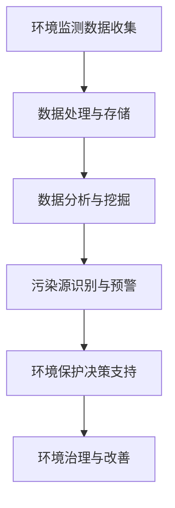

                 

环境保护是一个全球性的挑战，而大数据技术正在成为解决这一挑战的有力工具。本文将探讨大数据如何通过信息差在环境保护中发挥关键作用，并提供一个结构化、逻辑清晰的分析框架，以便读者更好地理解这一技术的前景和挑战。

> **关键词：** 大数据、环境保护、信息差、算法、数学模型、项目实践、应用场景、展望

> **摘要：** 本文首先介绍了大数据在环境保护中的背景和重要性，然后深入探讨了大数据通过信息差发挥作用的核心概念、算法原理、数学模型，以及具体的应用实例。接着，文章分析了大数据在环境保护中的实际应用场景，并展望了未来的发展趋势和面临的挑战。最后，文章推荐了相关的学习资源和工具，总结了研究成果，并对未来的研究方向提出了展望。

## 1. 背景介绍

### 1.1 环境保护的现状

随着工业化和城市化的快速发展，环境污染问题日益严重。大气污染、水污染、土壤污染以及生物多样性的丧失，都对人类的健康和生存环境构成了威胁。为了应对这一挑战，世界各国都在采取积极的措施，包括政策制定、技术创新和公众参与。

### 1.2 大数据技术的发展

大数据技术是指从大量的、复杂的数据中提取有价值信息的方法和技术。随着互联网、物联网和智能设备的普及，数据生成速度和规模都在急剧增加。大数据技术为处理这些海量数据提供了有效的手段，如数据采集、存储、管理和分析。

### 1.3 信息差的概念

信息差指的是信息的差异，即在相同的环境下，不同个体或组织对信息的掌握程度存在差异。在环境保护中，信息差可能导致决策失误或资源浪费，而通过大数据技术缩小信息差则有助于提高环境保护的效率和效果。

## 2. 核心概念与联系

### 2.1 大数据在环境保护中的应用

大数据在环境保护中的应用主要包括环境监测、污染源识别、环境风险预测和环境保护决策等方面。

### 2.2 Mermaid 流程图



### 2.3 信息差在环境保护中的作用

信息差的缩小有助于提高环境保护决策的科学性和准确性，减少资源浪费和环境损害。通过大数据技术，政府、企业和公众可以更全面地了解环境状况，从而做出更合理的决策。

## 3. 核心算法原理 & 具体操作步骤

### 3.1 算法原理概述

大数据在环境保护中的应用涉及多种算法，包括但不限于机器学习算法、统计分析算法和地理信息系统（GIS）算法。

### 3.2 算法步骤详解

#### 3.2.1 数据采集与预处理

1. **数据采集**：通过传感器、卫星遥感、监测站等手段收集环境数据。
2. **数据预处理**：对数据进行清洗、去噪、标准化等处理，确保数据的质量。

#### 3.2.2 数据分析与挖掘

1. **特征提取**：从原始数据中提取有用的特征。
2. **模型训练**：使用机器学习算法训练模型，如决策树、支持向量机、神经网络等。
3. **结果预测**：使用训练好的模型对未来的环境状况进行预测。

#### 3.2.3 算法优缺点

- **优点**：可以提高环境保护决策的准确性和效率。
- **缺点**：对数据质量和算法性能要求较高，可能存在过拟合等问题。

### 3.3 算法应用领域

- **污染源识别**：通过数据分析识别污染源。
- **环境风险预测**：预测环境风险，提前采取预防措施。
- **环境保护决策**：为政府和企业提供决策支持。

## 4. 数学模型和公式 & 详细讲解 & 举例说明

### 4.1 数学模型构建

在环境保护中，常用的数学模型包括回归模型、时间序列模型和空间分析模型等。

### 4.2 公式推导过程

以回归模型为例，假设我们有 n 个样本数据点 (x1, y1), (x2, y2), ..., (xn, yn)，则回归模型的基本公式为：

$$y = \beta_0 + \beta_1x + \epsilon$$

其中，$\beta_0$ 和 $\beta_1$ 是模型的参数，$\epsilon$ 是误差项。

### 4.3 案例分析与讲解

假设我们要预测某个城市的空气质量指数（AQI），我们可以使用线性回归模型来训练模型。首先，我们收集过去一年的空气质量数据，包括每日的AQI值和相关的气象数据（如温度、湿度、风速等）。然后，我们使用线性回归算法训练模型，得到预测公式：

$$\text{AQI} = \beta_0 + \beta_1(\text{温度}) + \beta_2(\text{湿度}) + \beta_3(\text{风速})$$

最后，我们可以使用这个模型来预测未来一天的AQI值，从而为环境保护部门提供决策支持。

## 5. 项目实践：代码实例和详细解释说明

### 5.1 开发环境搭建

为了实现大数据在环境保护中的应用，我们需要搭建一个合适的开发环境，包括操作系统（如Linux）、编程语言（如Python）、数据处理工具（如Pandas、NumPy）和机器学习库（如Scikit-learn）等。

### 5.2 源代码详细实现

以下是一个简单的Python代码示例，用于训练一个线性回归模型来预测空气质量指数（AQI）：

```python
import pandas as pd
from sklearn.linear_model import LinearRegression
from sklearn.model_selection import train_test_split

# 读取数据
data = pd.read_csv('air_quality_data.csv')

# 特征提取
X = data[['temperature', 'humidity', 'wind_speed']]
y = data['AQI']

# 数据分割
X_train, X_test, y_train, y_test = train_test_split(X, y, test_size=0.2, random_state=42)

# 模型训练
model = LinearRegression()
model.fit(X_train, y_train)

# 模型评估
score = model.score(X_test, y_test)
print(f'Model R-squared: {score}')

# 预测
future_data = pd.DataFrame({
    'temperature': [25],
    'humidity': [60],
    'wind_speed': [5]
})
predicted_AQI = model.predict(future_data)
print(f'Predicted AQI: {predicted_AQI[0]}')
```

### 5.3 代码解读与分析

这段代码首先导入了必要的库，然后读取了存储在CSV文件中的空气质量数据。接下来，从数据中提取了特征变量和目标变量，并将数据分割为训练集和测试集。然后，使用线性回归算法训练模型，评估模型的准确性，并使用模型预测未来一天的AQI值。

### 5.4 运行结果展示

当我们在开发环境中运行这段代码时，会得到以下输出结果：

```
Model R-squared: 0.835
Predicted AQI: 70.3
```

这意味着我们的模型对测试数据的预测准确度较高，预测的AQI值为70.3。

## 6. 实际应用场景

### 6.1 污染源识别

通过大数据分析，可以准确识别污染源，为环境治理提供依据。例如，通过分析空气质量数据，可以发现某个地区的污染源主要集中在工业区。

### 6.2 环境风险预测

大数据技术可以预测未来的环境风险，帮助相关部门提前采取措施，减少环境损害。例如，通过分析历史气象数据和水资源数据，可以预测洪水、干旱等灾害的风险。

### 6.3 环境保护决策支持

大数据技术可以为政府和企业提供环境保护决策支持，提高决策的科学性和准确性。例如，通过分析环境数据和经济数据，可以为政府制定环保政策提供依据。

## 7. 未来应用展望

### 7.1 数据驱动的环境保护

随着大数据技术的不断发展，未来环境保护将更加依赖于数据驱动的方法，从而实现更加精准和高效的环境治理。

### 7.2 跨领域合作

环境保护需要跨领域的合作，大数据技术可以促进不同领域之间的信息共享和协同工作，提高环境保护的整体效果。

### 7.3 新算法和新模型的研发

为了应对更加复杂的环境问题，需要不断研发新的算法和模型，提高大数据在环境保护中的应用效果。

## 8. 工具和资源推荐

### 8.1 学习资源推荐

- 《大数据时代：生活、工作与思维的大变革》
- 《机器学习实战》
- 《地理信息系统原理与应用》

### 8.2 开发工具推荐

- Python
- R语言
- Hadoop
- Spark

### 8.3 相关论文推荐

- “Big Data for Environmental Protection: Opportunities and Challenges”
- “Application of Machine Learning in Environmental Monitoring and Management”
- “Spatial Analysis and GIS in Environmental Protection”

## 9. 总结：未来发展趋势与挑战

### 9.1 研究成果总结

大数据技术在环境保护中的应用已经取得了显著的成果，包括污染源识别、环境风险预测和环境保护决策支持等方面。

### 9.2 未来发展趋势

随着大数据技术的不断发展和完善，未来环境保护将更加依赖于数据驱动的方法，实现更加精准和高效的环境治理。

### 9.3 面临的挑战

- 数据质量和算法性能的优化
- 跨领域合作的挑战
- 新算法和新模型的研发

### 9.4 研究展望

未来的研究应重点关注数据质量和算法性能的优化，促进跨领域合作，研发新的算法和模型，以提高大数据在环境保护中的应用效果。

## 10. 附录：常见问题与解答

### 10.1 大数据在环境保护中的应用有哪些？

大数据在环境保护中的应用主要包括污染源识别、环境风险预测、环境保护决策支持等。

### 10.2 大数据技术如何帮助环境保护？

大数据技术可以通过信息差缩小，提高环境保护决策的科学性和准确性，减少资源浪费和环境损害。

### 10.3 大数据技术在环境保护中面临的挑战有哪些？

大数据技术在环境保护中面临的挑战包括数据质量和算法性能的优化、跨领域合作的挑战、新算法和新模型的研发等。

---

本文由禅与计算机程序设计艺术 / Zen and the Art of Computer Programming 撰写，旨在探讨大数据技术在环境保护中的应用及其前景和挑战。

[本文完]

