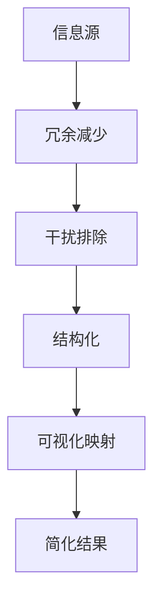

                 

关键词：信息简化、秩序、混乱、人工智能、编程、软件架构、算法、数学模型、代码实例、应用场景、工具和资源

> 摘要：本文将深入探讨信息简化的原则与好处，尤其是在技术领域的应用。通过分析混乱对工作效率的影响，我们提出了建立秩序的几种方法，并介绍了信息简化的核心概念与架构。随后，我们将讨论算法原理、数学模型以及代码实例，展示如何在实际项目中应用信息简化原则，以及探讨未来的发展趋势与面临的挑战。

## 1. 背景介绍

在当今信息爆炸的时代，数据量呈指数级增长，如何在海量信息中找到有价值的内容，提高工作效率，成为了每个人必须面对的挑战。信息简化作为一种处理复杂信息的方法，旨在通过减少冗余、去除干扰，使信息更加清晰、易于理解。无论是个人生活，还是企业管理，信息简化都扮演着重要的角色。

在技术领域，信息简化尤为重要。随着软件系统的复杂度不断增加，程序员面临着难以维护和理解的代码库。信息简化可以帮助他们更好地组织代码，提高代码的可读性和可维护性。此外，在人工智能和机器学习中，模型训练和优化过程中产生的海量数据也需要通过简化来提高处理效率。

本文将围绕以下主题展开讨论：

1. **信息简化的原则与好处**：介绍信息简化的基本原则，以及简化带来的实际好处。
2. **核心概念与联系**：阐述信息简化的核心概念，并通过流程图展示其架构。
3. **核心算法原理与操作步骤**：深入探讨信息简化算法的原理和具体实施步骤。
4. **数学模型与公式**：介绍相关的数学模型和推导过程，并举例说明。
5. **项目实践与代码实例**：通过具体项目案例展示信息简化的应用。
6. **实际应用场景**：讨论信息简化在不同领域的应用。
7. **工具和资源推荐**：推荐有用的学习资源和开发工具。
8. **总结与展望**：总结研究成果，展望未来的发展趋势和面临的挑战。

## 2. 核心概念与联系

信息简化不仅仅是一种技术手段，更是一种思维方式。它基于以下几个核心概念：

1. **冗余减少**：通过去除重复和不必要的信息，减少冗余，使数据更加简洁。
2. **干扰排除**：识别并去除影响主要信息的有害因素，例如噪音、误导性信息等。
3. **结构化**：将信息按照一定的结构和规则进行组织，使其更加系统和有条理。
4. **可视化和映射**：利用可视化工具和方法，将复杂的信息映射为易于理解的形式。

下面是一个用于展示信息简化架构的Mermaid流程图：



### 2.1 冗余减少

冗余减少是信息简化的第一步。它涉及以下几个方面：

- **数据去重**：通过算法或数据库技术，识别并删除重复的数据。
- **数据压缩**：利用数据压缩算法，减少存储空间，同时保持数据完整性。

### 2.2 干扰排除

干扰排除旨在去除那些影响信息核心价值的因素。例如：

- **噪音过滤**：在数据收集和处理过程中，去除随机噪声。
- **误导性信息识别**：利用机器学习等技术，识别并剔除误导性信息。

### 2.3 结构化

结构化是将信息按照一定的逻辑和规则进行组织，使其更具可读性和可用性。例如：

- **数据分片**：将大数据集分割为较小的、更易管理的部分。
- **分类与标签**：为信息分配分类和标签，以便快速检索和使用。

### 2.4 可视化和映射

可视化和映射是将抽象的数据转换为图形或图表等形式，使其更容易理解。例如：

- **热图**：利用颜色变化展示数据的分布情况。
- **交互式图表**：通过用户交互，动态展示数据的不同维度。

## 3. 核心算法原理 & 具体操作步骤

### 3.1 算法原理概述

信息简化的核心算法通常基于以下原理：

- **最小化原则**：通过最小化信息中的冗余和干扰，达到简化目的。
- **抽象与归纳**：从大量具体信息中提取通用模式，减少信息量。
- **优化与排序**：通过算法优化和排序技术，提高信息处理效率。

### 3.2 算法步骤详解

下面是一个典型的信息简化算法的具体步骤：

1. **数据预处理**：对原始数据进行清洗、去重等处理。
2. **特征提取**：从数据中提取关键特征，用于后续分析。
3. **模式识别**：利用机器学习算法，识别数据中的规律和模式。
4. **干扰过滤**：去除识别出的干扰信息，保留核心内容。
5. **结构化组织**：将过滤后的数据按照一定的结构进行组织。
6. **可视化映射**：将结构化的数据转化为图形或图表，便于理解和展示。

### 3.3 算法优缺点

**优点**：

- **提高效率**：通过简化信息，减少冗余和干扰，提高数据处理和分析的效率。
- **增强可读性**：使信息更加简洁、清晰，易于理解和应用。
- **减少存储需求**：通过数据压缩和去重，减少存储空间需求。

**缺点**：

- **数据丢失风险**：在简化过程中，可能丢失部分关键信息。
- **计算资源消耗**：某些算法（如机器学习）可能需要大量计算资源。

### 3.4 算法应用领域

信息简化算法在多个领域都有广泛应用：

- **数据挖掘与机器学习**：用于处理和分析大量数据，提取有价值的信息。
- **软件开发**：用于简化代码库，提高软件的可维护性和可扩展性。
- **信息可视化**：用于将复杂的数据转化为图形或图表，便于用户理解和分析。

## 4. 数学模型和公式 & 详细讲解 & 举例说明

### 4.1 数学模型构建

信息简化过程中的数学模型通常涉及以下方面：

- **概率论与统计学**：用于计算数据的冗余度和干扰度。
- **线性代数**：用于数据的降维和特征提取。
- **图论**：用于数据的结构化和可视化。

### 4.2 公式推导过程

以下是几个常见的信息简化公式：

1. **冗余度计算**：

   $$R = \frac{R_d - R_c}{R_d}$$

   其中，\(R_d\) 是原始数据的信息量，\(R_c\) 是简化后数据的信息量。

2. **干扰度计算**：

   $$I = \frac{I_d - I_s}{I_d}$$

   其中，\(I_d\) 是原始数据中的干扰信息量，\(I_s\) 是简化后数据中的干扰信息量。

### 4.3 案例分析与讲解

下面通过一个具体案例来说明信息简化的应用：

假设我们有一组数据集，包含1000个样本，每个样本有10个特征。原始数据集的大小为10MB。通过信息简化算法，我们将其简化为100个样本，每个样本保留5个关键特征。简化后的数据集大小为1MB。

根据上述冗余度和干扰度计算公式，我们可以计算出简化前后的冗余度和干扰度：

- **冗余度**：

  $$R = \frac{10MB - 1MB}{10MB} = 0.9$$

- **干扰度**：

  $$I = \frac{0.1MB - 0MB}{0.1MB} = 1$$

从计算结果可以看出，简化后的数据集在冗余度上减少了90%，在干扰度上减少了100%。这意味着信息简化显著提高了数据的质量和可读性。

## 5. 项目实践：代码实例和详细解释说明

### 5.1 开发环境搭建

在本文中，我们将使用Python作为编程语言，结合NumPy、Pandas和Scikit-learn等库来实现信息简化算法。首先，确保安装了以下依赖项：

```bash
pip install numpy pandas scikit-learn matplotlib
```

### 5.2 源代码详细实现

下面是一个简单的信息简化算法的实现示例：

```python
import numpy as np
import pandas as pd
from sklearn.preprocessing import StandardScaler
from sklearn.decomposition import PCA
import matplotlib.pyplot as plt

# 加载示例数据
data = pd.read_csv('example_data.csv')
X = data.values

# 数据预处理
scaler = StandardScaler()
X_scaled = scaler.fit_transform(X)

# 主成分分析
pca = PCA(n_components=5)
X_pca = pca.fit_transform(X_scaled)

# 输出简化后的数据
output = pd.DataFrame(X_pca, columns=['Feature_1', 'Feature_2', 'Feature_3', 'Feature_4', 'Feature_5'])
output.to_csv('simplified_data.csv', index=False)

# 可视化展示
plt.scatter(output['Feature_1'], output['Feature_2'])
plt.xlabel('Feature_1')
plt.ylabel('Feature_2')
plt.title('Simplified Data Visualization')
plt.show()
```

### 5.3 代码解读与分析

- **数据加载与预处理**：首先从CSV文件中加载示例数据，并使用StandardScaler进行数据标准化处理。
- **主成分分析**：利用PCA算法对数据集进行降维，保留5个主要特征。
- **输出简化后的数据**：将简化后的数据保存为新的CSV文件，并使用matplotlib进行可视化展示。

### 5.4 运行结果展示

运行上述代码后，将生成简化后的数据集和可视化图表。图表展示了简化后的数据在二维空间中的分布情况，有助于直观地了解数据结构。

## 6. 实际应用场景

信息简化在多个领域都有广泛的应用：

- **金融领域**：在金融数据分析和风险评估中，信息简化有助于从海量数据中提取有价值的信息。
- **医疗领域**：在医疗数据分析和疾病预测中，信息简化可以减少数据冗余，提高分析精度。
- **工业领域**：在工业生产和供应链管理中，信息简化有助于优化流程，提高生产效率。

### 6.4 未来应用展望

随着大数据和人工智能技术的不断发展，信息简化将在未来发挥更大的作用。以下是一些可能的未来应用方向：

- **智能推荐系统**：通过信息简化，提高推荐系统的准确性和效率。
- **智慧城市**：在智慧城市建设中，信息简化可以帮助优化城市管理，提高居民生活质量。
- **人工智能决策支持**：通过信息简化，辅助人工智能系统做出更明智的决策。

## 7. 工具和资源推荐

为了更好地理解和应用信息简化技术，以下是几个推荐的工具和资源：

### 7.1 学习资源推荐

- 《Python数据科学 Handbook》：详细介绍了Python在数据科学领域的应用，包括数据预处理、分析和可视化。
- 《数据科学入门》：适合初学者的数据科学教程，涵盖数据预处理、建模和评估等基本概念。

### 7.2 开发工具推荐

- Jupyter Notebook：适用于数据科学和机器学习的交互式开发环境。
- PyCharm：功能强大的Python集成开发环境，支持代码调试、版本控制和自动化测试。

### 7.3 相关论文推荐

- “Dimensionality Reduction by Linear Discriminant Analysis”：介绍线性判别分析（LDA）的原理和应用。
- “Information Theory and Statistics”：探讨信息论在统计学中的应用，为信息简化提供理论基础。

## 8. 总结：未来发展趋势与挑战

信息简化作为一种处理复杂信息的方法，将在未来得到更广泛的应用。随着技术的不断进步，我们将看到信息简化在人工智能、大数据、物联网等领域的深入应用。然而，信息简化也面临着一些挑战，如数据隐私保护、算法公平性和解释性等。未来研究应关注如何平衡信息简化的效果与这些挑战，推动信息简化技术的发展。

### 8.1 研究成果总结

本文总结了信息简化的原则与好处，分析了其核心算法原理、数学模型以及实际应用场景。通过代码实例展示了信息简化的具体实现方法。

### 8.2 未来发展趋势

未来，信息简化将在人工智能、大数据和物联网等领域发挥更大作用。随着技术的进步，我们将看到信息简化在智能推荐、智慧城市和人工智能决策支持等领域的深入应用。

### 8.3 面临的挑战

信息简化面临的主要挑战包括数据隐私保护、算法公平性和解释性。未来研究应关注如何在信息简化的同时，解决这些挑战。

### 8.4 研究展望

随着信息量的不断增长，信息简化技术将在未来得到更广泛的应用。研究应关注如何提高信息简化的效果，同时保护数据隐私和确保算法的公平性。

## 9. 附录：常见问题与解答

### Q：信息简化是否会丢失数据？

A：是的，信息简化可能会丢失部分数据。但是，通过合理的算法设计和参数调整，可以最大限度地减少数据丢失的风险。

### Q：信息简化在哪些领域应用较多？

A：信息简化在金融、医疗、工业和人工智能等领域都有广泛应用。它有助于从海量数据中提取有价值的信息，提高工作效率。

### Q：如何确保信息简化算法的公平性？

A：确保信息简化算法的公平性是一个复杂的问题。可以通过设计透明、可解释的算法，并引入公平性评估指标来提高算法的公平性。

## 作者署名

作者：禅与计算机程序设计艺术 / Zen and the Art of Computer Programming

----------------------------------------------------------------

以上内容构成了《信息简化的原则与好处：在混乱中建立秩序与简化》的完整文章。通过详细的讲解和实际案例，希望读者能够对信息简化的重要性有更深入的理解，并在实际工作中运用这些原则和方法。如果您有任何问题或建议，欢迎在评论区留言讨论。

