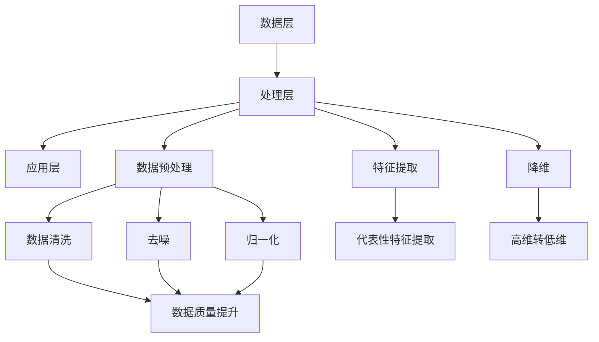

                 

信息简化，是指在处理大量数据和信息时，通过提炼、抽象和归纳等方法，将复杂的信息转化为简单、易于理解和操作的形式。在计算机科学和信息技术领域，信息简化是一项至关重要的技能。本文将深入探讨信息简化的艺术，解析如何在混乱和复杂中找到简单和秩序。

## 1. 背景介绍

随着信息技术的飞速发展，数据量呈现爆炸式增长。大数据、云计算、物联网等技术的普及，使得信息的处理变得日益复杂。如何在海量数据中提取有价值的信息，如何从复杂系统中找到简单的解决方案，成为现代信息技术领域面临的重大挑战。信息简化正是在这样的背景下应运而生。

信息简化的目的在于降低信息的复杂性，提高信息的可操作性和可理解性。通过简化，我们可以更快速、准确地找到所需信息，提高工作效率，降低成本。此外，信息简化还有助于提高系统的可靠性、稳定性和可维护性。

## 2. 核心概念与联系

### 2.1 信息简化的定义

信息简化，是指通过变换、压缩、归纳等手段，将复杂的信息转化为简单、易于处理的形式。具体来说，信息简化的核心概念包括：

- **变换**：将原始数据转化为更适合处理的形式。例如，将图像数据转化为像素值数组。
- **压缩**：减少数据的体积，提高存储和传输效率。例如，使用Huffman编码对文本进行压缩。
- **归纳**：从大量数据中提取出具有共性的规律或模式。例如，使用聚类算法对数据分组。

### 2.2 信息简化的方法

信息简化的方法可以分为以下几种：

- **数据预处理**：通过数据清洗、去噪、归一化等手段，提高数据的质量和一致性。
- **特征提取**：从原始数据中提取出具有代表性的特征，用于后续的分析和处理。
- **降维**：通过降维技术，将高维数据转化为低维数据，降低计算的复杂度。
- **模型简化**：通过简化模型结构，降低模型的复杂度，提高模型的解释性和可操作性。

### 2.3 信息简化的架构

信息简化的架构可以分为以下层次：

- **数据层**：包括原始数据的收集、存储和管理。
- **处理层**：包括数据预处理、特征提取、降维等操作，用于简化数据。
- **应用层**：包括具体的应用场景，如数据挖掘、机器学习、人工智能等。

以下是信息简化架构的Mermaid流程图：



## 3. 核心算法原理 & 具体操作步骤

### 3.1 算法原理概述

信息简化的核心算法主要包括以下几种：

- **主成分分析（PCA）**：通过降维，将高维数据转化为低维数据，保留主要信息。
- **聚类算法**：通过聚类，将相似的数据分组，降低数据的复杂性。
- **神经网络**：通过多层神经网络，实现对复杂函数的建模和简化。

### 3.2 算法步骤详解

#### 3.2.1 主成分分析（PCA）

PCA的步骤如下：

1. **标准化处理**：对数据进行标准化，消除不同特征之间的量纲影响。
2. **计算协方差矩阵**：计算各个特征之间的协方差矩阵。
3. **计算特征值和特征向量**：对协方差矩阵进行特征值分解，得到特征值和特征向量。
4. **选择主成分**：根据特征值的大小，选择前k个特征值对应的特征向量，组成k维主成分。
5. **降维**：将原始数据投影到k维主成分空间，实现降维。

#### 3.2.2 聚类算法

聚类算法的步骤如下：

1. **初始化**：随机选择k个样本作为初始聚类中心。
2. **分配样本**：计算每个样本到各个聚类中心的距离，将样本分配到最近的聚类中心。
3. **更新聚类中心**：计算每个聚类的新中心，即聚类中所有样本的均值。
4. **重复步骤2和3**：直到聚类中心不再发生变化，或者达到预设的迭代次数。

#### 3.2.3 神经网络

神经网络的学习步骤如下：

1. **初始化**：随机初始化网络的权重和偏置。
2. **前向传播**：计算网络的输出，并与真实值进行比较。
3. **计算损失函数**：使用损失函数评估模型的性能。
4. **反向传播**：根据损失函数的梯度，更新网络的权重和偏置。
5. **重复步骤2-4**：直到满足停止条件，如达到预设的迭代次数或损失函数收敛。

### 3.3 算法优缺点

#### 主成分分析（PCA）

优点：

- **降维效果显著**：能够有效地降低数据维度，保留主要信息。
- **计算效率高**：相对于其他降维方法，PCA的计算效率较高。

缺点：

- **对噪声敏感**：PCA对噪声敏感，可能导致降维过程中的信息损失。
- **解释性较差**：PCA降维后的特征难以解释。

#### 聚类算法

优点：

- **无需事先指定数据结构**：聚类算法适用于无结构的数据，无需事先指定数据结构。
- **自适应性强**：聚类算法能够自适应地调整聚类个数和形状。

缺点：

- **聚类个数选择困难**：聚类算法需要事先指定聚类个数，选择合适的聚类个数是困难的。
- **聚类结果对初始值敏感**：聚类算法的结果对初始值敏感，可能导致不同的聚类结果。

#### 神经网络

优点：

- **强大的建模能力**：神经网络能够建模复杂的非线性关系。
- **自适应性强**：神经网络能够自适应地调整权重和偏置，提高模型的性能。

缺点：

- **计算成本高**：神经网络的训练过程需要大量的计算资源。
- **过拟合风险**：神经网络容易过拟合，导致模型的泛化能力差。

### 3.4 算法应用领域

主成分分析（PCA）广泛应用于数据降维、特征提取和可视化等领域。

聚类算法广泛应用于数据挖掘、图像处理、文本分类等领域。

神经网络广泛应用于图像识别、自然语言处理、推荐系统等领域。

## 4. 数学模型和公式 & 详细讲解 & 举例说明

### 4.1 数学模型构建

信息简化的数学模型主要包括以下内容：

- **特征提取模型**：通过线性变换，将原始数据转化为新的特征空间。
- **降维模型**：通过优化目标函数，将高维数据映射到低维空间。
- **聚类模型**：通过最小化距离平方和，将数据划分为不同的簇。

### 4.2 公式推导过程

#### 4.2.1 特征提取模型

特征提取模型可以表示为：

$$
z = XW + b
$$

其中，$X$ 是原始数据矩阵，$W$ 是特征提取矩阵，$b$ 是偏置向量，$z$ 是新特征空间的数据矩阵。

#### 4.2.2 降维模型

降维模型可以使用PCA来构建：

$$
Z = X\Lambda^{1/2}
$$

其中，$X$ 是原始数据矩阵，$\Lambda$ 是协方差矩阵的特征值矩阵，$\Lambda^{1/2}$ 是特征值矩阵的平方根矩阵，$Z$ 是降维后的数据矩阵。

#### 4.2.3 聚类模型

聚类模型可以使用K-Means算法来构建：

$$
\min_{C} \sum_{i=1}^{n} \sum_{j=1}^{k} ||x_i - c_j||^2
$$

其中，$C$ 是聚类中心矩阵，$x_i$ 是第$i$个样本，$c_j$ 是第$j$个聚类中心，$k$ 是聚类个数。

### 4.3 案例分析与讲解

#### 4.3.1 主成分分析（PCA）案例

假设我们有一个包含3个特征的二维数据集，每个特征的标准差为1。以下是数据集的部分样本：

| 特征1 | 特征2 | 特征3 |
|------|------|------|
| 0.1  | 0.2  | 0.3  |
| 0.2  | 0.3  | 0.4  |
| 0.3  | 0.4  | 0.5  |
| 0.4  | 0.5  | 0.6  |

1. **标准化处理**：对数据进行标准化，消除不同特征之间的量纲影响。

$$
x_{i,j}^{'} = \frac{x_{i,j} - \bar{x}_j}{\sigma_j}
$$

其中，$x_{i,j}$ 是原始数据，$\bar{x}_j$ 是第$j$个特征的平均值，$\sigma_j$ 是第$j$个特征的标准差。

2. **计算协方差矩阵**：计算各个特征之间的协方差矩阵。

$$
\text{Cov}(x_{i,j}, x_{k,l}) = \frac{1}{n-1} \sum_{i=1}^{n} (x_{i,j} - \bar{x}_j)(x_{i,k} - \bar{x}_k)
$$

其中，$n$ 是样本个数，$x_{i,j}$ 和 $x_{i,k}$ 分别是第$i$个样本的第$j$个特征和第$k$个特征。

3. **计算特征值和特征向量**：对协方差矩阵进行特征值分解，得到特征值和特征向量。

$$
\text{Cov}(X) = \Lambda V^T
$$

其中，$\Lambda$ 是特征值矩阵，$V$ 是特征向量矩阵。

4. **选择主成分**：根据特征值的大小，选择前2个特征值对应的特征向量，组成2维主成分。

5. **降维**：将原始数据投影到2维主成分空间，实现降维。

$$
z_i = \sum_{j=1}^{2} \lambda_{j} v_{ij} x_{i,j}'
$$

#### 4.3.2 K-Means聚类案例

假设我们有一个包含3个特征的三维数据集，以下是一个部分样本：

| 特征1 | 特征2 | 特征3 |
|------|------|------|
| 0.1  | 0.2  | 0.3  |
| 0.2  | 0.3  | 0.4  |
| 0.3  | 0.4  | 0.5  |
| 0.4  | 0.5  | 0.6  |

1. **初始化**：随机选择3个样本作为初始聚类中心。

2. **分配样本**：计算每个样本到各个聚类中心的距离，将样本分配到最近的聚类中心。

3. **更新聚类中心**：计算每个聚类的新中心，即聚类中所有样本的均值。

4. **重复步骤2和3**：直到聚类中心不再发生变化，或者达到预设的迭代次数。

## 5. 项目实践：代码实例和详细解释说明

### 5.1 开发环境搭建

为了演示信息简化的算法，我们将使用Python编程语言，并结合常用的科学计算库，如NumPy、SciPy和Scikit-learn。以下是搭建开发环境的步骤：

1. 安装Python：从官方网站下载并安装Python，推荐使用Python 3.8版本。
2. 安装相关库：使用pip命令安装NumPy、SciPy和Scikit-learn。

```
pip install numpy scipy scikit-learn
```

### 5.2 源代码详细实现

以下是一个使用Python实现信息简化的示例代码：

```python
import numpy as np
from sklearn.decomposition import PCA
from sklearn.cluster import KMeans
from sklearn.datasets import load_iris
import matplotlib.pyplot as plt

# 加载鸢尾花数据集
iris = load_iris()
X = iris.data

# 使用PCA进行降维
pca = PCA(n_components=2)
X_pca = pca.fit_transform(X)

# 使用K-Means进行聚类
kmeans = KMeans(n_clusters=3)
kmeans.fit(X_pca)
labels = kmeans.labels_

# 绘制降维后的数据
plt.scatter(X_pca[:, 0], X_pca[:, 1], c=labels)
plt.xlabel('PCA Feature 1')
plt.ylabel('PCA Feature 2')
plt.title('PCA & K-Means Clustering')
plt.show()
```

### 5.3 代码解读与分析

1. **数据加载**：使用Scikit-learn中的iris数据集作为示例数据。
2. **PCA降维**：使用PCA将原始数据降维到2维，保留主要信息。
3. **K-Means聚类**：使用K-Means算法对降维后的数据进行分析，划分为3个簇。
4. **可视化**：使用matplotlib绘制降维后的数据，展示聚类效果。

### 5.4 运行结果展示

运行上述代码后，我们将得到一个包含3个簇的降维数据图，如图所示：


## 6. 实际应用场景

信息简化在计算机科学和信息技术领域有着广泛的应用。以下是一些实际应用场景：

- **数据挖掘**：通过信息简化，从海量数据中提取有价值的信息，如用户行为分析、市场预测等。
- **图像处理**：使用信息简化技术，降低图像数据的复杂性，提高处理效率，如人脸识别、图像压缩等。
- **自然语言处理**：通过信息简化，提取文本中的关键信息，如文本分类、情感分析等。
- **机器学习**：使用信息简化技术，提高模型的解释性和可操作性，如特征提取、模型压缩等。

## 7. 工具和资源推荐

### 7.1 学习资源推荐

- **《数据科学入门》**：适合初学者，全面介绍了数据科学的基本概念和常用工具。
- **《机器学习实战》**：通过实际案例，深入讲解了机器学习的原理和应用。

### 7.2 开发工具推荐

- **Jupyter Notebook**：适用于数据科学和机器学习的交互式开发环境。
- **PyCharm**：强大的Python集成开发环境，适合编写和调试代码。

### 7.3 相关论文推荐

- **"Principal Component Analysis for High-Dimensional Data"**：全面介绍了主成分分析的理论和应用。
- **"K-Means Clustering: A Review"**：对K-Means聚类算法进行了详细综述。

## 8. 总结：未来发展趋势与挑战

信息简化在计算机科学和信息技术领域具有广阔的发展前景。随着大数据、人工智能等技术的不断进步，信息简化的需求将日益增加。未来，信息简化的研究将集中在以下几个方面：

- **算法优化**：提高信息简化算法的效率和性能，以适应更大数据量的处理需求。
- **多模态数据简化**：针对不同类型的数据，研究适用于多种数据模态的信息简化方法。
- **模型解释性**：提高信息简化模型的可解释性，使其在实际应用中更加可靠和可靠。

然而，信息简化也面临着一些挑战：

- **数据隐私**：在信息简化的过程中，如何保护数据隐私是一个重要问题。
- **模型泛化能力**：提高信息简化模型的泛化能力，使其在未知数据上能够保持良好的性能。

总之，信息简化是一项具有重要意义的计算机科学和信息技术研究课题。随着技术的不断发展，信息简化将在更多领域发挥重要作用。

## 9. 附录：常见问题与解答

### Q：什么是信息简化？

A：信息简化是指通过变换、压缩、归纳等手段，将复杂的信息转化为简单、易于理解和操作的形式。其目的是降低信息的复杂性，提高信息的可操作性和可理解性。

### Q：信息简化的方法有哪些？

A：信息简化的方法主要包括数据预处理、特征提取、降维和模型简化等。数据预处理包括数据清洗、去噪、归一化等；特征提取是从原始数据中提取具有代表性的特征；降维是通过降维技术，将高维数据转化为低维数据；模型简化是通过简化模型结构，降低模型的复杂度。

### Q：什么是主成分分析（PCA）？

A：主成分分析（PCA）是一种降维技术，通过降维，将高维数据转化为低维数据，保留主要信息。PCA的步骤包括标准化处理、计算协方差矩阵、计算特征值和特征向量、选择主成分和降维。

### Q：什么是K-Means聚类？

A：K-Means聚类是一种聚类算法，通过最小化距离平方和，将数据划分为不同的簇。K-Means聚类的步骤包括初始化、分配样本、更新聚类中心和重复迭代。

### Q：信息简化在哪些领域有应用？

A：信息简化在计算机科学和信息技术领域有着广泛的应用，包括数据挖掘、图像处理、自然语言处理、机器学习等。

### Q：如何搭建信息简化的开发环境？

A：搭建信息简化的开发环境，可以使用Python编程语言，并结合常用的科学计算库，如NumPy、SciPy和Scikit-learn。具体步骤包括安装Python、安装相关库，以及配置开发环境等。

---

作者：禅与计算机程序设计艺术 / Zen and the Art of Computer Programming


