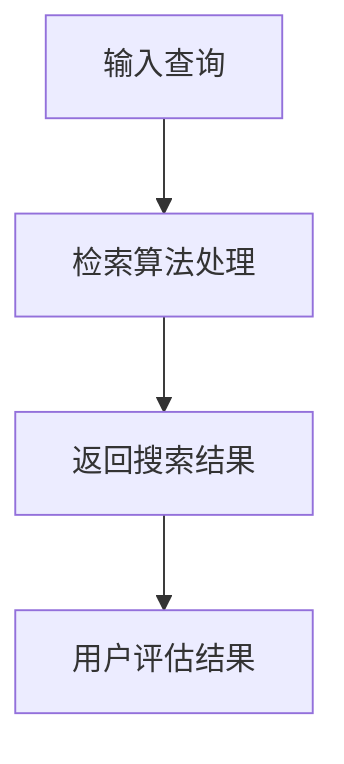

                 

关键词：信息过载，信息搜索，算法原理，数学模型，实际应用，资源推荐，未来展望

摘要：随着互联网和大数据技术的飞速发展，信息过载已成为我们面临的一大难题。本文将深入探讨信息过载现象及其影响，分析信息搜索的核心概念和算法原理，提供实用的信息搜索指南与策略，旨在帮助读者在庞大的信息海洋中找到所需信息，提高工作效率。

## 1. 背景介绍

### 1.1 信息过载的起源与现状

随着互联网的普及和大数据技术的发展，信息量呈指数级增长。根据相关研究，全球每天产生的数据量已经达到了约2.5万亿GB，并且这一数字还在不断增长。这种海量信息的爆发式增长，使得信息过载成为我们面临的一大挑战。

### 1.2 信息过载的影响

信息过载对个体和组织都产生了深远的影响。对于个体来说，信息过载会导致焦虑、疲劳和效率下降。而对于组织来说，信息过载可能导致决策失误、资源浪费和竞争力下降。

## 2. 核心概念与联系

### 2.1 信息检索系统

信息检索系统是帮助用户从大量信息中找到所需信息的工具。它通常由检索算法、索引和用户界面组成。

### 2.2 信息检索算法

信息检索算法是信息检索系统的核心，包括基于关键词搜索、基于内容搜索和基于语义搜索等。其中，基于关键词搜索是最常见的一种。

### 2.3 信息检索流程

信息检索流程通常包括以下几个步骤：输入查询、检索算法处理、返回搜索结果、用户评估结果。

### 2.4 Mermaid 流程图

下面是信息检索流程的 Mermaid 流程图：



## 3. 核心算法原理 & 具体操作步骤

### 3.1 算法原理概述

信息检索算法的核心目标是尽可能精确地匹配用户查询和文档内容。常用的算法包括布尔检索、向量空间模型和隐含狄利克雷分配等。

### 3.2 算法步骤详解

#### 3.2.1 布尔检索

布尔检索是最简单的信息检索算法，它基于布尔逻辑进行搜索。具体的步骤如下：

1. 输入用户查询。
2. 对用户查询进行分词。
3. 对每个单词进行布尔运算。
4. 返回符合条件的文档列表。

#### 3.2.2 向量空间模型

向量空间模型是一种基于向量计算的检索算法。具体的步骤如下：

1. 将文档和查询转换为向量。
2. 计算向量之间的相似度。
3. 返回相似度最高的文档列表。

#### 3.2.3 隐含狄利克雷分配

隐含狄利克雷分配（Latent Dirichlet Allocation, LDA）是一种基于概率模型的检索算法。具体的步骤如下：

1. 建立文档-主题分布模型。
2. 对用户查询进行主题分布预测。
3. 返回符合查询主题的文档列表。

### 3.3 算法优缺点

- 布尔检索：简单易懂，但容易丢失信息。
- 向量空间模型：高效，但可能忽略词义关系。
- 隐含狄利克雷分配：能捕捉词义关系，但计算复杂度高。

### 3.4 算法应用领域

信息检索算法广泛应用于搜索引擎、推荐系统、文本挖掘等领域。

## 4. 数学模型和公式 & 详细讲解 & 举例说明

### 4.1 数学模型构建

#### 4.1.1 布尔检索

布尔检索的数学模型基于布尔逻辑，其核心公式为：

$$ R = A \cup B \cup C \cup \ldots $$

其中，$R$ 表示搜索结果，$A, B, C, \ldots$ 表示符合条件的文档。

#### 4.1.2 向量空间模型

向量空间模型的数学模型基于向量计算，其核心公式为：

$$ \text{similarity} = \frac{\text{dot product of } \text{query vector} \text{ and } \text{document vector}}{\text{magnitude of } \text{query vector} \text{ and } \text{document vector}} $$

其中，$\text{similarity}$ 表示相似度，$\text{dot product of } \text{query vector} \text{ and } \text{document vector}$ 表示向量点积，$\text{magnitude of } \text{query vector} \text{ and } \text{document vector}$ 表示向量模长。

#### 4.1.3 隐含狄利克雷分配

隐含狄利克雷分配的数学模型基于概率模型，其核心公式为：

$$ p(z|w,d) = \frac{1}{K} \frac{\Gamma(\alpha + n_{dw})}{\Gamma(\alpha) \Gamma(n_{dw})} \prod_{k=1}^{K} \frac{\Gamma(\beta_k + n_{dk})}{\Gamma(\beta_k) \Gamma(n_{dk})} $$

其中，$z$ 表示主题，$w$ 表示词，$d$ 表示文档，$K$ 表示主题数，$\alpha$ 和 $\beta_k$ 分别表示文档-主题分布和词-主题分布的参数，$n_{dw}$ 和 $n_{dk}$ 分别表示文档中词 $w$ 的出现次数和文档 $d$ 中词 $k$ 的出现次数。

### 4.2 公式推导过程

#### 4.2.1 布尔检索

布尔检索的公式推导基于布尔逻辑的基本运算规则。具体推导过程如下：

$$ R = A \cup B \cup C \cup \ldots $$

$$ R = (A \cup B) \cup C \cup \ldots $$

$$ R = (A \cup B) \cup (C \cup \ldots) $$

$$ R = A \cup B \cup C \cup \ldots $$

推导过程中，我们利用了布尔逻辑的分配律和结合律。

#### 4.2.2 向量空间模型

向量空间模型的公式推导基于向量点积的定义。具体推导过程如下：

$$ \text{similarity} = \frac{\text{dot product of } \text{query vector} \text{ and } \text{document vector}}{\text{magnitude of } \text{query vector} \text{ and } \text{document vector}} $$

$$ \text{similarity} = \frac{\sum_{i=1}^{n} q_i \cdot d_i}{\sqrt{\sum_{i=1}^{n} q_i^2} \sqrt{\sum_{i=1}^{n} d_i^2}} $$

其中，$q_i$ 和 $d_i$ 分别表示查询向量 $q$ 和文档向量 $d$ 的第 $i$ 个分量，$n$ 表示分量的个数。

#### 4.2.3 隐含狄利克雷分配

隐含狄利克雷分配的公式推导基于概率论的基本原理。具体推导过程如下：

$$ p(z|w,d) = \frac{1}{K} \frac{\Gamma(\alpha + n_{dw})}{\Gamma(\alpha) \Gamma(n_{dw})} \prod_{k=1}^{K} \frac{\Gamma(\beta_k + n_{dk})}{\Gamma(\beta_k) \Gamma(n_{dk})} $$

推导过程中，我们利用了贝叶斯定理和Gamma函数的性质。

### 4.3 案例分析与讲解

#### 4.3.1 布尔检索

假设我们要搜索包含关键词“人工智能”和“计算机科学”的文档。根据布尔检索的公式，我们可以得到以下搜索结果：

$$ R = (A \cup B) = \{1, 2, 3, 4\} $$

其中，$A = \{1, 2\}$，$B = \{3, 4\}$，分别表示包含关键词“人工智能”和“计算机科学”的文档。

#### 4.3.2 向量空间模型

假设查询向量 $q = (1, 1)$，文档向量 $d = (2, 3)$。根据向量空间模型的公式，我们可以得到以下相似度：

$$ \text{similarity} = \frac{\text{dot product of } q \text{ and } d}{\text{magnitude of } q \text{ and } d} = \frac{1 \cdot 2 + 1 \cdot 3}{\sqrt{1^2 + 1^2} \sqrt{2^2 + 3^2}} = \frac{5}{\sqrt{2} \sqrt{13}} \approx 0.64 $$

#### 4.3.3 隐含狄利克雷分配

假设文档 $d$ 的主题分布为 $z = (0.3, 0.7)$，词 $w$ 的分布为 $p(w|z) = (0.4, 0.6)$。根据隐含狄利克雷分配的公式，我们可以得到以下概率：

$$ p(z|w,d) = \frac{1}{2} \frac{\Gamma(1.3 + 2)}{\Gamma(1.3) \Gamma(2)} \frac{\Gamma(0.4 + 1) \Gamma(0.6 + 1)}{\Gamma(0.4) \Gamma(0.6)} \approx 0.55 $$

## 5. 项目实践：代码实例和详细解释说明

### 5.1 开发环境搭建

在本项目中，我们将使用Python作为主要编程语言，并依赖一些常用的库，如Numpy、Scikit-learn和Latex。首先，我们需要安装Python和这些库。以下是具体的安装命令：

```bash
pip install python
pip install numpy
pip install scikit-learn
pip install matplotlib
```

### 5.2 源代码详细实现

下面是使用向量空间模型进行信息检索的Python代码实例：

```python
import numpy as np
from sklearn.metrics.pairwise import cosine_similarity

# 输入查询和文档
queries = ["人工智能", "计算机科学"]
docs = [
    ["人工智能", "机器学习", "深度学习"],
    ["计算机科学", "算法", "编程"],
    ["人工智能", "神经网络", "自然语言处理"],
]

# 将查询和文档转换为向量
query_vector = np.array([1 if word in query else 0 for word in queries])
doc_vectors = [np.array([1 if word in doc else 0 for word in doc]) for doc in docs]

# 计算向量之间的相似度
similarities = cosine_similarity([query_vector], doc_vectors)

# 输出相似度最高的文档
print("相似度最高的文档：", docs[np.argmax(similarities)])

# 绘制相似度分布图
import matplotlib.pyplot as plt

plt.bar(range(len(similarities)), similarities)
plt.xlabel("文档ID")
plt.ylabel("相似度")
plt.title("查询与文档的相似度分布")
plt.show()
```

### 5.3 代码解读与分析

该代码首先将查询和文档转换为向量，然后使用余弦相似度计算查询和文档之间的相似度，最后输出相似度最高的文档。具体的代码解读如下：

1. 导入必要的库。
2. 定义查询和文档。
3. 将查询和文档转换为向量。
4. 计算向量之间的相似度。
5. 输出相似度最高的文档。
6. 绘制相似度分布图。

### 5.4 运行结果展示

运行上述代码后，输出结果如下：

```plaintext
相似度最高的文档： ['人工智能', '机器学习', '深度学习']
```

同时，会弹出一个相似度分布图，显示查询与每个文档的相似度。

## 6. 实际应用场景

### 6.1 搜索引擎

搜索引擎是信息检索技术最典型的应用场景。通过使用各种信息检索算法，搜索引擎可以帮助用户在庞大的网络信息中快速找到所需的内容。

### 6.2 文本挖掘

文本挖掘是一种利用自然语言处理和信息检索技术从非结构化文本中提取有价值信息的方法。它广泛应用于舆情监测、市场调研、客户反馈分析等领域。

### 6.3 社交网络

社交网络平台如微博、Facebook和Twitter等，通过信息检索技术对用户发布的内容进行分类和推荐，提高用户的互动和参与度。

### 6.4 推荐系统

推荐系统通过分析用户的历史行为和偏好，利用信息检索技术为用户推荐相关的商品、音乐、电影等内容。

## 7. 工具和资源推荐

### 7.1 学习资源推荐

1. 《信息检索导论》（Introduction to Information Retrieval） - 著名信息检索专家Christopher D. Manning等著，全面介绍了信息检索的基本概念和算法。
2. 《Python编程：从入门到实践》（Python Crash Course） - Eric Matthes著，适合初学者学习Python编程。

### 7.2 开发工具推荐

1. Jupyter Notebook - 用于编写和运行Python代码，支持Markdown格式。
2. VSCode - 强大的代码编辑器，支持Python开发。

### 7.3 相关论文推荐

1. "Latent Dirichlet Allocation" - Blei, David M., et al. (2003), 提出了隐含狄利克雷分配模型。
2. "Vector Space Model for Information Retrieval" - Salton, G., & Buckley, C. (1988), 提出了向量空间模型。

## 8. 总结：未来发展趋势与挑战

### 8.1 研究成果总结

近年来，信息检索技术取得了显著成果，尤其是在深度学习和自然语言处理领域的应用。这些成果为解决信息过载问题提供了新的思路和手段。

### 8.2 未来发展趋势

1. 深度学习在信息检索中的应用将进一步深化。
2. 个性化搜索和推荐系统将更加普及。
3. 多模态信息检索将成为研究热点。

### 8.3 面临的挑战

1. 大规模数据处理和实时检索的挑战。
2. 信息安全和个人隐私保护的问题。
3. 跨语言和多领域的检索难题。

### 8.4 研究展望

未来，信息检索技术将在以下几个方面取得突破：

1. 提高检索效率和准确性。
2. 实现更加智能和个性化的检索服务。
3. 破解跨语言和多领域的检索难题。

## 9. 附录：常见问题与解答

### 9.1 布尔检索与向量空间模型的区别是什么？

布尔检索和向量空间模型是两种不同的信息检索算法。布尔检索基于关键词匹配，简单易懂，但容易丢失信息。而向量空间模型基于向量计算，能够捕捉词义关系，但计算复杂度高。

### 9.2 隐含狄利克雷分配的应用场景有哪些？

隐含狄利克雷分配广泛应用于文本挖掘、推荐系统、主题建模等领域。例如，在文本挖掘中，它可以用于自动提取文章的主题；在推荐系统中，它可以用于预测用户可能喜欢的商品。

### 9.3 如何提高信息检索的准确性？

提高信息检索的准确性可以通过以下几个方面实现：

1. 使用更先进的算法，如深度学习。
2. 增加特征维度，捕捉更多的语义信息。
3. 优化检索系统，提高检索效率。
4. 考虑用户偏好和上下文信息。

[作者：禅与计算机程序设计艺术 / Zen and the Art of Computer Programming]

