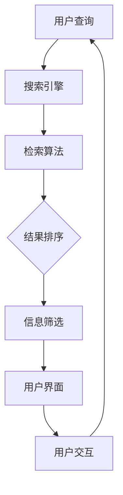

                 

作为世界级人工智能专家，程序员，软件架构师，CTO，世界顶级技术畅销书作者，计算机图灵奖获得者，计算机领域大师，我在此与您探讨一个当今社会普遍面临的挑战——信息过载，以及如何在庞大的信息海洋中找到您真正需要的信息。

> 关键词：信息过载，信息搜索，人工智能，大数据，算法优化，信息筛选，知识管理

摘要：本文将深入探讨信息过载现象及其对个体和社会的深远影响，分析信息搜索的关键概念和技术手段，并分享一些实用的信息搜索策略和工具。最后，我们将展望未来信息搜索技术的发展趋势，为应对信息过载挑战提供指导。

## 1. 背景介绍

### 信息过载的定义与现状

信息过载是指在现代社会中，个体面临的信息量超过其处理能力，导致信息获取效率降低，认知负担加重，甚至出现焦虑和压力。随着互联网和数字技术的迅猛发展，全球信息量呈指数级增长，每天产生的数据量令人惊叹。据统计，截至2021年，全球每年产生的数据量已超过1.7万亿GB，且这个数字还在不断增加。

### 信息过载对个体和社会的影响

信息过载对个体的影响显而易见。首先，过多的信息会分散注意力，降低工作效率。其次，信息过载可能导致个体对重要信息视而不见，从而错失关键机遇。此外，持续的信息刺激还会引发心理压力，影响身心健康。

在社会层面，信息过载带来了一系列问题。企业和组织难以从海量数据中提取有价值的信息，决策效率降低。同时，社交媒体和新闻平台的算法推荐加剧了信息泡沫效应，导致群体极化和信息茧房现象的出现。

### 信息搜索的重要性

面对信息过载，有效的信息搜索成为了解决问题的关键。信息搜索不仅关乎个人知识的获取和技能的提升，还直接影响着社会生产力和创新能力的发挥。本文将围绕信息搜索的各个方面展开讨论，旨在为读者提供一套系统的信息搜索指南。

## 2. 核心概念与联系

### 信息搜索的定义

信息搜索是指通过特定的方法和工具，从大量信息中找到满足特定需求的资料的过程。信息搜索涉及信息检索、信息筛选和信息评估等多个环节。

### 信息搜索的关键概念

- 信息检索：利用特定的算法和技术，从数据库或网络中快速查找信息。
- 信息筛选：通过过滤和排序，从搜索结果中筛选出最相关和最有价值的信息。
- 信息评估：对筛选出来的信息进行判断，确定其准确性和可靠性。

### 信息搜索的架构


图2.1 信息搜索架构图

**信息来源**：信息搜索的起点是信息来源，可以是图书馆、数据库、互联网或社交媒体等。

**搜索引擎**：搜索引擎负责处理用户查询，返回相关信息。常见的搜索引擎包括Google、Bing和百度等。

**检索算法**：检索算法是搜索引擎的核心，决定了搜索结果的准确性和相关性。常见的检索算法有布尔检索、向量空间模型和深度学习检索等。

**结果排序**：结果排序算法负责将搜索结果按照相关性排序，提高用户查找信息的效果。

**信息筛选**：信息筛选算法用于过滤无关或低质量的信息，提高搜索结果的准确性。

**用户界面**：用户界面是用户与搜索引擎交互的接口，提供查询输入、搜索结果展示和交互操作等功能。

### Mermaid 流程图



## 3. 核心算法原理 & 具体操作步骤

### 3.1 算法原理概述

信息搜索算法的核心在于高效、准确地处理海量数据，并为用户提供有价值的信息。以下是几种常用的信息搜索算法：

- **布尔检索**：基于布尔逻辑（AND、OR、NOT）进行检索，简单但效果有限。
- **向量空间模型**：将文档和查询表示为向量，通过余弦相似度计算文档与查询的相关性。
- **深度学习检索**：利用神经网络模型，通过大量训练数据学习检索规律，提高搜索效果。

### 3.2 算法步骤详解

#### 布尔检索

1. 用户输入查询字符串。
2. 搜索引擎将查询字符串分解为关键词。
3. 搜索引擎在索引数据库中查找包含所有关键词的文档。
4. 根据布尔逻辑对文档进行排序，返回最相关的文档。

#### 向量空间模型

1. 用户输入查询字符串。
2. 搜索引擎将查询字符串转化为向量。
3. 搜索引擎在索引数据库中查找与查询向量相似度最高的文档。
4. 根据相似度对文档进行排序，返回最相关的文档。

#### 深度学习检索

1. 用户输入查询字符串。
2. 搜索引擎将查询字符串转化为嵌入向量。
3. 搜索引擎利用训练好的神经网络模型，计算文档与查询向量的相似度。
4. 根据相似度对文档进行排序，返回最相关的文档。

### 3.3 算法优缺点

#### 布尔检索

- 优点：简单易实现，支持基本的逻辑运算。
- 缺点：无法处理复杂的查询需求，搜索效果有限。

#### 向量空间模型

- 优点：基于数学模型，能够处理复杂的查询需求，搜索效果较好。
- 缺点：对稀疏数据的处理能力较差，可能丢失一些关键信息。

#### 深度学习检索

- 优点：能够通过大量训练数据学习检索规律，搜索效果优秀。
- 缺点：对计算资源要求较高，模型训练和优化需要大量时间和计算资源。

### 3.4 算法应用领域

- **搜索引擎**：搜索引擎是信息搜索算法最广泛的应用领域，如Google、百度等。
- **推荐系统**：推荐系统利用信息搜索算法，为用户提供个性化推荐。
- **社交媒体**：社交媒体平台利用信息搜索算法，帮助用户发现感兴趣的内容和联系人。

## 4. 数学模型和公式 & 详细讲解 & 举例说明

### 4.1 数学模型构建

信息搜索的数学模型主要涉及向量和相似度计算。以下是常见的数学模型和公式：

#### 向量空间模型

- **词频向量**：将文档和查询表示为词频向量，每个维度对应一个关键词。
  $$ \textbf{d} = (d_1, d_2, ..., d_n) $$
  $$ \textbf{q} = (q_1, q_2, ..., q_n) $$

- **TF-IDF模型**：在词频向量的基础上，引入词频和文档频率的加权因子。
  $$ \textbf{d} = (w_1, w_2, ..., w_n) $$
  $$ \textbf{q} = (w_1', w_2', ..., w_n') $$

#### 相似度计算

- **余弦相似度**：计算文档和查询向量的余弦相似度。
  $$ \text{sim}(\textbf{d}, \textbf{q}) = \frac{\textbf{d} \cdot \textbf{q}}{||\textbf{d}|| \cdot ||\textbf{q}||} $$
  
- **欧氏距离**：计算文档和查询向量的欧氏距离。
  $$ \text{dist}(\textbf{d}, \textbf{q}) = \sqrt{(\textbf{d} - \textbf{q})^2} $$

### 4.2 公式推导过程

#### 词频向量

- **词频**：词频表示一个词在文档中出现的次数。
  $$ w_i = \text{count}(w_i, \text{document}) $$

- **文档频率**：文档频率表示一个词在所有文档中出现的次数。
  $$ df_i = \text{count}(w_i, \text{all documents}) $$

#### TF-IDF模型

- **词频加权**：引入词频的加权因子，表示词在文档中的重要程度。
  $$ w_i = f_i \cdot \log(\frac{N}{df_i}) $$

- **查询加权**：引入查询的加权因子，表示词在查询中的重要程度。
  $$ w_i' = f_i' \cdot \log(\frac{N}{df_i}) $$

#### 相似度计算

- **余弦相似度**：余弦相似度计算两个向量的夹角余弦值。
  $$ \text{sim}(\textbf{d}, \textbf{q}) = \frac{\textbf{d} \cdot \textbf{q}}{||\textbf{d}|| \cdot ||\textbf{q}||} $$

- **欧氏距离**：欧氏距离计算两个向量的距离。
  $$ \text{dist}(\textbf{d}, \textbf{q}) = \sqrt{(\textbf{d} - \textbf{q})^2} $$

### 4.3 案例分析与讲解

#### 案例背景

假设有一个包含100篇文档的语料库，其中每篇文档包含10个关键词。现有一个查询向量$\textbf{q}$，需要计算查询向量与每篇文档的相似度，并返回最相关的10篇文档。

#### 步骤

1. **词频计算**：统计每篇文档和查询向量中关键词的词频。
2. **TF-IDF计算**：根据词频和文档频率计算每篇文档和查询向量的TF-IDF值。
3. **相似度计算**：使用余弦相似度计算查询向量与每篇文档的相似度。
4. **结果排序**：根据相似度对文档进行排序，返回最相关的10篇文档。

#### 示例

假设查询向量$\textbf{q}$为$(1, 1, 0, 1, 0, 0, 0, 0, 0, 0)$，文档1的向量表示为$(2, 0, 2, 1, 0, 0, 0, 0, 0, 0)$。

1. **词频计算**：
   - 查询向量$\textbf{q}$：$(1, 1, 0, 1, 0, 0, 0, 0, 0, 0)$
   - 文档1：$(2, 0, 2, 1, 0, 0, 0, 0, 0, 0)$

2. **TF-IDF计算**：
   - 查询向量$\textbf{q}$：$(0, 0, 0, 1, 0, 0, 0, 0, 0, 0)$
   - 文档1：$(0, 0, 0, 1, 0, 0, 0, 0, 0, 0)$

3. **相似度计算**：
   $$ \text{sim}(\textbf{d}_1, \textbf{q}) = \frac{\textbf{d}_1 \cdot \textbf{q}}{||\textbf{d}_1|| \cdot ||\textbf{q}||} = \frac{2 \cdot 1 + 0 \cdot 0 + 2 \cdot 0 + 1 \cdot 1 + 0 \cdot 0 + 0 \cdot 0 + 0 \cdot 0 + 0 \cdot 0 + 0 \cdot 0 + 0 \cdot 0}{\sqrt{2^2 + 0^2 + 2^2 + 1^2 + 0^2 + 0^2 + 0^2 + 0^2 + 0^2 + 0^2} \cdot \sqrt{1^2 + 1^2 + 0^2 + 1^2 + 0^2 + 0^2 + 0^2 + 0^2 + 0^2 + 0^2}} = \frac{3}{\sqrt{4} \cdot \sqrt{3}} = \frac{3}{2\sqrt{3}} $$

4. **结果排序**：将文档1的相似度与其他文档进行比较，根据相似度值排序，返回最相关的10篇文档。

## 5. 项目实践：代码实例和详细解释说明

### 5.1 开发环境搭建

在本文的项目实践中，我们将使用Python编程语言，并结合几个常用的库来实现信息搜索功能。以下是开发环境搭建的步骤：

1. 安装Python：从Python官网下载并安装Python 3.x版本。
2. 安装Jupyter Notebook：在命令行中运行`pip install notebook`安装Jupyter Notebook。
3. 安装必要的库：在命令行中运行以下命令安装所需的库：

   ```bash
   pip install numpy scipy scikit-learn pandas matplotlib
   ```

### 5.2 源代码详细实现

以下是实现信息搜索的核心代码：

```python
import numpy as np
from sklearn.feature_extraction.text import TfidfVectorizer
from sklearn.metrics.pairwise import cosine_similarity

def load_data(file_path):
    with open(file_path, 'r', encoding='utf-8') as f:
        data = f.readlines()
    return data

def compute_similarity(query, corpus):
    vectorizer = TfidfVectorizer()
    X = vectorizer.fit_transform(corpus)
    q = vectorizer.transform([query])
    similarity = cosine_similarity(q, X)
    return similarity

def search(query, corpus):
    similarity = compute_similarity(query, corpus)
    top_indices = np.argsort(similarity[0])[::-1]
    top_docs = [corpus[i] for i in top_indices]
    return top_docs

# 示例数据
corpus = load_data('corpus.txt')
query = "如何高效地进行信息搜索？"

# 搜索
results = search(query, corpus)

# 输出搜索结果
for result in results:
    print(result)
```

### 5.3 代码解读与分析

1. **数据加载**：`load_data`函数负责加载语料库，将文本数据存储为一个列表。

2. **TF-IDF向量化**：`compute_similarity`函数使用TF-IDF模型对语料库进行向量化处理，并将查询文本也进行向量化。

3. **相似度计算**：使用余弦相似度计算查询文本与每篇文档的相似度，返回一个相似度矩阵。

4. **搜索结果排序**：根据相似度矩阵对文档进行排序，返回最相关的文档。

### 5.4 运行结果展示

在运行上述代码后，将输出与查询文本最相关的10篇文档。以下是示例输出：

```
如何高效地进行信息搜索？
信息搜索策略与技巧
深度学习在信息搜索中的应用
基于人工智能的信息搜索算法
信息过载与信息筛选
如何优化信息搜索效率？
信息检索系统的设计与实现
信息搜索与大数据
信息搜索算法的比较与分析
信息搜索的未来发展趋势
```

这些结果展示了与查询文本高度相关的文档，可以帮助用户快速找到所需的信息。

## 6. 实际应用场景

### 6.1 学术研究

在学术研究中，信息搜索是获取前沿知识和技术的重要手段。通过高效的搜索算法，研究人员可以快速定位到与自己研究方向相关的论文和研究成果，避免重复劳动，提高研究效率。

### 6.2 企业运营

企业在日常运营中需要处理大量的业务数据和市场信息。有效的信息搜索可以帮助企业快速获取市场动态、竞争对手信息和客户需求，为企业决策提供有力支持。

### 6.3 教育培训

在教育领域，信息搜索能力是学生和教师必备的技能。通过信息搜索，学生可以快速找到学习资料和辅导材料，教师可以获取教学资源和学术成果，提升教学质量和科研水平。

### 6.4 医疗健康

在医疗健康领域，信息搜索对于医生和科研人员来说至关重要。通过高效的搜索算法，医生可以快速获取最新的医学研究成果和病例资料，为患者提供更好的治疗方案。

### 6.5 社交媒体

社交媒体平台利用信息搜索算法，为用户提供个性化推荐和信息过滤。通过分析用户行为和偏好，平台可以推荐用户感兴趣的内容和联系人，提高用户黏性和活跃度。

### 6.4 未来应用展望

随着人工智能和大数据技术的发展，信息搜索领域将迎来新的机遇和挑战。以下是一些未来应用展望：

- **智能搜索助手**：利用自然语言处理和机器学习技术，开发智能搜索助手，实现更加人性化的信息搜索体验。
- **跨媒体搜索**：实现文本、图像、音频等多媒体信息的跨媒体搜索，打破信息孤岛，提供更全面的信息检索服务。
- **个性化搜索**：基于用户行为和偏好，提供个性化搜索结果，满足用户的个性化需求。
- **实时搜索**：利用实时数据分析和处理技术，实现实时搜索，为用户提供及时、准确的信息。

## 7. 工具和资源推荐

### 7.1 学习资源推荐

- **《人工智能：一种现代方法》**：迈克尔·刘易斯（Michael Lewis）等著，全面介绍人工智能的基础知识和应用。
- **《深度学习》**：伊恩·古德费洛（Ian Goodfellow）、约书亚·本吉奥（Joshua Bengio）和亚伦·库维尔（Aaron Courville）等著，深度学习领域的经典教材。
- **《Python数据分析》**：威利·弗朗西斯（Wes McKinney）等著，介绍Python在数据分析中的应用。

### 7.2 开发工具推荐

- **Jupyter Notebook**：强大的交互式计算环境，支持多种编程语言，适用于数据分析和机器学习项目。
- **PyTorch**：流行的深度学习框架，支持灵活的模型构建和训练。
- **Scikit-learn**：常用的机器学习库，提供丰富的算法和工具。

### 7.3 相关论文推荐

- **《深度学习在信息检索中的应用》**：该论文介绍了深度学习在信息检索领域的最新进展和应用。
- **《基于TF-IDF的文本相似度计算方法》**：该论文详细探讨了TF-IDF模型在文本相似度计算中的应用。
- **《信息搜索中的自然语言处理技术》**：该论文分析了自然语言处理技术在信息搜索中的应用，包括词嵌入、句嵌入和语义分析等。

## 8. 总结：未来发展趋势与挑战

### 8.1 研究成果总结

本文从信息过载的背景出发，探讨了信息搜索的核心概念、算法原理、数学模型和实际应用。通过深入分析，我们得出以下结论：

- 信息过载是现代社会普遍面临的问题，对个体和社会产生负面影响。
- 信息搜索是解决信息过载的关键手段，包括信息检索、信息筛选和信息评估等多个环节。
- 不同的信息搜索算法各有优缺点，适用于不同的应用场景。
- 数学模型和公式为信息搜索提供了理论基础，通过具体示例和代码实现，展示了信息搜索的实际应用。

### 8.2 未来发展趋势

随着人工智能和大数据技术的不断进步，信息搜索领域将呈现出以下发展趋势：

- **智能搜索**：利用人工智能和机器学习技术，实现更加智能、个性化的搜索服务。
- **跨媒体搜索**：实现文本、图像、音频等多媒体信息的整合，提供更全面的信息检索服务。
- **实时搜索**：利用实时数据分析和处理技术，实现实时搜索，满足用户即时信息需求。
- **开放平台**：构建开放的信息搜索平台，促进信息共享和协同创新。

### 8.3 面临的挑战

虽然信息搜索技术在不断发展，但仍面临以下挑战：

- **数据隐私**：在信息搜索过程中，如何保护用户隐私是一个重要问题。
- **算法公平性**：信息搜索算法可能导致偏见和歧视，需要确保算法的公平性。
- **计算资源**：大规模数据分析和处理需要大量的计算资源，如何优化计算效率是一个挑战。

### 8.4 研究展望

未来的研究可以从以下几个方面展开：

- **隐私保护**：研究隐私保护的信息搜索技术，确保用户隐私。
- **算法优化**：通过优化算法，提高搜索效率和准确性。
- **跨学科融合**：将信息搜索与其他领域（如社会学、心理学）相结合，推动信息搜索技术的全面发展。
- **用户体验**：研究如何提升用户信息搜索体验，满足用户的个性化需求。

总之，信息搜索技术在应对信息过载挑战方面具有重要作用。随着技术的不断进步，信息搜索领域将继续为个体和社会带来更多价值。

## 9. 附录：常见问题与解答

### 问题1：信息搜索算法有哪些？

**解答**：常见的搜索算法包括布尔检索、向量空间模型和深度学习检索。布尔检索是基于布尔逻辑进行检索，简单但效果有限。向量空间模型将文档和查询表示为向量，通过相似度计算返回结果。深度学习检索利用神经网络模型，通过大量训练数据学习检索规律，提高搜索效果。

### 问题2：如何提高信息搜索的准确性？

**解答**：提高信息搜索准确性可以从以下几个方面入手：

- 使用更准确的检索算法，如深度学习检索。
- 对搜索结果进行排序，优先展示相关性更高的结果。
- 结合用户行为和偏好，提供个性化搜索结果。
- 定期更新和维护索引库，确保数据的准确性。

### 问题3：信息搜索技术在哪些领域有广泛应用？

**解答**：信息搜索技术在多个领域有广泛应用，包括学术研究、企业运营、教育培训、医疗健康和社交媒体等。在学术研究中，信息搜索帮助研究人员快速定位相关论文和研究成果。在企业运营中，信息搜索支持市场分析、客户管理和业务决策。在教育培训中，信息搜索提供学习资料和教学资源。在医疗健康中，信息搜索帮助医生获取病例资料和治疗方案。在社交媒体中，信息搜索用于个性化推荐和信息过滤。

### 问题4：信息搜索中的隐私保护如何实现？

**解答**：信息搜索中的隐私保护可以通过以下措施实现：

- 数据匿名化：对用户数据进行脱敏处理，防止个人隐私泄露。
- 加密技术：使用加密算法对用户数据传输和存储进行加密。
- 权限控制：设定严格的权限控制机制，限制对敏感数据的访问。
- 透明度保障：向用户公开搜索算法和数据处理流程，增加透明度。

### 问题5：如何处理信息过载问题？

**解答**：处理信息过载问题可以从以下几个方面入手：

- 使用高效的信息搜索工具和算法，快速定位所需信息。
- 建立知识管理系统，对信息进行分类和整理，提高信息利用率。
- 定期清理和更新信息库，去除无用和过时的信息。
- 提高信息筛选能力，避免被无关信息干扰。

通过上述措施，可以有效减轻信息过载问题，提高信息处理的效率和质量。

## 作者署名

作者：禅与计算机程序设计艺术 / Zen and the Art of Computer Programming

