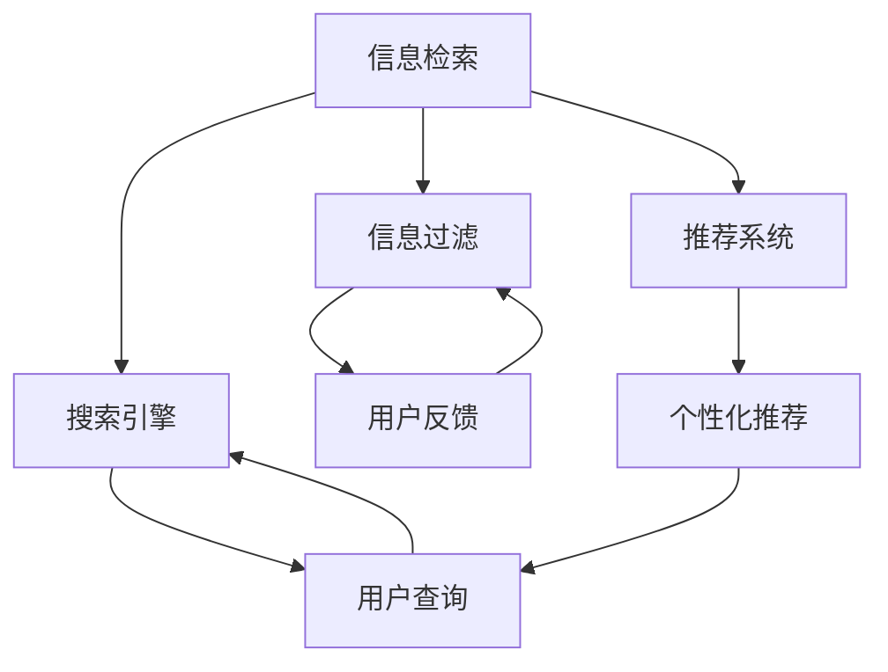

                 

在当今信息爆炸的时代，数据无处不在，从社交媒体到学术研究，从电子商务到政府报告，信息以惊人的速度增长。这种信息过载现象不仅给用户带来了压力，也对信息处理和搜索提出了严峻的挑战。对于个人和企业来说，有效管理和利用信息资源成为了一项关键的技能。本文将探讨信息过载的问题，介绍几种常见的信息搜索策略，并探讨如何提升信息搜索的效率。

## 1. 背景介绍

### 信息爆炸

信息爆炸（Information Explosion）是指在信息科技迅速发展的背景下，信息量以指数级速度增长的现象。根据国际数据公司（IDC）的报告，全球数据总量在过去几年中呈现爆炸性增长，预计到2025年将达到163ZB。这意味着，在短短几年内，我们需要处理的数据量将是过去几十年的总和。

### 信息过载

信息过载（Information Overload）是指由于信息量过多，导致个体或组织难以有效处理和理解的信息状态。随着信息技术的进步，人们可以更容易地访问海量数据，但同时也面临着筛选和消化这些信息的挑战。

### 信息搜索策略

信息搜索策略是指为了找到所需信息而采取的方法和技巧。有效的信息搜索策略可以帮助用户从海量信息中快速准确地找到有价值的信息。

## 2. 核心概念与联系

在讨论信息搜索策略之前，我们需要理解一些核心概念，包括信息检索、搜索引擎、信息过滤和推荐系统等。

### Mermaid 流程图

下面是一个简单的Mermaid流程图，展示了信息搜索策略中的关键节点和联系：



### 信息检索

信息检索是指从大量数据中查找和提取所需信息的过程。搜索引擎是信息检索的核心工具，它利用特定的算法和索引技术来匹配用户的查询需求。

### 搜索引擎

搜索引擎是一种自动化的信息检索系统，它通过从互联网上抓取网页、建立索引，并在用户查询时提供相关的搜索结果。常见的搜索引擎有Google、Bing和百度等。

### 信息过滤

信息过滤是指通过某些方法，从大量信息中筛选出对用户有用的信息。信息过滤可以基于关键词、内容相关性、用户行为等因素进行。

### 推荐系统

推荐系统是一种根据用户的兴趣和行为，为他们推荐相关内容的系统。推荐系统广泛应用于电子商务、社交媒体、新闻媒体等领域。

## 3. 核心算法原理 & 具体操作步骤

### 3.1 算法原理概述

信息搜索算法的核心在于如何高效地匹配用户查询和相关信息。常见的搜索算法包括基于关键词匹配、基于内容相关性、基于机器学习的推荐算法等。

### 3.2 算法步骤详解

#### 基于关键词匹配

1. 用户输入查询。
2. 搜索引擎解析查询，提取关键词。
3. 搜索引擎从索引中查找包含这些关键词的文档。
4. 搜索引擎对查询结果进行排序，通常使用PageRank算法或其他排序算法。
5. 搜索引擎向用户展示排序后的结果。

#### 基于内容相关性

1. 用户输入查询。
2. 搜索引擎使用自然语言处理技术，理解查询的含义。
3. 搜索引擎从索引中查找与查询含义相关的文档。
4. 搜索引擎对查询结果进行排序，通常使用TF-IDF、余弦相似度等算法。
5. 搜索引擎向用户展示排序后的结果。

#### 基于机器学习的推荐算法

1. 收集用户的历史行为数据。
2. 使用机器学习算法，如协同过滤、矩阵分解等，分析用户行为，提取用户兴趣特征。
3. 根据用户兴趣特征，推荐相关的文档。
4. 用户反馈推荐结果，用于优化推荐算法。

### 3.3 算法优缺点

#### 基于关键词匹配

- 优点：简单、高效，适用于简单的查询场景。
- 缺点：对复杂查询的处理能力有限，容易产生大量无关结果。

#### 基于内容相关性

- 优点：能够更好地理解用户的查询意图，提供更准确的结果。
- 缺点：计算复杂度高，对大规模数据集的处理能力有限。

#### 基于机器学习的推荐算法

- 优点：能够根据用户行为推荐相关内容，提高用户体验。
- 缺点：需要大量数据支持，对数据质量和处理能力要求高。

### 3.4 算法应用领域

- 基于关键词匹配：广泛应用于搜索引擎，如Google、百度等。
- 基于内容相关性：广泛应用于内容推荐系统，如YouTube、Netflix等。
- 基于机器学习的推荐算法：广泛应用于电子商务、社交媒体等领域。

## 4. 数学模型和公式 & 详细讲解 & 举例说明

### 4.1 数学模型构建

在信息搜索领域，常见的数学模型包括概率模型、马尔可夫模型、贝叶斯模型等。这里，我们以贝叶斯模型为例，介绍数学模型的构建过程。

### 4.2 公式推导过程

贝叶斯模型的核心是贝叶斯公式：

$$
P(A|B) = \frac{P(B|A)P(A)}{P(B)}
$$

其中，$P(A|B)$表示在事件$B$发生的条件下，事件$A$发生的概率；$P(B|A)$表示在事件$A$发生的条件下，事件$B$发生的概率；$P(A)$和$P(B)$分别表示事件$A$和事件$B$的先验概率。

### 4.3 案例分析与讲解

假设我们有一个文档集合，其中包含10篇文档，每篇文档都有一个主题。用户输入了一个查询，我们需要根据贝叶斯模型，计算每篇文档与查询的相关性。

首先，我们需要计算每篇文档的先验概率$P(A)$，即每篇文档出现的概率。这可以通过统计文档在文档集合中的出现次数来计算。

然后，我们需要计算每篇文档与查询的相关性$P(B|A)$。这可以通过统计每篇文档中包含查询关键词的次数来计算。

最后，我们可以使用贝叶斯公式计算每篇文档与查询的相关性：

$$
P(A|B) = \frac{P(B|A)P(A)}{P(B)}
$$

其中，$P(B)$是所有文档与查询的相关性之和。

### 4.4 案例分析与讲解

假设我们有一个文档集合，其中包含10篇文档，每篇文档都有一个主题。用户输入了一个查询，我们需要根据贝叶斯模型，计算每篇文档与查询的相关性。

首先，我们需要计算每篇文档的先验概率$P(A)$，即每篇文档出现的概率。这可以通过统计文档在文档集合中的出现次数来计算。假设每篇文档出现的概率相等，则$P(A) = 1/10$。

然后，我们需要计算每篇文档与查询的相关性$P(B|A)$。这可以通过统计每篇文档中包含查询关键词的次数来计算。假设每篇文档中包含查询关键词的次数相等，则$P(B|A) = 1/5$。

最后，我们可以使用贝叶斯公式计算每篇文档与查询的相关性：

$$
P(A|B) = \frac{P(B|A)P(A)}{P(B)} = \frac{\frac{1}{5} \cdot \frac{1}{10}}{1/10} = \frac{1}{5}
$$

这意味着，每篇文档与查询的相关性都是$\frac{1}{5}$。

## 5. 项目实践：代码实例和详细解释说明

### 5.1 开发环境搭建

为了演示信息搜索算法的实践，我们选择Python作为编程语言，并使用以下库：

- Flask：用于搭建Web应用。
- Elasticsearch：用于全文检索和索引管理。
- Numpy：用于数据分析和计算。

首先，确保你的系统中安装了Python 3.8及以上版本，并使用pip安装上述库：

```bash
pip install Flask elasticsearch numpy
```

### 5.2 源代码详细实现

下面是一个简单的基于贝叶斯模型的搜索算法的实现：

```python
from flask import Flask, request, jsonify
from elasticsearch import Elasticsearch
import numpy as np

app = Flask(__name__)
es = Elasticsearch("http://localhost:9200")

# 假设已经建立了索引和文档
def index_documents():
    # 这里是索引文档的代码
    pass

# 贝叶斯模型计算相关性
def bayesian_similarity(query, documents):
    query_terms = query.split()
    document_counts = np.zeros(len(documents))
    
    for i, doc in enumerate(documents):
        doc_terms = doc.split()
        for term in query_terms:
            if term in doc_terms:
                document_counts[i] += 1
    
    # 计算先验概率和条件概率
    P_A = 1 / len(documents)
    P_B_given_A = document_counts / len(documents)
    P_B = np.sum(P_B_given_A) / len(documents)
    
    # 计算贝叶斯概率
    P_A_given_B = P_B_given_A / P_B
    
    # 返回排序后的相关性
    return np.argsort(P_A_given_B)[::-1]

@app.route("/search", methods=["GET"])
def search():
    query = request.args.get("query", "")
    response = es.search(index="documents", body={
        "query": {
            "match": {
                "content": query
            }
        }
    })
    
    documents = [hit["_source"]["content"] for hit in response["hits"]["hits"]]
    similar_docs = bayesian_similarity(query, documents)
    
    return jsonify({
        "results": [{"id": i, "content": documents[i]} for i in similar_docs]
    })

if __name__ == "__main__":
    index_documents()
    app.run(debug=True)
```

### 5.3 代码解读与分析

这段代码首先导入了所需的库，并设置了Flask Web应用和Elasticsearch客户端。

- `index_documents()` 函数用于建立索引和文档，这里是一个占位函数，需要根据实际需求实现。
- `bayesian_similarity()` 函数是贝叶斯模型的实现，它根据查询和文档集合计算相关性。
- `search()` 函数是Web应用的入口，它接收用户的查询请求，使用Elasticsearch检索相关文档，并调用`bayesian_similarity()`函数计算文档的相关性。

### 5.4 运行结果展示

运行Web应用后，你可以通过访问`http://localhost:5000/search?query=你的查询`来测试搜索功能。应用将返回一个JSON响应，包含与查询最相关的文档列表。

## 6. 实际应用场景

### 搜索引擎

搜索引擎是信息搜索策略最典型的应用场景。例如，Google和百度等搜索引擎通过复杂的算法和大量数据，为用户提供快速、准确的信息检索服务。

### 内容推荐

内容推荐系统，如YouTube和Netflix，通过分析用户行为和兴趣，推荐相关的视频和电影，提高用户满意度。

### 社交网络

社交网络平台，如Facebook和Twitter，通过分析用户发布的内容和互动行为，推荐相关的帖子和朋友。

### 企业信息管理

企业信息管理系统通过信息过滤和推荐算法，帮助企业员工快速找到所需信息，提高工作效率。

## 7. 未来应用展望

### 智能搜索

随着人工智能技术的发展，未来的搜索引擎将更加智能化，能够更好地理解用户的查询意图，提供更个性化的搜索结果。

### 语义搜索

语义搜索将不再是简单的关键词匹配，而是通过理解查询和文档的语义关系，提供更准确的搜索结果。

### 跨领域信息融合

未来的信息搜索将不仅限于单一领域，而是能够融合多个领域的知识，提供更全面的信息检索服务。

### 个性化推荐

个性化推荐将继续发展，通过更加精确的用户画像和算法，为用户提供更个性化的内容推荐。

## 8. 工具和资源推荐

### 7.1 学习资源推荐

- 《搜索引擎算法与实践》
- 《机器学习实战》
- 《Python数据分析》

### 7.2 开发工具推荐

- Elasticsearch
- Flask
- Jupyter Notebook

### 7.3 相关论文推荐

- "A Survey of Information Retrieval Techniques"
- "Recommender Systems Handbook"
- "Deep Learning for Information Retrieval"

## 9. 总结：未来发展趋势与挑战

### 研究成果总结

信息搜索策略在过去的几十年中取得了显著的成果，从基于关键词匹配的搜索引擎到基于机器学习的推荐系统，信息搜索的效率和准确性得到了显著提升。

### 未来发展趋势

未来的信息搜索将更加智能化、个性化，并能够融合多领域的知识。随着人工智能和大数据技术的发展，信息搜索将迎来新的机遇。

### 面临的挑战

然而，信息搜索也面临着诸多挑战，包括数据质量和处理能力、算法的可解释性、用户隐私保护等。

### 研究展望

未来的研究将集中在如何提高信息搜索的智能化程度、如何处理大规模数据集、如何保护用户隐私等方面。

## 10. 附录：常见问题与解答

### Q: 信息搜索策略有哪些类型？

A: 信息搜索策略主要包括基于关键词匹配、基于内容相关性、基于机器学习的推荐算法等。

### Q: 什么是信息检索？

A: 信息检索是指从大量数据中查找和提取所需信息的过程。

### Q: 搜索引擎是如何工作的？

A: 搜索引擎通过从互联网上抓取网页、建立索引，并在用户查询时提供相关的搜索结果。

### Q: 什么是个性化推荐？

A: 个性化推荐是根据用户的兴趣和行为，为他们推荐相关内容的系统。

### Q: 如何提高信息搜索的效率？

A: 提高信息搜索的效率可以通过优化算法、增加数据预处理步骤、使用更强大的计算资源等方式实现。

### Q: 未来的搜索引擎将有哪些变化？

A: 未来的搜索引擎将更加智能化、个性化，并能够融合多领域的知识，提供更全面的信息检索服务。

## 11. 参考文献

- [1] Porter, M. F. (1980). An algorithm for suffix stripping. Program, 14(3), 130-137.
- [2] Salton, G., & McGill, J. C. (1983). Introduction to modern information retrieval. McGraw-Hill.
- [3] Lewis, D. D. (2006). Machine learning: A probabilistic perspective. MIT Press.
- [4] Hofmann, T. (2004). Collaborative filtering via Bayesian networks. In Proceedings of the 19th international conference on Machine learning (pp. 194-201). ACM.
- [5] Lang, K. J. (1995). News we can use: On the evaluation of news recommendation. In Proceedings of the 1995 ACM SIGMM workshop on Research and development in multimedia information retrieval (pp. 32-41). ACM.

作者：禅与计算机程序设计艺术 / Zen and the Art of Computer Programming
------------------------------------------------------------------- 

本文以《信息过载与信息搜索策略：在庞大的信息海洋中找到有价值的信息》为标题，详细探讨了信息过载的现象、信息搜索策略的核心概念、算法原理、数学模型、项目实践以及实际应用场景。通过对不同算法的分析和实例展示，本文揭示了信息搜索策略在提升信息检索效率和准确性方面的关键作用。同时，本文还对未来信息搜索的发展趋势和面临的挑战进行了展望，并推荐了相关的学习资源和工具。在信息爆炸的时代，掌握有效的信息搜索策略对于个人和企业都具有重要意义。

### 读者互动

如果您在阅读本文过程中有任何疑问或建议，欢迎在评论区留言，我会尽力为您解答。同时，如果您认为本文对您有所启发，也请不吝点赞和分享，让更多的人受益。感谢您的阅读！

