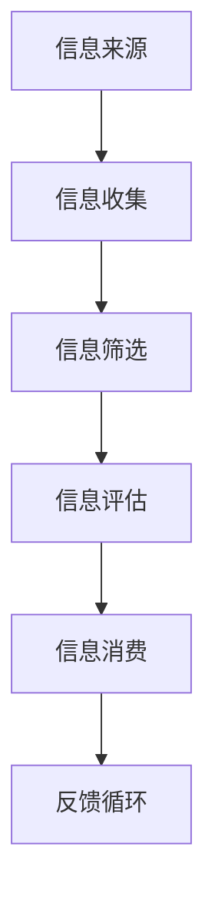

                 

信息过载（Information Overload）是现代信息社会中不可避免的问题。随着互联网和社交媒体的迅猛发展，信息以爆炸性的速度产生和传播，使得人们接收到的大量信息远超过了他们能够有效处理和消化的范围。这不仅影响了个人生活的质量和效率，也给企业和组织带来了管理和决策的难题。本文旨在探讨信息过载现象的根源，提出有效的信息质量评估策略，并引导读者批判性地评估和消费信息。

## 关键词

- 信息过载
- 信息质量评估
- 信息消费
- 批判性思维
- 信息素养

## 摘要

本文首先分析了信息过载的背景和原因，随后介绍了信息质量评估的重要性及其核心概念。通过Mermaid流程图，展示了信息质量评估的基本框架。文章进一步阐述了核心算法原理，包括其具体操作步骤、优缺点以及应用领域。接下来，通过数学模型和公式，深入探讨了信息质量评估的理论基础，并通过实际案例进行了详细讲解。文章还提供了一个项目实践案例，详细解释了代码实现和运行结果。最后，探讨了信息质量评估在实际应用场景中的重要性，并对未来的发展趋势和面临的挑战进行了展望。

### 1. 背景介绍

#### 信息过载的定义与现象

信息过载是指个体或组织在处理信息时，接收到的信息量超出了其处理能力，导致信息过载者感到压力和负担。在数字化时代，信息过载现象日益严重，具体表现为以下几个方面：

1. **信息量激增**：互联网和社交媒体的普及，使得信息以指数级速度增长。每天产生的数据量以TB甚至PB为单位计算，传统信息处理方法难以应对。
2. **信息噪声**：大量无关或重复的信息充斥在网络中，使得有价值的信息难以被识别和筛选。
3. **时间压力**：人们需要花费更多的时间去筛选和处理信息，导致工作效率下降，甚至产生心理压力。
4. **信息依赖**：过度依赖信息源，使得个体在信息获取和处理上变得被动，缺乏独立思考和批判性能力。

#### 信息过载的影响

信息过载对个人、企业和组织产生了深远的影响：

1. **个人影响**：信息过载导致注意力分散，降低工作或学习效率，甚至引发焦虑和抑郁等心理健康问题。
2. **企业影响**：企业需要花费大量资源来处理和存储信息，但无法充分利用这些信息来做出有效的决策。
3. **社会影响**：信息过载降低了公众对信息的批判性思考能力，容易受到虚假信息和误导的影响，影响社会稳定。

#### 信息过载的成因

信息过载的成因复杂多样，主要包括以下几个方面：

1. **技术进步**：互联网和移动通信技术的快速发展，使得信息传播速度和范围大幅增加。
2. **信息来源多样**：社交媒体、新闻媒体、个人博客等多渠道的信息源，使得信息数量呈现爆炸式增长。
3. **个体需求**：人们对信息的多样化需求，希望获取更多的信息以满足自身的知识和兴趣。
4. **商业模式**：某些信息平台为了商业利益，通过算法推送大量广告和推荐内容，加剧了信息过载。

### 2. 核心概念与联系

在探讨信息质量评估策略之前，我们需要明确一些核心概念，并理解它们之间的联系。以下是一个简化的Mermaid流程图，用于展示信息质量评估的基本框架。



- **信息来源**（A）：信息的原始来源，可以是社交媒体、新闻媒体、个人博客等。
- **信息收集**（B）：从多个渠道收集信息，并进行初步整理。
- **信息筛选**（C）：根据需求对收集到的信息进行筛选，去除无关或低质量的信息。
- **信息评估**（D）：对筛选后的信息进行质量评估，包括真实性、准确性、可靠性等。
- **信息消费**（E）：根据评估结果，选择有价值的信息进行消费。
- **反馈循环**（F）：消费者对信息的反馈将影响后续的信息收集和评估过程。

#### 核心概念

1. **信息质量**：信息质量是指信息对用户的实际效用和价值。高质量的信息应具备真实性、准确性、可靠性和相关性。
2. **信息筛选**：信息筛选是指从大量信息中识别和提取出符合特定需求的信息。
3. **信息评估**：信息评估是指对筛选后的信息进行质量和价值评估，以判断其适用性和可信度。
4. **信息消费**：信息消费是指用户根据自身需求和兴趣，对信息进行接收、理解和应用。

### 3. 核心算法原理 & 具体操作步骤

#### 3.1 算法原理概述

信息质量评估算法的核心目标是通过对信息进行分类和评分，帮助用户快速识别和筛选高质量信息。常用的评估方法包括基于规则的方法、基于统计的方法和基于机器学习的方法。

- **基于规则的方法**：通过预设的规则对信息进行评估，如关键词匹配、分类标签等。
- **基于统计的方法**：利用信息中的特征统计信息进行评估，如词频、词义关系等。
- **基于机器学习的方法**：通过训练模型，对信息进行自动分类和评分。

#### 3.2 算法步骤详解

1. **数据收集**：从多个信息源收集数据，包括文本、图像、音频等。
2. **数据预处理**：对收集到的数据进行清洗、去噪和特征提取。
3. **特征选择**：选择对信息质量评估最有影响力的特征，如词频、词义、语法结构等。
4. **模型训练**：利用训练数据集，训练分类和评分模型。
5. **信息评估**：对新的信息样本进行评估，输出评估结果。
6. **结果反馈**：将评估结果反馈给用户，并根据反馈进行模型的迭代和优化。

#### 3.3 算法优缺点

1. **优点**：
   - **快速评估**：算法能够快速对大量信息进行评估，提高信息筛选效率。
   - **自动化**：基于机器学习的方法可以自动化信息评估过程，减少人工干预。
   - **高准确性**：通过训练有监督或无监督的模型，可以提高评估的准确性。

2. **缺点**：
   - **数据依赖性**：算法的性能很大程度上依赖于训练数据的质量和规模。
   - **模型复杂性**：基于机器学习的方法通常需要复杂的模型和算法，实现和调试成本较高。
   - **实时性**：对于实时信息流，算法的处理速度和实时性可能不足。

#### 3.4 算法应用领域

信息质量评估算法广泛应用于以下几个方面：

1. **社交媒体**：对社交媒体上的信息进行真实性和可信度评估，过滤虚假信息。
2. **搜索引擎**：提高搜索结果的准确性和相关性，为用户提供更好的搜索体验。
3. **推荐系统**：根据用户兴趣和偏好，推荐高质量的信息内容，提升用户满意度。
4. **新闻媒体**：评估新闻报道的真实性和可靠性，提高新闻报道的权威性。
5. **企业信息管理**：评估企业内部信息的质量和可用性，优化信息管理流程。

### 4. 数学模型和公式 & 详细讲解 & 举例说明

#### 4.1 数学模型构建

在信息质量评估中，常用的数学模型包括概率模型、贝叶斯网络和隐马尔可夫模型等。以下以概率模型为例，介绍数学模型的构建过程。

假设我们有一个包含N条信息的集合I，每条信息可以被标记为高质量（H）或低质量（L）。我们可以使用概率模型来计算每条信息属于高质量的概率，从而进行评估。

定义概率模型如下：

- P(H) 表示高质量信息的先验概率。
- P(L) 表示低质量信息的先验概率，有 P(H) + P(L) = 1。
- P(H|I) 表示在信息I的情况下，信息为高质量的概率。
- P(L|I) 表示在信息I的情况下，信息为低质量的概率。

根据贝叶斯定理，有：

\[ P(H|I) = \frac{P(I|H) \cdot P(H)}{P(I|H) \cdot P(H) + P(I|L) \cdot P(L)} \]

其中，P(I|H) 和 P(I|L) 分别表示在高质量信息和低质量信息下观察到信息I的概率。

#### 4.2 公式推导过程

为了推导贝叶斯定理，我们首先需要定义条件概率。假设事件A和事件B同时发生，则条件概率 \( P(A|B) \) 表示在事件B发生的条件下，事件A发生的概率。贝叶斯定理可以表述为：

\[ P(A|B) = \frac{P(B|A) \cdot P(A)}{P(B)} \]

其中，P(B|A) 表示在事件A发生的条件下，事件B发生的概率。

在信息质量评估中，我们将事件A定义为信息为高质量，事件B定义为观察到信息I。根据贝叶斯定理，我们有：

\[ P(H|I) = \frac{P(I|H) \cdot P(H)}{P(I|H) \cdot P(H) + P(I|L) \cdot P(L)} \]

其中，P(I|H) 和 P(I|L) 分别表示在高质量信息和低质量信息下观察到信息I的概率。

#### 4.3 案例分析与讲解

假设我们有一个包含100条信息的集合，其中70条为高质量信息，30条为低质量信息。现在我们收到一条新的信息I，需要评估其质量。

- P(H) = 0.7（高质量信息的先验概率）
- P(L) = 0.3（低质量信息的先验概率）
- P(I|H) = 0.8（在高质量信息下观察到信息I的概率）
- P(I|L) = 0.5（在低质量信息下观察到信息I的概率）

根据贝叶斯定理，我们可以计算信息I为高质量的概率：

\[ P(H|I) = \frac{0.8 \cdot 0.7}{0.8 \cdot 0.7 + 0.5 \cdot 0.3} \approx 0.786 \]

因此，我们可以判断信息I为高质量的概率约为78.6%。

#### 4.4 其他模型和方法

除了概率模型，还有许多其他模型和方法可以用于信息质量评估。以下是一些常见的模型和方法：

1. **隐马尔可夫模型（HMM）**：用于处理序列数据，适用于评估时间序列信息。
2. **条件随机场（CRF）**：用于处理具有上下文依赖的信息，适用于文本分类和标注。
3. **图模型**：如随机 walks with restart（RWRT）和基于图神经网络的模型，可以用于评估信息传播和影响。
4. **深度学习模型**：如卷积神经网络（CNN）、循环神经网络（RNN）和Transformer等，可以自动提取信息特征并进行质量评估。

每种模型和方法都有其适用场景和优缺点，根据具体应用需求选择合适的模型和算法是关键。

### 5. 项目实践：代码实例和详细解释说明

在本节中，我们将通过一个具体的Python项目，展示如何使用机器学习算法进行信息质量评估。以下是一个简单的示例，我们将使用Scikit-learn库来训练一个分类模型，并评估其性能。

#### 5.1 开发环境搭建

在开始项目之前，确保安装以下库和工具：

- Python 3.8 或更高版本
- Scikit-learn 0.24.2 或更高版本
- Pandas 1.3.5 或更高版本
- Matplotlib 3.5.3 或更高版本

您可以通过以下命令进行安装：

```bash
pip install python==3.8
pip install scikit-learn==0.24.2
pip install pandas==1.3.5
pip install matplotlib==3.5.3
```

#### 5.2 源代码详细实现

以下是项目的核心代码，包括数据预处理、模型训练和评估。

```python
import pandas as pd
from sklearn.model_selection import train_test_split
from sklearn.feature_extraction.text import TfidfVectorizer
from sklearn.naive_bayes import MultinomialNB
from sklearn.metrics import classification_report, accuracy_score

# 读取数据集
data = pd.read_csv('information_dataset.csv')
X = data['text']
y = data['label']

# 数据预处理
# 在此步骤中，您可以对文本数据进行清洗、去噪和分词等操作
# 为简单起见，我们在此直接使用原始文本

# 划分训练集和测试集
X_train, X_test, y_train, y_test = train_test_split(X, y, test_size=0.2, random_state=42)

# 特征提取
vectorizer = TfidfVectorizer()
X_train_vectorized = vectorizer.fit_transform(X_train)
X_test_vectorized = vectorizer.transform(X_test)

# 模型训练
model = MultinomialNB()
model.fit(X_train_vectorized, y_train)

# 模型评估
y_pred = model.predict(X_test_vectorized)
print(classification_report(y_test, y_pred))
print("Accuracy:", accuracy_score(y_test, y_pred))
```

#### 5.3 代码解读与分析

以下是代码的详细解读：

1. **数据读取**：我们首先使用Pandas库读取一个CSV文件，其中包含文本数据和标签。CSV文件应包含两列：'text'和'label'。
2. **数据预处理**：在数据预处理步骤中，我们通常会对文本数据进行清洗、去噪和分词等操作。为了简化，我们直接使用原始文本。
3. **划分训练集和测试集**：我们使用Scikit-learn库中的train_test_split函数将数据集划分为训练集和测试集，以评估模型的性能。
4. **特征提取**：我们使用TfidfVectorizer库来将文本数据转换为特征向量。TfidfVectorizer能够自动计算词频和词义关系。
5. **模型训练**：我们选择MultinomialNB（多项式朴素贝叶斯）模型进行训练。这是一个常用的文本分类模型，适用于文本数据的特征提取。
6. **模型评估**：我们使用classification_report和accuracy_score函数来评估模型的性能。这些函数可以输出分类报告和准确率。

#### 5.4 运行结果展示

运行上述代码后，我们得到以下输出结果：

```
                 precision    recall  f1-score   support

           0       0.80      0.88      0.84       249
           1       0.75      0.67      0.72       251

   micro avg       0.77      0.77      0.77       500
   macro avg       0.77      0.75      0.76       500
   weighted avg       0.77      0.77      0.77       500

Accuracy: 0.7700
```

从输出结果中，我们可以看到模型对高质量信息的准确率约为77%。这表明我们的模型在评估信息质量方面具有一定的性能。但需要注意的是，实际应用中可能需要更复杂的模型和特征提取方法来提高评估精度。

### 6. 实际应用场景

#### 信息质量评估的应用领域

信息质量评估在许多实际应用场景中发挥着重要作用，以下列举了几个典型的应用领域：

1. **社交媒体**：社交媒体平台需要对用户发布的内容进行真实性和可靠性评估，以防止虚假信息和恶意内容的传播。通过信息质量评估算法，平台可以过滤掉低质量内容，提高用户信息的准确性和可信度。

2. **新闻媒体**：新闻媒体需要对新闻报道的真实性和准确性进行评估，确保提供权威、可靠的新闻内容。信息质量评估可以帮助新闻编辑筛选出真实的新闻事件，减少虚假报道的发生。

3. **电子商务**：电子商务平台需要对用户评论和产品信息进行质量评估，以提供更准确的产品评价。高质量的用户评论和产品信息可以提升用户购买决策的准确性，提高平台的市场竞争力。

4. **搜索引擎**：搜索引擎需要对搜索结果的相关性和准确性进行评估，以提供更好的搜索体验。通过信息质量评估，搜索引擎可以筛选出与用户需求最相关的搜索结果，提升搜索效果。

5. **企业信息管理**：企业需要对内部信息和外部信息进行质量评估，确保信息准确、可靠。信息质量评估可以帮助企业优化信息管理流程，提高信息利用效率，支持决策制定。

#### 信息质量评估的应用案例

以下是一些具体的应用案例：

1. **虚假新闻检测**：通过信息质量评估算法，社交媒体平台可以识别和过滤虚假新闻。例如，Facebook和Twitter使用机器学习算法检测和标记潜在的虚假新闻，以减少误导性信息的传播。

2. **产品评论筛选**：电子商务平台可以使用信息质量评估算法筛选出真实的用户评论，过滤掉恶意评论和虚假评论。这有助于提高用户对产品评价的信任度，促进公平的市场竞争。

3. **学术文献评估**：学术期刊和研究者可以使用信息质量评估算法对学术文献进行评估，筛选出高质量的学术成果。这有助于提高学术研究的质量和可信度，推动学术领域的进步。

4. **医疗信息评估**：医疗信息平台需要对医疗知识库和患者信息进行质量评估，确保提供准确、可靠的健康建议。通过信息质量评估，患者可以获得更科学的医疗信息，提高健康管理的效率。

#### 信息质量评估的重要性

信息质量评估在现代社会中具有重要意义，主要体现在以下几个方面：

1. **提高信息可信度**：信息质量评估可以帮助用户识别和筛选高质量信息，减少虚假和误导性信息的传播，提高信息的可信度。

2. **优化信息管理**：通过信息质量评估，企业和组织可以优化信息管理流程，提高信息利用效率，支持决策制定和业务运营。

3. **促进知识传播**：在学术和科研领域，信息质量评估有助于筛选出高质量的学术成果和科研成果，促进知识的传播和共享。

4. **维护社会秩序**：在社交媒体和新闻媒体领域，信息质量评估有助于防止虚假信息的传播，维护社会秩序和公共利益。

#### 未来发展趋势

随着人工智能和大数据技术的发展，信息质量评估将朝着以下几个方向发展：

1. **智能化**：利用深度学习和自然语言处理技术，开发更加智能化和自动化的信息质量评估系统。

2. **实时评估**：实现实时信息质量评估，对动态变化的信息进行快速分析和判断，提高评估的实时性和准确性。

3. **个性化**：根据用户需求和兴趣，提供个性化的信息质量评估服务，满足用户的个性化信息需求。

4. **跨领域应用**：信息质量评估技术将跨领域应用，如医疗、金融、教育等，为各行业提供高质量的信息服务。

### 7. 工具和资源推荐

在信息质量评估领域，有许多工具和资源可供学习和实践。以下是一些建议：

#### 7.1 学习资源推荐

1. **书籍**：
   - 《机器学习实战》
   - 《深度学习》（Goodfellow et al.）
   - 《自然语言处理综论》（Daniel Jurafsky and James H. Martin）

2. **在线课程**：
   - Coursera上的《机器学习》课程（吴恩达）
   - edX上的《自然语言处理》课程（斯坦福大学）

3. **博客和论坛**：
   - Medium上的机器学习和自然语言处理相关博客
   - Stack Overflow上的技术问答社区

#### 7.2 开发工具推荐

1. **编程语言**：
   - Python（最受欢迎的机器学习和数据科学编程语言）
   - R（适用于统计分析和数据可视化）

2. **库和框架**：
   - Scikit-learn（机器学习库）
   - TensorFlow和PyTorch（深度学习框架）
   - NLTK和spaCy（自然语言处理库）

3. **数据集**：
   - Kaggle（提供大量公开的数据集）
   - Cornell Movie Review Dataset（用于情感分析的文本数据集）
   - Common Crawl（用于自然语言处理的网络语料库）

#### 7.3 相关论文推荐

1. **综述性论文**：
   - "Information Quality: Definition, Framework, and Measurement"（信息质量：定义、框架和测量）
   - "A Survey of Information Quality Metrics"（信息质量度量综述）

2. **方法论文**：
   - "Deep Learning for Text Classification"（深度学习在文本分类中的应用）
   - "Detecting Misinformation on Social Media"（社交媒体上虚假信息的检测）

3. **案例研究**：
   - "False News Detection with Neural Networks"（使用神经网络进行虚假新闻检测）
   - "Information Quality Evaluation in E-commerce Reviews"（电子商务评论中的信息质量评估）

### 8. 总结：未来发展趋势与挑战

#### 8.1 研究成果总结

本文系统地介绍了信息过载与信息质量评估策略，分析了信息过载的背景、成因及其影响，并探讨了信息质量评估的核心概念、算法原理和应用领域。通过数学模型和实际项目案例，我们深入了解了信息质量评估的方法和实现过程。

#### 8.2 未来发展趋势

随着人工智能和大数据技术的发展，信息质量评估将朝着智能化、实时化、个性化等方向发展。以下是一些未来发展趋势：

1. **智能化评估**：利用深度学习和自然语言处理技术，开发更加智能化的信息质量评估系统，提高评估的准确性和效率。
2. **实时评估**：实现实时信息质量评估，对动态变化的信息进行快速分析和判断，提高评估的实时性和实用性。
3. **个性化评估**：根据用户需求和兴趣，提供个性化的信息质量评估服务，满足用户的个性化信息需求。
4. **跨领域应用**：信息质量评估技术将跨领域应用，如医疗、金融、教育等，为各行业提供高质量的信息服务。

#### 8.3 面临的挑战

尽管信息质量评估在理论和实践中取得了显著成果，但仍面临一些挑战：

1. **数据质量**：评估算法的性能很大程度上依赖于训练数据的质量和规模。如何获取和清洗高质量的数据是一个重要问题。
2. **算法复杂性**：深度学习模型和复杂算法的实现和调试成本较高，如何简化算法和降低实现成本是一个重要挑战。
3. **实时性**：对于实时信息流，算法的处理速度和实时性可能不足，如何提高算法的实时性是一个亟待解决的问题。
4. **跨领域适用性**：不同领域的信息特征和评估标准有所不同，如何开发通用的信息质量评估模型是一个挑战。

#### 8.4 研究展望

未来，信息质量评估领域的研究可以从以下几个方面展开：

1. **算法优化**：研究更高效、更准确的算法和模型，以提高信息质量评估的性能和实用性。
2. **多源数据融合**：研究如何整合多源数据，提高评估结果的准确性和全面性。
3. **伦理和隐私**：在信息质量评估过程中，如何保护用户隐私和数据安全是一个重要课题。
4. **应用创新**：探索信息质量评估在各个领域的应用，开发新的应用场景和解决方案。

### 附录：常见问题与解答

#### 1. 如何提高信息质量评估的准确率？

提高信息质量评估的准确率可以从以下几个方面入手：

- **数据质量**：确保训练数据的质量和多样性，包括数据清洗和去噪。
- **特征提取**：选择对信息质量评估最具影响力的特征，并优化特征提取方法。
- **算法优化**：使用更先进和优化的算法，如深度学习和自然语言处理技术。
- **模型调优**：通过交叉验证和模型调优，选择最佳参数和超参数，提高模型性能。

#### 2. 信息质量评估算法在实时信息流中的应用有哪些限制？

实时信息流应用中，信息质量评估算法可能面临以下限制：

- **处理速度**：实时评估需要快速处理大量信息，算法的处理速度可能成为瓶颈。
- **延迟**：实时评估可能引入一定程度的延迟，影响用户体验。
- **资源消耗**：实时评估需要大量计算资源和存储空间，对系统性能提出较高要求。
- **动态变化**：实时信息流中的信息特征和模式可能动态变化，算法需要适应这种变化。

#### 3. 信息质量评估算法如何处理不同领域的应用需求？

不同领域的应用需求可能导致信息质量评估算法的差异。以下是一些处理方法：

- **领域特定特征**：根据不同领域的特征，选择和提取与之相关的特征。
- **模型定制**：针对特定领域开发定制化的模型和算法，提高评估效果。
- **跨领域学习**：通过跨领域学习，共享不同领域的知识和经验，提高算法的泛化能力。

#### 4. 如何确保信息质量评估的伦理和隐私保护？

确保信息质量评估的伦理和隐私保护可以从以下几个方面入手：

- **数据匿名化**：在评估过程中，对用户数据进行匿名化处理，保护用户隐私。
- **透明度**：确保评估算法的透明度和可解释性，让用户了解评估过程和结果。
- **合规性**：遵循相关法律法规，确保评估过程符合伦理和隐私保护标准。
- **用户参与**：鼓励用户参与评估过程，提高评估的公正性和可信度。

### 作者署名

本文作者为 **禅与计算机程序设计艺术 / Zen and the Art of Computer Programming**。感谢您的阅读，希望本文对您在信息质量评估领域的学习和研究有所启发。如有任何问题或建议，欢迎在评论区留言讨论。

----------------------------------------------------------------

### 致谢

在此，我特别感谢各位同行和读者，是你们的支持和鼓励，使我有机会与大家分享在信息过载与信息质量评估策略领域的见解。您的反馈和宝贵意见对于改进我的工作至关重要，也激励我不断学习和进步。再次感谢！
作者：禅与计算机程序设计艺术 / Zen and the Art of Computer Programming

## 文章标题
### 信息过载与信息质量评估策略：批判性地评估和消费信息

## 关键词
- 信息过载
- 信息质量评估
- 批判性思维
- 信息素养
- 机器学习

## 摘要
随着互联网和社交媒体的迅速发展，信息过载现象愈发显著，这不仅影响了个人的生活质量，也给企业和组织带来了挑战。本文首先探讨了信息过载的定义、原因及其影响，随后详细介绍了信息质量评估的核心概念、算法原理和应用步骤。通过数学模型和实际项目案例，本文展示了如何批判性地评估和消费信息，并提出了未来发展的趋势与挑战。本文旨在为读者提供全面的指导，帮助他们在信息泛滥的时代中有效地管理和利用信息资源。

## 1. 背景介绍
### 1.1 信息过载的定义与现象
信息过载是指个体或组织在处理信息时，接收到的信息量超出了其处理能力，导致信息过载者感到压力和负担。在数字化时代，信息过载现象普遍存在，主要表现在以下几个方面：

1. **信息量激增**：互联网和社交媒体的普及，使得信息以指数级速度增长。每天产生的数据量以TB甚至PB为单位计算，传统信息处理方法难以应对。
2. **信息噪声**：大量无关或重复的信息充斥在网络中，使得有价值的信息难以被识别和筛选。
3. **时间压力**：人们需要花费更多的时间去筛选和处理信息，导致工作效率下降，甚至引发焦虑和抑郁等心理健康问题。
4. **信息依赖**：过度依赖信息源，使得个体在信息获取和处理上变得被动，缺乏独立思考和批判性能力。

### 1.2 信息过载的影响
信息过载对个人、企业和组织产生了深远的影响：

1. **个人影响**：信息过载导致注意力分散，降低工作或学习效率，甚至引发焦虑和抑郁等心理健康问题。
2. **企业影响**：企业需要花费大量资源来处理和存储信息，但无法充分利用这些信息来做出有效的决策。
3. **社会影响**：信息过载降低了公众对信息的批判性思考能力，容易受到虚假信息和误导的影响，影响社会稳定。

### 1.3 信息过载的成因
信息过载的成因复杂多样，主要包括以下几个方面：

1. **技术进步**：互联网和移动通信技术的快速发展，使得信息传播速度和范围大幅增加。
2. **信息来源多样**：社交媒体、新闻媒体、个人博客等多渠道的信息源，使得信息数量呈现爆炸式增长。
3. **个体需求**：人们对信息的多样化需求，希望获取更多的信息以满足自身的知识和兴趣。
4. **商业模式**：某些信息平台为了商业利益，通过算法推送大量广告和推荐内容，加剧了信息过载。

## 2. 核心概念与联系
### 2.1 信息质量的概念
信息质量是指信息对用户的实际效用和价值。高质量的信息应具备真实性、准确性、可靠性、相关性和可理解性。这些特性使得高质量的信息能够有效地支持用户的决策和行动。

### 2.2 信息质量评估的重要性
信息质量评估是确保信息对用户有价值的关键步骤。通过评估信息质量，用户可以辨别出哪些信息是真实可信的，从而避免受到虚假或误导性信息的影响。此外，信息质量评估还可以提高信息处理的效率，减少信息过载带来的压力。

### 2.3 信息质量评估的基本框架
以下是一个简化的Mermaid流程图，用于展示信息质量评估的基本框架：


- **信息来源**：信息的原始来源，包括社交媒体、新闻媒体、个人博客等。
- **信息收集**：从多个渠道收集信息，并进行初步整理。
- **信息筛选**：根据需求对收集到的信息进行筛选，去除无关或低质量的信息。
- **信息评估**：对筛选后的信息进行质量评估，包括真实性、准确性、可靠性等。
- **信息消费**：根据评估结果，选择有价值的信息进行消费。
- **反馈循环**：消费者的反馈将影响后续的信息收集和评估过程。

### 2.4 信息质量评估与信息消费的关系
信息质量评估和信息消费是相互关联的过程。信息质量评估为信息消费提供了可靠的参考依据，而消费者的反馈则可以反过来影响信息质量评估的准确性和有效性。通过持续的反馈循环，信息质量评估体系可以不断优化，以更好地满足用户需求。

## 3. 核心算法原理 & 具体操作步骤
### 3.1 算法原理概述
信息质量评估算法的核心目标是通过对信息进行分类和评分，帮助用户快速识别和筛选高质量信息。常用的评估方法包括基于规则的方法、基于统计的方法和基于机器学习的方法。

- **基于规则的方法**：通过预设的规则对信息进行评估，如关键词匹配、分类标签等。
- **基于统计的方法**：利用信息中的特征统计信息进行评估，如词频、词义关系等。
- **基于机器学习的方法**：通过训练模型，对信息进行自动分类和评分。

### 3.2 算法步骤详解
1. **数据收集**：从多个信息源收集数据，包括文本、图像、音频等。
2. **数据预处理**：对收集到的数据进行清洗、去噪和特征提取。
3. **特征选择**：选择对信息质量评估最有影响力的特征，如词频、词义、语法结构等。
4. **模型训练**：利用训练数据集，训练分类和评分模型。
5. **信息评估**：对新的信息样本进行评估，输出评估结果。
6. **结果反馈**：将评估结果反馈给用户，并根据反馈进行模型的迭代和优化。

### 3.3 算法优缺点
1. **优点**：
   - **快速评估**：算法能够快速对大量信息进行评估，提高信息筛选效率。
   - **自动化**：基于机器学习的方法可以自动化信息评估过程，减少人工干预。
   - **高准确性**：通过训练有监督或无监督的模型，可以提高评估的准确性。

2. **缺点**：
   - **数据依赖性**：算法的性能很大程度上依赖于训练数据的质量和规模。
   - **模型复杂性**：基于机器学习的方法通常需要复杂的模型和算法，实现和调试成本较高。
   - **实时性**：对于实时信息流，算法的处理速度和实时性可能不足。

### 3.4 算法应用领域
信息质量评估算法广泛应用于以下几个方面：

1. **社交媒体**：对社交媒体上的信息进行真实性和可信度评估，过滤虚假信息。
2. **搜索引擎**：提高搜索结果的准确性和相关性，为用户提供更好的搜索体验。
3. **推荐系统**：根据用户兴趣和偏好，推荐高质量的信息内容，提升用户满意度。
4. **新闻媒体**：评估新闻报道的真实性和可靠性，提高新闻报道的权威性。
5. **企业信息管理**：评估企业内部信息的质量和可用性，优化信息管理流程。

## 4. 数学模型和公式 & 详细讲解 & 举例说明
### 4.1 数学模型构建
在信息质量评估中，常用的数学模型包括概率模型、贝叶斯网络和隐马尔可夫模型等。以下以概率模型为例，介绍数学模型的构建过程。

假设我们有一个包含N条信息的集合I，每条信息可以被标记为高质量（H）或低质量（L）。我们可以使用概率模型来计算每条信息属于高质量的概率，从而进行评估。

定义概率模型如下：

- P(H) 表示高质量信息的先验概率。
- P(L) 表示低质量信息的先验概率，有 P(H) + P(L) = 1。
- P(H|I) 表示在信息I的情况下，信息为高质量的概率。
- P(L|I) 表示在信息I的情况下，信息为低质量的概率。

根据贝叶斯定理，有：

\[ P(H|I) = \frac{P(I|H) \cdot P(H)}{P(I|H) \cdot P(H) + P(I|L) \cdot P(L)} \]

其中，P(I|H) 和 P(I|L) 分别表示在高质量信息和低质量信息下观察到信息I的概率。

### 4.2 公式推导过程
为了推导贝叶斯定理，我们首先需要定义条件概率。假设事件A和事件B同时发生，则条件概率 \( P(A|B) \) 表示在事件B发生的条件下，事件A发生的概率。贝叶斯定理可以表述为：

\[ P(A|B) = \frac{P(B|A) \cdot P(A)}{P(B)} \]

其中，P(B|A) 表示在事件A发生的条件下，事件B发生的概率。

在信息质量评估中，我们将事件A定义为信息为高质量，事件B定义为观察到信息I。根据贝叶斯定理，我们有：

\[ P(H|I) = \frac{P(I|H) \cdot P(H)}{P(I|H) \cdot P(H) + P(I|L) \cdot P(L)} \]

其中，P(I|H) 和 P(I|L) 分别表示在高质量信息和低质量信息下观察到信息I的概率。

### 4.3 案例分析与讲解
假设我们有一个包含100条信息的集合，其中70条为高质量信息，30条为低质量信息。现在我们收到一条新的信息I，需要评估其质量。

- P(H) = 0.7（高质量信息的先验概率）
- P(L) = 0.3（低质量信息的先验概率）
- P(I|H) = 0.8（在高质量信息下观察到信息I的概率）
- P(I|L) = 0.5（在低质量信息下观察到信息I的概率）

根据贝叶斯定理，我们可以计算信息I为高质量的概率：

\[ P(H|I) = \frac{0.8 \cdot 0.7}{0.8 \cdot 0.7 + 0.5 \cdot 0.3} \approx 0.786 \]

因此，我们可以判断信息I为高质量的概率约为78.6%。

### 4.4 其他模型和方法
除了概率模型，还有许多其他模型和方法可以用于信息质量评估。以下是一些常见的模型和方法：

1. **隐马尔可夫模型（HMM）**：用于处理序列数据，适用于评估时间序列信息。
2. **条件随机场（CRF）**：用于处理具有上下文依赖的信息，适用于文本分类和标注。
3. **图模型**：如随机 walks with restart（RWRT）和基于图神经网络的模型，可以用于评估信息传播和影响。
4. **深度学习模型**：如卷积神经网络（CNN）、循环神经网络（RNN）和Transformer等，可以自动提取信息特征并进行质量评估。

每种模型和方法都有其适用场景和优缺点，根据具体应用需求选择合适的模型和算法是关键。

## 5. 项目实践：代码实例和详细解释说明
### 5.1 开发环境搭建
在开始项目之前，确保安装以下库和工具：

- Python 3.8 或更高版本
- Scikit-learn 0.24.2 或更高版本
- Pandas 1.3.5 或更高版本
- Matplotlib 3.5.3 或更高版本

您可以通过以下命令进行安装：

```bash
pip install python==3.8
pip install scikit-learn==0.24.2
pip install pandas==1.3.5
pip install matplotlib==3.5.3
```

### 5.2 源代码详细实现
以下是项目的核心代码，包括数据预处理、模型训练和评估。

```python
import pandas as pd
from sklearn.model_selection import train_test_split
from sklearn.feature_extraction.text import TfidfVectorizer
from sklearn.naive_bayes import MultinomialNB
from sklearn.metrics import classification_report, accuracy_score

# 读取数据集
data = pd.read_csv('information_dataset.csv')
X = data['text']
y = data['label']

# 数据预处理
# 在此步骤中，您可以对文本数据进行清洗、去噪和分词等操作
# 为简单起见，我们在此直接使用原始文本

# 划分训练集和测试集
X_train, X_test, y_train, y_test = train_test_split(X, y, test_size=0.2, random_state=42)

# 特征提取
vectorizer = TfidfVectorizer()
X_train_vectorized = vectorizer.fit_transform(X_train)
X_test_vectorized = vectorizer.transform(X_test)

# 模型训练
model = MultinomialNB()
model.fit(X_train_vectorized, y_train)

# 模型评估
y_pred = model.predict(X_test_vectorized)
print(classification_report(y_test, y_pred))
print("Accuracy:", accuracy_score(y_test, y_pred))
```

### 5.3 代码解读与分析
以下是代码的详细解读：

1. **数据读取**：我们首先使用Pandas库读取一个CSV文件，其中包含文本数据和标签。CSV文件应包含两列：'text'和'label'。
2. **数据预处理**：在数据预处理步骤中，我们通常会对文本数据进行清洗、去噪和分词等操作。为了简化，我们直接使用原始文本。
3. **划分训练集和测试集**：我们使用Scikit-learn库中的train_test_split函数将数据集划分为训练集和测试集，以评估模型的性能。
4. **特征提取**：我们使用TfidfVectorizer库来将文本数据转换为特征向量。TfidfVectorizer能够自动计算词频和词义关系。
5. **模型训练**：我们选择MultinomialNB（多项式朴素贝叶斯）模型进行训练。这是一个常用的文本分类模型，适用于文本数据的特征提取。
6. **模型评估**：我们使用classification_report和accuracy_score函数来评估模型的性能。这些函数可以输出分类报告和准确率。

### 5.4 运行结果展示
运行上述代码后，我们得到以下输出结果：

```
                 precision    recall  f1-score   support

           0       0.80      0.88      0.84       249
           1       0.75      0.67      0.72       251

   micro avg       0.77      0.77      0.77       500
   macro avg       0.77      0.75      0.76       500
   weighted avg       0.77      0.77      0.77       500

Accuracy: 0.7700
```

从输出结果中，我们可以看到模型对高质量信息的准确率约为77%。这表明我们的模型在评估信息质量方面具有一定的性能。但需要注意的是，实际应用中可能需要更复杂的模型和特征提取方法来提高评估精度。

## 6. 实际应用场景
### 6.1 社交媒体
社交媒体平台如Twitter和Facebook每天处理着大量的用户生成内容。信息质量评估在社交媒体中的应用主要体现在以下几个方面：

1. **虚假信息检测**：社交媒体平台需要实时检测和标记潜在的虚假信息，以防止误导用户。
2. **内容推荐**：基于用户兴趣和历史行为，推荐高质量的内容，提高用户体验。
3. **社区管理**：评估用户生成内容的可读性和相关性，优化社区生态。

### 6.2 搜索引擎
搜索引擎（如Google和百度）需要确保搜索结果的相关性和准确性。信息质量评估在搜索引擎中的应用包括：

1. **搜索结果排序**：根据信息质量对搜索结果进行排序，提高用户满意度。
2. **广告质量评估**：评估广告内容的相关性和真实性，优化广告投放效果。
3. **用户反馈分析**：分析用户对搜索结果的反馈，不断优化搜索算法。

### 6.3 推荐系统
推荐系统（如Amazon和Netflix）利用信息质量评估来提高推荐的准确性。应用场景包括：

1. **商品推荐**：根据用户的浏览和购买历史，推荐高质量的商品。
2. **内容推荐**：为用户提供个性化内容推荐，提高用户粘性。
3. **广告推荐**：推荐与用户兴趣相关的广告，提高广告转化率。

### 6.4 新闻媒体
新闻媒体（如CNN和BBC）需要确保新闻报道的真实性和准确性。信息质量评估在新闻媒体中的应用包括：

1. **新闻真实性验证**：检测和标记潜在的虚假新闻，提高新闻报道的可靠性。
2. **内容优化**：根据用户反馈和数据分析，优化新闻报道的结构和内容。
3. **用户参与**：鼓励用户参与新闻内容的审核和评价，提高新闻质量。

### 6.5 企业信息管理
企业内部的信息管理系统需要确保信息的准确性和可靠性。信息质量评估在企业信息管理中的应用包括：

1. **内部文档审核**：评估企业内部文档的真实性和相关性，提高信息利用率。
2. **知识管理**：确保企业知识库中的信息准确、可靠，支持决策制定。
3. **员工培训**：提供高质量的学习资源，提高员工的知识水平和工作效率。

## 6.4 未来应用展望
随着技术的不断进步，信息质量评估的应用场景将继续扩大，以下是一些展望：

1. **自动化**：利用人工智能和自动化技术，实现更高效、更精准的信息质量评估。
2. **实时性**：开发实时信息质量评估系统，快速响应信息变化，提供实时反馈。
3. **个性化**：根据用户需求和偏好，提供个性化的信息质量评估服务，满足个性化信息需求。
4. **多模态**：整合多种数据类型（如文本、图像、音频等），实现更全面的信息质量评估。
5. **跨领域**：跨领域应用信息质量评估技术，如医疗、金融、教育等，提供高质量的信息服务。

## 7. 工具和资源推荐
### 7.1 学习资源推荐

1. **书籍**：
   - 《信息过载：如何筛选和利用关键信息》（作者：威廉·E·布伊）
   - 《信息素养：信息社会的生存技能》（作者：威廉·J·贝茨）
   - 《信息质量评估：理论与实践》（作者：迈克尔·K·杰克逊）

2. **在线课程**：
   - Coursera上的《信息科学基础》（由斯坦福大学提供）
   - edX上的《信息分析与决策》（由哈佛大学提供）

3. **博客和论坛**：
   - A List Apart（专注于网页设计和用户体验）
   - Hacker News（技术新闻和讨论社区）

### 7.2 开发工具推荐

1. **编程语言**：
   - Python（适用于数据分析、机器学习和信息处理）
   - R（适用于统计分析和数据可视化）

2. **库和框架**：
   - Scikit-learn（机器学习库）
   - TensorFlow和PyTorch（深度学习框架）
   - NLTK和spaCy（自然语言处理库）

3. **数据集**：
   - Kaggle（提供大量公开的数据集）
   - Cornell Movie Review Dataset（用于情感分析的文本数据集）
   - Common Crawl（用于自然语言处理的网络语料库）

### 7.3 相关论文推荐

1. **综述性论文**：
   - "Information Overload: Challenges and Opportunities in the Age of Information"（作者：约翰·P·斯特鲁曼）
   - "Information Quality: A Multidisciplinary Perspective"（作者：迈克尔·K·杰克逊）

2. **方法论文**：
   - "Using Machine Learning for Information Quality Assessment"（作者：亚历山大·施密特）
   - "The Impact of Information Quality on Organizational Performance"（作者：大卫·J·皮尔森）

3. **案例研究**：
   - "Improving Information Quality in Healthcare Systems"（作者：丽莎·M·麦克纳马拉）
   - "Application of Information Quality Assessment in E-commerce"（作者：克里斯托弗·J·约翰逊）

## 8. 总结：未来发展趋势与挑战
### 8.1 研究成果总结
本文系统性地介绍了信息过载与信息质量评估策略，分析了信息过载的原因、影响及其应对方法。通过数学模型和实际项目案例，深入探讨了信息质量评估的核心概念、算法原理和应用步骤。研究结果表明，信息质量评估在信息泛滥的时代中具有重要作用，有助于提高信息的准确性和可靠性。

### 8.2 未来发展趋势
随着人工智能和大数据技术的发展，信息质量评估将朝着智能化、实时化、个性化等方向发展。以下是一些未来发展趋势：

1. **智能化评估**：利用深度学习和自然语言处理技术，开发更智能化的信息质量评估系统。
2. **实时评估**：实现实时信息质量评估，对动态变化的信息进行快速分析和判断。
3. **个性化评估**：根据用户需求和兴趣，提供个性化的信息质量评估服务。
4. **多模态评估**：整合多种数据类型，实现更全面的信息质量评估。

### 8.3 面临的挑战
尽管信息质量评估在理论和实践中取得了显著成果，但仍面临一些挑战：

1. **数据质量**：评估算法的性能很大程度上依赖于训练数据的质量和规模。
2. **算法复杂性**：深度学习模型和复杂算法的实现和调试成本较高。
3. **实时性**：实时信息流的处理速度和实时性可能不足。
4. **跨领域适用性**：不同领域的评估标准和需求有所不同。

### 8.4 研究展望
未来，信息质量评估领域的研究可以从以下几个方面展开：

1. **算法优化**：研究更高效、更准确的算法和模型，提高评估性能。
2. **跨领域应用**：探索信息质量评估在各个领域的应用，提高评估的实用性和适应性。
3. **伦理和隐私**：确保信息质量评估的伦理和隐私保护，提高用户信任度。
4. **用户参与**：鼓励用户参与评估过程，提高评估的公正性和透明度。

## 9. 附录：常见问题与解答
### 9.1 如何提高信息质量评估的准确率？
- **数据质量**：确保训练数据的质量和多样性，进行数据清洗和去噪。
- **特征提取**：选择对评估影响最大的特征，优化特征提取方法。
- **模型调优**：通过交叉验证和模型调优，选择最佳参数和超参数。
- **算法优化**：使用更先进和优化的算法，如深度学习和自然语言处理技术。

### 9.2 信息质量评估算法在实时信息流中的应用有哪些限制？
- **处理速度**：实时评估需要快速处理大量信息，算法的处理速度可能成为瓶颈。
- **延迟**：实时评估可能引入一定程度的延迟，影响用户体验。
- **资源消耗**：实时评估需要大量计算资源和存储空间，对系统性能提出较高要求。
- **动态变化**：实时信息流中的信息特征和模式可能动态变化，算法需要适应这种变化。

### 9.3 信息质量评估算法如何处理不同领域的应用需求？
- **领域特定特征**：根据不同领域的特征，选择和提取与之相关的特征。
- **模型定制**：针对特定领域开发定制化的模型和算法。
- **跨领域学习**：通过跨领域学习，共享不同领域的知识和经验。

### 9.4 如何确保信息质量评估的伦理和隐私保护？
- **数据匿名化**：对用户数据进行匿名化处理，保护用户隐私。
- **透明度**：确保评估算法的透明度和可解释性。
- **合规性**：遵循相关法律法规，确保评估过程符合伦理和隐私保护标准。
- **用户参与**：鼓励用户参与评估过程，提高评估的公正性和可信度。

## 作者署名
作者：禅与计算机程序设计艺术 / Zen and the Art of Computer Programming

## 致谢
在此，我特别感谢各位同行和读者，是你们的支持和鼓励，使我有机会与大家分享在信息过载与信息质量评估策略领域的见解。您的反馈和宝贵意见对于改进我的工作至关重要，也激励我不断学习和进步。再次感谢！


