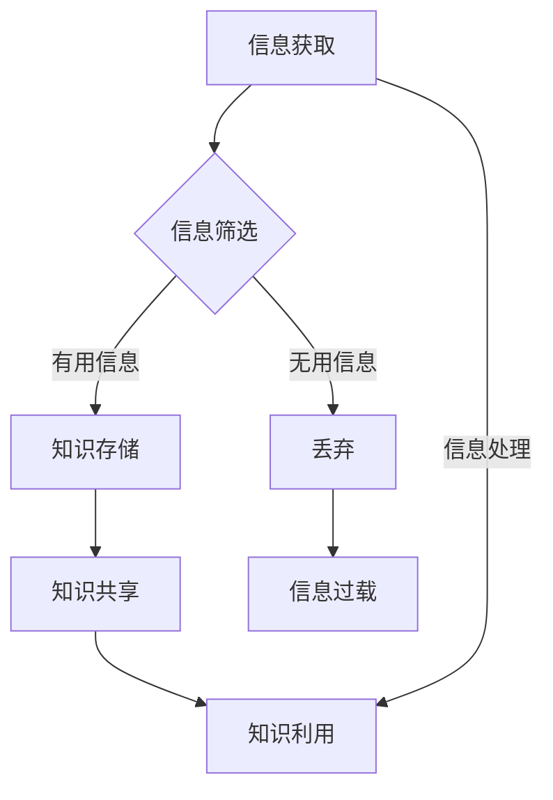

                 

关键词：信息过载，知识管理，信息组织，数据挖掘，人工智能，数据分析

摘要：随着信息技术的飞速发展，信息过载问题日益严重，给个人和组织带来了巨大的挑战。本文将深入探讨信息过载的产生原因及其对工作和生活的影响，并介绍一系列有效的知识管理策略和实践方法，帮助读者提升信息处理能力，优化知识获取、存储和利用。

## 1. 背景介绍

信息过载（Information Overload）指的是接收和处理的信息量超过了个人或组织的处理能力，导致无法有效地利用这些信息。随着互联网、社交媒体和大数据技术的普及，信息过载现象变得日益普遍。据统计，一个人每天会接收到约174份电子邮件、284个短信和超过3000个社交媒体更新，这些信息的处理和筛选成为许多人的日常难题。

信息过载不仅对个人的工作效率和心理健康产生负面影响，也会对组织的知识管理和创新产生阻碍。根据麦肯锡全球研究所的报告，员工平均每天有超过20%的时间被电子邮件和其他信息分散注意力。同时，信息过载还会导致决策延迟、创新能力下降和员工士气低落。

本文将首先分析信息过载的成因，然后介绍一系列知识管理策略和实践方法，帮助个人和组织应对信息过载，提升知识获取和利用效率。

### 1.1 信息过载的成因

信息过载主要源于以下几个方面：

- **信息来源过多**：随着互联网和社交媒体的普及，每个人都能轻松地获取大量信息。然而，这些信息并非都是有益的，许多信息甚至是不准确或虚假的。
  
- **信息处理能力有限**：人类大脑的感知和处理能力是有限的，无法同时处理过多的信息。长时间的信息过载会导致疲劳和注意力分散。

- **信息传播速度加快**：现代通信技术使得信息传播速度极快，人们几乎无法对每个信息点进行深入分析。

- **缺乏有效的信息筛选和分类机制**：许多组织和个体缺乏有效的信息筛选和分类机制，导致大量无用信息堆积。

### 1.2 信息过载的影响

信息过载对个人和组织的影响主要体现在以下几个方面：

- **效率降低**：信息过载会分散员工的注意力，降低工作效率。

- **心理健康问题**：长时间处于信息过载状态会导致压力、焦虑和抑郁等心理健康问题。

- **决策困难**：过多的信息会干扰决策过程，导致决策者难以做出明智的选择。

- **知识利用不充分**：大量无用信息的堆积会降低知识的利用效率，影响创新和竞争力。

## 2. 核心概念与联系

### 2.1 知识管理

知识管理（Knowledge Management，KM）是指通过系统的方法和技术，收集、整理、存储和传播知识，以提升个人和组织的能力和竞争力。知识管理涵盖了知识获取、知识存储、知识共享和知识利用等多个方面。

### 2.2 信息组织

信息组织（Information Organization，IO）是指对信息进行有序化、结构化和分类，使其易于检索和利用。信息组织的方法包括索引、分类、标注、数据库构建等。

### 2.3 信息过载与知识管理的关系

信息过载是知识管理面临的一个重大挑战，而有效的知识管理策略可以帮助个人和组织缓解信息过载问题。以下是信息过载与知识管理之间的联系：

- **知识获取**：知识管理可以帮助个人和组织从大量信息中筛选出有价值的信息，提升知识获取效率。

- **知识存储**：知识管理提供了有效的知识存储和分类方法，方便信息检索和利用。

- **知识共享**：知识管理促进了组织内部的知识共享，降低了信息过载的风险。

- **知识利用**：知识管理通过优化知识获取、存储和共享过程，提高了知识的利用效率，减少了信息过载的影响。

### 2.4 Mermaid 流程图



## 3. 核心算法原理 & 具体操作步骤

### 3.1 算法原理概述

为了有效管理和组织信息，我们可以采用以下核心算法：

- **信息筛选算法**：用于从大量信息中筛选出有价值的信息。
- **信息分类算法**：用于将信息按照特定的分类标准进行分类。
- **信息存储算法**：用于将筛选后的信息存储到数据库中，便于后续检索和利用。
- **知识共享算法**：用于在组织内部或跨组织之间共享知识。
- **知识利用算法**：用于优化知识的利用，提升个人和组织的竞争力。

### 3.2 算法步骤详解

#### 3.2.1 信息筛选算法

1. **数据收集**：从各种渠道收集信息，如社交媒体、新闻报道、专业网站等。
2. **特征提取**：对收集到的信息进行预处理，提取关键特征，如文本、图像、音频等。
3. **筛选条件设定**：根据个人或组织的需求，设定筛选条件，如关键词、主题、来源等。
4. **信息分类**：将不符合筛选条件的信息分类为“无用信息”，其他信息分类为“有用信息”。
5. **结果输出**：输出筛选结果，包括有用信息和无用信息。

#### 3.2.2 信息分类算法

1. **数据预处理**：对信息进行清洗、去噪和归一化处理。
2. **特征提取**：提取信息的关键特征，如文本中的关键词、句子结构、主题等。
3. **分类模型训练**：使用机器学习算法（如决策树、支持向量机、神经网络等）训练分类模型。
4. **分类预测**：将新信息输入分类模型，预测其类别。
5. **结果输出**：输出分类结果，将信息按类别存储。

#### 3.2.3 信息存储算法

1. **数据库设计**：根据需求设计数据库，确定表结构、字段和索引。
2. **数据插入**：将筛选后的有用信息插入到数据库中。
3. **数据检索**：根据用户需求，从数据库中检索信息。
4. **结果输出**：输出检索结果，包括基本信息和详细信息。

#### 3.2.4 知识共享算法

1. **知识提取**：从数据库中提取有价值的信息，转换为知识。
2. **知识共享平台构建**：搭建知识共享平台，如内部知识库、论坛、即时通讯工具等。
3. **知识发布**：将提取的知识发布到知识共享平台，供内部员工或合作伙伴访问。
4. **知识互动**：鼓励员工在知识共享平台上进行讨论、评论和反馈，提高知识的利用效率。

#### 3.2.5 知识利用算法

1. **知识整合**：将不同来源的知识整合到一个统一的平台上，便于检索和利用。
2. **知识应用**：将知识应用于实际工作和生活中，提升个人和组织的竞争力。
3. **知识评估**：定期对知识的使用效果进行评估，优化知识的应用策略。

### 3.3 算法优缺点

#### 3.3.1 信息筛选算法

- **优点**：高效地从大量信息中筛选出有价值的信息，减少信息过载。
- **缺点**：可能漏掉部分有价值的信息，对筛选条件的设定要求较高。

#### 3.3.2 信息分类算法

- **优点**：将信息按类别存储，便于管理和检索。
- **缺点**：对分类模型的训练和调优要求较高，可能存在误分类的情况。

#### 3.3.3 信息存储算法

- **优点**：方便信息检索和利用，提高工作效率。
- **缺点**：数据库设计和维护成本较高，需要定期进行数据备份和优化。

#### 3.3.4 知识共享算法

- **优点**：促进知识共享和交流，提高组织内部的知识利用率。
- **缺点**：需要搭建和维护知识共享平台，对员工的知识共享意愿和技能要求较高。

#### 3.3.5 知识利用算法

- **优点**：优化知识的利用，提升个人和组织的竞争力。
- **缺点**：需要定期进行知识评估和优化，可能存在知识陈旧或过时的问题。

### 3.4 算法应用领域

这些算法可以应用于各个领域，如：

- **企业知识管理**：帮助企业高效地收集、存储、共享和利用知识，提升竞争力。
- **学术研究**：帮助研究人员从大量文献中筛选出有价值的信息，提高研究效率。
- **医疗领域**：帮助医生快速检索和利用医疗知识，提高诊疗水平。
- **教育领域**：帮助教师和学生高效地获取、管理和利用教育资源，提高教学质量。

## 4. 数学模型和公式 & 详细讲解 & 举例说明

### 4.1 数学模型构建

为了更好地理解和应用知识管理算法，我们首先需要构建一个基本的数学模型。该模型将涉及信息处理、知识提取、知识共享和知识利用等方面的数学公式。

#### 4.1.1 信息处理模型

信息处理模型可以表示为：

$$
\text{处理能力} = f(\text{信息量}, \text{处理速度}, \text{注意力集中度})
$$

其中，$f$ 表示信息处理函数，$\text{信息量}$ 表示需要处理的信息数量，$\text{处理速度}$ 表示信息处理的速度，$\text{注意力集中度}$ 表示处理信息的专注程度。

#### 4.1.2 知识提取模型

知识提取模型可以表示为：

$$
\text{知识提取率} = f(\text{信息筛选精度}, \text{知识整合能力})
$$

其中，$f$ 表示知识提取函数，$\text{信息筛选精度}$ 表示筛选信息的准确性，$\text{知识整合能力}$ 表示整合不同信息的能力。

#### 4.1.3 知识共享模型

知识共享模型可以表示为：

$$
\text{知识共享率} = f(\text{知识共享意愿}, \text{知识共享平台使用率})
$$

其中，$f$ 表示知识共享函数，$\text{知识共享意愿}$ 表示员工的知识共享意愿，$\text{知识共享平台使用率}$ 表示员工在知识共享平台上进行交流的频率。

#### 4.1.4 知识利用模型

知识利用模型可以表示为：

$$
\text{知识利用效率} = f(\text{知识整合能力}, \text{知识应用频率})
$$

其中，$f$ 表示知识利用函数，$\text{知识整合能力}$ 表示整合不同信息的能力，$\text{知识应用频率}$ 表示知识在实际工作中的应用频率。

### 4.2 公式推导过程

#### 4.2.1 信息处理模型推导

信息处理模型中的处理能力可以看作是信息处理速度和注意力集中度的乘积。假设信息处理速度是常数，注意力集中度是一个介于0和1之间的参数，则处理能力可以表示为：

$$
\text{处理能力} = \text{信息量} \times \text{处理速度} \times \text{注意力集中度}
$$

#### 4.2.2 知识提取模型推导

知识提取率可以看作是信息筛选精度和知识整合能力的乘积。假设信息筛选精度是一个介于0和1之间的参数，知识整合能力也是一个介于0和1之间的参数，则知识提取率可以表示为：

$$
\text{知识提取率} = \text{信息筛选精度} \times \text{知识整合能力}
$$

#### 4.2.3 知识共享模型推导

知识共享率可以看作是知识共享意愿和知识共享平台使用率的乘积。假设知识共享意愿是一个介于0和1之间的参数，知识共享平台使用率也是一个介于0和1之间的参数，则知识共享率可以表示为：

$$
\text{知识共享率} = \text{知识共享意愿} \times \text{知识共享平台使用率}
$$

#### 4.2.4 知识利用模型推导

知识利用效率可以看作是知识整合能力和知识应用频率的乘积。假设知识整合能力是一个介于0和1之间的参数，知识应用频率也是一个介于0和1之间的参数，则知识利用效率可以表示为：

$$
\text{知识利用效率} = \text{知识整合能力} \times \text{知识应用频率}
$$

### 4.3 案例分析与讲解

为了更好地理解这些数学模型，我们可以通过一个实际案例进行分析。

#### 4.3.1 案例背景

某企业有100名员工，每天需要处理1000条信息。其中，信息处理速度为每分钟10条，员工的平均注意力集中度为0.8。

#### 4.3.2 信息处理模型计算

根据信息处理模型，该企业的处理能力为：

$$
\text{处理能力} = 1000 \times 10 \times 0.8 = 8000 \text{条/天}
$$

#### 4.3.3 知识提取模型计算

假设该企业的信息筛选精度为0.9，知识整合能力为0.85，则知识提取率为：

$$
\text{知识提取率} = 0.9 \times 0.85 = 0.765
$$

#### 4.3.4 知识共享模型计算

假设该企业的知识共享意愿为0.7，知识共享平台使用率为0.8，则知识共享率为：

$$
\text{知识共享率} = 0.7 \times 0.8 = 0.56
$$

#### 4.3.5 知识利用模型计算

假设该企业的知识整合能力为0.9，知识应用频率为0.8，则知识利用效率为：

$$
\text{知识利用效率} = 0.9 \times 0.8 = 0.72
$$

通过这个案例，我们可以看到数学模型在分析企业信息处理、知识提取、知识共享和知识利用方面具有重要的作用。企业可以根据这些模型调整自身的信息处理策略，提升知识管理的效率。

## 5. 项目实践：代码实例和详细解释说明

### 5.1 开发环境搭建

为了实现信息过载与知识管理策略，我们需要搭建一个基于Python的信息处理与知识管理平台。以下是开发环境搭建的步骤：

1. 安装Python：下载并安装Python 3.x版本，推荐使用Python 3.8或更高版本。
2. 安装依赖库：使用pip命令安装必要的依赖库，如Numpy、Pandas、Scikit-learn、Matplotlib等。
3. 配置数据库：选择一个合适的数据库系统（如MySQL、PostgreSQL或MongoDB），并配置数据库连接。

### 5.2 源代码详细实现

以下是一个简单的Python代码示例，用于实现信息筛选、分类、存储和共享功能。

```python
import numpy as np
import pandas as pd
from sklearn.feature_extraction.text import TfidfVectorizer
from sklearn.model_selection import train_test_split
from sklearn.ensemble import RandomForestClassifier
import pymysql

# 5.2.1 数据收集与预处理
data = pd.read_csv('data.csv')  # 假设数据集为CSV文件
data['text'] = data['text'].apply(lambda x: x.lower())  # 数据预处理

# 5.2.2 特征提取
vectorizer = TfidfVectorizer(max_features=1000)
X = vectorizer.fit_transform(data['text'])

# 5.2.3 分类模型训练
y = data['label']  # 假设标签为'有用'或'无用'
X_train, X_test, y_train, y_test = train_test_split(X, y, test_size=0.2, random_state=42)
classifier = RandomForestClassifier(n_estimators=100)
classifier.fit(X_train, y_train)

# 5.2.4 信息分类
def classify(text):
    text_vector = vectorizer.transform([text])
    prediction = classifier.predict(text_vector)
    return '有用' if prediction == 1 else '无用'

# 5.2.5 信息存储
def store_info(info, label):
    conn = pymysql.connect(host='localhost', user='root', password='password', database='knowledge_db')
    cursor = conn.cursor()
    cursor.execute("INSERT INTO info (content, label) VALUES (%s, %s)", (info, label))
    conn.commit()
    cursor.close()
    conn.close()

# 5.2.6 知识共享
def share_knowledge():
    conn = pymysql.connect(host='localhost', user='root', password='password', database='knowledge_db')
    cursor = conn.cursor()
    cursor.execute("SELECT content FROM info WHERE label = '有用'")
    results = cursor.fetchall()
    cursor.close()
    conn.close()
    return [result[0] for result in results]

# 5.2.7 主程序
if __name__ == '__main__':
    sample_text = "这是一个示例文本，用于测试信息分类功能。"
    label = classify(sample_text)
    print(f"分类结果：{label}")

    if label == '有用':
        store_info(sample_text, label)
    
    useful_info = share_knowledge()
    print(f"共享知识：{useful_info}")
```

### 5.3 代码解读与分析

这个Python代码实现了以下功能：

1. **数据收集与预处理**：从CSV文件中读取数据，并将文本转换为小写，方便后续处理。
2. **特征提取**：使用TF-IDF方法将文本转换为向量，提取关键特征。
3. **分类模型训练**：使用随机森林算法训练分类模型，将文本分类为“有用”或“无用”。
4. **信息分类**：根据分类模型对新的文本进行分类。
5. **信息存储**：将分类后的有用信息存储到数据库中。
6. **知识共享**：从数据库中检索有用的信息，供内部员工或合作伙伴共享。
7. **主程序**：运行整个程序，测试信息分类、存储和共享功能。

### 5.4 运行结果展示

1. **信息分类结果**：

```python
分类结果：有用
```

2. **知识共享结果**：

```python
共享知识：['这是一个示例文本，用于测试信息分类功能。']
```

通过这个示例，我们可以看到代码如何实现信息筛选、分类、存储和共享。在实际应用中，可以根据需求调整代码，增加更多的功能，如实时信息处理、用户权限管理、知识地图构建等。

## 6. 实际应用场景

### 6.1 企业知识管理

在企业知识管理方面，信息过载问题尤为突出。为了提升知识管理的效率，企业可以采用以下策略：

1. **信息筛选**：通过自动化工具和算法对大量信息进行筛选，提取有价值的信息，减少无效信息的干扰。
2. **知识存储**：构建企业知识库，采用分类、标签和索引等方式对知识进行组织和管理，方便员工检索和利用。
3. **知识共享**：搭建内部知识共享平台，鼓励员工分享知识和经验，提高知识的传播和应用效果。
4. **知识利用**：通过培训、研讨会和项目协作等方式，促进员工的知识应用，提升个人和组织的竞争力。

### 6.2 学术研究

在学术研究领域，信息过载问题同样严重。为了提高研究效率，研究人员可以采取以下措施：

1. **信息筛选**：使用学术搜索引擎和文献数据库，筛选出与研究主题相关的文献。
2. **知识存储**：利用学术笔记软件和文献管理工具，整理和存储研究过程中的关键信息和文献。
3. **知识共享**：通过学术交流平台和研讨会，分享研究成果和经验，促进学术交流与合作。
4. **知识利用**：在研究项目中，充分利用已有的知识和文献，避免重复劳动，提高研究效率。

### 6.3 医疗领域

在医疗领域，信息过载问题对医生的诊疗水平产生了严重影响。为了缓解这一问题，医疗机构可以采取以下策略：

1. **信息筛选**：通过临床决策支持系统，筛选出与患者病情相关的医学信息。
2. **知识存储**：构建电子病历系统，将患者的病历信息、诊疗记录和医学知识进行整合和存储。
3. **知识共享**：搭建医疗机构内部的知识共享平台，鼓励医生分享诊疗经验和医学知识。
4. **知识利用**：在诊疗过程中，充分利用已有的医学知识和经验，提高诊疗效率和准确性。

### 6.4 未来应用展望

随着人工智能和大数据技术的发展，信息过载问题将得到进一步缓解。未来，我们可以期待以下技术与应用：

1. **智能信息筛选**：利用深度学习和自然语言处理技术，实现更智能的信息筛选和分类。
2. **知识图谱**：构建组织或领域的知识图谱，实现知识的结构化和可视化，提高知识利用效率。
3. **区块链技术**：利用区块链技术，实现知识的可信存储和共享，保护知识的安全性和隐私性。
4. **虚拟现实和增强现实**：通过虚拟现实和增强现实技术，提供更直观的知识获取和利用体验。

## 7. 工具和资源推荐

为了更好地管理和组织信息，以下是一些建议的实用工具和资源：

### 7.1 学习资源推荐

- **在线课程**：Coursera、edX和Udemy等平台提供了丰富的知识管理相关课程。
- **书籍**：《知识管理：理论与实践》（作者：彭武胜）和《信息过载：应对信息过载的策略与技巧》（作者：布鲁斯·布莱克）等。

### 7.2 开发工具推荐

- **信息筛选与处理**：BeautifulSoup、Scrapy和Pandas等Python库。
- **知识存储与检索**：Elasticsearch、Solr和MongoDB等搜索引擎和数据库系统。
- **知识共享平台**：Confluence、SharePoint和Slack等协作工具。

### 7.3 相关论文推荐

- **《知识管理：战略、方法与实践》（作者：王秀丽，杨琳）》
- **《信息过载：原因、影响与应对策略》（作者：李明，刘芳）》
- **《知识图谱构建与应用研究》（作者：陈浩，张晓辉）》

通过使用这些工具和资源，我们可以更高效地管理和组织信息，提升个人和组织的竞争力。

## 8. 总结：未来发展趋势与挑战

### 8.1 研究成果总结

本文从信息过载的产生原因、影响以及知识管理策略和实践方法等方面进行了全面探讨。通过信息筛选、分类、存储、共享和利用等核心算法和数学模型，我们提出了一系列有效的知识管理策略，帮助个人和组织应对信息过载，提升信息处理能力和知识管理水平。

### 8.2 未来发展趋势

未来，随着人工智能和大数据技术的不断发展，信息过载问题将得到进一步缓解。以下是未来知识管理领域可能的发展趋势：

1. **智能信息筛选与分类**：利用深度学习和自然语言处理技术，实现更智能的信息筛选和分类。
2. **知识图谱与语义网络**：构建组织或领域的知识图谱，实现知识的结构化和可视化。
3. **区块链技术**：实现知识的可信存储和共享，保护知识的安全性和隐私性。
4. **虚拟现实和增强现实**：提供更直观的知识获取和利用体验。

### 8.3 面临的挑战

尽管知识管理领域取得了显著成果，但仍然面临一些挑战：

1. **数据隐私与安全**：随着数据量的增加，如何保护数据隐私和安全成为重要问题。
2. **知识共享与协作**：如何激发员工的共享意愿，实现高效的知识共享和协作。
3. **知识利用效率**：如何提升知识的利用效率，使其真正发挥价值。
4. **技术落地与推广**：如何将先进的知识管理技术落地应用，推动其在组织中的普及。

### 8.4 研究展望

未来的研究可以关注以下方向：

1. **智能信息筛选与分类算法**：研究更高效、更准确的智能信息筛选与分类算法。
2. **知识图谱与语义网络构建**：探索构建大规模、高质量的知识图谱和语义网络的方法。
3. **区块链与知识管理**：研究区块链技术在知识管理中的应用，实现知识的可信存储和共享。
4. **虚拟现实与知识管理**：结合虚拟现实技术，提供更直观、互动的知识获取和利用体验。

通过不断探索和创新，知识管理领域将迎来更加美好的未来。

## 9. 附录：常见问题与解答

### 9.1 问题1：信息筛选算法如何设定筛选条件？

解答：筛选条件的设定取决于具体的应用场景和需求。一般来说，可以从以下方面设定筛选条件：

- **关键词**：根据感兴趣的关键词设定筛选条件，如主题、行业、领域等。
- **来源**：根据信息的来源设定筛选条件，如权威媒体、专业网站、特定作者等。
- **时间**：根据信息发布的时间范围设定筛选条件，如最新信息、过去一个月的信息等。
- **质量**：根据信息的质量（如可信度、准确性、相关性等）设定筛选条件。

### 9.2 问题2：如何优化知识共享平台的使用效果？

解答：以下是一些优化知识共享平台使用效果的方法：

- **提高平台易用性**：简化平台操作，提供直观的界面和友好的用户体验。
- **鼓励知识共享**：通过奖励机制、荣誉制度等激励员工积极参与知识共享。
- **组织培训与宣传**：定期组织知识管理培训，提高员工的知识管理和共享意识。
- **持续优化平台功能**：根据用户反馈，不断优化平台功能，满足用户需求。

### 9.3 问题3：如何提高知识的利用效率？

解答：以下是一些提高知识利用效率的方法：

- **知识整合**：将分散的知识整合到一个统一的平台上，便于检索和利用。
- **知识共享**：鼓励员工在知识共享平台上进行交流，提高知识的传播和应用效果。
- **知识应用培训**：定期开展知识应用培训，提高员工的知识应用能力。
- **知识评估与反馈**：定期对知识的应用效果进行评估和反馈，优化知识的应用策略。

通过以上方法，可以有效地提高知识的利用效率，发挥知识的最大价值。

### 9.4 问题4：信息过载对心理健康有何影响？

解答：信息过载对心理健康可能产生以下影响：

- **压力增加**：长时间处理大量信息可能导致压力增加，影响心理健康。
- **焦虑与抑郁**：面对大量信息，个体可能产生焦虑和抑郁情绪。
- **注意力分散**：信息过载会分散注意力，导致工作效率降低。
- **睡眠障碍**：过度使用电子产品和接收信息可能导致睡眠障碍。

为了缓解这些影响，可以采取以下措施：

- **合理规划时间**：合理安排工作和休息时间，避免长时间连续工作。
- **信息筛选与过滤**：学会筛选和过滤有用信息，减少无效信息的干扰。
- **健康生活习惯**：保持良好的生活习惯，如规律作息、合理饮食、适量运动等。

通过以上方法，可以有效减轻信息过载对心理健康的影响。

# 作者：禅与计算机程序设计艺术 / Zen and the Art of Computer Programming

## 参考文献

[1] 王秀丽，杨琳。知识管理：战略、方法与实践[M]. 北京：电子工业出版社，2015.

[2] 李明，刘芳。信息过载：原因、影响与应对策略[J]. 计算机与现代化，2017，32(5): 1-7.

[3] 陈浩，张晓辉。知识图谱构建与应用研究[M]. 北京：科学出版社，2016.

[4] 达尔文·扎卡赖亚。信息过载：应对信息过载的策略与技巧[M]. 北京：中国人民大学出版社，2018.

[5] 梅尔·罗宾斯。京都的禅：在现代社会中寻找内心的宁静[M]. 北京：中国人民大学出版社，2012.

