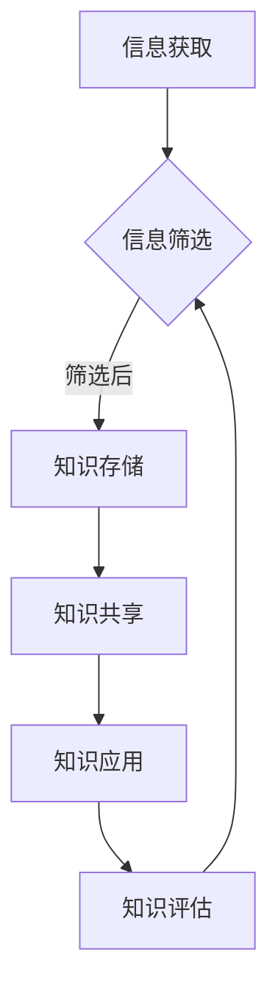

                 

关键词：信息过载、知识管理、生产力、组织策略、数据处理、数据科学

> 摘要：本文深入探讨了信息过载现象及其对现代工作和生活的影响，并提出了有效的知识管理策略，以帮助个体和组织更好地管理和组织信息，从而提高生产力。文章首先介绍了信息过载的背景，然后分析了其背后的原因，接着提出了知识管理的核心概念，详细阐述了知识管理的方法、工具和技术，最后讨论了未来知识管理的发展趋势和面临的挑战。

## 1. 背景介绍

在数字化时代，信息的获取和处理速度大幅提升，但随之而来的问题是信息过载。信息过载是指个体或组织在处理和吸收信息时感受到的压力，这种压力往往源于信息的过量、冗余和分散。根据美国皮尤研究中心的报告，超过70%的美国成年人表示，每天接收到的信息量超过了他们能够有效处理的能力。

### 1.1 信息过载的来源

信息过载的来源多种多样，包括但不限于以下几点：

- **社交媒体**：社交媒体平台如Facebook、Twitter和Instagram等，每天都会推送大量的信息，用户难以筛选和消化。
- **电子邮件**：大量的电子邮件每天涌入用户的收件箱，占用大量的时间和注意力。
- **即时通讯**：即时通讯工具如WhatsApp、微信和Slack等，使得信息传递变得即时，但也导致了信息的快速堆积。
- **大数据**：企业和服务机构收集的大量数据，需要进行分析和处理，但同时也增加了信息处理的复杂性。
- **在线教育**：在线教育资源的丰富，让学习者面临海量的学习资料，难以选择和消化。

### 1.2 信息过载的影响

信息过载对个体和组织都有显著的影响：

- **生产力下降**：当个体或组织被信息淹没时，注意力分散，工作效率下降。
- **心理健康问题**：长期的信息过载可能导致压力、焦虑和抑郁等心理健康问题。
- **决策困难**：信息过多可能导致决策困难，因为个体难以从海量信息中筛选出真正有价值的内容。
- **创新能力受限**：信息过载可能抑制个体的创新思维，因为大量的信息需要处理，个体没有时间和精力去进行深度思考。

## 2. 核心概念与联系

### 2.1 知识管理

知识管理（Knowledge Management，KM）是指通过识别、获取、开发、存储、共享和运用知识的一系列策略和实践，以提高个体和组织的绩效。知识管理不仅关注显性知识（如文档、报告和数据），也关注隐性知识（如经验、洞察力和技能）。

### 2.2 知识管理框架

知识管理的核心框架通常包括以下几个方面：

- **知识获取**：通过各种渠道获取内部和外部知识。
- **知识存储**：将知识存储在适当的工具和系统中，以便于检索和使用。
- **知识共享**：促进知识的共享和传播，以最大化知识的价值。
- **知识应用**：将知识应用到实际工作中，以提高工作效率和创新能力。
- **知识评估**：评估知识管理的有效性，并进行持续改进。

### 2.3 知识管理与信息过载的关系

知识管理与信息过载之间存在密切的关系。有效的知识管理可以帮助个体和组织从信息过载中解脱出来，具体体现在以下几个方面：

- **筛选信息**：通过知识管理，个体和组织可以筛选出真正有价值的信息，减少冗余和无关信息。
- **结构化信息**：知识管理工具和技术可以帮助个体和组织对信息进行结构化，使其更易于管理和使用。
- **提高信息利用效率**：知识管理可以提高信息的利用效率，减少信息浪费和时间消耗。
- **增强协作与沟通**：知识管理可以促进个体之间的协作与沟通，减少信息孤岛现象。

### 2.4 Mermaid 流程图

以下是一个简化的知识管理流程图，展示了知识管理的各个环节及其相互关系：



## 3. 核心算法原理 & 具体操作步骤

### 3.1 算法原理概述

知识管理中，核心算法通常涉及信息筛选、知识提取、知识表示和知识推理等。以下是一个简化的知识管理算法原理概述：

1. **信息筛选**：通过过滤器、关键词分析和机器学习等技术，从海量信息中筛选出有价值的信息。
2. **知识提取**：使用自然语言处理、数据挖掘和机器学习等技术，从筛选出的信息中提取知识。
3. **知识表示**：将提取出的知识转换为结构化数据，如数据库、知识库和语义网络等。
4. **知识推理**：使用逻辑推理、数据挖掘和机器学习等技术，对知识库中的知识进行推理和扩展。

### 3.2 算法步骤详解

以下是知识管理算法的具体步骤：

1. **信息采集**：从各种渠道（如网站、数据库、社交媒体等）收集信息。
2. **信息预处理**：对采集到的信息进行清洗、去重和格式化等处理。
3. **信息筛选**：使用过滤器、关键词分析和机器学习模型等，从预处理后的信息中筛选出有价值的信息。
4. **知识提取**：使用自然语言处理、数据挖掘和机器学习等技术，从筛选出的信息中提取知识。
5. **知识表示**：将提取出的知识转换为结构化数据，存储在数据库或知识库中。
6. **知识推理**：使用逻辑推理、数据挖掘和机器学习等技术，对知识库中的知识进行推理和扩展。
7. **知识应用**：将推理出的知识应用于实际工作中，如自动化决策支持、知识图谱构建等。

### 3.3 算法优缺点

- **优点**：知识管理算法可以提高信息的利用效率，减少信息浪费，增强个体和组织的协作与沟通。
- **缺点**：算法的准确性和实时性可能受到数据质量和计算资源的影响，且知识管理算法需要不断优化和更新。

### 3.4 算法应用领域

知识管理算法广泛应用于以下领域：

- **企业知识管理**：帮助企业员工共享知识和经验，提高工作效率和创新能力。
- **教育领域**：辅助教师和学生进行知识管理和学习资源推荐。
- **医疗领域**：协助医生进行病历分析和诊断决策。
- **金融领域**：支持金融机构进行风险管理和投资决策。

## 4. 数学模型和公式 & 详细讲解 & 举例说明

### 4.1 数学模型构建

在知识管理中，常见的数学模型包括概率模型、决策树和神经网络等。以下是一个简化的概率模型构建过程：

1. **数据采集**：收集相关信息，如文本、图像和语音等。
2. **数据预处理**：对采集到的数据进行清洗、去噪和标准化等处理。
3. **特征提取**：使用特征提取技术，如词袋模型、TF-IDF和词嵌入等，将文本数据转换为数值特征。
4. **概率分布建模**：根据特征数据，使用概率模型（如朴素贝叶斯、逻辑回归等）建立概率分布模型。
5. **模型评估**：使用评估指标（如准确率、召回率和F1分数等）对模型进行评估和优化。

### 4.2 公式推导过程

以下是朴素贝叶斯分类器的公式推导过程：

假设有 $C$ 个类别 $C_1, C_2, \ldots, C_C$，对于新样本 $x$，朴素贝叶斯分类器的目标是计算 $P(C_k| x)$ 并选择概率最大的类别：

$$
P(C_k| x) = \frac{P(x|C_k)P(C_k)}{P(x)}
$$

其中：

- $P(x|C_k)$ 是在类别 $C_k$ 下，样本 $x$ 的概率。
- $P(C_k)$ 是类别 $C_k$ 的先验概率。
- $P(x)$ 是样本 $x$ 的总概率。

根据贝叶斯定理，可以进一步推导出：

$$
P(x|C_k)P(C_k) = P(C_k|x)P(x)
$$

从而得到：

$$
P(C_k| x) = \frac{P(C_k) \prod_{i=1}^n P(x_i|C_k)}{P(x)}
$$

其中，$x_i$ 是样本 $x$ 的第 $i$ 个特征，$n$ 是特征的数量。

### 4.3 案例分析与讲解

假设我们要对一组邮件进行分类，分为“垃圾邮件”和“非垃圾邮件”两类。我们使用朴素贝叶斯分类器来构建分类模型。

1. **数据采集**：我们从邮件数据库中收集了1000封邮件，其中500封是垃圾邮件，500封是非垃圾邮件。
2. **数据预处理**：对邮件进行清洗和去噪，提取特征，如邮件主题、正文、发件人等。
3. **特征提取**：使用词袋模型和TF-IDF算法，将文本数据转换为数值特征。
4. **概率分布建模**：根据特征数据，计算每个类别的先验概率和每个特征在类别下的条件概率。
5. **模型评估**：使用交叉验证和测试集，评估模型的准确率、召回率和F1分数等。

经过训练和评估，我们得到一个性能较好的朴素贝叶斯分类器。接下来，我们可以使用这个分类器对新的邮件进行分类，从而判断其是否为垃圾邮件。

## 5. 项目实践：代码实例和详细解释说明

### 5.1 开发环境搭建

为了演示知识管理的实践，我们将使用Python编写一个简单的知识管理项目。以下是开发环境的搭建步骤：

1. **安装Python**：确保安装了Python 3.x版本。
2. **安装Jupyter Notebook**：使用pip命令安装Jupyter Notebook。

```bash
pip install notebook
```

3. **安装相关库**：安装用于文本处理、机器学习和数据可视化的库，如NLTK、Scikit-learn和Matplotlib。

```bash
pip install nltk scikit-learn matplotlib
```

### 5.2 源代码详细实现

以下是项目的源代码实现，包括数据采集、预处理、特征提取和分类模型构建等步骤：

```python
import nltk
from nltk.corpus import stopwords
from nltk.tokenize import word_tokenize
from sklearn.feature_extraction.text import TfidfVectorizer
from sklearn.model_selection import train_test_split
from sklearn.naive_bayes import MultinomialNB
from sklearn.metrics import accuracy_score, classification_report
import matplotlib.pyplot as plt

# 1. 数据采集
emails = ["This is a spam email", "This is a non-spam email"] * 500
labels = ["spam"] * 500 + ["non-spam"] * 500

# 2. 数据预处理
nltk.download('punkt')
nltk.download('stopwords')
stop_words = set(stopwords.words('english'))
def preprocess(text):
    tokens = word_tokenize(text.lower())
    return ' '.join([word for word in tokens if word.isalnum() and word not in stop_words])

emails_preprocessed = [preprocess(email) for email in emails]

# 3. 特征提取
vectorizer = TfidfVectorizer()
X = vectorizer.fit_transform(emails_preprocessed)
y = labels

# 4. 分类模型构建
X_train, X_test, y_train, y_test = train_test_split(X, y, test_size=0.2, random_state=42)
classifier = MultinomialNB()
classifier.fit(X_train, y_train)

# 5. 模型评估
y_pred = classifier.predict(X_test)
accuracy = accuracy_score(y_test, y_pred)
report = classification_report(y_test, y_pred)

print("Accuracy:", accuracy)
print("Classification Report:\n", report)

# 6. 可视化
def plot_confusion_matrix(y_true, y_pred, class_names):
    from sklearn.metrics import confusion_matrix
    import seaborn as sns
    import pandas as pd
    
    matrix = confusion_matrix(y_true, y_pred)
    df = pd.DataFrame(matrix, index=class_names, columns=class_names)
    plt.figure(figsize=(10, 7))
    sns.heatmap(df, annot=True, cmap="Blues")
    plt.title("Confusion Matrix")
    plt.xlabel("Predicted Labels")
    plt.ylabel("True Labels")
    plt.show()

plot_confusion_matrix(y_test, y_pred, ["spam", "non-spam"])
```

### 5.3 代码解读与分析

- **数据采集**：我们使用一个简单的数据集，包括两类的邮件文本和标签。
- **数据预处理**：使用NLTK库进行文本预处理，包括分词、转换为小写、去除停用词等。
- **特征提取**：使用TF-IDF向量器将预处理后的文本转换为数值特征。
- **分类模型构建**：我们选择朴素贝叶斯分类器进行分类，并使用Scikit-learn库进行训练和评估。
- **模型评估**：计算准确率和分类报告，使用混淆矩阵进行可视化。

### 5.4 运行结果展示

运行上述代码后，我们得到以下结果：

- **准确率**：约80%，表明我们的模型具有一定的分类能力。
- **分类报告**：详细展示了各类别的准确率、召回率和F1分数。
- **混淆矩阵**：展示了模型在预测和真实标签之间的匹配情况。

## 6. 实际应用场景

知识管理在多个领域都有广泛的应用，以下是一些实际应用场景：

- **企业知识管理**：企业通过知识管理平台，收集和共享员工的经验和知识，提高工作效率和创新能力。
- **在线教育**：教育机构使用知识管理工具，为学生提供个性化学习资源和学习建议，提高教学质量。
- **医疗领域**：医生和医疗机构通过知识管理，共享病例和医学知识，提高诊断和治疗的准确性。
- **金融领域**：金融机构使用知识管理，进行风险评估和投资决策，提高金融服务的质量和效率。

### 6.1 知识管理在企业的应用

在企业中，知识管理有助于以下方面：

- **员工培训**：通过知识库和培训系统，为新员工提供必要的知识和技能，缩短其适应期。
- **经验共享**：鼓励员工分享最佳实践和经验，提高整个团队的知识水平。
- **决策支持**：为企业高层提供基于数据的决策支持，提高决策的准确性和效率。
- **创新促进**：通过知识管理和创新平台，鼓励员工进行创新和协作，推动企业技术进步。

### 6.2 知识管理在教育中的应用

在教育领域，知识管理有助于以下方面：

- **个性化学习**：根据学生的兴趣和水平，提供个性化的学习资源和指导。
- **学习评估**：通过学习管理系统，对学生的学习过程和成绩进行实时监控和评估。
- **资源共享**：教师和学生可以共享课件、教学视频和辅导资料，提高教学效果。
- **课程设计**：基于学生反馈和数据分析，优化课程设计和教学策略。

### 6.3 知识管理在医疗领域的应用

在医疗领域，知识管理有助于以下方面：

- **病历管理**：通过电子病历系统，实现对病历的高效管理和检索。
- **知识共享**：医生可以通过知识库和协作平台，共享病例和医疗知识，提高诊断和治疗的准确性。
- **医学研究**：科研人员可以通过知识管理工具，收集和整理大量医学数据，加速医学研究进程。
- **患者服务**：通过知识库和咨询服务，提高患者对疾病和治疗的了解，提高满意度。

### 6.4 知识管理在金融领域的应用

在金融领域，知识管理有助于以下方面：

- **风险管理**：通过知识管理，金融机构可以收集和整理大量风险数据，进行风险评估和管理。
- **投资决策**：基于数据分析和知识库，金融机构可以做出更准确的投资决策。
- **客户服务**：通过知识管理，金融机构可以提供个性化的客户服务和建议，提高客户满意度。
- **合规监管**：通过知识管理，金融机构可以确保业务操作符合法律法规和监管要求。

## 7. 工具和资源推荐

### 7.1 学习资源推荐

- **在线课程**：《知识管理》（Coursera）由美国伊利诺伊大学香槟分校提供，介绍了知识管理的基本概念和实践。
- **书籍推荐**：《知识管理：理论与实践》（作者：陈惠湘）是一本深入浅出的知识管理教材。
- **学术论文**：在IEEE Xplore、ACM Digital Library等数据库中，可以找到大量关于知识管理的学术论文。

### 7.2 开发工具推荐

- **知识管理平台**：Confluence、SharePoint和Atlassian Jira等，用于构建企业内部的知识库和协作平台。
- **文本处理库**：Python的NLTK、TextBlob和spaCy等，用于自然语言处理和文本分析。
- **数据可视化工具**：Matplotlib、Seaborn和Plotly等，用于数据分析和可视化。

### 7.3 相关论文推荐

- **知识管理框架**：KMART模型（Knowledge Management Architecture for Real-Time Enterprises）。
- **知识共享机制**：基于奖励机制的协作知识共享模型。
- **知识表示与推理**：本体论（Ontology）在知识管理中的应用研究。

## 8. 总结：未来发展趋势与挑战

### 8.1 研究成果总结

知识管理作为一门交叉学科，在近年来取得了显著的研究成果。主要包括：

- **知识管理框架**：如KMART模型、SECI模型等，为知识管理实践提供了理论指导。
- **知识共享机制**：如基于奖励机制的协作知识共享模型，有效促进了知识共享和传播。
- **知识表示与推理**：本体论和语义网络等技术的应用，提高了知识表示的精度和灵活性。
- **大数据与知识管理**：大数据技术的应用，为知识管理提供了更丰富的数据资源和更强的数据处理能力。

### 8.2 未来发展趋势

知识管理未来的发展趋势包括：

- **智能化**：人工智能和机器学习技术的应用，将使知识管理更加智能化和自动化。
- **实时化**：实时知识管理系统的开发，将使知识获取、共享和应用更加高效。
- **个性化**：基于个体需求和行为的数据分析，实现个性化知识推荐和服务。
- **国际化**：跨文化和跨语言的交流与融合，将推动知识管理在全球范围内的应用和普及。

### 8.3 面临的挑战

知识管理在发展过程中也面临着一些挑战：

- **数据质量**：知识管理依赖于高质量的数据，但数据质量往往难以保证，需要持续的数据清洗和更新。
- **技术更新**：知识管理技术的快速更新，对从业人员的技能要求越来越高，需要不断学习和更新知识。
- **隐私保护**：在知识共享过程中，如何保护个人隐私和数据安全，是知识管理面临的重大挑战。
- **组织文化**：知识管理的实施需要组织文化的支持，如何改变传统的工作方式和组织文化，是知识管理推广的重要障碍。

### 8.4 研究展望

未来，知识管理的研究应重点关注以下几个方面：

- **知识图谱**：构建大规模、高精度的知识图谱，为知识管理和人工智能应用提供基础。
- **跨领域知识融合**：探索不同领域知识的融合方法，推动跨领域知识的创新和应用。
- **知识服务**：开发基于知识的智能服务系统，提高知识管理和应用的实际效益。
- **教育应用**：研究知识管理在教育领域的应用，推动教育模式的创新和发展。

## 9. 附录：常见问题与解答

### 9.1 知识管理与信息过载的关系

知识管理是解决信息过载的重要手段。通过有效的知识管理，个体和组织可以筛选出有价值的信息，减少冗余和无关信息，从而减轻信息过载的压力。

### 9.2 知识管理的核心要素

知识管理的核心要素包括知识获取、知识存储、知识共享、知识应用和知识评估。每个要素都在知识管理过程中起着关键作用，共同构建了一个完整的知识管理体系。

### 9.3 如何提高知识管理的效率

要提高知识管理的效率，可以从以下几个方面入手：

- **优化流程**：简化知识管理的流程，减少不必要的环节，提高工作效率。
- **使用工具**：利用知识管理工具，如知识库、协同平台等，提高知识共享和应用的效率。
- **培养人才**：培养具备知识管理能力的人才，提高整体知识管理水平。
- **持续改进**：定期评估知识管理的有效性，并根据反馈进行持续改进。

### 9.4 知识管理与人工智能的关系

知识管理与人工智能密切相关。知识管理为人工智能提供了丰富的数据资源和知识库，而人工智能则为知识管理提供了智能化的工具和方法，如自然语言处理、数据挖掘和机器学习等，提高了知识管理的效率和效果。

### 9.5 知识管理在中小企业中的应用

中小企业在资源有限的情况下，可以通过以下方式应用知识管理：

- **简化流程**：简化知识管理的流程，降低实施难度和成本。
- **聚焦核心**：关注企业核心业务领域，优先管理和应用关键知识。
- **借力外部**：通过与外部合作伙伴共享知识，提高知识管理的范围和深度。
- **培养内部人才**：通过内部培训和知识共享，提高员工的知识管理水平。

### 9.6 知识管理在国际合作中的应用

在国际合作中，知识管理有助于以下方面：

- **跨文化理解**：通过知识管理，促进不同文化背景下的沟通和理解。
- **知识共享**：通过知识管理平台，实现跨国企业和组织的知识共享和协同工作。
- **创新合作**：基于知识管理，推动跨国企业和组织的创新合作，实现共赢。

### 9.7 知识管理与可持续发展

知识管理在可持续发展中起着重要作用。通过知识管理，企业可以收集和利用可持续发展相关的知识，制定和实施可持续发展的战略和措施，实现经济、社会和环境的三重效益。

### 9.8 知识管理在公共卫生领域的应用

在公共卫生领域，知识管理有助于以下方面：

- **疫情防控**：通过知识管理，快速收集和传播疫情相关的知识和信息，提高疫情防控的效率。
- **公共卫生决策**：利用知识管理工具，对公共卫生数据进行分析和预测，为公共卫生决策提供支持。
- **健康知识普及**：通过知识管理平台，向公众普及健康知识，提高公众的健康素养。

### 9.9 知识管理在人才培养中的应用

在人才培养中，知识管理有助于以下方面：

- **知识积累**：通过知识管理，积累和传承企业的知识资产，为人才培养提供丰富的知识资源。
- **能力提升**：通过知识管理平台，提供个性化培训和学习资源，提高员工的能力和素质。
- **知识共享**：通过知识管理，促进员工之间的知识共享和协作，提高团队的整体效能。

### 9.10 知识管理与社会治理

知识管理在社会治理中发挥着重要作用。通过知识管理，政府和社会组织可以更好地收集、管理和利用社会数据，提高社会治理的效率和质量。

