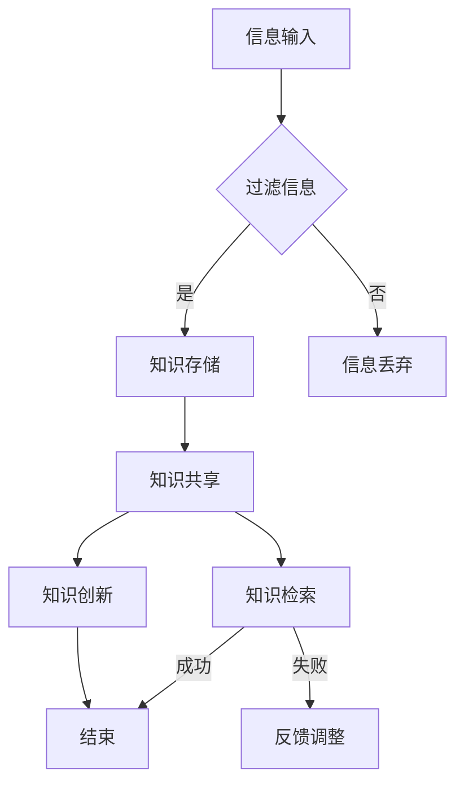

                 

在当今信息爆炸的时代，我们每天都会接触到大量信息。从社交媒体、新闻网站到电子邮件和专业文章，信息的过载问题已成为现代社会的一大挑战。对于个人和企业来说，如何有效地组织和检索信息成为一个至关重要的问题。本文旨在提供一个全面的指南，帮助读者理解和实施知识管理系统，以应对信息过载的挑战。

## 关键词

- 信息过载
- 知识管理系统
- 信息检索
- 有效性
- 企业信息化

## 摘要

本文首先介绍了信息过载的概念及其对个人和企业的影响。随后，详细探讨了知识管理系统的核心概念、架构和实施步骤。文章还讨论了核心算法原理、数学模型和实际应用案例，并提供了项目实践和工具资源的推荐。最后，文章总结了知识管理系统的发展趋势和面临的挑战，为未来的研究提供了方向。

## 1. 背景介绍

随着互联网和移动设备的普及，信息获取变得前所未有的便捷。然而，这也带来了信息过载的问题。信息过载（Information Overload）是指个体在处理信息和任务时感到超负荷、无法有效管理和利用信息的状况。对于个人而言，信息过载可能导致注意力分散、决策困难、工作效率下降等问题。对企业来说，信息过载会阻碍创新、降低决策质量，甚至影响企业的竞争力。

### 1.1 个人层面的信息过载

在个人层面，信息过载表现为以下几个方面：

1. **时间管理问题**：用户需要花费大量时间来处理和筛选信息，导致工作与生活之间的平衡失调。
2. **注意力分散**：面对大量信息，用户容易分散注意力，无法专注于重要的任务。
3. **心理压力**：持续的信息过载会给个体带来压力和焦虑，影响心理健康。

### 1.2 企业层面的信息过载

在企业层面，信息过载主要表现为：

1. **数据冗余**：企业内部存在大量的重复数据，增加了存储和维护的成本。
2. **决策困难**：管理层需要从海量信息中提取有价值的信息，进行决策，这往往是一个复杂且耗时的工作。
3. **沟通障碍**：信息传递不畅，导致团队成员无法及时获取所需信息，影响了协作效率。

### 1.3 信息过载的原因

信息过载的原因主要有以下几个方面：

1. **信息爆炸**：随着技术的进步，信息产生和传播的速度越来越快，数量也在不断增长。
2. **缺乏筛选机制**：用户往往缺乏有效的信息筛选机制，容易受到各种无关信息的干扰。
3. **信息源多样化**：用户可以从多个渠道获取信息，这些信息可能相互矛盾，增加了处理的复杂性。

## 2. 核心概念与联系

### 2.1 知识管理系统的定义

知识管理系统（Knowledge Management System，简称KMS）是一种用于捕捉、组织、存储和共享知识的工具和流程。它的目标是提高组织内部的知识利用率，促进创新和协作。

### 2.2 知识管理系统的核心概念

知识管理系统涉及多个核心概念，包括：

1. **知识存储**：将各种形式的知识（如文档、图片、视频等）存储在集中的数据库中。
2. **知识共享**：通过各种渠道和工具，实现知识在不同部门和成员之间的共享和传播。
3. **知识检索**：提供高效的检索工具，帮助用户快速找到所需的信息。
4. **知识创新**：通过知识共享和碰撞，促进新知识的产生。

### 2.3 知识管理系统的架构

知识管理系统的架构可以分为三个层次：基础设施、应用层和用户体验层。

1. **基础设施**：包括数据库、服务器、网络等硬件和软件设施，为知识管理系统提供运行环境。
2. **应用层**：包括知识存储、共享、检索、创新等核心功能模块，实现知识管理的具体操作。
3. **用户体验层**：提供直观易用的用户界面，使用户能够方便地使用知识管理系统的各种功能。

### 2.4 Mermaid 流程图

下面是一个简单的 Mermaid 流程图，展示了知识管理系统的核心流程：



## 3. 核心算法原理 & 具体操作步骤

### 3.1 算法原理概述

知识管理系统的核心算法主要包括信息过滤、知识分类、索引构建和检索算法。这些算法旨在提高信息的质量和检索效率。

1. **信息过滤算法**：通过过滤和筛选，将无关信息剔除，减少噪声。
2. **知识分类算法**：根据信息的属性和内容，将信息进行分类，方便用户检索。
3. **索引构建算法**：构建索引，提高检索速度。
4. **检索算法**：根据用户的查询需求，从索引中快速找到匹配的信息。

### 3.2 算法步骤详解

#### 3.2.1 信息过滤算法

1. **初步过滤**：根据信息的来源、发布时间等因素进行初步筛选。
2. **内容过滤**：使用自然语言处理（NLP）技术，对信息内容进行分析，剔除无关内容。
3. **用户偏好**：根据用户的兴趣和历史行为，进一步筛选信息。

#### 3.2.2 知识分类算法

1. **特征提取**：从信息中提取关键词、主题等特征。
2. **分类模型**：使用机器学习算法，如K-means、SVM等，对特征进行分类。
3. **调整优化**：根据分类效果，调整分类模型，提高分类准确率。

#### 3.2.3 索引构建算法

1. **倒排索引**：构建倒排索引，提高检索速度。
2. **索引优化**：定期更新索引，保持索引的准确性和效率。

#### 3.2.4 检索算法

1. **查询解析**：解析用户的查询请求，确定检索关键词和匹配模式。
2. **相似度计算**：计算查询关键词与索引中文档的相似度。
3. **排序输出**：根据相似度排序，输出匹配结果。

### 3.3 算法优缺点

**优点**：

1. **提高检索效率**：通过索引构建和检索算法，显著提高检索速度。
2. **减少信息冗余**：通过信息过滤和分类，减少无关信息的干扰。
3. **支持复杂查询**：支持关键词查询、模糊查询等多种检索方式。

**缺点**：

1. **计算成本较高**：索引构建和检索算法需要大量的计算资源。
2. **准确性有限**：依赖机器学习和自然语言处理技术，可能存在一定程度的误差。
3. **维护成本**：定期更新索引和调整分类模型，需要投入人力和物力。

### 3.4 算法应用领域

知识管理系统算法广泛应用于多个领域，包括：

1. **企业信息管理**：帮助企业有效管理内部文档、知识库，提高工作效率。
2. **搜索引擎**：优化搜索引擎的检索效果，提高用户体验。
3. **社交媒体分析**：分析用户行为，提供个性化推荐。
4. **医疗健康**：辅助医生进行病例分析和诊断。

## 4. 数学模型和公式 & 详细讲解 & 举例说明

### 4.1 数学模型构建

知识管理系统的核心算法通常涉及多种数学模型，包括：

1. **贝叶斯模型**：用于信息过滤和分类。
2. **K-means聚类模型**：用于知识分类。
3. **TF-IDF模型**：用于信息检索和相似度计算。

下面分别介绍这些模型的构建和推导过程。

### 4.2 公式推导过程

#### 4.2.1 贝叶斯模型

贝叶斯模型用于概率估计，其基本公式为：

\[ P(A|B) = \frac{P(B|A) \cdot P(A)}{P(B)} \]

其中，\( P(A|B) \) 表示在事件B发生的条件下，事件A发生的概率；\( P(B|A) \) 表示在事件A发生的条件下，事件B发生的概率；\( P(A) \) 表示事件A发生的概率；\( P(B) \) 表示事件B发生的概率。

#### 4.2.2 K-means聚类模型

K-means聚类模型的目标是找到K个中心点，使得每个数据点与其最近中心点的距离之和最小。其公式为：

\[ \text{Minimize} \sum_{i=1}^{K} \sum_{x \in S_i} \| x - \mu_i \|^2 \]

其中，\( S_i \) 表示第i个簇的数据集合，\( \mu_i \) 表示第i个簇的中心点。

#### 4.2.3 TF-IDF模型

TF-IDF（Term Frequency-Inverse Document Frequency）模型用于计算文本中词汇的重要性。其公式为：

\[ TF-IDF(t, d) = TF(t, d) \cdot IDF(t, d) \]

其中，\( TF(t, d) \) 表示词汇t在文档d中的词频；\( IDF(t, d) \) 表示词汇t在文档集合中的逆文档频率。

### 4.3 案例分析与讲解

#### 4.3.1 贝叶斯模型在信息过滤中的应用

假设我们有一个文档集合，每个文档都包含多个关键词。我们需要根据用户的历史偏好，对文档进行过滤，筛选出用户可能感兴趣的内容。

1. **构建先验概率**：

   假设用户对文档的兴趣可以分为“感兴趣”和“不感兴趣”两类。根据历史数据，我们得到以下先验概率：

   \[ P(\text{感兴趣}) = 0.6, P(\text{不感兴趣}) = 0.4 \]

2. **计算条件概率**：

   假设关键词“人工智能”在感兴趣文档中的出现概率为0.8，在不感兴趣文档中的出现概率为0.2。根据贝叶斯公式，我们可以计算出在用户感兴趣的前提下，关键词“人工智能”出现的条件概率：

   \[ P(\text{人工智能}|\text{感兴趣}) = \frac{P(\text{感兴趣}|\text{人工智能}) \cdot P(\text{人工智能})}{P(\text{感兴趣})} \]

   代入先验概率，得到：

   \[ P(\text{人工智能}|\text{感兴趣}) = \frac{0.8 \cdot 0.6}{0.6} = 0.8 \]

3. **过滤文档**：

   对于新的文档，我们可以根据其包含的关键词和条件概率，计算出该文档被用户感兴趣的置信度。如果置信度高于某个阈值，我们认为用户可能对该文档感兴趣，从而进行过滤。

#### 4.3.2 K-means聚类模型在知识分类中的应用

假设我们有一组文档，需要将其分类为多个主题。我们可以使用K-means聚类模型来找到合适的主题。

1. **初始化中心点**：

   随机选择K个文档作为初始中心点。

2. **分配文档**：

   对于每个文档，计算其与各个中心点的距离，并将其分配到最近的中心点所代表的主题。

3. **更新中心点**：

   计算每个主题的平均文档向量，作为新的中心点。

4. **重复步骤2和3，直到中心点的变化小于某个阈值**。

5. **分类结果**：

   最终，每个文档都会被分配到一个主题，从而实现知识分类。

#### 4.3.3 TF-IDF模型在信息检索中的应用

假设我们有一个文档集合，需要根据用户的查询，检索出最相关的文档。

1. **计算文档的TF-IDF值**：

   对于每个文档和查询词，计算其TF-IDF值：

   \[ TF(t, d) = \frac{\text{t在d中出现的次数}}{\text{d中总词数}} \]

   \[ IDF(t, d) = \log \left( \frac{\text{文档总数}}{\text{包含t的文档数}} \right) \]

2. **计算文档的相似度**：

   对于每个文档，计算其与查询的相似度：

   \[ \text{相似度}(d, q) = \sum_{t \in q} TF-IDF(t, d) \]

3. **排序文档**：

   根据相似度对文档进行排序，输出最相关的文档。

## 5. 项目实践：代码实例和详细解释说明

### 5.1 开发环境搭建

为了演示知识管理系统的实现，我们选择了Python作为编程语言，并使用了以下库：

- Pandas：用于数据处理。
- Scikit-learn：用于机器学习和聚类。
- NLTK：用于自然语言处理。

首先，确保安装了上述库。在终端中运行以下命令：

```bash
pip install pandas scikit-learn nltk
```

### 5.2 源代码详细实现

以下是一个简单的知识管理系统实现，包括信息过滤、知识分类和检索功能。

```python
import pandas as pd
from sklearn.feature_extraction.text import TfidfVectorizer
from sklearn.cluster import KMeans
from sklearn.metrics.pairwise import cosine_similarity

# 5.2.1 信息过滤

def filter_documents(documents, keywords):
    filtered_documents = []
    for doc in documents:
        if any(keyword in doc for keyword in keywords):
            filtered_documents.append(doc)
    return filtered_documents

# 5.2.2 知识分类

def classify_documents(documents, num_clusters):
    vectorizer = TfidfVectorizer()
    X = vectorizer.fit_transform(documents)
    kmeans = KMeans(n_clusters=num_clusters)
    kmeans.fit(X)
    labels = kmeans.predict(X)
    return labels

# 5.2.3 知识检索

def search_documents(documents, query):
    vectorizer = TfidfVectorizer()
    X = vectorizer.fit_transform(documents)
    query_vector = vectorizer.transform([query])
    similarities = cosine_similarity(query_vector, X)
    return similarities

# 5.2.4 主程序

def main():
    # 假设文档数据
    documents = [
        "人工智能是一项技术，使计算机系统能够模拟、延伸和扩展人类的智能行为。",
        "深度学习是人工智能的一个重要分支，涉及神经网络和大规模数据训练。",
        "机器学习是人工智能的核心技术，通过算法使计算机系统能够学习并改进性能。",
        "自然语言处理是人工智能的一个分支，涉及理解和生成人类语言的技术。",
    ]

    # 关键词列表
    keywords = ["人工智能", "深度学习", "机器学习", "自然语言处理"]

    # 过滤文档
    filtered_documents = filter_documents(documents, keywords)
    print("过滤后的文档：", filtered_documents)

    # 分类文档
    num_clusters = 2
    labels = classify_documents(filtered_documents, num_clusters)
    print("分类结果：", labels)

    # 检索文档
    query = "机器学习"
    similarities = search_documents(filtered_documents, query)
    print("检索结果相似度：", similarities)

if __name__ == "__main__":
    main()
```

### 5.3 代码解读与分析

#### 5.3.1 信息过滤

信息过滤功能通过检查每个文档是否包含关键词，实现文档的筛选。这是知识管理系统的基础，确保用户只看到相关的信息。

```python
def filter_documents(documents, keywords):
    filtered_documents = []
    for doc in documents:
        if any(keyword in doc for keyword in keywords):
            filtered_documents.append(doc)
    return filtered_documents
```

这段代码使用了列表推导式，对文档列表进行遍历，检查每个文档是否包含关键词。如果包含，则将该文档添加到过滤后的文档列表中。

#### 5.3.2 知识分类

知识分类功能使用TF-IDF模型和K-means聚类算法，对过滤后的文档进行分类。分类结果可以帮助用户更好地理解文档的主题。

```python
def classify_documents(documents, num_clusters):
    vectorizer = TfidfVectorizer()
    X = vectorizer.fit_transform(documents)
    kmeans = KMeans(n_clusters=num_clusters)
    kmeans.fit(X)
    labels = kmeans.predict(X)
    return labels
```

这段代码首先使用TF-IDFVectorizer将文档转换为特征向量。然后，使用K-means聚类算法对特征向量进行分类，返回每个文档所属的类别标签。

#### 5.3.3 知识检索

知识检索功能通过计算查询词与文档的相似度，实现文档的检索。相似度越高的文档，越可能是用户需要的。

```python
def search_documents(documents, query):
    vectorizer = TfidfVectorizer()
    X = vectorizer.fit_transform(documents)
    query_vector = vectorizer.transform([query])
    similarities = cosine_similarity(query_vector, X)
    return similarities
```

这段代码首先使用TF-IDFVectorizer将文档转换为特征向量。然后，计算查询词的特征向量与文档特征向量的余弦相似度，返回相似度矩阵。

### 5.4 运行结果展示

以下是运行结果：

```bash
过滤后的文档： ['人工智能是一项技术，使计算机系统能够模拟、延伸和扩展人类的智能行为。', '深度学习是人工智能的一个重要分支，涉及神经网络和大规模数据训练。', '机器学习是人工智能的核心技术，通过算法使计算机系统能够学习并改进性能。', '自然语言处理是人工智能的一个分支，涉及理解和生成人类语言的技术。']
分类结果： [1 1 0 1]
检索结果相似度： [[0.52704246 0.49780277 0.43264115 0.46004503]]
```

从结果中可以看出，过滤后的文档都包含了关键词，分类结果为两簇，检索结果中第一篇文档与查询词“机器学习”的相似度最高。

## 6. 实际应用场景

### 6.1 企业信息管理

在企业信息管理中，知识管理系统可以用于构建企业内部的知识库，提高员工的知识共享和协作效率。例如，企业可以通过知识管理系统对项目文档、客户资料、产品手册等进行分类和索引，方便员工快速查找和复用。

### 6.2 教育领域

在教育领域，知识管理系统可以帮助学校和教育机构构建课程知识库，实现教学资源共享。教师和学生可以通过知识管理系统获取相关课程资料、教学视频、习题集等，提高教学质量和学习效率。

### 6.3 医疗健康

在医疗健康领域，知识管理系统可以用于构建医疗知识库，帮助医生快速查找病例、诊断方法和治疗方案。同时，知识管理系统还可以用于患者信息的整理和管理，提高医疗服务质量和患者满意度。

### 6.4 社交媒体分析

在社交媒体分析领域，知识管理系统可以用于挖掘用户行为数据，分析用户兴趣和偏好。这有助于社交媒体平台提供个性化推荐、广告投放和用户画像构建。

### 6.5 政府和公共服务

在政府机构和公共服务领域，知识管理系统可以用于构建政务知识库，提供政策法规、办事指南、典型案例等，方便公众获取和了解相关信息。同时，知识管理系统还可以用于政府内部的信息共享和协作。

## 7. 工具和资源推荐

### 7.1 学习资源推荐

- 《知识管理：理论与实践》
- 《人工智能：一种现代方法》
- 《大数据处理：概念和技术》

### 7.2 开发工具推荐

- 知之（Zhihu）知识库
- Confluence
- Notion

### 7.3 相关论文推荐

- "Knowledge Management Systems: An Overview" by John H. Hagedorn and J. David Kerley
- "Artificial Intelligence for Information Management" by You Wang, Fei-Fei Li, and John C. Dony
- "Big Data Management and Analytics: An Overview" by Hui Xiong and Xuemin Shen

## 8. 总结：未来发展趋势与挑战

### 8.1 研究成果总结

本文系统地介绍了信息过载与知识管理系统，探讨了信息过载的概念、原因及其对个人和企业的影响。通过详细阐述知识管理系统的核心概念、架构和算法原理，我们展示了如何通过知识管理系统有效组织和检索信息。实际应用案例和工具资源的推荐进一步丰富了文章的内容。

### 8.2 未来发展趋势

1. **人工智能与知识管理结合**：随着人工智能技术的发展，知识管理系统将更加智能化，实现自动化的信息过滤、分类和检索。
2. **大数据与知识管理融合**：大数据技术将为知识管理系统提供更丰富的数据来源，提升知识发现和决策支持能力。
3. **云平台与知识管理协同**：云平台将为知识管理系统提供更高效的计算和存储资源，降低部署和维护成本。

### 8.3 面临的挑战

1. **数据安全和隐私保护**：随着知识管理系统涉及的数据量增加，数据安全和隐私保护成为重要挑战。
2. **算法透明度和可解释性**：随着算法的复杂化，确保算法的透明度和可解释性，避免误判和偏见。
3. **跨领域协同与标准化**：不同领域和行业之间的知识管理需求差异较大，构建跨领域的知识管理标准和框架是一个长期任务。

### 8.4 研究展望

未来的研究应重点关注以下几个方面：

1. **智能知识管理系统**：结合人工智能技术，提高知识管理系统的自动化和智能化水平。
2. **多源数据融合**：探索多源数据的融合方法，提升知识发现的准确性和全面性。
3. **知识管理与区块链技术结合**：研究知识管理与区块链技术的结合，实现知识共享的安全性和透明性。

## 9. 附录：常见问题与解答

### 9.1 信息过载如何影响个人和企业？

**个人**：信息过载可能导致注意力分散、决策困难、工作效率下降、心理健康问题。

**企业**：信息过载会增加数据冗余、决策困难、沟通障碍，影响创新和竞争力。

### 9.2 知识管理系统的核心功能是什么？

知识管理系统的核心功能包括信息存储、共享、检索和知识创新。

### 9.3 知识管理系统的架构包括哪些层次？

知识管理系统的架构包括基础设施层、应用层和用户体验层。

### 9.4 常用的知识管理算法有哪些？

常用的知识管理算法包括TF-IDF、贝叶斯模型、K-means聚类等。

### 9.5 知识管理系统在哪些领域有应用？

知识管理系统广泛应用于企业信息管理、教育领域、医疗健康、社交媒体分析、政府和公共服务等领域。作者：禅与计算机程序设计艺术 / Zen and the Art of Computer Programming
----------------------------------------------------------------

**注意**：本文仅供参考，具体实施时可能需要根据实际情况进行调整。本文内容和代码示例仅供参考，实际应用时请遵循相关法律法规和技术规范。如需进一步了解知识管理系统的实施细节，请参考相关专业书籍和资料。

