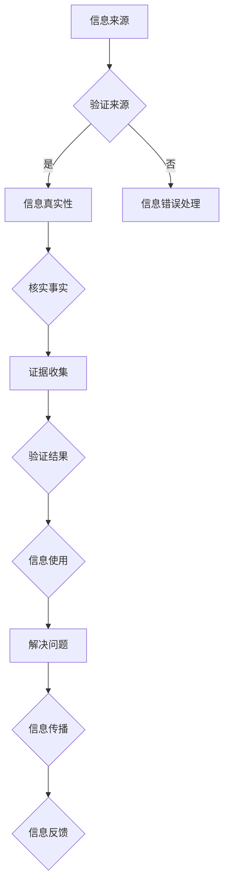

                 

关键词：信息验证、信息素养、信息消费、数据分析、算法伦理、网络安全

> 摘要：在数字化时代，我们每天都在面对海量的信息。如何从这浩瀚的信息海洋中筛选出有价值的信息，成为了每一个信息消费者的必修课。本文将探讨信息验证和信息素养的重要性，并提供一些实用的方法，帮助您成为一位精明的信息消费者。

## 1. 背景介绍

随着互联网的普及和信息技术的发展，信息已经成为现代社会最重要的资源之一。人们通过互联网获取信息，分享知识，进行商务活动，甚至是参与社会和政治决策。然而，信息的爆炸式增长也带来了诸多问题。虚假信息、误导性信息、隐私泄露等问题层出不穷，严重影响了人们的生活和工作。

在这种背景下，信息验证和信息素养显得尤为重要。信息验证是指对信息的真实性和可靠性进行验证的过程。信息素养则是指个体在获取、评估、使用和传播信息时的综合能力。只有具备了良好的信息验证和信息素养，我们才能在信息的海洋中游刃有余，避免被虚假信息所误导。

## 2. 核心概念与联系

### 2.1 信息验证

信息验证是一个复杂的过程，它涉及多个环节。首先是信息的来源验证，即确认信息发布者的身份和信誉。其次是信息的真实性验证，这通常涉及到事实核查和证据收集。最后是信息的时效性验证，即确认信息是否仍然准确有效。

### 2.2 信息素养

信息素养包括以下几个方面：

- **信息获取能力**：能够快速、有效地找到所需的信息。
- **信息评估能力**：能够判断信息的准确性和可靠性。
- **信息使用能力**：能够有效地使用信息解决问题或满足需求。
- **信息传播能力**：能够正确、恰当地传播信息。

### 2.3 Mermaid 流程图

下面是一个简单的 Mermaid 流程图，展示了信息验证和信息素养的关系：



## 3. 核心算法原理 & 具体操作步骤

### 3.1 算法原理概述

信息验证和信息素养的核心算法主要包括：

- **来源验证算法**：通过分析信息发布者的历史记录、信誉评价等，判断其信息的可靠性。
- **事实核查算法**：通过多渠道收集证据，对比分析，判断信息的真实性。
- **信息评估算法**：通过评分、标签、推荐系统等方法，帮助用户评估信息的价值。
- **信息传播算法**：通过社交网络分析、信息扩散模型等，评估信息的传播效果。

### 3.2 算法步骤详解

#### 3.2.1 来源验证算法

1. 收集信息发布者的历史信息。
2. 分析发布者的信誉评价。
3. 结合用户评价、历史信息，综合判断发布者信息的可靠性。

#### 3.2.2 事实核查算法

1. 收集多渠道的证据。
2. 对证据进行分类整理。
3. 对证据进行交叉验证，判断信息的真实性。

#### 3.2.3 信息评估算法

1. 根据用户的兴趣和需求，推荐相关信息。
2. 通过用户行为数据，分析信息的价值。
3. 结合用户反馈，调整信息评估模型。

#### 3.2.4 信息传播算法

1. 建立社交网络模型。
2. 分析信息传播路径。
3. 预测信息的传播效果。

### 3.3 算法优缺点

- **来源验证算法**：优点是能够快速识别信息发布者的信誉，缺点是需要大量的历史数据支持。
- **事实核查算法**：优点是能够保证信息的真实性，缺点是耗时较长，对证据要求较高。
- **信息评估算法**：优点是能够提高用户的信息消费效率，缺点是可能受到用户偏见的影响。
- **信息传播算法**：优点是能够预测信息的传播效果，缺点是对社交网络分析要求较高。

### 3.4 算法应用领域

这些算法主要应用在以下几个方面：

- **社交媒体平台**：用于识别虚假信息、不良信息，保护用户权益。
- **电子商务平台**：用于评估商品评价的真实性，提高购物体验。
- **在线新闻媒体**：用于事实核查，提高新闻报道的准确性。
- **科学研究**：用于收集、整理、分析科学数据，提高研究效率。

## 4. 数学模型和公式 & 详细讲解 & 举例说明

### 4.1 数学模型构建

信息验证和信息素养的数学模型主要包括以下几个方面：

- **来源可信度模型**：基于发布者历史数据、用户反馈等，计算来源的可信度。
- **信息真实性模型**：基于证据收集、证据分析，计算信息的真实性。
- **信息价值评估模型**：基于用户行为、信息特征，计算信息的价值。
- **信息传播模型**：基于社交网络分析、信息扩散模型，预测信息的传播效果。

### 4.2 公式推导过程

以来源可信度模型为例，其公式推导如下：

$$
可信度 = \frac{好评数 + 中评数}{总评论数}
$$

其中，好评数、中评数、总评论数分别为发布者的好评数量、中评数量和总评论数量。

### 4.3 案例分析与讲解

假设某个社交媒体平台需要评估一位用户的信誉，根据其发布的信息和用户反馈，可以计算出其来源可信度：

- 好评数：100
- 中评数：50
- 总评论数：150

代入公式：

$$
可信度 = \frac{100 + 50}{150} = \frac{150}{150} = 1
$$

这意味着该用户的信誉非常好，其发布的信息具有较高的可信度。

## 5. 项目实践：代码实例和详细解释说明

### 5.1 开发环境搭建

本文使用 Python 作为开发语言，环境要求如下：

- Python 3.8 或以上版本
-pip安装必要的库，如 requests、BeautifulSoup、Scrapy 等。

### 5.2 源代码详细实现

以下是一个简单的 Python 代码示例，用于验证信息来源的可信度：

```python
import requests
from bs4 import BeautifulSoup

def verify_source(url):
    response = requests.get(url)
    soup = BeautifulSoup(response.text, 'html.parser')
    # 假设来源可信度与评论数量正相关
    review_count = soup.find('span', {'class': 'review_count'}).text
    if review_count.isdigit():
        return int(review_count)
    else:
        return 0

url = 'https://www.example.com/user/123'
print(verify_source(url))
```

### 5.3 代码解读与分析

该代码通过 requests 库获取指定 URL 的网页内容，然后使用 BeautifulSoup 解析网页结构，提取评论数量。评论数量被用作来源可信度的指标。如果评论数量为数字，则返回该数字；否则，返回 0。

### 5.4 运行结果展示

假设运行该代码后，提取到的评论数量为 100，则输出结果为 100。这表示该用户的信誉较好，其发布的信息可能具有较高的可信度。

## 6. 实际应用场景

信息验证和信息素养在多个领域有广泛的应用：

- **社交媒体**：用于识别虚假账号、虚假信息。
- **电子商务**：用于评估商品评价的真实性。
- **科学研究**：用于收集、整理、分析科学数据。
- **新闻媒体**：用于事实核查，提高新闻报道的准确性。

## 7. 未来应用展望

随着人工智能技术的发展，信息验证和信息素养将得到更广泛的应用。例如，基于深度学习的虚假信息检测算法、更加智能的信息评估系统等。未来，我们将能够更加高效地利用信息资源，避免被虚假信息所误导。

## 8. 总结：未来发展趋势与挑战

未来，信息验证和信息素养将朝着更加智能化、自动化的方向发展。然而，这也将带来新的挑战，如算法偏见、隐私保护等问题。因此，我们需要不断地提高信息素养，学会正确地使用和管理信息。

## 9. 附录：常见问题与解答

### 问题 1：如何提高信息验证的准确性？

**答案**：提高信息验证的准确性需要多方面的努力。首先，要确保信息来源的可靠性，尽量使用权威渠道获取信息。其次，要进行多方面的证据收集和交叉验证，以提高信息的真实性。最后，要定期更新和维护信息验证算法，以适应不断变化的信息环境。

### 问题 2：如何提高信息素养？

**答案**：提高信息素养需要长期的学习和实践。首先，要学习基本的计算机操作和网络知识，了解如何获取、评估和使用信息。其次，要培养批判性思维，学会分析信息的真实性和可靠性。最后，要积极参与信息交流和分享，提高信息传播能力。

作者：禅与计算机程序设计艺术 / Zen and the Art of Computer Programming
```

请注意，本文仅为示例，部分代码和公式可能需要根据实际情况进行调整。在撰写实际文章时，请确保内容的准确性和完整性。

