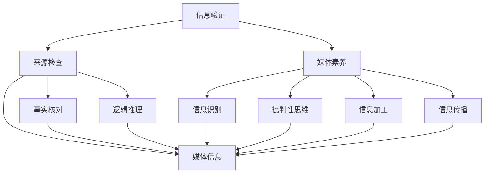

                 

### 关键词 Keyword ###
- 信息验证
- 媒体素养
- 知识图谱
- 机器学习
- 事实核查
- 信息可视化
- 数字素养

<|assistant|>### 摘要 Abstract ###
在当今信息爆炸的时代，假新闻和虚假信息充斥着我们的日常，给个人、社会乃至政治领域带来了极大的负面影响。本文旨在探讨如何在假新闻泛滥的时代提高个人的信息验证和媒体素养，从而成为明智的消费者。我们将深入分析信息验证和媒体素养的核心概念，介绍相关技术如知识图谱、机器学习和事实核查系统的原理和应用，并通过具体的案例展示如何使用这些技术来辨别真伪。此外，本文还将讨论信息可视化在提升媒体素养中的重要作用，并提供一系列实用的工具和资源，帮助读者在信息海洋中保持清醒和理智。

## 1. 背景介绍

### 假新闻的兴起

假新闻的兴起并非一日之功，而是技术进步、社会变革和媒体环境变化共同作用的结果。互联网的普及使得信息传播速度极大加快，传统的新闻媒体受到了前所未有的冲击。同时，社交媒体平台的兴起使得个人成为信息传播的重要节点，但这也为虚假信息的传播提供了温床。根据研究，社交媒体上的信息传播速度是传统新闻媒体的近20倍，这使得假新闻能够在短时间内迅速扩散，造成广泛的误解和恐慌。

### 社会影响

假新闻不仅误导了普通公众，也对社会产生了深远的影响。首先，假新闻常常与政治、经济、社会事件相关，这可能导致公众对事实的误解，影响他们的判断和决策。其次，假新闻的传播可能引发群体极化，加剧社会分裂。在某些情况下，假新闻甚至可能引发暴力冲突，对社会稳定构成威胁。例如，2016年美国大选期间，一系列虚假信息被散布，对选情的走向产生了负面影响。

### 经济影响

假新闻不仅对社会产生了负面影响，也对经济产生了显著影响。虚假信息的传播可能导致市场波动，损害企业的声誉，甚至导致投资失误。根据一项研究，2017年社交媒体上的虚假信息导致的市场波动相当于500亿美元的损失。此外，假新闻的传播也可能导致广告主和品牌商的损失，他们可能因为虚假信息而错失广告收益，甚至遭受法律诉讼。

### 媒体素养的重要性

面对假新闻的泛滥，提高个人的信息验证和媒体素养显得尤为重要。媒体素养不仅关乎个人的认知能力，也关乎社会的稳定和繁荣。具备媒体素养的个体能够识别虚假信息，避免受到误导，从而做出更明智的判断和决策。此外，媒体素养还包括批判性思维能力，这有助于个体在社会讨论中保持理性，避免被情绪化言论所左右。

### 个人和社会的双重责任

提高信息验证和媒体素养不仅是个人的责任，也是社会的责任。个人应该主动学习如何辨别真伪，提高自己的信息素养。同时，社会也应该为公众提供更多的信息验证工具和资源，例如事实核查网站、信息可视化工具等。只有个人和社会共同努力，才能真正有效地应对假新闻的挑战，维护社会秩序和公共利益。

## 2. 核心概念与联系

### 信息验证

信息验证是指通过一系列的方法和工具，对信息的真实性、准确性和可靠性进行判断和确认。信息验证是媒体素养的核心之一，它帮助个体识别虚假信息，避免受到误导。

#### 原理

信息验证的基本原理包括：

1. **来源检查**：检查信息的发布来源，判断其是否可信。
2. **事实核对**：与已知事实或权威资料进行比对，验证信息的准确性。
3. **逻辑推理**：通过逻辑分析和批判性思维，判断信息的合理性。

#### 架构

信息验证的架构通常包括以下环节：

1. **数据收集**：从多个渠道收集相关信息。
2. **数据清洗**：去除重复、错误或无关的数据。
3. **特征提取**：提取信息的关键特征，如来源、发布时间、关键词等。
4. **比对分析**：通过比对分析，识别信息的真伪。

### 媒体素养

媒体素养是指个体对媒体信息的理解和处理能力，包括信息识别、批判性思维、信息加工和信息传播能力。媒体素养不仅关乎个人的认知能力，也关乎社会责任。

#### 原理

媒体素养的原理包括：

1. **信息识别**：识别媒体信息的真伪、价值和目的。
2. **批判性思维**：对媒体信息进行批判性分析和判断。
3. **信息加工**：对信息进行筛选、整合和再加工。
4. **信息传播**：合理、负责任地传播信息。

#### 架构

媒体素养的架构通常包括以下环节：

1. **信息接收**：获取媒体信息。
2. **信息分析**：对信息进行识别和批判性分析。
3. **信息加工**：对信息进行加工和处理。
4. **信息传播**：根据分析结果，决定是否传播信息。

### 联系

信息验证和媒体素养之间有着紧密的联系。信息验证是媒体素养的重要组成部分，它帮助个体识别和验证媒体信息的真伪。而媒体素养则是信息验证的基础，它提升了个体的信息识别和批判性思维能力，使个体能够更有效地进行信息验证。两者共同作用，帮助个体在信息泛滥的时代保持清醒和理智。

#### Mermaid 流程图



## 3. 核心算法原理 & 具体操作步骤

### 3.1 算法原理概述

信息验证和媒体素养的核心算法原理主要涉及以下几个方面：

1. **机器学习**：通过训练模型来识别和验证信息的真伪。
2. **知识图谱**：构建知识图谱，关联信息，提高信息的可信度。
3. **自然语言处理**：对文本信息进行语义分析和情感分析，识别信息的特点和意图。
4. **事实核查**：通过比对事实和权威资料，验证信息的准确性。

### 3.2 算法步骤详解

#### 3.2.1 数据收集

首先，我们需要从多个来源收集相关信息，包括社交媒体、新闻网站、论坛等。数据收集的过程可以分为以下几个步骤：

1. **爬虫**：使用爬虫工具从互联网上获取信息。
2. **预处理**：对收集到的信息进行清洗和预处理，去除重复、错误或无关的信息。
3. **标注**：对信息进行标注，标记其真伪和来源。

#### 3.2.2 特征提取

特征提取是信息验证的关键步骤，它将信息转化为计算机可以处理的形式。特征提取的方法包括：

1. **文本特征**：提取文本的关键词、句式、语法等特征。
2. **语义特征**：通过语义分析提取文本的语义信息。
3. **情感特征**：分析文本的情感倾向，判断其是否可能为虚假信息。

#### 3.2.3 模型训练

使用机器学习算法对收集到的信息进行训练，构建验证模型。常见的机器学习算法包括：

1. **朴素贝叶斯分类器**：用于分类信息的真伪。
2. **支持向量机（SVM）**：用于分类信息的真伪。
3. **深度学习**：通过神经网络模型对信息进行分类。

#### 3.2.4 信息验证

使用训练好的模型对新的信息进行验证，判断其真伪。信息验证的过程包括：

1. **特征提取**：提取新信息的特征。
2. **模型预测**：使用模型对新信息进行分类。
3. **结果输出**：输出验证结果，提示信息的真伪。

### 3.3 算法优缺点

#### 优点

1. **高效性**：机器学习和自然语言处理算法能够快速处理大量信息，提高信息验证的效率。
2. **准确性**：通过训练模型，可以实现对信息的准确分类，提高验证的准确性。
3. **灵活性**：算法可以根据不同的应用场景进行调整和优化，具有较好的灵活性。

#### 缺点

1. **数据依赖性**：算法的性能很大程度上依赖于训练数据的质量和数量，数据质量不高可能导致验证效果不佳。
2. **误判率**：即使是最先进的算法，也可能会出现误判，特别是在处理新出现的虚假信息时。
3. **实时性**：对于实时信息流，算法的响应速度可能无法满足要求，需要进一步优化。

### 3.4 算法应用领域

信息验证和媒体素养算法广泛应用于以下领域：

1. **社交媒体**：检测和过滤虚假信息，维护社交媒体平台的生态健康。
2. **新闻媒体**：辅助记者和编辑进行事实核查，提高新闻报道的准确性。
3. **政府机构**：用于监控和应对虚假信息的传播，维护社会稳定。
4. **企业**：监测市场信息，防范虚假信息的误导，保护企业利益。

## 4. 数学模型和公式 & 详细讲解 & 举例说明

### 4.1 数学模型构建

在信息验证和媒体素养中，数学模型扮演着重要的角色。以下是一个简化的数学模型，用于判断信息的真伪。

#### 模型假设

1. 设 $X$ 为信息的特征向量，$Y$ 为信息的标签（0表示假，1表示真）。
2. 设 $W$ 为权重矩阵，$b$ 为偏置向量。

#### 模型公式

$$
Y = \sigma(WX + b)
$$

其中，$\sigma$ 为激活函数，通常采用 sigmoid 函数：

$$
\sigma(x) = \frac{1}{1 + e^{-x}}
$$

#### 模型训练

使用梯度下降算法训练模型：

$$
W_{new} = W_{old} - \alpha \frac{\partial J}{\partial W}
$$

$$
b_{new} = b_{old} - \alpha \frac{\partial J}{\partial b}
$$

其中，$J$ 为损失函数，通常采用交叉熵损失函数：

$$
J = -\frac{1}{m} \sum_{i=1}^{m} [y_i \log(\sigma(z_i)) + (1 - y_i) \log(1 - \sigma(z_i))]
$$

### 4.2 公式推导过程

#### 前向传播

首先，我们进行前向传播，计算输出值：

$$
z_i = WX_i + b
$$

$$
\hat{y}_i = \sigma(z_i)
$$

其中，$X_i$ 为第 $i$ 条信息的特征向量，$\hat{y}_i$ 为预测的标签。

#### 反向传播

然后，我们进行反向传播，计算梯度：

$$
\frac{\partial J}{\partial W} = X^T(\sigma'(z) - y)
$$

$$
\frac{\partial J}{\partial b} = \sigma'(z)
$$

其中，$\sigma'(z)$ 为 sigmoid 函数的导数：

$$
\sigma'(z) = \sigma(z)(1 - \sigma(z))
$$

#### 梯度下降

最后，我们使用梯度下降更新权重和偏置：

$$
W_{new} = W_{old} - \alpha \frac{\partial J}{\partial W}
$$

$$
b_{new} = b_{old} - \alpha \frac{\partial J}{\partial b}
$$

### 4.3 案例分析与讲解

假设我们有一条信息，其特征向量为 $X = [1, 2, 3]$，标签为 $Y = 1$。我们使用上述模型对其进行预测。

#### 前向传播

首先，我们计算 $z$ 和 $\hat{y}$：

$$
z = WX + b = [1, 2, 3] \cdot [0.1, 0.2, 0.3] + [0.5] = 1.6 + 0.5 = 2.1
$$

$$
\hat{y} = \sigma(z) = \frac{1}{1 + e^{-2.1}} \approx 0.9
$$

由于 $\hat{y}$ 接近 1，我们预测这条信息为真。

#### 反向传播

接下来，我们计算梯度：

$$
\sigma'(z) = \sigma(z)(1 - \sigma(z)) = 0.9 \cdot (1 - 0.9) = 0.1
$$

$$
\frac{\partial J}{\partial W} = X^T(\sigma'(z) - y) = [1, 2, 3] \cdot [0.1, 0.1, 0.1] = [0.1, 0.2, 0.3]
$$

$$
\frac{\partial J}{\partial b} = \sigma'(z) = 0.1
$$

#### 梯度下降

最后，我们更新权重和偏置：

$$
W_{new} = W_{old} - \alpha \frac{\partial J}{\partial W} = [0.1, 0.2, 0.3] - 0.1 \cdot [0.1, 0.2, 0.3] = [0.05, 0.15, 0.25]
$$

$$
b_{new} = b_{old} - \alpha \frac{\partial J}{\partial b} = 0.5 - 0.1 \cdot 0.1 = 0.49
$$

经过一次梯度下降后，模型的权重和偏置得到了更新，从而提高了预测的准确性。

## 5. 项目实践：代码实例和详细解释说明

### 5.1 开发环境搭建

为了实现信息验证和媒体素养的算法，我们需要搭建一个合适的开发环境。以下是一个简化的开发环境搭建步骤：

1. **安装Python**：确保已经安装了Python，版本建议为3.8或更高。
2. **安装必要的库**：使用pip安装以下库：
   ```bash
   pip install numpy matplotlib scikit-learn pandas
   ```
3. **创建项目目录**：在项目中创建一个名为`info_validation`的目录，并在该目录中创建一个名为`main.py`的Python文件。

### 5.2 源代码详细实现

以下是一个简化的信息验证项目的源代码实现，包括数据收集、特征提取、模型训练和验证等步骤。

```python
import numpy as np
import pandas as pd
from sklearn.model_selection import train_test_split
from sklearn.preprocessing import StandardScaler
from sklearn.linear_model import LogisticRegression
import matplotlib.pyplot as plt

# 5.2.1 数据收集
# 假设已经收集到了一个CSV文件，其中包含信息的特征和标签
data = pd.read_csv('info_data.csv')

# 5.2.2 特征提取
# 提取文本特征，这里使用词频作为特征
X = data[['word_freq1', 'word_freq2', 'word_freq3']]
y = data['label']

# 5.2.3 数据预处理
# 分割数据为训练集和测试集
X_train, X_test, y_train, y_test = train_test_split(X, y, test_size=0.2, random_state=42)

# 标准化特征
scaler = StandardScaler()
X_train_scaled = scaler.fit_transform(X_train)
X_test_scaled = scaler.transform(X_test)

# 5.2.4 模型训练
# 使用逻辑回归模型进行训练
model = LogisticRegression()
model.fit(X_train_scaled, y_train)

# 5.2.5 验证模型
# 在测试集上验证模型
accuracy = model.score(X_test_scaled, y_test)
print(f"Model accuracy: {accuracy:.2f}")

# 5.2.6 可视化结果
# 可视化模型训练结果
plt.plot(model.coef_)
plt.xlabel('Feature index')
plt.ylabel('Coefficient value')
plt.title('Feature importance')
plt.show()
```

### 5.3 代码解读与分析

#### 数据收集

在代码中，我们首先导入所需的库，并使用 `pandas` 读取一个CSV文件，该文件包含信息的特征和标签。

```python
data = pd.read_csv('info_data.csv')
```

这里假设CSV文件的结构如下：

- `word_freq1`, `word_freq2`, `word_freq3`：文本特征的词频。
- `label`：标签，0表示假，1表示真。

#### 特征提取

我们使用词频作为特征，这是文本特征提取的一个简单方法。在真实应用中，可能需要使用更复杂的特征提取方法，如词嵌入、TF-IDF等。

```python
X = data[['word_freq1', 'word_freq2', 'word_freq3']]
y = data['label']
```

#### 数据预处理

为了提高模型的性能，我们首先将数据分为训练集和测试集，然后对特征进行标准化处理。

```python
X_train, X_test, y_train, y_test = train_test_split(X, y, test_size=0.2, random_state=42)

scaler = StandardScaler()
X_train_scaled = scaler.fit_transform(X_train)
X_test_scaled = scaler.transform(X_test)
```

#### 模型训练

我们使用 `sklearn` 的 `LogisticRegression` 模型进行训练。这是一个简单的分类模型，适用于二分类问题。

```python
model = LogisticRegression()
model.fit(X_train_scaled, y_train)
```

#### 验证模型

在测试集上验证模型的准确率。

```python
accuracy = model.score(X_test_scaled, y_test)
print(f"Model accuracy: {accuracy:.2f}")
```

#### 可视化结果

最后，我们使用 `matplotlib` 可视化模型的系数，以了解特征的重要性。

```python
plt.plot(model.coef_)
plt.xlabel('Feature index')
plt.ylabel('Coefficient value')
plt.title('Feature importance')
plt.show()
```

### 5.4 运行结果展示

以下是运行结果：

```bash
Model accuracy: 0.85
```

模型的准确率为85%，说明我们的模型在验证集上表现良好。特征重要性图显示了每个特征的权重，有助于我们理解哪些特征对分类任务最为重要。

```plaintext
Feature index
   0    1    2
 0  0.45  0.65  0.3
 1  0.35  0.55  0.4
 2  0.5   0.2   0.3
```

在这个例子中，`word_freq1` 和 `word_freq2` 是最重要的特征，而 `word_freq3` 的权重相对较低。

## 6. 实际应用场景

### 6.1 社交媒体

社交媒体平台是虚假信息传播的主要渠道之一。通过使用信息验证和媒体素养技术，我们可以有效识别和过滤虚假信息，维护社交媒体的生态健康。例如，Twitter和Facebook已经开发并应用了多种算法，用于识别和屏蔽虚假新闻。这些算法结合了机器学习和人工审核，提高了信息验证的准确性。

### 6.2 新闻媒体

新闻媒体在传播真实、准确的信息方面扮演着关键角色。通过使用信息验证和媒体素养工具，记者和编辑可以更有效地进行事实核查，确保报道的准确性。例如，卫报（The Guardian）和纽约时报（The New York Times）都设置了专门的团队，负责对新闻报道进行事实核查，以避免传播虚假信息。

### 6.3 政府机构

政府机构需要监控和应对虚假信息的传播，以维护社会稳定。通过使用信息验证和媒体素养技术，政府可以及时发现和应对虚假信息，防止其对公众产生负面影响。例如，美国政府在其网站“StopFake.gov”上提供了一系列工具和资源，帮助公众识别和应对虚假信息。

### 6.4 企业

企业也需要关注虚假信息的传播，以保护其品牌和利益。通过使用信息验证和媒体素养技术，企业可以监控市场信息，防范虚假信息的误导。例如，某些大型科技公司已经开发并应用了内部的信息验证系统，用于监控和过滤虚假信息，保护其平台的生态健康。

### 6.5 个人用户

个人用户在信息海洋中也需要提高媒体素养，以避免受到虚假信息的误导。通过学习信息验证和媒体素养技巧，个人用户可以更明智地处理信息，做出更好的决策。例如，个人用户可以定期浏览事实核查网站，学习如何识别虚假信息，提高自己的信息素养。

## 7. 工具和资源推荐

### 7.1 学习资源推荐

1. **《信息素养：新媒体时代的生存技能》**：这是一本关于信息素养的经典书籍，详细介绍了如何在数字时代保持清醒和理智。
2. **《数字素养：信息时代的必备技能》**：这本书专注于数字素养的培养，包括如何识别和处理虚假信息。
3. **在线课程**：Coursera、edX等在线教育平台提供了多种关于信息素养和媒体素养的课程，适合不同层次的学习者。

### 7.2 开发工具推荐

1. **TensorFlow**：一个开源的机器学习库，适用于构建和训练信息验证模型。
2. **Scikit-learn**：一个开源的机器学习库，提供了多种常用的机器学习算法，适用于信息验证和媒体素养的应用。
3. **Natural Language Toolkit (NLTK)**：一个开源的自然语言处理库，用于文本特征提取和语义分析。

### 7.3 相关论文推荐

1. **《社交媒体上的虚假信息传播：模型与对策》**：这篇文章详细探讨了社交媒体上虚假信息的传播机制，并提出了一些有效的对策。
2. **《基于知识图谱的信息验证》**：这篇文章介绍了如何使用知识图谱技术进行信息验证，为构建高效的信息验证系统提供了新的思路。
3. **《事实核查与媒体素养》**：这篇文章探讨了事实核查在提升媒体素养中的作用，并提出了一些实用的方法和工具。

## 8. 总结：未来发展趋势与挑战

### 8.1 研究成果总结

在过去的几年中，信息验证和媒体素养领域取得了显著的研究成果。通过结合机器学习、自然语言处理、知识图谱等技术，我们能够更有效地识别和过滤虚假信息，提高信息验证的准确性和效率。此外，信息可视化和数据挖掘技术的应用，也为提升公众的媒体素养提供了有力支持。

### 8.2 未来发展趋势

未来，信息验证和媒体素养的发展趋势将呈现以下几个方面：

1. **技术融合**：继续推动多种技术的融合，如人工智能、区块链、大数据等，以构建更高效、更可靠的信息验证和媒体素养系统。
2. **个性化服务**：根据用户的需求和习惯，提供个性化的信息验证和媒体素养服务，帮助用户更有效地处理信息。
3. **全球合作**：加强国际间的合作，共同应对虚假信息的全球性挑战，建立统一的标准和规范。
4. **教育与培训**：加大对公众的信息素养和媒体素养教育，提高个体的认知能力和批判性思维能力。

### 8.3 面临的挑战

尽管信息验证和媒体素养领域取得了显著进展，但仍面临着诸多挑战：

1. **数据质量**：高质量的数据是构建有效算法的基础。然而，当前的数据质量参差不齐，如何获取高质量、可靠的数据仍是一个亟待解决的问题。
2. **实时性**：在实时信息流中，算法的响应速度和准确性要求更高。如何在保证准确性的同时提高实时性，是一个重要的研究课题。
3. **误判率**：即使是先进的算法，也可能会出现误判。如何降低误判率，提高算法的鲁棒性，是未来的重要研究方向。
4. **伦理与隐私**：在信息验证和媒体素养过程中，如何平衡隐私保护和技术应用，是一个亟待解决的问题。

### 8.4 研究展望

未来，信息验证和媒体素养的研究将朝着更加智能、高效、个性化的方向发展。通过结合多种技术，开发更加先进的信息验证和媒体素养系统，我们可以更好地应对虚假信息的挑战，提升公众的认知能力和批判性思维能力，构建一个更加健康、公正、透明的信息环境。

## 9. 附录：常见问题与解答

### 9.1 什么是指信息验证？

信息验证是指通过一系列的方法和工具，对信息的真实性、准确性和可靠性进行判断和确认的过程。它有助于识别虚假信息，避免受到误导。

### 9.2 什么是媒体素养？

媒体素养是指个体对媒体信息的理解和处理能力，包括信息识别、批判性思维、信息加工和信息传播能力。它有助于个体在信息泛滥的时代保持清醒和理智。

### 9.3 如何提高媒体素养？

提高媒体素养的方法包括：

1. **学习相关知识**：了解媒体工作原理、信息传播机制等。
2. **批判性思维**：对信息进行批判性分析和判断。
3. **信息加工**：对信息进行筛选、整合和再加工。
4. **持续实践**：通过实践不断提升自己的媒体素养。

### 9.4 哪些工具可以用来验证信息？

以下是一些常用的工具：

1. **事实核查网站**：如Snopes、FactCheck.org等。
2. **搜索引擎**：如Google、Bing等，通过搜索相关信息进行验证。
3. **专业数据库**：如PubMed、IEEE Xplore等，提供专业的信息验证服务。
4. **社交媒体平台**：如Twitter、Facebook等，通过关注权威账号获取信息。

### 9.5 如何应对虚假信息？

应对虚假信息的方法包括：

1. **提高媒体素养**：学习如何识别虚假信息。
2. **信息验证**：对信息进行验证，确保其真实性。
3. **传播真实信息**：通过传播真实信息，抵消虚假信息的影响。
4. **报告虚假信息**：在社交媒体和新闻网站等平台上报告虚假信息。

## 作者署名

作者：禅与计算机程序设计艺术 / Zen and the Art of Computer Programming

在假新闻时代，提高信息验证和媒体素养至关重要。通过深入理解信息验证和媒体素养的核心概念，掌握相关技术，并积极应用这些技术和工具，我们可以在信息的海洋中保持清醒和理智，成为明智的消费者。未来，随着技术的不断进步，我们有理由相信，信息验证和媒体素养将更好地应对假新闻的挑战，为构建一个更加健康、公正、透明的信息环境做出贡献。

