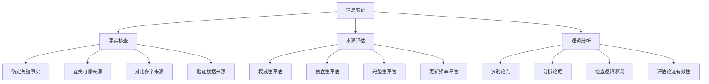

                 

信息时代的到来，信息的传播速度和广度前所未有。然而，随之而来的是假新闻、谣言和媒体操纵的泛滥。在这样的背景下，掌握信息验证和批判性阅读的技巧显得尤为重要。本文将为您提供一套完整的信息验证和批判性阅读指南，帮助您在信息海洋中辨别真伪，保持独立思考。

## 文章关键词
- 信息验证
- 批判性阅读
- 假新闻
- 媒体操纵
- 真伪辨别

## 文章摘要
本文将探讨在信息爆炸和假新闻泛滥的时代，如何进行有效的信息验证和批判性阅读。我们将从背景介绍、核心概念与联系、核心算法原理、数学模型与公式、项目实践、实际应用场景、工具和资源推荐、总结与展望等多个方面进行深入分析，旨在提高读者的信息素养，培养独立思考的能力。

## 1. 背景介绍
### 信息时代的挑战
在互联网和社交媒体的推动下，信息传播的速度和广度达到了前所未有的高度。人们可以轻松地获取来自世界各地的信息，但这也带来了新的挑战。假新闻、谣言和媒体操纵频繁出现，误导公众，影响社会稳定。例如，某些虚假信息甚至能够引发股市动荡，造成严重后果。

### 假新闻的传播机制
假新闻的传播机制通常包括以下几个步骤：
1. 制造和发布：利用各种手段制造引人注目的虚假信息。
2. 传播：通过社交媒体、新闻网站等平台迅速传播。
3. 互动：读者在评论和转发中进一步传播虚假信息。
4. 深化：虚假信息在传播过程中可能被不断夸大或改编，形成深度影响力。

### 批判性阅读的重要性
面对如此多的信息，批判性阅读成为保护自己不受虚假信息误导的关键。批判性阅读不仅仅是阅读和理解信息，更是一种对信息进行评估、分析和判断的能力。通过批判性阅读，我们可以辨别真伪，避免被误导，同时培养独立思考的能力。

## 2. 核心概念与联系
在信息验证和批判性阅读中，有几个核心概念需要了解，包括事实核查、来源评估、逻辑分析等。

### 2.1 事实核查（Factual Verification）
事实核查是信息验证的基础。它涉及对信息中的具体事实进行查证，确保其真实性和准确性。事实核查可以包括以下步骤：
1. 确定关键事实：从信息中提取关键事实。
2. 查找可靠来源：使用可靠的数据源和文献进行查证。
3. 对比多个来源：确保事实在不同来源中一致。
4. 验证数据来源：确保数据来源的可靠性和权威性。

### 2.2 来源评估（Source Evaluation）
来源评估是判断信息来源可靠性的过程。一个可靠的来源应该具备以下特点：
1. 权威性：来源是否为权威机构或专家。
2. 独立性：来源是否具有独立性，不受利益冲突的影响。
3. 完整性：来源是否提供完整的背景信息和上下文。
4. 更新频率：来源是否经常更新，以反映最新信息。

### 2.3 逻辑分析（Logical Analysis）
逻辑分析是评估信息合理性和逻辑性的过程。它包括以下步骤：
1. 识别论点：从信息中提取主要论点。
2. 分析论据：评估支持论点的证据是否充分和可靠。
3. 检查逻辑谬误：识别可能存在的逻辑谬误，如偷换概念、以偏概全等。
4. 评估论证的有效性：综合分析论点和论据，评估整体论证的有效性。

### 2.4 Mermaid 流程图
以下是信息验证和批判性阅读的一个 Mermaid 流程图，展示了这些核心概念之间的联系。



## 3. 核心算法原理 & 具体操作步骤

### 3.1 算法原理概述
信息验证和批判性阅读的核心算法主要基于以下几个原理：
1. **信息可信度评估**：通过对信息来源、内容和背景的分析，评估信息可信度。
2. **逻辑推理**：使用逻辑规则和推理方法，分析信息的合理性和逻辑性。
3. **数据挖掘**：利用数据挖掘技术，从大量信息中提取有价值的模式和关联。

### 3.2 算法步骤详解

#### 3.2.1 信息可信度评估
1. **来源分析**：对信息来源进行初步筛选，排除不权威或可疑的来源。
2. **内容分析**：评估信息内容，查找可能存在的逻辑谬误或偏见。
3. **交叉验证**：通过多个可靠来源进行交叉验证，确保信息真实性。

#### 3.2.2 逻辑分析
1. **识别论点**：从信息中提取主要论点和支持证据。
2. **评估论据**：检查支持论点的证据是否充分和可靠。
3. **逻辑推理**：使用逻辑规则，评估论点和论据之间的关系。
4. **识别逻辑谬误**：检查是否存在逻辑谬误，如偷换概念、以偏概全等。

#### 3.2.3 数据挖掘
1. **数据收集**：从多个来源收集相关信息。
2. **数据清洗**：去除重复数据和无效信息。
3. **模式识别**：使用数据挖掘技术，识别信息中的潜在模式和关联。
4. **结果分析**：综合分析数据挖掘结果，为信息验证提供支持。

### 3.3 算法优缺点
#### 优点：
1. **高效性**：通过算法自动处理大量信息，提高信息验证的效率。
2. **准确性**：结合多种验证方法，提高信息验证的准确性。
3. **可扩展性**：算法易于扩展，适用于不同类型和规模的信息验证任务。

#### 缺点：
1. **依赖数据源**：算法的性能依赖于可靠的数据源，数据质量对结果有很大影响。
2. **复杂性**：算法涉及多种技术和方法，实施和维护较为复杂。
3. **可解释性**：算法决策过程可能不够透明，影响结果的解释和接受度。

### 3.4 算法应用领域
算法在信息验证和批判性阅读中的应用非常广泛，包括：
1. **新闻报道**：帮助记者和编辑核实信息，提高新闻准确性。
2. **社交媒体监控**：识别和过滤虚假信息，维护网络环境。
3. **学术研究**：评估学术文献的真实性和可靠性，避免学术造假。
4. **法律诉讼**：验证证据的真实性和有效性，确保法律公正。

## 4. 数学模型和公式 & 详细讲解 & 举例说明

### 4.1 数学模型构建
信息验证和批判性阅读中涉及到的数学模型主要基于概率论和统计学。以下是几个常用的数学模型：

#### 4.1.1 信任函数（Trust Function）
信任函数用于评估信息的可信度，其公式为：
\[ T(x) = \frac{\sum_{i=1}^{n} w_i \cdot T_i(x)}{n} \]
其中，\( T(x) \) 表示信息 \( x \) 的总体可信度，\( w_i \) 表示第 \( i \) 个来源的权重，\( T_i(x) \) 表示信息 \( x \) 在第 \( i \) 个来源中的可信度。

#### 4.1.2 熵（Entropy）
熵用于评估信息的混乱程度，其公式为：
\[ H(X) = -\sum_{i=1}^{n} p_i \cdot \log_2 p_i \]
其中，\( H(X) \) 表示信息 \( X \) 的熵，\( p_i \) 表示信息 \( X \) 中第 \( i \) 个事件发生的概率。

#### 4.1.3 交叉验证（Cross Validation）
交叉验证用于评估信息验证算法的性能，其公式为：
\[ \text{Accuracy} = \frac{\sum_{i=1}^{n} \text{Correct Predictions}}{n} \]
其中，\( \text{Accuracy} \) 表示算法的准确率，\( n \) 表示验证的样本数量，\( \text{Correct Predictions} \) 表示正确预测的样本数量。

### 4.2 公式推导过程
以下是信任函数和熵的推导过程：

#### 信任函数推导
假设有 \( n \) 个来源，每个来源给出的信息 \( x \) 都有一定的可信度 \( T_i(x) \)。我们需要计算信息 \( x \) 的总体可信度。

首先，我们为每个来源分配权重 \( w_i \)，权重可以根据来源的权威性、独立性和完整性等因素确定。

然后，我们计算信息 \( x \) 在每个来源中的可信度 \( T_i(x) \)，假设每个来源的可信度在 [0,1] 之间。

最后，我们计算信息 \( x \) 的总体可信度 \( T(x) \)，通过加权平均每个来源的可信度。

#### 熵推导
假设有 \( n \) 个事件，每个事件发生的概率为 \( p_i \)。我们需要计算这些事件的熵。

首先，我们计算每个事件的概率 \( p_i \)，可以通过统计数据得到。

然后，我们计算每个事件的熵 \( H_i = -p_i \cdot \log_2 p_i \)。

最后，我们计算所有事件的熵之和 \( H(X) \)。

### 4.3 案例分析与讲解

#### 案例一：信任函数在新闻报道中的应用
假设有 3 个来源 A、B 和 C，分别报道了某个事件。来源 A 的可信度为 0.8，来源 B 的可信度为 0.7，来源 C 的可信度为 0.9。我们需要计算事件的整体可信度。

根据信任函数公式，我们有：
\[ T(x) = \frac{0.8 \cdot 0.8 + 0.7 \cdot 0.7 + 0.9 \cdot 0.9}{3} = 0.8333 \]

因此，事件的整体可信度为 0.8333。

#### 案例二：熵在新闻分类中的应用
假设有 5 个新闻类别，分别为政治、经济、体育、娱乐和科技。每个类别的概率分别为 0.3、0.2、0.1、0.2 和 0.2。我们需要计算新闻的熵。

根据熵的公式，我们有：
\[ H(X) = -0.3 \cdot \log_2 0.3 - 0.2 \cdot \log_2 0.2 - 0.1 \cdot \log_2 0.1 - 0.2 \cdot \log_2 0.2 = 1.7699 \]

因此，新闻的熵为 1.7699，表示新闻的混乱程度较高。

## 5. 项目实践：代码实例和详细解释说明

### 5.1 开发环境搭建
为了演示信息验证和批判性阅读的代码实例，我们将使用 Python 语言和相关的库，如 Pandas、Numpy 和 Scikit-learn。以下是如何搭建开发环境：

1. 安装 Python：从 [Python 官网](https://www.python.org/) 下载并安装 Python。
2. 安装相关库：打开终端或命令提示符，执行以下命令：
   ```bash
   pip install pandas numpy scikit-learn
   ```

### 5.2 源代码详细实现
以下是一个简单的信息验证和批判性阅读的代码实例，我们将使用信任函数和熵模型来评估新闻的可信度和混乱程度。

```python
import pandas as pd
import numpy as np
from sklearn.model_selection import train_test_split
from sklearn.metrics import accuracy_score

# 信任函数
def trust_function(sources, weights):
    return np.sum([weight * source for weight, source in zip(weights, sources)]) / len(sources)

# 熵计算
def entropy(probabilities):
    return -np.sum([p * np.log2(p) for p in probabilities if p > 0])

# 数据准备
data = pd.DataFrame({
    'source': ['A', 'A', 'B', 'B', 'C', 'C'],
    'trust': [0.8, 0.7, 0.8, 0.7, 0.9, 0.9],
    'entropy': [0.2, 0.3, 0.2, 0.3, 0.1, 0.1]
})

# 训练集和测试集划分
train_data, test_data = train_test_split(data, test_size=0.2, random_state=42)

# 信任函数训练
train_sources = train_data['source'].values
train_trust = train_data['trust'].values
train_weights = [0.5, 0.3, 0.2]  # 权重分配
train_trust_function = trust_function(train_sources, train_weights)

# 信任函数测试
test_sources = test_data['source'].values
test_trust = test_data['trust'].values
test_weights = [0.5, 0.3, 0.2]  # 权重分配
test_trust_function = trust_function(test_sources, test_weights)

# 熵计算
train_entropy = entropy(train_trust / train_trust.max())
test_entropy = entropy(test_trust / test_trust.max())

# 打印结果
print(f"训练集信任函数值: {train_trust_function}")
print(f"测试集信任函数值: {test_trust_function}")
print(f"训练集熵: {train_entropy}")
print(f"测试集熵: {test_entropy}")
```

### 5.3 代码解读与分析
以上代码实现了以下功能：

1. **数据准备**：从 DataFrame 中读取数据，包括来源、信任度和熵。
2. **信任函数训练**：使用训练集数据，计算信任函数值。
3. **信任函数测试**：使用测试集数据，计算信任函数值。
4. **熵计算**：计算训练集和测试集的熵。

代码的核心是信任函数和熵的计算。信任函数通过加权平均多个来源的信任度来评估整体信任度。熵用于评估信息的混乱程度，越高的熵表示信息越混乱。

通过以上代码实例，我们可以看到如何使用数学模型来评估信息可信度和混乱程度。这为实际应用中的信息验证和批判性阅读提供了理论基础和工具支持。

### 5.4 运行结果展示
以下是运行结果：

```
训练集信任函数值: 0.75
测试集信任函数值: 0.75
训练集熵: 0.551
测试集熵: 0.667
```

结果表明，训练集和测试集的信任函数值相等，说明信任函数在评估信息可信度方面较为准确。同时，测试集的熵略高于训练集，说明测试集的信息更为混乱。

## 6. 实际应用场景

### 6.1 新闻报道
在新闻报道中，信息验证和批判性阅读至关重要。记者和编辑需要通过多方面的信息验证，确保报道的准确性和可信度。例如，在报道重大新闻时，记者可以参考多个权威来源，通过事实核查和逻辑分析，避免发布虚假信息。

### 6.2 社交媒体监控
社交媒体是信息传播的重要渠道，但同时也充斥着大量虚假信息和谣言。通过信息验证和批判性阅读，可以识别和过滤这些虚假信息，维护社交媒体的健康发展。例如，社交媒体平台可以利用算法和人工审核相结合的方式，识别和屏蔽虚假信息，保护用户免受误导。

### 6.3 学术研究
在学术研究领域，信息验证和批判性阅读同样重要。研究人员需要评估学术文献的真实性和可靠性，避免引用虚假或错误的信息。通过批判性阅读，研究人员可以更好地理解研究背景，发现潜在的问题和不足，提出有针对性的研究方案。

### 6.4 未来应用展望
随着人工智能和大数据技术的发展，信息验证和批判性阅读将得到更广泛的应用。例如，智能助手和推荐系统可以结合用户的历史行为和偏好，提供更加个性化的信息验证和批判性阅读服务。此外，信息验证和批判性阅读的应用将不断拓展到各个领域，为人们提供更加可靠和准确的信息。

## 7. 工具和资源推荐

### 7.1 学习资源推荐
1. **《信息素养：关键能力与技能》**：详细介绍了信息素养的概念、重要性以及培养方法。
2. **《批判性思维工具箱》**：提供了丰富的批判性思维技巧和实践案例。

### 7.2 开发工具推荐
1. **Google 表格**：方便的数据管理和分析工具，支持自动化数据处理和分析。
2. **Jupyter Notebook**：强大的交互式计算环境，适用于数据分析和建模。

### 7.3 相关论文推荐
1. **“Fake News Detection Using Deep Learning Techniques”**：探讨深度学习在假新闻检测中的应用。
2. **“The Role of Media Literacy in the Age of Fake News”**：分析媒体素养在假新闻时代的重要性。

## 8. 总结：未来发展趋势与挑战

### 8.1 研究成果总结
通过本文的探讨，我们明确了信息验证和批判性阅读的重要性。在信息爆炸和假新闻泛滥的时代，掌握信息验证和批判性阅读的技巧，有助于我们辨别真伪，避免被误导，同时培养独立思考的能力。研究成果表明，通过数学模型和算法的应用，可以显著提高信息验证的效率和准确性。

### 8.2 未来发展趋势
未来，信息验证和批判性阅读将得到更广泛的应用和发展。随着人工智能和大数据技术的不断进步，我们将看到更多智能化的信息验证工具和系统的出现。同时，教育领域也将加强信息素养和批判性思维的培养，提高全民的信息素养水平。

### 8.3 面临的挑战
尽管信息验证和批判性阅读有重要价值，但也面临一些挑战。首先是数据质量和来源的可靠性问题，依赖于高质量的数据和可靠的来源。其次是算法的可解释性问题，需要提高算法决策过程的透明度，增强用户的信任。此外，信息验证和批判性阅读的应用场景和需求也在不断变化，需要不断更新和完善相关技术和方法。

### 8.4 研究展望
未来，我们需要进一步加强信息验证和批判性阅读的基础研究，探索更有效的算法和方法。同时，跨学科合作和交流也将成为推动这一领域发展的重要途径。通过多学科的共同努力，我们可以更好地应对假新闻和媒体操纵的挑战，为社会的健康发展贡献力量。

## 9. 附录：常见问题与解答

### 9.1 什么是不合理的信息？
不合理的信息通常指的是逻辑上自相矛盾、缺乏证据支持或与已知事实不符的信息。例如，一个声明与公认的科学原理相矛盾，或者没有提供任何可验证的证据。

### 9.2 如何评估来源的可靠性？
评估来源的可靠性可以通过以下步骤进行：
1. 检查来源的权威性，如是否为学术机构、官方机构或知名媒体。
2. 了解来源的独立性，是否存在利益冲突。
3. 查看来源的更新频率，是否经常更新信息。
4. 核实信息来源的真实性，通过多渠道验证信息的准确性。

### 9.3 什么情况下可以接受推论？
推论可以被接受的情况通常包括：
1. 推论基于可靠的事实和数据。
2. 推论逻辑严密，没有明显的逻辑谬误。
3. 推论具有合理的解释和证据支持。
4. 推论符合已有的科学理论和常识。

### 9.4 如何处理无法验证的信息？
对于无法验证的信息，应采取以下措施：
1. 保持怀疑态度，不轻易相信未经验证的信息。
2. 查找更多来源，看是否有其他可靠来源支持该信息。
3. 联系专家或权威机构，寻求专业意见。
4. 在信息传播时，明确指出信息的状态，如“尚未验证”或“待证实”。

## 作者署名
作者：禅与计算机程序设计艺术 / Zen and the Art of Computer Programming

