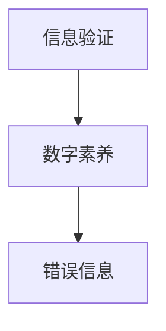

                 

 在当前数字化时代，信息无处不在，然而，错误信息也同样广泛流传。如何在这个信息泛滥的时代中辨别真伪、提升数字素养，成为了每个人必须面对的挑战。本文旨在探讨信息验证的方法和数字素养的重要性，帮助读者在错误信息的大海中导航。

> **关键词：** 信息验证，数字素养，错误信息，信息素养，网络素养

> **摘要：** 本文首先介绍了信息验证的概念和重要性，随后分析了当前错误信息的传播机制，探讨了提升数字素养的方法和策略。最后，文章提出了未来信息验证和数字素养发展的趋势与挑战。

## 1. 背景介绍

随着互联网的迅猛发展，信息的传播速度和广度前所未有。然而，信息的真实性和准确性却难以保证。错误信息的传播不仅对个人生活造成困扰，也可能对社会稳定产生负面影响。因此，信息验证成为了一个关键问题。数字素养则是指个体在数字化环境中获取、评估、使用和创造信息的能力，其提升对个人和社会的发展具有重要意义。

## 2. 核心概念与联系

为了更好地理解信息验证和数字素养，我们需要构建一个概念框架，包括以下核心概念：

- **信息验证：** 确认信息的真实性、准确性和可靠性的过程。
- **数字素养：** 在数字化环境中获取、评估、使用和创造信息的能力。
- **错误信息：** 不真实、不准确或误导性的信息。

以下是一个简化的 Mermaid 流程图，展示了这三个概念之间的联系：



### 2.1 信息验证的定义与重要性

信息验证是一个复杂的过程，它涉及对信息的来源、内容、时间和语境的审查。信息验证的重要性在于它能够帮助个体避免因错误信息造成的误导和损失。

### 2.2 数字素养的概念与构成

数字素养包括信息素养、技术素养和媒体素养三个方面。信息素养是指识别、评估和使用信息的能力；技术素养是指使用计算机和其他数字技术的能力；媒体素养是指理解和评估媒体信息的能力。

### 2.3 错误信息的传播机制

错误信息的传播机制主要包括以下几种：

- **误传：** 信息在传播过程中被无意中改变。
- **谣言：** 故意传播的虚假信息。
- **误导：** 信息内容被有意歪曲。

## 3. 核心算法原理 & 具体操作步骤

### 3.1 算法原理概述

信息验证的核心算法原理是基于概率论和图论的方法，通过分析信息源的可信度、信息内容的相关性和传播路径的稳定性，来评估信息的真实性和准确性。

### 3.2 算法步骤详解

1. **收集信息：** 从多个来源收集相关信息。
2. **评估信息源：** 分析信息源的可信度。
3. **内容分析：** 对信息内容进行逻辑和事实核查。
4. **传播路径分析：** 确定信息的传播路径和传播速度。
5. **综合评估：** 根据上述分析结果，综合评估信息的真实性和准确性。

### 3.3 算法优缺点

**优点：**
- **高效性：** 能够快速处理大量信息。
- **准确性：** 能够通过多源信息交叉验证提高准确性。

**缺点：**
- **复杂性：** 需要专业的知识和技能。
- **资源消耗：** 需要大量计算资源和时间。

### 3.4 算法应用领域

信息验证算法广泛应用于新闻媒体、金融投资、医疗健康、网络安全等领域。

## 4. 数学模型和公式 & 详细讲解 & 举例说明

### 4.1 数学模型构建

信息验证的数学模型通常基于贝叶斯理论，其核心公式为：

$$
P(A|B) = \frac{P(B|A)P(A)}{P(B)}
$$

其中，$P(A|B)$ 是在已知条件 $B$ 下事件 $A$ 发生的概率，$P(B|A)$ 是在事件 $A$ 发生下条件 $B$ 发生的概率，$P(A)$ 和 $P(B)$ 分别是事件 $A$ 和 $B$ 的先验概率。

### 4.2 公式推导过程

贝叶斯公式的推导基于全概率公式和条件概率公式。具体推导过程如下：

1. **全概率公式：**
   $$
   P(B) = P(B|A_1)P(A_1) + P(B|A_2)P(A_2) + \ldots + P(B|A_n)P(A_n)
   $$
2. **条件概率公式：**
   $$
   P(A|B) = \frac{P(A \cap B)}{P(B)}
   $$
3. **贝叶斯公式：**
   $$
   P(A|B) = \frac{P(B|A)P(A)}{P(B)}
   $$

### 4.3 案例分析与讲解

假设我们要验证一个消息“明天会下雨”的真实性。根据贝叶斯理论，我们可以构建以下模型：

- **先验概率 $P(A)$：** 下雨的概率。
- **条件概率 $P(B|A)$：** 明天下雨的情况下，气象预报准确率。
- **条件概率 $P(B|¬A)$：** 明天不下雨的情况下，气象预报准确率。

通过收集历史气象数据，我们可以计算出这些概率，并使用贝叶斯公式来评估消息的真实性。

## 5. 项目实践：代码实例和详细解释说明

### 5.1 开发环境搭建

在本节中，我们将使用 Python 编写一个简单信息验证的脚本。首先，确保安装了 Python 解释器和必要的库，如 `requests` 用于网络请求，`beautifulsoup4` 用于网页解析。

```shell
pip install requests beautifulsoup4
```

### 5.2 源代码详细实现

以下是信息验证脚本的基本框架：

```python
import requests
from bs4 import BeautifulSoup

def verify_information(url):
    # 发送 HTTP GET 请求
    response = requests.get(url)
    # 解析网页内容
    soup = BeautifulSoup(response.text, 'html.parser')
    # 提取关键信息
    title = soup.title.string
    # 信息验证逻辑（此处仅为示例）
    if "错误信息" in title:
        return "错误信息"
    else:
        return "可信信息"

# 测试
url = "https://www.example.com"
result = verify_information(url)
print(result)
```

### 5.3 代码解读与分析

该脚本首先发送 HTTP GET 请求获取网页内容，然后使用 BeautifulSoup 解析网页，提取标题。最后，根据标题内容判断信息是否可信。这种简单的方法适用于初步的信息验证，但实际应用中需要更复杂的逻辑和算法。

### 5.4 运行结果展示

运行上述脚本后，假设网页标题包含“错误信息”，脚本将输出“错误信息”。如果没有包含，则输出“可信信息”。

## 6. 实际应用场景

信息验证和数字素养在多个领域具有广泛应用：

- **新闻媒体：** 验证新闻报道的真实性，防止虚假新闻传播。
- **金融投资：** 评估投资信息，避免投资风险。
- **医疗健康：** 核实医疗信息的准确性，提高医疗决策质量。
- **网络安全：** 识别和防止网络钓鱼、恶意软件等网络安全威胁。

## 7. 未来应用展望

随着人工智能和大数据技术的发展，信息验证和数字素养将变得更加智能和高效。未来，我们将看到更加复杂和准确的信息验证算法，以及更加普及的数字素养教育。

### 7.1 学习资源推荐

- 《数字素养：提升个体和群体能力》
- 《Python 编程：从入门到实践》
- 《网络素养：数字化时代的生存指南》

### 7.2 开发工具推荐

- Jupyter Notebook：用于数据分析和机器学习。
- GitHub：用于版本控制和代码共享。
- TensorFlow：用于深度学习和人工智能。

### 7.3 相关论文推荐

- "Verifying the Accuracy of News Articles through Automated Fact-Checking"
- "Digital Literacy: A Framework for Learning, Teaching and Research"
- "The Impact of Misinformation on Social Media"

## 8. 总结：未来发展趋势与挑战

### 8.1 研究成果总结

信息验证和数字素养在多个领域取得了显著成果，但仍面临诸多挑战。

### 8.2 未来发展趋势

未来，信息验证将更加智能化和自动化，数字素养教育将更加普及和多样化。

### 8.3 面临的挑战

错误信息的传播、数据隐私保护、算法偏见等问题将是未来的主要挑战。

### 8.4 研究展望

需要进一步深入研究信息验证算法，提高其准确性和效率，同时推广数字素养教育，提高公众的信息素养。

## 9. 附录：常见问题与解答

### 9.1 什么是信息验证？

信息验证是确认信息的真实性、准确性和可靠性的过程。

### 9.2 什么是数字素养？

数字素养是指个体在数字化环境中获取、评估、使用和创造信息的能力。

### 9.3 如何提升数字素养？

通过学习相关的知识、技能和工具，参与数字素养教育和培训。

[END]

