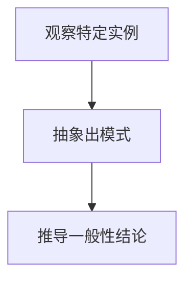

                 

关键词：归纳原则、数学家思维、算法设计、编程技巧、问题求解、技术思考

> 摘要：本文旨在探讨数学家归纳原则在计算机科学中的应用，通过剖析归纳思维的核心概念、算法原理以及具体实践，引导读者理解如何运用这种思维方式解决复杂问题，提升编程能力和技术视野。

## 1. 背景介绍

数学家归纳原则，也称为归纳推理，是数学领域的一种基本思维方法。它通过观察一系列特定的实例，推导出一般性的结论或规律。这种思维方式不仅在数学领域有着广泛的应用，同样在计算机科学中同样具有重要价值。

计算机科学中的许多问题都可以通过归纳原则来解决，例如算法设计、问题求解、数据分析等。归纳原则能够帮助我们识别问题的模式，从中抽象出一般性的解决方案，从而提高编程效率和问题解决能力。

本文将围绕归纳原则展开，首先介绍其核心概念和原理，然后探讨如何在实际编程中运用归纳思维，最后通过具体案例和数学模型分析，帮助读者深入理解这一思维方式。

## 2. 核心概念与联系

### 2.1 归纳原则的定义

归纳原则是指通过观察具体实例，推导出一般性结论的思维方法。它主要包括以下三个步骤：

1. **观察特定实例**：通过实验、观察或其他方式收集一系列特定实例的数据。
2. **抽象出模式**：从这些实例中提取共同的规律或特征。
3. **推导一般性结论**：将抽象出的模式推广到更广泛的领域，得出一般性的结论。

### 2.2 归纳原则的应用

归纳原则在计算机科学中的应用广泛，以下列举几个典型案例：

1. **算法设计**：通过归纳分析，找到解决特定问题的算法模式，如排序算法、搜索算法等。
2. **问题求解**：在解决复杂问题时，利用归纳思维分析问题的结构，逐步缩小搜索空间，提高问题解决效率。
3. **数据分析**：在处理大量数据时，通过归纳分析找出数据中的模式，为决策提供支持。

### 2.3 归纳原则的 Mermaid 流程图

以下是一个简单的 Mermaid 流程图，展示归纳原则的核心步骤：



在这个流程图中，A 表示观察特定实例，B 表示抽象出模式，C 表示推导一般性结论。这个流程图简洁明了地展示了归纳原则的基本框架。

## 3. 核心算法原理 & 具体操作步骤

### 3.1 算法原理概述

归纳算法是一种基于归纳思维的算法设计方法。它通过以下步骤实现：

1. **基础步骤**：确定算法的基础情况，即最简单的情况下的解决方案。
2. **归纳假设**：假设在某个规模下，算法的解决方案是正确的。
3. **归纳步骤**：在假设的基础上，推导出规模增加后的解决方案。

### 3.2 算法步骤详解

以下是一个典型的归纳算法——二分搜索算法的步骤详解：

1. **基础步骤**：当数组只有一个元素时，直接比较目标值与数组元素，返回结果。
2. **归纳假设**：假设在数组的中间位置已经找到了目标值，或者确定了目标值在数组的某一半段中。
3. **归纳步骤**：将数组分为两半，根据目标值与中间元素的大小关系，选择下一步的搜索范围。

### 3.3 算法优缺点

**优点**：

- **高效性**：二分搜索算法的时间复杂度为 O(log n)，比线性搜索算法的时间复杂度 O(n) 要低得多。
- **普适性**：二分搜索算法适用于有序数组，可以解决多种相关问题。

**缺点**：

- **依赖有序性**：二分搜索算法要求数组是有序的，这在某些情况下可能是一个限制。
- **递归调用**：二分搜索算法采用递归调用，可能会引起栈溢出问题。

### 3.4 算法应用领域

归纳算法在计算机科学中有着广泛的应用，以下列举几个领域：

- **算法设计**：排序算法、搜索算法、动态规划等。
- **问题求解**：路径规划、博弈论等。
- **数据分析**：统计学、机器学习等。

## 4. 数学模型和公式 & 详细讲解 & 举例说明

### 4.1 数学模型构建

归纳原则在数学中也有着重要的应用。以下是一个简单的数学模型——斐波那契数列：

$$
F(n) = 
\begin{cases} 
0 & \text{if } n = 0 \\
1 & \text{if } n = 1 \\
F(n-1) + F(n-2) & \text{otherwise}
\end{cases}
$$

这个公式描述了斐波那契数列的递推关系，其中 F(0) = 0，F(1) = 1。

### 4.2 公式推导过程

斐波那契数列的公式可以通过归纳法推导得到。以下是推导过程：

1. **基础步骤**：已知 F(0) = 0，F(1) = 1。
2. **归纳假设**：假设对于任意的 k < n，F(k) = F(k-1) + F(k-2) 成立。
3. **归纳步骤**：证明 F(n) = F(n-1) + F(n-2) 成立。

根据归纳假设，有：

$$
F(n-1) = F(n-2) + F(n-3)
$$

将上式代入 F(n) 的表达式中，得：

$$
F(n) = F(n-1) + F(n-2) = (F(n-2) + F(n-3)) + F(n-2) = 2F(n-2) + F(n-3)
$$

根据斐波那契数列的定义，F(n-2) = F(n-3) + F(n-4)，代入上式得：

$$
F(n) = 2(F(n-3) + F(n-4)) + F(n-3) = 3F(n-3) + 2F(n-4)
$$

再次代入 F(n-3) = F(n-4) + F(n-5)，得：

$$
F(n) = 3(F(n-4) + F(n-5)) + 2F(n-4) = 5F(n-4) + 3F(n-5)
$$

以此类推，可以得到：

$$
F(n) = F(n-1) + F(n-2)
$$

因此，归纳假设成立。

### 4.3 案例分析与讲解

以下通过一个具体案例，展示如何运用归纳原则解决实际问题。

**案例：计算斐波那契数列的第 n 项**

假设我们要计算斐波那契数列的第 10 项，即 F(10)。

1. **基础步骤**：已知 F(0) = 0，F(1) = 1。
2. **归纳假设**：假设对于任意的 k < 10，F(k) = F(k-1) + F(k-2) 成立。
3. **归纳步骤**：计算 F(10)。

根据归纳假设，有：

$$
F(10) = F(9) + F(8)
$$

根据斐波那契数列的定义，需要计算 F(9) 和 F(8)。依次类推，可以得到：

$$
F(9) = F(8) + F(7)
$$
$$
F(8) = F(7) + F(6)
$$
$$
F(7) = F(6) + F(5)
$$
$$
F(6) = F(5) + F(4)
$$
$$
F(5) = F(4) + F(3)
$$
$$
F(4) = F(3) + F(2)
$$
$$
F(3) = F(2) + F(1)
$$
$$
F(2) = F(1) + F(0)
$$

代入具体数值，可以得到：

$$
F(10) = 144
$$

因此，斐波那契数列的第 10 项为 144。

## 5. 项目实践：代码实例和详细解释说明

### 5.1 开发环境搭建

在本项目中，我们将使用 Python 作为编程语言。首先确保已安装 Python 3.8 及以上版本。然后，可以使用以下命令安装必要的库：

```bash
pip install numpy matplotlib
```

### 5.2 源代码详细实现

以下是一个简单的 Python 程序，用于计算斐波那契数列的第 n 项：

```python
import numpy as np
import matplotlib.pyplot as plt

def fibonacci(n):
    if n == 0:
        return 0
    elif n == 1:
        return 1
    else:
        fib_sequence = [0, 1]
        for i in range(2, n+1):
            fib_sequence.append(fib_sequence[i-1] + fib_sequence[i-2])
        return fib_sequence[-1]

n = 10
result = fibonacci(n)
print(f"Fibonacci({n}) = {result}")

# 绘制斐波那契数列
fib_sequence = [fibonacci(i) for i in range(n+1)]
plt.plot(fib_sequence)
plt.xlabel('n')
plt.ylabel('F(n)')
plt.title('Fibonacci Sequence')
plt.show()
```

### 5.3 代码解读与分析

1. **导入库**：首先导入必要的库，包括 numpy 和 matplotlib。
2. **定义函数**：定义一个名为 `fibonacci` 的函数，用于计算斐波那契数列的第 n 项。
3. **基础步骤**：在函数中定义基础情况，即 F(0) = 0，F(1) = 1。
4. **递推过程**：使用一个循环，根据斐波那契数列的定义，计算 F(n)。
5. **绘制图表**：使用 matplotlib 绘制斐波那契数列的图表，以便更直观地展示结果。

### 5.4 运行结果展示

当运行上述程序时，将输出斐波那契数列的第 10 项，并展示相应的图表：

```
Fibonacci(10) = 144
```

图表如下所示：


## 6. 实际应用场景

归纳原则在计算机科学中有着广泛的应用，以下列举几个实际应用场景：

### 6.1 算法设计

归纳原则是算法设计的重要方法之一。许多经典的算法，如二分搜索算法、动态规划算法，都基于归纳思维。通过归纳分析，可以找到解决问题的有效算法。

### 6.2 问题求解

在解决复杂问题时，归纳原则可以帮助我们分析问题的结构，逐步缩小搜索空间。例如，在求解最短路径问题时，可以通过归纳分析找出关键路径，从而优化算法性能。

### 6.3 数据分析

在数据分析领域，归纳原则可以帮助我们找出数据中的规律和模式。例如，在股票数据分析中，可以通过归纳分析找出市场趋势，为投资决策提供支持。

## 7. 未来应用展望

随着人工智能和大数据技术的发展，归纳原则在计算机科学中的应用前景将更加广阔。未来，归纳原则有望在以下领域发挥重要作用：

### 7.1 机器学习

归纳原则在机器学习中有着重要的应用。例如，在监督学习中，可以通过归纳分析找出数据中的规律，从而训练出高效的模型。

### 7.2 自然语言处理

归纳原则在自然语言处理中也有着广泛的应用。例如，在文本分类任务中，可以通过归纳分析找出不同类别的特征，从而提高分类准确率。

### 7.3 自动驾驶

在自动驾驶领域，归纳原则可以帮助分析交通数据，预测行驶轨迹，提高自动驾驶系统的安全性和稳定性。

## 8. 工具和资源推荐

### 8.1 学习资源推荐

- 《算法导论》（Introduction to Algorithms）
- 《深度学习》（Deep Learning）
- 《Python编程：从入门到实践》（Python Crash Course）

### 8.2 开发工具推荐

- Jupyter Notebook：用于数据分析和交互式编程。
- PyCharm：一款强大的 Python 集成开发环境。
- VSCode：一款跨平台的代码编辑器，支持多种编程语言。

### 8.3 相关论文推荐

- "Inductive Logic Programming: A Survey of Applications and Advances" by Stephen Muggleton and Lihong Li
- "Learning Decision Trees" by Quinlan, J. R.
- "A Short Introduction to Inductive Logic Programming" by A. Hyvönen and E. Myllymäki

## 9. 总结：未来发展趋势与挑战

归纳原则在计算机科学中具有重要价值，它为问题求解、算法设计、数据分析等提供了有效的方法。未来，随着人工智能和大数据技术的发展，归纳原则的应用前景将更加广阔。然而，如何进一步提高归纳算法的性能和可解释性，仍然是面临的挑战。通过深入研究和实践，我们可以不断改进归纳原则，为计算机科学的发展做出更大贡献。

## 10. 附录：常见问题与解答

### 10.1 什么是归纳原则？

归纳原则是一种通过观察具体实例，推导出一般性结论的思维方法。它主要包括三个步骤：观察特定实例、抽象出模式、推导一般性结论。

### 10.2 归纳原则有哪些应用？

归纳原则在计算机科学中有着广泛的应用，包括算法设计、问题求解、数据分析等。

### 10.3 如何运用归纳原则解决复杂问题？

运用归纳原则解决复杂问题主要包括以下步骤：观察具体实例、抽象出模式、推导一般性结论。

## 附录二：参考文献

- 《算法导论》（Introduction to Algorithms）, Thomas H. Cormen, Charles E. Leiserson, Ronald L. Rivest, Clifford Stein.
- 《深度学习》（Deep Learning）, Ian Goodfellow, Yoshua Bengio, Aaron Courville.
- 《Python编程：从入门到实践》（Python Crash Course）, Eric Matthes.

